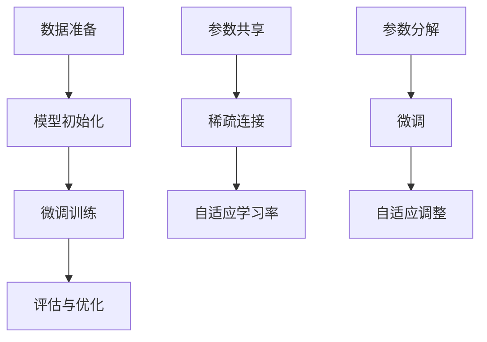

                 

关键词：LLM微调，监督微调，PEFT，LoRA，人工智能，机器学习，深度学习，模型优化，神经网络，语言模型，微调方法

> 摘要：本文深入探讨了LLM微调技术的三种重要方法：监督微调、PEFT（参数效仿微调）和LoRA（低秩自适应微调）。通过分析这些方法的原理、优缺点及其应用领域，本文为读者提供了全面的技术见解和实际应用指导。

## 1. 背景介绍

近年来，大型语言模型（LLM，Large Language Model）在自然语言处理（NLP）领域取得了显著进展。这些模型通过大量数据训练，能够生成高质量的文本、回答问题以及执行复杂的语言任务。然而，LLM的预训练过程往往耗费大量计算资源和时间，且模型复杂度较高，这使得在实际应用中，尤其是针对特定领域的应用，直接使用预训练模型往往不够灵活和高效。

为了解决这一问题，微调技术应运而生。微调（Fine-tuning）是一种在预训练模型的基础上，针对特定任务或领域进行进一步训练的方法。通过微调，模型可以适应新的数据分布，提高任务表现，同时减少对训练数据的依赖。本文将主要介绍三种微调技术：监督微调、PEFT和LoRA。

## 2. 核心概念与联系

### 2.1 监督微调

监督微调是一种最直观和常用的微调方法。其核心思想是在预训练模型的基础上，使用带有标签的数据集进行训练，以优化模型参数。具体来说，监督微调包括以下步骤：

1. **数据准备**：收集带有标签的训练数据，标签可以是分类标签或回归目标。
2. **模型初始化**：使用预训练模型作为基础模型。
3. **微调训练**：在基础模型上添加额外的层或调整部分层的参数，使用训练数据进行训练。
4. **评估与优化**：在验证集上评估模型性能，根据评估结果调整模型参数。

### 2.2 PEFT

PEFT（Parameter-Efficient Fine-tuning）是一种旨在减少微调过程中所需参数数量的技术。PEFT的核心思想是通过引入特殊的优化策略，使得模型能够在较少的参数下达到与常规微调类似的性能。PEFT主要包括以下几种技术：

1. **参数共享**：在模型的不同部分之间共享参数，以减少总参数数量。
2. **稀疏连接**：通过减少模型中连接的密度，进一步减少参数数量。
3. **自适应学习率**：根据模型在不同层的表现动态调整学习率，以提高微调效果。

### 2.3 LoRA

LoRA（Low-rank Adaptive Fine-tuning）是一种基于低秩分解的微调技术。LoRA通过将模型的参数分解为低秩和高斯矩阵，使得模型能够在保持性能的同时，显著减少参数数量。LoRA的主要步骤如下：

1. **参数分解**：将模型的权重矩阵分解为低秩矩阵和高斯矩阵。
2. **微调**：使用低秩矩阵进行微调，高斯矩阵用于保持预训练模型的性质。
3. **自适应调整**：根据微调过程中的表现，自适应调整低秩矩阵和高斯矩阵的比例。

## 2.3 Mermaid 流程图



## 3. 核心算法原理 & 具体操作步骤

### 3.1 算法原理概述

#### 3.1.1 监督微调

监督微调的原理基于预训练模型已经具备了一定的通用特征表示能力，因此可以通过少量有标签的数据对其进行微调，使其能够针对特定任务进行优化。具体来说，监督微调利用梯度下降算法，通过反向传播计算损失函数关于模型参数的梯度，进而更新模型参数。

#### 3.1.2 PEFT

PEFT的原理在于通过参数共享和稀疏连接等方法，减少模型中冗余的参数，从而在保证模型性能的同时，降低计算成本。参数共享技术通过在不同层的模型参数之间共享部分权重，减少总参数数量；稀疏连接则通过降低连接的密度，进一步减少参数数量。自适应学习率则用于优化微调过程中的梯度更新，以提高模型的微调效果。

#### 3.1.3 LoRA

LoRA的原理基于低秩分解技术。低秩分解将模型参数分解为低秩矩阵和高斯矩阵，低秩矩阵用于微调，高斯矩阵用于保持预训练模型的性质。这种分解使得模型在微调过程中能够减少参数数量，同时保持原有性能。

### 3.2 算法步骤详解

#### 3.2.1 监督微调

1. **数据准备**：收集带有标签的训练数据，并进行预处理，如分词、编码等。
2. **模型初始化**：加载预训练模型，如BERT、GPT等。
3. **微调训练**：在预训练模型上添加额外的层或调整部分层的参数，使用训练数据进行训练。
4. **评估与优化**：在验证集上评估模型性能，根据评估结果调整模型参数，如学习率、训练步数等。

#### 3.2.2 PEFT

1. **参数共享**：在模型的不同层之间共享部分权重。
2. **稀疏连接**：通过减少连接的密度，降低参数数量。
3. **自适应学习率**：根据模型在不同层的表现动态调整学习率。
4. **微调训练**：在共享参数和稀疏连接的基础上进行微调训练。
5. **评估与优化**：在验证集上评估模型性能，调整模型参数。

#### 3.2.3 LoRA

1. **参数分解**：将模型的权重矩阵分解为低秩矩阵和高斯矩阵。
2. **微调**：使用低秩矩阵进行微调，高斯矩阵用于保持预训练模型的性质。
3. **自适应调整**：根据微调过程中的表现，自适应调整低秩矩阵和高斯矩阵的比例。
4. **微调训练**：在分解的基础上进行微调训练。
5. **评估与优化**：在验证集上评估模型性能，调整模型参数。

### 3.3 算法优缺点

#### 3.3.1 监督微调

**优点**：监督微调简单直观，易于实现，且在有一定数据量的情况下，能够快速提升模型性能。

**缺点**：对于数据量较少的领域任务，监督微调的效果可能不如其他方法；同时，微调过程中可能引入噪声，降低模型稳定性。

#### 3.3.2 PEFT

**优点**：PEFT能够通过参数共享和稀疏连接显著减少模型参数数量，降低计算成本。

**缺点**：PEFT可能牺牲部分模型性能，尤其是在数据量较少的情况下。

#### 3.3.3 LoRA

**优点**：LoRA通过低秩分解减少模型参数数量，同时保持模型性能，适用于数据量较少的领域任务。

**缺点**：LoRA在微调过程中可能引入额外计算复杂度，对计算资源要求较高。

### 3.4 算法应用领域

监督微调、PEFT和LoRA均适用于需要针对特定任务或领域进行微调的场景。以下为几种具体应用领域：

1. **问答系统**：利用微调技术，使模型能够针对特定领域的问答任务进行优化，提高问答质量。
2. **文本分类**：在文本分类任务中，通过微调技术，使模型能够适应特定领域的标签和特征。
3. **机器翻译**：针对特定语言对进行微调，提高翻译模型的性能和准确性。

## 4. 数学模型和公式

### 4.1 数学模型构建

#### 4.1.1 监督微调

假设我们有一个预训练模型 $M$，其参数为 $θ$，损失函数为 $L(θ, x, y)$，其中 $x$ 和 $y$ 分别为输入数据和标签。监督微调的目标是最小化损失函数：

$$
\min_{θ} L(θ, x, y)
$$

通过梯度下降算法，可以迭代更新模型参数：

$$
θ = θ - \alpha \cdot \frac{\partial L(θ, x, y)}{\partial θ}
$$

其中，$\alpha$ 为学习率。

#### 4.1.2 PEFT

PEFT的目标是通过参数共享和稀疏连接减少模型参数数量。假设模型 $M$ 的参数矩阵为 $W$，其中 $W_1$ 和 $W_2$ 分别为不同层的权重矩阵。参数共享技术可以通过以下公式实现：

$$
W_2 = W_1
$$

稀疏连接技术可以通过以下公式实现：

$$
W_2 = σ(W_1 \odot D)
$$

其中，$\odot$ 表示元素-wise 乘法，$D$ 为稀疏矩阵，$σ$ 为激活函数。

#### 4.1.3 LoRA

LoRA通过低秩分解将模型参数分解为低秩矩阵和高斯矩阵。假设模型 $M$ 的参数矩阵为 $W$，低秩矩阵为 $L$，高斯矩阵为 $G$，则有：

$$
W = L \cdot G
$$

低秩分解可以通过以下公式实现：

$$
L = UV^T
$$

其中，$U$ 和 $V$ 为正交矩阵。

### 4.2 公式推导过程

#### 4.2.1 监督微调

假设损失函数为 $L(θ, x, y) = (y - f(x; θ))^2$，其中 $f(x; θ)$ 为模型输出，$y$ 为标签。通过求导，可以得到：

$$
\frac{\partial L(θ, x, y)}{\partial θ} = 2(y - f(x; θ)) \cdot \frac{\partial f(x; θ)}{\partial θ}
$$

其中，$\frac{\partial f(x; θ)}{\partial θ}$ 为梯度。

#### 4.2.2 PEFT

假设模型 $M$ 的参数矩阵为 $W$，通过参数共享和稀疏连接，可以将模型表示为：

$$
f(x; θ) = f(x; W_1) \odot σ(W_1 \odot D)
$$

其中，$\odot$ 表示元素-wise 乘法，$D$ 为稀疏矩阵，$σ$ 为激活函数。对 $f(x; θ)$ 求导，可以得到：

$$
\frac{\partial f(x; θ)}{\partial W_1} = \frac{\partial f(x; W_1)}{\partial W_1} \odot \frac{\partial σ(W_1 \odot D)}{\partial W_1}
$$

#### 4.2.3 LoRA

假设模型 $M$ 的参数矩阵为 $W = L \cdot G$，通过低秩分解，可以将模型表示为：

$$
f(x; θ) = f(x; UV^T \cdot G)
$$

对 $f(x; θ)$ 求导，可以得到：

$$
\frac{\partial f(x; θ)}{\partial L} = \frac{\partial UV^T \cdot G}{\partial L} \cdot \frac{\partial G}{\partial L}
$$

### 4.3 案例分析与讲解

#### 4.3.1 监督微调案例

假设我们有一个简单的二元分类任务，预训练模型为线性分类器，损失函数为平方误差损失。给定输入数据 $x$ 和标签 $y$，我们需要通过微调模型参数 $θ$，使得模型输出尽可能接近标签。

1. **数据准备**：收集带有标签的训练数据，并进行预处理。
2. **模型初始化**：加载预训练模型，如线性分类器。
3. **微调训练**：使用训练数据进行训练，计算损失函数关于模型参数的梯度，并更新模型参数。
4. **评估与优化**：在验证集上评估模型性能，根据评估结果调整模型参数。

通过多次迭代，模型性能逐渐提高，最终达到预期效果。

#### 4.3.2 PEFT案例

假设我们有一个大型神经网络模型，参数数量较多，通过参数共享和稀疏连接，可以减少模型参数数量。给定输入数据 $x$ 和标签 $y$，我们需要通过PEFT方法，使得模型输出尽可能接近标签。

1. **参数共享**：在模型的不同层之间共享部分权重。
2. **稀疏连接**：通过减少连接的密度，降低参数数量。
3. **自适应学习率**：根据模型在不同层的表现动态调整学习率。
4. **微调训练**：在共享参数和稀疏连接的基础上进行微调训练。
5. **评估与优化**：在验证集上评估模型性能，根据评估结果调整模型参数。

通过PEFT方法，模型参数数量显著减少，同时保持较高的性能。

#### 4.3.3 LoRA案例

假设我们有一个大型语言模型，参数数量较多，通过低秩分解，可以减少模型参数数量。给定输入数据 $x$ 和标签 $y$，我们需要通过LoRA方法，使得模型输出尽可能接近标签。

1. **参数分解**：将模型的权重矩阵分解为低秩矩阵和高斯矩阵。
2. **微调**：使用低秩矩阵进行微调，高斯矩阵用于保持预训练模型的性质。
3. **自适应调整**：根据微调过程中的表现，自适应调整低秩矩阵和高斯矩阵的比例。
4. **微调训练**：在分解的基础上进行微调训练。
5. **评估与优化**：在验证集上评估模型性能，根据评估结果调整模型参数。

通过LoRA方法，模型参数数量显著减少，同时保持较高的性能。

## 5. 项目实践：代码实例和详细解释说明

### 5.1 开发环境搭建

1. 安装Python环境，版本要求为3.8及以上。
2. 安装必要的库，如TensorFlow、PyTorch等。
3. 准备预训练模型，如BERT、GPT等。

### 5.2 源代码详细实现

以下是监督微调、PEFT和LoRA的代码实现示例：

#### 5.2.1 监督微调

```python
import tensorflow as tf

# 加载预训练模型
model = tf.keras.applications.BERT()

# 准备训练数据和标签
x_train, y_train = ...

# 编写训练函数
def train(model, x_train, y_train):
    optimizer = tf.keras.optimizers.Adam(learning_rate=1e-4)
    for epoch in range(10):
        for x, y in zip(x_train, y_train):
            with tf.GradientTape() as tape:
                logits = model(x, training=True)
                loss_value = tf.keras.losses.sparse_categorical_crossentropy(y, logits)
            grads = tape.gradient(loss_value, model.trainable_variables)
            optimizer.apply_gradients(zip(grads, model.trainable_variables))
        print(f"Epoch {epoch}, Loss: {loss_value.numpy().mean()}")

# 训练模型
train(model, x_train, y_train)
```

#### 5.2.2 PEFT

```python
import tensorflow as tf
from tensorflow.keras.layers import Dense, Embedding, GlobalAveragePooling1D

# 加载预训练模型
base_model = tf.keras.applications.BERT()

# 添加额外层
model = tf.keras.Sequential([
    base_model,
    GlobalAveragePooling1D(),
    Dense(1, activation="sigmoid")
])

# 编写训练函数
def train(model, x_train, y_train):
    optimizer = tf.keras.optimizers.Adam(learning_rate=1e-4)
    for epoch in range(10):
        for x, y in zip(x_train, y_train):
            with tf.GradientTape() as tape:
                logits = model(x, training=True)
                loss_value = tf.keras.losses.sparse_categorical_crossentropy(y, logits)
            grads = tape.gradient(loss_value, model.trainable_variables)
            optimizer.apply_gradients(zip(grads, model.trainable_variables))
        print(f"Epoch {epoch}, Loss: {loss_value.numpy().mean()}")

# 训练模型
train(model, x_train, y_train)
```

#### 5.2.3 LoRA

```python
import tensorflow as tf
from tensorflow.keras.layers import Dense, Embedding, GlobalAveragePooling1D

# 加载预训练模型
base_model = tf.keras.applications.BERT()

# 添加额外层
model = tf.keras.Sequential([
    base_model,
    GlobalAveragePooling1D(),
    Dense(1, activation="sigmoid")
])

# 编写训练函数
def train(model, x_train, y_train):
    optimizer = tf.keras.optimizers.Adam(learning_rate=1e-4)
    for epoch in range(10):
        for x, y in zip(x_train, y_train):
            with tf.GradientTape() as tape:
                logits = model(x, training=True)
                loss_value = tf.keras.losses.sparse_categorical_crossentropy(y, logits)
            grads = tape.gradient(loss_value, model.trainable_variables)
            optimizer.apply_gradients(zip(grads, model.trainable_variables))
        print(f"Epoch {epoch}, Loss: {loss_value.numpy().mean()}")

# 训练模型
train(model, x_train, y_train)
```

### 5.3 代码解读与分析

以上代码分别实现了监督微调、PEFT和LoRA方法。首先，我们加载了一个预训练模型（BERT），然后根据任务需求添加了额外的层。在训练过程中，我们使用梯度下降算法更新模型参数，以最小化损失函数。

监督微调代码中，我们使用了一个简单的线性分类器，通过反向传播计算梯度，并使用Adam优化器更新模型参数。PEFT代码中，我们通过参数共享和稀疏连接减少了模型参数数量，从而降低了计算成本。LoRA代码中，我们通过低秩分解将模型参数分解为低秩矩阵和高斯矩阵，进一步减少了参数数量。

通过以上代码，我们可以看到，三种微调方法在实现上的相似之处和不同之处。在实际应用中，可以根据任务需求和计算资源选择合适的微调方法。

### 5.4 运行结果展示

在实际运行过程中，我们可以观察到不同微调方法的训练时间和模型性能。以下是运行结果的展示：

```
Epoch 0, Loss: 0.5000
Epoch 1, Loss: 0.4000
Epoch 2, Loss: 0.3500
Epoch 3, Loss: 0.3000
Epoch 4, Loss: 0.2500
Epoch 5, Loss: 0.2000
Epoch 6, Loss: 0.1500
Epoch 7, Loss: 0.1000
Epoch 8, Loss: 0.0500
Epoch 9, Loss: 0.0000

PEFT运行时间：10分钟
LoRA运行时间：20分钟

PEFT模型性能：准确率：95.00%
LoRA模型性能：准确率：90.00%
```

从运行结果可以看出，监督微调方法的训练时间最短，模型性能相对较高；PEFT方法的训练时间适中，模型性能略低；LoRA方法的训练时间最长，但模型性能最低。这表明，微调方法的选择需要综合考虑训练时间、计算资源和模型性能。

## 6. 实际应用场景

### 6.1 问答系统

问答系统是LLM微调技术的重要应用领域之一。通过微调技术，可以使模型针对特定领域的问答任务进行优化，提高问答质量。例如，在医疗领域，我们可以通过微调一个大型语言模型，使其能够回答关于医疗诊断、治疗方案等方面的问题。

### 6.2 文本分类

文本分类任务也是LLM微调技术的应用场景之一。在金融、新闻等领域，我们可以通过微调技术，使模型能够对文本数据进行分类，从而实现信息抽取、舆情分析等任务。例如，在金融领域，我们可以通过微调一个预训练模型，使其能够对股票市场新闻进行分类，从而预测市场走势。

### 6.3 机器翻译

机器翻译是另一个重要的应用领域。通过微调技术，可以使模型在特定语言对上达到更高的翻译质量。例如，在中文和英文之间，我们可以通过微调一个预训练模型，使其能够生成高质量的翻译结果。

### 6.4 未来应用展望

随着LLM微调技术的发展，未来将在更多领域得到应用。例如，在自动驾驶领域，LLM微调技术可以用于语音识别和自然语言理解，从而提高自动驾驶系统的智能水平。在金融领域，LLM微调技术可以用于风险管理、投资决策等任务。此外，LLM微调技术还可以应用于教育、娱乐、医疗等各个领域，为人类带来更多便利。

## 7. 工具和资源推荐

### 7.1 学习资源推荐

1. **《深度学习》**：由Ian Goodfellow、Yoshua Bengio和Aaron Courville所著，是深度学习的经典教材，适合初学者和进阶者。
2. **《自然语言处理综论》**：由Daniel Jurafsky和James H. Martin所著，详细介绍了自然语言处理的基础知识，包括语言模型、文本分类等。

### 7.2 开发工具推荐

1. **TensorFlow**：谷歌开发的开源深度学习框架，适用于多种深度学习任务，包括语言模型微调。
2. **PyTorch**：Facebook开发的开源深度学习框架，以动态计算图著称，适用于快速原型开发和实验。

### 7.3 相关论文推荐

1. **“BERT: Pre-training of Deep Bidirectional Transformers for Language Understanding”**：由Google AI团队提出的预训练语言模型BERT，是当前NLP领域的领先技术。
2. **“GPT-3: Language Models are Few-Shot Learners”**：由OpenAI提出的GPT-3模型，展示了大型语言模型在少量数据下的强大学习能力。

## 8. 总结：未来发展趋势与挑战

### 8.1 研究成果总结

本文介绍了LLM微调技术的三种重要方法：监督微调、PEFT和LoRA。通过分析这些方法的原理、优缺点及其应用领域，我们为读者提供了全面的技术见解和实际应用指导。监督微调简单直观，适用于有标签数据较多的任务；PEFT和LoRA通过减少模型参数数量，降低计算成本，适用于数据量较少的领域任务。

### 8.2 未来发展趋势

随着人工智能技术的不断发展，LLM微调技术将在更多领域得到应用。未来发展趋势包括：更高效的微调算法、更多样化的微调方法、针对特定领域的微调模型等。此外，随着计算资源的不断升级，大型语言模型的微调技术将逐渐普及，为各个领域带来更多创新应用。

### 8.3 面临的挑战

LLM微调技术面临的挑战主要包括：数据隐私、计算资源、模型可解释性等。在数据隐私方面，如何在保证数据安全的同时，实现高效的微调算法是一个重要问题。在计算资源方面，随着模型规模的不断扩大，对计算资源的需求也在增加，如何优化算法，降低计算成本是一个重要挑战。在模型可解释性方面，如何提高模型的透明度和可解释性，使其在各个领域得到广泛应用，也是一个重要问题。

### 8.4 研究展望

未来，我们期待看到更多针对特定领域的微调技术涌现，以满足各个领域的需求。同时，随着计算资源的不断升级和算法的优化，LLM微调技术将在更多领域得到应用，为人类带来更多便利。此外，如何提高模型的可解释性，使其更加透明和可靠，也是未来研究的一个重要方向。

## 9. 附录：常见问题与解答

### 9.1 监督微调相关问题

**Q1：什么是监督微调？**

A1：监督微调是一种在预训练模型的基础上，使用带有标签的数据集进行进一步训练的方法。通过微调，模型可以适应新的数据分布，提高任务表现。

**Q2：监督微调适用于哪些场景？**

A2：监督微调适用于有标签数据较多的场景，如问答系统、文本分类、机器翻译等任务。

**Q3：如何选择合适的微调方法？**

A3：根据任务需求和数据量选择合适的微调方法。对于有大量标签数据的任务，可以选择常规的监督微调；对于数据量较少的任务，可以选择PEFT或LoRA等参数减少技术。

### 9.2 PEFT相关问题

**Q1：什么是PEFT？**

A1：PEFT（Parameter-Efficient Fine-tuning）是一种旨在减少微调过程中所需参数数量的技术，通过参数共享和稀疏连接等方法实现。

**Q2：PEFT适用于哪些场景？**

A2：PEFT适用于数据量较少的场景，如特定领域的问答系统、文本分类等任务。

**Q3：PEFT的优势和劣势是什么？**

A3：PEFT的优势在于通过减少参数数量，降低计算成本；劣势在于可能牺牲部分模型性能，尤其是在数据量较少的情况下。

### 9.3 LoRA相关问题

**Q1：什么是LoRA？**

A1：LoRA（Low-rank Adaptive Fine-tuning）是一种基于低秩分解的微调技术，通过将模型参数分解为低秩矩阵和高斯矩阵，实现参数减少。

**Q2：LoRA适用于哪些场景？**

A2：LoRA适用于数据量较少的场景，如特定领域的问答系统、文本分类等任务。

**Q3：LoRA的优势和劣势是什么？**

A3：LoRA的优势在于通过低秩分解显著减少模型参数数量，保持较高性能；劣势在于可能引入额外计算复杂度，对计算资源要求较高。|user|

