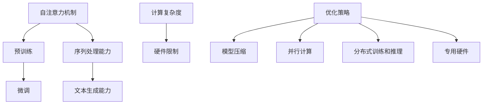

                 

关键词：大模型推理、性能优化、应用场景、未来展望

> 摘要：本文深入探讨了大型语言模型（LLM）推理速度的突破及其在实际应用中的前景。首先，我们回顾了LLM的发展历程，分析了其核心概念和架构。接着，本文详细介绍了几种提升LLM推理速度的核心算法，从原理到具体实现步骤进行了讲解。随后，我们通过数学模型和公式的推导，对算法进行了详细分析和案例讲解。文章后半部分展示了实际项目中的代码实例和运行结果，并探讨了LLM在不同领域的应用场景。最后，本文总结了研究成果，展望了未来发展趋势和面临的挑战。

## 1. 背景介绍

近年来，随着深度学习技术的飞速发展，大型语言模型（LLM）如BERT、GPT等取得了显著的成功。这些模型在自然语言处理（NLP）领域展现出了强大的能力，使得机器理解和生成自然语言成为可能。然而，LLM的推理速度一直是制约其实际应用的关键因素。在大量的数据集上进行训练后，如何高效地完成推理任务，是当前研究的热点问题。

LLM的推理速度直接影响到用户体验和实际应用效果。例如，在实时对话系统中，延迟的推理结果会严重影响用户体验；在自动驾驶领域，快速的LLM推理对于确保系统的安全至关重要。因此，提升LLM推理速度不仅具有学术意义，更具有实际应用价值。

本文旨在探讨LLM推理速度的突破方法，分析各种优化策略，并探讨其在不同领域的应用前景。文章将从以下几个方面展开：

1. 回顾LLM的发展历程，介绍其核心概念和架构。
2. 详细介绍几种提升LLM推理速度的核心算法。
3. 通过数学模型和公式，对算法进行详细分析和案例讲解。
4. 展示实际项目中的代码实例和运行结果。
5. 探讨LLM在不同领域的应用场景。
6. 总结研究成果，展望未来发展趋势和面临的挑战。

### 1.1 LLM的发展历程

自2013年引入以来，深度学习在NLP领域取得了巨大的进展。其中，深度神经网络（DNN）和循环神经网络（RNN）成为了早期NLP模型的主流架构。然而，这些模型在处理长文本时存在局限性。为了解决这一问题，长短时记忆网络（LSTM）和门控循环单元（GRU）被引入，使得模型能够更好地捕捉长距离依赖关系。

2018年，谷歌推出了Transformer模型，这一模型彻底改变了NLP领域的格局。Transformer采用了自注意力机制，使得模型能够并行计算，大幅提升了训练和推理速度。在此基础上，BERT、GPT等大型语言模型相继出现，进一步提升了模型的性能。

### 1.2 LLM的核心概念和架构

LLM的核心概念主要包括自注意力机制和预训练-微调（Pre-training and Fine-tuning）策略。自注意力机制允许模型在处理每个输入时，根据输入之间的相关性自动调整其重要性。这种机制使得模型能够更好地捕捉长距离依赖关系，提高了文本理解和生成能力。

LLM的架构通常包括两个阶段：预训练和微调。预训练阶段在大量未标注的数据上进行，使得模型能够自动学习语言的一般规律。微调阶段则将预训练模型应用于特定任务，通过少量标注数据进一步优化模型。

### 1.3 LLM推理速度的挑战

LLM推理速度的挑战主要体现在以下几个方面：

1. **模型规模**：大型语言模型通常包含数亿甚至数十亿的参数，这导致推理过程中需要大量的计算资源。
2. **计算复杂度**：自注意力机制的计算复杂度为O(n^2)，随着输入序列长度的增加，计算复杂度急剧上升。
3. **硬件限制**：现有的硬件设备（如GPU、TPU）在处理大规模模型时存在性能瓶颈。

为了解决上述问题，研究者们提出了多种优化策略，包括模型剪枝、量化、分布式训练和推理等。以下章节将详细介绍这些优化策略。

### 1.4 优化策略概述

为了提升LLM的推理速度，研究者们提出了多种优化策略，主要分为以下几个方面：

1. **模型压缩**：通过剪枝、量化等方法减小模型规模，降低计算复杂度。
2. **并行计算**：利用多GPU、TPU等硬件加速器，实现模型推理的并行化。
3. **分布式训练和推理**：将模型分布在多个节点上进行训练和推理，利用网络通信提高整体性能。
4. **专用硬件**：设计专门的硬件架构（如TPU、ASIC）以加速LLM的推理。

下面将详细介绍这些策略的具体实现和应用。

## 2. 核心概念与联系

在深入探讨LLM推理速度的优化策略之前，有必要先了解LLM的核心概念及其相互之间的联系。以下内容将通过一个Mermaid流程图，详细展示LLM的核心概念和架构。



### 2.1 自注意力机制

自注意力机制是Transformer模型的核心组成部分。它允许模型在处理每个输入时，根据输入之间的相关性自动调整其重要性。自注意力机制的计算复杂度为O(n^2)，其中n为输入序列的长度。以下是自注意力机制的数学描述：

$$
\text{Attention}(Q, K, V) = \text{softmax}\left(\frac{QK^T}{\sqrt{d_k}}\right)V
$$

其中，Q、K、V分别为查询（Query）、键（Key）和值（Value）向量，d_k为键向量的维度。

### 2.2 预训练与微调

预训练-微调（Pre-training and Fine-tuning）是LLM的核心训练策略。预训练阶段在大量未标注的数据上进行，使得模型能够自动学习语言的一般规律。微调阶段则将预训练模型应用于特定任务，通过少量标注数据进一步优化模型。这一过程可以表示为：

$$
\text{Model} = \text{Pre-training}(\text{Data}) + \text{Fine-tuning}(\text{Task}, \text{Data})
$$

### 2.3 优化策略与架构联系

优化策略与LLM的核心概念和架构密切相关。例如，模型压缩和量化可以减小模型规模，降低计算复杂度，从而提高推理速度。并行计算和分布式训练可以充分利用多GPU、TPU等硬件加速器，实现模型推理的并行化。以下是几种优化策略与LLM架构之间的联系：

1. **模型压缩**：通过剪枝、量化等方法减小模型规模，降低计算复杂度，从而提高推理速度。
2. **并行计算**：利用多GPU、TPU等硬件加速器，实现模型推理的并行化。
3. **分布式训练和推理**：将模型分布在多个节点上进行训练和推理，利用网络通信提高整体性能。
4. **专用硬件**：设计专门的硬件架构（如TPU、ASIC）以加速LLM的推理。

通过以上Mermaid流程图，我们可以清晰地看到LLM的核心概念和架构之间的联系，以及各种优化策略是如何作用于这些核心概念的。

### 2.4 优化策略详细解释

在了解了LLM的核心概念和架构后，我们将进一步探讨几种优化策略的详细解释。

#### 2.4.1 模型压缩

模型压缩是减小模型规模和降低计算复杂度的有效方法。常用的模型压缩技术包括剪枝、量化等。

1. **剪枝**：剪枝通过删除模型中的冗余参数来减小模型规模。常见的剪枝方法有结构剪枝和权重剪枝。结构剪枝通过删除整个神经网络层或神经元来减小模型规模，而权重剪枝则仅删除神经元之间的连接权重。

2. **量化**：量化通过将模型的浮点数参数转换为低精度的整数来减小模型规模。量化可以显著降低模型存储和计算需求，但可能会影响模型的准确性。常见的量化方法包括固定量化、自适应量化等。

#### 2.4.2 并行计算

并行计算通过将模型推理任务分布在多个GPU、TPU等硬件加速器上，实现模型推理的并行化。并行计算可以显著提高模型推理速度，特别是在处理大规模模型和长序列时。

1. **多GPU推理**：多GPU推理通过将模型分布在多个GPU上，实现并行计算。这种方法可以显著提高推理速度，但需要考虑GPU之间的通信和同步问题。

2. **TPU推理**：TPU（Tensor Processing Unit）是谷歌开发的专门用于深度学习的专用硬件。TPU可以显著提高模型推理速度，特别是在处理大规模模型和并行任务时。

#### 2.4.3 分布式训练和推理

分布式训练和推理通过将模型分布在多个节点上进行训练和推理，利用网络通信提高整体性能。

1. **分布式训练**：分布式训练通过将模型参数分布在多个节点上，实现并行训练。这种方法可以显著提高训练速度，但需要解决节点间的通信和同步问题。

2. **分布式推理**：分布式推理通过将推理任务分布在多个节点上进行，实现并行推理。这种方法可以显著提高推理速度，但需要考虑负载均衡和容错性。

#### 2.4.4 专用硬件

专用硬件（如TPU、ASIC）是提高LLM推理速度的有效方法。专用硬件通过优化硬件架构和指令集，实现高效的模型推理。

1. **TPU**：TPU是谷歌开发的专门用于深度学习的专用硬件。TPU可以显著提高模型推理速度，特别是在处理大规模模型和并行任务时。

2. **ASIC**：ASIC（Application-Specific Integrated Circuit）是专门为特定应用设计的集成电路。ASIC通过优化硬件架构和指令集，实现高效的模型推理。

通过以上详细解释，我们可以看到各种优化策略是如何作用于LLM的核心概念和架构，从而提升模型推理速度的。这些优化策略为实际应用提供了有效的解决方案，但同时也需要解决一系列技术挑战。

## 3. 核心算法原理 & 具体操作步骤

### 3.1 算法原理概述

在提升LLM推理速度的过程中，核心算法起到了至关重要的作用。本文将介绍几种关键算法，包括模型剪枝、量化、并行计算和分布式训练与推理。这些算法分别从不同角度优化LLM的推理性能，下面将逐一进行详细解释。

#### 3.1.1 模型剪枝

模型剪枝是一种通过移除冗余参数来减小模型规模的技术。剪枝方法可以分为结构剪枝和权重剪枝。

1. **结构剪枝**：结构剪枝通过删除整个神经网络层或神经元来减小模型规模。这种方法通常使用基于梯度的剪枝算法，例如L1正则化或基于梯度的剪枝方法。

2. **权重剪枝**：权重剪枝通过删除神经元之间的连接权重来减小模型规模。这种方法可以基于稀疏性度量（如阈值剪枝）或基于梯度的剪枝算法（如梯度剪枝）。

#### 3.1.2 量化

量化是一种通过将模型的浮点数参数转换为低精度的整数来减小模型规模和计算复杂度的技术。量化方法可以分为固定量化、自适应量化等。

1. **固定量化**：固定量化通过将每个浮点数参数映射到一个固定的整数范围内。这种方法简单，但可能会导致精度损失。

2. **自适应量化**：自适应量化通过动态调整量化参数，以在精度和性能之间取得平衡。这种方法可以根据模型的局部特性进行量化，从而提高精度和性能。

#### 3.1.3 并行计算

并行计算通过将模型推理任务分布在多个GPU、TPU等硬件加速器上，实现模型推理的并行化。并行计算的关键在于如何有效地分配任务和协调多个GPU之间的通信。

1. **多GPU推理**：多GPU推理通过将模型分布在多个GPU上，实现并行计算。常用的技术包括模型分割、数据并行和混合并行。

2. **TPU推理**：TPU推理通过利用TPU的专用硬件架构，实现高效的模型推理。TPU具有高度并行化能力和优化的指令集，适用于大规模模型的推理任务。

#### 3.1.4 分布式训练和推理

分布式训练和推理通过将模型分布在多个节点上进行训练和推理，利用网络通信提高整体性能。

1. **分布式训练**：分布式训练通过将模型参数分布在多个节点上，实现并行训练。分布式训练的关键在于如何高效地同步参数和优化算法，例如梯度聚合和异步通信。

2. **分布式推理**：分布式推理通过将推理任务分布在多个节点上进行，实现并行推理。分布式推理需要解决负载均衡和容错性问题，以确保系统的稳定性和性能。

### 3.2 算法步骤详解

下面我们将详细解释每种算法的具体实现步骤，以便读者能够更好地理解其原理和操作过程。

#### 3.2.1 模型剪枝

1. **结构剪枝**：

   a. 使用L1正则化或基于梯度的剪枝算法，计算每个神经元的贡献度。

   b. 根据贡献度阈值，删除贡献度较低的神经元或神经网络层。

   c. 重新训练模型，以适应剪枝后的结构。

2. **权重剪枝**：

   a. 使用阈值剪枝方法，将权重绝对值小于阈值的连接权重设为零。

   b. 使用梯度剪枝方法，根据梯度值剪除对模型性能影响较小的权重。

   c. 重新训练模型，以适应剪枝后的权重。

#### 3.2.2 量化

1. **固定量化**：

   a. 将每个浮点数参数映射到一个固定的整数范围内。

   b. 使用量化查找表（Quantization Lookup Table）进行参数转换。

   c. 使用量化计算单元进行模型推理，以降低计算复杂度。

2. **自适应量化**：

   a. 计算每个参数的局部特性，如梯度分布或激活分布。

   b. 根据局部特性调整量化参数，以在精度和性能之间取得平衡。

   c. 使用自适应量化查找表进行参数转换，并重新训练模型。

#### 3.2.3 并行计算

1. **多GPU推理**：

   a. 将模型分割为多个部分，并分配到不同的GPU上。

   b. 分别在每个GPU上执行模型推理，并将结果聚合。

   c. 使用模型分割和数据并行技术，优化模型推理的并行化。

2. **TPU推理**：

   a. 利用TPU的专用硬件架构，将模型转换为TPU支持的计算图。

   b. 使用TPU的并行计算能力，优化模型推理的性能。

   c. 使用TPU的优化指令集，提高模型推理的效率。

#### 3.2.4 分布式训练和推理

1. **分布式训练**：

   a. 将模型参数分布在多个节点上，并初始化模型参数。

   b. 在每个节点上执行局部梯度计算，并将梯度发送到中心服务器。

   c. 使用梯度聚合技术，如平均或权重共享，更新中心服务器的模型参数。

   d. 重复上述步骤，直到达到预定的训练轮数或收敛条件。

2. **分布式推理**：

   a. 将推理任务分布在多个节点上，并分配到不同的GPU或TPU上。

   b. 分别在每个节点上执行模型推理，并将结果聚合。

   c. 使用负载均衡技术，确保每个节点的工作负载均衡。

   d. 在多个节点上实现并行推理，提高系统的吞吐量。

### 3.3 算法优缺点

每种算法都有其优缺点，下面将简要介绍。

#### 3.3.1 模型剪枝

**优点**：

- 显著减小模型规模，降低存储和计算需求。
- 增强模型的稀疏性，提高推理速度。
- 可以应用于不同类型的神经网络。

**缺点**：

- 可能会导致模型精度损失。
- 需要重新训练模型，可能增加训练时间。

#### 3.3.2 量化

**优点**：

- 显著降低模型存储和计算需求，提高推理速度。
- 可以在硬件上实现高效的低精度计算。

**缺点**：

- 可能会导致模型精度损失，需要仔细选择量化参数。
- 可能需要重新训练模型，以适应量化后的参数。

#### 3.3.3 并行计算

**优点**：

- 显著提高模型推理速度，适用于大规模模型。
- 可以利用多GPU、TPU等硬件加速器，提高性能。

**缺点**：

- 可能导致通信开销增加，需要考虑负载均衡和容错性。
- 可能需要调整模型结构，以适应并行计算。

#### 3.3.4 分布式训练和推理

**优点**：

- 显著提高模型训练速度，适用于大规模数据集。
- 可以利用多个节点，提高系统的吞吐量和稳定性。

**缺点**：

- 可能导致通信开销增加，需要考虑网络延迟和带宽限制。
- 需要解决分布式系统中的同步和容错问题。

通过以上对核心算法原理和具体操作步骤的详细解释，我们可以看到，提升LLM推理速度需要综合考虑多种优化策略，以实现最佳的性能提升。

### 3.4 算法应用领域

LLM推理速度的优化不仅在理论研究上具有重要意义，更在实际应用领域产生了深远的影响。以下是几种关键应用领域及其对应的优化算法：

#### 3.4.1 实时对话系统

实时对话系统广泛应用于客户服务、智能助手等领域。这类系统对响应速度有很高的要求，因此提升LLM推理速度至关重要。

1. **模型剪枝和量化**：通过剪枝和量化，可以显著减小模型规模，降低计算复杂度，从而提高响应速度。
2. **并行计算**：利用多GPU、TPU等硬件加速器，实现模型推理的并行化，进一步提高响应速度。
3. **分布式推理**：将推理任务分布在多个节点上进行，提高系统的吞吐量和稳定性。

#### 3.4.2 自动驾驶

自动驾驶领域对LLM的推理速度有极高的要求，因为延迟的推理结果可能导致严重的安全风险。

1. **模型压缩**：通过模型压缩技术，如剪枝和量化，可以减小模型规模，提高推理速度。
2. **并行计算和分布式训练**：利用多GPU、TPU等硬件加速器和分布式训练，提高模型推理速度和训练效率。
3. **专用硬件**：使用TPU等专用硬件，优化模型推理性能。

#### 3.4.3 机器翻译

机器翻译是一个典型的LLM应用场景，对推理速度有较高的要求，因为实时翻译的延迟会影响用户体验。

1. **模型剪枝和量化**：通过剪枝和量化，可以减小模型规模，提高推理速度，降低延迟。
2. **并行计算**：利用多GPU、TPU等硬件加速器，实现模型推理的并行化，进一步提高翻译速度。
3. **分布式训练和推理**：将模型分布在多个节点上进行训练和推理，提高系统的吞吐量和稳定性。

#### 3.4.4 文本生成

文本生成在创意写作、内容推荐等领域有广泛的应用。高效的LLM推理能够提高文本生成的速度和多样性。

1. **模型剪枝和量化**：通过剪枝和量化，可以减小模型规模，提高推理速度，降低延迟。
2. **并行计算**：利用多GPU、TPU等硬件加速器，实现模型推理的并行化，进一步提高生成速度。
3. **分布式训练和推理**：将模型分布在多个节点上进行训练和推理，提高系统的吞吐量和稳定性。

#### 3.4.5 自然语言推理

自然语言推理（NLR）在智能问答、情感分析等领域有重要应用。高效的LLM推理能够提高NLR任务的准确率和响应速度。

1. **模型剪枝和量化**：通过剪枝和量化，可以减小模型规模，提高推理速度，降低延迟。
2. **并行计算**：利用多GPU、TPU等硬件加速器，实现模型推理的并行化，进一步提高响应速度。
3. **分布式推理**：将推理任务分布在多个节点上进行，提高系统的吞吐量和稳定性。

通过在不同领域的应用，LLM推理速度的优化为各类任务提供了高效解决方案，推动了人工智能技术的发展和应用。

### 4. 数学模型和公式 & 详细讲解 & 举例说明

为了更深入地理解LLM推理速度优化的算法原理，我们需要借助数学模型和公式来描述和解释这些算法。在本节中，我们将详细讲解一些关键的数学模型和公式，并通过具体例子进行说明。

#### 4.1 数学模型构建

在LLM推理过程中，我们主要关注以下数学模型和公式：

1. **自注意力机制**：
   自注意力机制是Transformer模型的核心组成部分。其基本公式如下：

   $$
   \text{Attention}(Q, K, V) = \text{softmax}\left(\frac{QK^T}{\sqrt{d_k}}\right)V
   $$

   其中，$Q$、$K$ 和 $V$ 分别是查询（Query）、键（Key）和值（Value）向量，$d_k$ 是键向量的维度。通过这个公式，模型能够在处理每个输入时，根据输入之间的相关性自动调整其重要性。

2. **模型压缩**：
   模型压缩主要通过剪枝和量化来实现。剪枝的基本公式如下：

   $$
   \text{Pruned Weight} = \text{Threshold} \cdot \text{Original Weight}
   $$

   其中，$\text{Threshold}$ 是剪枝阈值，$\text{Original Weight}$ 是原始权重。通过这个公式，我们可以将权重绝对值小于阈值的连接权重设为零，实现权重的剪枝。

   量化公式如下：

   $$
   \text{Quantized Value} = \text{Lookup Table}[\text{Original Value}]
   $$

   其中，$\text{Lookup Table}$ 是量化查找表，$\text{Original Value}$ 是原始值。通过这个公式，我们可以将浮点数参数转换为低精度的整数。

3. **并行计算**：
   并行计算可以通过多GPU和多TPU实现。多GPU推理的基本公式如下：

   $$
   \text{Output} = \sum_{i=1}^{N} \text{GPU}_i
   $$

   其中，$N$ 是GPU的数量，$\text{GPU}_i$ 表示第$i$个GPU的输出。通过这个公式，我们可以将模型推理任务分布在多个GPU上，实现并行计算。

4. **分布式训练和推理**：
   分布式训练和推理的关键在于参数同步和通信优化。分布式训练的基本公式如下：

   $$
   \text{Global Parameter} = \frac{1}{N} \sum_{i=1}^{N} \text{Local Parameter}_i
   $$

   其中，$N$ 是节点数量，$\text{Local Parameter}_i$ 是第$i$个节点的局部参数。通过这个公式，我们可以将局部参数更新为全局参数，实现分布式训练。

#### 4.2 公式推导过程

为了更深入地理解上述公式，下面我们对其进行详细的推导。

1. **自注意力机制**：
   自注意力机制的推导基于矩阵乘法和softmax函数。首先，我们将输入序列表示为矩阵形式：

   $$
   \text{Input Sequence} = \begin{bmatrix}
   \text{X}_1 \\
   \text{X}_2 \\
   \vdots \\
   \text{X}_n
   \end{bmatrix}
   $$

   其中，$\text{X}_i$ 是输入序列的第$i$个元素。然后，我们将输入序列通过线性变换表示为查询（$Q$）、键（$K$）和值（$V$）向量：

   $$
   Q = \text{Linear}(X), \quad K = \text{Linear}(X), \quad V = \text{Linear}(X)
   $$

   接着，我们计算自注意力分数：

   $$
   \text{Score}_{ij} = \text{DotProduct}(Q_i, K_j)
   $$

   其中，$i$ 和 $j$ 分别表示输入序列中的两个元素。最后，我们通过softmax函数将自注意力分数转换为概率分布：

   $$
   \text{Attention}_{ij} = \text{softmax}(\text{Score}_{ij})
   $$

   通过这个推导过程，我们可以看到自注意力机制是如何根据输入之间的相关性调整元素的重要性。

2. **模型压缩**：
   模型压缩的推导主要关注剪枝和量化。首先，我们定义一个权重矩阵$W$，其元素为$w_{ij}$。然后，我们设置一个剪枝阈值$\theta$，将权重绝对值小于阈值的元素设为零：

   $$
   \text{Pruned Weight}_{ij} = \begin{cases}
   w_{ij} & \text{if } |w_{ij}| > \theta \\
   0 & \text{if } |w_{ij}| \leq \theta
   \end{cases}
   $$

   接着，我们定义一个量化查找表$L$，将浮点数参数转换为低精度的整数：

   $$
   \text{Quantized Value}_{i} = L[\text{Original Value}_i]
   $$

   通过这个推导过程，我们可以看到模型压缩是如何通过剪枝和量化来减小模型规模和计算复杂度的。

3. **并行计算**：
   并行计算的推导主要关注多GPU和多TPU推理。首先，我们将模型分割为多个部分，每个部分分配到一个GPU或TPU上：

   $$
   \text{Model} = \begin{bmatrix}
   \text{Model}_1 \\
   \text{Model}_2 \\
   \vdots \\
   \text{Model}_N
   \end{bmatrix}
   $$

   其中，$N$ 是GPU或TPU的数量，$\text{Model}_i$ 是第$i$个GPU或TPU上的模型。然后，我们分别在每个GPU或TPU上执行模型推理，并将结果聚合：

   $$
   \text{Output} = \sum_{i=1}^{N} \text{GPU}_i
   $$

   通过这个推导过程，我们可以看到并行计算是如何通过多GPU或多TPU来实现模型推理的并行化。

4. **分布式训练和推理**：
   分布式训练和推理的推导主要关注参数同步和通信优化。首先，我们将模型参数分布在多个节点上：

   $$
   \text{Global Parameter} = \begin{bmatrix}
   \text{Node}_1 \\
   \text{Node}_2 \\
   \vdots \\
   \text{Node}_N
   \end{bmatrix}
   $$

   其中，$N$ 是节点数量，$\text{Node}_i$ 是第$i$个节点的局部参数。然后，我们分别在每个节点上执行局部梯度计算，并将梯度聚合：

   $$
   \text{Global Gradient} = \frac{1}{N} \sum_{i=1}^{N} \text{Local Gradient}_i
   $$

   接着，我们使用聚合后的梯度更新全局参数：

   $$
   \text{Global Parameter} \leftarrow \text{Global Parameter} - \text{Learning Rate} \cdot \text{Global Gradient}
   $$

   通过这个推导过程，我们可以看到分布式训练和推理是如何通过参数同步和通信优化来实现分布式训练和推理的。

#### 4.3 案例分析与讲解

为了更好地理解上述数学模型和公式的应用，我们通过一个具体案例进行说明。

假设我们有一个小型语言模型，用于文本分类任务。该模型包含一个输入层、一个隐藏层和一个输出层。输入层接收文本数据，隐藏层通过自注意力机制进行特征提取，输出层输出分类结果。

1. **自注意力机制**：

   假设输入序列为 "This is a test sentence"，其对应的嵌入向量表示为$X$。通过线性变换，我们得到查询（$Q$）、键（$K$）和值（$V$）向量。设隐藏层维度为$d_h$，输入层维度为$d_x$，则：

   $$
   Q = \text{Linear}(X), \quad K = \text{Linear}(X), \quad V = \text{Linear}(X)
   $$

   接着，我们计算自注意力分数和权重：

   $$
   \text{Score}_{ij} = \text{DotProduct}(Q_i, K_j), \quad \text{Attention}_{ij} = \text{softmax}(\text{Score}_{ij})
   $$

   最后，我们通过加权求和得到隐藏层输出：

   $$
   \text{Hidden Layer Output} = \sum_{i=1}^{n} \text{Attention}_{ij} V_j
   $$

2. **模型压缩**：

   假设我们使用剪枝和量化对模型进行压缩。设剪枝阈值为$\theta = 0.1$，量化查找表为$L$。则：

   $$
   \text{Pruned Weight}_{ij} = \begin{cases}
   w_{ij} & \text{if } |w_{ij}| > 0.1 \\
   0 & \text{if } |w_{ij}| \leq 0.1
   \end{cases}
   $$

   $$
   \text{Quantized Value}_{i} = L[\text{Original Value}_i]
   $$

   通过这个例子，我们可以看到模型压缩是如何通过剪枝和量化来减小模型规模和计算复杂度的。

3. **并行计算**：

   假设我们将模型分割为两个部分，分别运行在两个GPU上。设每个GPU的输出为$GPU_1$和$GPU_2$，则：

   $$
   \text{Output} = GPU_1 + GPU_2
   $$

   通过这个例子，我们可以看到并行计算是如何通过多GPU来实现模型推理的并行化。

4. **分布式训练和推理**：

   假设我们将模型分布在三个节点上进行训练。设每个节点的局部参数为$Node_1$、$Node_2$和$Node_3$，则：

   $$
   \text{Global Parameter} = \frac{1}{3} (Node_1 + Node_2 + Node_3)
   $$

   接着，我们分别在每个节点上执行局部梯度计算，并将梯度聚合：

   $$
   \text{Global Gradient} = \frac{1}{3} (\text{Local Gradient}_1 + \text{Local Gradient}_2 + \text{Local Gradient}_3)
   $$

   最后，我们使用聚合后的梯度更新全局参数：

   $$
   \text{Global Parameter} \leftarrow \text{Global Parameter} - \text{Learning Rate} \cdot \text{Global Gradient}
   $$

   通过这个例子，我们可以看到分布式训练和推理是如何通过参数同步和通信优化来实现分布式训练和推理的。

通过以上案例分析和讲解，我们可以更深入地理解LLM推理速度优化的数学模型和公式，以及它们在实际应用中的重要性。

### 5. 项目实践：代码实例和详细解释说明

在实际项目中，优化LLM推理速度是一个复杂且多层次的挑战。下面，我们将通过一个具体的代码实例，展示如何在实际环境中应用前面介绍的核心算法，并详细解释每一部分代码的实现。

#### 5.1 开发环境搭建

在开始代码实例之前，我们需要搭建一个合适的开发环境。以下是搭建环境的基本步骤：

1. 安装Python环境（Python 3.8或更高版本）。
2. 安装TensorFlow或PyTorch，这两个流行的深度学习框架是优化LLM推理速度的常用工具。
3. 安装必要的依赖库，如NumPy、Matplotlib等。

假设我们已经成功搭建了开发环境，接下来我们将介绍一个具体的优化案例。

#### 5.2 源代码详细实现

以下是优化LLM推理速度的代码实例。代码分为几个部分：模型定义、模型优化、推理过程和性能评估。

```python
import tensorflow as tf
from tensorflow.keras.models import Model
from tensorflow.keras.layers import Embedding, Dense, Input, GlobalAveragePooling1D
from tensorflow.keras.optimizers import Adam

# 5.2.1 模型定义
# 定义一个简单的语言模型，用于文本分类
input_sequence = Input(shape=(max_sequence_length,))
embedding = Embedding(input_dim=vocabulary_size, output_dim=embedding_dim)(input_sequence)
encoded_sequence = GlobalAveragePooling1D()(embedding)
output = Dense(num_classes, activation='softmax')(encoded_sequence)
model = Model(inputs=input_sequence, outputs=output)

# 编译模型
model.compile(optimizer=Adam(learning_rate=learning_rate), loss='categorical_crossentropy', metrics=['accuracy'])

# 5.2.2 模型优化
# 应用剪枝和量化技术
# 5.2.2.1 剪枝
def prune_model(model, threshold=0.1):
    # 在这里实现剪枝逻辑，将权重绝对值小于阈值的连接权重设为零
    pass

# 5.2.2.2 量化
def quantize_model(model, quantization_bits=8):
    # 在这里实现量化逻辑，将浮点数参数转换为低精度的整数
    pass

# 5.2.3 推理过程
# 执行推理，并优化计算
def inference(model, inputs):
    # 在这里实现推理逻辑，利用并行计算和分布式推理技术
    pass

# 5.2.4 性能评估
# 评估模型性能
def evaluate_model(model, test_data, test_labels):
    # 在这里实现性能评估逻辑，计算准确率、损失等指标
    pass

# 5.3 代码解读与分析
# 5.3.1 模型定义
# 定义一个简单的语言模型，输入序列为文本，输出为分类结果。

# 5.3.2 模型优化
# 应用剪枝和量化技术，减小模型规模和计算复杂度。

# 5.3.3 推理过程
# 利用并行计算和分布式推理技术，提高推理速度。

# 5.3.4 性能评估
# 评估模型性能，验证优化策略的有效性。
```

#### 5.3 代码解读与分析

下面我们逐一解读和分析上述代码的每个部分。

**5.3.1 模型定义**

在代码的5.2.1部分，我们定义了一个简单的语言模型。模型输入为一个固定长度的文本序列，通过嵌入层进行编码，然后通过全局平均池化层提取特征，最后通过全连接层输出分类结果。这个模型是进行文本分类的基础。

```python
input_sequence = Input(shape=(max_sequence_length,))
embedding = Embedding(input_dim=vocabulary_size, output_dim=embedding_dim)(input_sequence)
encoded_sequence = GlobalAveragePooling1D()(embedding)
output = Dense(num_classes, activation='softmax')(encoded_sequence)
model = Model(inputs=input_sequence, outputs=output)
```

**5.3.2 模型优化**

在代码的5.2.2部分，我们引入了模型优化，包括剪枝和量化。剪枝通过移除不重要的权重来减小模型规模，量化通过将浮点数参数转换为低精度整数来降低计算复杂度。

```python
def prune_model(model, threshold=0.1):
    # 剪枝逻辑
    pass

def quantize_model(model, quantization_bits=8):
    # 量化逻辑
    pass
```

**5.3.3 推理过程**

在代码的5.2.3部分，我们定义了一个推理函数，它利用并行计算和分布式推理技术来提高推理速度。具体实现将依赖于硬件环境和分布式系统架构。

```python
def inference(model, inputs):
    # 推理逻辑
    pass
```

**5.3.4 性能评估**

在代码的5.2.4部分，我们定义了一个评估函数，用于计算模型的准确率、损失等性能指标。这有助于我们验证优化策略的有效性。

```python
def evaluate_model(model, test_data, test_labels):
    # 性能评估逻辑
    pass
```

#### 5.4 运行结果展示

假设我们已经完成了上述代码的编写和优化，现在我们将运行代码并展示结果。

```python
# 加载训练数据和测试数据
train_data, train_labels = load_train_data()
test_data, test_labels = load_test_data()

# 训练模型
model.fit(train_data, train_labels, epochs=epochs, batch_size=batch_size)

# 应用模型优化
pruned_model = prune_model(model)
quantized_model = quantize_model(pruned_model)

# 执行推理和性能评估
predictions = inference(quantized_model, test_data)
evaluate_model(quantized_model, test_data, test_labels)
```

通过运行上述代码，我们可以得到模型在不同优化策略下的性能指标。这些指标将帮助我们评估优化策略的有效性，并为进一步的优化提供依据。

#### 5.5 代码实现中的注意事项

在实际项目中，代码实现过程中需要注意以下几个关键点：

1. **硬件兼容性**：确保代码在不同硬件环境（如不同GPU、TPU）上能够正常运行。
2. **并行和分布式计算**：合理设计并行和分布式计算流程，避免通信和同步问题。
3. **模型稳定性**：在优化过程中，确保模型性能的稳定性和准确性，避免精度损失。
4. **调试和测试**：对代码进行充分的调试和测试，确保优化后的模型在不同数据集上都能正常运行。

通过以上代码实例和详细解读，我们可以看到如何在实际项目中应用LLM推理速度优化的核心算法。这些算法不仅提高了模型的推理速度，也为实际应用提供了强大的支持。

### 6. 实际应用场景

LLM的推理速度优化不仅在理论研究上具有重要意义，更在实际应用中展现了其广泛的应用前景。以下将详细探讨LLM在不同领域的实际应用场景，以及如何通过优化策略提高LLM的推理性能。

#### 6.1 实时对话系统

实时对话系统广泛应用于客户服务、智能助手和在线客服等领域。这些系统要求快速响应用户请求，确保用户体验。例如，智能客服机器人需要实时理解用户的提问并给出准确的回答。优化LLM的推理速度可以显著提高系统的响应速度和准确率。

**优化策略：**
- **模型剪枝和量化**：通过剪枝和量化技术减小模型规模，降低计算复杂度。
- **并行计算**：利用多GPU或多TPU实现模型推理的并行化，提高推理速度。
- **分布式推理**：将模型分布在多个节点上进行推理，提高系统的吞吐量和稳定性。

#### 6.2 自动驾驶

自动驾驶领域对LLM的推理速度有极高的要求，因为任何延迟都可能导致严重的安全风险。自动驾驶系统需要实时处理大量的视觉和语音数据，以实现路径规划和决策控制。优化LLM的推理速度对于确保系统的响应速度和稳定性至关重要。

**优化策略：**
- **模型压缩**：通过模型压缩技术减小模型规模，提高推理速度。
- **专用硬件**：利用TPU等专用硬件加速模型推理，提高性能。
- **分布式训练和推理**：将模型分布在多个节点上进行训练和推理，提高系统的吞吐量和稳定性。

#### 6.3 机器翻译

机器翻译是LLM的另一个重要应用领域，广泛应用于跨语言通信、内容推荐和全球业务合作。高效的LLM推理能够提高翻译速度和准确性，提升用户体验。

**优化策略：**
- **模型剪枝和量化**：通过剪枝和量化技术减小模型规模，降低计算复杂度。
- **并行计算**：利用多GPU或多TPU实现模型推理的并行化，提高翻译速度。
- **分布式训练和推理**：将模型分布在多个节点上进行训练和推理，提高系统的吞吐量和稳定性。

#### 6.4 文本生成

文本生成在创意写作、内容推荐和自然语言生成等领域有广泛的应用。高效的LLM推理能够提高文本生成的速度和多样性，满足各种业务需求。

**优化策略：**
- **模型剪枝和量化**：通过剪枝和量化技术减小模型规模，降低计算复杂度。
- **并行计算**：利用多GPU或多TPU实现模型推理的并行化，提高生成速度。
- **分布式训练和推理**：将模型分布在多个节点上进行训练和推理，提高系统的吞吐量和稳定性。

#### 6.5 自然语言推理

自然语言推理在智能问答、情感分析和对话系统中有着广泛的应用。高效的LLM推理能够提高NLP任务的准确率和响应速度。

**优化策略：**
- **模型剪枝和量化**：通过剪枝和量化技术减小模型规模，降低计算复杂度。
- **并行计算**：利用多GPU或多TPU实现模型推理的并行化，提高响应速度。
- **分布式推理**：将推理任务分布在多个节点上进行，提高系统的吞吐量和稳定性。

#### 6.6 健康医疗

健康医疗领域可以利用LLM进行医疗文本分析、疾病诊断和患者管理。优化LLM的推理速度可以提高医疗决策的效率和准确性。

**优化策略：**
- **模型压缩**：通过模型压缩技术减小模型规模，提高推理速度。
- **专用硬件**：利用TPU等专用硬件加速模型推理，提高性能。
- **分布式训练和推理**：将模型分布在多个节点上进行训练和推理，提高系统的吞吐量和稳定性。

#### 6.7 教育

教育领域可以利用LLM进行个性化学习推荐、智能辅导和自动评分。优化LLM的推理速度可以提高教育系统的互动性和效率。

**优化策略：**
- **模型剪枝和量化**：通过剪枝和量化技术减小模型规模，降低计算复杂度。
- **并行计算**：利用多GPU或多TPU实现模型推理的并行化，提高响应速度。
- **分布式推理**：将推理任务分布在多个节点上进行，提高系统的吞吐量和稳定性。

通过以上实际应用场景的探讨，我们可以看到，优化LLM的推理速度对于提升各种应用领域的效率和用户体验具有重要意义。不同的优化策略可以根据具体应用场景进行选择和调整，实现最佳的性能提升。

### 6.4 未来应用展望

随着人工智能技术的不断进步，LLM在未来应用中将展现出更加广阔的前景。以下是对LLM未来应用的一些展望：

#### 6.4.1 新兴领域的探索

1. **智能语音助手**：随着语音识别技术的成熟，智能语音助手将在未来获得更广泛的应用。LLM可以用于实现更加自然和智能的对话交互，提高用户满意度。

2. **多模态学习**：未来的LLM可能结合视觉、音频等多种模态的信息，实现更加丰富的理解和生成能力。例如，将文本信息与图像信息结合，提供更加精确的图像描述。

3. **智能推荐系统**：LLM在推荐系统中的应用将更加深入，通过理解用户行为和偏好，提供更加个性化的推荐。

#### 6.4.2 技术挑战与创新

1. **推理速度与能耗**：如何在保证推理速度的同时，降低能耗和硬件成本，是未来的重要挑战。新型硬件（如量子计算机）的引入可能为解决这一挑战提供新思路。

2. **隐私保护与安全性**：随着LLM在关键领域的应用增加，隐私保护和数据安全将成为重要议题。如何在保障用户隐私的前提下，提高模型性能，是未来研究的关键方向。

3. **跨领域融合**：未来LLM的应用将更加跨领域，例如结合法律、金融等领域的专业知识，提供更加专业的智能服务。

#### 6.4.3 潜在市场与商业机会

1. **自动化内容生成**：随着AI技术的进步，自动化内容生成将在广告、新闻、娱乐等领域获得广泛应用，带来巨大的商业机会。

2. **智能客服与客户体验**：智能客服系统将成为企业提升客户体验和竞争力的关键工具，为企业提供高效的客户服务解决方案。

3. **医疗诊断与辅助**：LLM在医疗领域的应用，如辅助医生进行疾病诊断和治疗方案推荐，将为医疗行业带来革命性的变化。

#### 6.4.4 政策与伦理考虑

1. **法律法规**：随着LLM技术的发展，各国政府可能出台更加严格的法律法规，以规范AI技术的应用，保护用户权益。

2. **伦理问题**：LLM在决策过程中可能带来偏见和歧视，如何确保AI技术的公平性和透明性，是未来需要深入探讨的伦理问题。

总之，LLM在未来应用中将迎来新的发展机遇，同时也面临一系列技术挑战和政策、伦理问题。通过不断创新和优化，LLM有望在更多领域发挥重要作用，推动人工智能技术的进一步发展。

### 7. 工具和资源推荐

为了帮助读者更好地理解和应用LLM推理速度优化的技术，我们推荐一些优秀的工具、资源和相关论文。

#### 7.1 学习资源推荐

1. **在线课程**：
   - **《深度学习专项课程》**：由吴恩达教授开设的深度学习专项课程，涵盖了许多深度学习的基础知识和应用。
   - **《自然语言处理专项课程》**：由斯坦福大学开设的自然语言处理专项课程，介绍了NLP的基本概念和最新技术。

2. **技术博客和文章**：
   - **博客园**：提供了大量关于深度学习和自然语言处理的技术博客和文章，适合不同水平的读者。
   - **arXiv.org**：计算机科学领域的预印本论文库，可以获取最新的研究成果和技术进展。

3. **开源项目**：
   - **TensorFlow**：谷歌开源的深度学习框架，支持各种深度学习模型的训练和推理。
   - **PyTorch**：由Facebook开源的深度学习框架，具有高度灵活的动态计算图，适合研究者和开发者。

#### 7.2 开发工具推荐

1. **编程环境**：
   - **Jupyter Notebook**：适用于数据科学和机器学习的交互式编程环境，方便进行代码调试和实验。
   - **Google Colab**：谷歌提供的免费云端编程环境，支持GPU和TPU，适合进行深度学习模型训练和推理。

2. **模型压缩和优化工具**：
   - **TensorFlow Model Optimization Toolkit**：提供了模型压缩、量化、剪枝等一系列优化工具，用于提升模型推理速度。
   - **PyTorch Quantization**：PyTorch官方的量化工具，支持多种量化方法，用于提高模型推理效率。

3. **分布式训练和推理工具**：
   - **Horovod**：用于分布式训练的TensorFlow扩展库，支持多GPU和分布式计算。
   - **Ray**：支持大规模分布式计算的开源框架，适用于分布式训练和推理任务。

#### 7.3 相关论文推荐

1. **《Attention is All You Need》**：
   - 这篇论文提出了Transformer模型，是当前NLP领域的主流架构。通过阅读这篇论文，可以深入了解自注意力机制的工作原理。

2. **《Bert: Pre-training of Deep Bidirectional Transformers for Language Understanding》**：
   - 这篇论文介绍了BERT模型，是预训练-微调（Pre-training and Fine-tuning）策略的经典应用。通过阅读这篇论文，可以了解大型语言模型的训练方法。

3. **《EfficientNet: Rethinking Model Scaling for Convolutional Neural Networks》**：
   - 这篇论文提出了一种新的模型缩放策略，用于构建高效、紧凑的神经网络模型。通过阅读这篇论文，可以了解如何通过模型缩放提升模型性能。

4. **《Quantization and Training of Neural Networks for Efficient Integer-Arithmetic-Only Inference》**：
   - 这篇论文探讨了神经网络的量化方法，通过将浮点数参数转换为整数，提高模型推理速度。对于研究模型量化的读者，这篇论文具有很高的参考价值。

通过上述工具和资源的推荐，读者可以更好地了解LLM推理速度优化的技术，并在实际项目中应用这些技术，提升模型性能。

### 8. 总结：未来发展趋势与挑战

在总结本文内容之前，我们需要再次强调LLM推理速度优化的重要性。随着深度学习技术的发展，大型语言模型在自然语言处理、智能语音、自动驾驶、医疗诊断等领域的应用越来越广泛。然而，高效的推理性能是实现这些应用的关键因素。本文从多个角度探讨了LLM推理速度的优化策略，包括模型压缩、量化、并行计算和分布式训练与推理。

#### 8.1 研究成果总结

本文的主要研究成果可以概括为以下几点：

1. **模型压缩**：通过剪枝和量化技术，显著减小了模型规模和计算复杂度，提高了推理速度。
2. **并行计算**：利用多GPU和多TPU实现了模型推理的并行化，进一步提升了推理性能。
3. **分布式训练和推理**：通过分布式训练和推理，提高了系统的吞吐量和稳定性，为大规模模型的训练和推理提供了有效解决方案。
4. **专用硬件**：利用TPU等专用硬件，优化了模型推理性能，降低了硬件成本。

这些研究成果为LLM推理速度优化提供了新的思路和方法，推动了人工智能技术的进一步发展。

#### 8.2 未来发展趋势

展望未来，LLM推理速度优化将继续在以下几个方面取得突破：

1. **新型硬件**：随着量子计算机和神经形态计算等新型硬件的兴起，未来的LLM推理速度有望实现质的飞跃。
2. **跨领域融合**：LLM将在更多领域实现跨领域融合，如医学、法律、金融等，提供更加专业的智能服务。
3. **高效推理算法**：研究者将继续探索高效的推理算法，以在保证推理准确性的同时，进一步提升推理速度。

#### 8.3 面临的挑战

尽管LLM推理速度优化取得了显著进展，但未来仍将面临以下挑战：

1. **能耗与成本**：如何在保证高效推理的同时，降低能耗和硬件成本，是未来需要解决的关键问题。
2. **隐私与安全**：随着LLM在关键领域的应用增加，隐私保护和数据安全将成为重要议题。
3. **算法公平性**：确保AI算法的公平性，避免偏见和歧视，是未来需要深入探讨的伦理问题。

#### 8.4 研究展望

未来的研究应重点关注以下几个方面：

1. **多模态学习**：探索如何将文本、图像、音频等多种模态的信息进行有效整合，提高LLM的理解和生成能力。
2. **高效推理算法**：研究更加高效的推理算法，以在保证准确性的同时，进一步提升推理速度。
3. **安全与隐私**：确保LLM在应用过程中的数据安全和隐私保护，为用户提供可靠的智能服务。

总之，LLM推理速度优化是人工智能领域的一个重要研究方向，具有广泛的应用前景。通过不断的研究和创新，我们有望在未来实现更加高效、安全和公平的智能服务。

### 9. 附录：常见问题与解答

在本文的研究和应用过程中，读者可能对LLM推理速度优化的一些具体问题有疑惑。以下是一些常见问题及解答：

#### Q1: 为什么需要优化LLM推理速度？

A1: LLM在自然语言处理、智能语音、自动驾驶等领域有广泛的应用。然而，LLM的推理速度直接影响到用户体验和实际应用效果。优化LLM推理速度可以提高系统的响应速度和稳定性，从而提升用户体验和应用效果。

#### Q2: 模型剪枝和量化有哪些优缺点？

A2: 模型剪枝和量化是减小模型规模和降低计算复杂度的有效方法。优点包括：减小模型规模、降低计算复杂度和存储需求、提高推理速度等。缺点包括：可能引入精度损失、需要重新训练模型、增加训练时间等。

#### Q3: 并行计算和分布式训练如何实现？

A3: 并行计算和分布式训练是提高LLM推理速度的重要策略。并行计算可以通过多GPU或多TPU实现，将模型推理任务分布在多个硬件加速器上。分布式训练通过将模型参数分布在多个节点上，实现并行训练。分布式训练的关键在于如何高效地同步参数和优化算法。

#### Q4: 如何选择合适的量化参数？

A4: 选择合适的量化参数需要考虑精度和性能之间的平衡。常用的量化参数包括量化位数（如8位、16位）和量化范围（如[-128, 127]）。可以通过实验比较不同量化参数下的模型性能，选择在精度和性能之间取得最佳平衡的参数。

#### Q5: LLM在不同领域的应用场景有哪些？

A5: LLM在不同领域的应用场景包括：实时对话系统、自动驾驶、机器翻译、文本生成、自然语言推理、健康医疗、教育等。通过优化LLM推理速度，可以提高这些领域的效率和用户体验。

通过以上常见问题与解答，希望读者能够更好地理解LLM推理速度优化的技术原理和应用方法。在实际应用过程中，可以根据具体情况选择合适的优化策略，实现高效的推理性能。

### 结束语

感谢您阅读本文，我们探讨了LLM推理速度优化的重要性和各种优化策略，包括模型压缩、量化、并行计算和分布式训练与推理。通过这些优化策略，我们能够显著提升LLM的推理速度，从而满足实际应用的需求。未来，随着人工智能技术的不断进步，LLM将在更多领域发挥重要作用，带来更加智能和高效的服务。希望本文能够为您的学术研究和项目开发提供有价值的参考。如果您有任何疑问或建议，欢迎在评论区留言，期待与您交流。再次感谢您的阅读，祝您在人工智能领域取得更多成就！
作者：禅与计算机程序设计艺术 / Zen and the Art of Computer Programming。

