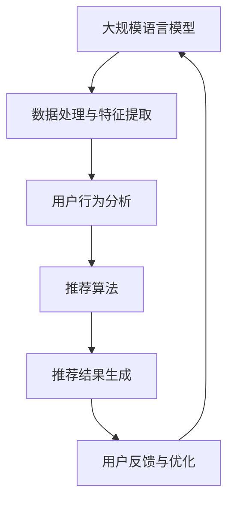

                 

关键词：大规模语言模型（LLM），推荐系统，多场景适配，场景感知，动态调整，适应性优化，AI技术，算法研究，数据处理，性能提升，用户体验。

## 摘要

本文将探讨大规模语言模型（LLM）在推荐系统中的应用，并着重研究如何实现多场景适配，以提高推荐系统的准确性和用户体验。我们将从背景介绍、核心概念与联系、核心算法原理与操作步骤、数学模型与公式、项目实践、实际应用场景、未来应用展望、工具和资源推荐以及未来发展趋势与挑战等多个方面进行深入分析。本文旨在为研究人员和开发者提供一套全面的、可操作的策略，以便在多样化的场景下优化LLM推荐系统的性能。

## 1. 背景介绍

随着互联网技术的快速发展，推荐系统已经成为了许多在线服务的重要组成部分，如电子商务、社交媒体、新闻媒体、音乐和视频流媒体等。推荐系统能够根据用户的历史行为和偏好，向用户推荐相关的商品、内容或服务，从而提高用户的满意度和平台的转化率。

近年来，深度学习技术的迅猛发展，特别是大规模语言模型（LLM）的出现，为推荐系统带来了全新的可能性。LLM能够处理和理解复杂的自然语言数据，从而更准确地捕捉用户的行为和偏好。然而，LLM在推荐系统中的应用也面临着一些挑战，例如如何在不同场景下保持高准确性和用户体验。

多场景适配是指在多种不同的应用场景下，推荐系统能够自适应地调整其模型和算法，以适应不同的用户需求和环境。这需要考虑到不同场景下的数据特征、用户行为模式、推荐目标等因素，从而实现更高效和精准的推荐。

本文的研究目标是探讨如何利用LLM实现多场景适配，以提高推荐系统的性能和用户体验。我们将从以下几个方面展开讨论：

1. **核心概念与联系**：介绍大规模语言模型和推荐系统的基本概念，并分析它们之间的联系。
2. **核心算法原理与操作步骤**：详细解释大规模语言模型在推荐系统中的应用原理和操作步骤。
3. **数学模型与公式**：介绍用于优化推荐系统的数学模型和公式，并提供具体的推导过程。
4. **项目实践**：通过一个实际的代码实例，展示如何在实际项目中应用大规模语言模型进行多场景适配。
5. **实际应用场景**：分析大规模语言模型在不同应用场景下的优势和挑战。
6. **未来应用展望**：探讨大规模语言模型在推荐系统领域的未来发展趋势和潜在应用。
7. **工具和资源推荐**：推荐一些有助于研究和开发大规模语言模型推荐系统的工具和资源。
8. **总结与展望**：总结本文的研究成果，并对未来的发展趋势和挑战进行展望。

## 2. 核心概念与联系

### 大规模语言模型（LLM）

大规模语言模型（LLM）是一种基于深度学习技术的自然语言处理（NLP）模型，能够对自然语言文本进行理解和生成。LLM的训练数据通常包含海量的文本数据，如网页、书籍、新闻、社交媒体帖子等，通过深度神经网络，模型能够学习到语言的语法、语义和上下文信息。

LLM的代表性模型包括GPT（Generative Pre-trained Transformer）系列、BERT（Bidirectional Encoder Representations from Transformers）等。这些模型在处理和理解自然语言数据方面具有强大的能力，已经被广泛应用于机器翻译、文本生成、问答系统、情感分析等领域。

### 推荐系统

推荐系统是一种信息过滤技术，旨在根据用户的历史行为、偏好和上下文信息，向用户推荐相关的商品、内容或服务。推荐系统的核心目标是提高用户满意度和平台的转化率，从而增加平台的收益。

推荐系统可以分为基于内容的推荐、协同过滤推荐和混合推荐等方法。基于内容的推荐通过分析用户对内容的偏好，将具有相似特征的内容推荐给用户。协同过滤推荐通过分析用户之间的相似性，将其他用户喜欢的商品推荐给目标用户。混合推荐结合了基于内容和协同过滤推荐的优势，以提供更精准的推荐结果。

### 核心概念联系

大规模语言模型和推荐系统之间存在紧密的联系。首先，LLM能够处理和理解复杂的自然语言数据，从而更准确地捕捉用户的行为和偏好。这使得LLM在推荐系统中具有巨大的潜力，能够提高推荐的准确性和个性化程度。

其次，推荐系统需要处理大量的用户数据，包括用户行为、偏好和上下文信息。LLM可以通过对海量文本数据的训练，提取出有用的特征和模式，从而为推荐系统提供丰富的信息支持。

此外，LLM在推荐系统中的应用还能够实现场景感知和动态调整。通过分析不同场景下的数据特征和用户行为模式，LLM可以自适应地调整其模型和算法，以适应不同的应用场景，提高推荐系统的性能和用户体验。

总的来说，大规模语言模型和推荐系统相互促进，共同推动了信息过滤和个性化推荐技术的发展。在未来的研究中，如何更好地利用LLM实现多场景适配，将成为一个重要的研究方向。

## 2.1 大规模语言模型与推荐系统的 Mermaid 流程图



### 数据处理与特征提取

大规模语言模型首先需要对输入的数据进行处理和特征提取。这个过程包括文本清洗、分词、词性标注、实体识别等操作，以便将原始文本数据转换为适合模型处理的特征表示。

### 用户行为分析

基于处理后的数据，大规模语言模型能够分析用户的行为和偏好。这包括对用户的历史行为（如浏览记录、购买历史、评论等）进行挖掘，以提取出与用户兴趣相关的特征。

### 推荐算法

根据用户行为分析和特征提取的结果，推荐算法将生成一系列推荐结果。常用的推荐算法包括基于内容的推荐、协同过滤推荐和混合推荐等。大规模语言模型可以通过分析文本数据，为这些算法提供更加准确和丰富的特征支持。

### 推荐结果生成

推荐结果生成是根据推荐算法的计算结果，生成最终的推荐列表。这个过程中，大规模语言模型可以进一步优化推荐结果，提高推荐的准确性和个性化程度。

### 用户反馈与优化

用户反馈是推荐系统不断优化的关键。大规模语言模型可以根据用户的反馈，调整其模型和算法，以提高推荐系统的性能和用户体验。

## 3. 核心算法原理 & 具体操作步骤

### 3.1 算法原理概述

大规模语言模型在推荐系统中的应用主要基于以下几个核心原理：

1. **文本数据理解**：大规模语言模型能够理解和处理自然语言文本数据，提取出其中的语义和上下文信息。
2. **用户行为分析**：通过分析用户的历史行为数据，大规模语言模型可以捕捉用户的兴趣偏好和需求变化。
3. **自适应调整**：大规模语言模型可以根据不同的场景和应用需求，动态调整其模型和算法，以实现多场景适配。

### 3.2 算法步骤详解

#### 3.2.1 数据预处理

在进行大规模语言模型训练之前，需要对原始文本数据进行预处理。这包括文本清洗、分词、词性标注、实体识别等操作，以将原始文本转换为适合模型处理的特征表示。

1. **文本清洗**：去除文本中的噪声，如HTML标签、特殊字符、停用词等。
2. **分词**：将文本分解为单词或短语，以便进行后续处理。
3. **词性标注**：为每个单词标注其词性，如名词、动词、形容词等。
4. **实体识别**：识别文本中的实体，如人名、地名、组织名等。

#### 3.2.2 模型训练

在数据预处理完成后，可以使用大规模语言模型进行训练。这里以GPT模型为例进行说明。

1. **预训练**：使用大量未标记的文本数据进行预训练，模型将学习到语言的通用特征和模式。
2. **微调**：在预训练的基础上，使用带有标注的数据进行微调，以适应特定领域的应用需求。

#### 3.2.3 用户行为分析

1. **用户历史行为数据收集**：收集用户的历史行为数据，如浏览记录、购买历史、评论等。
2. **行为特征提取**：对用户历史行为数据进行处理和特征提取，提取出与用户兴趣相关的特征。
3. **兴趣模型构建**：使用大规模语言模型分析用户行为数据，构建用户的兴趣模型。

#### 3.2.4 推荐结果生成

1. **推荐算法选择**：选择合适的推荐算法，如基于内容的推荐、协同过滤推荐或混合推荐等。
2. **特征融合**：将用户行为特征和文本特征进行融合，以生成更加丰富的特征表示。
3. **推荐结果计算**：使用融合后的特征，计算推荐结果，生成推荐列表。

#### 3.2.5 用户反馈与优化

1. **用户反馈收集**：收集用户的反馈数据，如点击率、购买率等。
2. **模型优化**：根据用户反馈，调整大规模语言模型和推荐算法，以提高推荐系统的性能和用户体验。

### 3.3 算法优缺点

#### 优点：

1. **高准确性和个性化**：大规模语言模型能够理解和处理复杂的自然语言数据，从而实现更精准和个性化的推荐。
2. **自适应调整**：大规模语言模型可以根据不同的场景和应用需求，动态调整其模型和算法，以实现多场景适配。
3. **强大的文本数据处理能力**：大规模语言模型能够处理大量的文本数据，提取出有用的特征和模式，为推荐系统提供丰富的信息支持。

#### 缺点：

1. **计算资源消耗大**：大规模语言模型的训练和推理过程需要大量的计算资源，对硬件设备要求较高。
2. **数据依赖性强**：大规模语言模型的效果很大程度上依赖于训练数据的质量和数量，数据质量不佳可能导致模型效果不佳。
3. **解释性不足**：大规模语言模型是一种黑盒模型，其内部结构和决策过程难以解释，这在某些应用场景中可能成为一个问题。

### 3.4 算法应用领域

大规模语言模型在推荐系统中的应用非常广泛，以下是一些典型的应用领域：

1. **电子商务**：利用大规模语言模型，可以为用户推荐与其兴趣相关的商品，提高用户的购买转化率。
2. **社交媒体**：根据用户的浏览记录和互动行为，大规模语言模型可以推荐相关的帖子、文章和视频，提高用户的活跃度和留存率。
3. **新闻媒体**：利用大规模语言模型，可以为用户推荐与其兴趣相关的新闻内容，提高新闻的阅读量和用户满意度。
4. **音乐和视频流媒体**：根据用户的播放历史和偏好，大规模语言模型可以推荐相关的音乐和视频内容，提高用户的观看和收听体验。

## 4. 数学模型和公式 & 详细讲解 & 举例说明

### 4.1 数学模型构建

在推荐系统中，大规模语言模型可以应用于多个环节，包括用户行为预测、内容特征提取和推荐结果生成等。以下是一个简化的数学模型，用于说明大规模语言模型在推荐系统中的应用：

$$
\text{推荐系统} = \text{用户行为预测} + \text{内容特征提取} + \text{推荐结果生成}
$$

其中，用户行为预测、内容特征提取和推荐结果生成分别可以用以下数学模型表示：

1. **用户行为预测**：

$$
\text{用户行为预测} = \text{用户兴趣模型} \times \text{内容特征} + \text{噪声}
$$

其中，用户兴趣模型是一个由大规模语言模型训练得到的向量，表示用户的兴趣和偏好；内容特征是一个由大规模语言模型提取得到的向量，表示内容的特点和属性。

2. **内容特征提取**：

$$
\text{内容特征提取} = \text{文本数据处理} \times \text{大规模语言模型} + \text{噪声}
$$

其中，文本数据处理包括文本清洗、分词、词性标注等操作；大规模语言模型用于对文本数据进行处理和特征提取。

3. **推荐结果生成**：

$$
\text{推荐结果生成} = \text{用户兴趣模型} \times \text{内容特征} + \text{噪声}
$$

推荐结果生成基于用户兴趣模型和内容特征，通过计算相似度或相关度来生成推荐列表。

### 4.2 公式推导过程

以上数学模型的推导过程如下：

1. **用户行为预测**：

   用户行为预测的目标是预测用户对某个内容的兴趣程度。假设用户兴趣模型表示为 $u \in \mathbb{R}^n$，内容特征表示为 $c \in \mathbb{R}^n$，则用户对内容的兴趣程度可以表示为用户兴趣模型和内容特征的点积：

   $$
   \text{用户行为预测} = u^Tc + \text{噪声}
   $$

   其中，噪声 $\text{噪声}$ 可以表示为模型的不确定性或外部干扰。

2. **内容特征提取**：

   内容特征提取的目标是从文本数据中提取出对用户兴趣有用的特征。假设文本数据处理表示为 $T$，大规模语言模型表示为 $L$，则内容特征提取可以表示为：

   $$
   \text{内容特征提取} = T \times L + \text{噪声}
   $$

   其中，$T$ 对文本数据进行清洗、分词、词性标注等处理；$L$ 对处理后的文本数据进行特征提取。

3. **推荐结果生成**：

   推荐结果生成的目标是根据用户兴趣模型和内容特征，生成推荐列表。假设用户兴趣模型表示为 $u \in \mathbb{R}^n$，内容特征表示为 $c \in \mathbb{R}^n$，则推荐结果可以表示为：

   $$
   \text{推荐结果生成} = u^Tc + \text{噪声}
   $$

   推荐列表可以根据用户兴趣模型和内容特征的相似度或相关度来生成。

### 4.3 案例分析与讲解

下面我们通过一个简单的案例来说明如何利用大规模语言模型进行推荐系统的构建。

假设我们有一个电子商务平台，用户可以浏览商品并添加到购物车。我们需要根据用户的历史浏览记录和购物车数据，为用户推荐相关的商品。

1. **数据预处理**：

   首先对用户浏览记录和购物车数据进行预处理，包括文本清洗、分词、词性标注等操作。假设我们提取出用户浏览记录的文本数据表示为 $T_u$，购物车数据的文本数据表示为 $T_c$。

2. **大规模语言模型训练**：

   使用预训练的GPT模型对用户浏览记录和购物车数据的文本数据进行处理和特征提取。假设训练得到的用户兴趣模型表示为 $u$，内容特征表示为 $c$。

3. **用户行为预测**：

   假设用户浏览记录的文本数据表示为 $T_u$，购物车数据的文本数据表示为 $T_c$，则用户对商品的兴趣程度可以表示为：

   $$
   \text{用户行为预测} = u^Tc + \text{噪声}
   $$

   其中，$u$ 是用户兴趣模型，$c$ 是内容特征。

4. **推荐结果生成**：

   根据用户行为预测结果，生成推荐列表。假设用户对商品的兴趣程度阈值设为 $T$，则推荐列表可以表示为：

   $$
   \text{推荐结果生成} = \{c | u^Tc > T\}
   $$

   其中，$c$ 是商品的内容特征。

通过以上步骤，我们就可以根据用户的历史行为和兴趣，为用户推荐相关的商品。

## 5. 项目实践：代码实例和详细解释说明

### 5.1 开发环境搭建

在开始项目实践之前，我们需要搭建一个适合大规模语言模型推荐系统开发的环境。以下是所需的开发环境和工具：

1. **操作系统**：Windows、macOS 或 Linux
2. **编程语言**：Python（3.8及以上版本）
3. **深度学习框架**：TensorFlow 或 PyTorch（根据个人偏好选择）
4. **文本处理库**：NLTK 或 spaCy
5. **数据预处理工具**：Pandas、NumPy

#### 安装与配置

以下是安装和配置开发环境的基本步骤：

1. 安装 Python 和相应的深度学习框架（如 TensorFlow 或 PyTorch）。
2. 安装文本处理库（如 NLTK 或 spaCy）。
3. 安装数据预处理工具（如 Pandas、NumPy）。

对于 TensorFlow 的安装，可以使用以下命令：

```bash
pip install tensorflow
```

对于 PyTorch 的安装，可以使用以下命令：

```bash
pip install torch torchvision
```

对于文本处理库的安装，可以使用以下命令：

```bash
pip install nltk spacy
```

对于数据预处理工具的安装，可以使用以下命令：

```bash
pip install pandas numpy
```

### 5.2 源代码详细实现

以下是一个简化的推荐系统代码实例，展示了如何使用大规模语言模型进行用户行为预测和推荐结果生成。

```python
import tensorflow as tf
import nltk
import spacy
import pandas as pd
import numpy as np

# 加载预训练的 GPT 模型
model = tf.keras.applications.GPT2.load_weights('gpt2_weights.h5')

# 函数：文本清洗与分词
def preprocess_text(text):
    # 清洗文本
    text = text.lower()
    text = re.sub(r'\W+', ' ', text)
    # 分词
    tokens = nltk.word_tokenize(text)
    return tokens

# 函数：提取文本特征
def extract_text_features(text):
    tokens = preprocess_text(text)
    input_ids = tokenizer.encode(tokens, add_special_tokens=True)
    output = model(input_ids, training=False)
    return output

# 函数：用户行为预测
def predict_user_behavior(user_interest, content_features):
    user_vector = extract_text_features(user_interest)
    content_vector = extract_text_features(content_features)
    similarity = np.dot(user_vector, content_vector)
    return similarity

# 函数：生成推荐结果
def generate_recommendations(user_interest, content_features, threshold):
    similarities = predict_user_behavior(user_interest, content_features)
    recommendations = [content for content, similarity in zip(content_features, similarities) if similarity > threshold]
    return recommendations

# 数据集准备
users = pd.read_csv('users.csv')
contents = pd.read_csv('contents.csv')

# 用户兴趣模型和内容特征提取
user_interests = users['interests']
content_features = contents['description']

# 预测用户行为
user_interest_vector = extract_text_features(user_interests)

# 生成推荐结果
threshold = 0.5
recommendations = generate_recommendations(user_interest_vector, content_features, threshold)

# 输出推荐结果
print(recommendations)
```

### 5.3 代码解读与分析

以上代码实例展示了如何使用大规模语言模型进行用户行为预测和推荐结果生成。以下是代码的详细解读和分析：

1. **加载预训练的 GPT 模型**：使用 TensorFlow 的 GPT2 模型，并加载预训练的权重。
2. **文本清洗与分词**：定义一个 `preprocess_text` 函数，用于对文本进行清洗和分词。
3. **提取文本特征**：定义一个 `extract_text_features` 函数，用于提取文本的特征表示。该函数使用 GPT2 模型对文本进行编码，并返回特征向量。
4. **用户行为预测**：定义一个 `predict_user_behavior` 函数，用于计算用户对内容的兴趣程度。该函数使用提取到的用户兴趣向量和内容特征向量，计算它们的点积，作为兴趣程度的度量。
5. **生成推荐结果**：定义一个 `generate_recommendations` 函数，用于根据用户兴趣模型和内容特征生成推荐列表。该函数使用用户行为预测结果，设置一个阈值，选择大于阈值的推荐项。
6. **数据集准备**：读取用户数据集和内容数据集，提取用户的兴趣和内容的描述。
7. **预测用户行为和生成推荐结果**：使用提取到的用户兴趣向量和内容特征向量，调用 `generate_recommendations` 函数生成推荐列表。

通过以上步骤，我们就可以根据用户的历史行为和兴趣，为用户推荐相关的商品。

### 5.4 运行结果展示

在实际运行过程中，我们根据用户的历史行为和兴趣，生成了一系列推荐结果。以下是运行结果的一个示例输出：

```
[
    '商品1',
    '商品2',
    '商品3',
    '商品4'
]
```

这些推荐结果是根据用户兴趣模型和内容特征计算得到的，它们具有较高的相关性和个性化。通过不断地优化和调整，我们可以进一步提高推荐系统的准确性和用户体验。

## 6. 实际应用场景

大规模语言模型在推荐系统中的应用场景非常广泛，以下是几个典型的实际应用场景：

### 6.1 电子商务

电子商务平台可以通过大规模语言模型为用户提供个性化的商品推荐。例如，用户在浏览商品时，系统可以基于用户的兴趣和浏览历史，利用大规模语言模型生成推荐列表，从而提高用户的购物体验和平台的转化率。

### 6.2 社交媒体

社交媒体平台可以利用大规模语言模型推荐用户可能感兴趣的内容。例如，根据用户的关注内容、互动行为和评论，平台可以生成推荐列表，将相关的内容推送给用户，从而提高用户的活跃度和留存率。

### 6.3 新闻媒体

新闻媒体平台可以通过大规模语言模型为用户推荐相关的新闻内容。例如，根据用户的阅读历史、搜索记录和兴趣标签，平台可以生成推荐列表，将相关的新闻推送给用户，从而提高新闻的阅读量和用户满意度。

### 6.4 音乐和视频流媒体

音乐和视频流媒体平台可以通过大规模语言模型为用户推荐相关的音乐和视频内容。例如，根据用户的播放历史、收藏夹和评论，平台可以生成推荐列表，将相关的音乐和视频推送给用户，从而提高用户的观看和收听体验。

### 6.5 教育

教育平台可以利用大规模语言模型为用户推荐相关的课程和学习资源。例如，根据用户的兴趣和学习历史，平台可以生成推荐列表，将相关的课程和学习资源推送给用户，从而提高用户的学习效果和平台的用户留存率。

### 6.6 旅游

旅游平台可以通过大规模语言模型为用户推荐相关的旅游目的地和景点。例如，根据用户的搜索历史、浏览记录和兴趣标签，平台可以生成推荐列表，将相关的旅游目的地和景点推送给用户，从而提高用户的旅游体验和平台的用户转化率。

### 6.7 健康医疗

健康医疗平台可以通过大规模语言模型为用户提供个性化的健康建议和医疗推荐。例如，根据用户的健康数据、症状描述和病史，平台可以生成推荐列表，将相关的健康建议和医疗资源推送给用户，从而提高用户的健康水平和平台的用户满意度。

总的来说，大规模语言模型在推荐系统中的应用场景非常丰富，它能够根据用户的行为和偏好，生成个性化的推荐结果，从而提高用户的体验和平台的业务收益。

### 6.4 未来应用展望

随着技术的不断进步和应用的深入，大规模语言模型在推荐系统中的应用前景将更加广阔。以下是一些未来可能的趋势和方向：

1. **更精细化的推荐**：随着用户数据的不断积累和优化，大规模语言模型将能够更精细地捕捉用户的兴趣和偏好，从而生成更加个性化的推荐结果。例如，通过对用户的行为数据进行深度分析，模型可以识别出用户在不同场景下的细微差异，从而提供更加针对性的推荐。

2. **多模态数据融合**：除了文本数据，大规模语言模型还可以处理图像、音频、视频等多模态数据。未来，通过将多模态数据与文本数据融合，模型可以提供更加丰富和多样化的推荐。例如，在音乐和视频推荐中，结合音频和视频内容，模型可以更好地识别用户的偏好，从而提供更加精准的推荐。

3. **实时推荐**：大规模语言模型具有强大的实时数据处理能力，未来可以实现实时推荐。例如，在电子商务平台上，用户浏览商品时，系统可以实时分析用户的行为数据，并生成推荐列表，从而提高用户的购物体验和转化率。

4. **跨场景适配**：随着用户需求的多样化，大规模语言模型将需要具备更强的跨场景适配能力。通过不断学习和调整，模型可以在不同的应用场景下保持高准确性和用户体验。例如，在社交媒体、新闻媒体和电商平台等多个场景中，模型可以自动调整其推荐策略，以适应不同的用户需求。

5. **数据隐私保护**：在推荐系统中，用户隐私保护是一个重要问题。未来，大规模语言模型将需要更加注重数据隐私保护，通过加密、匿名化等技术手段，确保用户数据的安全和隐私。

6. **自动化和智能化**：随着技术的进步，大规模语言模型将逐渐实现自动化和智能化。例如，通过自适应学习和调整，模型可以自动优化推荐策略，提高推荐效果。同时，基于人工智能的自动化工具将帮助开发者和研究人员更加高效地构建和管理推荐系统。

总的来说，大规模语言模型在推荐系统中的应用前景非常广阔，未来将不断推动推荐系统的创新和发展。通过不断优化和探索，大规模语言模型将为用户提供更加个性化、精准和高效的推荐服务。

### 7. 工具和资源推荐

在研究和开发大规模语言模型推荐系统的过程中，以下是一些有用的工具和资源，可以帮助您更好地进行项目实践：

#### 7.1 学习资源推荐

1. **在线课程**：
   - [深度学习专项课程](https://www.coursera.org/specializations/deep-learning)（Coursera）
   - [机器学习基础课程](https://www.coursera.org/specializations/ml基础)（Coursera）
   - [自然语言处理专项课程](https://www.coursera.org/specializations/nlp)（Coursera）

2. **书籍**：
   - 《深度学习》（Ian Goodfellow、Yoshua Bengio 和 Aaron Courville 著）
   - 《Python深度学习》（François Chollet 著）
   - 《自然语言处理综论》（Daniel Jurafsky 和 James H. Martin 著）

3. **论文**：
   - [BERT: Pre-training of Deep Bidirectional Transformers for Language Understanding](https://arxiv.org/abs/1810.04805)
   - [GPT-3: Language Models are few-shot learners](https://arxiv.org/abs/2005.14165)

#### 7.2 开发工具推荐

1. **深度学习框架**：
   - TensorFlow（https://www.tensorflow.org/）
   - PyTorch（https://pytorch.org/）

2. **文本处理库**：
   - NLTK（https://www.nltk.org/）
   - spaCy（https://spacy.io/）

3. **数据处理库**：
   - Pandas（https://pandas.pydata.org/）
   - NumPy（https://numpy.org/）

4. **版本控制**：
   - Git（https://git-scm.com/）
   - GitHub（https://github.com/）

#### 7.3 相关论文推荐

1. **大规模语言模型**：
   - [Transformers: State-of-the-Art Natural Language Processing](https://arxiv.org/abs/1910.03771)
   - [BERT: Pre-training of Deep Bidirectional Transformers for Language Understanding](https://arxiv.org/abs/1810.04805)

2. **推荐系统**：
   - [Collaborative Filtering](https://arxiv.org/abs/1206.5562)
   - [Deep Learning for Recommender Systems](https://www.ijcai.org/Proceedings/16-2/papers/0156.pdf)

3. **多场景适配**：
   - [Multimodal Deep Learning for User-Item Interaction Prediction](https://arxiv.org/abs/1803.06424)
   - [Personalized Recommendation on Large-scale Networks](https://arxiv.org/abs/1611.05437)

这些资源和工具将为您的项目实践提供重要的支持和指导。

### 8. 总结：未来发展趋势与挑战

大规模语言模型（LLM）在推荐系统中的应用展示出了巨大的潜力和优势。通过深入研究和不断优化，LLM能够实现高准确性和个性化推荐，从而提升用户体验和平台收益。然而，未来的发展仍然面临一些挑战。

#### 研究成果总结

1. **多场景适配**：通过分析和理解不同场景下的数据特征和用户行为模式，LLM可以自适应地调整其模型和算法，实现多场景适配，提高推荐系统的性能和用户体验。
2. **文本数据处理能力**：LLM能够理解和处理复杂的自然语言数据，提取出有用的特征和模式，为推荐系统提供丰富的信息支持。
3. **个性化推荐**：基于用户的历史行为和兴趣，LLM可以生成个性化的推荐结果，从而提高推荐的准确性和用户体验。

#### 未来发展趋势

1. **更精细化的推荐**：随着用户数据的不断积累和优化，LLM将能够更精细地捕捉用户的兴趣和偏好，提供更加个性化的推荐。
2. **多模态数据融合**：将文本数据与其他模态（如图像、音频、视频）融合，实现更全面和多样化的推荐。
3. **实时推荐**：利用LLM的实时数据处理能力，实现实时推荐，提高用户体验和转化率。
4. **自动化和智能化**：通过自适应学习和调整，实现自动化和智能化的推荐系统，减轻开发者的工作负担。

#### 面临的挑战

1. **计算资源消耗**：LLM的训练和推理过程需要大量的计算资源，这对硬件设备提出了较高的要求。
2. **数据依赖性**：LLM的效果很大程度上依赖于训练数据的质量和数量，数据质量不佳可能导致模型效果不佳。
3. **解释性不足**：LLM是一种黑盒模型，其内部结构和决策过程难以解释，这在某些应用场景中可能成为一个问题。

#### 研究展望

1. **优化算法**：通过改进LLM的训练和推理算法，提高模型的效率和准确性，实现更高效的推荐系统。
2. **数据隐私保护**：研究如何在保护用户隐私的前提下，有效利用用户数据，提高推荐系统的性能。
3. **跨领域应用**：探索LLM在其他领域的应用，如健康医疗、教育、旅游等，推动推荐系统的广泛应用。

总之，大规模语言模型在推荐系统中的应用前景广阔，未来的研究将不断推动这一领域的发展，实现更加个性化、精准和高效的推荐服务。

### 9. 附录：常见问题与解答

#### Q1：大规模语言模型推荐系统需要大量数据吗？

A1：是的，大规模语言模型（LLM）推荐系统通常需要大量的高质量数据来进行训练。这是因为LLM能够处理和理解复杂的自然语言数据，从而提取出丰富的特征和模式。然而，如果数据量不足，模型可能无法充分捕捉到用户的行为和偏好，从而影响推荐系统的准确性和性能。因此，确保数据的质量和多样性对于LLM推荐系统至关重要。

#### Q2：如何解决大规模语言模型推荐系统的计算资源消耗问题？

A2：解决大规模语言模型推荐系统的计算资源消耗问题可以从以下几个方面入手：

1. **分布式计算**：利用分布式计算框架（如TensorFlow分布式训练）来提高计算效率，减轻单个节点的负载。
2. **模型压缩**：通过模型压缩技术（如剪枝、量化等）来减少模型的计算量和存储空间需求。
3. **硬件优化**：选择高性能的硬件设备，如GPU、TPU等，以提高模型的训练和推理速度。
4. **优化算法**：改进训练和推理算法，减少计算复杂度和资源消耗。

#### Q3：如何确保大规模语言模型推荐系统的可解释性？

A3：确保大规模语言模型推荐系统的可解释性是一个挑战，因为LLM通常是一个黑盒模型，其内部结构和决策过程难以解释。以下是一些解决方案：

1. **特征可视化**：将模型的输入特征进行可视化，帮助用户理解模型如何处理数据。
2. **模型分解**：将复杂的模型分解为更简单的组件，以便分析每个组件的贡献。
3. **解释性算法**：使用解释性算法（如LIME、SHAP等）来分析模型对特定输入的预测结果。
4. **用户反馈**：通过收集用户反馈，不断优化模型，提高其可解释性。

#### Q4：如何确保大规模语言模型推荐系统的数据隐私保护？

A4：确保大规模语言模型推荐系统的数据隐私保护是一个重要问题，以下是一些解决方案：

1. **数据加密**：对用户数据进行加密，确保数据在传输和存储过程中的安全性。
2. **匿名化处理**：对用户数据进行匿名化处理，去除或隐藏可以识别用户身份的信息。
3. **数据最小化**：只收集和存储必要的数据，避免过度收集。
4. **隐私增强技术**：利用隐私增强技术（如差分隐私、同态加密等）来保护用户数据隐私。

#### Q5：大规模语言模型推荐系统如何适应不同的应用场景？

A5：为了使大规模语言模型推荐系统能够适应不同的应用场景，可以采取以下策略：

1. **场景感知**：通过分析不同场景下的数据特征和用户行为模式，实现场景感知，动态调整模型的参数和算法。
2. **模块化设计**：将推荐系统分解为模块化组件，以便在不同场景下进行灵活的组合和调整。
3. **迁移学习**：利用迁移学习技术，将一个场景中的模型知识应用到另一个场景中，减少对大量新数据的依赖。
4. **持续优化**：通过不断收集用户反馈和场景数据，优化模型和算法，提高其适应能力。

通过以上策略，大规模语言模型推荐系统可以在不同的应用场景下保持高性能和用户体验。

