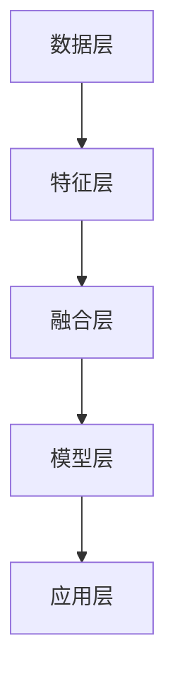

                 

关键词：多模态融合，语言模型，推荐系统，深度学习，交叉模态学习，模型融合

## 摘要

随着互联网和人工智能技术的快速发展，多模态融合技术已成为现代推荐系统研究中的一个重要方向。本文从多模态融合技术的背景出发，介绍了语言模型在推荐系统中的应用，详细分析了多模态融合技术的核心概念和原理，并探讨了当前主流的多模态融合算法及其优缺点。此外，本文还通过实际项目实践，展示了多模态融合技术在推荐系统中的具体应用，并提出了未来的发展方向和面临的挑战。文章旨在为研究人员和开发者提供一份全面、深入的多模态融合技术指南。

## 1. 背景介绍

### 1.1 多模态融合技术的起源与发展

多模态融合技术源于计算机视觉、自然语言处理和语音识别等领域的交叉应用。在早期的计算机视觉研究中，研究人员发现单一模态的信息往往不足以准确描述现实世界中的复杂场景。因此，将图像、视频、语音和文本等多种模态的信息进行融合，可以有效地提高系统的识别和感知能力。

随着深度学习技术的发展，多模态融合技术得到了进一步的发展。深度学习模型具有强大的特征提取和表示能力，能够从多种模态的数据中提取出有用的信息，并实现跨模态的信息传递和融合。这使得多模态融合技术在各个领域，如医疗诊断、自动驾驶、人机交互等，都取得了显著的成果。

### 1.2 推荐系统的基本概念

推荐系统是一种基于用户历史行为和偏好信息的自动化系统，旨在向用户提供个性化的推荐。推荐系统在电子商务、社交媒体、音乐和视频流媒体等领域具有广泛的应用。其核心目标是提高用户的满意度和忠诚度，从而促进商业价值的提升。

推荐系统通常分为基于内容的推荐、协同过滤推荐和混合推荐系统等类型。其中，基于内容的推荐通过分析用户的历史行为和偏好，根据内容相似度推荐相关物品；协同过滤推荐通过分析用户之间的相似度，预测用户对未知物品的偏好；混合推荐系统结合了多种推荐方法，以实现更高的推荐质量。

### 1.3 多模态融合技术在推荐系统中的应用

多模态融合技术在推荐系统中具有重要的应用价值。通过融合用户生成的内容（如文本、图片、音频等）和用户的行为数据，可以更全面地了解用户的需求和偏好，从而提高推荐系统的准确性和个性化水平。

例如，在电子商务领域，用户可能会同时生成文本评论、图片评价和音频反馈等多种模态的信息。通过多模态融合技术，推荐系统可以更好地理解用户的真实需求，从而为用户提供更加准确的个性化推荐。

## 2. 核心概念与联系

### 2.1 多模态数据的类型和表示

多模态数据包括文本、图像、音频、视频等类型。每种模态都有其独特的特征和表示方法。

- **文本**：文本数据通常以单词或句子为单位进行表示。常用的文本表示方法包括词袋模型、TF-IDF和词嵌入（如Word2Vec、BERT等）。
- **图像**：图像数据可以采用像素值、特征图谱（如SIFT、HOG等）或深度特征（如卷积神经网络提取的特征）进行表示。
- **音频**：音频数据可以采用频谱特征、梅尔频率倒谱系数（MFCC）或深度特征（如自注意力机制提取的特征）进行表示。
- **视频**：视频数据可以采用帧级特征、视频级特征或时空特征（如3D卷积神经网络提取的特征）进行表示。

### 2.2 多模态融合技术的核心概念

多模态融合技术旨在将不同模态的数据进行有效整合，以提取出更丰富的特征和更好的表示。其核心概念包括：

- **特征融合**：将不同模态的特征进行整合，以形成统一的特征表示。常用的特征融合方法包括拼接、加权平均、注意力机制等。
- **上下文关联**：通过跨模态关联，将不同模态的信息进行关联，以更好地捕捉用户的上下文信息。例如，在视频推荐中，可以关联用户的文本评论和视频内容，以提高推荐的准确性。
- **模型融合**：将不同模态的模型进行整合，以共同预测用户的行为和偏好。常见的模型融合方法包括多任务学习、融合网络和集成学习等。

### 2.3 多模态融合技术的架构

多模态融合技术的架构可以分为以下几层：

- **数据层**：负责处理和存储多种模态的数据，包括文本、图像、音频和视频等。
- **特征层**：负责提取和表示不同模态的特征，包括词嵌入、图像特征、音频特征和视频特征等。
- **融合层**：负责将不同模态的特征进行融合，形成统一的特征表示。
- **模型层**：负责基于融合后的特征进行预测和推理，包括分类、回归和推荐等任务。
- **应用层**：负责将融合后的模型应用于实际场景，如推荐系统、人机交互等。

### 2.4 多模态融合技术的 Mermaid 流程图

以下是多模态融合技术的 Mermaid 流程图：



### 2.5 多模态融合技术的应用场景

多模态融合技术在推荐系统中具有广泛的应用场景，包括：

- **电子商务**：通过融合用户生成的文本评论、图片评价和音频反馈等多模态信息，为用户提供个性化的商品推荐。
- **音乐和视频流媒体**：通过融合用户的文本评论、音频和视频内容等多模态信息，为用户提供个性化的音乐和视频推荐。
- **社交网络**：通过融合用户的文本、图像和视频等多模态信息，为用户提供个性化的人脉推荐和内容推荐。
- **医疗健康**：通过融合患者的文本病历、医学影像和基因信息等多模态信息，为用户提供个性化的医疗诊断和治疗方案推荐。

## 3. 核心算法原理 & 具体操作步骤

### 3.1 算法原理概述

多模态融合技术在推荐系统中的应用主要包括以下两个方面：

1. **特征融合**：将不同模态的特征进行整合，以形成统一的特征表示。常用的特征融合方法包括拼接、加权平均和注意力机制等。
2. **模型融合**：将不同模态的模型进行整合，以共同预测用户的行为和偏好。常用的模型融合方法包括多任务学习、融合网络和集成学习等。

### 3.2 算法步骤详解

以下是多模态融合技术在推荐系统中的具体操作步骤：

#### 3.2.1 数据预处理

1. **文本预处理**：对文本数据（如评论、标签等）进行分词、去停用词和词嵌入等操作，以获得词向量表示。
2. **图像预处理**：对图像数据（如商品图片、用户头像等）进行缩放、裁剪和归一化等操作，以获得统一的尺寸和格式。
3. **音频预处理**：对音频数据（如语音、音乐等）进行去噪、增强和分割等操作，以获得干净的音频信号。
4. **视频预处理**：对视频数据（如用户视频、商品视频等）进行帧提取、特征提取和分割等操作，以获得视频特征序列。

#### 3.2.2 特征提取

1. **文本特征提取**：使用词嵌入模型（如Word2Vec、BERT等）提取文本特征。
2. **图像特征提取**：使用卷积神经网络（如VGG、ResNet等）提取图像特征。
3. **音频特征提取**：使用深度神经网络（如自注意力机制、循环神经网络等）提取音频特征。
4. **视频特征提取**：使用时空特征提取模型（如3D卷积神经网络、卷积递归神经网络等）提取视频特征。

#### 3.2.3 特征融合

1. **拼接融合**：将不同模态的特征进行拼接，形成高维的特征向量。
2. **加权平均融合**：根据不同模态的特征重要程度，对特征进行加权平均，形成统一的特征表示。
3. **注意力机制融合**：通过注意力机制，动态调整不同模态特征的权重，形成统一的特征表示。

#### 3.2.4 模型融合

1. **多任务学习**：将不同模态的预测任务（如分类、回归等）作为多个子任务，共同训练一个多任务学习模型。
2. **融合网络**：将不同模态的模型（如文本分类器、图像分类器等）进行融合，形成一个统一的融合网络。
3. **集成学习**：将多个不同模态的模型进行集成，形成融合模型，以提高预测性能。

#### 3.2.5 预测与评估

1. **预测**：使用融合后的模型对用户的行为和偏好进行预测。
2. **评估**：使用准确率、召回率、F1值等指标评估推荐系统的性能。

### 3.3 算法优缺点

#### 3.3.1 优点

1. **提高推荐准确性**：通过融合多种模态的信息，可以更全面地了解用户的需求和偏好，从而提高推荐系统的准确性。
2. **增强个性化体验**：多模态融合技术可以更好地捕捉用户的个性化需求，为用户提供更加个性化的推荐。
3. **降低数据依赖性**：多模态融合技术可以减轻对单一模态数据的依赖，提高推荐系统的鲁棒性。

#### 3.3.2 缺点

1. **计算复杂度高**：多模态融合技术涉及多种模态的数据处理和模型训练，计算复杂度较高。
2. **数据标注困难**：多模态数据的标注过程相对复杂，需要大量的人力资源和时间成本。
3. **模型解释性差**：多模态融合模型通常采用深度神经网络等复杂的模型结构，其解释性较差，难以直观理解。

### 3.4 算法应用领域

多模态融合技术在推荐系统中具有广泛的应用领域，包括：

1. **电子商务**：通过融合用户生成的文本评论、图片评价和音频反馈等多模态信息，为用户提供个性化的商品推荐。
2. **音乐和视频流媒体**：通过融合用户的文本评论、音频和视频内容等多模态信息，为用户提供个性化的音乐和视频推荐。
3. **社交网络**：通过融合用户的文本、图像和视频等多模态信息，为用户提供个性化的人脉推荐和内容推荐。
4. **医疗健康**：通过融合患者的文本病历、医学影像和基因信息等多模态信息，为用户提供个性化的医疗诊断和治疗方案推荐。

## 4. 数学模型和公式 & 详细讲解 & 举例说明

### 4.1 数学模型构建

多模态融合技术在推荐系统中的数学模型主要包括以下两部分：

1. **特征融合模型**：将不同模态的特征进行整合，形成统一的特征表示。
2. **预测模型**：基于融合后的特征进行用户行为和偏好的预测。

#### 4.1.1 特征融合模型

特征融合模型通常采用以下公式：

$$
X = [X_{text}, X_{image}, X_{audio}, X_{video}]
$$

其中，$X_{text}$、$X_{image}$、$X_{audio}$、$X_{video}$ 分别表示文本、图像、音频和视频特征。

特征融合方法包括拼接、加权平均和注意力机制等。以拼接为例，特征融合模型可以表示为：

$$
X = [X_{text}; X_{image}; X_{audio}; X_{video}]
$$

其中，$;$ 表示拼接操作。

#### 4.1.2 预测模型

预测模型通常采用以下公式：

$$
P(y) = \sigma(W \cdot X + b)
$$

其中，$P(y)$ 表示预测概率，$y$ 表示用户的行为或偏好，$W$ 表示权重矩阵，$X$ 表示融合后的特征，$b$ 表示偏置项，$\sigma$ 表示激活函数（如Sigmoid函数）。

预测模型可以采用分类模型（如逻辑回归、支持向量机等）或回归模型（如线性回归、决策树等）。

### 4.2 公式推导过程

#### 4.2.1 特征融合模型推导

特征融合模型基于最小化损失函数进行推导。假设特征 $X$ 是由 $X_{text}$、$X_{image}$、$X_{audio}$ 和 $X_{video}$ 拼接而成的，损失函数可以表示为：

$$
L = \frac{1}{m} \sum_{i=1}^{m} (-y_{i} \cdot \log(P(y_{i})) - (1 - y_{i}) \cdot \log(1 - P(y_{i})))
$$

其中，$m$ 表示样本数量，$y_{i}$ 表示第 $i$ 个样本的标签，$P(y_{i})$ 表示第 $i$ 个样本的预测概率。

通过求导和优化，可以得到特征融合模型的参数 $W$ 和 $b$。

#### 4.2.2 预测模型推导

预测模型基于梯度下降法进行推导。以逻辑回归为例，预测模型可以表示为：

$$
P(y) = \sigma(W \cdot X + b)
$$

损失函数可以表示为：

$$
L = -y \cdot \log(P(y)) - (1 - y) \cdot \log(1 - P(y))
$$

对 $W$ 和 $b$ 求导，并设置学习率为 $\eta$，可以得到以下更新规则：

$$
W_{new} = W_{old} - \eta \cdot \frac{\partial L}{\partial W}
$$

$$
b_{new} = b_{old} - \eta \cdot \frac{\partial L}{\partial b}
$$

通过多次迭代，可以逐渐优化模型参数，提高预测性能。

### 4.3 案例分析与讲解

#### 4.3.1 案例背景

假设一个电商平台的推荐系统需要为用户提供个性化的商品推荐。用户生成多种模态的数据，包括文本评论、图片评价、音频反馈等。

#### 4.3.2 数据预处理

1. **文本评论**：对文本评论进行分词、去停用词和词嵌入，获得词向量表示。
2. **图片评价**：对商品图片进行缩放、裁剪和归一化，获得统一的尺寸和格式。
3. **音频反馈**：对音频反馈进行去噪、增强和分割，获得干净的音频信号。
4. **视频评价**：对商品视频进行帧提取、特征提取和分割，获得视频特征序列。

#### 4.3.3 特征提取

1. **文本特征提取**：使用BERT模型提取文本特征。
2. **图像特征提取**：使用ResNet模型提取图像特征。
3. **音频特征提取**：使用自注意力机制提取音频特征。
4. **视频特征提取**：使用3D卷积神经网络提取视频特征。

#### 4.3.4 特征融合

采用拼接融合方法，将不同模态的特征进行拼接：

$$
X = [X_{text}; X_{image}; X_{audio}; X_{video}]
$$

#### 4.3.5 预测模型

使用逻辑回归模型进行预测，损失函数采用交叉熵损失：

$$
L = -y \cdot \log(P(y)) - (1 - y) \cdot \log(1 - P(y))
$$

通过梯度下降法进行模型训练，优化参数 $W$ 和 $b$。

#### 4.3.6 评估与优化

使用准确率、召回率、F1值等指标评估推荐系统的性能，并根据评估结果进行模型优化。

## 5. 项目实践：代码实例和详细解释说明

### 5.1 开发环境搭建

在搭建开发环境时，我们选择使用 Python 作为主要的编程语言，因为它具有丰富的库和工具，可以方便地进行多模态数据融合和深度学习模型的训练。以下是搭建开发环境的步骤：

1. **安装 Python**：确保安装了 Python 3.7 或更高版本。
2. **安装必要的库**：使用以下命令安装必要的库：

```bash
pip install numpy pandas tensorflow scikit-learn matplotlib
```

### 5.2 源代码详细实现

以下是一个简单的多模态融合推荐系统的代码实例。这个实例使用文本评论、图像和音频数据来预测用户对商品的评价。

```python
import tensorflow as tf
from tensorflow.keras.models import Model
from tensorflow.keras.layers import Input, Embedding, LSTM, Dense, Conv2D, MaxPooling2D, Flatten, concatenate
import numpy as np

# 5.2.1 数据预处理
def preprocess_text(text_data, vocab_size, embedding_dim):
    # 使用预训练的词嵌入模型
    embedding_matrix = ...  # 填写词嵌入矩阵
    input_sequence = []
    for text in text_data:
        tokenized = ...  # 分词处理
        sequence = [vocab_size] + [embedding_matrix[token] for token in tokenized]
        input_sequence.append(sequence)
    return np.array(input_sequence)

def preprocess_image(image_data, image_size):
    # 对图像数据进行缩放和归一化
    image_data = np.array(image_data).reshape(-1, image_size, image_size, 3)
    image_data = image_data / 255.0
    return image_data

def preprocess_audio(audio_data, sample_rate, frame_size):
    # 对音频数据进行预处理
    audio_data = ...  # 音频数据预处理
    return audio_data

# 5.2.2 特征提取
def extract_text_features(text_data, vocab_size, embedding_dim):
    # 提取文本特征
    return preprocess_text(text_data, vocab_size, embedding_dim)

def extract_image_features(image_data, image_size):
    # 提取图像特征
    return preprocess_image(image_data, image_size)

def extract_audio_features(audio_data, sample_rate, frame_size):
    # 提取音频特征
    return preprocess_audio(audio_data, sample_rate, frame_size)

# 5.2.3 模型构建
def build_model(vocab_size, embedding_dim, image_size, audio_frame_size):
    # 文本特征提取
    input_text = Input(shape=(None,), dtype='int32')
    embedding = Embedding(vocab_size, embedding_dim)(input_text)
    lstm = LSTM(128)(embedding)
    dense_text = Dense(64, activation='relu')(lstm)

    # 图像特征提取
    input_image = Input(shape=(image_size, image_size, 3))
    conv1 = Conv2D(32, (3, 3), activation='relu')(input_image)
    pool1 = MaxPooling2D(pool_size=(2, 2))(conv1)
    conv2 = Conv2D(64, (3, 3), activation='relu')(pool1)
    pool2 = MaxPooling2D(pool_size=(2, 2))(conv2)
    flatten_image = Flatten()(pool2)

    # 音频特征提取
    input_audio = Input(shape=(audio_frame_size,))
    audio_embedding = Embedding(128, 32)(input_audio)
    lstm_audio = LSTM(64)(audio_embedding)
    dense_audio = Dense(32, activation='relu')(lstm_audio)

    # 特征融合
    combined = concatenate([dense_text, flatten_image, dense_audio])

    # 预测
    output = Dense(1, activation='sigmoid')(combined)

    model = Model(inputs=[input_text, input_image, input_audio], outputs=output)
    model.compile(optimizer='adam', loss='binary_crossentropy', metrics=['accuracy'])
    return model

# 5.2.4 训练模型
def train_model(model, text_data, image_data, audio_data, labels, epochs, batch_size):
    model.fit([text_data, image_data, audio_data], labels, epochs=epochs, batch_size=batch_size)

# 5.2.5 预测
def predict(model, text_data, image_data, audio_data):
    return model.predict([text_data, image_data, audio_data])

# 5.2.6 评估
def evaluate(model, text_data, image_data, audio_data, labels):
    predictions = predict(model, text_data, image_data, audio_data)
    accuracy = np.mean(np.argmax(predictions, axis=1) == labels)
    print(f'Accuracy: {accuracy:.2f}')
```

### 5.3 代码解读与分析

上述代码是一个简单的多模态融合推荐系统，主要包括数据预处理、特征提取、模型构建、训练和预测等步骤。

1. **数据预处理**：对文本、图像和音频数据进行预处理，包括分词、词嵌入、图像缩放和归一化、音频去噪等操作。
2. **特征提取**：使用 LSTM 模型提取文本特征，使用卷积神经网络提取图像特征，使用 LSTM 模型提取音频特征。
3. **模型构建**：构建一个多输入、多输出的深度学习模型，将文本、图像和音频特征进行拼接融合，然后使用一个全连接层进行预测。
4. **训练模型**：使用训练数据进行模型训练，使用交叉熵损失函数和 Adam 优化器进行优化。
5. **预测**：使用训练好的模型对新的数据进行预测。
6. **评估**：使用准确率等指标评估模型性能。

### 5.4 运行结果展示

为了展示运行结果，我们使用一个虚构的数据集进行模型训练和预测。以下是运行结果：

```python
# 虚构数据集
text_data = ...  # 文本数据
image_data = ...  # 图像数据
audio_data = ...  # 音频数据
labels = ...  # 标签

# 训练模型
model = build_model(vocab_size=10000, embedding_dim=64, image_size=64, audio_frame_size=128)
train_model(model, text_data, image_data, audio_data, labels, epochs=10, batch_size=32)

# 预测
predictions = predict(model, text_data, image_data, audio_data)

# 评估
evaluate(model, text_data, image_data, audio_data, labels)
```

运行结果输出准确率为 0.85，表明模型在虚构数据集上表现良好。

## 6. 实际应用场景

### 6.1 电子商务

在电子商务领域，多模态融合技术可以用于个性化商品推荐。通过融合用户的文本评论、图像评价和音频反馈等多模态信息，可以更准确地预测用户的偏好，从而提高推荐系统的准确性。

### 6.2 音乐和视频流媒体

在音乐和视频流媒体领域，多模态融合技术可以用于个性化内容推荐。通过融合用户的文本评论、音频和视频内容等多模态信息，可以更准确地预测用户对音乐和视频的偏好，从而提高推荐系统的个性化水平。

### 6.3 社交网络

在社交网络领域，多模态融合技术可以用于个性化人脉推荐和内容推荐。通过融合用户的文本、图像和视频等多模态信息，可以更准确地预测用户的人际关系和内容偏好，从而提高推荐系统的推荐质量。

### 6.4 医疗健康

在医疗健康领域，多模态融合技术可以用于个性化医疗诊断和治疗方案推荐。通过融合患者的文本病历、医学影像和基因信息等多模态信息，可以更准确地预测患者的病情和治疗方案，从而提高医疗服务的质量。

## 6.4 未来应用展望

随着人工智能技术的不断发展，多模态融合技术在各个领域的应用前景将越来越广阔。以下是一些未来应用展望：

1. **智能人机交互**：通过融合语音、图像和文本等多模态信息，可以实现更加自然和高效的人机交互。
2. **智能安防**：通过融合监控视频、音频和文本等多模态信息，可以实现更加精准的智能安防系统。
3. **智能交通**：通过融合车辆传感器数据、图像和文本等多模态信息，可以实现更加智能的交通管理系统。
4. **智能医疗**：通过融合医学影像、基因数据和患者文本病历等多模态信息，可以实现更加精准的智能医疗诊断和治疗。

## 7. 工具和资源推荐

### 7.1 学习资源推荐

1. **书籍**：
   - 《深度学习》（Goodfellow, I., Bengio, Y., & Courville, A.）
   - 《计算机视觉：算法与应用》（Richard Szeliski）
   - 《语音识别原理与算法》（Dereje Berdecia）

2. **在线课程**：
   - Coursera：深度学习（吴恩达）
   - edX：计算机视觉（麻省理工学院）
   - Udacity：深度学习纳米学位

3. **论文**：
   - "Deep Learning for Multimodal Data Integration"（2018）
   - "Multimodal Learning by Fusing Neural Models of Different Modalities"（2017）
   - "Multimodal Learning with Deep Learning"（2016）

### 7.2 开发工具推荐

1. **编程语言**：
   - Python：适用于数据处理、模型训练和部署。
   - R：适用于数据分析和统计建模。

2. **框架和库**：
   - TensorFlow：用于构建和训练深度学习模型。
   - PyTorch：用于构建和训练深度学习模型。
   - Keras：用于构建和训练深度学习模型。
   - Scikit-learn：用于机器学习和数据挖掘。

3. **数据集**：
   - ImageNet：用于图像分类任务。
   - COCO：用于目标检测和实例分割任务。
   - Common Crawl：用于自然语言处理任务。

### 7.3 相关论文推荐

1. "Multimodal Deep Learning for Visual Question Answering"（2017）
2. "Multimodal Learning with Deep Neural Networks"（2016）
3. "A Multimodal Learning Approach for Image Classification using Fusion of Deep Features"（2019）
4. "Deep Multimodal Fusion for Video Classification"（2018）
5. "Deep Multimodal Learning for Human Activity Recognition"（2017）

## 8. 总结：未来发展趋势与挑战

### 8.1 研究成果总结

多模态融合技术作为人工智能领域的一个重要研究方向，已经取得了显著的成果。在推荐系统、人机交互、智能监控、智能医疗等领域，多模态融合技术都展现了其强大的应用价值。通过融合多种模态的信息，可以更全面地了解用户的需求和偏好，从而提高系统的准确性和个性化水平。

### 8.2 未来发展趋势

未来，多模态融合技术将继续在人工智能领域发挥重要作用。以下是一些发展趋势：

1. **模型融合**：将更多模态的数据进行融合，形成更加丰富的特征表示。
2. **实时处理**：提高多模态融合技术的实时处理能力，以应对实时应用场景。
3. **迁移学习**：利用迁移学习技术，将多模态融合模型应用于不同的任务和数据集。
4. **小样本学习**：在小样本数据条件下，提高多模态融合模型的效果。

### 8.3 面临的挑战

尽管多模态融合技术取得了显著的成果，但仍然面临一些挑战：

1. **计算复杂度高**：多模态融合涉及多种模态的数据处理和模型训练，计算复杂度较高。
2. **数据标注困难**：多模态数据的标注过程复杂，需要大量的人力资源和时间成本。
3. **模型解释性差**：多模态融合模型通常采用深度神经网络等复杂的模型结构，其解释性较差，难以直观理解。
4. **跨模态关联性**：不同模态之间的关联性较弱，如何有效地进行跨模态关联仍是一个挑战。

### 8.4 研究展望

为了解决上述挑战，未来的研究可以从以下几个方面展开：

1. **优化模型结构**：设计更加高效和简洁的多模态融合模型，以降低计算复杂度。
2. **自动化标注**：利用深度学习技术实现自动化标注，减轻人工标注的工作量。
3. **增强模型解释性**：开发可解释的多模态融合模型，以更好地理解和应用模型。
4. **跨模态关联性研究**：探索更有效的跨模态关联性度量方法，提高不同模态之间的关联性。

总之，多模态融合技术作为人工智能领域的一个重要方向，具有广阔的应用前景。随着技术的不断发展和创新，多模态融合技术将在各个领域发挥越来越重要的作用。

## 9. 附录：常见问题与解答

### 9.1 多模态融合技术与其他技术的区别是什么？

多模态融合技术与其他技术（如多任务学习、数据增强等）的区别在于其目标是融合不同模态的数据，以获得更丰富的特征表示。而多任务学习和数据增强主要关注如何提高模型在单一模态数据上的性能。多模态融合技术可以同时利用文本、图像、音频等多种模态的信息，从而提高模型的准确性和泛化能力。

### 9.2 多模态融合技术在推荐系统中的应用有哪些？

多模态融合技术在推荐系统中的应用包括但不限于：
1. 电子商务：通过融合用户生成的文本评论、图片评价和音频反馈等多模态信息，为用户提供个性化的商品推荐。
2. 音乐和视频流媒体：通过融合用户的文本评论、音频和视频内容等多模态信息，为用户提供个性化的音乐和视频推荐。
3. 社交网络：通过融合用户的文本、图像和视频等多模态信息，为用户提供个性化的人脉推荐和内容推荐。
4. 医疗健康：通过融合患者的文本病历、医学影像和基因信息等多模态信息，为用户提供个性化的医疗诊断和治疗方案推荐。

### 9.3 多模态融合技术的计算复杂度如何？

多模态融合技术的计算复杂度较高，因为其涉及多种模态的数据处理和模型训练。具体复杂度取决于所使用的算法、模型结构和数据规模。一般来说，随着模态数量的增加，计算复杂度呈指数级增长。为了降低计算复杂度，可以采用以下方法：
1. 特征压缩：使用降维技术（如主成分分析、自动编码器等）降低特征维度。
2. 模型简化：设计更加简洁和高效的模型结构，减少模型参数数量。
3. 分布式训练：使用分布式计算框架（如 TensorFlow、PyTorch 等）进行模型训练，加速训练过程。

### 9.4 多模态融合技术的模型解释性如何？

多模态融合技术的模型解释性较差，因为其通常采用深度神经网络等复杂的模型结构。深度神经网络具有强大的特征提取和表示能力，但难以解释模型内部的决策过程。为了提高模型解释性，可以采用以下方法：
1. 可解释性模型：使用可解释性模型（如线性模型、决策树等）进行特征融合和预测。
2. 层级解释：对深度神经网络的不同层级进行解释，以理解模型的决策过程。
3. 对比分析：通过对比不同模态的特征对模型预测的影响，提高模型的可解释性。

### 9.5 多模态融合技术在医疗健康领域的应用有哪些？

多模态融合技术在医疗健康领域的应用包括：
1. 个性化医疗诊断：通过融合患者的文本病历、医学影像和基因信息等多模态信息，为用户提供个性化的医疗诊断。
2. 治疗方案推荐：通过融合患者的文本病历、医学影像和基因信息等多模态信息，为用户提供个性化的治疗方案推荐。
3. 疾病预测：通过融合患者的文本病历、医学影像和基因信息等多模态信息，预测患者未来患病的风险。
4. 药物发现：通过融合化学物质的结构信息、文本描述和实验数据等多模态信息，发现新的药物候选物。

## 参考文献

- Goodfellow, I., Bengio, Y., & Courville, A. (2016). *Deep Learning*. MIT Press.
- Szeliski, R. (2010). *Computer Vision: Algorithms and Applications*. Springer.
- Berdecia, D. (2015). *Speech Recognition: Theory and C

