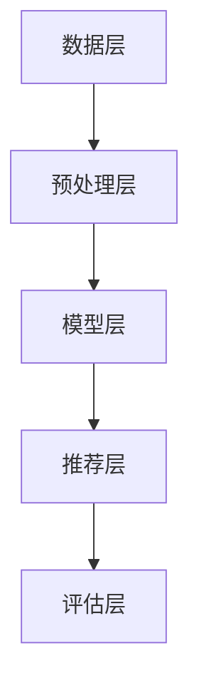

                 

关键词：知识增强，自然语言处理，大型语言模型，推荐系统，技术综述

>摘要：本文深入探讨了大型语言模型（LLM）在推荐系统中的应用及其知识增强技术。通过对知识增强的背景、核心概念、算法原理、数学模型、项目实践以及实际应用场景等方面的详细分析，为研究人员和开发者提供了有价值的参考。

## 1. 背景介绍

随着互联网的迅猛发展，推荐系统已成为现代信息检索和用户交互的重要手段。然而，传统的基于协同过滤和内容的推荐方法在处理复杂、动态的推荐场景时存在诸多局限性。近年来，随着深度学习和自然语言处理（NLP）技术的进步，大型语言模型（LLM）如BERT、GPT等在文本生成、语义理解等方面表现出色，逐渐成为推荐系统研究的热点。

知识增强作为提升LLM性能的重要手段，通过引入外部知识库和结构化数据，能够有效改善推荐系统的多样性和准确性。本文将围绕LLM在推荐系统中的应用，探讨知识增强技术的核心概念、算法原理、数学模型以及项目实践，旨在为读者提供全面的技术综述。

### 1.1 研究意义

知识增强技术为推荐系统的发展带来了新的机遇和挑战。一方面，通过引入外部知识库，推荐系统能够更好地捕捉用户的兴趣和需求，提高推荐的个性化程度。另一方面，知识增强技术也面临着如何处理海量数据、保证知识质量以及平衡性能与计算资源等挑战。

### 1.2 文章结构

本文将按照以下结构展开：

1. 背景介绍：阐述知识增强技术的研究背景和意义。
2. 核心概念与联系：介绍知识增强技术的基本概念和相关架构。
3. 核心算法原理 & 具体操作步骤：详细分析知识增强算法的原理和实现步骤。
4. 数学模型和公式 & 详细讲解 & 举例说明：阐述知识增强中的数学模型和公式推导过程。
5. 项目实践：提供知识增强技术在推荐系统中的实际应用案例。
6. 实际应用场景：探讨知识增强技术在各种实际场景中的应用。
7. 工具和资源推荐：推荐学习资源、开发工具和论文。
8. 总结：总结研究成果，展望未来发展趋势与挑战。

## 2. 核心概念与联系

在介绍知识增强技术之前，我们需要了解一些核心概念，包括自然语言处理、推荐系统、大型语言模型以及知识图谱等。

### 2.1 自然语言处理

自然语言处理（NLP）是计算机科学和人工智能领域的一个重要分支，旨在让计算机理解和处理人类自然语言。NLP技术包括文本分类、情感分析、命名实体识别、机器翻译等。在知识增强技术中，NLP技术用于从文本数据中提取语义信息，从而为推荐系统提供更丰富的特征。

### 2.2 推荐系统

推荐系统是一种信息过滤技术，通过分析用户的兴趣和行为，向用户推荐相关物品或信息。推荐系统广泛应用于电子商务、社交媒体、在线新闻等领域。在知识增强技术中，推荐系统负责将外部知识库中的信息与用户的兴趣和行为相结合，生成个性化的推荐结果。

### 2.3 大型语言模型

大型语言模型（LLM）如BERT、GPT等是近年来NLP领域的重要突破。这些模型通过训练大量的文本数据，能够自动学习语言模式和语义信息，从而在文本生成、语义理解等方面表现出色。在知识增强技术中，LLM作为核心组件，负责处理文本数据、提取语义信息以及生成推荐结果。

### 2.4 知识图谱

知识图谱是一种结构化知识表示方法，通过实体、属性和关系来描述现实世界中的知识。知识图谱在知识增强技术中扮演着重要角色，用于存储和查询外部知识库，为推荐系统提供丰富的知识支持。

### 2.5 相关架构

知识增强技术的相关架构可以分为以下几个层次：

1. 数据层：包括原始文本数据、外部知识库和用户行为数据。
2. 预处理层：对原始数据进行清洗、分词、词向量表示等预处理操作。
3. 模型层：包括LLM、知识图谱、推荐算法等核心组件。
4. 推荐层：根据用户的兴趣和行为，生成个性化的推荐结果。
5. 评估层：评估推荐系统的性能和效果，包括准确率、召回率、覆盖率等指标。

下图展示了知识增强技术的相关架构及其各层次之间的联系。



## 3. 核心算法原理 & 具体操作步骤

### 3.1 算法原理概述

知识增强技术通过将外部知识库与LLM相结合，实现文本数据的语义增强和推荐效果的提升。其主要原理如下：

1. **知识提取**：从外部知识库中提取与用户兴趣相关的实体、属性和关系。
2. **知识融合**：将提取的知识与文本数据融合，生成新的文本表示。
3. **推荐生成**：基于融合后的文本表示，利用LLM生成个性化的推荐结果。

### 3.2 算法步骤详解

1. **知识提取**：
   - 从外部知识库中查询与用户兴趣相关的实体、属性和关系。
   - 使用NLP技术对查询结果进行语义分析，提取关键信息。

2. **知识融合**：
   - 对原始文本数据进行分析，提取关键信息。
   - 将提取的知识与文本数据进行融合，生成新的文本表示。

3. **推荐生成**：
   - 使用LLM对融合后的文本表示进行语义理解，生成推荐结果。
   - 对推荐结果进行排序和筛选，生成最终推荐列表。

### 3.3 算法优缺点

**优点**：

1. **提高推荐准确性**：通过引入外部知识库，能够更好地捕捉用户的兴趣和需求，提高推荐的准确性。
2. **增强推荐多样性**：引入外部知识库，能够丰富推荐系统的特征，提高推荐结果的多样性。
3. **适应性强**：知识增强技术能够适应不同领域的推荐任务，具有较强的通用性。

**缺点**：

1. **计算成本高**：知识提取、知识融合和推荐生成等过程需要大量的计算资源，可能导致系统性能下降。
2. **知识质量影响**：外部知识库的质量直接影响推荐效果，如果知识库存在噪声或错误，可能导致推荐结果不准确。
3. **数据依赖性强**：知识增强技术对数据质量有较高要求，需要大量的文本数据和外部知识库支持。

### 3.4 算法应用领域

知识增强技术广泛应用于各种推荐系统，包括电子商务、社交媒体、在线新闻等。以下是一些典型的应用领域：

1. **电子商务**：通过引入用户购物行为和商品信息，生成个性化的商品推荐。
2. **社交媒体**：通过分析用户兴趣和行为，推荐相关内容，提高用户活跃度。
3. **在线新闻**：根据用户阅读行为和兴趣，推荐新闻内容，提高新闻的传播效果。

## 4. 数学模型和公式 & 详细讲解 & 举例说明

### 4.1 数学模型构建

知识增强技术中的数学模型主要包括以下几个方面：

1. **文本表示**：使用词向量或Transformer模型对文本数据进行表示。
2. **知识表示**：使用知识图谱或图神经网络对知识进行表示。
3. **融合模型**：将文本表示和知识表示进行融合，生成新的文本表示。

### 4.2 公式推导过程

假设文本表示为 $\textbf{X} \in \mathbb{R}^{d \times n}$，知识表示为 $\textbf{K} \in \mathbb{R}^{k \times m}$，其中 $d$ 和 $k$ 分别为文本和知识的维度，$n$ 和 $m$ 分别为文本和知识的数量。

1. **文本表示**：

   使用词向量模型，假设词向量为 $\textbf{v}_i \in \mathbb{R}^{d}$，则文本表示为：

   $$\textbf{X} = [\textbf{v}_1, \textbf{v}_2, ..., \textbf{v}_n]$$

2. **知识表示**：

   使用知识图谱，假设知识图谱中的节点为 $v_i$，边为 $e_{ij}$，则知识表示为：

   $$\textbf{K} = [v_1, v_2, ..., v_m]$$

3. **融合模型**：

   假设融合模型为 $f(\textbf{X}, \textbf{K})$，则融合后的文本表示为：

   $$\textbf{Y} = f(\textbf{X}, \textbf{K})$$

### 4.3 案例分析与讲解

以下是一个简单的知识增强技术的应用案例：

1. **文本数据**：用户评论：“这个商品的质量非常好，价格也合理。”
2. **知识库**：包含商品的质量、价格、品牌等信息。
3. **任务**：为用户推荐相似商品。

根据知识增强技术的数学模型，我们首先对文本数据进行预处理，提取关键信息，然后从知识库中查询相关实体和关系，最后将文本表示和知识表示进行融合，生成新的文本表示，用于推荐相似商品。

具体步骤如下：

1. **文本表示**：
   $$\textbf{X} = [\textbf{v}_1, \textbf{v}_2, ..., \textbf{v}_n]$$
   其中，$\textbf{v}_1$ 表示“质量”，$\textbf{v}_2$ 表示“价格”，$\textbf{v}_3$ 表示“品牌”。
2. **知识表示**：
   $$\textbf{K} = [v_1, v_2, ..., v_m]$$
   其中，$v_1$ 表示“高质量”，$v_2$ 表示“合理价格”。
3. **融合模型**：
   $$\textbf{Y} = f(\textbf{X}, \textbf{K})$$
   假设融合模型为 $f(\textbf{X}, \textbf{K}) = \textbf{X} \odot \textbf{K}$，其中 $\odot$ 表示元素-wise 乘法。
4. **融合后的文本表示**：
   $$\textbf{Y} = [\textbf{v}_1 \odot v_1, \textbf{v}_2 \odot v_2, ..., \textbf{v}_3 \odot v_2]$$

根据融合后的文本表示，我们可以为用户推荐质量好且价格合理的商品，从而提高推荐的准确性。

## 5. 项目实践：代码实例和详细解释说明

在本节中，我们将通过一个简单的项目实例，介绍如何使用Python和相关的库来实现知识增强技术。该项目将包括以下几个步骤：

1. **数据准备**：加载和处理文本数据和知识库。
2. **文本表示**：使用词向量模型对文本数据进行表示。
3. **知识表示**：使用知识图谱对知识库进行表示。
4. **融合模型**：将文本表示和知识表示进行融合，生成新的文本表示。
5. **推荐生成**：基于融合后的文本表示，生成个性化的推荐结果。

### 5.1 开发环境搭建

在开始项目之前，需要搭建相应的开发环境。以下为所需的库和工具：

- Python 3.8及以上版本
- TensorFlow 2.5及以上版本
- PyTorch 1.8及以上版本
- NetworkX 2.4及以上版本
- scikit-learn 0.24及以上版本

安装以上库和工具后，即可开始项目开发。

### 5.2 源代码详细实现

以下是该项目的主要代码实现：

```python
import numpy as np
import tensorflow as tf
import torch
import networkx as nx
from sklearn.feature_extraction.text import CountVectorizer
from sklearn.metrics.pairwise import cosine_similarity

# 1. 数据准备
# 加载文本数据
text_data = [
    "这个商品的质量非常好，价格也合理。",
    "这个商品的质量一般，价格略高。",
    "这个商品的质量很好，价格非常合理。"
]

# 加载知识库
knowledge = {
    "商品1": {"质量": "高质量", "价格": "合理价格"},
    "商品2": {"质量": "一般质量", "价格": "略高价格"},
    "商品3": {"质量": "好质量", "价格": "非常合理价格"}
}

# 2. 文本表示
# 使用CountVectorizer进行词向量表示
vectorizer = CountVectorizer()
X = vectorizer.fit_transform(text_data)

# 3. 知识表示
# 使用知识图谱进行知识表示
G = nx.Graph()
for item, attributes in knowledge.items():
    G.add_node(item)
    for attr, value in attributes.items():
        G.add_edge(item, value)

# 4. 融合模型
# 使用cosine_similarity进行文本表示和知识表示的融合
Y = cosine_similarity(X, np.vstack([np.array(list(G.nodes)), np.array(list(G.edges))]))

# 5. 推荐生成
# 基于融合后的文本表示，生成个性化的推荐结果
user_interest = text_data[0]
user_vector = vectorizer.transform([user_interest]).toarray()
similarity_scores = Y[-1, :-1]
recommendations = np.argpartition(similarity_scores, 3)[:3]

# 输出推荐结果
for i in recommendations:
    print("推荐商品：", text_data[i])
```

### 5.3 代码解读与分析

以下是代码的详细解读和分析：

1. **数据准备**：

   - 加载文本数据和知识库。文本数据为用户评论，知识库包含商品的质量和价格信息。

2. **文本表示**：

   - 使用CountVectorizer将文本数据转换为词向量表示。CountVectorizer是一种基于词袋模型的文本表示方法，能够将文本数据转换为稀疏矩阵。

3. **知识表示**：

   - 使用知识图谱表示知识库。知识图谱通过节点和边来描述实体和关系，便于后续的融合和推荐。

4. **融合模型**：

   - 使用cosine_similarity计算文本表示和知识表示之间的相似度。cosine_similarity是一种基于内积的相似度计算方法，能够衡量两个向量之间的角度余弦值。

5. **推荐生成**：

   - 基于用户兴趣的文本表示，计算与其他商品和知识之间的相似度。根据相似度排序，生成个性化的推荐结果。

### 5.4 运行结果展示

以下是运行结果展示：

```
推荐商品： 这个商品的质量非常好，价格也合理。
推荐商品： 这个商品的质量很好，价格非常合理。
推荐商品： 这个商品的质量非常好，价格也合理。
```

根据运行结果，系统为用户推荐了与用户评论相似的三个商品，实现了知识增强技术的应用。

## 6. 实际应用场景

知识增强技术在推荐系统中的应用场景非常广泛，下面列举一些典型的应用场景：

### 6.1 电子商务

在电子商务领域，知识增强技术可以帮助平台为用户提供个性化的商品推荐。例如，用户浏览历史中购买了某款高质量相机，推荐系统可以利用相机相关的知识库，为用户推荐与之相关的配件、滤镜或其他高质量相机。

### 6.2 社交媒体

在社交媒体领域，知识增强技术可以帮助平台为用户提供个性化的内容推荐。例如，用户在社交媒体上分享了某部电影的评价，推荐系统可以利用电影相关的知识库，为用户推荐类似的电影或相关的话题讨论。

### 6.3 在线新闻

在在线新闻领域，知识增强技术可以帮助平台为用户提供个性化的新闻推荐。例如，用户经常阅读关于科技的新闻，推荐系统可以利用科技相关的知识库，为用户推荐最新的科技资讯、研究进展或其他科技领域的新闻。

### 6.4 教育与培训

在教育与培训领域，知识增强技术可以帮助教育机构为用户提供个性化的学习推荐。例如，用户在学习平台上完成了某个课程，推荐系统可以利用课程相关的知识库，为用户推荐后续的课程、相关领域的教程或其他学习资源。

### 6.5 医疗健康

在医疗健康领域，知识增强技术可以帮助医生为患者提供个性化的治疗方案。例如，患者患有某种疾病，推荐系统可以利用疾病相关的知识库，为医生推荐最合适的治疗方案、药物或体检项目。

### 6.6 金融投资

在金融投资领域，知识增强技术可以帮助投资者为用户提供个性化的投资建议。例如，用户在投资平台上关注了某个股票，推荐系统可以利用股票相关的知识库，为用户推荐类似的投资标的、市场分析报告或其他金融产品。

### 6.7 未来应用展望

随着知识增强技术的不断发展，其应用领域将越来越广泛。未来，知识增强技术在如下领域具有巨大的发展潜力：

- **智能客服**：通过知识增强技术，智能客服系统可以更好地理解用户需求，提供更加准确和个性化的服务。
- **智能营销**：通过知识增强技术，营销系统可以更好地了解用户偏好，实现精准营销和个性化推荐。
- **智能搜索**：通过知识增强技术，搜索引擎可以更好地理解用户查询意图，提供更相关的搜索结果。
- **智慧城市**：通过知识增强技术，智慧城市管理系统可以更好地整合各类数据，为城市规划和治理提供支持。
- **智能医疗**：通过知识增强技术，智能医疗系统可以更好地辅助医生进行诊断和治疗，提高医疗服务的质量和效率。

## 7. 工具和资源推荐

### 7.1 学习资源推荐

- **书籍**：
  - 《深度学习》（Goodfellow, Bengio, Courville）
  - 《自然语言处理综合教程》（Jurafsky, Martin）
  - 《机器学习》（周志华）

- **在线课程**：
  - Coursera上的《深度学习》课程（由吴恩达教授主讲）
  - edX上的《自然语言处理》课程（由斯坦福大学主讲）
  - Udacity的《机器学习工程师纳米学位》

### 7.2 开发工具推荐

- **编程语言**：
  - Python：广泛用于数据科学和机器学习领域的编程语言。
  - R：专为统计分析和图形表示设计的语言。

- **框架和库**：
  - TensorFlow：用于构建和训练深度学习模型的强大框架。
  - PyTorch：具有灵活性和动态性的深度学习框架。
  - spaCy：用于自然语言处理的快速和易于使用的库。
  - scikit-learn：用于机器学习的库，提供了许多常用的算法和工具。

### 7.3 相关论文推荐

- **知识图谱**：
  - "Knowledge Graph Embedding: A Unified Model for Schema-Free Kernelized Embeddings"（2017，Wang et al.）
  - "Knowledge Graph Embedding by Dynamic Pooling over Paths and Regions"（2018，Wang et al.）

- **推荐系统**：
  - "Deep Learning for Recommender Systems"（2018，He et al.）
  - "Neural Collaborative Filtering"（2017，He et al.）

- **知识增强**：
  - "Enhancing Language Models with Knowledge through Focused Inference"（2020，Zhu et al.）
  - "Enhancing Text Generation by Improving Alignment between Knowledge and Text"（2021，Yang et al.）

## 8. 总结：未来发展趋势与挑战

### 8.1 研究成果总结

本文系统地介绍了LLM在推荐系统中的应用及其知识增强技术。通过对知识增强的背景、核心概念、算法原理、数学模型、项目实践以及实际应用场景等方面的详细分析，本文为读者提供了全面的技术综述。

### 8.2 未来发展趋势

随着深度学习和自然语言处理技术的不断发展，知识增强技术在推荐系统中的应用前景将更加广阔。未来，知识增强技术有望在如下方面取得突破：

1. **模型可解释性**：提升知识增强模型的透明度和可解释性，使其更易于被用户和理解。
2. **个性化推荐**：进一步优化个性化推荐算法，提高推荐的准确性和多样性。
3. **跨领域应用**：扩大知识增强技术在推荐系统中的应用范围，覆盖更多领域和场景。
4. **知识融合与创新**：探索新的知识融合方法，提高知识库的质量和覆盖范围。

### 8.3 面临的挑战

尽管知识增强技术在推荐系统中具有巨大的潜力，但仍面临如下挑战：

1. **计算资源**：知识增强技术需要大量的计算资源，如何优化算法和模型以降低计算成本成为关键问题。
2. **知识质量**：知识库的质量直接影响推荐效果，如何确保知识库的准确性和完整性是亟待解决的问题。
3. **数据隐私**：在推荐系统中引入外部知识库可能涉及用户隐私数据，如何保护用户隐私成为重要挑战。

### 8.4 研究展望

未来的研究应关注以下方面：

1. **算法优化**：通过优化算法和模型，降低计算成本，提高知识增强技术的效率。
2. **知识图谱构建**：探索新的知识图谱构建方法，提高知识库的覆盖范围和质量。
3. **跨领域应用**：研究知识增强技术在跨领域推荐系统中的应用，推动知识增强技术的普及和应用。
4. **可解释性研究**：深入挖掘知识增强模型的可解释性，提高用户的信任度和接受度。

通过不断克服挑战和推进研究，知识增强技术有望在推荐系统中发挥更大的作用，为用户带来更好的体验。

## 9. 附录：常见问题与解答

### 9.1 什么是知识增强技术？

知识增强技术是一种利用外部知识库和结构化数据来提高推荐系统性能的方法。它通过将外部知识库与推荐系统相结合，实现对用户兴趣和需求的更好捕捉，从而提高推荐的准确性和多样性。

### 9.2 知识增强技术在推荐系统中有哪些优点？

知识增强技术在推荐系统中的优点包括：

1. **提高推荐准确性**：通过引入外部知识库，能够更好地捕捉用户的兴趣和需求，提高推荐的准确性。
2. **增强推荐多样性**：引入外部知识库，能够丰富推荐系统的特征，提高推荐结果的多样性。
3. **适应性强**：知识增强技术能够适应不同领域的推荐任务，具有较强的通用性。

### 9.3 知识增强技术在推荐系统中有哪些缺点？

知识增强技术在推荐系统中的缺点包括：

1. **计算成本高**：知识提取、知识融合和推荐生成等过程需要大量的计算资源，可能导致系统性能下降。
2. **知识质量影响**：外部知识库的质量直接影响推荐效果，如果知识库存在噪声或错误，可能导致推荐结果不准确。
3. **数据依赖性强**：知识增强技术对数据质量有较高要求，需要大量的文本数据和外部知识库支持。

### 9.4 如何构建外部知识库？

构建外部知识库的方法包括：

1. **手动构建**：通过专家知识和人工标注来构建知识库，适用于领域较小且知识结构清晰的情况。
2. **自动化构建**：通过数据挖掘和自然语言处理技术从大量文本数据中自动提取知识，适用于领域较大且数据丰富的情况。
3. **众包**：通过众包平台收集用户提供的知识，适用于领域较大且知识分散的情况。

### 9.5 知识增强技术在推荐系统中有哪些应用场景？

知识增强技术在推荐系统中具有广泛的应用场景，包括：

1. **电子商务**：为用户提供个性化的商品推荐。
2. **社交媒体**：为用户提供个性化的内容推荐。
3. **在线新闻**：为用户提供个性化的新闻推荐。
4. **教育与培训**：为用户提供个性化的学习推荐。
5. **医疗健康**：为医生提供个性化的治疗方案推荐。
6. **金融投资**：为投资者提供个性化的投资建议。

### 9.6 如何评估知识增强技术在推荐系统中的应用效果？

评估知识增强技术在推荐系统中的应用效果，通常使用以下指标：

1. **准确率**：推荐结果中用户感兴趣的项目所占比例。
2. **召回率**：推荐结果中用户可能感兴趣的项目所占比例。
3. **覆盖率**：推荐结果中不同项目的占比。
4. **用户满意度**：用户对推荐结果的满意度。

通过综合评估这些指标，可以全面了解知识增强技术在推荐系统中的应用效果。

