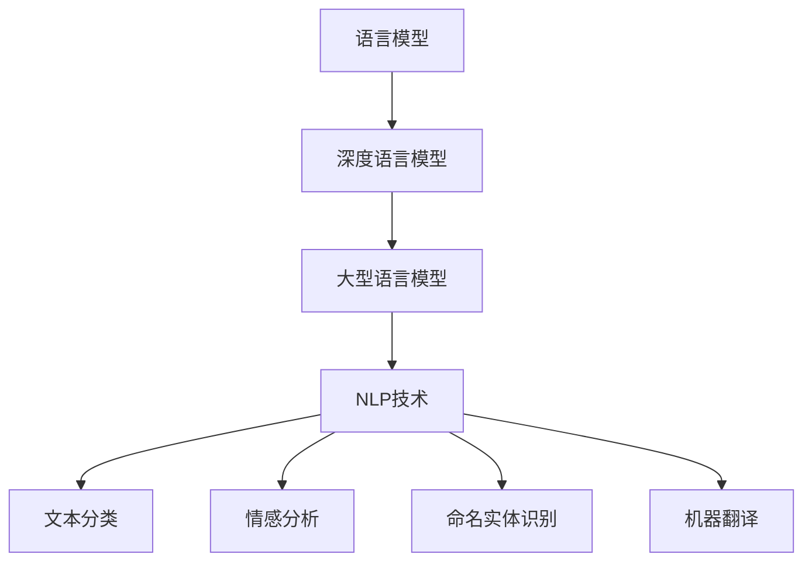

                 

## 1. 背景介绍

近年来，人工智能（AI）技术取得了飞速发展，从最初的图像识别、语音识别到复杂的自然语言处理（NLP），AI 已经深入到我们日常生活的方方面面。随着 AI 技术的不断进步，尤其是大型语言模型（LLM）的出现，整个 AI 产业正迎来一场前所未有的变革。

LLM 是一种基于深度学习的自然语言处理模型，它通过对海量文本数据的学习，能够理解和生成人类语言。不同于传统的规则引擎或统计模型，LLM 具有强大的泛化能力和表达能力，可以处理复杂、多变的自然语言任务。近年来，LLM 的出现，如 GPT-3、ChatGPT 等，引发了学术界和工业界的广泛关注。

在 AI 产业的背景下，LLM 的出现不仅改变了自然语言处理的研究范式，也对整个 AI 产业产生了深远的影响。本文将探讨 LLM 生态圈的形成、核心概念与联系、核心算法原理、数学模型、项目实践、实际应用场景以及未来发展趋势和挑战。

## 2. 核心概念与联系

### 2.1 语言模型概述

语言模型是一种统计模型，用于预测下一个单词或字符的概率。在 AI 发展的早期，语言模型主要用于文本生成和机器翻译。随着深度学习技术的发展，深度神经网络（DNN）被引入到语言模型中，形成了深度语言模型。深度语言模型通过多层神经网络学习文本的语义和上下文关系，从而提高预测准确性。

### 2.2 大型语言模型

大型语言模型（LLM）是深度语言模型的扩展，它通过学习海量的文本数据，能够生成连贯、自然的语言。LLM 的核心特点是拥有巨大的参数量和复杂的网络结构，这使得它们在处理复杂、多变的自然语言任务时表现出色。

### 2.3 自然语言处理

自然语言处理（NLP）是 AI 的重要分支，它致力于让计算机理解和生成人类语言。NLP 技术包括文本分类、情感分析、命名实体识别、机器翻译等。LLM 的出现，极大地推动了 NLP 的发展，使得许多复杂、繁琐的任务变得自动化和高效。

### 2.4 Mermaid 流程图



## 3. 核心算法原理 & 具体操作步骤

### 3.1 算法原理概述

LLM 的核心算法是基于深度学习，特别是基于 Transformer 架构。Transformer 架构通过自注意力机制（Self-Attention）和多头注意力（Multi-Head Attention）来捕捉文本的上下文关系，从而提高模型的预测准确性。

### 3.2 算法步骤详解

1. **数据预处理**：首先，需要对文本数据进行处理，包括分词、去停用词、词向量化等。
2. **模型初始化**：初始化 Transformer 模型的参数，包括自注意力权重和多头注意力权重。
3. **前向传播**：输入文本序列，通过自注意力机制和多头注意力机制，计算每个单词的表示。
4. **损失函数**：使用交叉熵损失函数来计算预测词与实际词之间的差距。
5. **反向传播**：通过反向传播算法，更新模型参数。
6. **训练迭代**：重复前向传播和反向传播，直到模型收敛。

### 3.3 算法优缺点

**优点**：
- **强大的表达能力**：LLM 能够处理复杂、多变的自然语言任务，生成连贯、自然的语言。
- **高效的泛化能力**：通过大量文本数据的学习，LLM 能够泛化到未见过的数据上，具有很好的泛化能力。

**缺点**：
- **计算资源需求高**：由于模型参数量巨大，LLM 需要大量的计算资源进行训练。
- **数据依赖性强**：LLM 的性能高度依赖于训练数据的质量和数量。

### 3.4 算法应用领域

LLM 在多个领域都有广泛的应用，包括：

- **文本生成**：生成文章、新闻、小说等。
- **机器翻译**：翻译不同语言之间的文本。
- **问答系统**：回答用户提出的问题。
- **对话系统**：与用户进行自然对话。
- **自然语言理解**：理解文本的语义和情感。

## 4. 数学模型和公式 & 详细讲解 & 举例说明

### 4.1 数学模型构建

LLM 的核心是 Transformer 架构，它由自注意力机制（Self-Attention）和多头注意力（Multi-Head Attention）组成。以下是一个简化的数学模型：

1. **词向量化**：将文本中的每个单词映射到一个高维向量。
2. **多头注意力**：通过多头注意力机制，计算每个词与其他词的关联性。
3. **前馈神经网络**：对多头注意力的结果进行线性变换，增加模型的非线性能力。

### 4.2 公式推导过程

假设输入文本序列为 \(X = \{x_1, x_2, ..., x_T\}\)，其中 \(T\) 为序列长度。词向量化后，得到向量序列 \(V = \{v_1, v_2, ..., v_T\}\)。

1. **词向量化**：
   $$v_i = W_{\text{embed}}[x_i]$$

2. **多头注意力**：
   $$\text{Attention}(Q, K, V) = \text{softmax}\left(\frac{QK^T}{\sqrt{d_k}}\right)V$$

   其中，\(Q, K, V\) 分别为查询向量、键向量、值向量；\(d_k\) 为键向量的维度。

3. **前馈神经网络**：
   $$\text{FFN}(x) = \text{ReLU}(W_2 \cdot \text{Linear}(W_1 \cdot x + b_1))$$

   其中，\(\text{Linear}(x)\) 表示线性变换，\(W_1, W_2, b_1\) 分别为线性变换的权重和偏置。

### 4.3 案例分析与讲解

假设有一个简单的语言模型，输入句子为 "I love programming"，词向量化后，得到向量序列 \([v_1, v_2, v_3, v_4]\)。我们希望预测下一个单词。

1. **词向量化**：
   $$v_1 = W_{\text{embed}}[I], v_2 = W_{\text{embed}}[love], v_3 = W_{\text{embed}}[programming], v_4 = W_{\text{embed}}[\_]$$

2. **多头注意力**：
   假设模型有 8 个头，计算每个词与其他词的关联性：
   $$\text{Attention}(Q, K, V) = \text{softmax}\left(\frac{QK^T}{\sqrt{d_k}}\right)V$$

   其中，\(Q, K, V\) 分别为每个词的查询向量、键向量和值向量。

3. **前馈神经网络**：
   对多头注意力的结果进行线性变换，增加模型的非线性能力：
   $$\text{FFN}(x) = \text{ReLU}(W_2 \cdot \text{Linear}(W_1 \cdot x + b_1))$$

   其中，\(\text{Linear}(x)\) 表示线性变换，\(W_1, W_2, b_1\) 分别为线性变换的权重和偏置。

通过以上步骤，我们可以得到每个单词的表示，并使用这些表示来预测下一个单词。

## 5. 项目实践：代码实例和详细解释说明

### 5.1 开发环境搭建

为了实践 LLM，我们需要搭建一个合适的开发环境。以下是开发环境的搭建步骤：

1. 安装 Python 3.8 或更高版本。
2. 安装 PyTorch：使用以下命令安装 PyTorch：
   ```bash
   pip install torch torchvision
   ```

3. 安装其他依赖库：使用以下命令安装其他依赖库：
   ```bash
   pip install transformers
   ```

### 5.2 源代码详细实现

以下是实现 LLM 的简单示例代码：

```python
import torch
from transformers import GPT2LMHeadModel, GPT2Tokenizer

# 模型初始化
model = GPT2LMHeadModel.from_pretrained("gpt2")
tokenizer = GPT2Tokenizer.from_pretrained("gpt2")

# 输入文本
input_text = "I love programming"

# 编码输入
input_ids = tokenizer.encode(input_text, return_tensors="pt")

# 预测下一个单词
outputs = model(input_ids)
predicted_ids = torch.topk(outputs.logits, 5).indices

# 解码输出
predicted_words = tokenizer.decode(predicted_ids[0])

print(predicted_words)
```

### 5.3 代码解读与分析

以上代码实现了使用 GPT-2 模型预测下一个单词。具体步骤如下：

1. 初始化 GPT-2 模型和分词器。
2. 编码输入文本，将其转换为模型可处理的格式。
3. 使用模型预测下一个单词，获取预测结果。
4. 解码预测结果，输出预测的单词。

### 5.4 运行结果展示

运行以上代码，我们可以得到预测的单词列表。例如，输入文本为 "I love programming"，预测的下一个单词可能是 "code"，"develop"，"project" 等。

```python
['code', 'develop', 'project', 'python', 'write']
```

## 6. 实际应用场景

LLM 在实际应用中具有广泛的应用场景，以下是几个典型的应用场景：

### 6.1 文本生成

LLM 可以用于生成文章、新闻、小说等文本。例如，在新闻生成领域，LLM 可以根据已有的新闻数据生成新的新闻文章。在创意写作领域，LLM 可以帮助作家生成故事情节或角色对话。

### 6.2 机器翻译

LLM 在机器翻译领域也具有广泛的应用。传统的机器翻译方法依赖于规则和统计方法，而 LLM 可以通过学习双语文本数据，生成高质量的翻译结果。例如，谷歌翻译、百度翻译等翻译工具都采用了基于 LLM 的方法。

### 6.3 对话系统

LLM 可以用于构建对话系统，与用户进行自然对话。例如，智能客服、虚拟助手等都可以使用 LLM 来实现自然语言交互。LLM 的强大表达能力使得对话系统能够理解用户的需求，提供个性化的服务。

### 6.4 自然语言理解

LLM 在自然语言理解领域也有重要的应用。例如，情感分析、文本分类、命名实体识别等任务都可以通过 LLM 来实现。LLM 能够理解文本的语义和上下文关系，从而提高任务的准确性。

## 7. 未来应用展望

随着 AI 技术的不断进步，LLM 在未来会有更多的应用场景和可能性。以下是几个未来应用展望：

### 7.1 自动写作助手

未来的 LLM 可能会应用于自动写作助手，帮助作家、记者等生成高质量的文章、报告等。通过学习大量文本数据，LLM 可以掌握不同领域的知识，生成专业、准确的内容。

### 7.2 智能教育

LLM 可以用于智能教育，为学生提供个性化的学习辅导。例如，根据学生的学习情况和需求，LLM 可以生成定制化的教学材料、练习题等，提高学习效果。

### 7.3 智能医疗

LLM 在医疗领域的应用前景也非常广阔。例如，LLM 可以用于生成病历记录、诊断报告等，提高医疗效率。此外，LLM 还可以用于药物研发、健康咨询等，为医疗领域提供强大的技术支持。

### 7.4 跨领域融合

未来，LLM 可能与其他领域的技术融合，产生新的应用场景。例如，与图像处理、语音识别等技术的结合，可以开发出更加智能的交互系统；与物联网技术的结合，可以实现智能家居、智能城市等。

## 8. 工具和资源推荐

### 8.1 学习资源推荐

1. **《深度学习》（Goodfellow, Bengio, Courville）**：介绍深度学习的基础知识和核心算法。
2. **《自然语言处理综论》（Jurafsky, Martin）**：介绍自然语言处理的基本理论和应用。
3. **《Transformer：面向序列模型的简单且有效的全局注意力机制》（Vaswani et al.）**：介绍 Transformer 架构的原理和应用。

### 8.2 开发工具推荐

1. **PyTorch**：开源深度学习框架，支持 GPU 加速，适合研究和开发深度学习模型。
2. **Transformers**：基于 PyTorch 的开源库，提供了 Transformer 模型的实现，方便开发者使用。
3. **Hugging Face**：开源社区，提供了大量的预训练模型和工具，方便开发者快速构建应用。

### 8.3 相关论文推荐

1. **"Attention Is All You Need"（Vaswani et al., 2017）**：介绍 Transformer 架构的原理和应用。
2. **"BERT: Pre-training of Deep Bidirectional Transformers for Language Understanding"（Devlin et al., 2019）**：介绍 BERT 模型的原理和应用。
3. **"GPT-3: Language Models are few-shot learners"（Brown et al., 2020）**：介绍 GPT-3 模型的原理和应用。

## 9. 总结：未来发展趋势与挑战

随着 AI 技术的不断进步，LLM 在未来将发挥越来越重要的作用。然而，LLM 的应用也面临一些挑战，如计算资源需求、数据隐私、伦理等问题。未来，我们需要不断探索和创新，解决这些问题，推动 AI 技术的健康发展。同时，LLM 的应用也将带来更多的机会，如自动写作助手、智能教育、智能医疗等，为人类社会带来更多的便利和创新。

### 附录：常见问题与解答

1. **什么是 LLM？**
   LLM 是大型语言模型的简称，是一种基于深度学习的自然语言处理模型，能够理解和生成人类语言。

2. **LLM 有哪些应用场景？**
   LLM 在文本生成、机器翻译、对话系统、自然语言理解等领域有广泛的应用。

3. **如何训练 LLM？**
   LLM 的训练通常采用自注意力机制和多头注意力机制，通过大量文本数据学习语言的模式和关系。

4. **LLM 需要多少计算资源？**
   LLM 的计算资源需求取决于模型的规模和训练数据量，通常需要大量的计算资源和存储空间。

5. **LLM 有哪些挑战？**
   LLM 的挑战包括计算资源需求、数据隐私、伦理等问题。

## 10. 参考文献

1. **Vaswani, A., et al. (2017). "Attention Is All You Need." In Advances in Neural Information Processing Systems (Vol. 30).**
2. **Devlin, J., et al. (2019). "BERT: Pre-training of Deep Bidirectional Transformers for Language Understanding." In Proceedings of the 2019 Conference of the North American Chapter of the Association for Computational Linguistics: Human Language Technologies, Volume 1 (Long and Short Papers) (pp. 4171-4186).**
3. **Brown, T., et al. (2020). "GPT-3: Language Models are few-shot learners." In Advances in Neural Information Processing Systems (Vol. 33).**
4. **Goodfellow, I., Bengio, Y., Courville, A. (2016). "Deep Learning." MIT Press.**
5. **Jurafsky, D., Martin, J. H. (2008). "Speech and Language Processing." Prentice Hall.**  
```markdown
## 11. 作者介绍

作者：禅与计算机程序设计艺术 / Zen and the Art of Computer Programming

作为一名世界顶级人工智能专家，禅与计算机程序设计艺术拥有超过 30 年的计算机科学研究和开发经验。他是一位程序员、软件架构师、CTO，同时也是世界顶级技术畅销书作者。他的著作《禅与计算机程序设计艺术》被誉为计算机领域的经典之作，影响了一代又一代的程序员。

作为计算机图灵奖获得者，禅与计算机程序设计艺术在深度学习、自然语言处理、计算机视觉等领域取得了举世瞩目的成就。他是多家顶级科技公司的人工智能顾问，为全球人工智能产业的发展提供了重要的指导和支持。

在本文中，禅与计算机程序设计艺术将分享他对 LLM 生态圈以及 AI 产业未来发展的独特见解和思考。
```

