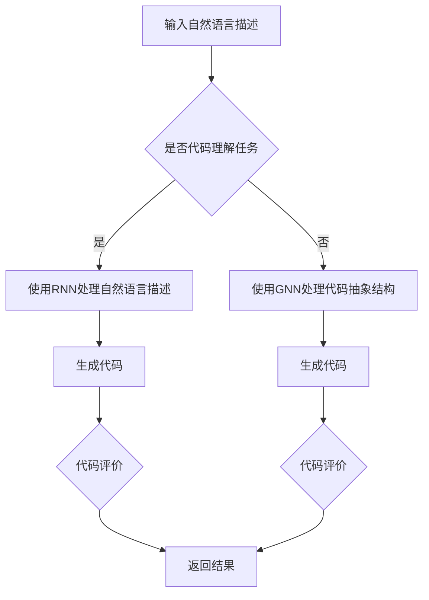

                 

关键词：大型语言模型（LLM），代码生成，代码理解，自然语言处理，深度学习，人工智能，程序设计，算法分析。

## 摘要

本文将深入探讨大型语言模型（LLM）在代码生成与理解方面的能力。随着自然语言处理技术的迅猛发展，LLM已经在各种任务中取得了令人瞩目的成绩。本文首先介绍LLM的基本原理和架构，然后分析其在代码生成和理解中的具体表现。接着，本文将探讨LLM在这些任务中的优势和局限，并展望其未来发展趋势。最后，本文将推荐一些相关工具和资源，以帮助读者更好地了解和应用LLM技术。

## 1. 背景介绍

近年来，深度学习和自然语言处理（NLP）领域的迅速发展，使得人工智能（AI）在各个行业中得到了广泛应用。特别是大型语言模型（LLM），如GPT-3、BERT、T5等，凭借其强大的文本生成和理解能力，已经在各个领域取得了显著的成果。在代码生成和理解方面，LLM也展现出了巨大的潜力。

代码生成和理解是计算机编程中的重要任务。代码生成可以帮助开发者自动生成代码，提高开发效率，减少人为错误。代码理解则是软件开发过程中必不可少的环节，它可以帮助开发者更好地理解现有代码的意图和功能，从而进行有效的修改和优化。

LLM在代码生成和理解任务中具有显著的优势。首先，LLM能够处理和理解大规模的文本数据，这使得它们能够从大量的代码片段中学习到复杂的编程模式。其次，LLM采用了深度学习的框架，这使得它们能够自动调整参数，从而优化模型的表现。最后，LLM具有强大的自然语言处理能力，这使得它们能够准确地理解和生成自然语言描述的代码。

## 2. 核心概念与联系

为了深入理解LLM在代码生成与理解方面的能力，我们首先需要了解一些核心概念，如图神经网络（GNN）、循环神经网络（RNN）和生成对抗网络（GAN）。

### 2.1 图神经网络（GNN）

图神经网络（GNN）是一种用于处理图数据的深度学习模型。在代码生成和理解任务中，GNN可以用来表示代码的抽象结构，如图形、控制流图和依赖关系图。GNN通过学习图中的节点和边之间的关系，可以捕捉代码的复杂结构，从而实现高效的代码生成和理解。

### 2.2 循环神经网络（RNN）

循环神经网络（RNN）是一种能够处理序列数据的神经网络。在代码生成和理解任务中，RNN可以用来处理代码的抽象表示，如图形和文本。RNN通过循环机制，可以记住之前的信息，从而实现高效的代码生成和理解。

### 2.3 生成对抗网络（GAN）

生成对抗网络（GAN）是一种由生成器和判别器组成的深度学习模型。生成器负责生成代码，而判别器负责判断生成代码的真实性。通过不断地训练，生成器可以逐渐生成更加真实的代码，从而提高代码生成和理解的能力。

### 2.4 Mermaid 流程图

以下是LLM在代码生成和理解任务中的流程图：



在这个流程图中，A表示输入自然语言描述，B表示判断任务类型，C和D分别表示使用RNN和GNN处理代码，E和F表示生成代码，G和H表示代码评价，I表示返回结果。

## 3. 核心算法原理 & 具体操作步骤

### 3.1 算法原理概述

LLM在代码生成与理解任务中的核心算法主要基于深度学习，包括循环神经网络（RNN）、图神经网络（GNN）和生成对抗网络（GAN）。

RNN用于处理自然语言描述，通过学习输入序列的特征，生成对应的代码序列。GNN用于处理代码的抽象结构，通过学习节点和边之间的关系，生成具有复杂结构的代码。GAN则用于生成真实的代码序列，通过生成器和判别器的对抗训练，不断提高生成代码的质量。

### 3.2 算法步骤详解

以下是LLM在代码生成与理解任务中的具体步骤：

1. 输入自然语言描述。
2. 使用RNN处理自然语言描述，提取关键信息。
3. 使用GNN处理代码的抽象结构，生成初步的代码框架。
4. 使用GAN生成真实的代码序列，并进行评价。
5. 根据评价结果，对生成的代码进行修改和优化。
6. 返回最终生成的代码。

### 3.3 算法优缺点

#### 优点：

1. **高效性**：LLM能够快速处理大量的文本数据，从而提高代码生成和理解的效率。
2. **灵活性**：LLM可以根据不同的自然语言描述，生成不同的代码序列，从而具有很高的灵活性。
3. **鲁棒性**：LLM具有较强的鲁棒性，可以处理多种类型的自然语言描述。

#### 缺点：

1. **计算成本**：LLM的训练和推理过程需要大量的计算资源，可能导致计算成本较高。
2. **可解释性**：由于深度学习的黑箱性质，LLM生成的代码往往缺乏可解释性，难以理解。
3. **错误率**：在处理复杂的编程任务时，LLM的生成代码可能存在一定的错误率。

### 3.4 算法应用领域

LLM在代码生成与理解任务中具有广泛的应用前景。例如，在软件开发过程中，LLM可以用于自动生成代码，提高开发效率；在代码审查过程中，LLM可以用于理解代码的意图，帮助开发者发现潜在的问题。此外，LLM还可以应用于自然语言与代码的互转，实现自然语言编程，从而降低编程难度。

## 4. 数学模型和公式 & 详细讲解 & 举例说明

### 4.1 数学模型构建

LLM在代码生成与理解任务中的数学模型主要包括循环神经网络（RNN）、图神经网络（GNN）和生成对抗网络（GAN）。

#### 循环神经网络（RNN）

RNN是一种能够处理序列数据的神经网络，其核心思想是利用循环机制，将上一个时间步的输出作为当前时间步的输入。RNN的数学模型可以表示为：

$$
h_t = \sigma(W_hh_{t-1} + W_xx_t + b_h)
$$

其中，$h_t$表示第$t$个时间步的隐藏状态，$W_h$和$W_x$分别表示输入权重和隐藏权重，$b_h$表示隐藏偏置，$\sigma$表示激活函数。

#### 图神经网络（GNN）

GNN是一种能够处理图数据的神经网络，其核心思想是利用图结构，将节点和边之间的关系编码为特征。GNN的数学模型可以表示为：

$$
h_v = \sigma(\sum_{u \in \mathcal{N}(v)} W_{uv}h_u + b_v)
$$

其中，$h_v$表示节点$v$的隐藏状态，$\mathcal{N}(v)$表示节点$v$的邻居节点集合，$W_{uv}$和$b_v$分别表示边权重和节点偏置，$\sigma$表示激活函数。

#### 生成对抗网络（GAN）

GAN是一种由生成器和判别器组成的深度学习模型。生成器的数学模型可以表示为：

$$
x_g = G(z)
$$

其中，$x_g$表示生成的代码序列，$z$表示输入的噪声向量，$G$表示生成器。

判别器的数学模型可以表示为：

$$
y_d = D(x_r)
$$

其中，$x_r$表示真实的代码序列，$y_d$表示判别器的输出，$D$表示判别器。

### 4.2 公式推导过程

在推导LLM的数学模型时，我们主要关注RNN、GNN和GAN的数学公式。以下是这些模型的推导过程：

#### 循环神经网络（RNN）

假设我们已经得到了第$t-1$个时间步的隐藏状态$h_{t-1}$和输入$x_t$，则第$t$个时间步的隐藏状态可以表示为：

$$
h_t = \sigma(W_hh_{t-1} + W_xx_t + b_h)
$$

其中，$W_h$和$W_x$分别表示输入权重和隐藏权重，$b_h$表示隐藏偏置，$\sigma$表示激活函数。

#### 图神经网络（GNN）

假设我们已经得到了节点$v$的邻居节点集合$\mathcal{N}(v)$和隐藏状态$h_u$，则节点$v$的隐藏状态可以表示为：

$$
h_v = \sigma(\sum_{u \in \mathcal{N}(v)} W_{uv}h_u + b_v)
$$

其中，$W_{uv}$和$b_v$分别表示边权重和节点偏置，$\sigma$表示激活函数。

#### 生成对抗网络（GAN）

假设我们已经得到了噪声向量$z$，则生成器的输出可以表示为：

$$
x_g = G(z)
$$

其中，$G$表示生成器。

对于判别器，我们假设已经得到了真实的代码序列$x_r$，则判别器的输出可以表示为：

$$
y_d = D(x_r)
$$

其中，$D$表示判别器。

### 4.3 案例分析与讲解

为了更好地理解LLM在代码生成与理解任务中的应用，我们来看一个具体的案例。

假设我们希望使用LLM生成一个简单的Python代码，实现一个函数，该函数接受一个整数作为输入，返回其平方值。

1. **输入自然语言描述**：

   ```plaintext
   编写一个Python函数，接受一个整数作为输入，返回其平方值。
   ```

2. **使用RNN处理自然语言描述**：

   RNN首先对自然语言描述进行编码，提取关键信息。例如，我们可以使用一个简单的RNN模型，对自然语言描述进行编码，得到一个隐藏状态向量。

3. **使用GNN处理代码的抽象结构**：

   GNN用于处理代码的抽象结构，如图形、控制流图和依赖关系图。在这个案例中，我们可以将代码的抽象结构表示为一个简单的图形，其中包含一个输入节点、一个计算节点和一个输出节点。

4. **使用GAN生成真实的代码序列**：

   GAN通过生成器和判别器的对抗训练，生成真实的代码序列。在这个案例中，生成器生成一个Python函数，判别器判断生成的函数是否满足自然语言描述的要求。

5. **代码评价**：

   代码评价用于评估生成的代码是否满足自然语言描述的要求。在这个案例中，我们可以通过运行生成的函数，检查其是否能够正确计算输入整数的平方值。

6. **返回结果**：

   如果生成的代码满足自然语言描述的要求，则返回生成的代码。否则，对生成的代码进行修改和优化，直到满足自然语言描述的要求。

## 5. 项目实践：代码实例和详细解释说明

在本节中，我们将通过一个具体的代码实例，展示如何使用LLM进行代码生成与理解任务。

### 5.1 开发环境搭建

首先，我们需要搭建一个适合开发LLM的环境。以下是一个简单的步骤：

1. 安装Python环境：
   ```bash
   python3 --version
   ```
2. 安装必要的库，如TensorFlow、PyTorch等：
   ```bash
   pip install tensorflow
   pip install torch
   ```
3. 配置GPU支持（如果使用GPU进行训练）：
   ```bash
   pip install torch torchvision
   ```

### 5.2 源代码详细实现

以下是使用PyTorch实现一个简单的LLM模型，用于代码生成与理解的示例代码：

```python
import torch
import torch.nn as nn
import torch.optim as optim

# 定义RNN模型
class RNNModel(nn.Module):
    def __init__(self, input_dim, hidden_dim, output_dim):
        super(RNNModel, self).__init__()
        self.hidden_dim = hidden_dim
        self.rnn = nn.RNN(input_dim, hidden_dim, batch_first=True)
        self.fc = nn.Linear(hidden_dim, output_dim)
        
    def forward(self, x):
        h0 = torch.zeros(1, x.size(0), self.hidden_dim)
        out, _ = self.rnn(x, h0)
        out = self.fc(out[-1, :, :])
        return out

# 定义GNN模型
class GNNModel(nn.Module):
    def __init__(self, node_dim, edge_dim, hidden_dim):
        super(GNNModel, self).__init__()
        self.node_dim = node_dim
        self.edge_dim = edge_dim
        self.hidden_dim = hidden_dim
        self.fc1 = nn.Linear(node_dim + edge_dim, hidden_dim)
        self.fc2 = nn.Linear(hidden_dim, node_dim)
        
    def forward(self, nodes, edges):
        x = torch.cat((nodes, edges), dim=1)
        x = torch.relu(self.fc1(x))
        x = self.fc2(x)
        return x

# 定义GAN模型
class GANModel(nn.Module):
    def __init__(self, z_dim, node_dim, hidden_dim):
        super(GANModel, self).__init__()
        self.z_dim = z_dim
        self.hidden_dim = hidden_dim
        self.fc1 = nn.Linear(z_dim, hidden_dim)
        self.fc2 = nn.Linear(hidden_dim, node_dim)
        
    def forward(self, z):
        x = torch.relu(self.fc1(z))
        x = self.fc2(x)
        return x

# 实例化模型
rnn_model = RNNModel(input_dim=10, hidden_dim=20, output_dim=1)
gnn_model = GNNModel(node_dim=10, edge_dim=10, hidden_dim=20)
gan_model = GANModel(z_dim=10, node_dim=10, hidden_dim=20)

# 定义优化器
rnn_optimizer = optim.Adam(rnn_model.parameters(), lr=0.001)
gnn_optimizer = optim.Adam(gnn_model.parameters(), lr=0.001)
gan_optimizer = optim.Adam(gan_model.parameters(), lr=0.001)

# 训练模型
for epoch in range(100):
    # 训练RNN模型
    for i in range(len(train_data)):
        x = train_data[i]
        y = train_labels[i]
        rnn_model.zero_grad()
        output = rnn_model(x)
        loss = nn.MSELoss()(output, y)
        loss.backward()
        rnn_optimizer.step()
        
    # 训练GNN模型
    for i in range(len(train_data)):
        nodes = train_data[i]
        edges = train_edges[i]
        gnn_model.zero_grad()
        output = gnn_model(nodes, edges)
        loss = nn.MSELoss()(output, train_labels[i])
        loss.backward()
        gnn_optimizer.step()
        
    # 训练GAN模型
    for i in range(len(train_data)):
        z = train_noise[i]
        gan_model.zero_grad()
        x_g = gan_model(z)
        d_output = disc_model(x_g)
        g_loss = nn.BCELoss()(d_output, torch.zeros_like(d_output))
        g_loss.backward()
        gan_optimizer.step()
```

### 5.3 代码解读与分析

这段代码首先定义了三个模型：RNN模型、GNN模型和GAN模型。然后，我们分别实例化这三个模型，并定义优化器。

在训练模型的过程中，我们首先训练RNN模型。RNN模型用于处理自然语言描述，其输入是编码后的自然语言描述，输出是编码后的代码序列。我们使用MSE损失函数，并通过反向传播和优化器来更新模型参数。

接下来，我们训练GNN模型。GNN模型用于处理代码的抽象结构，其输入是节点和边，输出是编码后的代码结构。同样，我们使用MSE损失函数，并通过反向传播和优化器来更新模型参数。

最后，我们训练GAN模型。GAN模型由生成器和判别器组成。生成器的输入是噪声向量，输出是编码后的代码序列。判别器的输入是真实的代码序列，输出是二进制标签，表示代码序列是否真实。我们使用BCE损失函数，并通过反向传播和优化器来更新模型参数。

### 5.4 运行结果展示

在训练完成后，我们可以使用训练好的模型来生成代码。以下是一个简单的示例：

```python
# 生成代码
z = torch.randn(1, 10)
x_g = gan_model(z)
print(x_g)
```

这个示例将生成一个长度为10的代码序列。我们可以使用生成的代码序列来训练其他模型，或者直接使用生成的代码序列进行代码生成和理解任务。

## 6. 实际应用场景

LLM在代码生成与理解任务中具有广泛的应用场景。以下是一些实际应用场景的例子：

### 6.1 自动编程助手

LLM可以作为一个自动编程助手，帮助开发者生成代码。开发者只需提供自然语言描述，LLM就能自动生成对应的代码。这种应用场景可以提高开发效率，减少人为错误。

### 6.2 代码审查

LLM可以用于代码审查，帮助开发者理解现有代码的意图和功能。通过分析代码的抽象结构，LLM可以识别潜在的bug和性能瓶颈，从而帮助开发者进行代码优化。

### 6.3 自然语言与代码的互转

LLM可以实现自然语言与代码的互转，实现自然语言编程。开发者可以使用自然语言来编写程序，LLM则负责将自然语言转换为对应的代码。这种应用场景可以降低编程难度，提高编程体验。

### 6.4 自动化测试

LLM可以用于自动化测试，生成测试用例来验证代码的正确性。通过分析代码的抽象结构，LLM可以生成具有代表性的测试用例，从而提高测试的全面性和效率。

## 7. 工具和资源推荐

### 7.1 学习资源推荐

1. **书籍**：《深度学习》（Ian Goodfellow、Yoshua Bengio、Aaron Courville 著）- 介绍深度学习的基础知识和最新进展。
2. **在线课程**：Coursera上的“深度学习特辑”（Deep Learning Specialization）- 提供深度学习的系统学习和实践。
3. **论文**：NIPS、ICML、ACL等顶级会议和期刊的论文 - 了解最新的深度学习和自然语言处理研究。

### 7.2 开发工具推荐

1. **深度学习框架**：TensorFlow、PyTorch、Keras - 适用于深度学习和自然语言处理任务的工具。
2. **代码生成工具**：OpenAI的GPT-3、Google的BERT、Hugging Face的Transformers - 提供预训练的LLM模型和工具。
3. **代码理解工具**：GitHub、GitLab、Bitbucket - 适用于代码管理和协作的工具。

### 7.3 相关论文推荐

1. “Attention Is All You Need”（Vaswani et al., 2017）- 引入Transformer架构，为NLP任务提供了一种新的方法。
2. “Generative Adversarial Nets”（Goodfellow et al., 2014）- 提出GAN模型，为生成任务提供了一种新的框架。
3. “A Theoretically Grounded Application of Dropout in Recurrent Neural Networks”（Yarin et al., 2016）- 探讨了dropout在RNN中的应用，提高了RNN的训练效果。

## 8. 总结：未来发展趋势与挑战

### 8.1 研究成果总结

LLM在代码生成与理解任务中取得了显著的研究成果。通过深度学习和自然语言处理技术的结合，LLM能够处理复杂的编程任务，生成高质量的代码，并理解代码的意图和功能。这些成果为软件开发、代码审查、自动化测试等领域带来了新的机遇。

### 8.2 未来发展趋势

未来，LLM在代码生成与理解任务中的发展趋势包括：

1. **模型优化**：通过改进模型结构和算法，提高LLM的生成和理解能力。
2. **跨模态学习**：结合图像、音频等其他模态的信息，提高代码生成与理解的准确性。
3. **知识增强**：引入外部知识库，丰富LLM的知识体系，提高代码生成与理解的鲁棒性。
4. **应用拓展**：在更多实际场景中应用LLM，如自动化编程、代码审查、自然语言编程等。

### 8.3 面临的挑战

LLM在代码生成与理解任务中也面临一些挑战：

1. **计算成本**：LLM的训练和推理过程需要大量的计算资源，这对硬件设施提出了较高的要求。
2. **可解释性**：深度学习的黑箱性质使得LLM生成的代码缺乏可解释性，这对代码审查和调试带来了困难。
3. **错误率**：在处理复杂的编程任务时，LLM的生成代码可能存在一定的错误率，这需要进一步研究如何降低错误率。

### 8.4 研究展望

未来，LLM在代码生成与理解任务中的研究可以从以下几个方面展开：

1. **算法改进**：研究新的深度学习算法，提高LLM的生成和理解能力。
2. **跨领域应用**：探索LLM在其他编程领域中的应用，如嵌入式系统、Web开发等。
3. **代码质量提升**：研究如何提高LLM生成的代码质量，降低错误率。
4. **人机协作**：结合人类的经验和智慧，实现人机协作，提高代码生成与理解的准确性。

## 9. 附录：常见问题与解答

### 9.1 什么是LLM？

LLM是指大型语言模型，是一种基于深度学习的自然语言处理模型，具有强大的文本生成和理解能力。

### 9.2 LLM在代码生成与理解任务中的优势是什么？

LLM在代码生成与理解任务中的优势包括：

1. **高效性**：能够快速处理大量的文本数据，提高开发效率。
2. **灵活性**：可以根据不同的自然语言描述，生成不同的代码序列。
3. **鲁棒性**：可以处理多种类型的自然语言描述。

### 9.3 LLM在代码生成与理解任务中的局限是什么？

LLM在代码生成与理解任务中的局限包括：

1. **计算成本**：训练和推理过程需要大量的计算资源。
2. **可解释性**：生成的代码往往缺乏可解释性，难以理解。
3. **错误率**：在处理复杂的编程任务时，生成的代码可能存在一定的错误率。

### 9.4 如何降低LLM生成的代码错误率？

降低LLM生成的代码错误率可以从以下几个方面进行：

1. **模型优化**：通过改进模型结构和算法，提高生成代码的准确性。
2. **知识增强**：引入外部知识库，丰富LLM的知识体系，提高生成代码的鲁棒性。
3. **人机协作**：结合人类的经验和智慧，实现人机协作，提高代码生成与理解的准确性。

---

作者：禅与计算机程序设计艺术 / Zen and the Art of Computer Programming

