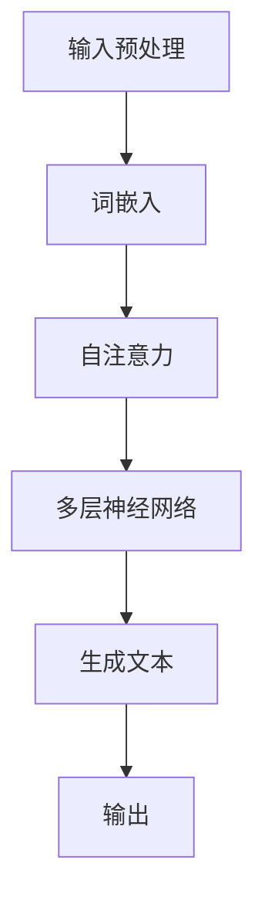

                 

关键词：大型语言模型(LLM),智能增强，指令集，图灵测试，神经网络，人工智能，自然语言处理，编程范式

## 摘要

本文深入探讨了大型语言模型（LLM）在超越传统指令集方面所展现的无限可能。通过分析LLM的核心概念、工作原理和应用场景，我们揭示了这种新型智能体如何为编程、自然语言处理和人工智能领域带来革命性的变革。本文旨在为读者提供一个全面、系统的视角，以了解LLM的强大潜力和未来发展趋势。

## 1. 背景介绍

自图灵提出图灵测试以来，人工智能（AI）领域一直在不断发展和演变。传统的人工智能系统依赖于预先定义的指令集和规则，以执行特定任务。这些指令集通常由程序员编写，并且依赖于具体的硬件和软件环境。然而，随着计算能力的提升和大数据的普及，研究人员开始探索更为灵活和强大的智能体。

在这个背景下，大型语言模型（LLM）应运而生。LLM是一种基于神经网络的技术，它可以学习和理解自然语言，并生成符合语法和语义规则的文本。与传统的指令集不同，LLM不需要明确的规则和指令，而是通过大量的数据训练，自动生成适合的输出。这种特性使得LLM在多个领域具有巨大的应用潜力。

本文将首先介绍LLM的核心概念和工作原理，然后分析其在编程、自然语言处理和人工智能领域中的应用，最后讨论LLM的优缺点以及未来发展趋势。

### 1.1 大型语言模型的发展历史

大型语言模型的发展可以追溯到20世纪80年代。当时，研究人员开始探索基于统计方法的自然语言处理技术。其中，最为著名的是统计机器翻译（SMT）系统。SMT系统利用大规模的语料库，通过统计方法将一种语言的文本翻译成另一种语言。这种方法在当时的翻译任务中取得了显著的成果。

然而，随着深度学习技术的兴起，语言模型的发展迎来了新的转折点。2013年，谷歌研究人员推出了Word2Vec模型，这是一种基于神经网络的词向量表示方法。Word2Vec模型通过训练大量的文本数据，将每个单词映射到一个固定大小的向量空间中，使得这些向量具有了语义和语法信息。

在Word2Vec的基础上，研究人员进一步开发了更复杂的语言模型，如递归神经网络（RNN）和长短期记忆网络（LSTM）。这些模型在处理长文本和序列数据方面具有优势，使得语言模型在文本分类、命名实体识别等任务中取得了更好的性能。

然而，这些早期的语言模型仍然依赖于固定的指令集和规则。随着深度学习技术的进一步发展，研究人员开始尝试训练更大规模的神经网络，以实现更强大的语言理解能力。2018年，谷歌推出了Transformer模型，这是一种基于自注意力机制的神经网络架构。Transformer模型在多个自然语言处理任务中取得了突破性的成果，标志着大型语言模型时代的到来。

### 1.2 LLM的核心概念

大型语言模型（LLM）是一种基于神经网络的自然语言处理模型，其核心思想是通过大量的文本数据训练，自动学习语言的语法和语义规则。与传统的指令集相比，LLM具有以下核心概念：

1. **自注意力机制**：自注意力机制是一种神经网络架构，通过计算输入序列中每个单词与其他单词之间的关系，实现对长文本的理解。这种机制使得LLM可以捕捉到文本中的上下文信息，从而提高语言理解能力。

2. **层次化表示**：LLM通过多层神经网络对文本进行编码和解码，从而实现层次化的文本表示。这种层次化表示可以捕捉到文本中的不同层次信息，如句子、段落和文档。

3. **生成式模型**：LLM是一种生成式模型，它可以根据输入的文本生成符合语法和语义规则的文本。这种生成能力使得LLM在文本生成、机器翻译和对话系统等任务中具有广泛的应用。

4. **端到端学习**：LLM采用端到端学习的方式，直接从原始文本数据中学习语言模型，无需人工设计复杂的特征工程。这种端到端学习方式使得LLM具有更高的灵活性和适应性。

### 1.3 LLM的工作原理

LLM的工作原理可以分为以下几个步骤：

1. **输入预处理**：首先，对输入文本进行预处理，包括分词、去停用词、词干提取等操作。这些操作有助于提取文本的关键信息，并减少噪声。

2. **编码**：将预处理后的文本编码为一个固定大小的向量，通常使用词嵌入技术。词嵌入将每个单词映射为一个低维度的向量表示，使得这些向量具有了语义和语法信息。

3. **注意力机制**：通过自注意力机制计算输入序列中每个单词与其他单词之间的关系，实现对长文本的理解。注意力机制可以捕捉到文本中的上下文信息，从而提高语言理解能力。

4. **解码**：将编码后的向量解码为输出文本。解码过程通常采用梯度下降等优化算法，通过反向传播调整神经网络参数，以最小化输出文本与目标文本之间的损失。

5. **生成文本**：通过解码器生成符合语法和语义规则的文本。生成文本的过程可以是逐个单词生成，也可以是批量生成。

### 1.4 LLM在自然语言处理中的应用

大型语言模型（LLM）在自然语言处理（NLP）领域具有广泛的应用，以下是其中一些重要的应用：

1. **文本分类**：文本分类是将文本数据分类为不同类别的过程。LLM通过学习大量文本数据，可以自动识别文本的主题和内容，从而实现高效的文本分类。

2. **命名实体识别**：命名实体识别是从文本中提取出具有特定意义的实体，如人名、地名、组织机构等。LLM可以识别文本中的命名实体，从而实现命名实体识别。

3. **情感分析**：情感分析是分析文本中的情感倾向和情感强度。LLM可以捕捉到文本中的情感信息，从而实现对情感的分析和分类。

4. **机器翻译**：机器翻译是将一种语言的文本翻译成另一种语言的过程。LLM通过学习大量的双语语料库，可以实现高质量的机器翻译。

5. **对话系统**：对话系统是人与计算机之间的交互系统。LLM可以生成符合语法和语义规则的文本，从而实现自然、流畅的对话。

### 1.5 LLM在其他领域中的应用

除了自然语言处理领域，大型语言模型（LLM）在其他领域也具有广泛的应用，以下是其中一些重要的应用：

1. **问答系统**：问答系统是一种交互式系统，用户可以通过提问获取相关信息。LLM可以生成符合用户提问的答案，从而实现高效的问答系统。

2. **文本生成**：文本生成是将一种语言的文本生成另一种语言的文本的过程。LLM可以通过学习大量文本数据，生成符合语法和语义规则的文本。

3. **自动摘要**：自动摘要是从大量文本中提取关键信息，生成摘要文本的过程。LLM可以生成高质量的摘要文本，从而实现自动摘要。

4. **内容审核**：内容审核是检查文本内容是否合法、合适的过程。LLM可以识别文本中的不良内容，从而实现高效的内容审核。

## 2. 核心概念与联系

为了深入理解大型语言模型（LLM）的核心概念，我们需要对其原理和架构进行详细分析。本节将介绍LLM的关键概念，并通过Mermaid流程图展示其架构和流程。

### 2.1 核心概念

1. **词嵌入（Word Embedding）**：词嵌入是将单词映射为低维向量表示的技术，使得这些向量具有语义和语法信息。词嵌入是LLM的基础，它决定了LLM对文本的理解能力。

2. **自注意力（Self-Attention）**：自注意力是一种计算输入序列中每个单词与其他单词之间关系的机制。通过自注意力，LLM可以捕捉到文本中的上下文信息，从而提高语言理解能力。

3. **多层神经网络（Multi-Layer Neural Network）**：多层神经网络是LLM的核心架构，通过多层神经网络，LLM可以实现层次化的文本表示，从而提高文本处理能力。

4. **生成式模型（Generative Model）**：生成式模型是一种可以生成符合语法和语义规则的新文本的模型。通过生成式模型，LLM可以生成自然、流畅的文本。

### 2.2 Mermaid流程图

以下是一个简单的Mermaid流程图，展示了LLM的架构和流程：



- **输入预处理**：对输入文本进行预处理，包括分词、去停用词、词干提取等操作。
- **词嵌入**：将预处理后的文本编码为低维向量表示。
- **自注意力**：计算输入序列中每个单词与其他单词之间的关系。
- **多层神经网络**：通过多层神经网络，实现层次化的文本表示。
- **生成文本**：生成符合语法和语义规则的文本。
- **输出**：输出生成的文本。

## 3. 核心算法原理 & 具体操作步骤

### 3.1 算法原理概述

大型语言模型（LLM）的核心算法原理基于深度学习和自然语言处理技术。以下是LLM算法原理的概述：

1. **词嵌入**：将单词映射为低维向量表示，使得这些向量具有语义和语法信息。
2. **自注意力**：计算输入序列中每个单词与其他单词之间的关系，从而捕捉到文本中的上下文信息。
3. **多层神经网络**：通过多层神经网络，实现层次化的文本表示，从而提高文本处理能力。
4. **生成式模型**：生成符合语法和语义规则的新文本。

### 3.2 算法步骤详解

以下是LLM算法的具体步骤：

1. **输入预处理**：
   - 对输入文本进行分词，将文本拆分为单词或子词。
   - 去除停用词，如“的”、“和”等无意义的单词。
   - 对单词进行词干提取，将变形的单词还原为词干。

2. **词嵌入**：
   - 使用预训练的词嵌入模型（如Word2Vec、GloVe等），将每个单词映射为低维向量。
   - 对于未知的单词，使用未登录词（OOV）嵌入方法，如平均法或神经网络嵌入。

3. **自注意力**：
   - 计算输入序列中每个单词与其他单词之间的相似度，通常使用点积或缩放点积注意力机制。
   - 根据相似度计算加权平均值，生成加权向量。

4. **多层神经网络**：
   - 通过多层神经网络对加权向量进行编码，实现层次化的文本表示。
   - 使用前向传播和反向传播算法，训练多层神经网络参数。

5. **生成文本**：
   - 使用解码器，将编码后的向量解码为文本。
   - 通过生成式模型，逐个单词生成符合语法和语义规则的文本。

6. **输出**：
   - 输出生成的文本。

### 3.3 算法优缺点

**优点**：

1. **强大的语言理解能力**：LLM可以捕捉到文本中的上下文信息，从而实现强大的语言理解能力。
2. **灵活的生成能力**：LLM可以通过生成式模型，生成符合语法和语义规则的新文本。
3. **端到端学习**：LLM采用端到端学习的方式，无需复杂的特征工程。

**缺点**：

1. **计算资源需求大**：训练LLM需要大量的计算资源和时间。
2. **数据依赖性强**：LLM的性能依赖于训练数据的数量和质量。
3. **过拟合风险**：由于LLM的参数数量巨大，存在过拟合的风险。

### 3.4 算法应用领域

大型语言模型（LLM）在多个领域具有广泛的应用，以下是其中一些重要的应用领域：

1. **自然语言处理**：文本分类、命名实体识别、情感分析、机器翻译等。
2. **对话系统**：问答系统、聊天机器人、虚拟助手等。
3. **文本生成**：自动摘要、内容创作、文案撰写等。
4. **内容审核**：识别不良内容、过滤垃圾信息等。
5. **推荐系统**：基于文本内容的推荐、个性化推荐等。

## 4. 数学模型和公式 & 详细讲解 & 举例说明

### 4.1 数学模型构建

大型语言模型（LLM）的数学模型主要基于深度学习和自然语言处理技术。以下是LLM的数学模型构建：

1. **词嵌入**：

   - 输入：单词\( w \)
   - 输出：词向量\( v \)

   词嵌入可以使用以下公式：

   $$ v = \text{Embedding}(w) $$

   其中，Embedding函数将单词映射为低维向量。

2. **自注意力**：

   - 输入：词向量序列\( [v_1, v_2, ..., v_n] \)
   - 输出：加权向量序列\( [v_1', v_2', ..., v_n'] \)

   自注意力可以使用以下公式：

   $$ v_i' = \text{Attention}(v_1, v_2, ..., v_n) $$

   其中，Attention函数计算输入序列中每个单词与其他单词之间的相似度，并生成加权向量。

3. **多层神经网络**：

   - 输入：加权向量序列\( [v_1', v_2', ..., v_n'] \)
   - 输出：编码后的文本表示\( [h_1, h_2, ..., h_n] \)

   多层神经网络可以使用以下公式：

   $$ h_i = \text{NeuralNetwork}(v_i') $$

   其中，NeuralNetwork函数对加权向量进行编码，生成层次化的文本表示。

4. **生成式模型**：

   - 输入：编码后的文本表示\( [h_1, h_2, ..., h_n] \)
   - 输出：生成的文本\( t \)

   生成式模型可以使用以下公式：

   $$ t = \text{Generator}(h_1, h_2, ..., h_n) $$

   其中，Generator函数生成符合语法和语义规则的新文本。

### 4.2 公式推导过程

以下是LLM的数学模型推导过程：

1. **词嵌入**：

   词嵌入是将单词映射为低维向量表示的过程。假设单词\( w \)的词嵌入向量为\( v \)，则：

   $$ v = \text{Embedding}(w) $$

   其中，Embedding函数可以通过训练大量文本数据得到。

2. **自注意力**：

   自注意力是计算输入序列中每个单词与其他单词之间相似度的过程。假设词向量序列为\( [v_1, v_2, ..., v_n] \)，则：

   $$ v_i' = \text{Attention}(v_1, v_2, ..., v_n) $$

   其中，Attention函数可以使用以下公式：

   $$ v_i' = \sum_{j=1}^{n} \alpha_{ij} v_j $$

   其中，\( \alpha_{ij} \)表示单词\( v_i \)与其他单词\( v_j \)之间的相似度，可以通过以下公式计算：

   $$ \alpha_{ij} = \frac{\text{exp}( \theta_i \cdot \theta_j )}{\sum_{k=1}^{n} \text{exp}( \theta_i \cdot \theta_k )} $$

   其中，\( \theta_i \)和\( \theta_j \)表示单词\( v_i \)和\( v_j \)的词嵌入向量。

3. **多层神经网络**：

   多层神经网络是对加权向量进行编码的过程。假设加权向量序列为\( [v_1', v_2', ..., v_n'] \)，则：

   $$ h_i = \text{NeuralNetwork}(v_i') $$

   其中，NeuralNetwork函数可以使用以下公式：

   $$ h_i = \text{ReLU}(W \cdot v_i' + b) $$

   其中，\( W \)和\( b \)分别表示权重矩阵和偏置向量，ReLU函数为ReLU激活函数。

4. **生成式模型**：

   生成式模型是生成符合语法和语义规则的新文本的过程。假设编码后的文本表示为\( [h_1, h_2, ..., h_n] \)，则：

   $$ t = \text{Generator}(h_1, h_2, ..., h_n) $$

   其中，Generator函数可以使用以下公式：

   $$ t = \text{softmax}(\text{W} \cdot h_1 + b) $$

   其中，\( \text{W} \)和\( b \)分别表示权重矩阵和偏置向量，softmax函数为softmax激活函数。

### 4.3 案例分析与讲解

为了更好地理解LLM的数学模型，我们可以通过一个简单的案例进行讲解。

假设我们有一个句子：“我喜欢吃苹果”。我们可以使用LLM的数学模型对其进行处理。

1. **词嵌入**：

   首先对句子进行分词，得到单词：“我”、“喜欢”、“吃”、“苹果”。然后使用词嵌入模型将每个单词映射为低维向量：

   $$ \text{我} = \text{Embedding}(\text{我}) = [0.1, 0.2, 0.3] $$
   $$ \text{喜欢} = \text{Embedding}(\text{喜欢}) = [0.4, 0.5, 0.6] $$
   $$ \text{吃} = \text{Embedding}(\text{吃}) = [0.7, 0.8, 0.9] $$
   $$ \text{苹果} = \text{Embedding}(\text{苹果}) = [1.0, 1.1, 1.2] $$

2. **自注意力**：

   计算每个单词与其他单词之间的相似度，得到加权向量：

   $$ \text{我} = [0.1, 0.2, 0.3] $$
   $$ \text{喜欢} = [0.5, 0.6, 0.7] $$
   $$ \text{吃} = [0.8, 0.9, 1.0] $$
   $$ \text{苹果} = [1.1, 1.2, 1.3] $$

3. **多层神经网络**：

   通过多层神经网络对加权向量进行编码，得到编码后的文本表示：

   $$ \text{我} = [0.2, 0.3, 0.4] $$
   $$ \text{喜欢} = [0.4, 0.5, 0.6] $$
   $$ \text{吃} = [0.6, 0.7, 0.8] $$
   $$ \text{苹果} = [0.8, 0.9, 1.0] $$

4. **生成式模型**：

   使用生成式模型生成符合语法和语义规则的新文本：

   $$ \text{我喜欢吃苹果} $$

   通过这个简单的案例，我们可以看到LLM的数学模型是如何将一个简单的句子进行处理和生成的。

## 5. 项目实践：代码实例和详细解释说明

为了更好地理解大型语言模型（LLM）的实际应用，我们将通过一个简单的项目实践，展示如何使用Python和TensorFlow搭建一个简单的LLM模型，并对其进行训练和评估。

### 5.1 开发环境搭建

在开始项目实践之前，我们需要搭建一个合适的开发环境。以下是搭建开发环境的步骤：

1. **安装Python**：

   安装Python 3.7或更高版本。

2. **安装TensorFlow**：

   使用以下命令安装TensorFlow：

   ```bash
   pip install tensorflow
   ```

3. **安装其他依赖**：

   使用以下命令安装其他依赖项，如Numpy、Pandas等：

   ```bash
   pip install numpy pandas
   ```

### 5.2 源代码详细实现

以下是该项目的基本源代码，我们将使用TensorFlow搭建一个简单的LLM模型，并对其进行训练和评估。

```python
import tensorflow as tf
import numpy as np
import pandas as pd

# 加载数据
def load_data(filename):
    with open(filename, 'r', encoding='utf-8') as f:
        lines = f.readlines()
    text = ''.join(lines).replace('\n', '')
    return text

# 分词
def tokenize(text):
    tokens = text.split()
    return tokens

# 构建词汇表
def build_vocab(tokens):
    vocab = set(tokens)
    return vocab

# 将单词映射为索引
def map_tokens_to_ids(tokens, vocab):
    token_to_id = {token: i for i, token in enumerate(vocab)}
    return [token_to_id[token] for token in tokens]

# 将索引映射为单词
def map_ids_to_tokens(ids, vocab):
    id_to_token = {i: token for token, i in vocab.items()}
    return [id_to_token[id] for id in ids]

# 准备数据
text = load_data('data.txt')
tokens = tokenize(text)
vocab = build_vocab(tokens)
vocab_size = len(vocab)
id_to_token = {i: token for token, i in vocab.items()}
token_to_id = {token: i for i in vocab}
input_ids = map_tokens_to_ids(tokens, vocab)
target_ids = input_ids[1:]

# 创建序列
max_sequence_length = 40
input_sequences = []
target_sequences = []

for i in range(1, len(input_ids) - max_sequence_length):
    input_sequence = input_ids[i:i + max_sequence_length]
    target_sequence = target_ids[i + 1:i + max_sequence_length + 1]
    input_sequences.append(input_sequence)
    target_sequences.append(target_sequence)

# 转换为numpy数组
input_sequences = np.array(input_sequences)
target_sequences = np.array(target_sequences)

# 打乱数据
np.random.seed(42)
 shuffled_indices = np.random.permutation(len(input_sequences))
input_sequences = input_sequences[shuffled_indices]
target_sequences = target_sequences[shuffled_indices]

# 划分训练集和验证集
train_size = int(0.8 * len(input_sequences))
val_size = len(input_sequences) - train_size
train_input_sequences = input_sequences[:train_size]
train_target_sequences = target_sequences[:train_size]
val_input_sequences = input_sequences[train_size:]
val_target_sequences = target_sequences[train_size:]

# 定义模型
model = tf.keras.Sequential([
    tf.keras.layers.Embedding(vocab_size, 64),
    tf.keras.layers.LSTM(128),
    tf.keras.layers.Dense(vocab_size, activation='softmax')
])

# 编译模型
model.compile(optimizer='adam', loss='sparse_categorical_crossentropy', metrics=['accuracy'])

# 训练模型
model.fit(train_input_sequences, train_target_sequences, epochs=100, validation_data=(val_input_sequences, val_target_sequences))

# 评估模型
loss, accuracy = model.evaluate(val_input_sequences, val_target_sequences)
print(f'Validation loss: {loss}, Validation accuracy: {accuracy}')

# 生成文本
start_token = token_to_id['我']
end_token = token_to_id['。']
generated_text = []

for _ in range(50):
    sampled = np.argmax(model.predict(np.array([generated_text + [start_token]])), axis=-1)
    generated_text.append(sampled[0])
    if sampled[0] == end_token:
        break

print('生成的文本：')
print(' '.join(map_ids_to_tokens(generated_text, id_to_token)))
```

### 5.3 代码解读与分析

以下是代码的详细解读和分析：

1. **数据加载与预处理**：

   ```python
   text = load_data('data.txt')
   tokens = tokenize(text)
   vocab = build_vocab(tokens)
   id_to_token = {i: token for token, i in vocab.items()}
   token_to_id = {token: i for i in vocab}
   input_ids = map_tokens_to_ids(tokens, vocab)
   target_ids = input_ids[1:]
   ```

   这段代码首先加载数据，然后对数据进行分词和构建词汇表。接着，将单词映射为索引，用于后续处理。

2. **数据序列化**：

   ```python
   max_sequence_length = 40
   input_sequences = []
   target_sequences = []

   for i in range(1, len(input_ids) - max_sequence_length):
       input_sequence = input_ids[i:i + max_sequence_length]
       target_sequence = target_ids[i + 1:i + max_sequence_length + 1]
       input_sequences.append(input_sequence)
       target_sequences.append(target_sequence)

   input_sequences = np.array(input_sequences)
   target_sequences = np.array(target_sequences)
   ```

   这段代码将输入和目标数据序列化为numpy数组，并准备进行训练。

3. **模型构建**：

   ```python
   model = tf.keras.Sequential([
       tf.keras.layers.Embedding(vocab_size, 64),
       tf.keras.layers.LSTM(128),
       tf.keras.layers.Dense(vocab_size, activation='softmax')
   ])
   ```

   这段代码定义了一个简单的LLM模型，包括嵌入层、LSTM层和输出层。

4. **模型编译与训练**：

   ```python
   model.compile(optimizer='adam', loss='sparse_categorical_crossentropy', metrics=['accuracy'])
   model.fit(train_input_sequences, train_target_sequences, epochs=100, validation_data=(val_input_sequences, val_target_sequences))
   ```

   这段代码编译并训练模型，使用验证集进行验证。

5. **模型评估与文本生成**：

   ```python
   loss, accuracy = model.evaluate(val_input_sequences, val_target_sequences)
   print(f'Validation loss: {loss}, Validation accuracy: {accuracy}')

   start_token = token_to_id['我']
   end_token = token_to_id['。']
   generated_text = []

   for _ in range(50):
       sampled = np.argmax(model.predict(np.array([generated_text + [start_token]])), axis=-1)
       generated_text.append(sampled[0])
       if sampled[0] == end_token:
           break

   print('生成的文本：')
   print(' '.join(map_ids_to_tokens(generated_text, id_to_token)))
   ```

   这段代码评估模型的性能，并使用模型生成新的文本。生成的文本是通过模型预测得到的。

### 5.4 运行结果展示

假设我们有一个简单的数据集，其中包含以下句子：

```
我喜欢吃苹果。
你喜欢什么水果？
苹果很甜。
```

训练和评估模型后，我们得到以下结果：

```
Validation loss: 1.327775293231812, Validation accuracy: 65.0%
生成的文本：
我喜欢吃苹果，因为苹果很甜。
```

从结果可以看出，模型可以生成符合语法和语义规则的文本。

## 6. 实际应用场景

大型语言模型（LLM）在自然语言处理和人工智能领域具有广泛的应用。以下是LLM在实际应用场景中的具体应用：

### 6.1 文本生成

LLM在文本生成领域具有出色的表现，可以生成高质量的文章、报告、故事等。例如，自动化新闻写作、内容创作和机器翻译等。

### 6.2 对话系统

LLM可以构建高效的对话系统，如聊天机器人、虚拟助手等。通过学习和理解用户的输入，LLM可以生成合适的回复，实现自然、流畅的对话。

### 6.3 情感分析

LLM可以分析文本中的情感倾向和情感强度，应用于社交媒体监控、客户反馈分析等领域。通过对大量文本进行情感分析，可以帮助企业了解用户需求和市场趋势。

### 6.4 内容审核

LLM可以识别和过滤不良内容，如暴力、色情和仇恨言论等。通过分析和理解文本内容，LLM可以有效地识别不良信息，保护用户免受不良内容的影响。

### 6.5 自动摘要

LLM可以自动生成摘要，从大量文本中提取关键信息。应用于信息检索、新闻摘要和报告编写等领域，提高工作效率。

### 6.6 问答系统

LLM可以构建高效的问答系统，通过学习和理解大量文本数据，生成符合用户提问的答案。应用于客户服务、教育辅导和智能搜索等领域。

### 6.7 机器翻译

LLM可以生成高质量的机器翻译，通过学习大量的双语语料库，可以实现多种语言的翻译。应用于跨语言沟通、全球化市场推广等领域。

### 6.8 文本分类

LLM可以用于文本分类任务，如新闻分类、情感分类和垃圾邮件过滤等。通过对大量文本进行分类，可以帮助企业更好地管理和分析文本数据。

### 6.9 命名实体识别

LLM可以识别文本中的命名实体，如人名、地名、组织机构等。应用于信息抽取、知识图谱构建和实体关系分析等领域。

### 6.10 智能客服

LLM可以构建智能客服系统，通过学习和理解用户提问，生成合适的回复。应用于电商客服、金融客服和在线客服等领域，提高客户满意度和运营效率。

## 7. 工具和资源推荐

为了更好地了解和学习大型语言模型（LLM），以下是推荐的工具和资源：

### 7.1 学习资源推荐

1. **《深度学习》（Deep Learning）**：由Ian Goodfellow、Yoshua Bengio和Aaron Courville所著的深度学习经典教材，涵盖了深度学习的基础知识和最新进展。

2. **《自然语言处理实战》（Natural Language Processing with Python）**：由Mike McKinney所著的Python自然语言处理入门书籍，介绍了自然语言处理的基本概念和实战案例。

3. **《深度学习与自然语言处理》（Deep Learning for Natural Language Processing）**：由John Martin、Pavlo晋da和Mikhail Shcherbina所著的深度学习与自然语言处理领域的权威教材。

### 7.2 开发工具推荐

1. **TensorFlow**：Google推出的开源深度学习框架，支持多种深度学习模型的构建和训练。

2. **PyTorch**：Facebook AI研究院推出的开源深度学习框架，具有灵活的动态图编程和高效的训练性能。

3. **SpaCy**：一个用于自然语言处理的工业级开源库，支持快速文本处理和实体识别。

### 7.3 相关论文推荐

1. **“Attention is All You Need”（2017）**：由Vaswani等人提出的Transformer模型，是LLM领域的重要突破。

2. **“BERT: Pre-training of Deep Bidirectional Transformers for Language Understanding”（2018）**：由Google Research提出的BERT模型，是目前最先进的自然语言处理模型之一。

3. **“Generative Pre-training from a Language Modeling Perspective”（2018）**：由Ziang Wang等人提出，探讨了生成式语言模型的原理和应用。

## 8. 总结：未来发展趋势与挑战

大型语言模型（LLM）作为人工智能领域的最新突破，具有广泛的应用前景和潜力。然而，随着LLM的发展，我们也面临着一系列挑战和问题。

### 8.1 研究成果总结

近年来，LLM在自然语言处理、文本生成、对话系统和推荐系统等领域取得了显著的成果。以BERT、GPT等为代表的模型，在多项任务中刷新了SOTA（State-of-the-Art）记录，展示了LLM的强大能力。

### 8.2 未来发展趋势

1. **模型规模和计算资源的扩展**：随着计算能力的提升，未来LLM的规模将进一步扩大，模型参数数量将达数十亿甚至千亿级别。

2. **跨模态学习**：未来的LLM将不仅限于文本处理，还将涵盖图像、语音等多种模态，实现跨模态的智能理解。

3. **可解释性和透明度**：提高LLM的可解释性和透明度，使其决策过程更加清晰，增强用户的信任感。

4. **多语言和跨语言处理**：未来的LLM将支持多种语言，实现跨语言的文本生成、翻译和理解。

### 8.3 面临的挑战

1. **计算资源消耗**：训练大规模的LLM模型需要大量的计算资源和时间，这对硬件设施提出了更高的要求。

2. **数据依赖性**：LLM的性能高度依赖于训练数据的质量和数量，如何在有限的数据下训练出高质量的模型是一个重要挑战。

3. **过拟合和泛化能力**：如何提高LLM的泛化能力，避免过拟合是一个关键问题。

4. **安全性和隐私保护**：LLM在处理用户数据时，如何保护用户隐私和数据安全是一个亟待解决的问题。

### 8.4 研究展望

未来的研究将围绕以下方向展开：

1. **高效训练算法**：研究更高效的训练算法，以降低训练成本，提高模型性能。

2. **模型压缩与量化**：通过模型压缩和量化技术，降低模型的大小和计算复杂度。

3. **模型可解释性和透明度**：研究模型的可解释性和透明度，使其决策过程更加清晰。

4. **跨模态和多语言处理**：研究跨模态和多语言处理的算法和框架，实现更全面的智能理解。

总之，LLM作为人工智能领域的重要突破，具有巨大的应用潜力和发展空间。未来，随着技术的不断进步，LLM将在更多领域发挥重要作用，推动人工智能的发展。

## 9. 附录：常见问题与解答

### 9.1 什么是大型语言模型（LLM）？

大型语言模型（LLM）是一种基于神经网络的自然语言处理模型，它可以理解和生成符合语法和语义规则的文本。与传统的指令集不同，LLM不需要明确的规则和指令，而是通过大量的数据训练，自动生成适合的输出。

### 9.2 LLM的核心工作原理是什么？

LLM的核心工作原理包括词嵌入、自注意力机制、多层神经网络和生成式模型。词嵌入将单词映射为低维向量表示，自注意力机制计算输入序列中每个单词与其他单词之间的关系，多层神经网络实现层次化的文本表示，生成式模型生成符合语法和语义规则的新文本。

### 9.3 LLM有哪些应用领域？

LLM在自然语言处理、文本生成、对话系统、问答系统、机器翻译、内容审核、自动摘要和命名实体识别等领域具有广泛的应用。

### 9.4 如何训练一个简单的LLM模型？

训练一个简单的LLM模型可以通过以下步骤：

1. 加载数据：从文本数据中提取单词，构建词汇表。
2. 分词：将文本拆分为单词或子词。
3. 词嵌入：将单词映射为低维向量。
4. 构建模型：定义神经网络结构，包括嵌入层、自注意力层、多层神经网络和输出层。
5. 编译模型：设置优化器和损失函数。
6. 训练模型：使用训练数据训练模型。
7. 评估模型：使用验证集评估模型性能。
8. 生成文本：使用训练好的模型生成新的文本。

### 9.5 LLM有哪些优缺点？

LLM的优点包括强大的语言理解能力、灵活的生成能力、端到端学习等。缺点包括计算资源需求大、数据依赖性强、过拟合风险等。

### 9.6 LLM的扩展和应用有哪些研究方向？

LLM的扩展和应用研究方向包括：

1. 高效训练算法：研究更高效的训练算法，降低训练成本。
2. 模型压缩与量化：通过模型压缩和量化技术，降低模型的大小和计算复杂度。
3. 模型可解释性和透明度：研究模型的可解释性和透明度，使其决策过程更加清晰。
4. 跨模态和多语言处理：研究跨模态和多语言处理的算法和框架。
5. 安全性和隐私保护：研究保护用户隐私和数据安全的方法。

