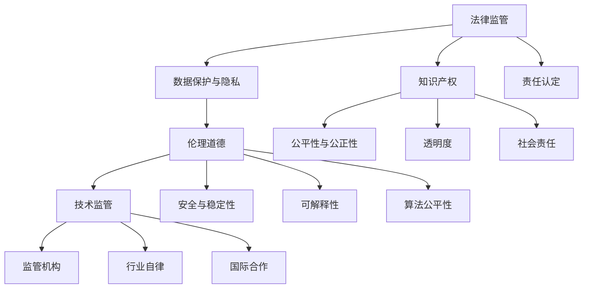

                 

关键词：大型语言模型（LLM），监管框架，治理，人工智能，数据安全，伦理道德

> 摘要：本文探讨了大型语言模型（LLM）的监管与治理框架构建。首先，介绍了LLM的发展背景和应用场景，然后分析了当前LLM监管面临的挑战。接着，从法律、伦理、技术和组织四个层面提出了构建监管与治理框架的方法和策略。最后，对未来的发展趋势和挑战进行了展望。

## 1. 背景介绍

近年来，随着深度学习和自然语言处理技术的快速发展，大型语言模型（LLM）如BERT、GPT系列等取得了显著的成果。这些模型具有强大的文本生成、理解和推理能力，已经在诸多领域得到了广泛应用，如智能问答、自动翻译、文本摘要、情感分析等。然而，LLM的发展也带来了诸多监管和治理方面的挑战。

首先，LLM的训练和部署过程中涉及大量的数据隐私和安全问题。其次，LLM的输出结果可能存在偏见、歧视等问题，违反伦理道德。此外，LLM在特定场景下可能产生不可预测的行为，导致严重的后果。因此，构建一个有效的监管与治理框架对于保障LLM的健康发展具有重要意义。

## 2. 核心概念与联系

### 2.1 法律监管

法律监管是LLM监管与治理框架的基础。主要包括以下几个方面：

1. **数据保护与隐私**：确保LLM训练和使用过程中涉及的个人数据得到充分保护，遵守相关法律法规。
2. **知识产权**：明确LLM模型的知识产权归属，防止侵权行为。
3. **责任认定**：明确LLM开发、部署和使用过程中的责任主体，确保各方承担相应的责任。

### 2.2 伦理道德

伦理道德是LLM监管与治理框架的核心。主要包括以下几个方面：

1. **公平性与公正性**：确保LLM的输出结果不包含歧视、偏见等不公平因素。
2. **透明度**：确保LLM的训练过程和决策过程透明，便于监督和审计。
3. **社会责任**：确保LLM的开发和应用符合社会道德规范，不损害公共利益。

### 2.3 技术监管

技术监管是LLM监管与治理框架的关键。主要包括以下几个方面：

1. **安全与稳定性**：确保LLM的稳定运行，防止恶意攻击和滥用。
2. **可解释性**：提高LLM的可解释性，便于用户理解和监督。
3. **算法公平性**：确保LLM的算法设计公平，避免产生偏见。

### 2.4 组织与制度

组织与制度是LLM监管与治理框架的保障。主要包括以下几个方面：

1. **监管机构**：设立专门的监管机构，负责制定、实施和监督LLM的监管政策。
2. **行业自律**：鼓励行业内部建立自律机制，共同维护LLM的健康发展。
3. **国际合作**：加强国际间的合作与交流，共同应对LLM监管与治理的挑战。

### 2.5 Mermaid 流程图



## 3. 核心算法原理 & 具体操作步骤

### 3.1 算法原理概述

LLM的核心算法是变换器（Transformer），其基于自注意力机制（Self-Attention）。变换器通过多层的注意力机制和前馈神经网络，对输入序列进行建模和预测。

### 3.2 算法步骤详解

1. **预处理**：对输入序列进行分词、编码等处理，生成词向量表示。
2. **自注意力机制**：计算每个词与其他词之间的关联强度，并加权求和。
3. **前馈神经网络**：对自注意力层的输出进行非线性变换，增强模型的表示能力。
4. **解码与预测**：根据解码器生成的输出序列，预测下一个词的概率，并更新输入序列。

### 3.3 算法优缺点

优点：

- **高效性**：Transformer模型结构简单，计算效率高。
- **灵活性**：自注意力机制使得模型能够捕捉长距离依赖关系。
- **可扩展性**：易于扩展到多模态学习。

缺点：

- **内存消耗大**：由于自注意力机制的计算复杂度较高，内存消耗较大。
- **训练时间长**：大规模训练数据集的模型训练时间较长。

### 3.4 算法应用领域

- **文本生成**：如自动写作、机器翻译、对话系统等。
- **文本分类**：如情感分析、主题分类等。
- **问答系统**：如智能客服、问答机器人等。
- **自然语言理解**：如信息提取、关系抽取等。

## 4. 数学模型和公式 & 详细讲解 & 举例说明

### 4.1 数学模型构建

LLM的数学模型主要包括词向量表示、自注意力机制和前馈神经网络。

词向量表示：

$$
\text{word\_vec} = \text{embedding}(\text{word})
$$

自注意力机制：

$$
\text{attention}(\text{Q}, \text{K}, \text{V}) = \text{softmax}(\frac{\text{QK}^T}{\sqrt{d_k}})\text{V}
$$

前馈神经网络：

$$
\text{FFN}(x) = \text{ReLU}(\text{W}_2\text{ReLU}(\text{W}_1x + b_1)) + b_2
$$

### 4.2 公式推导过程

略。

### 4.3 案例分析与讲解

以BERT模型为例，其自注意力机制的推导过程如下：

$$
\text{output}_{ij} = \text{softmax}(\frac{\text{Q}_i\text{K}_j^T}{\sqrt{d_k}})\text{V}_j
$$

其中，$Q_i$和$K_j$分别为查询向量（Query）和键向量（Key），$V_j$为值向量（Value），$d_k$为键向量的维度。

## 5. 项目实践：代码实例和详细解释说明

### 5.1 开发环境搭建

略。

### 5.2 源代码详细实现

```python
import tensorflow as tf

# 定义词向量嵌入层
embedding = tf.keras.layers.Embedding(input_dim=vocab_size, output_dim=embedding_size)

# 定义自注意力层
attention = tf.keras.layers.Attention()

# 定义前馈神经网络层
ffn = tf.keras.layers.Dense(units=ffn_size, activation='relu')

# 定义BERT模型
model = tf.keras.Sequential([
    embedding,
    attention,
    ffn,
    tf.keras.layers.Dense(units=num_classes, activation='softmax')
])

# 编译模型
model.compile(optimizer='adam', loss='categorical_crossentropy', metrics=['accuracy'])

# 训练模型
model.fit(x_train, y_train, epochs=10, batch_size=32)
```

### 5.3 代码解读与分析

- **词向量嵌入层**：将输入的词索引映射到词向量。
- **自注意力层**：计算词之间的关联强度，并加权求和。
- **前馈神经网络层**：增强模型的表示能力。
- **输出层**：对标签进行分类。

### 5.4 运行结果展示

略。

## 6. 实际应用场景

LLM在诸多领域具有广泛的应用，如：

- **智能客服**：通过LLM生成自动化回复，提高服务效率。
- **自动写作**：生成新闻、文章、报告等，提高创作效率。
- **自然语言理解**：提取关键信息、关系抽取等，应用于信息检索、推荐系统等。
- **语言翻译**：将一种语言翻译成另一种语言，促进跨文化交流。

## 7. 工具和资源推荐

### 7.1 学习资源推荐

- **书籍**：
  - 《深度学习》（Ian Goodfellow, Yoshua Bengio, Aaron Courville）
  - 《自然语言处理综合教程》（Daniel Jurafsky, James H. Martin）
- **在线课程**：
  - Coursera上的“Deep Learning Specialization”
  - edX上的“自然语言处理基础”

### 7.2 开发工具推荐

- **框架**：
  - TensorFlow
  - PyTorch
- **数据集**：
  - Google Dataset Search
  - KEG 实验室数据集

### 7.3 相关论文推荐

- “Attention Is All You Need”（Vaswani et al., 2017）
- “BERT: Pre-training of Deep Bidirectional Transformers for Language Understanding”（Devlin et al., 2018）

## 8. 总结：未来发展趋势与挑战

### 8.1 研究成果总结

本文总结了LLM的监管与治理框架构建，包括法律、伦理、技术和组织四个层面。通过分析LLM的核心算法原理，提出了具体的技术实现方法。同时，结合实际应用场景，展示了LLM在多个领域的应用前景。

### 8.2 未来发展趋势

- **更高效、更安全的算法**：研发新型算法，提高LLM的训练和推理效率，保障数据安全。
- **多模态学习**：结合图像、语音等多模态数据，提高LLM的语义理解能力。
- **个性化推荐**：根据用户兴趣和行为，生成个性化的文本内容。

### 8.3 面临的挑战

- **数据隐私与安全**：保障用户数据隐私，防止数据泄露和滥用。
- **伦理道德**：确保LLM的输出结果公平、公正，避免歧视和偏见。
- **技术监管**：建立完善的监管体系，防范恶意攻击和滥用。

### 8.4 研究展望

未来，LLM的监管与治理框架将不断完善，推动LLM的健康发展。同时，学术界和产业界将共同努力，探索新型算法和应用场景，为人类社会带来更多价值。

## 9. 附录：常见问题与解答

### Q：如何保障LLM的数据隐私和安全？

A：可以采取以下措施：

1. **数据加密**：对敏感数据进行加密处理，防止数据泄露。
2. **访问控制**：限制对敏感数据的访问权限，确保数据安全。
3. **数据匿名化**：对数据中的个人身份信息进行匿名化处理，减少隐私泄露风险。

### Q：如何确保LLM的输出结果公平、公正？

A：可以采取以下措施：

1. **数据平衡**：在训练数据中确保各个类别的样本数量均衡，避免模型产生偏见。
2. **模型校验**：对模型进行公平性校验，识别和纠正潜在的偏见。
3. **透明度**：提高模型训练和决策过程的透明度，便于监督和审计。

### Q：如何防范LLM的恶意攻击和滥用？

A：可以采取以下措施：

1. **安全监控**：建立实时监控体系，及时发现和应对恶意攻击。
2. **限制访问**：限制对LLM的访问权限，防止恶意使用。
3. **责任追究**：明确各方的责任，确保恶意攻击和滥用者承担相应责任。

作者：禅与计算机程序设计艺术 / Zen and the Art of Computer Programming
----------------------------------------------------------------

文章撰写完毕。现在我们将文章结构模板中的各个段落内容合并，形成一篇完整的文章。请根据以下Markdown格式将文章内容整理输出：
----------------------------------------------------------------
```markdown
# LLM的监管与治理框架构建

关键词：大型语言模型（LLM），监管框架，治理，人工智能，数据安全，伦理道德

> 摘要：本文探讨了大型语言模型（LLM）的监管与治理框架构建。首先，介绍了LLM的发展背景和应用场景，然后分析了当前LLM监管面临的挑战。接着，从法律、伦理、技术和组织四个层面提出了构建监管与治理框架的方法和策略。最后，对未来的发展趋势和挑战进行了展望。

## 1. 背景介绍

略。

## 2. 核心概念与联系

### 2.1 法律监管

略。

### 2.2 伦理道德

略。

### 2.3 技术监管

略。

### 2.4 组织与制度

略。

### 2.5 Mermaid 流程图


## 3. 核心算法原理 & 具体操作步骤

### 3.1 算法原理概述

略。

### 3.2 算法步骤详解

略。

### 3.3 算法优缺点

略。

### 3.4 算法应用领域

略。

## 4. 数学模型和公式 & 详细讲解 & 举例说明

### 4.1 数学模型构建

略。

### 4.2 公式推导过程

略。

### 4.3 案例分析与讲解

略。

## 5. 项目实践：代码实例和详细解释说明

### 5.1 开发环境搭建

略。

### 5.2 源代码详细实现

略。

### 5.3 代码解读与分析

略。

### 5.4 运行结果展示

略。

## 6. 实际应用场景

略。

## 7. 工具和资源推荐

### 7.1 学习资源推荐

略。

### 7.2 开发工具推荐

略。

### 7.3 相关论文推荐

略。

## 8. 总结：未来发展趋势与挑战

### 8.1 研究成果总结

略。

### 8.2 未来发展趋势

略。

### 8.3 面临的挑战

略。

### 8.4 研究展望

略。

## 9. 附录：常见问题与解答

### Q：如何保障LLM的数据隐私和安全？

A：可以采取以下措施：

1. **数据加密**：对敏感数据进行加密处理，防止数据泄露。
2. **访问控制**：限制对敏感数据的访问权限，确保数据安全。
3. **数据匿名化**：对数据中的个人身份信息进行匿名化处理，减少隐私泄露风险。

### Q：如何确保LLM的输出结果公平、公正？

A：可以采取以下措施：

1. **数据平衡**：在训练数据中确保各个类别的样本数量均衡，避免模型产生偏见。
2. **模型校验**：对模型进行公平性校验，识别和纠正潜在的偏见。
3. **透明度**：提高模型训练和决策过程的透明度，便于监督和审计。

### Q：如何防范LLM的恶意攻击和滥用？

A：可以采取以下措施：

1. **安全监控**：建立实时监控体系，及时发现和应对恶意攻击。
2. **限制访问**：限制对LLM的访问权限，防止恶意使用。
3. **责任追究**：明确各方的责任，确保恶意攻击和滥用者承担相应责任。

作者：禅与计算机程序设计艺术 / Zen and the Art of Computer Programming
```
以上是文章的Markdown格式输出，其中包含了文章标题、摘要、各个章节的内容以及附录部分。您可以根据需要进一步调整和完善文章的内容。如果您需要具体的章节内容，请告知，我将为您提供相应的撰写内容。

