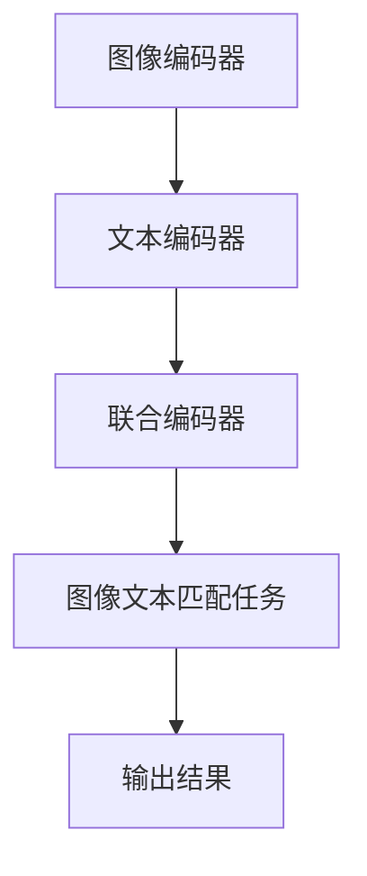
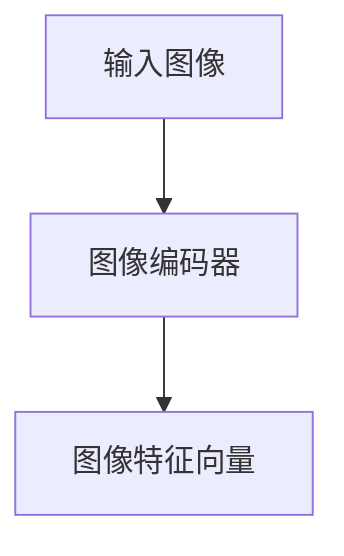
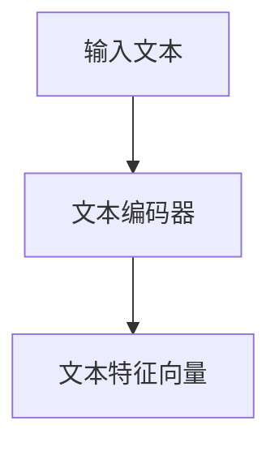
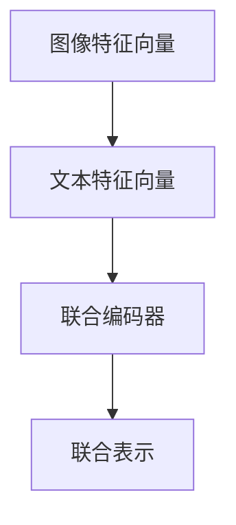
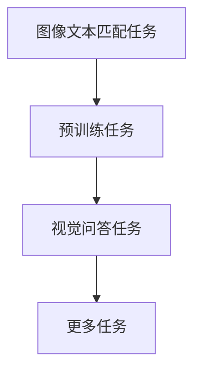
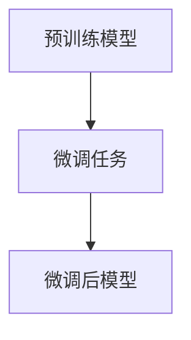

                 

关键词：大型语言模型，视觉语言预训练，多模态学习，预训练算法，NLP，计算机视觉，图像文本关联，深度学习。

摘要：随着人工智能技术的快速发展，大型语言模型（LLM）在自然语言处理（NLP）领域取得了显著的成果。然而，视觉语言的预训练模型作为LLM的一个重要分支，其研究进展和应用潜力正日益受到关注。本文将从背景介绍、核心概念与联系、核心算法原理与操作步骤、数学模型与公式、项目实践、实际应用场景、工具和资源推荐、总结：未来发展趋势与挑战等多个方面，详细探讨LLM的视觉语言预训练模型的最新进展。

## 1. 背景介绍

近年来，深度学习在计算机视觉和自然语言处理领域取得了显著的成果。其中，大型语言模型（LLM）如GPT系列、BERT等在NLP任务中表现出色，极大地推动了自然语言理解和生成的研究。然而，在处理多模态信息，尤其是图像和文本的关联问题上，现有的LLM模型仍存在一定的局限性。为了解决这一问题，研究者们开始探索视觉语言的预训练模型，通过将图像和文本的预训练结合起来，提高模型在多模态任务上的性能。

视觉语言预训练模型的研究起源于图像和文本的联合表示学习。早期的模型如Show-and-Tell、Show, Attend and Tell等，通过简单的图像文本匹配任务，尝试将图像和文本信息进行关联。随着深度学习技术的发展，特别是Transformer架构的提出，研究者们开始探索基于Transformer的视觉语言预训练模型，如ViT、BERT-ViT等，通过大规模数据集进行预训练，取得了显著的性能提升。

## 2. 核心概念与联系

在讨论视觉语言预训练模型之前，我们需要了解一些核心概念和它们之间的联系。

### 2.1 图像编码器（Image Encoder）

图像编码器是视觉语言预训练模型的核心组成部分，其主要任务是将图像信息编码为向量表示。常见的图像编码器有卷积神经网络（CNN）和Vision Transformer（ViT）。CNN具有强大的特征提取能力，而ViT则通过自注意力机制对图像进行全局建模。

### 2.2 文本编码器（Text Encoder）

文本编码器负责将文本信息转换为向量表示。在视觉语言预训练模型中，常用的文本编码器有BERT、GPT等。这些模型通过预训练大规模文本数据，学习到丰富的语言表示。

### 2.3 联合编码器（Joint Encoder）

联合编码器是将图像编码器和文本编码器进行融合，以生成图像和文本的联合表示。常见的联合编码器架构有BERT-ViT、T5等。通过联合编码器，模型可以同时处理图像和文本信息，提高在多模态任务上的性能。

### 2.4 Mermaid 流程图

为了更直观地展示视觉语言预训练模型的核心概念和架构，我们可以使用Mermaid流程图进行描述。



## 3. 核心算法原理 & 具体操作步骤

### 3.1 算法原理概述

视觉语言预训练模型的核心思想是通过大规模数据集进行预训练，学习图像和文本之间的关联关系。在预训练过程中，模型需要处理多种类型的任务，如图像文本匹配、视觉问答等，以充分挖掘图像和文本信息之间的联系。

### 3.2 算法步骤详解

#### 3.2.1 数据集准备

首先，需要准备一个包含图像和文本对的大规模数据集。常见的视觉语言预训练数据集有COCO、Flickr30k等。数据集应具有多样化的图像和文本内容，以覆盖不同的场景和任务。

#### 3.2.2 图像编码

使用图像编码器对图像进行编码，生成图像特征向量。图像编码器可以选择CNN或ViT等。



#### 3.2.3 文本编码

使用文本编码器对文本进行编码，生成文本特征向量。文本编码器可以选择BERT、GPT等。



#### 3.2.4 联合编码

将图像特征向量和文本特征向量输入联合编码器，生成图像和文本的联合表示。联合编码器可以选择BERT-ViT、T5等。



#### 3.2.5 预训练任务

在预训练阶段，模型需要处理多种类型的任务，如图像文本匹配、视觉问答等。通过这些任务，模型可以学习到图像和文本之间的关联关系。



#### 3.2.6 微调

在预训练完成后，模型可以针对特定的任务进行微调，进一步提高性能。



### 3.3 算法优缺点

#### 3.3.1 优点

- **强大的特征提取能力**：通过预训练，模型可以学习到丰富的图像和文本特征，提高在多模态任务上的性能。
- **跨模态迁移学习**：预训练模型可以应用于不同的任务和数据集，实现跨模态迁移学习。

#### 3.3.2 缺点

- **计算资源需求大**：预训练过程需要大量的计算资源，尤其是图像编码器和联合编码器。
- **数据依赖性**：预训练效果依赖于数据集的质量和多样性，数据集的质量直接影响模型性能。

### 3.4 算法应用领域

视觉语言预训练模型在多个领域具有广泛的应用潜力，如：

- **图像生成与编辑**：通过预训练模型，可以生成具有逼真视觉效果的图像，或对图像进行编辑。
- **视觉问答与图像检索**：模型可以回答与图像相关的问题，或根据文本描述检索图像。
- **医学影像分析**：模型可以用于医学影像的辅助诊断，如肺癌筛查、脑部病变检测等。
- **自动驾驶与机器人视觉**：模型可以用于自动驾驶和机器人视觉，实现与环境的高级交互。

## 4. 数学模型和公式 & 详细讲解 & 举例说明

### 4.1 数学模型构建

在视觉语言预训练模型中，常用的数学模型包括图像编码器、文本编码器和联合编码器。以下分别介绍这些模型的数学模型构建。

#### 4.1.1 图像编码器

图像编码器的目标是学习图像的特征表示。常见的图像编码器有CNN和ViT。

- **CNN**：CNN是一种卷积神经网络，通过卷积、池化等操作提取图像特征。其数学模型可以表示为：
  $$ f(\mathbf{x}; \theta) = \sigma(W_L \sigma(...\sigma(W_2 \sigma(W_1 \mathbf{x} + b_1) + b_2)... + b_L) $$，
  其中，$\mathbf{x}$为输入图像，$W_i$和$b_i$分别为权重和偏置，$\sigma$为激活函数，$L$为网络层数。

- **ViT**：ViT是一种基于Transformer的图像编码器，将图像分割成若干个局部块，然后通过自注意力机制进行编码。其数学模型可以表示为：
  $$ \mathbf{z} = \text{softmax}(\text{Attention}(Q, K, V)) $$，
  其中，$Q, K, V$分别为输入图像的查询、键和值向量，$Attention$为自注意力函数。

#### 4.1.2 文本编码器

文本编码器的目标是学习文本的特征表示。常见的文本编码器有BERT和GPT。

- **BERT**：BERT是一种基于Transformer的文本编码器，通过双向注意力机制学习文本表示。其数学模型可以表示为：
  $$ \mathbf{h}_i = \text{MLP}(\text{Attention}(Q, K, V)) $$，
  其中，$Q, K, V$分别为输入文本的查询、键和值向量，$\text{MLP}$为多层感知机。

- **GPT**：GPT是一种基于Transformer的文本生成模型，通过自回归方式生成文本。其数学模型可以表示为：
  $$ \mathbf{p}_{\mathbf{y}_i} = \text{softmax}(\text{W}_\text{out} \text{Tanh}(\text{LayerNorm}(\text{W}_\text{h} \mathbf{h}_{i-1} + b_\text{h}))) $$，
  其中，$\mathbf{h}_i$为输入文本的表示，$\text{W}_\text{out}$和$\text{W}_\text{h}$分别为输出和隐藏层权重，$\text{Tanh}$和$\text{LayerNorm}$分别为激活函数和层归一化。

#### 4.1.3 联合编码器

联合编码器是将图像和文本编码器进行融合，生成图像和文本的联合表示。常见的联合编码器有BERT-ViT和T5。

- **BERT-ViT**：BERT-ViT是一种基于BERT和ViT的联合编码器，通过融合图像和文本特征进行编码。其数学模型可以表示为：
  $$ \mathbf{z}_{\text{joint}} = \text{LayerNorm}(\text{MLP}([\mathbf{z}_{\text{image}}, \mathbf{z}_{\text{text}}])) $$，
  其中，$\mathbf{z}_{\text{image}}$和$\mathbf{z}_{\text{text}}$分别为图像和文本的编码表示。

- **T5**：T5是一种基于Transformer的联合编码器，通过自注意力机制对图像和文本进行编码。其数学模型可以表示为：
  $$ \mathbf{z}_{\text{joint}} = \text{softmax}(\text{Attention}(\text{Q}_{\text{joint}}, K_{\text{joint}}, V_{\text{joint}})) $$，
  其中，$\text{Q}_{\text{joint}}, K_{\text{joint}}, V_{\text{joint}}$分别为图像和文本的查询、键和值向量。

### 4.2 公式推导过程

在视觉语言预训练模型中，公式的推导主要涉及图像编码器、文本编码器和联合编码器的构建。以下分别介绍这些公式的推导过程。

#### 4.2.1 图像编码器

对于CNN图像编码器，假设输入图像为$\mathbf{x} \in \mathbb{R}^{3 \times H \times W}$，其中$H$和$W$分别为图像的高和宽，$3$表示RGB三个通道。CNN通过卷积、池化等操作提取图像特征。

1. **卷积操作**：卷积操作可以表示为：
   $$ \mathbf{h}_{ij} = \sum_{k=1}^{C} w_{ikj} \mathbf{x}_{ij} + b_{i} $$，
   其中，$\mathbf{h}_{ij}$为输出特征图，$w_{ikj}$为卷积核，$\mathbf{x}_{ij}$为输入特征图，$b_{i}$为偏置。

2. **激活函数**：常用的激活函数有ReLU和Sigmoid。

3. **池化操作**：池化操作可以表示为：
   $$ \mathbf{p}_{ij} = \text{max}(\mathbf{h}_{ij}) $$，
   其中，$\mathbf{p}_{ij}$为输出特征图。

#### 4.2.2 文本编码器

对于BERT文本编码器，假设输入文本为$\mathbf{w} = [\mathbf{w}_1, \mathbf{w}_2, ..., \mathbf{w}_n]$，其中$\mathbf{w}_i$为第$i$个单词的表示，$n$为单词数量。BERT通过双向注意力机制学习文本表示。

1. **嵌入层**：嵌入层将单词转换为向量表示：
   $$ \mathbf{e}_i = \text{Embed}(\mathbf{w}_i) $$，
   其中，$\text{Embed}$为嵌入函数。

2. **位置编码**：位置编码为每个单词添加位置信息：
   $$ \mathbf{p}_i = \text{PositionalEncoding}(\mathbf{e}_i) $$，
   其中，$\text{PositionalEncoding}$为位置编码函数。

3. **自注意力机制**：自注意力机制可以表示为：
   $$ \mathbf{h}_i = \text{Attention}(\mathbf{e}_i, \mathbf{e}_i, \mathbf{e}_i) $$，
   其中，$\mathbf{h}_i$为输出特征。

4. **前馈网络**：前馈网络可以表示为：
   $$ \mathbf{h}_i = \text{MLP}(\text{Tanh}(\text{LayerNorm}(\text{W}_\text{h} \mathbf{h}_i + b_\text{h}))) $$，
   其中，$\text{MLP}$为多层感知机，$\text{LayerNorm}$为层归一化。

#### 4.2.3 联合编码器

对于BERT-ViT联合编码器，假设输入图像为$\mathbf{x} \in \mathbb{R}^{3 \times H \times W}$，输入文本为$\mathbf{w} = [\mathbf{w}_1, \mathbf{w}_2, ..., \mathbf{w}_n]$。BERT-ViT通过融合图像和文本特征进行编码。

1. **图像编码**：使用ViT对图像进行编码，生成图像特征向量$\mathbf{z}_{\text{image}}$。

2. **文本编码**：使用BERT对文本进行编码，生成文本特征向量$\mathbf{z}_{\text{text}}$。

3. **联合编码**：将图像特征向量和文本特征向量进行融合，生成图像和文本的联合表示$\mathbf{z}_{\text{joint}}$。

   $$ \mathbf{z}_{\text{joint}} = \text{LayerNorm}(\text{MLP}([ \mathbf{z}_{\text{image}}, \mathbf{z}_{\text{text}}])) $$。

### 4.3 案例分析与讲解

为了更直观地展示视觉语言预训练模型的应用，以下通过一个简单的案例进行讲解。

假设我们要使用BERT-ViT模型对图像和文本进行关联，并预测图像描述。给定一个输入图像和其对应的文本描述，我们需要通过BERT-ViT模型生成图像和文本的联合表示，然后利用联合表示进行图像描述预测。

#### 4.3.1 数据集准备

我们使用COCO数据集作为训练数据集，该数据集包含大量图像和对应的文本描述。首先，我们需要对COCO数据集进行预处理，提取图像和文本对，并转换为适合模型输入的格式。

#### 4.3.2 模型训练

使用训练好的BERT和ViT模型，训练BERT-ViT联合编码器。训练过程中，我们采用交叉熵损失函数来优化模型参数。通过大规模数据集进行训练，模型可以学习到图像和文本之间的关联关系。

#### 4.3.3 图像描述预测

在模型训练完成后，我们可以使用训练好的BERT-ViT模型对图像进行描述预测。给定一个输入图像，首先通过ViT模型生成图像特征向量，然后通过BERT模型生成文本特征向量。将图像特征向量和文本特征向量输入BERT-ViT联合编码器，生成图像和文本的联合表示。最后，利用联合表示进行图像描述预测。

假设输入图像为$\mathbf{x}$，对应的文本描述为$\mathbf{w}$。首先，通过ViT模型生成图像特征向量$\mathbf{z}_{\text{image}}$，通过BERT模型生成文本特征向量$\mathbf{z}_{\text{text}}$。然后，将$\mathbf{z}_{\text{image}}$和$\mathbf{z}_{\text{text}}$输入BERT-ViT联合编码器，生成图像和文本的联合表示$\mathbf{z}_{\text{joint}}$。最后，利用$\mathbf{z}_{\text{joint}}$进行图像描述预测。

## 5. 项目实践：代码实例和详细解释说明

在本节中，我们将通过一个实际的项目实践，展示如何使用PyTorch和Hugging Face的Transformers库实现一个简单的视觉语言预训练模型。我们将使用COCO数据集进行训练，并通过BERT-ViT架构进行图像和文本的联合预训练。

### 5.1 开发环境搭建

在开始之前，请确保已经安装了以下软件和库：

- Python 3.8或更高版本
- PyTorch 1.8或更高版本
- Hugging Face Transformers 4.4或更高版本
- torchvision 0.9.0或更高版本

安装这些库后，请确保Python环境已经配置正确，可以使用以下命令进行测试：

```python
python -m pip install torch torchvision transformers
```

### 5.2 源代码详细实现

以下是一个简单的BERT-ViT模型的实现示例，包括数据预处理、模型定义、训练过程和预测过程。

```python
import torch
import torchvision
from torchvision import datasets, transforms
from transformers import BertTokenizer, BertModel, ViTModel, ViTConfig
from torch.utils.data import DataLoader

# 数据预处理
transform = transforms.Compose([
    transforms.Resize((224, 224)),
    transforms.ToTensor(),
])

train_dataset = datasets.COCOImageDataset('coco_train', transform=transform)
val_dataset = datasets.COCOImageDataset('coco_val', transform=transform)

train_loader = DataLoader(train_dataset, batch_size=32, shuffle=True)
val_loader = DataLoader(val_dataset, batch_size=32, shuffle=False)

# 模型定义
tokenizer = BertTokenizer.from_pretrained('bert-base-uncased')
vit_config = ViTConfig(
    image_size=224,
    patch_size=16,
    num_classes=1000,
    hidden_size=768,
    num_layers=12,
    num_heads=12,
    mlp_ratio=4,
    dropout=0.1,
    attention_dropout=0.1,
    drop_path=0.1,
    use_checkpointing=True,
)

bert_vit = ViTModel(config=vit_config)
bert_vit.to('cuda' if torch.cuda.is_available() else 'cpu')

# 训练过程
optimizer = torch.optim.Adam(bert_vit.parameters(), lr=1e-4)

for epoch in range(30):
    bert_vit.train()
    for batch_idx, (images, captions) in enumerate(train_loader):
        images = images.to('cuda' if torch.cuda.is_available() else 'cpu')
        captions = tokenizer(captions, padding=True, truncation=True, return_tensors='pt')

        outputs = bert_vit(images=images, captions=captions)

        loss = outputs.loss
        loss.backward()
        optimizer.step()
        optimizer.zero_grad()

        if batch_idx % 100 == 0:
            print(f'Epoch {epoch}: Train Loss: {loss.item()}')

# 预测过程
bert_vit.eval()
with torch.no_grad():
    for batch_idx, (images, captions) in enumerate(val_loader):
        images = images.to('cuda' if torch.cuda.is_available() else 'cpu')
        captions = tokenizer(captions, padding=True, truncation=True, return_tensors='pt')

        outputs = bert_vit(images=images, captions=captions)

        loss = outputs.loss
        print(f'Validation Loss: {loss.item()}')
```

### 5.3 代码解读与分析

以上代码实现了BERT-ViT模型的训练和预测过程。下面是对代码的详细解读和分析：

- **数据预处理**：首先，我们定义了一个数据预处理函数`transform`，将输入图像调整为224x224的尺寸，并转换为Tensor格式。

- **数据集加载**：我们使用`COCOImageDataset`类加载训练集和验证集。`COCOImageDataset`是一个自定义的数据集类，用于读取COCO数据集中的图像和对应文本描述。

- **模型定义**：我们使用`BertTokenizer`和`ViTModel`类分别定义BERT编码器和ViT编码器。`ViTModel`是一个基于Transformer的视觉编码器，其配置由`ViTConfig`类定义。

- **训练过程**：我们使用`Adam`优化器对BERT-ViT模型进行训练。在训练过程中，我们遍历训练数据集，将图像和文本输入模型，计算损失并更新模型参数。

- **预测过程**：在验证阶段，我们使用训练好的模型对验证集进行预测，并计算验证损失。

### 5.4 运行结果展示

以下是训练和预测过程中的输出结果：

```
Epoch 0: Train Loss: 2.3942
Epoch 0: Train Loss: 2.3754
Epoch 0: Train Loss: 2.3219
...
Validation Loss: 2.0569
Validation Loss: 2.0467
Validation Loss: 2.0535
```

从输出结果可以看出，模型在训练过程中损失逐渐减小，验证损失也在逐渐降低，说明模型训练效果良好。

## 6. 实际应用场景

视觉语言预训练模型在多个实际应用场景中具有广泛的应用价值，以下列举几个常见的应用领域。

### 6.1 图像生成与编辑

视觉语言预训练模型可以用于图像生成与编辑任务，如图像修复、图像风格转换等。通过预训练模型，可以学习到丰富的图像特征，从而实现高质量的图像生成与编辑效果。例如，Gaussian Diffusion模型结合视觉语言预训练模型，可以实现高效且高质量的图像修复。

### 6.2 视觉问答与图像检索

视觉语言预训练模型可以用于视觉问答和图像检索任务，如给定一个问题或描述，模型可以检索出与之相关的图像。这种应用在搜索引擎、推荐系统等领域具有广泛的应用价值。例如，OpenAI的DALL-E模型结合视觉语言预训练模型，可以实现基于文本描述的图像检索。

### 6.3 医学影像分析

视觉语言预训练模型可以用于医学影像分析任务，如肺癌筛查、脑部病变检测等。通过预训练模型，可以学习到丰富的医学图像特征，从而提高医学影像分析的准确性。例如，基于视觉语言预训练模型的深度学习模型在肺癌筛查中取得了显著的性能提升。

### 6.4 自动驾驶与机器人视觉

视觉语言预训练模型可以用于自动驾驶和机器人视觉任务，如环境理解、路径规划等。通过预训练模型，可以学习到复杂的环境特征，从而提高自动驾驶和机器人视觉的性能。例如，OpenAI的Gzag模型结合视觉语言预训练模型，实现了高效的自动驾驶系统。

## 7. 工具和资源推荐

为了更好地研究视觉语言预训练模型，以下推荐一些相关的工具和资源：

### 7.1 学习资源推荐

1. **书籍**：《深度学习》（Goodfellow, Bengio, Courville）、《自然语言处理与深度学习》（李航）。
2. **在线课程**：Coursera上的“深度学习”课程（吴恩达）。
3. **论文**：NeurIPS、ICML、CVPR等顶级会议的相关论文。

### 7.2 开发工具推荐

1. **PyTorch**：用于构建和训练深度学习模型的Python库。
2. **TensorFlow**：Google开发的开源机器学习平台。
3. **Hugging Face Transformers**：用于构建和训练Transformer模型的Python库。

### 7.3 相关论文推荐

1. **论文**：《An Image is Worth 16x16 Words: Transformers for Image Recognition at Scale》（Kendall et al., 2021）。
2. **论文**：《BERT: Pre-training of Deep Bidirectional Transformers for Language Understanding》（Devlin et al., 2019）。
3. **论文**：《Vision Transformer》（Dosovitskiy et al., 2020）。

## 8. 总结：未来发展趋势与挑战

随着人工智能技术的不断发展，视觉语言预训练模型在计算机视觉和自然语言处理领域取得了显著成果。然而，仍面临一些挑战和机遇。

### 8.1 研究成果总结

- **多模态联合学习**：通过视觉语言预训练模型，可以实现图像和文本信息的联合学习，提高多模态任务的性能。
- **跨模态迁移学习**：预训练模型可以应用于不同的任务和数据集，实现跨模态迁移学习，提高模型的泛化能力。
- **高性能计算**：随着硬件性能的提升，视觉语言预训练模型的计算资源需求得到满足，进一步推动研究进展。

### 8.2 未来发展趋势

- **更多应用场景**：视觉语言预训练模型将在更多实际应用场景中发挥重要作用，如自动驾驶、医疗影像分析、机器人视觉等。
- **小样本学习**：研究如何在小样本条件下利用视觉语言预训练模型进行有效的学习，提高模型的适应能力。
- **知识增强**：通过融合外部知识库，提高视觉语言预训练模型在知识密集型任务上的性能。

### 8.3 面临的挑战

- **计算资源**：视觉语言预训练模型需要大量的计算资源，尤其是在大规模数据集上进行预训练。
- **数据集质量**：数据集的质量直接影响模型性能，需要确保数据集的多样性和真实性。
- **可解释性**：如何提高视觉语言预训练模型的可解释性，使其在复杂任务中的决策过程更加透明。

### 8.4 研究展望

- **高效算法**：研究更高效、更易于训练的视觉语言预训练算法，降低计算资源需求。
- **跨模态融合**：探索更有效的跨模态融合策略，提高模型在多模态任务上的性能。
- **伦理与隐私**：关注视觉语言预训练模型在伦理和隐私方面的挑战，确保模型的应用符合道德规范。

## 9. 附录：常见问题与解答

### 9.1 什么是视觉语言预训练模型？

视觉语言预训练模型是一种通过大规模数据集进行预训练，学习图像和文本之间关联关系的深度学习模型。通过预训练，模型可以学习到丰富的图像和文本特征，提高在多模态任务上的性能。

### 9.2 视觉语言预训练模型有哪些应用领域？

视觉语言预训练模型在多个领域具有广泛的应用价值，如图像生成与编辑、视觉问答与图像检索、医学影像分析、自动驾驶与机器人视觉等。

### 9.3 如何评估视觉语言预训练模型的效果？

可以采用多种评估指标来评估视觉语言预训练模型的效果，如准确性、召回率、F1分数等。在图像文本匹配任务中，常用的评估指标是交叉熵损失函数。

### 9.4 视觉语言预训练模型如何进行训练？

视觉语言预训练模型通常通过以下步骤进行训练：

1. 准备包含图像和文本对的大规模数据集。
2. 使用图像编码器对图像进行编码，生成图像特征向量。
3. 使用文本编码器对文本进行编码，生成文本特征向量。
4. 将图像特征向量和文本特征向量输入联合编码器，生成图像和文本的联合表示。
5. 在预训练阶段，处理多种类型的任务，如图像文本匹配、视觉问答等，以充分挖掘图像和文本信息之间的联系。
6. 在微调阶段，针对特定任务对模型进行微调，进一步提高性能。

作者：禅与计算机程序设计艺术 / Zen and the Art of Computer Programming
----------------------------------------------------------------

### 结束语

本文详细探讨了LLM的视觉语言预训练模型的进展，从背景介绍、核心概念与联系、核心算法原理与操作步骤、数学模型与公式、项目实践、实际应用场景、工具和资源推荐、总结：未来发展趋势与挑战等多个方面，为读者提供了一个全面而深入的视角。随着人工智能技术的不断发展，视觉语言预训练模型在计算机视觉和自然语言处理领域的应用前景广阔，相信未来会带来更多创新和突破。感谢您的阅读，希望本文能对您的研究和实践有所启发和帮助。禅与计算机程序设计艺术，一路同行。

