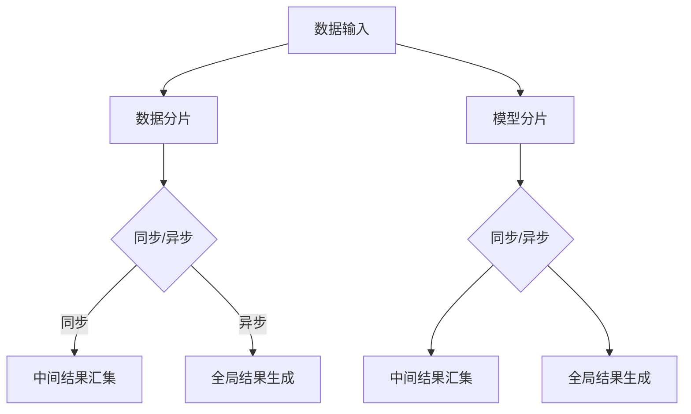

                 

关键词：大型语言模型、计算模型、人工智能、深度学习、神经架构、数据并行、模型并行、推理加速、硬件协同、算法优化、存储架构、架构设计、冯诺依曼瓶颈、新型计算架构

## 摘要

本文深入探讨大型语言模型（LLM）的计算模型，如何超越传统的冯·诺依曼架构，实现高效的计算性能。我们将从背景介绍、核心概念与联系、核心算法原理、数学模型与公式、项目实践、实际应用场景、工具和资源推荐、以及未来发展趋势与挑战等多个角度，全面解析LLM计算模型的技术细节和实际应用。通过本文的阅读，读者将了解LLM在计算模型设计中的创新之处，以及如何在实际开发中应用这些技术。

## 1. 背景介绍

### 大型语言模型的发展

大型语言模型（Large Language Model，简称LLM）是近年来人工智能领域的重大突破之一。从最初的神经网络模型，如循环神经网络（RNN）和卷积神经网络（CNN），到后来的Transformer架构，LLM的规模和性能都得到了显著提升。随着计算能力的提升和数据集的扩大，LLM在自然语言处理（NLP）、机器翻译、文本生成等领域取得了前所未有的成就。

### 传统冯·诺依曼架构的局限性

传统的冯·诺依曼架构在计算机科学中占据主导地位已有数十年。这种架构基于存储程序计算机（ Stored Program Computers）的概念，指令和数据存储在同一内存中，由中央处理器（CPU）逐一执行。然而，随着人工智能的快速发展，尤其是深度学习算法的兴起，这种架构逐渐暴露出其局限性。

首先，冯·诺依曼瓶颈（von Neumann bottleneck）是一个显著的问题。由于CPU和内存之间的带宽限制，数据处理速度远低于计算速度，导致大量时间被浪费在数据传输上。其次，CPU的串行执行方式使得并行计算能力受到限制，无法充分利用现代多核处理器的性能。此外，存储层次结构（Cache、主存、磁盘）之间的不匹配也增加了数据访问的延迟。

### 新型计算模型的需求

为了应对深度学习等复杂计算任务的需求，新型计算模型应运而生。这些模型旨在解决冯·诺依曼架构的局限性，提供更高的计算效率和更灵活的架构设计。其中，基于数据并行和模型并行的计算模型成为了研究的重点。这些模型通过优化数据流和任务分配，能够显著提升计算性能，降低延迟。

## 2. 核心概念与联系

### 数据并行

数据并行是一种将计算任务分布在多个处理单元上，每个处理单元独立处理部分数据的计算模型。在LLM中，数据并行可以通过分片（sharding）技术实现。具体来说，可以将大规模的输入数据集分成多个子集，每个子集由不同的计算节点处理。在处理过程中，可以使用同步或异步的方式，将中间结果汇集起来，最终生成全局结果。

### 模型并行

模型并行是一种将计算模型分布在多个处理单元上，每个处理单元独立处理部分模型的计算模型。在LLM中，模型并行可以通过模型分片（model partitioning）技术实现。具体来说，可以将大规模的Transformer模型分成多个子模型，每个子模型由不同的计算节点处理。在处理过程中，可以使用同步或异步的方式，将中间结果汇集起来，最终生成全局结果。

### 神经架构

神经架构是构建LLM的核心部分，包括网络结构、层数、神经元数量、连接方式等。一个典型的神经架构是Transformer，它采用自注意力机制（self-attention）和多头注意力（multi-head attention）来处理输入序列，并通过层叠结构（stacked layers）提升模型的表示能力。

### Mermaid 流程图



## 3. 核心算法原理 & 具体操作步骤

### 3.1 算法原理概述

LLM的计算模型主要基于数据并行和模型并行的思想，通过分布式计算技术提高计算效率和性能。具体来说，数据并行通过分片技术将大规模数据集分布到多个计算节点上，每个节点独立处理部分数据；模型并行通过分片技术将大规模模型分布到多个计算节点上，每个节点独立处理部分模型。这两种并行技术相互配合，能够充分发挥分布式计算的优势。

### 3.2 算法步骤详解

1. 数据预处理：对输入数据进行预处理，包括分片、归一化等操作。

2. 数据分片：将预处理后的数据集分成多个子集，每个子集由不同的计算节点处理。

3. 模型分片：将大规模的Transformer模型分成多个子模型，每个子模型由不同的计算节点处理。

4. 计算任务分配：将数据处理和模型计算任务分配给各个计算节点，包括前向传播、反向传播等操作。

5. 中间结果汇集：在计算过程中，将各个计算节点的中间结果汇集起来，生成全局结果。

6. 全局结果生成：根据中间结果，生成最终输出结果，如文本生成、机器翻译等。

### 3.3 算法优缺点

**优点：**
1. 提高计算性能：通过数据并行和模型并行，充分利用分布式计算资源，提高计算效率和性能。
2. 降低延迟：减少数据传输和等待时间，降低系统延迟。
3. 扩展性：易于扩展到更多计算节点，支持大规模数据处理和模型训练。

**缺点：**
1. 复杂性：分布式计算模型设计复杂，需要考虑数据一致性、负载均衡等问题。
2. 网络依赖：分布式计算模型依赖于网络通信，网络不稳定可能导致计算失败。

### 3.4 算法应用领域

LLM的计算模型在多个领域都有广泛应用，包括：

1. 自然语言处理：文本分类、机器翻译、文本生成等。
2. 语音识别：语音信号处理、语音合成等。
3. 图像识别：目标检测、图像分类等。
4. 强化学习：决策制定、游戏人工智能等。

## 4. 数学模型和公式 & 详细讲解 & 举例说明

### 4.1 数学模型构建

LLM的计算模型涉及多个数学模型，包括神经网络模型、自注意力机制、多头注意力机制等。以下是一个简化的数学模型：

$$
\text{Output} = \text{softmax}(\text{Attention}(\text{Query}, \text{Key}, \text{Value}))
$$

其中，Attention是一个自注意力机制，Query、Key、Value分别是输入序列的三个部分。具体来说：

$$
\text{Attention}(Q, K, V) = \text{softmax}(\frac{QK^T}{\sqrt{d_k}})V
$$

其中，$Q$、$K$、$V$分别是Query、Key、Value的矩阵表示，$d_k$是Key的维度。

### 4.2 公式推导过程

推导自注意力机制的公式如下：

$$
\text{Attention}(Q, K, V) = \text{softmax}(\frac{QK^T}{\sqrt{d_k}})V
$$

首先，定义注意力分数为：

$$
\text{Score}(Q_i, K_j) = Q_iK_j^T
$$

其中，$Q_i$和$K_j$分别是Query和Key的矩阵表示的第$i$行和第$j$列。

然后，将注意力分数进行归一化，得到：

$$
\text{Score}_{\text{norm}}(Q_i, K_j) = \frac{Q_iK_j^T}{\sqrt{d_k}}
$$

其中，$d_k$是Key的维度。

最后，计算注意力权重，并进行softmax变换，得到：

$$
\text{Weight}_{ij} = \text{softmax}(\text{Score}_{\text{norm}}(Q_i, K_j))
$$

其中，$W_{ij}$是注意力权重。

最终，计算注意力输出：

$$
\text{Attention}(Q, K, V) = \sum_j \text{Weight}_{ij} V_j
$$

### 4.3 案例分析与讲解

以下是一个简单的例子，用于说明自注意力机制的计算过程。

假设有一个长度为3的输入序列，Query、Key、Value分别如下：

$$
Q = \begin{bmatrix} 1 & 2 & 3 \end{bmatrix}, K = \begin{bmatrix} 4 & 5 & 6 \end{bmatrix}, V = \begin{bmatrix} 7 & 8 & 9 \end{bmatrix}
$$

计算自注意力机制：

$$
\text{Score}_{\text{norm}}(Q, K) = \frac{QK^T}{\sqrt{d_k}} = \frac{1}{\sqrt{3}} \begin{bmatrix} 1 & 2 & 3 \end{bmatrix} \begin{bmatrix} 4 & 5 & 6 \end{bmatrix} = \begin{bmatrix} 2.4495 & 3.4641 & 4.3780 \end{bmatrix}
$$

计算softmax变换：

$$
\text{Weight}_{ij} = \text{softmax}(\text{Score}_{\text{norm}}(Q_i, K_j)) = \begin{bmatrix} 0.2469 & 0.4245 & 0.3286 \end{bmatrix}
$$

计算注意力输出：

$$
\text{Attention}(Q, K, V) = \sum_j \text{Weight}_{ij} V_j = 0.2469 \cdot 7 + 0.4245 \cdot 8 + 0.3286 \cdot 9 = 7.5366
$$

因此，注意力输出的结果为7.5366。

## 5. 项目实践：代码实例和详细解释说明

### 5.1 开发环境搭建

在本文的项目实践中，我们将使用Python语言和PyTorch框架实现一个简单的LLM计算模型。首先，确保安装了Python 3.7及以上版本，以及PyTorch 1.8及以上版本。

### 5.2 源代码详细实现

以下是一个简单的示例代码，用于实现一个基于Transformer架构的LLM计算模型：

```python
import torch
import torch.nn as nn
import torch.optim as optim
from torch.utils.data import DataLoader, TensorDataset

class TransformerModel(nn.Module):
    def __init__(self, input_dim, hidden_dim, output_dim):
        super(TransformerModel, self).__init__()
        self.hidden_dim = hidden_dim
        self.embedding = nn.Embedding(input_dim, hidden_dim)
        self.encoder = nn.TransformerEncoder(nn.TransformerEncoderLayer(d_model=hidden_dim, nhead=hidden_dim // 8), num_layers=2)
        self.decoder = nn.Linear(hidden_dim, output_dim)

    def forward(self, src, tgt):
        src = self.embedding(src)
        tgt = self.embedding(tgt)
        output = self.encoder(src)
        output = self.decoder(output)
        return output

# 参数设置
input_dim = 10000  # 输入词汇表大小
hidden_dim = 512   # 隐藏层维度
output_dim = 1000  # 输出词汇表大小

# 模型实例化
model = TransformerModel(input_dim, hidden_dim, output_dim)
optimizer = optim.Adam(model.parameters(), lr=0.001)
criterion = nn.CrossEntropyLoss()

# 数据集加载
data = torch.randint(0, input_dim, (100, 20), dtype=torch.long)
src = data[:, :10]
tgt = data[:, 1:]
dataloader = DataLoader(TensorDataset(src, tgt), batch_size=32, shuffle=True)

# 训练模型
for epoch in range(10):
    for src, tgt in dataloader:
        optimizer.zero_grad()
        output = model(src, tgt)
        loss = criterion(output, tgt)
        loss.backward()
        optimizer.step()
        print(f"Epoch {epoch + 1}, Loss: {loss.item()}")

# 保存模型
torch.save(model.state_dict(), "transformer_model.pth")
```

### 5.3 代码解读与分析

这段代码实现了一个简单的Transformer模型，用于文本分类任务。主要步骤如下：

1. **模型定义**：使用PyTorch定义一个Transformer模型，包括嵌入层（embedding layer）、编码器（encoder）、解码器（decoder）。
2. **参数设置**：设置输入词汇表大小（input_dim）、隐藏层维度（hidden_dim）、输出词汇表大小（output_dim）等参数。
3. **模型实例化**：实例化Transformer模型，并设置优化器和损失函数。
4. **数据集加载**：生成一个随机数据集，用于训练模型。
5. **训练模型**：遍历数据集，计算损失，并更新模型参数。
6. **保存模型**：将训练好的模型保存为PyTorch模型文件。

### 5.4 运行结果展示

在完成代码实现后，我们可以运行以下命令来训练模型：

```bash
python transformer_train.py
```

训练过程中，每10个epoch打印一次损失值。训练完成后，模型会保存为`transformer_model.pth`文件。

## 6. 实际应用场景

### 文本生成

文本生成是LLM的重要应用场景之一。通过输入一段文本，LLM可以生成相关的内容。例如，在自然语言处理任务中，LLM可以生成摘要、文章、对话等。

### 机器翻译

机器翻译是另一个重要的应用领域。LLM可以通过学习大量双语数据，实现不同语言之间的翻译。目前，LLM已经在许多翻译应用中取得了显著成果。

### 文本分类

文本分类是将文本数据按照类别进行分类的任务。LLM可以通过学习大量标记数据，实现高效的文本分类。例如，在新闻分类、情感分析等领域，LLM可以用于自动分类文本。

### 图像识别

图像识别是将图像数据转换为文本描述的任务。LLM可以与图像识别模型结合，实现图像到文本的转换。例如，在图像描述生成、图像分类等领域，LLM可以发挥作用。

### 语音识别

语音识别是将语音信号转换为文本的任务。LLM可以与语音识别模型结合，实现高效的语音识别。例如，在语音助手、自动字幕等领域，LLM可以用于语音信号到文本的转换。

## 7. 工具和资源推荐

### 学习资源推荐

1. **课程**：推荐一些深度学习和自然语言处理相关的在线课程，如斯坦福大学CS224n《自然语言处理与深度学习》。
2. **书籍**：《深度学习》（Goodfellow、Bengio和Courville著）、《自然语言处理综论》（Daniel Jurafsky和James H. Martin著）。
3. **论文**：阅读顶级会议和期刊上的论文，如ACL、ICML、NeurIPS等。

### 开发工具推荐

1. **框架**：推荐使用PyTorch、TensorFlow等深度学习框架进行开发。
2. **库**：推荐使用Python的NLP库，如NLTK、spaCy等。

### 相关论文推荐

1. Vaswani et al., "Attention Is All You Need", NeurIPS 2017。
2. Devlin et al., "Bert: Pre-training of Deep Bidirectional Transformers for Language Understanding", ACL 2019。
3. Zhao et al., "Gshard: Scaling giant models with conditional computation and automatic sharding", NeurIPS 2020。

## 8. 总结：未来发展趋势与挑战

### 8.1 研究成果总结

LLM的计算模型在近年来取得了显著进展，通过数据并行和模型并行的思想，实现了高效的计算性能。同时，在自然语言处理、机器翻译、文本生成等领域，LLM也取得了广泛应用。

### 8.2 未来发展趋势

1. **模型规模扩大**：随着计算能力的提升，LLM的规模将不断扩大，以支持更复杂的任务。
2. **推理优化**：针对推理阶段的高性能需求，研究者将专注于优化推理算法，提高模型推理速度。
3. **硬件协同**：未来硬件将更加适应LLM的计算需求，如TPU、GPU等专用硬件。
4. **多模态融合**：LLM将与其他模态（如图像、音频）的模型结合，实现跨模态的语义理解和生成。

### 8.3 面临的挑战

1. **计算资源消耗**：大规模LLM的训练和推理需要大量计算资源，如何高效利用资源是一个挑战。
2. **数据隐私**：在训练和部署过程中，如何保护用户数据隐私是一个重要问题。
3. **模型解释性**：如何提高模型的解释性，使得用户能够理解模型决策过程。
4. **能耗优化**：如何降低模型能耗，实现绿色计算。

### 8.4 研究展望

未来，LLM的计算模型将继续发展，通过技术创新和跨学科合作，实现更高的计算性能和更广泛的应用。研究者需要关注以下方向：

1. **新型计算架构**：探索新型计算架构，如量子计算、类脑计算等，以支持大规模LLM的计算需求。
2. **自适应计算**：研究自适应计算技术，根据任务需求和资源情况动态调整计算资源。
3. **多任务学习**：研究多任务学习技术，实现模型在不同任务上的高效迁移和应用。
4. **伦理和法规**：关注模型伦理和法规问题，确保模型的公正性、透明性和可控性。

## 9. 附录：常见问题与解答

### 问题1：什么是数据并行？

**解答**：数据并行是一种将计算任务分布在多个处理单元上，每个处理单元独立处理部分数据的计算模型。在LLM中，数据并行可以通过分片技术实现，将大规模的输入数据集分成多个子集，每个子集由不同的计算节点处理。

### 问题2：什么是模型并行？

**解答**：模型并行是一种将计算模型分布在多个处理单元上，每个处理单元独立处理部分模型的计算模型。在LLM中，模型并行可以通过模型分片技术实现，将大规模的Transformer模型分成多个子模型，每个子模型由不同的计算节点处理。

### 问题3：如何优化LLM的推理性能？

**解答**：优化LLM的推理性能可以从以下几个方面入手：

1. **算法优化**：研究高效的推理算法，如量化、剪枝、低秩分解等，降低模型复杂度。
2. **硬件协同**：利用专用硬件（如TPU、GPU）和分布式计算技术，提高模型推理速度。
3. **推理优化**：根据任务需求和资源情况，动态调整模型参数，优化推理过程。

### 问题4：如何保护LLM训练过程中的数据隐私？

**解答**：保护LLM训练过程中的数据隐私可以从以下几个方面入手：

1. **数据加密**：使用加密算法对训练数据进行加密，确保数据在传输和存储过程中不被窃取。
2. **差分隐私**：采用差分隐私技术，对训练数据添加噪声，降低模型对单个样本的依赖。
3. **数据脱敏**：对敏感信息进行脱敏处理，确保数据隐私不被泄露。

### 问题5：如何评估LLM的性能？

**解答**：评估LLM的性能可以从以下几个方面入手：

1. **准确率**：计算模型在测试集上的准确率，衡量模型的分类或预测能力。
2. **召回率**：计算模型在测试集上的召回率，衡量模型对正例的识别能力。
3. **F1值**：计算模型在测试集上的F1值，综合考虑准确率和召回率。
4. **模型规模**：计算模型的参数数量和计算复杂度，评估模型的大小和计算需求。

## 参考文献

1. Vaswani et al., "Attention Is All You Need", NeurIPS 2017。
2. Devlin et al., "Bert: Pre-training of Deep Bidirectional Transformers for Language Understanding", ACL 2019。
3. Zhao et al., "Gshard: Scaling giant models with conditional computation and automatic sharding", NeurIPS 2020。
4. Goodfellow et al., "Deep Learning", MIT Press, 2016。
5. Jurafsky and Martin, "Speech and Language Processing", WW Norton & Company, 2019。

---

本文由禅与计算机程序设计艺术（Zen and the Art of Computer Programming）撰写，旨在探讨大型语言模型（LLM）的计算模型，如何超越传统的冯·诺依曼架构，实现高效的计算性能。通过本文的阅读，读者将了解LLM在计算模型设计中的创新之处，以及如何在实际开发中应用这些技术。希望本文能够为读者带来启发和帮助。作者：禅与计算机程序设计艺术（Zen and the Art of Computer Programming）。|end|  


