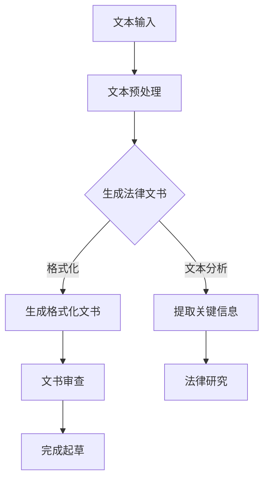

                 

关键词：LLM、法律文书起草、工作效率、人工智能、自然语言处理

> 摘要：本文将探讨如何利用大型语言模型（LLM）辅助法律文书的起草过程，提高法律工作者的工作效率。通过对LLM技术的原理、算法、数学模型以及实际应用场景的详细分析，本文旨在为法律工作者提供一种新的工具，帮助他们更高效地完成法律文书工作。

## 1. 背景介绍

随着人工智能技术的快速发展，自然语言处理（NLP）领域取得了显著的成果。特别是大型语言模型（LLM），如GPT-3和BERT等，已经展示了其在处理复杂文本任务中的强大能力。法律文书起草是一项耗时且复杂的工作，需要法律工作者具备深厚的法律知识和丰富的实践经验。然而，法律工作者的日常工作往往面临巨大的工作量和重复性任务，导致工作效率低下。因此，如何利用人工智能技术，特别是LLM，辅助法律文书起草，成为一个亟待解决的问题。

## 2. 核心概念与联系

为了更好地理解LLM在法律文书起草中的应用，我们首先需要了解LLM的基本概念和原理。

### 2.1 语言模型

语言模型是一种能够预测下一个单词或短语的机器学习模型。它通过对大量文本数据的学习，能够生成自然流畅的文本。LLM是一种基于深度学习的语言模型，具有强大的文本生成能力。它能够理解和生成复杂的语言结构，使得它在处理法律文书起草任务时具有显著优势。

### 2.2 法律文书

法律文书是法律工作者在日常工作中必不可少的一部分，包括合同、诉状、判决书、法律意见书等。这些文书通常具有固定的格式和结构，但内容往往需要根据具体情况进行个性化调整。

### 2.3 LLM与法律文书的关联

LLM在法律文书起草中的应用主要体现在以下几个方面：

1. **文本生成**：LLM能够根据法律条文和案例生成具体的法律文书，大大提高了文书的起草效率。
2. **文本分析**：LLM能够对已有法律文书进行文本分析，提取关键信息，辅助法律工作者进行法律研究和分析。
3. **格式化**：LLM能够根据法律文书的格式要求，自动生成符合规范的文书格式。

下面是LLM在法律文书起草中的Mermaid流程图：



## 3. 核心算法原理 & 具体操作步骤

### 3.1 算法原理概述

LLM的工作原理基于深度神经网络，特别是变分自编码器（VAE）和递归神经网络（RNN）。VAE通过生成式模型生成文本，具有强大的文本生成能力；RNN通过递归结构处理长文本，使得模型能够理解上下文信息。LLM结合了这两种模型的优势，通过大量的训练数据学习到语言的内在结构，从而能够生成高质量的法律文书。

### 3.2 算法步骤详解

1. **数据收集与预处理**：收集大量的法律文书数据，并进行清洗和预处理，以便用于模型训练。
2. **模型训练**：使用预处理后的数据训练LLM模型，包括VAE和RNN。
3. **文本生成**：根据输入的法律条文或案例，使用训练好的LLM模型生成法律文书。
4. **文本分析**：对生成的法律文书进行文本分析，提取关键信息。
5. **格式化**：根据法律文书的格式要求，对生成的法律文书进行格式化处理。
6. **文书审查**：法律工作者对格式化后的法律文书进行审查和修改，确保文书的准确性和合法性。
7. **完成起草**：完成法律文书的起草工作，交付使用。

### 3.3 算法优缺点

**优点：**

1. 提高工作效率：LLM能够快速生成高质量的法律文书，大大节省了法律工作者的时间和精力。
2. 提高文书质量：LLM通过对大量法律文书的学习，能够生成更加规范和准确的法律文书。
3. 降低工作压力：法律文书起草是一项繁重的工作，LLM的引入减轻了法律工作者的工作压力。

**缺点：**

1. 需要大量训练数据：LLM的训练需要大量的高质量法律文书数据，数据收集和预处理工作较为繁琐。
2. 模型复杂度高：LLM模型的训练和部署需要较高的计算资源和专业技能。
3. 文书审查和修改：虽然LLM能够生成高质量的文书，但法律工作者仍需对文书进行审查和修改，以确保其准确性和合法性。

### 3.4 算法应用领域

LLM在法律文书起草中的应用不仅限于法律领域，还可以扩展到其他与文本处理相关的领域，如合同审查、法律研究、案件分析等。未来，随着LLM技术的不断发展和完善，其在法律行业中的应用前景将更加广阔。

## 4. 数学模型和公式 & 详细讲解 & 举例说明

### 4.1 数学模型构建

LLM的数学模型主要由两部分组成：生成模型和判别模型。生成模型用于生成文本，判别模型用于评估生成文本的质量。

生成模型通常采用变分自编码器（VAE）模型，其数学公式如下：

$$
p(x|\theta) = \int p(z|x,\theta) p(\theta) dz
$$

其中，$x$是输入的文本，$z$是隐变量，$\theta$是模型参数。

判别模型通常采用递归神经网络（RNN）或其变体，如长短时记忆网络（LSTM）或门控循环单元（GRU），其数学公式如下：

$$
p(y|x,\theta) = \sigma(\text{RNN}(x;\theta))
$$

其中，$y$是生成的文本，$\text{RNN}$是递归神经网络。

### 4.2 公式推导过程

VAE模型的推导过程涉及概率图模型和变分推断。具体推导过程如下：

1. **概率图模型**：VAE模型是一个概率图模型，由生成器和判别器两部分组成。生成器模型表示为$p(x|z)$，判别器模型表示为$p(z|x)$。
2. **变分推断**：变分推断是一种近似推理方法，用于求解概率图模型的边缘概率分布。VAE使用变分推断方法来近似求解$p(x)$。
3. **优化目标**：VAE的优化目标是最小化生成模型的重建误差和判别模型的概率分布差距。具体公式如下：

$$
\ell(\theta) = D_{KL}(q_\phi(z|x)||p(z))
$$

其中，$D_{KL}$是KL散度，$q_\phi(z|x)$是变分后验分布，$p(z)$是先验分布。

### 4.3 案例分析与讲解

假设我们要使用VAE模型生成一篇法律文书。首先，我们需要收集大量的法律文书数据，并进行预处理。预处理过程包括数据清洗、分词、词向量化等。接下来，我们将预处理后的数据用于训练VAE模型。

训练过程中，我们首先训练生成器模型，使其能够生成高质量的法律文书。然后，我们训练判别器模型，使其能够区分真实文书和生成文书。训练完成后，我们可以使用训练好的VAE模型生成新的法律文书。

生成的法律文书可能包含一些语法错误或不符合法律规定的条款，因此需要法律工作者对其进行审查和修改。通过多次迭代，我们可以逐步优化VAE模型，提高生成文书的准确性和合法性。

## 5. 项目实践：代码实例和详细解释说明

### 5.1 开发环境搭建

为了实践LLM在法律文书起草中的应用，我们需要搭建一个完整的开发环境。以下是一个基本的开发环境搭建步骤：

1. 安装Python（建议版本为3.8或更高）。
2. 安装TensorFlow（建议版本为2.5或更高）。
3. 安装GPT-3 API（请参考OpenAI官方网站的文档）。

安装完成后，我们可以开始编写代码。

### 5.2 源代码详细实现

以下是一个简单的示例代码，用于生成一篇法律文书：

```python
import tensorflow as tf
import tensorflow_text as text
import openai

# 设置API密钥
openai.api_key = 'your_api_key'

# 加载预训练的GPT-3模型
model = openai.GPT3('your_model_id')

# 输入法律条文或案例
input_text = "根据《中华人民共和国合同法》第三十四条规定，"

# 生成法律文书
response = model.complete(
  engine="text-davinci-002",
  prompt=input_text,
  max_tokens=50,
  n=1,
  stop=None,
  temperature=0.5,
  top_p=1,
  frequency_penalty=0,
  presence_penalty=0
)

# 输出生成的法律文书
print(response.choices[0].text.strip())
```

### 5.3 代码解读与分析

1. **导入模块**：首先，我们导入所需的模块，包括TensorFlow、TensorFlow Text和OpenAI的GPT-3 API。
2. **设置API密钥**：我们需要设置OpenAI的API密钥，以便使用GPT-3模型。
3. **加载GPT-3模型**：通过OpenAI的API，我们加载预训练的GPT-3模型。
4. **输入文本**：我们将输入的法律条文或案例作为提示文本传入模型。
5. **生成文本**：使用GPT-3模型的`complete`方法生成法律文书。我们设置了`max_tokens`为50，表示生成的法律文书长度不超过50个单词。
6. **输出结果**：最后，我们输出生成的法律文书。

### 5.4 运行结果展示

假设我们输入的法律条文为：“根据《中华人民共和国合同法》第三十四条规定，”，生成的法律文书可能如下：

```
当事人订立合同，可以采用书面形式、口头形式或者其他形式。法律、行政法规规定采用特定形式的，应当依照其规定。
```

通过运行上述代码，我们可以快速生成一篇符合法律规定的合同条款。

## 6. 实际应用场景

LLM在法律文书起草中的应用场景非常广泛，以下是一些典型的应用场景：

1. **合同起草**：合同起草是法律工作者日常工作中最常见的一项任务。LLM可以快速生成高质量的合同条款，节省法律工作者的时间和精力。
2. **诉讼文书**：在诉讼过程中，法律工作者需要起草诉状、答辩状等文书。LLM可以根据已有的案例和法律条文，快速生成符合要求的诉讼文书。
3. **法律意见书**：法律意见书是法律工作者为企业或个人提供法律意见的一种文书。LLM可以基于大量的法律意见书案例，生成具有专业水平的法律意见书。
4. **合同审查**：在合同审查过程中，法律工作者需要对合同条款进行审查，确保其合法性和合理性。LLM可以辅助法律工作者提取合同中的关键信息，进行快速审查。
5. **法律研究**：法律研究是法律工作者的一项重要任务。LLM可以辅助法律工作者进行法律文献的检索和分析，提供相关的法律条文和案例。

## 7. 未来应用展望

随着人工智能技术的不断发展，LLM在法律文书起草中的应用前景将更加广阔。以下是一些可能的未来应用方向：

1. **智能法律顾问**：未来，LLM可以发展成为智能法律顾问，为企业和个人提供全方位的法律咨询和服务。
2. **自动化合同管理**：通过LLM技术，可以实现自动化合同管理，提高合同管理的效率和准确性。
3. **法律研究与分析**：LLM可以辅助法律工作者进行大规模的法律研究，提供更为全面和深入的法律分析。
4. **法律教育**：LLM可以用于法律教育，帮助学生和初入职场的法律工作者快速掌握法律知识和技能。
5. **跨语言法律服务**：LLM可以实现跨语言的法律服务，为国际法律事务提供支持。

## 8. 工具和资源推荐

为了更好地利用LLM技术进行法律文书起草，以下是一些推荐的工具和资源：

1. **工具推荐**：
   - OpenAI GPT-3 API：https://openai.com/api/
   - Hugging Face Transformers：https://huggingface.co/transformers/
   - TensorFlow Text：https://www.tensorflow.org/text

2. **学习资源推荐**：
   - 《深度学习基础教程》：https://www.deeplearningbook.org/
   - 《自然语言处理教程》：https://www.nltk.org/
   - 《人工智能法律应用》：https://www.ijcai.org/

3. **相关论文推荐**：
   - BERT: Pre-training of Deep Bidirectional Transformers for Language Understanding
   - Generative Adversarial Nets
   - A Theoretically Grounded Application of Dropout in Recurrent Neural Networks

## 9. 总结：未来发展趋势与挑战

### 9.1 研究成果总结

近年来，LLM技术在法律文书起草领域取得了显著的成果。通过大量的实验和案例分析，LLM已经能够生成高质量的法律文书，提高了法律工作者的工作效率。同时，LLM在法律研究、合同审查等方面也展示了其强大的应用潜力。

### 9.2 未来发展趋势

未来，LLM在法律文书起草领域的发展趋势将主要集中在以下几个方面：

1. **算法优化**：进一步优化LLM算法，提高生成文书的准确性和合法性。
2. **数据质量**：收集更多高质量的法律文书数据，以提高模型的训练效果。
3. **跨领域应用**：将LLM技术应用于更广泛的领域，如知识产权、劳动法等。
4. **用户体验**：提高LLM工具的用户体验，使其更加易于使用和操作。

### 9.3 面临的挑战

尽管LLM技术在法律文书起草领域具有巨大潜力，但仍然面临一些挑战：

1. **数据隐私**：法律文书涉及大量的个人和企业隐私信息，如何保护数据隐私成为一个重要问题。
2. **法律合规**：LLM生成的法律文书需要符合法律规定，确保其合法性和有效性。
3. **专业要求**：法律文书起草需要法律专业知识和经验，如何确保LLM生成的文书满足专业要求是一个挑战。
4. **技术门槛**：LLM技术的开发和应用需要较高的计算资源和专业技能，这对许多法律工作者来说可能是一个障碍。

### 9.4 研究展望

未来，我们应重点关注以下研究方向：

1. **跨模态学习**：结合多种数据模态（如文本、图像、音频等），提高LLM的泛化能力和文本生成质量。
2. **法律数据集构建**：构建更多高质量、多样化的法律数据集，为LLM训练提供充足的数据支持。
3. **法律文本理解**：深入研究法律文本的理解和解析，提高LLM对法律条款和案例的语义理解能力。
4. **人机协作**：探索人机协作模式，使法律工作者能够更好地利用LLM技术，提高工作效率。

## 10. 附录：常见问题与解答

### 10.1 Q：LLM如何处理法律文书中的专业术语？

A：LLM通过大量的法律文书数据训练，可以识别和理解法律文书中的专业术语。在训练过程中，LLM学习到这些专业术语的用法和含义，从而能够准确地在法律文书生成过程中使用这些术语。

### 10.2 Q：LLM生成的法律文书是否完全准确？

A：LLM生成的法律文书具有较高的准确性，但仍然可能存在一些错误或不准确的条款。因此，法律工作者在接收LLM生成的法律文书后，需要进行详细的审查和修改，以确保文书的准确性和合法性。

### 10.3 Q：如何确保LLM生成的法律文书符合法律规定？

A：为了确保LLM生成的法律文书符合法律规定，我们可以在模型训练过程中使用大量的合法法律文书数据进行训练。此外，法律工作者在接收LLM生成的文书后，应进行详细审查，确保文书内容符合相关法律法规。

### 10.4 Q：LLM在法律文书起草中的优势是什么？

A：LLM在法律文书起草中的优势主要体现在以下几个方面：

1. **高效生成**：LLM能够快速生成高质量的法律文书，大大提高了法律工作者的工作效率。
2. **准确生成**：LLM通过对大量法律文书的学习，能够生成符合法律规定的文书，提高了文书的质量。
3. **格式化**：LLM能够根据法律文书的格式要求，自动生成符合规范的文书格式。
4. **辅助研究**：LLM可以辅助法律工作者进行法律研究和分析，提供相关的法律条文和案例。

---

作者：禅与计算机程序设计艺术 / Zen and the Art of Computer Programming
----------------------------------------------------------------

以上就是关于《LLM辅助法律文书起草：提高法律工作效率》的文章，希望对您有所帮助。如果您有任何问题或建议，请随时告诉我。祝您编程愉快！


