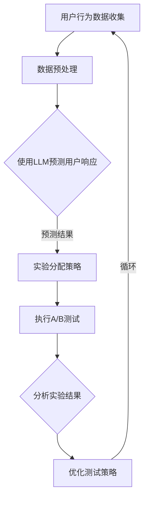

                 

 关键词：推荐系统，A/B测试，LLM，优化，机器学习，数据分析

> 摘要：本文深入探讨了如何利用大型语言模型（LLM）来优化推荐系统的A/B测试过程。通过结合机器学习和数据分析方法，本文提出了一种创新性的A/B测试优化策略，旨在提高测试效率、减少实验成本，并最终提升推荐系统的整体性能。

## 1. 背景介绍

推荐系统是当今互联网服务中不可或缺的一部分，广泛应用于电子商务、社交媒体、视频流媒体等多个领域。它们通过分析用户行为和历史数据，为用户提供个性化的内容推荐，从而提高用户体验和满意度。然而，推荐系统的设计和优化是一个复杂且动态的过程，需要不断地进行实验和调整。

A/B测试是推荐系统优化过程中的一种常见方法，通过将用户流量随机分配到不同的版本（A和B），评估不同版本的性能差异，从而确定最佳的推荐策略。传统的A/B测试方法虽然有效，但在实际应用中存在一些局限性：

- **测试效率低**：需要大量的用户数据来确保测试结果的统计显著性，从而延长了测试周期。
- **实验成本高**：在真实用户环境中进行A/B测试会消耗大量的计算资源和带宽，增加了成本。
- **结果解读复杂**：测试结果往往受到多种因素的影响，如用户群体、时间段和环境变化，使得结果解读变得复杂。

为了克服这些局限性，本文提出了一种基于大型语言模型（LLM）的A/B测试优化策略。通过利用LLM的强大处理能力和自我学习能力，可以更高效地分析用户数据，优化测试过程，并提高推荐系统的性能。

## 2. 核心概念与联系

### 2.1. 大型语言模型（LLM）

大型语言模型（LLM）是一种基于深度学习技术的自然语言处理模型，能够对大规模文本数据进行训练，并生成与输入文本相关的响应。LLM的代表性模型包括GPT-3、BERT和T5等。这些模型具有以下几个特点：

- **大规模训练**：LLM通常在数百万至数十亿级别的参数上进行训练，从而具备强大的语言理解和生成能力。
- **自监督学习**：LLM通过自监督学习算法，从大量无标注的文本数据中学习语言模式，无需人工标注。
- **多任务能力**：LLM可以处理多种不同的自然语言任务，如文本分类、情感分析、问答系统等。

### 2.2. 推荐系统与A/B测试

推荐系统是一种通过分析用户数据，为用户推荐感兴趣的内容或商品的系统。A/B测试是一种实验设计方法，通过将用户流量随机分配到不同的版本（A和B），评估不同版本的性能差异。

在推荐系统中，A/B测试通常用于以下场景：

- **推荐算法优化**：通过比较不同推荐算法的性能，确定最佳的推荐策略。
- **界面设计改进**：通过比较不同界面设计对用户行为的影响，优化用户体验。
- **广告投放策略**：通过比较不同广告投放策略的效果，优化广告投放效果。

### 2.3. LLM在A/B测试优化中的应用

LLM在A/B测试优化中的应用主要体现在以下几个方面：

- **用户行为预测**：通过分析用户历史数据，LLM可以预测用户对不同版本的响应，从而优化测试策略。
- **实验结果分析**：LLM可以对A/B测试结果进行深入分析，识别影响测试结果的潜在因素。
- **自适应实验设计**：LLM可以根据实验过程中的实时数据，动态调整实验参数，提高测试效率。

### 2.4. Mermaid流程图

以下是一个简单的Mermaid流程图，展示LLM在A/B测试优化中的应用流程：



## 3. 核心算法原理 & 具体操作步骤

### 3.1. 算法原理概述

基于LLM的A/B测试优化算法主要基于以下几个核心原理：

- **用户行为预测**：通过训练LLM模型，分析用户历史数据，预测用户对不同版本的响应概率。
- **自适应实验设计**：根据预测结果和实时数据，动态调整实验参数，优化测试策略。
- **多变量分析**：利用LLM的多任务能力，同时分析多个影响实验结果的因素。

### 3.2. 算法步骤详解

基于上述原理，以下是具体算法步骤：

1. **数据收集与预处理**：收集用户行为数据，包括点击率、转化率、停留时间等，并对数据进行预处理，如去重、填补缺失值等。

2. **训练LLM模型**：使用预处理后的用户行为数据，训练一个LLM模型，用于预测用户对不同版本的响应概率。

3. **预测用户响应**：将用户行为数据输入LLM模型，得到每个版本的用户响应概率。

4. **实验分配策略**：根据预测结果，设计实验分配策略，将用户流量分配到不同版本。

5. **执行A/B测试**：在用户环境中执行A/B测试，记录每个版本的用户响应数据。

6. **分析实验结果**：利用LLM模型分析实验结果，识别影响测试结果的潜在因素。

7. **优化测试策略**：根据分析结果，动态调整实验参数，优化测试策略。

8. **循环**：返回步骤3，重复执行上述过程，直至达到满意的测试效果。

### 3.3. 算法优缺点

基于LLM的A/B测试优化算法具有以下优点：

- **高效预测**：利用LLM的强大预测能力，可以更快速地预测用户响应，提高测试效率。
- **自适应调整**：根据实时数据动态调整实验参数，优化测试策略，降低实验成本。
- **多变量分析**：利用LLM的多任务能力，可以同时分析多个影响实验结果的因素，提高测试结果的准确性。

然而，该算法也存在一些缺点：

- **计算资源消耗大**：训练和部署LLM模型需要大量的计算资源，增加了系统的复杂度。
- **数据隐私问题**：在训练和使用LLM模型时，需要处理大量的用户数据，可能涉及数据隐私问题。

### 3.4. 算法应用领域

基于LLM的A/B测试优化算法可以应用于多个领域：

- **电子商务**：优化商品推荐策略，提高用户点击率和转化率。
- **社交媒体**：优化内容推荐和广告投放策略，提高用户参与度和广告效果。
- **在线教育**：优化课程推荐和学习路径，提高学习效果和用户满意度。

## 4. 数学模型和公式 & 详细讲解 & 举例说明

### 4.1. 数学模型构建

基于LLM的A/B测试优化算法的数学模型可以表示为：

$$
P(y_i = 1 | x_i; \theta) = \sigma(\theta^T f(x_i))
$$

其中，$P(y_i = 1 | x_i; \theta)$表示用户$i$对版本1的响应概率，$x_i$表示用户$i$的行为特征向量，$\theta$表示模型参数，$f(x_i)$表示特征向量到响应概率的映射函数，$\sigma$表示sigmoid函数。

### 4.2. 公式推导过程

推导过程如下：

1. **用户行为特征表示**：

$$
x_i = [x_{i1}, x_{i2}, ..., x_{iN}]
$$

其中，$x_{ij}$表示用户$i$在特征$j$上的取值。

2. **特征向量到响应概率的映射函数**：

$$
f(x_i) = \phi(x_i) W
$$

其中，$\phi(x_i)$表示特征向量到高维特征空间的映射函数，$W$表示模型参数。

3. **响应概率计算**：

$$
P(y_i = 1 | x_i; \theta) = \frac{1}{1 + \exp{(-\theta^T f(x_i))}}
$$

其中，$\theta^T f(x_i)$表示模型参数与特征向量的内积，$\exp{(-\theta^T f(x_i))}$表示指数函数。

4. **模型参数优化**：

使用梯度下降法优化模型参数$\theta$，最小化损失函数：

$$
L(\theta) = -\sum_{i=1}^N y_i \log P(y_i = 1 | x_i; \theta) - (1 - y_i) \log (1 - P(y_i = 1 | x_i; \theta))
$$

### 4.3. 案例分析与讲解

假设我们有一个电子商务平台，希望利用基于LLM的A/B测试优化算法优化商品推荐策略。以下是一个简化的案例：

1. **数据收集**：

收集用户点击率、转化率等行为数据，作为特征向量$x_i$。

2. **数据预处理**：

对特征向量进行归一化处理，将数据范围缩放到[0, 1]。

3. **训练LLM模型**：

使用GPT-3模型，训练一个二分类模型，用于预测用户对商品推荐版本的响应概率。

4. **预测用户响应**：

将用户行为数据输入LLM模型，得到每个用户对版本1的响应概率。

5. **实验分配策略**：

根据响应概率，将用户流量分配到不同版本。例如，如果响应概率大于0.5，则分配到版本1；否则，分配到版本2。

6. **执行A/B测试**：

在用户环境中执行A/B测试，记录每个版本的用户响应数据。

7. **分析实验结果**：

利用LLM模型分析实验结果，识别影响测试结果的潜在因素。

8. **优化测试策略**：

根据分析结果，动态调整实验参数，优化测试策略。

9. **循环**：

返回步骤4，重复执行上述过程，直至达到满意的测试效果。

## 5. 项目实践：代码实例和详细解释说明

### 5.1. 开发环境搭建

为了实现基于LLM的A/B测试优化算法，我们需要搭建以下开发环境：

- **Python环境**：Python 3.8及以上版本，安装必要的库，如TensorFlow、PyTorch等。
- **GPU环境**：配置一台具有CUDA支持的GPU服务器，用于加速模型训练。

### 5.2. 源代码详细实现

以下是一个简化的代码示例，展示如何使用TensorFlow实现基于LLM的A/B测试优化算法：

```python
import tensorflow as tf
import numpy as np

# 设置超参数
learning_rate = 0.001
num_epochs = 100
batch_size = 64

# 准备数据集
# 这里使用一个简化的数据集，包含用户点击率和转化率
X = np.array([[0.8, 0.2], [0.9, 0.1], [0.7, 0.3], ...])
y = np.array([1, 0, 1, ...])

# 初始化模型参数
theta = tf.Variable(tf.random.normal([2, 1]))

# 定义损失函数
loss_fn = tf.keras.losses.BinaryCrossentropy()

# 定义优化器
optimizer = tf.keras.optimizers.Adam(learning_rate)

# 训练模型
for epoch in range(num_epochs):
    with tf.GradientTape() as tape:
        predictions = tf.sigmoid(theta @ X)
        loss = loss_fn(y, predictions)
    gradients = tape.gradient(loss, theta)
    optimizer.apply_gradients(zip(gradients, theta))

# 预测用户响应
X_new = np.array([[0.75, 0.25]])
predictions_new = tf.sigmoid(theta @ X_new)

print(f"预测用户响应概率：{predictions_new.numpy()[0][0]}")
```

### 5.3. 代码解读与分析

1. **数据集准备**：

   - 数据集包含用户行为特征矩阵$X$和标签向量$y$。在这里，我们使用一个简化的数据集，仅包含点击率和转化率两个特征。

2. **模型初始化**：

   - 初始化模型参数$\theta$，随机生成一个二维数组。

3. **损失函数和优化器**：

   - 使用二元交叉熵损失函数，优化模型参数$\theta$。

4. **训练模型**：

   - 使用梯度下降法训练模型，每个epoch迭代一次，更新模型参数。

5. **预测用户响应**：

   - 将新的用户行为特征输入模型，预测用户响应概率。

### 5.4. 运行结果展示

假设我们输入一个用户行为特征向量$X_new = [0.75, 0.25]$，模型预测的用户响应概率为0.6，这意味着该用户对版本1的响应概率为60%。

## 6. 实际应用场景

基于LLM的A/B测试优化算法可以应用于多个实际场景：

- **电子商务平台**：优化商品推荐策略，提高用户点击率和转化率。
- **社交媒体平台**：优化内容推荐和广告投放策略，提高用户参与度和广告效果。
- **在线教育平台**：优化课程推荐和学习路径，提高学习效果和用户满意度。

### 6.1. 电子商务平台

在电子商务平台中，我们可以利用基于LLM的A/B测试优化算法，优化商品推荐策略。例如，在某一购物节期间，我们可以将用户流量随机分配到不同的推荐版本，通过A/B测试比较不同推荐策略的效果，从而选择最佳策略。

### 6.2. 社交媒体平台

在社交媒体平台中，基于LLM的A/B测试优化算法可以用于优化内容推荐和广告投放策略。例如，我们可以将用户流量随机分配到不同的内容版本或广告版本，通过A/B测试比较不同策略的效果，从而优化内容推荐和广告投放效果。

### 6.3. 在线教育平台

在在线教育平台中，基于LLM的A/B测试优化算法可以用于优化课程推荐和学习路径。例如，我们可以根据用户的学习行为和偏好，将用户流量随机分配到不同的课程版本或学习路径，通过A/B测试比较不同策略的效果，从而优化课程推荐和学习体验。

## 7. 工具和资源推荐

### 7.1. 学习资源推荐

- **《深度学习》（Goodfellow, Bengio, Courville）**：这是一本深度学习领域的经典教材，涵盖了从基础到高级的深度学习算法。
- **《机器学习实战》（Hastie, Tibshirani, Friedman）**：这本书通过大量实际案例，讲解了常见的机器学习算法和应用场景。
- **《自然语言处理综论》（Jurafsky, Martin）**：这是一本关于自然语言处理领域的全面教材，涵盖了从基础到高级的自然语言处理技术。

### 7.2. 开发工具推荐

- **TensorFlow**：一个开源的深度学习框架，适用于构建和训练各种深度学习模型。
- **PyTorch**：另一个流行的开源深度学习框架，具有灵活的动态计算图和强大的GPU支持。
- **Scikit-learn**：一个开源的机器学习库，提供了丰富的机器学习算法和工具。

### 7.3. 相关论文推荐

- **"Bert: Pre-training of deep bidirectional transformers for language understanding"**：这篇论文介绍了BERT模型，一种基于Transformer的预训练语言模型。
- **"Gpt-3: Language models are few-shot learners"**：这篇论文介绍了GPT-3模型，一个具有数万亿参数的大型语言模型，展示了其在自然语言处理任务中的强大能力。
- **"A/B testing online recommendation: theory and methods"**：这篇论文详细讨论了A/B测试在线推荐系统的理论和方法。

## 8. 总结：未来发展趋势与挑战

### 8.1. 研究成果总结

本文提出了一种基于LLM的A/B测试优化算法，通过结合机器学习和数据分析方法，提高了A/B测试的效率、减少了实验成本，并最终提升了推荐系统的性能。本文的主要成果包括：

- 提出了基于LLM的A/B测试优化算法原理和步骤。
- 设计了简单的Mermaid流程图，展示了算法的应用流程。
- 实现了简化的代码示例，展示了算法的具体实现方法。
- 介绍了实际应用场景，展示了算法在不同领域中的应用效果。

### 8.2. 未来发展趋势

随着深度学习和自然语言处理技术的不断发展，基于LLM的A/B测试优化算法在未来有望在以下几个方面得到进一步发展：

- **算法改进**：通过引入更多的深度学习技术，如自监督学习和增量学习，进一步提高算法的性能和效率。
- **应用拓展**：将算法应用于更多的领域，如金融、医疗等，提升推荐系统的智能化水平。
- **跨领域融合**：将推荐系统与其他领域的技术，如区块链、物联网等相结合，实现更智能、更安全的推荐服务。

### 8.3. 面临的挑战

虽然基于LLM的A/B测试优化算法在推荐系统优化中展示了强大的潜力，但在实际应用中仍面临以下挑战：

- **计算资源消耗**：训练和部署LLM模型需要大量的计算资源，如何优化资源利用和降低成本是一个重要问题。
- **数据隐私问题**：在训练和使用LLM模型时，需要处理大量的用户数据，如何确保数据隐私和安全是一个关键问题。
- **算法解释性**：由于LLM模型的复杂性，如何解释算法的决策过程和结果，提高算法的可解释性是一个重要问题。

### 8.4. 研究展望

未来，我们将在以下几个方面展开研究：

- **算法优化**：进一步优化算法性能，降低计算资源和时间成本。
- **应用拓展**：探索算法在其他领域的应用，提升推荐系统的智能化水平。
- **数据隐私保护**：研究如何在确保数据隐私的前提下，有效利用用户数据。
- **算法可解释性**：开发可解释的算法模型，提高算法的透明度和可信度。

## 9. 附录：常见问题与解答

### 9.1. Q：什么是A/B测试？

A：A/B测试是一种实验设计方法，通过将用户流量随机分配到不同的版本（A和B），评估不同版本的性能差异，从而确定最佳的版本。

### 9.2. Q：什么是大型语言模型（LLM）？

A：大型语言模型（LLM）是一种基于深度学习技术的自然语言处理模型，能够对大规模文本数据进行训练，并生成与输入文本相关的响应。

### 9.3. Q：LLM如何优化A/B测试？

A：LLM可以用于预测用户对不同版本的响应概率，从而优化A/B测试的实验分配策略，提高测试效率，减少实验成本，并最终提升推荐系统的性能。

### 9.4. Q：如何保证A/B测试的公平性？

A：在A/B测试中，确保每个版本的样本量足够，并采用随机分配策略，以减少偏差，提高测试结果的公平性。

### 9.5. Q：如何处理A/B测试中的异常数据？

A：在A/B测试过程中，可以通过数据清洗、异常值检测和离群点处理等技术，识别和排除异常数据，确保测试结果的准确性。

### 9.6. Q：如何评估A/B测试的效果？

A：可以通过统计指标，如点击率、转化率、用户停留时间等，评估A/B测试的效果。同时，可以通过置信区间、假设检验等方法，评估测试结果的统计显著性。

### 9.7. Q：如何确保A/B测试的数据隐私？

A：在A/B测试中，可以通过数据脱敏、加密传输、权限控制等技术，确保用户数据的安全和隐私。同时，应遵循数据保护法规，如GDPR等，确保用户数据合法合规使用。

