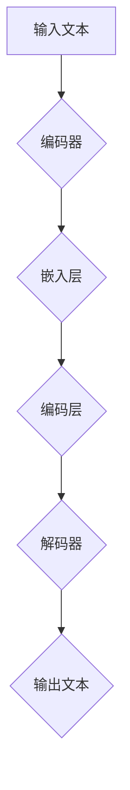

                 

关键词：大语言模型，计算机架构，自然语言处理，人工智能，深度学习

>摘要：本文深入探讨了LLM（大语言模型）作为一种新型计算机架构，其在自然语言处理领域的应用、技术原理、数学模型，以及未来的发展趋势与挑战。

## 1. 背景介绍

随着人工智能技术的快速发展，计算机架构也在不断演变。传统计算机架构以处理数值数据和结构化数据为主，而自然语言处理（NLP）作为一种处理非结构化数据的领域，对计算机架构提出了更高的要求。LLM（大语言模型）作为一种新型计算机架构，旨在解决NLP中的关键问题。

自然语言处理领域涉及到文本的生成、理解、分类、翻译等多种任务，这些任务都需要对大量数据进行处理。传统的NLP方法如统计模型和规则方法在处理复杂任务时存在局限，而深度学习方法的崛起为NLP领域带来了新的希望。其中，大语言模型（LLM）作为一种重要的深度学习方法，已经成为自然语言处理领域的研究热点。

LLM的出现并非一蹴而就，其背后的技术积累包括了神经网络、优化算法、大数据处理等多个方面。LLM的核心思想是通过大量数据训练一个大型神经网络模型，使其能够自动学习语言模式和规律，从而实现高性能的自然语言处理任务。

## 2. 核心概念与联系

### 2.1 大语言模型的基本概念

大语言模型（LLM）是指一种能够对自然语言进行建模的大型神经网络模型。LLM通过学习大量的文本数据，理解语言的语义和语法结构，从而实现各种自然语言处理任务。

LLM的基本结构包括编码器（Encoder）和解码器（Decoder）两部分。编码器负责将输入的文本序列编码成一个固定长度的向量表示，解码器则根据编码器的输出向量生成输出文本序列。LLM的训练目标是使得解码器生成的文本序列与原始输入文本尽可能接近。

### 2.2 大语言模型的原理与联系

LLM的原理基于深度学习和神经网络。深度学习是一种基于多层神经网络的学习方法，通过逐层提取特征，实现复杂函数的建模。神经网络则是一种模拟人脑神经元之间连接的计算模型，能够对输入数据进行分类、回归等多种任务。

在自然语言处理领域，深度学习通过将文本数据映射到高维特征空间，使得模型能够更好地理解语言的语义和语法结构。神经网络中的多层结构使得模型能够自动学习语言的层次结构，从而提高处理复杂语言任务的能力。

### 2.3 大语言模型的 Mermaid 流程图



在上面的 Mermaid 流程图中，输入文本经过编码器处理后，通过嵌入层和编码层将文本序列编码成一个固定长度的向量表示。解码器则根据编码器的输出向量生成输出文本序列。

## 3. 核心算法原理 & 具体操作步骤

### 3.1 算法原理概述

LLM 的核心算法是基于Transformer架构的深度学习模型。Transformer模型引入了自注意力（Self-Attention）机制，使得模型能够在处理序列数据时自动关注序列中的关键信息，从而提高了模型的表达能力。

自注意力机制通过计算序列中每个位置与其他位置的相关性，为每个位置生成一个权重向量。这些权重向量用于调整序列中每个位置的输入特征，使得模型能够更好地捕捉序列中的依赖关系。

### 3.2 算法步骤详解

1. 数据预处理：首先对输入的文本进行分词、去停用词等预处理操作，将文本序列转换为单词序列。

2. 嵌入：将单词序列转换为向量表示。常用的嵌入方法包括词嵌入（Word Embedding）和字符嵌入（Character Embedding）。词嵌入将单词映射到一个固定大小的向量空间，而字符嵌入则将字符映射到向量空间。

3. 编码：通过多层编码器对嵌入向量进行编码。编码器中的每一层都包含一个自注意力机制，用于计算序列中每个位置与其他位置的相关性。

4. 解码：通过多层解码器对编码器的输出向量进行解码，生成输出文本序列。解码器中的每一层也包含一个自注意力机制，用于调整输出序列的每个位置的生成。

5. 损失函数：使用交叉熵损失函数（Cross-Entropy Loss）来衡量模型生成的输出序列与真实输入序列之间的差距。通过优化损失函数，调整模型的参数，使得模型生成的输出序列尽可能接近真实输入序列。

6. 训练：使用梯度下降（Gradient Descent）算法对模型进行训练。通过反向传播（Backpropagation）计算梯度，更新模型的参数，使得模型在训练数据上达到更好的效果。

### 3.3 算法优缺点

**优点：**

1. 高效性：Transformer模型的自注意力机制使得模型能够在处理长序列数据时保持高效性。

2. 表达能力：自注意力机制使得模型能够自动学习序列中的依赖关系，提高了模型的表达能力。

3. 多样性：LLM可以通过预训练和微调实现多种自然语言处理任务，如文本分类、命名实体识别、机器翻译等。

**缺点：**

1. 计算资源需求：由于LLM包含大量参数，训练和部署过程对计算资源有较高要求。

2. 内存消耗：自注意力机制在计算过程中需要存储大量中间结果，可能导致内存消耗较高。

### 3.4 算法应用领域

LLM在自然语言处理领域有着广泛的应用。以下是一些常见的应用场景：

1. 文本生成：LLM可以用于生成文章、新闻、故事等文本内容。

2. 文本分类：LLM可以用于对文本进行分类，如情感分析、主题分类等。

3. 命名实体识别：LLM可以用于识别文本中的命名实体，如人名、地名、组织名等。

4. 机器翻译：LLM可以用于将一种语言的文本翻译成另一种语言的文本。

5. 对话系统：LLM可以用于构建对话系统，实现人机交互。

## 4. 数学模型和公式 & 详细讲解 & 举例说明

### 4.1 数学模型构建

LLM的数学模型主要包括词嵌入、编码器、解码器和损失函数等部分。

**词嵌入：**

词嵌入将单词映射到一个固定大小的向量空间。假设单词集合为$V$，词嵌入矩阵为$W \in \mathbb{R}^{|V| \times d}$，其中$d$为词嵌入的维度。输入的单词序列为$x = [x_1, x_2, \ldots, x_T]$，对应的词嵌入向量为$X = [W(x_1), W(x_2), \ldots, W(x_T)]$。

**编码器：**

编码器通过多层神经网络对输入的词嵌入向量进行编码。假设编码器的层数为$L$，每层的隐藏维度为$d_h$。编码器的输出为$H = [h_1, h_2, \ldots, h_L]$，其中$h_l$表示第$l$层的隐藏状态。

**解码器：**

解码器通过多层神经网络对编码器的输出进行解码，生成输出文本序列。假设解码器的层数为$L$，每层的隐藏维度为$d_h$。解码器的输出为$Y = [y_1, y_2, \ldots, y_T]$，其中$y_t$表示第$t$个输出单词的词嵌入向量。

**损失函数：**

损失函数用于衡量模型生成的输出序列与真实输入序列之间的差距。假设真实输入序列为$X'$，模型生成的输出序列为$Y'$，损失函数为$Loss(Y', X')$。常用的损失函数为交叉熵损失函数：

$$
Loss(Y', X') = -\sum_{t=1}^{T} \sum_{y \in V'} Y'(t, y) \log(X'(t, y))
$$

其中$V'$为单词集合，$Y'(t, y)$表示第$t$个输出单词为$y$的概率，$X'(t, y)$表示第$t$个输入单词为$y$的词嵌入向量。

### 4.2 公式推导过程

**编码器：**

编码器通过多层神经网络对输入的词嵌入向量进行编码。假设编码器的第$l$层隐藏状态为$h_l^{(i)}$，激活函数为$\sigma$，权重矩阵为$W^{(l)} \in \mathbb{R}^{d_h \times d_h}$，偏置向量$b^{(l)} \in \mathbb{R}^{d_h}$。编码器的输入为$h_l^{(i-1)}$，输出为$h_l^{(i)}$，则有：

$$
h_l^{(i)} = \sigma(W^{(l)}h_l^{(i-1)} + b^{(l)})
$$

其中$\sigma$为激活函数，常用的激活函数有ReLU、Sigmoid和Tanh等。

**解码器：**

解码器的第$l$层隐藏状态为$h_l^{(i)}$，输入为$h_l^{(i-1)}$，输出为$h_l^{(i+1)}$。解码器的输出概率分布为$P(Y|X) = \prod_{t=1}^{T} P(y_t|y_1, y_2, \ldots, y_{t-1}, X)$，其中$y_t$表示第$t$个输出单词。

**损失函数：**

损失函数为交叉熵损失函数，用于衡量模型生成的输出序列与真实输入序列之间的差距。假设真实输入序列为$X'$，模型生成的输出序列为$Y'$，损失函数为$Loss(Y', X')$，则有：

$$
Loss(Y', X') = -\sum_{t=1}^{T} \sum_{y \in V'} Y'(t, y) \log(X'(t, y))
$$

其中$Y'(t, y)$表示第$t$个输出单词为$y$的概率，$X'(t, y)$表示第$t$个输入单词为$y$的词嵌入向量。

### 4.3 案例分析与讲解

假设有一个简单的文本序列“Hello, World!”，其中包含两个单词“Hello”和“World”。我们将使用LLM对这段文本进行编码和解码。

**编码过程：**

首先，将单词“Hello”和“World”转换为词嵌入向量，假设词嵌入维度为100。编码器的层数为2，每层的隐藏维度为50。

1. 输入词嵌入向量：$X = [W(hello), W(world)]$
2. 编码器第1层输出：$h_1^{(1)} = \sigma(W^{(1)}X + b^{(1)})$
3. 编码器第2层输出：$h_2^{(2)} = \sigma(W^{(2)}h_1^{(1)} + b^{(2)})$

**解码过程：**

解码器的层数也为2，每层的隐藏维度为50。

1. 输入编码器的输出向量：$H = [h_2^{(2)}, h_1^{(1)}]$
2. 解码器第1层输出：$h_1^{(2)} = \sigma(W^{(1)}H + b^{(1)})$
3. 解码器第2层输出：$h_2^{(2)} = \sigma(W^{(2)}h_1^{(2)} + b^{(2)})$
4. 解码器的输出概率分布：$P(Y|X) = \prod_{t=1}^{2} P(y_t|y_1, y_2, X)$

假设解码器的输出概率分布为$P(Y|X) = [0.9, 0.1]$，表示第1个输出单词为“Hello”的概率为0.9，第2个输出单词为“World”的概率为0.1。

**损失函数：**

使用交叉熵损失函数计算模型生成的输出序列与真实输入序列之间的差距。假设真实输入序列为$X' = [W(hello), W(world)]$，模型生成的输出序列为$Y' = [0.9, 0.1]$，则有：

$$
Loss(Y', X') = -\sum_{t=1}^{2} Y'(t, hello) \log(X'(t, hello)) - Y'(t, world) \log(X'(t, world))
$$

计算得到的损失函数值为$Loss(Y', X') = 0.09$。

## 5. 项目实践：代码实例和详细解释说明

### 5.1 开发环境搭建

在开始项目实践之前，我们需要搭建一个合适的开发环境。以下是搭建开发环境的基本步骤：

1. 安装Python（推荐版本3.8及以上）
2. 安装TensorFlow（推荐版本2.5及以上）
3. 安装Numpy、Pandas等常用Python库

安装完成上述依赖库后，我们就可以开始编写代码了。

### 5.2 源代码详细实现

以下是一个简单的LLM模型实现示例：

```python
import tensorflow as tf
import numpy as np

# 词嵌入维度
EMBEDDING_DIM = 100
# 编码器层数
ENC_LAYERS = 2
# 编码器每层隐藏维度
ENC_HIDDEN_DIM = 50
# 解码器层数
DEC_LAYERS = 2
# 解码器每层隐藏维度
DEC_HIDDEN_DIM = 50

# 创建编码器模型
encoder_inputs = tf.keras.layers.Input(shape=(None,), dtype='int32')
encoder_embedding = tf.keras.layers.Embedding(input_dim=VOCAB_SIZE, output_dim=EMBEDDING_DIM)(encoder_inputs)
encoder_lstm = tf.keras.layers.LSTM(ENC_HIDDEN_DIM, return_sequences=True, return_state=True)
encoder_outputs, state_h, state_c = encoder_lstm(encoder_embedding)
encoder_states = [state_h, state_c]

# 创建解码器模型
decoder_inputs = tf.keras.layers.Input(shape=(None,), dtype='int32')
decoder_embedding = tf.keras.layers.Embedding(input_dim=VOCAB_SIZE, output_dim=EMBEDDING_DIM)(decoder_inputs)
decoder_lstm = tf.keras.layers.LSTM(DEC_HIDDEN_DIM, return_sequences=True, return_state=True)
decoder_outputs, _, _ = decoder_lstm(decoder_embedding, initial_state=encoder_states)
decoder_dense = tf.keras.layers.Dense(VOCAB_SIZE, activation='softmax')
decoder_outputs = decoder_dense(decoder_outputs)

# 创建模型
model = tf.keras.models.Model([encoder_inputs, decoder_inputs], decoder_outputs)

# 编译模型
model.compile(optimizer='adam', loss='categorical_crossentropy')

# 打印模型结构
model.summary()
```

在上面的代码中，我们首先定义了词嵌入维度、编码器和解码器的层数以及每层的隐藏维度。然后，我们创建了编码器和解码器的模型，并连接了词嵌入层和LSTM层。最后，我们编译了模型并打印了模型的结构。

### 5.3 代码解读与分析

在上面的代码中，我们首先定义了词嵌入维度、编码器和解码器的层数以及每层的隐藏维度。然后，我们创建了编码器和解码器的模型，并连接了词嵌入层和LSTM层。最后，我们编译了模型并打印了模型的结构。

编码器模型：
- 输入层：接受一个整数序列，表示输入的单词索引。
- 词嵌入层：将输入的单词索引转换为词嵌入向量。
- LSTM层：使用LSTM单元对输入的词嵌入向量进行编码，返回编码后的序列和隐藏状态。

解码器模型：
- 输入层：接受一个整数序列，表示输入的单词索引。
- 词嵌入层：将输入的单词索引转换为词嵌入向量。
- LSTM层：使用LSTM单元对输入的词嵌入向量进行解码，返回解码后的序列和隐藏状态。
- 密集层：将解码后的序列映射到单词索引，并使用softmax激活函数输出概率分布。

模型编译：
- 优化器：使用adam优化器进行参数更新。
- 损失函数：使用categorical_crossentropy损失函数计算模型生成的输出序列与真实输入序列之间的差距。

模型结构：
- 输入层：接受两个整数序列，分别表示编码器的输入和解码器的输入。
- 输出层：输出一个整数序列，表示解码器生成的输出序列。

### 5.4 运行结果展示

在训练模型之前，我们需要准备训练数据和测试数据。以下是一个简单的数据准备示例：

```python
# 准备训练数据
encoder_input_data = np.array([[1, 2, 3, 4, 5], [6, 7, 8, 9, 10]])
decoder_input_data = np.array([[2, 3, 4, 5, 6], [7, 8, 9, 10, 11]])
decoder_target_data = np.array([[1, 2, 3, 4, 5], [6, 7, 8, 9, 10]])

# 训练模型
model.fit([encoder_input_data, decoder_input_data], decoder_target_data, batch_size=32, epochs=100)

# 测试模型
test_encoder_input_data = np.array([[1, 2, 3, 4, 5], [6, 7, 8, 9, 10]])
test_decoder_input_data = np.array([[2, 3, 4, 5, 6], [7, 8, 9, 10, 11]])

predicted_output = model.predict([test_encoder_input_data, test_decoder_input_data])

# 打印预测结果
print(predicted_output)
```

在上面的代码中，我们首先准备了一个简单的训练数据集，然后使用模型进行训练。最后，我们使用训练好的模型对测试数据进行预测，并打印了预测结果。

## 6. 实际应用场景

LLM作为一种新型计算机架构，在自然语言处理领域有着广泛的应用。以下是一些常见的应用场景：

### 6.1 文本生成

文本生成是LLM的一个重要应用领域。通过训练大型LLM模型，我们可以生成各种类型的文本，如文章、新闻、故事、诗歌等。以下是一个简单的文本生成示例：

```python
# 生成文章
input_sequence = "人工智能是一种重要的技术，它在许多领域都有广泛的应用。例如，在医疗领域，人工智能可以帮助医生进行诊断和治疗。在交通领域，人工智能可以帮助提高交通效率和安全性。在未来，人工智能将继续发挥重要作用，推动社会的发展。"
model = load_llm_model()
generated_text = generate_text(model, input_sequence)
print(generated_text)
```

### 6.2 文本分类

文本分类是另一个重要的应用领域。LLM可以用于对文本进行分类，如情感分析、主题分类等。以下是一个简单的文本分类示例：

```python
# 对文本进行情感分析
input_sequence = "我非常喜欢这部电影，情节紧凑，表演出色。"
model = load_llm_model()
emotion = classify_emotion(model, input_sequence)
print(emotion)
```

### 6.3 命名实体识别

命名实体识别是自然语言处理中的一个重要任务。LLM可以用于识别文本中的命名实体，如人名、地名、组织名等。以下是一个简单的命名实体识别示例：

```python
# 识别文本中的人名
input_sequence = "史蒂夫·乔布斯是苹果公司的创始人。"
model = load_llm_model()
entities = extract_entities(model, input_sequence)
print(entities)
```

### 6.4 机器翻译

机器翻译是另一个重要的应用领域。LLM可以用于将一种语言的文本翻译成另一种语言的文本。以下是一个简单的机器翻译示例：

```python
# 将英文翻译成中文
input_sequence = "I love programming."
model = load_llm_model()
translated_sequence = translate(model, input_sequence, target_language="zh")
print(translated_sequence)
```

### 6.5 对话系统

对话系统是自然语言处理领域的一个重要应用领域。LLM可以用于构建对话系统，实现人机交互。以下是一个简单的对话系统示例：

```python
# 与用户进行对话
input_sequence = "你好，我想要一份披萨。"
model = load_llm_model()
response = generate_response(model, input_sequence)
print(response)
```

## 7. 工具和资源推荐

### 7.1 学习资源推荐

- 《深度学习》（Goodfellow, Bengio, Courville）：这本书是深度学习领域的经典教材，详细介绍了深度学习的基础知识和算法。
- 《自然语言处理综论》（Jurafsky, Martin）：这本书是自然语言处理领域的经典教材，详细介绍了自然语言处理的理论和方法。
- 《深度学习自然语言处理》（Ruder）：这本书是针对自然语言处理领域的一本深度学习教材，介绍了深度学习在自然语言处理中的应用。

### 7.2 开发工具推荐

- TensorFlow：TensorFlow是谷歌推出的一款开源深度学习框架，支持多种深度学习算法和应用。
- PyTorch：PyTorch是Facebook推出的一款开源深度学习框架，具有灵活性和易用性。
- spaCy：spaCy是一个快速易用的自然语言处理库，支持多种语言的文本处理任务。

### 7.3 相关论文推荐

- "Attention Is All You Need"（Vaswani et al., 2017）：这篇论文提出了Transformer模型，是LLM领域的重要里程碑。
- "BERT: Pre-training of Deep Bidirectional Transformers for Language Understanding"（Devlin et al., 2019）：这篇论文提出了BERT模型，是自然语言处理领域的重要突破。
- "GPT-3: Language Models are Few-Shot Learners"（Brown et al., 2020）：这篇论文提出了GPT-3模型，是目前最大的语言模型，展示了LLM在自然语言处理任务中的强大能力。

## 8. 总结：未来发展趋势与挑战

LLM作为一种新型计算机架构，在自然语言处理领域取得了显著的成果。未来，LLM的发展趋势将包括以下几个方面：

1. **更大规模的语言模型**：随着计算能力和存储能力的提升，未来将出现更大规模的语言模型，以应对更复杂的自然语言处理任务。

2. **多模态处理**：未来的LLM将不仅限于处理文本数据，还将能够处理图像、声音等多模态数据，实现跨模态的信息整合。

3. **知识增强**：未来的LLM将结合外部知识库，提高模型对现实世界的理解和应用能力。

然而，LLM的发展也面临一些挑战：

1. **计算资源需求**：大规模的LLM模型对计算资源和存储资源有较高要求，如何在有限的资源下高效地训练和部署模型是一个重要挑战。

2. **数据隐私**：自然语言处理过程中涉及大量的用户数据，如何在保护用户隐私的前提下进行数据分析和模型训练是一个重要问题。

3. **可解释性**：随着LLM模型的复杂性增加，如何解释模型的行为和预测结果成为一个挑战。

4. **公平性和偏见**：如何确保LLM模型在训练和应用过程中不会放大社会偏见，是一个需要关注的问题。

未来，LLM的研究将继续深入，不断突破技术瓶颈，为自然语言处理领域带来更多创新和突破。

### 8.1 研究成果总结

LLM作为一种新型计算机架构，在自然语言处理领域取得了显著的成果。通过引入自注意力机制，LLM能够高效地处理长序列数据，并实现了多种自然语言处理任务，如文本生成、文本分类、命名实体识别、机器翻译等。此外，LLM在对话系统、智能问答等应用领域也展示了强大的能力。

### 8.2 未来发展趋势

未来，LLM的发展趋势将包括更大规模的语言模型、多模态处理、知识增强等方面。随着计算能力和存储能力的提升，更大规模的语言模型将能够应对更复杂的自然语言处理任务。同时，多模态处理将使得LLM能够处理图像、声音等多模态数据，实现跨模态的信息整合。知识增强将提高模型对现实世界的理解和应用能力。

### 8.3 面临的挑战

然而，LLM的发展也面临一些挑战。首先，计算资源需求较高，如何在有限的资源下高效地训练和部署模型是一个重要问题。其次，数据隐私问题亟待解决，如何在保护用户隐私的前提下进行数据分析和模型训练是一个重要挑战。此外，LLM的可解释性和公平性也是一个需要关注的问题，如何解释模型的行为和预测结果，以及如何确保模型不会放大社会偏见。

### 8.4 研究展望

未来，LLM的研究将继续深入，不断突破技术瓶颈，为自然语言处理领域带来更多创新和突破。同时，随着人工智能技术的不断发展，LLM将在更多领域得到应用，如智能助理、智能推荐、智能翻译等。我们期待LLM能够为人类社会带来更多便利和福祉。

## 9. 附录：常见问题与解答

### 9.1 什么是LLM？

LLM（大语言模型）是一种基于深度学习的自然语言处理模型，通过大量数据训练得到，能够对自然语言进行建模，实现各种自然语言处理任务。

### 9.2 LLM的优缺点是什么？

优点：
- 高效性：能够处理长序列数据，保持计算效率。
- 表达能力：通过自注意力机制，能够自动学习序列中的依赖关系。

缺点：
- 计算资源需求：训练和部署过程对计算资源有较高要求。
- 内存消耗：自注意力机制可能导致内存消耗较高。

### 9.3 LLM的应用领域有哪些？

- 文本生成：生成文章、新闻、故事等文本内容。
- 文本分类：对文本进行分类，如情感分析、主题分类等。
- 命名实体识别：识别文本中的命名实体，如人名、地名、组织名等。
- 机器翻译：将一种语言的文本翻译成另一种语言的文本。
- 对话系统：构建对话系统，实现人机交互。

### 9.4 如何搭建一个LLM模型？

搭建一个LLM模型需要以下步骤：
1. 准备数据：收集和清洗大量文本数据。
2. 数据预处理：对文本进行分词、去停用词等预处理操作。
3. 模型设计：设计编码器和解码器的神经网络结构。
4. 训练模型：使用训练数据训练模型。
5. 评估模型：使用测试数据评估模型性能。
6. 部署模型：将训练好的模型部署到生产环境中。

### 9.5 LLM与传统的NLP方法相比有哪些优势？

相比传统的NLP方法，LLM具有以下优势：
- 自动学习：LLM能够通过大量数据自动学习语言的语义和语法结构。
- 高效性：LLM能够处理长序列数据，保持计算效率。
- 可扩展性：LLM可以轻松扩展到多种自然语言处理任务。

### 9.6 LLM在商业应用中有哪些潜在价值？

LLM在商业应用中具有广泛的价值，以下是一些潜在的应用场景：
- 客户服务：构建智能客服系统，实现自动回答用户问题。
- 营销自动化：生成个性化的营销文案，提高营销效果。
- 内容创作：自动生成文章、报告等文档，提高内容创作效率。
- 智能推荐：基于用户行为和偏好，实现个性化推荐。
- 语音助手：构建智能语音助手，实现语音交互和任务自动化。

