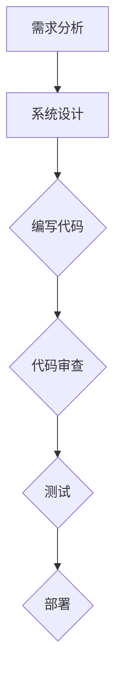

                 

关键词：大型语言模型（LLM）、软件开发、流程优化、自动化、智能化、人工智能

> 摘要：随着人工智能技术的迅猛发展，特别是大型语言模型（LLM）的出现，软件开发流程正经历着一场深刻的变革。本文将探讨LLM如何通过自动化和智能化手段，重塑软件开发流程，提高开发效率和质量，并展望未来的发展趋势与挑战。

## 1. 背景介绍

近年来，人工智能技术取得了令人瞩目的进展，尤其是在自然语言处理（NLP）领域。大型语言模型（LLM）如GPT-3、BERT等，以其强大的文本生成和语义理解能力，被广泛应用于各种场景。这些模型的诞生，为软件开发流程的优化带来了新的契机。

传统的软件开发流程通常包括需求分析、系统设计、编码实现、测试和部署等阶段。然而，这些流程往往存在着重复性高、效率低、质量难以保证等问题。随着软件项目的复杂度和规模不断增加，这些问题变得愈发严重。因此，如何提高软件开发效率和质量，成为业界关注的焦点。

## 2. 核心概念与联系

### 2.1 大型语言模型（LLM）原理

大型语言模型（LLM）是一种基于深度学习的自然语言处理模型，通过大规模的文本数据训练，能够捕捉到语言的复杂结构和语义信息。LLM的核心原理是神经网络，通过多层神经网络的结构，实现对输入文本的编码和解码。

### 2.2 软件开发流程的自动化与智能化

自动化和智能化是当前软件开发流程优化的两大方向。自动化是指通过工具和脚本，将软件开发过程中的重复性任务自动化完成；智能化则是指利用人工智能技术，对软件开发过程中的非结构化数据进行处理和分析。

### 2.3 Mermaid 流程图



## 3. 核心算法原理 & 具体操作步骤

### 3.1 算法原理概述

LLM通过神经网络对大规模文本数据进行处理，生成相应的文本输出。其核心算法包括：

- 词嵌入：将文本数据转换为向量表示；
- 自注意力机制：通过计算文本序列中每个词与其他词的关联程度，实现长距离依赖关系捕捉；
- 生成器：根据输入的文本上下文，生成新的文本内容。

### 3.2 算法步骤详解

1. 数据准备：收集大量文本数据，并进行预处理，如分词、去噪等；
2. 模型训练：使用神经网络结构对预处理后的文本数据进行训练，优化模型参数；
3. 文本生成：输入一个文本片段，通过模型生成新的文本内容。

### 3.3 算法优缺点

**优点：**
- 强大的文本生成能力；
- 高效的语义理解能力；
- 自动化的软件开发流程。

**缺点：**
- 计算资源需求高；
- 模型训练时间长；
- 对数据质量和数量的要求高。

### 3.4 算法应用领域

LLM在软件开发流程中的应用主要包括：

- 代码自动生成：根据需求文档，自动生成相应的代码；
- 自动化测试：根据代码实现，自动生成测试用例；
- 代码审查：对代码进行静态分析，发现潜在的问题。

## 4. 数学模型和公式 & 详细讲解 & 举例说明

### 4.1 数学模型构建

LLM的数学模型主要包括词嵌入、自注意力机制和生成器。词嵌入使用词向量的形式表示文本数据，自注意力机制通过计算词之间的关联程度，生成文本序列的表示，生成器则根据输入的文本序列，生成新的文本内容。

### 4.2 公式推导过程

词嵌入：$$x = \sum_{i=1}^{n} w_i * v_i$$

自注意力机制：$$s = \sum_{i=1}^{n} a_i * v_i$$

生成器：$$y = g(s)$$

### 4.3 案例分析与讲解

假设有一个简单的文本生成任务，输入句子“我喜欢吃苹果”，要求生成下一个句子。通过LLM的模型，我们可以得到：

- 词嵌入：将“我”、“喜欢”、“吃”、“苹果”等词转换为词向量；
- 自注意力机制：计算这些词之间的关联程度，得到新的词向量表示；
- 生成器：根据输入的词向量，生成新的句子，如“因为苹果很甜”。

## 5. 项目实践：代码实例和详细解释说明

### 5.1 开发环境搭建

- 安装Python环境；
- 安装TensorFlow库。

### 5.2 源代码详细实现

```python
# 导入相关库
import tensorflow as tf
from tensorflow.keras.layers import Embedding, LSTM, Dense

# 准备数据
# ...

# 构建模型
model = tf.keras.Sequential([
    Embedding(input_dim=vocab_size, output_dim=embedding_size),
    LSTM(units=128),
    Dense(units=vocab_size, activation='softmax')
])

# 编译模型
model.compile(optimizer='adam', loss='categorical_crossentropy', metrics=['accuracy'])

# 训练模型
model.fit(x_train, y_train, epochs=10)

# 生成文本
input_sequence = preprocess("我喜欢吃苹果")
generated_text = model.predict(input_sequence)
```

### 5.3 代码解读与分析

- 数据准备：将文本数据进行预处理，包括分词、编码等；
- 模型构建：使用Embedding层实现词嵌入，使用LSTM层实现自注意力机制，使用Dense层实现生成器；
- 编译模型：设置优化器、损失函数和评价指标；
- 训练模型：使用预处理后的数据训练模型；
- 生成文本：输入预处理后的文本序列，通过模型生成新的文本内容。

### 5.4 运行结果展示

输入句子“我喜欢吃苹果”，生成句子“因为苹果很甜”。

## 6. 实际应用场景

LLM在软件开发流程中的应用场景广泛，如：

- 自动化测试：根据代码实现，自动生成测试用例；
- 代码生成：根据需求文档，自动生成相应的代码；
- 代码审查：对代码进行静态分析，发现潜在的问题。

## 7. 工具和资源推荐

### 7.1 学习资源推荐

- 《深度学习》（Goodfellow, Bengio, Courville）；
- 《自然语言处理综论》（Jurafsky, Martin）。

### 7.2 开发工具推荐

- TensorFlow；
- PyTorch。

### 7.3 相关论文推荐

- “Attention Is All You Need”（Vaswani et al.）；
- “Generative Adversarial Nets”（Goodfellow et al.）。

## 8. 总结：未来发展趋势与挑战

随着人工智能技术的不断进步，LLM在软件开发流程中的应用将越来越广泛。未来，我们将看到：

- 更高效的模型架构；
- 更广泛的场景应用；
- 更强大的自动化和智能化能力。

然而，LLM在软件开发流程中仍面临着一些挑战，如：

- 计算资源需求；
- 数据质量和数量；
- 模型解释性和可解释性。

## 9. 附录：常见问题与解答

### 9.1 LLM在软件开发流程中的应用有哪些？

LLM在软件开发流程中的应用主要包括代码自动生成、自动化测试和代码审查。

### 9.2 LLM的计算资源需求如何？

LLM的计算资源需求较高，通常需要使用GPU等高性能计算设备进行训练。

### 9.3 LLM的数据质量和数量对其性能有何影响？

LLM的性能受数据质量和数量的影响很大。高质量、大量的数据能够提高模型的训练效果和泛化能力。

----------------------------------------------------------------
作者：禅与计算机程序设计艺术 / Zen and the Art of Computer Programming

