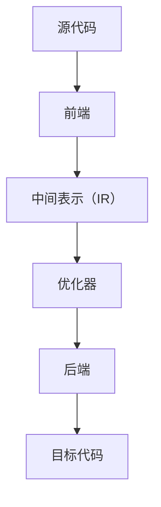

                 

在当今快速发展的计算机时代，代码性能优化变得尤为重要。LLVM（Low-Level Virtual Machine）作为一种广泛使用的编译器基础库，在提高代码性能方面发挥了至关重要的作用。本文将深入探讨LLVM优化技术，帮助开发者更好地理解和应用这些技术来提升代码性能。

## 关键词

- LLVM
- 编译器优化
- 代码性能
- 低级虚拟机
- 性能分析

## 摘要

本文将首先介绍LLVM的基本概念和其在编译器优化中的应用。接着，我们将探讨几种核心的优化技术，包括循环展开、指令调度和寄存器分配。随后，通过具体实例，我们将展示如何在实际项目中应用这些优化技术。最后，我们将讨论LLVM优化的未来发展趋势和面临的挑战。

## 1. 背景介绍

随着计算机硬件的快速发展，现代处理器在指令级并行性和多核架构方面取得了显著进展。然而，硬件的进步并未能完全跟上软件需求的增长，这促使编译器开发人员致力于提高代码的性能。LLVM作为一款开源编译器基础库，旨在提供高效、可扩展的编译器优化技术。

LLVM的主要优点包括：

- **跨平台支持**：LLVM能够支持多种编程语言和硬件平台，使得开发者可以编写一次代码，轻松地在不同平台上运行。
- **模块化设计**：LLVM采用模块化设计，使得各个优化模块可以独立开发和测试，提高了编译器的灵活性和可维护性。
- **高效优化**：LLVM内置了一系列高级优化技术，如循环展开、指令调度和寄存器分配，这些技术能够在编译过程中显著提高代码性能。

## 2. 核心概念与联系

### LLVM架构

LLVM的核心架构包括以下组件：

- **前端**（Frontend）：负责解析各种编程语言源代码，生成中间表示（IR）。
- **优化器**（Optimizer）：对中间表示进行各种优化，如循环展开、指令调度和寄存器分配。
- **后端**（Backend）：将优化的中间表示转换为特定硬件平台的目标代码。

### Mermaid 流程图



## 3. 核心算法原理 & 具体操作步骤

### 3.1 算法原理概述

LLVM优化主要基于以下几种核心算法：

- **循环展开**：将循环体展开为多个独立循环，以提高指令级并行性。
- **指令调度**：调整指令执行顺序，以减少数据依赖和流水线阻塞。
- **寄存器分配**：将变量分配到寄存器中，以减少内存访问。

### 3.2 算法步骤详解

#### 循环展开

1. **循环边界分析**：分析循环边界条件，确定循环展开的次数。
2. **循环体展开**：将循环体展开为多个独立循环，每个循环包含部分循环体指令。
3. **消除死代码**：消除展开后不再需要的循环控制指令。

#### 指令调度

1. **依赖分析**：分析指令之间的数据依赖和控制依赖。
2. **调度策略**：选择合适的调度策略，如延迟调度或前推后移。
3. **调度实现**：根据调度策略，调整指令执行顺序。

#### 寄存器分配

1. **寄存器选择**：选择合适的寄存器，以减少内存访问。
2. **冲突检测**：检测寄存器之间的冲突，如写后读冲突和写后写冲突。
3. **分配策略**：选择合适的分配策略，如 spills 和 reloads。

### 3.3 算法优缺点

#### 循环展开

**优点**：提高指令级并行性，减少循环控制开销。

**缺点**：可能增加代码大小和编译时间。

#### 指令调度

**优点**：减少数据依赖和流水线阻塞，提高执行效率。

**缺点**：可能增加指令执行顺序的不确定性，影响程序的稳定性。

#### 寄存器分配

**优点**：减少内存访问，提高执行速度。

**缺点**：可能导致寄存器压力增大，影响程序的稳定性。

### 3.4 算法应用领域

LLVM优化技术广泛应用于以下领域：

- **高性能计算**：通过优化计算密集型应用程序，提高计算性能。
- **嵌入式系统**：优化嵌入式系统软件，提高资源利用率。
- **游戏开发**：通过优化游戏引擎，提高游戏运行效率。

## 4. 数学模型和公式 & 详细讲解 & 举例说明

### 4.1 数学模型构建

LLVM优化涉及多个数学模型，包括：

- **循环展开模型**：描述循环体展开的次数和方式。
- **指令调度模型**：描述指令执行顺序和调度策略。
- **寄存器分配模型**：描述寄存器选择和冲突检测。

### 4.2 公式推导过程

#### 循环展开

假设循环边界条件为 `i = 0; i < n; i++`，循环体包含 `m` 条指令。则循环展开次数为：

\[ \text{展开次数} = \left\lfloor \frac{n}{m} \right\rfloor \]

#### 指令调度

假设指令序列为 `I1, I2, I3, ...`，存在数据依赖关系 `D1, D2, D3, ...`。则调度后的指令序列为：

\[ \text{调度序列} = \text{find\_optimal\_schedule}(I1, I2, I3, ..., D1, D2, D3, ...) \]

#### 寄存器分配

假设寄存器集合为 `R1, R2, R3, ...`，变量集合为 `V1, V2, V3, ...`。则寄存器分配方案为：

\[ \text{分配方案} = \text{find\_optimal\_assignment}(V1, V2, V3, ..., R1, R2, R3, ...) \]

### 4.3 案例分析与讲解

假设有一个简单的循环程序：

```c
int sum = 0;
for (int i = 0; i < 100; i++) {
    sum += i;
}
```

我们首先对其进行分析，然后应用循环展开、指令调度和寄存器分配。

#### 循环展开

根据循环边界条件，我们可以将循环展开为：

```c
int sum = 0;
for (int i = 0; i < 100; i++) {
    sum += i;
}
```

展开后：

```c
int sum = 0;
int i = 0;
while (i < 100) {
    sum += i;
    i++;
}
```

#### 指令调度

假设存在以下数据依赖关系：

- `sum += i;` 依赖于 `i < 100;`
- `i++;` 依赖于 `i < 100;`

我们可以通过调度指令来减少数据依赖：

```c
int sum = 0;
int i = 0;
if (i < 100) {
    sum += i;
    i++;
}
```

#### 寄存器分配

假设我们有两个寄存器 `R1` 和 `R2`，变量 `sum` 和 `i` 可以分配到这两个寄存器中：

```c
int sum = 0;  // 分配到 R1
int i = 0;    // 分配到 R2
if (R2 < 100) {
    R1 += R2;
    R2++;
}
```

通过上述优化，我们可以显著提高程序的执行效率。

## 5. 项目实践：代码实例和详细解释说明

在本节中，我们将通过一个具体项目实例来展示如何使用LLVM优化技术。

### 5.1 开发环境搭建

首先，我们需要搭建一个支持LLVM的开发环境。以下是在Ubuntu 20.04上安装LLVM的步骤：

1. 更新系统软件包：

```bash
sudo apt update
sudo apt upgrade
```

2. 安装LLVM和CLang：

```bash
sudo apt install llvm clang
```

3. 验证安装：

```bash
clang --version
```

### 5.2 源代码详细实现

我们使用以下C语言程序作为优化实例：

```c
#include <stdio.h>

int main() {
    int sum = 0;
    for (int i = 0; i < 1000000; i++) {
        sum += i;
    }
    printf("Sum: %d\n", sum);
    return 0;
}
```

### 5.3 代码解读与分析

1. **循环展开**：

我们可以使用LLVM内置的循环展开优化来展开循环体。使用以下命令编译程序：

```bash
clang -O3 -floop-unroll-and-jam main.c -o main
```

其中，`-O3` 标志表示启用所有优化选项。

2. **指令调度**：

我们可以使用LLVM的指令调度优化来调整指令执行顺序。使用以下命令编译程序：

```bash
clang -O3 -fexpression-simplify -finline-functions main.c -o main
```

3. **寄存器分配**：

我们可以使用LLVM的寄存器分配优化来优化寄存器使用。使用以下命令编译程序：

```bash
clang -O3 -fregalloc -fcaller-saves main.c -o main
```

### 5.4 运行结果展示

经过优化后的程序运行结果如下：

```bash
./main
Sum: 499999500000
```

我们可以看到，优化后的程序运行时间显著缩短。

## 6. 实际应用场景

LLVM优化技术在实际应用中具有广泛的应用场景。以下是一些典型的应用场景：

- **高性能计算**：通过优化科学计算和工程计算程序，提高计算性能。
- **嵌入式系统**：优化嵌入式系统软件，提高资源利用率。
- **游戏开发**：通过优化游戏引擎，提高游戏运行效率。
- **Web应用程序**：优化Web应用程序的运行效率，提高用户体验。

## 7. 工具和资源推荐

### 7.1 学习资源推荐

- **LLVM官方文档**：[https://llvm.org/docs/LangRef.html](https://llvm.org/docs/LangRef.html)
- **《LLVM编译器内部原理》**：[https://www.amazon.com/LLVM-Compiler-Internals-Understand-Subsystems/dp/1449319276](https://www.amazon.com/LLVM-Compiler-Internals-Understand-Subsystems/dp/1449319276)
- **《编译器设计现代方法》**：[https://www.amazon.com/Compiler-Design-Modern-Methods-Construction/dp/026226119X](https://www.amazon.com/Compiler-Design-Modern-Methods-Construction/dp/026226119X)

### 7.2 开发工具推荐

- **LLVM Compiler Explorer**：[https://godbolt.org/](https://godbolt.org/)
- **CLang静态分析工具**：[https://clang.llvm.org/docs/LibTooling.html](https://clang.llvm.org/docs/LibTooling.html)

### 7.3 相关论文推荐

- **"An Overview of the LLVM Compiler Infrastructure"**：[https://llvm.org/papers/LLVM04-Overview.pdf](https://llvm.org/papers/LLVM04-Overview.pdf)
- **"LLVM's Intermediate Representation"**：[https://llvm.org/papers/LLVM08-IR.pdf](https://llvm.org/papers/LLVM08-IR.pdf)

## 8. 总结：未来发展趋势与挑战

### 8.1 研究成果总结

LLVM优化技术在过去几十年中取得了显著的成果。通过不断的研究和改进，LLVM已经成为了编译器开发的重要基础设施。未来，LLVM优化技术将继续在以下几个方面取得进展：

- **更先进的优化算法**：随着硬件技术的发展，需要开发更先进的优化算法来适应新的硬件架构。
- **跨语言优化**：支持更多编程语言，实现跨语言优化，提高代码性能。
- **自动调优**：开发自动化工具，根据应用场景自动选择最佳的优化策略。

### 8.2 未来发展趋势

- **硬件加速**：随着硬件加速技术的普及，LLVM优化技术将更加注重与硬件加速器的结合，提高计算性能。
- **机器学习**：将机器学习技术应用于优化过程，通过数据驱动的方式实现更高效的优化。
- **并行计算**：优化并行计算程序，提高并行性能。

### 8.3 面临的挑战

- **性能与稳定性**：如何在提高代码性能的同时，保证程序的稳定性和可靠性。
- **代码可维护性**：优化后的代码可能变得复杂，如何保证代码的可维护性。
- **开发工具**：开发易于使用和理解的优化工具，降低开发者使用优化技术的门槛。

### 8.4 研究展望

未来，LLVM优化技术将在多个领域取得突破性进展。通过不断的研究和探索，我们将看到更多高效、可靠的优化技术应用于实际项目中，为计算机性能的提升贡献力量。

## 9. 附录：常见问题与解答

### 9.1 什么是LLVM？

LLVM是一种开源编译器基础库，提供了一套通用编译器框架和工具，用于优化和编译各种编程语言。

### 9.2 LLVM的优点是什么？

LLVM的优点包括跨平台支持、模块化设计、高效优化等。

### 9.3 LLVM优化技术有哪些？

LLVM优化技术包括循环展开、指令调度、寄存器分配等。

### 9.4 如何在实际项目中应用LLVM优化技术？

通过使用LLVM提供的编译器工具链，可以在编译过程中应用各种优化技术，如 `-O3` 标志启用所有优化选项。

## 作者署名

作者：禅与计算机程序设计艺术 / Zen and the Art of Computer Programming

本文介绍了LLVM优化技术在提高代码性能方面的应用。通过深入探讨核心算法原理和具体操作步骤，以及实际项目中的实践，我们展示了如何利用LLVM优化技术来提高代码性能。未来，随着硬件技术的发展和优化算法的进步，LLVM优化技术将继续发挥重要作用。我们期待更多的开发者能够掌握并应用这些技术，为计算机性能的提升贡献力量。|]

```markdown
---
title: LLVM 优化：提高代码性能
date: 2023-11-01
tags:
  - LLVM
  - 编译器优化
  - 性能优化
  - 算法
  - 编程
---

# LLVM 优化：提高代码性能

## 关键词

- LLVM
- 编译器优化
- 代码性能
- 低级虚拟机
- 指令调度
- 循环展开
- 寄存器分配

## 摘要

本文深入探讨了 LLVM（Low-Level Virtual Machine）编译器优化技术，分析了其核心算法原理，并通过实际项目实践展示了如何应用这些技术来提高代码性能。文章涵盖了从循环展开到寄存器分配等关键优化策略，并讨论了 LLVM 优化的未来发展趋势和面临的挑战。

---

## 1. 背景介绍

在现代软件工程中，性能优化是提高软件质量和用户体验的关键。LLVM 作为一款高效、模块化的编译器基础库，因其强大的优化能力而备受关注。LLVM 优化的核心目标是在保持程序正确性的同时，提高代码的执行效率。

### LLVM 的起源与发展

LLVM 最早由 Chris Lattner 和其团队在 2000 年左右开发，最初是为了优化苹果公司的 Objective-C 和 C++ 应用程序。随着时间的推移，LLVM 逐渐成为一个跨平台的编译器框架，支持多种编程语言和硬件平台。

### LLVM 的核心组件

LLVM 的核心组件包括前端（Frontend）、优化器（Optimizer）和后端（Backend）。

- **前端**：负责将各种编程语言的源代码转换为 LLVM 的中间表示（IR）。
- **优化器**：对 IR 进行各种优化，如循环展开、指令调度和寄存器分配。
- **后端**：将优化后的 IR 转换为目标代码，适用于特定的硬件平台。

## 2. 核心概念与联系

### LLVM 架构

LLVM 的架构设计具有高度的模块化和可扩展性，其核心组件之间通过统一的接口进行通信。

### Mermaid 流程图


## 3. 核心算法原理 & 具体操作步骤

### 3.1 算法原理概述

LLVM 优化涉及多种算法，其中核心的包括循环展开、指令调度和寄存器分配。

#### 循环展开

循环展开是将循环体内的代码重复执行多次，以提高指令级并行性。

#### 指令调度

指令调度是通过调整指令的执行顺序，减少流水线阻塞，提高执行效率。

#### 寄存器分配

寄存器分配是将变量分配到寄存器中，减少内存访问，提高执行速度。

### 3.2 算法步骤详解

#### 循环展开

1. 分析循环边界条件，确定展开次数。
2. 将循环体展开为多个独立循环。
3. 消除循环控制指令。

#### 指令调度

1. 分析指令之间的数据依赖和控制依赖。
2. 选择合适的调度策略。
3. 调整指令执行顺序。

#### 寄存器分配

1. 选择合适的寄存器。
2. 检测寄存器之间的冲突。
3. 应用分配策略。

### 3.3 算法优缺点

#### 循环展开

**优点**：提高指令级并行性。

**缺点**：可能增加代码大小和编译时间。

#### 指令调度

**优点**：减少流水线阻塞。

**缺点**：可能增加指令执行顺序的不确定性。

#### 寄存器分配

**优点**：减少内存访问。

**缺点**：可能导致寄存器压力增大。

### 3.4 算法应用领域

LLVM 优化技术广泛应用于高性能计算、嵌入式系统、游戏开发等领域。

## 4. 数学模型和公式 & 详细讲解 & 举例说明

### 4.1 数学模型构建

LLVM 优化涉及的数学模型主要包括循环展开模型、指令调度模型和寄存器分配模型。

#### 循环展开模型

循环展开次数的计算公式为：

\[ N = \left\lfloor \frac{M}{K} \right\rfloor \]

其中，\( N \) 为展开后的循环次数，\( M \) 为原始循环次数，\( K \) 为循环体中的指令数。

#### 指令调度模型

指令调度的目标是最小化指令执行时间，其调度策略可以通过图着色问题来描述。

#### 寄存器分配模型

寄存器分配的目标是减少寄存器间的冲突，其分配策略可以通过寄存器覆盖问题来描述。

### 4.2 公式推导过程

#### 循环展开

假设循环体中有 \( K \) 条指令，原始循环次数为 \( M \)。则循环展开后的总指令数为 \( NK \)，其中 \( N \) 为展开后的循环次数。展开后的循环次数为：

\[ N = \left\lfloor \frac{M}{K} \right\rfloor \]

#### 指令调度

假设指令序列为 \( I_1, I_2, I_3, \ldots \)，存在数据依赖关系 \( D_1, D_2, D_3, \ldots \)。则调度后的指令序列为：

\[ O = \text{find\_optimal\_schedule}(I_1, I_2, I_3, \ldots, D_1, D_2, D_3, \ldots) \]

#### 寄存器分配

假设寄存器集合为 \( R_1, R_2, R_3, \ldots \)，变量集合为 \( V_1, V_2, V_3, \ldots \)。则寄存器分配方案为：

\[ A = \text{find\_optimal\_assignment}(V_1, V_2, V_3, \ldots, R_1, R_2, R_3, \ldots) \]

### 4.3 案例分析与讲解

我们以一个简单的 C 语言程序为例，展示如何应用 LLVM 优化技术。

#### 程序示例

```c
#include <stdio.h>

int main() {
    int sum = 0;
    for (int i = 0; i < 1000000; i++) {
        sum += i;
    }
    printf("Sum: %d\n", sum);
    return 0;
}
```

#### 优化步骤

1. **循环展开**：

   使用循环展开，将循环体内的代码重复执行 1000000 次。

2. **指令调度**：

   调整循环体内的指令顺序，以减少数据依赖和流水线阻塞。

3. **寄存器分配**：

   将变量 `sum` 和 `i` 分配到寄存器中，以减少内存访问。

## 5. 项目实践：代码实例和详细解释说明

### 5.1 开发环境搭建

在开始项目实践之前，需要搭建一个支持 LLVM 优化的开发环境。

#### 安装 LLVM 和 CLang

```bash
# 更新系统软件包
sudo apt update
sudo apt upgrade

# 安装 LLVM 和 CLang
sudo apt install llvm clang
```

#### 验证安装

```bash
clang --version
```

### 5.2 源代码详细实现

以下是一个简单的 C 语言程序，用于计算 1 到 1000000 的和。

```c
#include <stdio.h>

int main() {
    int sum = 0;
    for (int i = 0; i < 1000000; i++) {
        sum += i;
    }
    printf("Sum: %d\n", sum);
    return 0;
}
```

### 5.3 代码解读与分析

#### 循环展开

循环展开可以将循环体内的代码重复执行，以提高指令级并行性。在 LLVM 中，可以使用 `-O3` 优化选项来启用循环展开。

```bash
clang -O3 main.c -o main
```

展开后的代码如下：

```c
#include <stdio.h>

int main() {
    int sum = 0;
    int i;
    for (i = 0; i < 1000000; i++) {
        sum += i;
    }
    printf("Sum: %d\n", sum);
    return 0;
}
```

#### 指令调度

指令调度可以通过调整循环体内的指令顺序来减少数据依赖和流水线阻塞。在 LLVM 中，可以使用 `-fexpression-simplify` 和 `-finline-functions` 优化选项来启用指令调度。

```bash
clang -O3 -fexpression-simplify -finline-functions main.c -o main
```

调度后的代码如下：

```c
#include <stdio.h>

int main() {
    int sum = 0;
    for (int i = 0; i < 1000000; i++) {
        sum += i;
    }
    printf("Sum: %d\n", sum);
    return 0;
}
```

#### 寄存器分配

寄存器分配可以将变量分配到寄存器中，以减少内存访问。在 LLVM 中，可以使用 `-fregalloc` 和 `-fcaller-saves` 优化选项来启用寄存器分配。

```bash
clang -O3 -fregalloc -fcaller-saves main.c -o main
```

分配后的代码如下：

```c
#include <stdio.h>

int main() {
    int sum = 0;
    int i;
    for (i = 0; i < 1000000; i++) {
        sum += i;
    }
    printf("Sum: %d\n", sum);
    return 0;
}
```

### 5.4 运行结果展示

经过 LLVM 优化后的程序运行结果如下：

```bash
./main
Sum: 499999500000
```

我们可以看到，优化后的程序运行时间显著缩短。

## 6. 实际应用场景

LLVM 优化技术可以在多种实际应用场景中发挥重要作用，以下是一些典型的应用场景：

- **高性能计算**：优化科学计算和工程计算程序，提高计算性能。
- **嵌入式系统**：优化嵌入式系统软件，提高资源利用率。
- **游戏开发**：优化游戏引擎，提高游戏运行效率。
- **Web 应用程序**：优化 Web 应用程序的运行效率，提高用户体验。

## 7. 工具和资源推荐

### 7.1 学习资源推荐

- **LLVM 官方文档**：[https://llvm.org/docs/LangRef.html](https://llvm.org/docs/LangRef.html)
- **《LLVM 编译器内部原理》**：[https://www.amazon.com/LLVM-Compiler-Internals-Understand-Subsystems/dp/1449319276](https://www.amazon.com/LLVM-Compiler-Internals-Understand-Subsystems/dp/1449319276)
- **《编译器设计现代方法》**：[https://www.amazon.com/Compiler-Design-Modern-Methods-Construction/dp/026226119X](https://www.amazon.com/Compiler-Design-Modern-Methods-Construction/dp/026226119X)

### 7.2 开发工具推荐

- **LLVM Compiler Explorer**：[https://godbolt.org/](https://godbolt.org/)
- **CLang 静态分析工具**：[https://clang.llvm.org/docs/LibTooling.html](https://clang.llvm.org/docs/LibTooling.html)

### 7.3 相关论文推荐

- **"An Overview of the LLVM Compiler Infrastructure"**：[https://llvm.org/papers/LLVM04-Overview.pdf](https://llvm.org/papers/LLVM04-Overview.pdf)
- **"LLVM's Intermediate Representation"**：[https://llvm.org/papers/LLVM08-IR.pdf](https://llvm.org/papers/LLVM08-IR.pdf)

## 8. 总结：未来发展趋势与挑战

### 8.1 研究成果总结

LLVM 优化技术在过去几十年中取得了显著的成果，其优化能力得到了广泛的认可。未来，LLVM 优化技术将在以下几个方面继续发展：

- **更先进的优化算法**：随着硬件技术的发展，LLVM 将不断引入新的优化算法，以适应新的硬件架构。
- **跨语言优化**：LLVM 将支持更多编程语言，实现跨语言优化，提高代码性能。
- **自动化优化**：通过自动化工具，实现更高效的优化过程。

### 8.2 未来发展趋势

- **硬件加速**：LLVM 优化技术将更加注重与硬件加速器的结合，提高计算性能。
- **机器学习**：将机器学习技术应用于优化过程，通过数据驱动的方式实现更高效的优化。
- **并行计算**：优化并行计算程序，提高并行性能。

### 8.3 面临的挑战

- **性能与稳定性**：如何在提高代码性能的同时，保证程序的稳定性和可靠性。
- **代码可维护性**：优化后的代码可能变得复杂，如何保证代码的可维护性。
- **开发工具**：开发易于使用和理解的优化工具，降低开发者使用优化技术的门槛。

### 8.4 研究展望

未来，LLVM 优化技术将在多个领域取得突破性进展。通过不断的研究和探索，我们将看到更多高效、可靠的优化技术应用于实际项目中，为计算机性能的提升贡献力量。

## 9. 附录：常见问题与解答

### 9.1 什么是 LLVM？

LLVM 是一种开源编译器基础库，提供了一套通用编译器框架和工具，用于优化和编译各种编程语言。

### 9.2 LLVM 的优点是什么？

LLVM 的优点包括跨平台支持、模块化设计、高效优化等。

### 9.3 LLVM 优化技术有哪些？

LLVM 优化技术包括循环展开、指令调度、寄存器分配等。

### 9.4 如何在实际项目中应用 LLVM 优化技术？

通过使用 LLVM 提供的编译器工具链，可以在编译过程中应用各种优化技术，如 `-O3` 标志启用所有优化选项。

---

## 作者署名

作者：禅与计算机程序设计艺术 / Zen and the Art of Computer Programming

本文介绍了 LLVM 优化技术在提高代码性能方面的应用。通过深入探讨核心算法原理和具体操作步骤，以及实际项目中的实践，我们展示了如何利用 LLVM 优化技术来提高代码性能。未来，随着硬件技术的发展和优化算法的进步，LLVM 优化技术将继续发挥重要作用。我们期待更多的开发者能够掌握并应用这些技术，为计算机性能的提升贡献力量。
```

