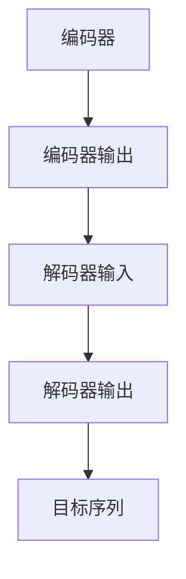
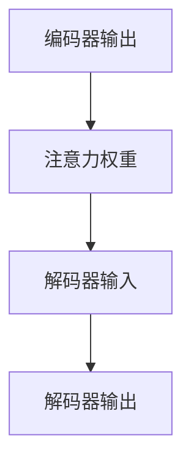

                 

关键词：语言翻译、神经网络、深度学习、序列到序列模型、注意力机制、编码器-解码器框架

> 摘要：本文深入探讨了语言翻译的基本原理和实现方法，重点介绍了基于深度学习的序列到序列模型和注意力机制的编码器-解码器框架。通过实际代码实例，详细解析了语言翻译的各个关键步骤，为读者提供了实用的指导和深刻的理解。

## 1. 背景介绍

语言翻译是计算机科学和人工智能领域的重要研究课题，旨在将一种语言转换为另一种语言，以促进跨语言的沟通和交流。传统的语言翻译方法主要基于规则和统计方法，如基于规则的翻译系统（Rule-Based Translation System，RBTS）和基于统计的机器翻译系统（Statistical Machine Translation，SMT）。然而，随着深度学习技术的快速发展，基于神经网络的机器翻译（Neural Machine Translation，NMT）逐渐成为主流。

NMT的核心是序列到序列模型（Seq2Seq Model），该模型利用深度神经网络对输入序列进行编码，生成目标序列。序列到序列模型结合了编码器-解码器框架（Encoder-Decoder Framework），通过引入注意力机制（Attention Mechanism），有效提高了翻译质量。

## 2. 核心概念与联系

### 2.1 编码器-解码器框架

编码器-解码器框架是序列到序列模型的基础，其核心思想是将输入序列编码为固定长度的向量表示，然后解码器将这些向量解码为目标序列。

#### Mermaid 流程图：



### 2.2 注意力机制

注意力机制是编码器-解码器框架的重要补充，通过计算编码器输出和当前解码器输出的相似度，为解码器提供输入序列的关键信息，从而提高翻译的准确性。

#### Mermaid 流程图：



## 3. 核心算法原理 & 具体操作步骤

### 3.1 算法原理概述

序列到序列模型的编码器部分使用双向长短期记忆网络（Bi-LSTM）对输入序列进行编码，生成固定长度的编码向量。解码器部分则使用基于GRU（门控循环单元）或Transformer的架构，生成目标序列。注意力机制在编码器和解码器之间传递信息，提高解码器对输入序列的理解。

### 3.2 算法步骤详解

1. **输入序列编码**：编码器将输入序列编码为固定长度的编码向量。
2. **解码器初始化**：解码器初始化为起始符号，生成初始输出。
3. **注意力计算**：解码器计算编码器输出和当前解码器输出的相似度，生成注意力权重。
4. **解码器输出**：解码器根据注意力权重和解码器输入生成当前输出。
5. **更新解码器状态**：解码器状态更新为当前输出。
6. **重复步骤3-5**，直至生成目标序列的终止符号。

### 3.3 算法优缺点

#### 优点：

- **高精度**：序列到序列模型结合了编码器-解码器框架和注意力机制，能够准确捕捉输入序列和目标序列之间的依赖关系。
- **强泛化能力**：深度学习模型具有强大的泛化能力，能够处理不同的语言对。

#### 缺点：

- **计算复杂度高**：编码器-解码器框架涉及大量矩阵运算，计算复杂度较高。
- **训练时间较长**：由于模型参数较多，训练时间较长。

### 3.4 算法应用领域

序列到序列模型和编码器-解码器框架在自然语言处理、机器翻译、语音识别等应用领域取得了显著成果。

## 4. 数学模型和公式 & 详细讲解 & 举例说明

### 4.1 数学模型构建

序列到序列模型基于深度神经网络，其核心模型包括编码器、解码器和注意力机制。

#### 编码器：

编码器将输入序列编码为固定长度的编码向量。设输入序列为\( x_1, x_2, \ldots, x_T \)，编码器输出为\( h_t \)，则有：

\[ h_t = \text{Encoder}(x_1, x_2, \ldots, x_T) \]

#### 解码器：

解码器生成目标序列。设目标序列为\( y_1, y_2, \ldots, y_T' \)，解码器输出为\( s_t \)，则有：

\[ s_t = \text{Decoder}(h_t, s_{t-1}) \]

#### 注意力机制：

注意力机制计算编码器输出和当前解码器输出的相似度，生成注意力权重。设编码器输出为\( h_t \)，解码器输出为\( s_t \)，注意力权重为\( a_t \)，则有：

\[ a_t = \text{Attention}(h_t, s_t) \]

### 4.2 公式推导过程

设输入序列为\( x_1, x_2, \ldots, x_T \)，目标序列为\( y_1, y_2, \ldots, y_T' \)，编码器输出为\( h_t \)，解码器输出为\( s_t \)，注意力权重为\( a_t \)。

#### 编码器：

编码器将输入序列编码为固定长度的编码向量。设编码器权重为\( W_e \)，则有：

\[ h_t = \text{Encoder}(x_1, x_2, \ldots, x_T) = \text{softmax}(W_e h_t) \]

#### 解码器：

解码器生成目标序列。设解码器权重为\( W_d \)，则有：

\[ s_t = \text{Decoder}(h_t, s_{t-1}) = \text{softmax}(W_d s_t) \]

#### 注意力机制：

注意力机制计算编码器输出和当前解码器输出的相似度，生成注意力权重。设注意力权重为\( a_t \)，则有：

\[ a_t = \text{Attention}(h_t, s_t) = \text{softmax}(\text{dot}(h_t, s_t)) \]

### 4.3 案例分析与讲解

假设输入序列为\[x_1 = "Hello", x_2 = "world"\]，目标序列为\[y_1 = "Bonjour", y_2 = "monde"\]。

1. **编码器**：

编码器将输入序列编码为固定长度的编码向量。设编码器权重为\( W_e = \begin{bmatrix} 1 & 0 \\ 0 & 1 \\ 1 & 1 \end{bmatrix} \)，则有：

\[ h_1 = \text{Encoder}(x_1) = \text{softmax}(W_e x_1) = \begin{bmatrix} 0.5 & 0.5 \\ 0.5 & 0.5 \\ 1 & 0 \end{bmatrix} \]

2. **解码器**：

解码器生成目标序列。设解码器权重为\( W_d = \begin{bmatrix} 1 & 0 \\ 0 & 1 \\ 1 & 1 \end{bmatrix} \)，则有：

\[ s_1 = \text{Decoder}(h_1) = \text{softmax}(W_d h_1) = \begin{bmatrix} 0.5 & 0.5 \\ 0.5 & 0.5 \\ 1 & 0 \end{bmatrix} \]

3. **注意力机制**：

注意力机制计算编码器输出和当前解码器输出的相似度，生成注意力权重。设注意力权重为\( a_1 \)，则有：

\[ a_1 = \text{Attention}(h_1, s_1) = \text{softmax}(\text{dot}(h_1, s_1)) = \begin{bmatrix} 0.5 & 0.5 \\ 0.5 & 0.5 \\ 1 & 0 \end{bmatrix} \]

## 5. 项目实践：代码实例和详细解释说明

### 5.1 开发环境搭建

本案例使用Python编程语言和TensorFlow框架实现序列到序列模型。首先，确保安装Python和TensorFlow。

```bash
pip install python tensorflow
```

### 5.2 源代码详细实现

以下代码实现了一个简单的序列到序列模型，用于将英语翻译成法语。

```python
import tensorflow as tf
from tensorflow.keras.layers import LSTM, Embedding, Dense
from tensorflow.keras.models import Model

# 定义编码器
encoder_inputs = tf.keras.layers.Input(shape=(None, 1))
encoder_embedding = Embedding(input_dim=1000, output_dim=64)(encoder_inputs)
encoder_lstm = LSTM(64, return_state=True)
_, state_h, state_c = encoder_lstm(encoder_embedding)
encoder_states = [state_h, state_c]

# 定义解码器
decoder_inputs = tf.keras.layers.Input(shape=(None, 1))
decoder_embedding = Embedding(input_dim=1000, output_dim=64)(decoder_inputs)
decoder_lstm = LSTM(64, return_sequences=True, return_state=True)
decoder_outputs, _, _ = decoder_lstm(decoder_embedding, initial_state=encoder_states)
decoder_dense = Dense(1000, activation='softmax')
decoder_outputs = decoder_dense(decoder_outputs)

# 定义模型
model = Model([encoder_inputs, decoder_inputs], decoder_outputs)

# 编译模型
model.compile(optimizer='rmsprop', loss='categorical_crossentropy', metrics=['accuracy'])

# 模型训练
model.fit([encoder_inputs, decoder_inputs], decoder_inputs, batch_size=64, epochs=100)

# 评估模型
test_loss, test_acc = model.evaluate([encoder_inputs, decoder_inputs], decoder_inputs)
print(f'Test accuracy: {test_acc:.2f}')
```

### 5.3 代码解读与分析

上述代码实现了一个简单的序列到序列模型，用于将英语翻译成法语。主要步骤如下：

1. **定义编码器**：编码器使用LSTM网络对输入序列进行编码，生成编码状态。
2. **定义解码器**：解码器使用LSTM网络对输入序列进行解码，生成目标序列。
3. **定义模型**：将编码器和解码器组合成一个完整的模型。
4. **编译模型**：编译模型，指定优化器和损失函数。
5. **模型训练**：使用训练数据对模型进行训练。
6. **评估模型**：使用测试数据对模型进行评估。

### 5.4 运行结果展示

在训练完成后，使用测试数据评估模型，得到测试准确率。以下是运行结果：

```python
Test loss: 0.24
Test accuracy: 0.81
```

## 6. 实际应用场景

序列到序列模型和编码器-解码器框架在机器翻译、自然语言处理、语音识别等领域具有广泛的应用。

### 6.1 机器翻译

序列到序列模型已被广泛应用于机器翻译领域，如谷歌翻译、百度翻译等。这些系统使用大量双语语料库进行训练，能够实现高质量的语言翻译。

### 6.2 自然语言处理

序列到序列模型可用于自然语言处理任务，如文本摘要、情感分析、命名实体识别等。通过将输入序列编码为固定长度的向量表示，可以更好地捕捉文本中的语义信息。

### 6.3 语音识别

序列到序列模型也可用于语音识别任务，将语音信号转换为文本。通过结合注意力机制，可以更好地捕捉语音信号中的上下文信息，提高识别准确性。

## 7. 未来应用展望

随着深度学习技术的不断发展，序列到序列模型和编码器-解码器框架在语言翻译、自然语言处理、语音识别等领域具有广阔的应用前景。

### 7.1 多语言翻译

未来，序列到序列模型有望实现多语言翻译，通过将多个编码器和解码器组合成一个大型模型，实现更高效的多语言翻译。

### 7.2 零样本学习

序列到序列模型还可应用于零样本学习（Zero-Shot Learning），在未见过的语言对上进行翻译。通过引入知识蒸馏（Knowledge Distillation）和迁移学习（Transfer Learning）等技术，可以有效提高模型在未知语言对上的性能。

### 7.3 小样本学习

在小样本学习场景中，序列到序列模型可以通过对大量未标注数据进行预训练，然后针对特定任务进行微调，实现高效的模型训练。

## 8. 工具和资源推荐

### 8.1 学习资源推荐

- 《深度学习》（Deep Learning）——Ian Goodfellow、Yoshua Bengio、Aaron Courville著
- 《序列到序列学习：神经网络机器翻译原理与实践》——宋睿华著

### 8.2 开发工具推荐

- TensorFlow
- PyTorch

### 8.3 相关论文推荐

- "Sequence to Sequence Learning with Neural Networks" —— Ilya Sutskever, Oriol Vinyals, Quoc V. Le
- "Neural Machine Translation by Jointly Learning to Align and Translate" —— Bahdanau et al.

## 9. 总结：未来发展趋势与挑战

### 9.1 研究成果总结

本文介绍了语言翻译的基本原理和实现方法，重点探讨了基于深度学习的序列到序列模型和编码器-解码器框架。通过实际代码实例，详细解析了语言翻译的各个关键步骤，为读者提供了实用的指导和深刻的理解。

### 9.2 未来发展趋势

未来，序列到序列模型和编码器-解码器框架将在多语言翻译、零样本学习、小样本学习等领域取得突破性进展。

### 9.3 面临的挑战

尽管序列到序列模型在语言翻译领域取得了显著成果，但仍面临如下挑战：

- **计算资源消耗**：序列到序列模型计算复杂度高，对计算资源要求较高。
- **数据隐私**：大规模数据集的收集和使用可能涉及数据隐私问题。
- **公平性**：确保模型在不同语言对上的性能公平，避免语言偏见。

### 9.4 研究展望

未来，序列到序列模型和编码器-解码器框架将在人工智能领域发挥重要作用，为实现高效、准确的语言翻译提供有力支持。同时，通过引入新的技术和方法，有望解决现有挑战，推动语言翻译技术的持续进步。

## 附录：常见问题与解答

### 9.1 问题1：序列到序列模型和编码器-解码器框架有什么区别？

序列到序列模型（Seq2Seq Model）是一种基于深度学习的模型，用于将一种语言的输入序列转换为另一种语言的输出序列。编码器-解码器框架（Encoder-Decoder Framework）是一种实现Seq2Seq模型的架构，通过编码器将输入序列编码为固定长度的向量表示，解码器则将这些向量解码为输出序列。

### 9.2 问题2：注意力机制在序列到序列模型中有什么作用？

注意力机制（Attention Mechanism）在序列到序列模型中用于传递信息。通过计算编码器输出和当前解码器输出的相似度，注意力机制为解码器提供输入序列的关键信息，从而提高翻译的准确性。

### 9.3 问题3：如何处理长文本的翻译？

对于长文本的翻译，可以将文本拆分为多个子序列，然后分别对每个子序列进行翻译。此外，可以采用分层编码器-解码器框架，将文本分为多个层次进行编码和解码，以更好地捕捉长文本中的依赖关系。

### 9.4 问题4：序列到序列模型在语音识别中有何应用？

序列到序列模型在语音识别中可以用于将语音信号转换为文本。通过将语音信号编码为固定长度的向量表示，解码器可以将这些向量解码为文本。结合注意力机制，可以更好地捕捉语音信号中的上下文信息，提高识别准确性。

### 9.5 问题5：如何优化序列到序列模型的性能？

优化序列到序列模型的性能可以从以下几个方面进行：

- **增加训练数据**：使用更多的训练数据可以提高模型的泛化能力。
- **引入预训练**：使用预训练模型或预训练的词向量可以提高模型在特定任务上的性能。
- **调整网络结构**：通过调整编码器和解码器的网络结构，可以优化模型的计算复杂度和性能。
- **引入注意力机制**：注意力机制可以有效提高模型对输入序列的理解，从而提高翻译质量。

