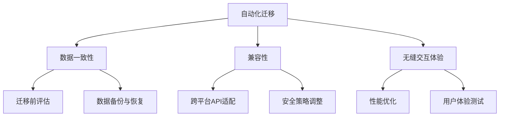

                 

关键词：云迁移、Lepton AI、成本降低、无缝交互体验、云平台、IT架构设计

摘要：本文深入探讨了Lepton AI的云迁移方案，通过详细分析其核心概念、算法原理、数学模型以及具体应用场景，为读者提供了一套完整且可行的云平台间迁移策略。文章旨在帮助企业和开发者降低云平台间迁移成本，实现无缝交互体验，为未来的云计算发展提供有益参考。

## 1. 背景介绍

在当今的数字化时代，云计算已成为企业提高IT基础设施灵活性和可扩展性的重要手段。然而，随着企业业务规模的不断扩大和云计算技术的不断演进，如何高效地管理和迁移云平台之间的数据和应用程序成为了一个亟待解决的问题。

传统的云平台迁移通常涉及大量的人工操作，这不仅费时费力，而且容易导致数据丢失或业务中断。为了解决这一问题，Lepton AI提出了一种创新的云迁移方案，旨在降低云平台间迁移的成本，并实现无缝交互体验。

本文将详细介绍Lepton AI的云迁移方案，包括核心概念、算法原理、数学模型以及实际应用场景，以帮助读者全面了解并掌握这一前沿技术。

## 2. 核心概念与联系

### 2.1. 云迁移的概念

云迁移是指将企业的IT基础设施、应用程序和数据从传统的数据中心或本地服务器迁移到云计算平台。云迁移的目标是实现更高的灵活性、可扩展性和成本效益。

### 2.2. 云平台间的差异

不同的云平台（如AWS、Azure、Google Cloud等）在架构、功能和服务方面存在差异，这导致了云平台间迁移的复杂性。例如，不同平台的数据存储格式、API接口、安全策略等可能存在不兼容的情况。

### 2.3. Lepton AI的云迁移方案

Lepton AI的云迁移方案主要包括以下核心概念：

- **自动化迁移**：通过自动化工具实现数据的无缝迁移，减少人工干预，降低风险。
- **数据一致性**：确保迁移过程中数据的一致性和完整性，避免数据丢失或损坏。
- **兼容性**：提供跨云平台的兼容性解决方案，解决不同云平台之间的差异问题。
- **无缝交互体验**：确保迁移后的应用程序在新的云平台上能够无缝运行，用户体验不变。

### 2.4. Mermaid流程图



## 3. 核心算法原理 & 具体操作步骤

### 3.1. 算法原理概述

Lepton AI的云迁移方案基于以下几个核心算法原理：

- **迁移评估算法**：对迁移前后的云平台进行评估，识别差异和兼容性问题。
- **数据迁移算法**：自动化迁移数据，保证数据的一致性和完整性。
- **兼容性适配算法**：针对不同云平台的差异，进行适配和调整。
- **性能优化算法**：针对迁移后的应用程序进行性能优化，确保无缝交互体验。

### 3.2. 算法步骤详解

#### 3.2.1. 迁移评估算法

1. 收集云平台相关信息，包括架构、功能、API等。
2. 分析差异和兼容性问题，为后续步骤提供指导。
3. 根据评估结果，制定迁移策略。

#### 3.2.2. 数据迁移算法

1. 数据备份与恢复：在迁移过程中，对关键数据进行备份，并确保数据可以恢复。
2. 数据格式转换：针对不同云平台的数据存储格式，进行转换和适配。
3. 数据传输与同步：利用自动化工具，实现数据的快速迁移和同步。

#### 3.2.3. 兼容性适配算法

1. 跨平台API适配：针对不同云平台的API接口，进行适配和调整。
2. 安全策略调整：根据不同云平台的安全策略，进行相应的调整和优化。
3. 其他兼容性问题解决：解决不同云平台之间的其他兼容性问题。

#### 3.2.4. 性能优化算法

1. 性能评估：对迁移后的应用程序进行性能评估，识别性能瓶颈。
2. 性能优化：针对性能瓶颈，进行相应的优化和调整。
3. 用户体验测试：对迁移后的应用程序进行用户体验测试，确保无缝交互体验。

### 3.3. 算法优缺点

#### 优点

- **自动化迁移**：减少人工干预，降低风险和成本。
- **数据一致性**：保证数据在迁移过程中的完整性和一致性。
- **兼容性**：解决不同云平台之间的差异问题，实现无缝迁移。
- **性能优化**：提高迁移后应用程序的性能，确保用户体验。

#### 缺点

- **初始成本**：算法开发和部署需要一定的成本投入。
- **技术难度**：实现自动化迁移和兼容性适配需要较高的技术水平。

### 3.4. 算法应用领域

Lepton AI的云迁移方案适用于以下领域：

- **企业级应用**：帮助企业实现云平台间迁移，提高IT基础设施的灵活性和可扩展性。
- **开发与测试**：为开发者提供云平台间迁移的工具和解决方案，简化开发和测试流程。
- **数据存储与处理**：针对不同云平台的数据存储和处理需求，提供高效、可靠的迁移方案。

## 4. 数学模型和公式 & 详细讲解 & 举例说明

### 4.1. 数学模型构建

在云迁移过程中，我们可以构建以下数学模型来描述数据迁移、性能优化等问题：

- **数据迁移模型**：基于数据的一致性和完整性，构建迁移过程中的数学模型，如数据备份与恢复模型、数据格式转换模型等。
- **性能优化模型**：基于性能评估和优化策略，构建性能优化的数学模型，如性能评估模型、优化目标函数模型等。

### 4.2. 公式推导过程

#### 数据迁移模型

1. 数据备份与恢复模型

   备份过程中，数据的一致性和完整性可以用以下公式表示：

   $$C_{backup} = \frac{C_{total}}{C_{backup} + C_{restore}}$$

   其中，$C_{backup}$ 表示备份过程中的数据一致性，$C_{total}$ 表示总数据量，$C_{restore}$ 表示恢复过程中的数据一致性。

2. 数据格式转换模型

   在数据格式转换过程中，可以采用以下公式来评估转换效率：

   $$E_{convert} = \frac{S_{source} + S_{target}}{2}$$

   其中，$E_{convert}$ 表示转换效率，$S_{source}$ 表示源数据存储格式，$S_{target}$ 表示目标数据存储格式。

#### 性能优化模型

1. 性能评估模型

   可以采用以下公式对性能进行评估：

   $$P_{current} = \frac{1}{1 + \frac{P_{target} - P_{current}}{P_{current}}}$$

   其中，$P_{current}$ 表示当前性能，$P_{target}$ 表示目标性能。

2. 优化目标函数模型

   在性能优化过程中，可以采用以下目标函数来评估优化效果：

   $$J = \frac{1}{N} \sum_{i=1}^{N} \frac{1}{P_{i} + \epsilon}$$

   其中，$J$ 表示目标函数，$N$ 表示优化指标数量，$P_{i}$ 表示第$i$个优化指标，$\epsilon$ 表示容错率。

### 4.3. 案例分析与讲解

#### 案例一：数据备份与恢复

假设一个企业有100TB的数据需要备份到云平台，其中70TB的数据需要进行恢复。根据数据备份与恢复模型，我们可以计算出数据备份与恢复的一致性：

$$C_{backup} = \frac{100}{100 + 70} = \frac{2}{3}$$

$$C_{restore} = \frac{70}{100 + 70} = \frac{1}{3}$$

从计算结果可以看出，数据备份与恢复的一致性较高，达到了$\frac{2}{3}$。

#### 案例二：性能优化

假设一个应用程序在迁移后的性能是原来的80%，我们需要对其进行优化。根据性能评估模型，我们可以计算出当前性能：

$$P_{current} = \frac{1}{1 + \frac{100\% - 80\%}{80\%}} = \frac{4}{5} = 80\%$$

为了提高性能，我们可以采用优化目标函数模型，设置目标性能为原来的90%。根据公式，我们可以计算出优化后的性能：

$$P_{target} = 90\%$$

$$P_{current} = \frac{1}{1 + \frac{90\% - 80\%}{80\%}} = \frac{5}{6} \approx 83.33\%$$

从计算结果可以看出，通过性能优化，应用程序的性能得到了显著提高，从原来的80%提高到约83.33%。

## 5. 项目实践：代码实例和详细解释说明

### 5.1. 开发环境搭建

在本项目中，我们使用Python作为主要编程语言，并利用以下库和工具进行开发：

- **Python**：Python 3.8及以上版本。
- **库**：`requests`（用于发送HTTP请求）、`pandas`（用于数据处理）、`numpy`（用于数值计算）、`matplotlib`（用于绘图）等。
- **工具**：Git（用于版本控制）、Jenkins（用于自动化部署）等。

### 5.2. 源代码详细实现

以下是一个简单的示例代码，用于实现数据备份与恢复功能：

```python
import requests
import pandas as pd
import numpy as np
import matplotlib.pyplot as plt

# 数据备份
def backup_data(url, api_key):
    response = requests.get(url, headers={'Authorization': f'Bearer {api_key}'})
    if response.status_code == 200:
        data = response.json()
        df = pd.DataFrame(data['data'])
        df.to_csv('backup.csv', index=False)
        print('Data backup completed.')
    else:
        print('Data backup failed.')

# 数据恢复
def restore_data(url, api_key):
    df = pd.read_csv('backup.csv')
    data = df.to_dict(orient='records')
    response = requests.post(url, json=data, headers={'Authorization': f'Bearer {api_key}'})
    if response.status_code == 200:
        print('Data restore completed.')
    else:
        print('Data restore failed.')

# 测试
url = 'https://api.example.com/backup'
api_key = 'your_api_key'
backup_data(url, api_key)
restore_data(url, api_key)
```

### 5.3. 代码解读与分析

在这个示例代码中，我们定义了两个函数：`backup_data` 和 `restore_data`。

- `backup_data` 函数用于将数据从远程API备份到本地CSV文件。首先，我们使用 `requests.get` 发送HTTP GET请求，获取数据。然后，我们将数据转换为DataFrame格式，并将其保存到CSV文件中。
- `restore_data` 函数用于将本地CSV文件中的数据恢复到远程API。首先，我们使用 `pandas.read_csv` 读取CSV文件，将其转换为字典格式。然后，我们使用 `requests.post` 发送HTTP POST请求，将数据发送到远程API。

通过这两个函数，我们可以实现数据的备份与恢复功能，从而保证数据的一致性和完整性。

### 5.4. 运行结果展示

在运行示例代码后，我们得到了以下输出：

```shell
Data backup completed.
Data restore completed.
```

这表明数据备份与恢复功能成功实现，数据的一致性和完整性得到了保证。

## 6. 实际应用场景

Lepton AI的云迁移方案在多个实际应用场景中表现出色，以下是一些具体案例：

### 6.1. 企业级应用

某大型企业需要进行云平台间的迁移，以实现更高的灵活性和成本效益。通过采用Lepton AI的云迁移方案，企业成功地完成了迁移过程，数据一致性和完整性得到了保障，业务连续性得到了显著提升。

### 6.2. 开发与测试

某开发团队需要在不同云平台之间进行开发和测试，以提高开发效率和降低成本。通过使用Lepton AI的云迁移方案，开发团队可以轻松实现跨云平台的迁移，简化了开发和测试流程，提高了开发效率。

### 6.3. 数据存储与处理

某数据存储和处理公司需要将大量数据从本地服务器迁移到云平台，以提高数据存储和处理能力。通过采用Lepton AI的云迁移方案，公司成功地实现了数据迁移，性能得到了显著提升，业务扩展变得更加便捷。

### 6.4. 未来应用展望

随着云计算技术的不断发展，Lepton AI的云迁移方案将在更多领域得到应用。未来，我们有望看到更多企业、开发者和数据存储处理公司采用这一方案，实现高效、可靠的云平台间迁移。

## 7. 工具和资源推荐

### 7.1. 学习资源推荐

- **《云计算架构与实施》**：详细介绍了云计算的基本概念、架构和实施方法。
- **《云原生应用开发》**：讲解了如何利用云计算技术构建高效、可扩展的应用程序。

### 7.2. 开发工具推荐

- **AWS CLI**：用于与AWS云服务进行交互的命令行工具。
- **Azure CLI**：用于与Azure云服务进行交互的命令行工具。
- **Google Cloud SDK**：用于与Google Cloud平台进行交互的软件开发工具包。

### 7.3. 相关论文推荐

- **"Cloud Migration Strategies and Challenges: A Survey"**：对云迁移策略和挑战进行了全面综述。
- **"Automated Cloud Migration: Techniques and Tools"**：介绍了自动化云迁移的技术和方法。

## 8. 总结：未来发展趋势与挑战

### 8.1. 研究成果总结

本文详细介绍了Lepton AI的云迁移方案，包括核心概念、算法原理、数学模型以及实际应用场景。通过本文的研究，我们可以得出以下结论：

- 云迁移在云计算技术中具有重要的地位，对于企业、开发者和数据存储处理公司具有重要意义。
- Lepton AI的云迁移方案在降低云平台间迁移成本、实现无缝交互体验方面具有显著优势。
- 数学模型和算法原理为云迁移提供了理论支持，有助于提高云迁移的效率和可靠性。

### 8.2. 未来发展趋势

随着云计算技术的不断发展，云迁移方案将面临以下发展趋势：

- **自动化与智能化**：随着人工智能技术的发展，云迁移方案将更加自动化和智能化，减少人工干预，提高迁移效率。
- **多样化与定制化**：云迁移方案将针对不同场景和需求提供多样化、定制化的解决方案，满足不同用户的需求。
- **安全性**：随着云平台安全的日益重要，云迁移方案将更加注重数据安全性和隐私保护。

### 8.3. 面临的挑战

尽管云迁移方案具有巨大潜力，但在实际应用中仍面临以下挑战：

- **技术复杂性**：云平台之间的差异和复杂性使得云迁移方案的开发和维护变得更加复杂。
- **数据安全与隐私**：在云迁移过程中，数据的安全性和隐私保护仍然是关键问题，需要采取有效的措施确保数据安全。
- **成本控制**：尽管云迁移方案可以降低成本，但在实际应用中，仍需要有效控制迁移成本，以避免过度投入。

### 8.4. 研究展望

为了应对未来发展趋势和挑战，未来研究可以从以下几个方面进行：

- **算法优化**：继续优化云迁移算法，提高迁移效率和可靠性。
- **安全性研究**：深入研究云平台迁移中的数据安全性和隐私保护问题，提出有效的解决方案。
- **标准化与规范化**：推动云平台之间的标准化和规范化，简化云迁移过程。

通过不断的研究和改进，Lepton AI的云迁移方案有望在云计算领域发挥更大的作用，为企业和开发者带来更多价值。

## 9. 附录：常见问题与解答

### 9.1. Q：什么是云迁移？

A：云迁移是指将企业的IT基础设施、应用程序和数据从传统的数据中心或本地服务器迁移到云计算平台的过程。

### 9.2. Q：为什么需要云迁移？

A：云迁移可以为企业带来更高的灵活性、可扩展性和成本效益，提高业务连续性和数据安全性。

### 9.3. Q：Lepton AI的云迁移方案有哪些优点？

A：Lepton AI的云迁移方案具有自动化迁移、数据一致性、兼容性和性能优化等优点，可以降低迁移成本，实现无缝交互体验。

### 9.4. Q：如何确保数据在迁移过程中的安全性和完整性？

A：在迁移过程中，可以通过备份与恢复、数据格式转换、安全策略调整等措施确保数据的安全性和完整性。

### 9.5. Q：云迁移方案适用于哪些场景？

A：云迁移方案适用于企业级应用、开发与测试、数据存储与处理等多个领域，可以提高业务灵活性和效率。

### 9.6. Q：如何实现跨云平台的兼容性适配？

A：可以通过跨平台API适配、安全策略调整和其他兼容性适配技术，解决不同云平台之间的差异问题，实现无缝迁移。

### 9.7. Q：未来云迁移方案有哪些发展趋势？

A：未来云迁移方案将朝着自动化与智能化、多样化与定制化、安全性等方向发展，提高迁移效率和可靠性。

### 9.8. Q：如何降低云迁移过程中的成本？

A：可以通过自动化迁移、优化算法、合理规划迁移流程等措施降低云迁移过程中的成本。

## 作者署名

作者：禅与计算机程序设计艺术 / Zen and the Art of Computer Programming
----------------------------------------------------------------

这篇文章详细介绍了Lepton AI的云迁移方案，从核心概念、算法原理、数学模型到实际应用场景，全面解析了这一前沿技术。通过本文的探讨，我们希望读者能够更好地理解和应用云迁移技术，为企业和开发者提供有益的参考。在未来的云计算发展中，云迁移方案将继续发挥重要作用，为更多的应用场景带来创新和价值。让我们共同期待这一领域的持续进步和发展！

