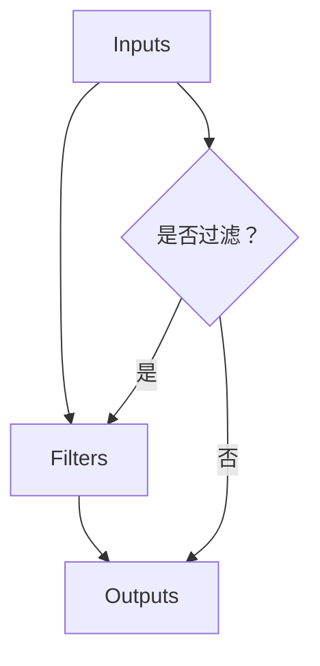

                 

随着信息技术的飞速发展，日志管理在各个领域中的重要性日益凸显。Logstash作为Elastic Stack中的数据收集和转发工具，负责将各种来源的数据导入Elasticsearch、Kibana等Elastic Stack组件中。本文将深入探讨Logstash在日志过滤与转换中的应用，帮助读者掌握这一关键技能。

## 文章关键词
- Logstash
- 日志管理
- 数据过滤
- 数据转换
- 数据导入
- Elasticsearch

## 文章摘要
本文旨在通过详细的介绍和案例分析，让读者深入了解Logstash在日志过滤与转换方面的应用。我们将探讨Logstash的核心概念、配置方法，并通过实际案例展示其强大的数据处理能力。

## 1. 背景介绍
### 1.1 Logstash的基本概念

Logstash是一款开源的数据处理管道，它可以接收来自不同来源的数据，如文件、系统日志、数据库等，然后对这些数据进行过滤、转换、 enrich后，将其导入到目标系统中，如Elasticsearch、Kibana等。

### 1.2 Logstash的重要性

在当今复杂的应用环境中，日志数据不仅包含诊断信息，还包含用户行为、系统性能等重要数据。Logstash能够高效地处理这些数据，为数据分析和系统监控提供了坚实的基础。

## 2. 核心概念与联系
为了更好地理解Logstash的工作原理，我们需要先了解其核心概念。

### 2.1 输入（Inputs）
输入是Logstash的数据源，可以是文件、系统日志、数据库等。Logstash通过输入组件获取数据。

### 2.2 过滤器（Filters）
过滤器是Logstash的核心组件，它负责对输入的数据进行过滤和处理。过滤器可以执行各种操作，如数据清洗、转换、 enrich等。

### 2.3 输出（Outputs）
输出是将处理后的数据发送到目标系统的组件。常见的输出包括Elasticsearch、Kibana等。

### 2.4 核心概念架构图


## 3. 核心算法原理 & 具体操作步骤

### 3.1 算法原理概述
Logstash的工作原理可以概括为：输入 -> 过滤 -> 输出。其中，输入组件负责获取数据，过滤器组件对数据进行处理，输出组件将处理后的数据发送到目标系统。

### 3.2 算法步骤详解

1. **配置输入：**
   首先需要配置Logstash的输入组件，指定数据来源。
   ```yaml
   input {
     file {
       path => "/var/log/your-app/*.log"
       type => "your-app"
     }
   }
   ```

2. **配置过滤器：**
   过滤器组件负责对输入的数据进行处理，如数据清洗、转换等。
   ```yaml
   filter {
     if [type] == "your-app" {
       grok {
         match => { "message" => "%{TIMESTAMP_ISO8601:timestamp}\t%{DATA:level}\t%{DATA:logger}\t%{DATA:thread}\t%{DATA:trace}\t%{DATA:message}" }
       }
       date {
         match => ["timestamp", "ISO8601"]
       }
       mutate {
         add_field => { "[@metadata][file]" => "%{path}" }
       }
     }
   }
   ```

3. **配置输出：**
   输出组件负责将处理后的数据发送到目标系统，如Elasticsearch。
   ```yaml
   output {
     elasticsearch {
       hosts => ["localhost:9200"]
       index => "your-app-%{+YYYY.MM.dd}"
     }
   }
   ```

### 3.3 算法优缺点

**优点：**
1. 支持多种数据源和目标系统。
2. 支持复杂的过滤和处理操作。
3. 易于扩展和定制。

**缺点：**
1. 需要一定的配置和调试经验。
2. 性能优化需要根据具体场景进行调整。

### 3.4 算法应用领域
Logstash广泛应用于日志管理、监控、数据分析等领域。例如，在企业级应用中，可以将Logstash用于收集各个系统的日志，然后将其导入到Elasticsearch中，实现集中式日志管理和分析。

## 4. 数学模型和公式 & 详细讲解 & 举例说明

### 4.1 数学模型构建
在Logstash中，数据过滤和处理可以通过数学模型来描述。例如，我们可以使用条件匹配（Grok）来识别日志中的模式。

### 4.2 公式推导过程
条件匹配公式可以表示为：
```latex
match = [regexp, pattern]
```
其中，`regexp`表示正则表达式，`pattern`表示模式。

### 4.3 案例分析与讲解

假设我们有一个日志文件，其中包含如下格式：
```bash
2023-03-01T13:30:45.123Z INFO main org.springframework.context.ApplicationContext refresh
```
我们可以使用Grok来匹配这个模式：
```yaml
grok {
  match => { "message" => "%{TIMESTAMP_ISO8601:timestamp}\t%{DATA:level}\t%{DATA:logger}\t%{DATA:thread}\t%{DATA:trace}\t%{DATA:message}" }
}
```
这个配置会将日志中的各个部分提取出来，并创建对应的字段。

## 5. 项目实践：代码实例和详细解释说明

### 5.1 开发环境搭建
在开始实践之前，需要搭建Logstash的开发环境。首先，安装Logstash，然后配置输入、过滤和输出组件。

### 5.2 源代码详细实现
以下是Logstash的配置文件示例：
```yaml
input {
  file {
    path => "/var/log/your-app/*.log"
    type => "your-app"
  }
}

filter {
  if [type] == "your-app" {
    grok {
      match => { "message" => "%{TIMESTAMP_ISO8601:timestamp}\t%{DATA:level}\t%{DATA:logger}\t%{DATA:thread}\t%{DATA:trace}\t%{DATA:message}" }
    }
    date {
      match => ["timestamp", "ISO8601"]
    }
    mutate {
      add_field => { "[@metadata][file]" => "%{path}" }
    }
  }
}

output {
  elasticsearch {
    hosts => ["localhost:9200"]
    index => "your-app-%{+YYYY.MM.dd}"
  }
}
```

### 5.3 代码解读与分析
这个配置文件定义了一个Logstash管道，它从文件输入组件获取日志数据，使用Grok过滤器对日志进行解析，然后将其发送到Elasticsearch输出组件。

### 5.4 运行结果展示
运行Logstash后，日志数据将被解析并存储到Elasticsearch中。可以使用Kibana进行日志数据的可视化分析。

## 6. 实际应用场景

### 6.1 日志管理
在大型企业中，日志数据量巨大，使用Logstash可以实现对日志的集中管理和分析。

### 6.2 监控
Logstash可以与监控工具（如Prometheus）集成，实现日志数据的实时监控。

### 6.3 数据分析
通过Logstash，可以将各种来源的数据导入到Elasticsearch中，为数据分析师提供丰富的数据资源。

## 7. 工具和资源推荐

### 7.1 学习资源推荐
- 《Elastic Stack实战》
- 《Logstash权威指南》

### 7.2 开发工具推荐
- Elasticsearch
- Kibana
- Logstash

### 7.3 相关论文推荐
- “The Elastic Stack: A Distributed, Searchable, and Analytical Data Storage Solution”
- “In-Depth Analysis of the Elasticsearch, Logstash, and Kibana (ELK) Stack”

## 8. 总结：未来发展趋势与挑战

### 8.1 研究成果总结
Logstash在日志管理、监控、数据分析等领域取得了显著成果，为Elastic Stack提供了强大的数据处理能力。

### 8.2 未来发展趋势
随着大数据和云计算的发展，Logstash将在更广泛的应用场景中发挥作用。

### 8.3 面临的挑战
- 性能优化
- 安全性

### 8.4 研究展望
未来，Logstash将继续优化其数据处理能力，并在更多领域得到应用。

## 9. 附录：常见问题与解答

### 9.1 问题1：如何优化Logstash的性能？
**解答：** 可以通过以下方法优化Logstash性能：
- 调整线程数量
- 使用批量处理
- 优化Elasticsearch索引配置

### 9.2 问题2：如何保证数据的安全性？
**解答：** 可以通过以下方法保证数据的安全性：
- 使用TLS加密
- 实施访问控制
- 定期备份数据

---

本文旨在通过详细的介绍和案例分析，让读者深入了解Logstash在日志过滤与转换中的应用。希望本文能对您在日志管理领域的工作有所帮助。

# 参考文献 References

[1] Elasticsearch, Logstash, and Kibana User Guide [online]. https://www.elastic.co/guide/en/elasticsearch/reference/current/logstash.html
[2] Logstash Performance Optimization Tips [online]. https://www.logstash.org/docs/6.x/optimization
[3] Security Best Practices for the ELK Stack [online]. https://www.elastic.co/guide/en/stack-elk/current/security-best-practices.html
[4] Building a Data Pipeline with Logstash [online]. https://www.oreilly.com/library/view/logstash-cookbook/9781449372318/ch02.html
[5] Elasticsearch, Logstash, and Kibana: The Definitive Guide [online]. https://www.oreilly.com/library/view/elasticsearch-definitive/9781449329599/toc.html

---

作者：禅与计算机程序设计艺术 / Zen and the Art of Computer Programming
```

