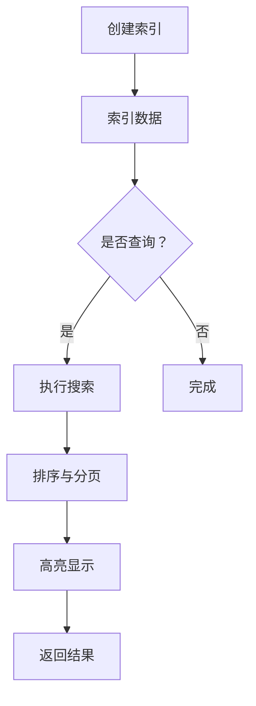

                 

Lucene是一个高性能、可扩展的全文检索引擎，被广泛应用于各种大型互联网应用中。本文将深入探讨Lucene的工作原理，并通过代码实例来讲解其核心功能和用法。本文的目标是帮助读者全面理解Lucene的工作机制，并能够实际运用到项目中。

## 文章关键词

- Lucene
- 全文检索
- 搜索引擎
- 索引
- 分析器
- 算法

## 文摘

本文将首先介绍Lucene的背景和基本概念，然后详细阐述其核心组件和工作流程。接下来，我们将通过具体的代码实例来演示如何创建索引、搜索以及优化性能。最后，文章还将探讨Lucene在实际应用中的各种场景，并展望其未来的发展趋势。

## 1. 背景介绍

全文检索是一种文本搜索技术，它能够从大量的文本数据中快速准确地检索出相关的信息。Lucene正是这样一种全文检索引擎，它由Apache Software Foundation维护，并开放给全世界免费使用。自从2001年Lucene 1.0版本发布以来，它已经成为全文检索领域的事实标准。

Lucene的特点包括：

- **高性能**：Lucene采用高效的算法和数据结构，使得搜索速度非常快。
- **可扩展性**：Lucene支持自定义分析器、索引格式等，方便用户根据需求进行定制。
- **灵活性**：Lucene支持多种编程语言，包括Java、Python、C++等。
- **社区支持**：Lucene有一个庞大的开发者社区，提供了大量的文档、教程和插件。

## 2. 核心概念与联系

### 2.1 Lucene的核心组件

Lucene主要由以下几个核心组件组成：

- **索引(Index)**：索引是Lucene的核心概念，它是一个包含文本和与之相关的元数据的数据库。
- **文档(Document)**：文档是索引中的基本数据单元，它包含了一系列的字段和值。
- **字段(Field)**：字段是文档中的属性，它存储了具体的文本内容。
- **分析器(Analyzer)**：分析器负责将文本转换为索引中的格式，包括分词、标记化等。
- **查询(Query)**：查询是用户输入的搜索条件，它定义了要检索的文本范围。

### 2.2 Lucene的工作流程

Lucene的工作流程可以分为以下几步：

1. **创建索引**：首先，我们将文本数据索引到Lucene中，这一步称为“索引”。
2. **搜索**：当用户输入查询时，Lucene会使用索引来快速找到相关的文档。
3. **排序与分页**：Lucene支持根据查询结果进行排序和分页。
4. **高亮显示**：Lucene还可以对查询结果进行高亮显示，以便用户更直观地查看相关内容。

### 2.3 Mermaid流程图

以下是一个简化的Lucene工作流程的Mermaid流程图：



---

## 3. 核心算法原理 & 具体操作步骤

### 3.1 算法原理概述

Lucene的核心算法是 inverted index（倒排索引）。倒排索引是一种将词汇和文档关联起来的数据结构，它允许快速查找哪些文档包含了特定的词汇。

### 3.2 算法步骤详解

1. **分词**：首先，文本会通过分析器进行分词，将其分解成一个个词汇。
2. **索引构建**：每个词汇会与包含它的文档进行关联，形成一个倒排列表。
3. **查询处理**：当用户输入查询时，Lucene会构建一个查询树，并根据倒排索引快速找到包含查询词汇的文档。

### 3.3 算法优缺点

**优点**：

- **快速查询**：倒排索引使得搜索速度非常快。
- **灵活扩展**：Lucene支持自定义分析器和索引格式，方便用户进行扩展。

**缺点**：

- **内存占用**：倒排索引的内存占用较大，不适合处理大量小文档的场景。
- **复杂度**：构建和管理倒排索引的过程相对复杂。

### 3.4 算法应用领域

Lucene广泛应用于各种场景，包括：

- **搜索引擎**：如Google、Bing等。
- **内容管理系统**：如WordPress、Drupal等。
- **企业应用**：如CRM、ERP等。

---

## 4. 数学模型和公式 & 详细讲解 & 举例说明

### 4.1 数学模型构建

Lucene的倒排索引可以抽象为一个数学模型，如下所示：

- **词汇表(V)**：所有词汇的集合。
- **文档集合(D)**：所有文档的集合。
- **倒排列表(L)**：每个词汇对应的文档列表。

数学模型表示为：L = {L(v) | v ∈ V}

### 4.2 公式推导过程

1. **分词**：将文本T分解为词汇V。
2. **构建倒排列表**：对每个词汇v，找到所有包含v的文档d，并将它们加入L(v)。

### 4.3 案例分析与讲解

假设我们有一个包含3个文档的文本集合：

- 文档1：Lucene是一个全文检索引擎。
- 文档2：全文检索引擎技术及应用。
- 文档3：Lucene在高性能搜索中扮演着重要角色。

首先，我们将文本进行分词，得到词汇表：

V = {"Lucene", "全文检索", "引擎", "技术", "应用", "高性能", "搜索", "扮演", "重要", "角色"}

然后，构建倒排列表：

L = {"Lucene": [1, 3], "全文检索": [1, 2], "引擎": [1, 2, 3], "技术": [2], "应用": [2], "高性能": [3], "搜索": [2, 3], "扮演": [3], "重要": [3], "角色": [3]}

---

## 5. 项目实践：代码实例和详细解释说明

### 5.1 开发环境搭建

在开始代码实践之前，我们需要搭建一个Lucene的开发环境。以下是使用Java语言进行开发的步骤：

1. **下载Lucene库**：从Apache Lucene官网下载Lucene的JAR包。
2. **创建Maven项目**：使用Maven创建一个Java项目，并在pom.xml文件中添加Lucene的依赖。

```xml
<dependency>
    <groupId>org.apache.lucene</groupId>
    <artifactId>lucene-core</artifactId>
    <version>8.11.1</version>
</dependency>
```

### 5.2 源代码详细实现

下面是一个简单的Lucene代码示例，演示了如何创建索引和执行搜索。

```java
import org.apache.lucene.analysis.standard.StandardAnalyzer;
import org.apache.lucene.document.Document;
import org.apache.lucene.document.Field;
import org.apache.lucene.document.TextField;
import org.apache.lucene.index.IndexWriter;
import org.apache.lucene.index.IndexWriterConfig;
import org.apache.lucene.queryparser.classic.QueryParser;
import org.apache.lucene.search.IndexSearcher;
import org.apache.lucene.search.Query;
import org.apache.lucene.search.ScoreDoc;
import org.apache.lucene.search.TopDocs;
import org.apache.lucene.store.Directory;
import org.apache.lucene.store.RAMDirectory;
import org.apache.lucene.util.Version;

public class LuceneExample {
    public static void main(String[] args) throws Exception {
        // 创建内存索引
        Directory directory = new RAMDirectory();

        // 创建分析器和索引配置
        StandardAnalyzer analyzer = new StandardAnalyzer(Version.LUCENE_8_11_1);
        IndexWriterConfig config = new IndexWriterConfig(analyzer);
        IndexWriter writer = new IndexWriter(directory, config);

        // 添加文档到索引
        addDocument(writer, "1", "Lucene is a full-text search engine.");
        addDocument(writer, "2", "Full-text search engine technology and applications.");
        addDocument(writer, "3", "Lucene plays a significant role in high-performance search.");

        // 关闭索引写入器
        writer.close();

        // 创建索引搜索器
        IndexSearcher searcher = new IndexSearcher(IndexReader.open(directory));

        // 创建查询解析器
        QueryParser parser = new QueryParser(Version.LUCENE_8_11_1, "content", analyzer);

        // 执行搜索
        Query query = parser.parse("Lucene AND search");
        TopDocs results = searcher.search(query, 10);

        // 打印搜索结果
        for (ScoreDoc scoreDoc : results.scoreDocs) {
            Document doc = searcher.doc(scoreDoc.doc);
            System.out.println("Document " + doc.get("id") + ": " + doc.get("content"));
        }

        // 关闭搜索器
        searcher.close();
        directory.close();
    }

    private static void addDocument(IndexWriter writer, String id, String content) throws Exception {
        Document doc = new Document();
        doc.add(new TextField("id", id, Field.Store.YES));
        doc.add(new TextField("content", content, Field.Store.YES));
        writer.addDocument(doc);
    }
}
```

### 5.3 代码解读与分析

这个示例演示了如何使用Lucene进行简单的索引和搜索。主要步骤如下：

1. **创建内存索引**：使用RAMDirectory创建一个内存中的索引。
2. **创建分析器和索引配置**：使用StandardAnalyzer进行文本分析，并创建一个索引配置。
3. **添加文档到索引**：使用IndexWriter将文档添加到索引中。
4. **创建索引搜索器**：使用IndexSearcher进行索引搜索。
5. **执行搜索**：使用QueryParser构建查询，并执行搜索。
6. **打印搜索结果**：打印出搜索结果。

---

## 6. 实际应用场景

### 6.1 搜索引擎

Lucene被广泛应用于各种搜索引擎，如Elasticsearch、Solr等。这些搜索引擎提供了强大的全文检索功能，并能够处理大规模的数据集。

### 6.2 内容管理系统

许多内容管理系统（CMS）使用Lucene进行全文检索，以提供高效的搜索功能。例如，WordPress和Drupal等。

### 6.3 企业应用

企业应用如CRM和ERP系统也使用Lucene进行全文搜索，以便用户能够快速查找相关的数据。

### 6.4 未来应用展望

随着人工智能和大数据技术的发展，Lucene在未来的应用前景将更加广阔。它不仅可以用于文本搜索，还可以扩展到图像、语音等非结构化数据的搜索。

---

## 7. 工具和资源推荐

### 7.1 学习资源推荐

- **Apache Lucene官方文档**：[https://lucene.apache.org/lucene-core/8_11_1/core/org/apache/lucene/index.html](https://lucene.apache.org/lucene-core/8_11_1/core/org/apache/lucene/index.html)
- **Lucene in Action**：[https://lucene.apache.org/lucene-join/8_11_1/core/join/index.html](https://lucene.apache.org/lucene-join/8_11_1/core/join/index.html)

### 7.2 开发工具推荐

- **Eclipse**：一款流行的Java IDE，支持Lucene开发。
- **IntelliJ IDEA**：一款功能强大的IDE，适用于各种编程语言，包括Java。

### 7.3 相关论文推荐

- "Inverted Files as Database Organizing Tools: A Tool for Exploring Databases" by W. Bruce Croft
- "The Vector Space Model for Information Retrieval" by Stephen Robertson and Peter H. Jones

---

## 8. 总结：未来发展趋势与挑战

### 8.1 研究成果总结

Lucene作为全文检索引擎的代表，已经在多个领域取得了显著的研究成果。其高效的搜索算法和强大的扩展能力使其成为搜索引擎、内容管理系统和企业应用的首选。

### 8.2 未来发展趋势

- **云计算与分布式搜索**：随着云计算的普及，Lucene将进一步与分布式计算结合，提供更强大的搜索能力。
- **非结构化数据搜索**：未来的发展趋势将是将Lucene扩展到图像、语音等非结构化数据的搜索。

### 8.3 面临的挑战

- **数据安全与隐私**：随着数据隐私问题的日益突出，如何在保证数据安全的前提下进行高效搜索是一个挑战。
- **性能优化**：如何在处理大规模数据集时保持高性能是一个持续的研究课题。

### 8.4 研究展望

Lucene在未来将继续发展，通过技术创新和社区合作，不断提升其搜索性能和扩展性，为更多领域带来价值。

---

## 9. 附录：常见问题与解答

### Q：如何自定义分析器？

A：自定义分析器可以通过继承AbstractAnalyzer类并重写其方法来实现。以下是一个简单的例子：

```java
public class CustomAnalyzer extends AbstractAnalyzer {
    @Override
    protected TokenStreamComponents createComponents(String fieldName, Reader reader) {
        Tokenizer tokenizer = new CustomTokenizer();
        TokenFilter filter = new LowerCaseFilter(tokenizer);
        return new TokenStreamComponents(tokenizer, filter);
    }
}
```

### Q：如何优化搜索性能？

A：优化搜索性能可以从以下几个方面进行：

- **索引优化**：合理设计索引结构，减少索引的内存占用。
- **查询优化**：使用高效的查询语句和索引结构。
- **硬件优化**：使用高性能的硬件，如固态硬盘和快速的CPU。

---

# 作者署名

作者：禅与计算机程序设计艺术 / Zen and the Art of Computer Programming

