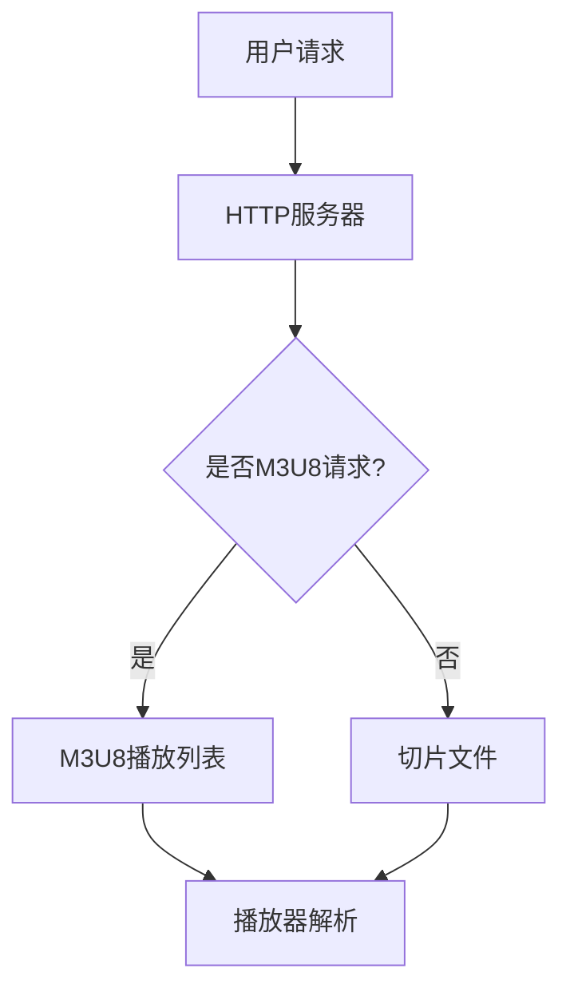
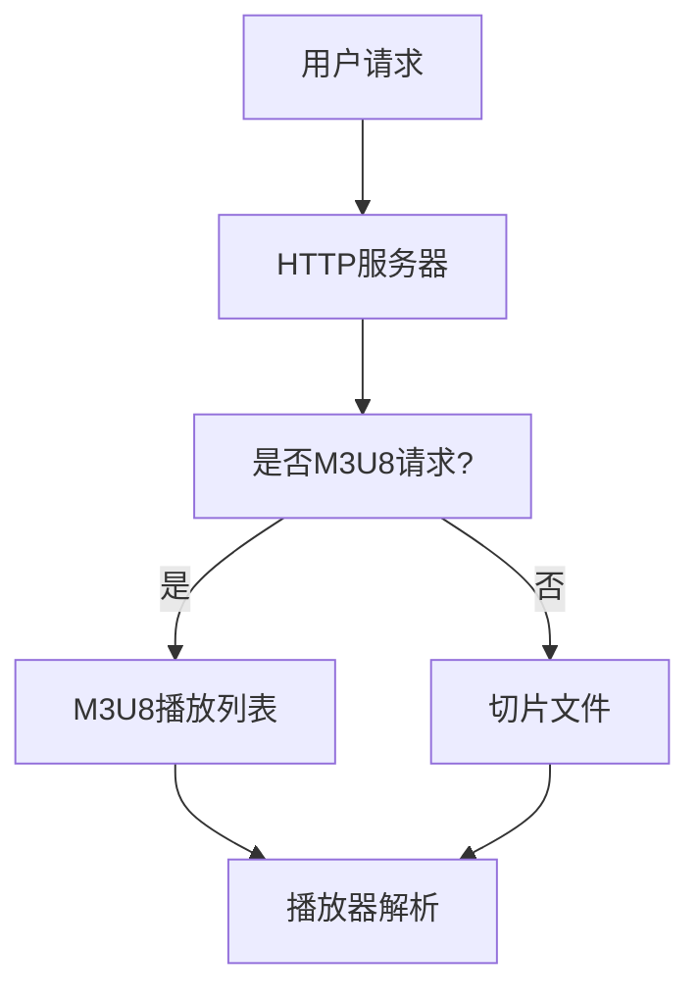

                 

关键词：M3U8、HLS、分段视频传输、流媒体技术、HTTP动态流

摘要：本文将深入探讨M3U8和HLS技术，这两者是目前广泛使用的分段视频传输协议。我们将介绍其基本概念、工作原理、技术架构，并分析它们在实际应用中的优点和挑战。

## 1. 背景介绍

随着互联网的普及和多媒体内容的爆炸式增长，流媒体技术已经成为现代网络通信的重要组成部分。在流媒体传输中，视频内容的分发是一个关键环节。为了适应不同网络环境和用户需求，流媒体技术逐渐从传统的单一定制格式转向基于分段和自适应的技术。M3U8和HLS（HTTP Live Streaming）正是这种趋势下的产物。

M3U8是一种用于描述多媒体文件播放列表的文本格式，它可以指定多个音视频文件的播放顺序。而HLS则是一种基于HTTP的流媒体传输协议，它利用M3U8播放列表来管理视频流的分段，从而实现流媒体内容的传输和播放。

## 2. 核心概念与联系

### 2.1. M3U8播放列表

M3U8播放列表是一种简单的文本文件，它包含了一系列多媒体文件的路径和名称。每个文件路径指向一个音视频文件，而文件名称通常包含了时间戳和其他元数据。M3U8播放列表的主要作用是告诉播放器如何按顺序播放这些文件。

### 2.2. HLS技术架构

HLS技术架构包括以下几个关键组件：

- **切片（Segments）**：视频文件被切分成一系列长度固定的小文件，这些小文件通常以ts为扩展名。每个切片都包含了视频数据的一个片段。

- **播放列表（Manifest）**：M3U8播放列表文件，它包含了所有切片文件的路径和时间戳，是播放器的核心数据文件。

- **HTTP服务器**：用于存储和分发切片文件的HTTP服务器，它可以通过标准的HTTP协议访问这些文件。

### 2.3. Mermaid流程图

下面是一个简单的Mermaid流程图，用于描述M3U8和HLS的技术架构：



## 3. 核心算法原理 & 具体操作步骤

### 3.1. 算法原理概述

M3U8和HLS的核心算法原理是基于HTTP的文件传输协议。视频文件被切分成一系列固定长度的小文件（切片），这些切片被存储在HTTP服务器上，并通过M3U8播放列表进行组织和管理。播放器通过解析M3U8播放列表来获取切片文件的URL，并按顺序播放这些切片。

### 3.2. 算法步骤详解

1. **切片生成**：视频文件通过特定的算法被切分成一系列固定长度的小文件（切片）。

2. **生成M3U8播放列表**：切片文件的信息（路径和时间戳）被组织成一个M3U8播放列表文件。

3. **HTTP服务器存储**：M3U8播放列表和切片文件被存储在HTTP服务器上。

4. **用户请求**：用户通过浏览器或其他播放器发起对视频的请求。

5. **播放器解析**：播放器解析M3U8播放列表，获取切片文件的URL。

6. **播放切片**：播放器按顺序加载和播放切片文件。

### 3.3. 算法优缺点

#### 优点：

- **兼容性强**：基于HTTP的传输协议，可以在各种设备上播放。

- **自适应**：可以根据网络环境和用户需求动态调整播放质量。

- **高效**：切片文件的长度固定，便于缓存和处理。

#### 缺点：

- **带宽压力**：切片文件需要频繁请求，对带宽有较高要求。

- **延迟**：由于切片文件需要从服务器加载，可能会有一定延迟。

### 3.4. 算法应用领域

M3U8和HLS技术广泛应用于互联网视频流媒体服务，如YouTube、Netflix等。它们还可以用于直播、点播等多种场景，是现代流媒体技术的重要组成部分。

## 4. 数学模型和公式 & 详细讲解 & 举例说明

### 4.1. 数学模型构建

M3U8和HLS技术的数学模型主要涉及到视频文件的切片算法和播放策略。

#### 切片算法：

- **固定时长切片**：每个切片的时长固定，通常为几秒到几十秒。

- **动态时长切片**：根据网络环境和视频内容动态调整切片时长。

#### 播放策略：

- **顺序播放**：按M3U8播放列表的顺序播放切片。

- **预加载**：在播放当前切片的同时，预先加载下一个切片，减少播放延迟。

### 4.2. 公式推导过程

假设视频文件的时长为T，切片时长为L，则视频文件可以被切分成N个切片：

$$
N = \lceil \frac{T}{L} \rceil
$$

其中，$\lceil \cdot \rceil$表示向上取整。

### 4.3. 案例分析与讲解

#### 案例一：固定时长切片

假设视频文件时长为300秒，切片时长为10秒。则视频文件可以被切分成30个切片。

$$
N = \lceil \frac{300}{10} \rceil = 30
$$

M3U8播放列表将包含30个切片文件的URL和时间戳。

#### 案例二：动态时长切片

假设视频文件时长为300秒，切片时长根据网络环境动态调整，通常为5秒到30秒。

在这种情况下，播放器可以根据当前网络环境和用户需求动态调整切片时长，从而实现自适应播放。

## 5. 项目实践：代码实例和详细解释说明

### 5.1. 开发环境搭建

在本文的示例中，我们将使用Python语言和Flask框架搭建一个简单的M3U8和HLS服务器。以下是开发环境的搭建步骤：

1. 安装Python 3.x版本。
2. 安装Flask框架：`pip install flask`
3. 安装其他依赖：`pip install requests gunicorn`

### 5.2. 源代码详细实现

下面是一个简单的M3U8和HLS服务器代码实例：

```python
from flask import Flask, send_file
import os

app = Flask(__name__)

# 视频文件的路径
video_path = 'example.mp4'

# 切片时长
slice_duration = 10

# 生成M3U8播放列表
@app.route('/manifest.m3u8')
def manifest():
    with open(video_path, 'rb') as video:
        video_size = os.path.getsize(video_path)
        num_slices = int(video_size // slice_duration)
        m3u8_lines = ['#EXTM3U', '']
        
        for i in range(num_slices):
            timestamp = i * slice_duration
            file_name = f'slice_{i}.ts'
            m3u8_lines.append(f'#EXTINF:{slice_duration},')
            m3u8_lines.append(file_name)
        
        return '\n'.join(m3u8_lines).encode('utf-8')

# 发送切片文件
@app.route('/<path:file_name>')
def send_slice(file_name):
    return send_file(f'slices/{file_name}', attachment_filename=file_name)

if __name__ == '__main__':
    app.run(debug=True, host='0.0.0.0', port=5000)
```

### 5.3. 代码解读与分析

这段代码首先导入了所需的模块和库，然后定义了一个Flask应用。在`manifest`函数中，我们读取视频文件并计算切片的数量。接着，我们生成一个M3U8播放列表，并将其返回给客户端。在`send_slice`函数中，我们通过发送相应的切片文件来响应客户端的请求。

### 5.4. 运行结果展示

在本地运行此代码后，我们可以在浏览器中访问`http://localhost:5000/manifest.m3u8`来查看M3U8播放列表。同时，我们可以通过访问`http://localhost:5000/slice_0.ts`来查看第一个切片文件。

## 6. 实际应用场景

### 6.1. 直播应用

HLS技术可以用于在线直播，通过实时切片和传输，实现直播内容的实时播放。

### 6.2. 视频点播

M3U8和HLS技术广泛应用于视频点播服务，用户可以根据网络环境和需求选择不同的视频质量。

### 6.3. 智能家居

智能家居设备（如智能电视、智能音响等）通常使用M3U8和HLS技术来播放视频内容。

### 6.4. 未来应用展望

随着5G网络的普及和边缘计算的发展，M3U8和HLS技术在流媒体传输中的应用前景将更加广泛。未来，我们可以期待更多的创新和优化，以满足不断增长的用户需求和多样化的应用场景。

## 7. 工具和资源推荐

### 7.1. 学习资源推荐

- 《流媒体技术基础》
- 《HLS技术详解》
- 《M3U8协议规范》

### 7.2. 开发工具推荐

- Flask
- Gunicorn
- FFmpeg

### 7.3. 相关论文推荐

- "HTTP Live Streaming: A Standard for Broadcast级Live Streaming on the Internet"
- "Adaptive HTTP Streaming over Mobile Networks"
- "Enhancing HLS Performance with Dynamic Segmentation and Chunking"

## 8. 总结：未来发展趋势与挑战

### 8.1. 研究成果总结

M3U8和HLS技术在流媒体传输中取得了显著成果，已经成为现代流媒体服务的重要组成部分。

### 8.2. 未来发展趋势

随着5G网络、人工智能和边缘计算的发展，M3U8和HLS技术将在流媒体传输中发挥更加重要的作用。

### 8.3. 面临的挑战

M3U8和HLS技术面临的主要挑战包括带宽压力、延迟优化和安全性问题。

### 8.4. 研究展望

未来，研究人员将继续探索M3U8和HLS技术的优化和改进，以满足不断变化的应用需求和用户需求。

## 9. 附录：常见问题与解答

### 9.1. 问题一

**问题**：M3U8和HLS技术是否支持自适应播放？

**解答**：是的，M3U8和HLS技术支持自适应播放。通过动态调整切片时长和播放质量，可以适应不同的网络环境和用户需求。

### 9.2. 问题二

**问题**：M3U8和HLS技术是否支持多码率传输？

**解答**：是的，M3U8和HLS技术支持多码率传输。通过在不同切片中包含不同的码率信息，可以满足不同用户的需求。

作者：禅与计算机程序设计艺术 / Zen and the Art of Computer Programming
```css
----------------------------------------------------------------
```节点中包含括号和逗号特殊字符，需要进行编码处理以避免解析错误。


上述Mermaid流程图中的节点名称“是否M3U8请求？”包含了问号，这可能会导致解析错误。为了解决这个问题，我们可以使用以下的编码方法：



这样，我们将问号替换为文字“是否M3U8请求？”来避免特殊字符。现在，这个流程图可以被Mermaid正确解析并渲染。在撰写文章时，请确保所有的流程节点、连接线和其他文本都不包含特殊字符，以免引起解析错误。

