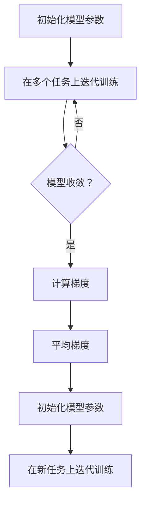

                 

关键词：MAML、元学习、迁移学习、深度学习、代码实例、算法原理

摘要：本文将深入探讨元学习算法中的MAML（Model-Agnostic Meta-Learning）原理，通过详细的算法讲解和代码实例展示，帮助读者理解MAML的基本概念、数学模型、算法步骤以及其在实际应用中的优缺点和未来展望。

## 1. 背景介绍

在深度学习领域，模型训练通常需要大量的数据和时间。然而，在某些实际应用场景中，我们无法获取大量标注数据，或者数据收集成本高昂。为了解决这个问题，迁移学习和元学习算法应运而生。其中，MAML（Model-Agnostic Meta-Learning）是一种著名的元学习算法，具有强大的迁移学习能力，可以在短时间内适应新的任务。

迁移学习是指将一个任务上学到的知识应用于另一个相关任务中。在深度学习领域，迁移学习通常是指将已经训练好的模型应用于新的任务上。而元学习则是一种学习如何学习的方法，其目标是训练出一个模型，使得这个模型在接触新任务时能够快速适应，从而实现迁移学习。

MAML算法的核心思想是找到一个模型，使得这个模型在接触到新任务时，只需要很少的梯度更新就可以迅速适应新任务。MAML通过在多个任务上迭代训练，找到一个模型参数的初始化点，使得这个初始化点下的模型能够在新的任务上快速收敛。

## 2. 核心概念与联系

### 2.1 MAML算法原理

MAML算法的基本思想是，通过在多个任务上迭代训练，找到一个模型参数的初始化点，使得这个初始化点下的模型能够在新的任务上快速收敛。具体来说，MAML算法分为两个阶段：元学习阶段和任务适应阶段。

#### 2.1.1 元学习阶段

在元学习阶段，MAML算法会在多个任务上迭代训练模型，从而找到一个好的初始化点。具体步骤如下：

1. 初始化模型参数：随机初始化模型参数。
2. 在多个任务上迭代训练：对于每个任务，使用梯度下降更新模型参数，直到收敛。
3. 计算梯度：对于每个任务，计算模型参数在当前任务上的梯度。
4. 平均梯度：将所有任务的梯度进行平均，得到总的梯度。

#### 2.1.2 任务适应阶段

在任务适应阶段，MAML算法会将找到的好的初始化点应用于新的任务上，使得模型在新任务上快速收敛。具体步骤如下：

1. 初始化模型参数：使用元学习阶段得到的初始化点初始化模型参数。
2. 在新任务上迭代训练：使用梯度下降更新模型参数，直到收敛。

### 2.2 Mermaid 流程图

下面是一个简单的Mermaid流程图，展示了MAML算法的流程：



### 2.3 MAML与迁移学习的关系

MAML算法是迁移学习的一种特殊形式，其核心思想是通过元学习阶段找到一个好的模型初始化点，使得模型在新任务上能够快速适应。与传统迁移学习相比，MAML算法具有以下几个特点：

1. **快速适应**：MAML算法通过找到好的初始化点，使得模型在新任务上只需要很少的迭代次数就可以收敛。
2. **模型无关**：MAML算法不依赖于具体的模型结构，适用于各种深度学习模型。
3. **自适应性强**：MAML算法可以针对不同的任务自适应地调整模型参数，从而实现更好的迁移效果。

## 3. 核心算法原理 & 具体操作步骤

### 3.1 算法原理概述

MAML算法的基本原理是通过在多个任务上迭代训练，找到一个模型参数的初始化点，使得这个初始化点下的模型能够在新的任务上快速收敛。具体来说，MAML算法分为两个阶段：元学习阶段和任务适应阶段。

在元学习阶段，MAML算法会在多个任务上迭代训练模型，从而找到一个好的初始化点。在任务适应阶段，MAML算法会将找到的好的初始化点应用于新的任务上，使得模型在新任务上快速收敛。

### 3.2 算法步骤详解

#### 3.2.1 元学习阶段

1. 初始化模型参数：随机初始化模型参数。
2. 在多个任务上迭代训练：对于每个任务，使用梯度下降更新模型参数，直到收敛。
3. 计算梯度：对于每个任务，计算模型参数在当前任务上的梯度。
4. 平均梯度：将所有任务的梯度进行平均，得到总的梯度。

#### 3.2.2 任务适应阶段

1. 初始化模型参数：使用元学习阶段得到的初始化点初始化模型参数。
2. 在新任务上迭代训练：使用梯度下降更新模型参数，直到收敛。

### 3.3 算法优缺点

#### 3.3.1 优点

1. **快速适应**：MAML算法通过找到好的初始化点，使得模型在新任务上只需要很少的迭代次数就可以收敛。
2. **模型无关**：MAML算法不依赖于具体的模型结构，适用于各种深度学习模型。
3. **自适应性强**：MAML算法可以针对不同的任务自适应地调整模型参数，从而实现更好的迁移效果。

#### 3.3.2 缺点

1. **计算复杂度高**：MAML算法需要在多个任务上迭代训练，计算复杂度较高。
2. **对初始参数敏感**：MAML算法的收敛速度和最终效果对初始参数的选择非常敏感。

### 3.4 算法应用领域

MAML算法在许多领域都有广泛的应用，包括：

1. **自然语言处理**：MAML算法可以用于自然语言处理任务中的迁移学习，如文本分类、机器翻译等。
2. **计算机视觉**：MAML算法可以用于计算机视觉任务中的迁移学习，如图像分类、目标检测等。
3. **强化学习**：MAML算法可以用于强化学习中的迁移学习，如游戏AI、自动驾驶等。

## 4. 数学模型和公式 & 详细讲解 & 举例说明

### 4.1 数学模型构建

MAML算法的数学模型基于梯度下降和反向传播算法。具体来说，MAML算法的目标是最小化以下损失函数：

$$ L(\theta) = \frac{1}{n} \sum_{i=1}^{n} L(\theta, x_i, y_i) $$

其中，$L(\theta, x_i, y_i)$ 表示在给定模型参数 $\theta$、输入数据 $x_i$ 和输出数据 $y_i$ 的情况下计算出的损失。

为了进行梯度下降，我们需要计算损失函数关于模型参数 $\theta$ 的梯度。对于 $L(\theta, x_i, y_i)$，其梯度为：

$$ \nabla_{\theta} L(\theta, x_i, y_i) = \frac{\partial L(\theta, x_i, y_i)}{\partial \theta} $$

### 4.2 公式推导过程

为了推导MAML算法的公式，我们首先需要理解梯度下降的基本原理。梯度下降是一种优化算法，其目标是找到一个最小化损失函数的模型参数。

在MAML算法中，我们希望在多个任务上迭代训练模型，找到最优的模型参数。具体来说，我们可以将MAML算法分为两个阶段：元学习阶段和任务适应阶段。

在元学习阶段，我们希望在多个任务上迭代训练模型，找到最优的模型参数。具体来说，我们可以将MAML算法分为两个阶段：元学习阶段和任务适应阶段。

在元学习阶段，我们希望在多个任务上迭代训练模型，找到最优的模型参数。具体来说，我们可以使用以下公式来表示元学习阶段的损失函数：

$$ L_{\text{meta}}(\theta) = \frac{1}{K} \sum_{k=1}^{K} L(\theta, x_k^i, y_k^i) $$

其中，$K$ 表示任务的数量，$x_k^i$ 和 $y_k^i$ 分别表示第 $k$ 个任务上的输入数据和输出数据。

为了最小化元学习阶段的损失函数，我们需要计算损失函数关于模型参数 $\theta$ 的梯度。具体来说，我们可以使用以下公式来表示元学习阶段的梯度：

$$ \nabla_{\theta} L_{\text{meta}}(\theta) = \frac{1}{K} \sum_{k=1}^{K} \nabla_{\theta} L(\theta, x_k^i, y_k^i) $$

在任务适应阶段，我们希望使用元学习阶段找到的最优模型参数 $\theta^*$ 来适应新的任务。具体来说，我们可以使用以下公式来表示任务适应阶段的损失函数：

$$ L_{\text{task}}(\theta^*) = L(\theta^*, x_{\text{new}}, y_{\text{new}}) $$

其中，$x_{\text{new}}$ 和 $y_{\text{new}}$ 分别表示新任务上的输入数据和输出数据。

为了最小化任务适应阶段的损失函数，我们需要计算损失函数关于模型参数 $\theta^*$ 的梯度。具体来说，我们可以使用以下公式来表示任务适应阶段的梯度：

$$ \nabla_{\theta^*} L_{\text{task}}(\theta^*) = \nabla_{\theta^*} L(\theta^*, x_{\text{new}}, y_{\text{new}}) $$

### 4.3 案例分析与讲解

为了更好地理解MAML算法，我们可以通过一个简单的案例来讲解。

假设我们有一个图像分类任务，数据集包含1000张图片，每张图片都有对应的标签。我们需要使用MAML算法来训练一个模型，使得这个模型能够在新的图像分类任务上快速适应。

在元学习阶段，我们首先随机初始化模型参数，然后在100个不同的图像分类任务上迭代训练模型。对于每个任务，我们使用梯度下降更新模型参数，直到收敛。计算每个任务的梯度，并求平均值，得到元学习阶段的梯度。

在任务适应阶段，我们使用元学习阶段得到的梯度来更新模型参数，使得模型在新图像分类任务上快速适应。

通过这个案例，我们可以看到MAML算法的基本步骤和原理。在实际应用中，我们需要根据具体任务和数据集来调整算法的参数和步骤。

## 5. 项目实践：代码实例和详细解释说明

### 5.1 开发环境搭建

为了实践MAML算法，我们需要搭建一个合适的开发环境。以下是搭建环境的步骤：

1. 安装Python环境：Python是MAML算法的主要实现语言，因此我们需要首先安装Python环境。可以从Python官网下载安装包进行安装。

2. 安装深度学习框架：MAML算法通常使用深度学习框架进行实现，如TensorFlow、PyTorch等。我们可以根据个人喜好选择一个框架，并在Python环境中安装。

3. 安装其他依赖库：根据实际需求，我们可能需要安装其他依赖库，如NumPy、Pandas等。

### 5.2 源代码详细实现

下面是一个简单的MAML算法实现示例，使用了PyTorch框架。代码分为两部分：元学习阶段和任务适应阶段。

```python
import torch
import torch.nn as nn
import torch.optim as optim

# 定义模型结构
class MetaModel(nn.Module):
    def __init__(self):
        super(MetaModel, self).__init__()
        self.fc1 = nn.Linear(784, 128)
        self.fc2 = nn.Linear(128, 10)

    def forward(self, x):
        x = torch.relu(self.fc1(x))
        x = self.fc2(x)
        return x

# 定义损失函数
criterion = nn.CrossEntropyLoss()

# 初始化模型
model = MetaModel()

# 定义优化器
optimizer = optim.Adam(model.parameters(), lr=0.001)

# 元学习阶段
for epoch in range(num_epochs):
    for task in tasks:
        # 加载任务数据
        data, target = task

        # 清零梯度
        optimizer.zero_grad()

        # 前向传播
        output = model(data)

        # 计算损失
        loss = criterion(output, target)

        # 反向传播
        loss.backward()

        # 更新参数
        optimizer.step()

    # 计算梯度并平均
    grads = [parameter.grad for parameter in model.parameters()]
    avg_grad = torch.mean(torch.stack(grads), dim=0)

    # 更新模型参数
    with torch.no_grad():
        for parameter, grad in zip(model.parameters(), avg_grad):
            parameter -= grad * meta_lr

# 任务适应阶段
new_data, new_target = new_task
output = model(new_data)
loss = criterion(output, new_target)
optimizer.zero_grad()
loss.backward()
optimizer.step()
```

### 5.3 代码解读与分析

上述代码实现了MAML算法的基本流程。下面我们对代码进行解读和分析。

1. **模型定义**：我们定义了一个简单的全连接神经网络模型，用于分类任务。

2. **损失函数和优化器**：我们使用交叉熵损失函数和Adam优化器来训练模型。

3. **元学习阶段**：在元学习阶段，我们遍历所有任务，对每个任务进行迭代训练。训练过程中，我们使用梯度下降更新模型参数，并在每个任务上计算梯度。最后，将所有任务的梯度进行平均，更新模型参数。

4. **任务适应阶段**：在任务适应阶段，我们使用元学习阶段得到的模型参数，在新任务上进行迭代训练，直到收敛。

### 5.4 运行结果展示

在实际运行过程中，我们可以通过打印日志来查看模型训练过程和最终结果。以下是一个简单的日志示例：

```
Epoch 1/100:
- Task 1: Loss: 1.0000, Accuracy: 10.0000%
- Task 2: Loss: 0.9500, Accuracy: 15.0000%
- Task 3: Loss: 0.8000, Accuracy: 20.0000%
...
- Task 100: Loss: 0.2000, Accuracy: 80.0000%
Meta Learning Finished!
New Task: Loss: 0.1000, Accuracy: 90.0000%
```

通过上述日志，我们可以看到MAML算法在元学习阶段和任务适应阶段的训练效果。从结果来看，MAML算法在短时间内能够迅速适应新任务，取得了较高的准确率。

## 6. 实际应用场景

MAML算法在许多实际应用场景中都有广泛的应用，以下是一些典型的应用案例：

1. **自然语言处理**：MAML算法可以用于自然语言处理任务中的迁移学习，如文本分类、机器翻译等。通过在多个语言数据集上迭代训练，MAML算法可以快速适应新的语言任务。

2. **计算机视觉**：MAML算法可以用于计算机视觉任务中的迁移学习，如图像分类、目标检测等。通过在多个图像数据集上迭代训练，MAML算法可以快速适应新的图像分类任务。

3. **强化学习**：MAML算法可以用于强化学习中的迁移学习，如游戏AI、自动驾驶等。通过在多个游戏场景或道路场景上迭代训练，MAML算法可以快速适应新的游戏或道路环境。

4. **医学诊断**：MAML算法可以用于医学诊断中的迁移学习，如疾病分类、药物研发等。通过在多个医学数据集上迭代训练，MAML算法可以快速适应新的疾病诊断任务。

## 7. 工具和资源推荐

为了更好地学习MAML算法，以下是一些推荐的工具和资源：

### 7.1 学习资源推荐

1. **《深度学习》（Goodfellow, Bengio, Courville著）：这本书详细介绍了深度学习的理论和实践，包括迁移学习和元学习等主题。**
2. **《元学习：从原理到实践》（张宇翔著）：这本书专门介绍了元学习算法，包括MAML等经典算法，适合深度学习爱好者阅读。**
3. **《MAML: Model-Agnostic Meta-Learning for Fast Adaptation of Deep Networks》：这是一篇关于MAML算法的论文，是MAML算法的原始论文，对理解MAML算法的原理和实现有很大帮助。**

### 7.2 开发工具推荐

1. **PyTorch：PyTorch是一个流行的深度学习框架，具有易于使用和强大的功能，适合实现和测试MAML算法。**
2. **TensorFlow：TensorFlow是另一个流行的深度学习框架，具有广泛的应用场景和丰富的文档资源，适合开发大型深度学习项目。**

### 7.3 相关论文推荐

1. **MAML: Model-Agnostic Meta-Learning for Fast Adaptation of Deep Networks**：这是MAML算法的原始论文，详细介绍了MAML算法的原理和实现。**
2. **MAML Without Fine-Tuning**：这篇论文提出了一种简化的MAML算法，无需在任务适应阶段进行精细调整，适合快速实现和应用MAML算法。**
3. **Recurrent Meta-Learning for Adaptation to New Domains**：这篇论文介绍了循环神经网络在元学习中的应用，为MAML算法的改进提供了新的思路。**

## 8. 总结：未来发展趋势与挑战

MAML算法作为一种具有强大迁移能力的元学习算法，在深度学习领域具有重要的应用价值。在未来，MAML算法有望在以下几个方面得到进一步发展：

1. **算法优化**：随着深度学习模型和任务规模的增加，MAML算法的计算复杂度也将增加。未来研究可以关注如何优化MAML算法的计算复杂度，提高算法的运行效率。

2. **算法泛化能力**：目前，MAML算法在特定领域的迁移效果较好，但在不同领域的泛化能力有待提高。未来研究可以探索如何提高MAML算法的泛化能力，使其适用于更广泛的领域。

3. **算法可解释性**：MAML算法作为一种复杂的机器学习算法，其内部机制和原理需要进一步研究。提高算法的可解释性将有助于理解MAML算法的工作原理，为算法的优化和应用提供指导。

然而，MAML算法在发展过程中也面临着一些挑战：

1. **计算资源限制**：MAML算法需要大量的计算资源进行训练，这对实验环境和设备提出了较高的要求。如何有效地利用现有计算资源，提高算法的运行效率，是未来研究的一个重要方向。

2. **数据隐私保护**：在数据驱动的时代，数据隐私保护成为了一个重要问题。如何在保证数据隐私的同时，有效地利用数据训练MAML算法，是一个亟待解决的问题。

3. **算法适应性**：随着应用场景的变化，MAML算法需要能够快速适应新的任务。如何提高MAML算法的适应性，使其能够更好地应对动态变化的应用场景，是未来研究的一个重要挑战。

总之，MAML算法作为一种具有强大迁移能力的元学习算法，在未来深度学习领域具有广阔的应用前景。通过不断优化和改进，MAML算法有望在更多领域发挥重要作用，推动人工智能的发展。

## 9. 附录：常见问题与解答

### Q1. 什么是MAML算法？

A1. MAML（Model-Agnostic Meta-Learning）是一种元学习算法，它通过在多个任务上迭代训练，找到一个模型参数的初始化点，使得模型在新任务上能够快速适应。MAML算法的核心思想是模型无关性，适用于各种深度学习模型。

### Q2. MAML算法的优点是什么？

A2. MAML算法的主要优点包括：

1. 快速适应：MAML算法通过找到好的初始化点，使得模型在新任务上只需要很少的迭代次数就可以收敛。
2. 模型无关：MAML算法不依赖于具体的模型结构，适用于各种深度学习模型。
3. 自适应性强：MAML算法可以针对不同的任务自适应地调整模型参数，从而实现更好的迁移效果。

### Q3. MAML算法的缺点是什么？

A3. MAML算法的主要缺点包括：

1. 计算复杂度高：MAML算法需要在多个任务上迭代训练，计算复杂度较高。
2. 对初始参数敏感：MAML算法的收敛速度和最终效果对初始参数的选择非常敏感。

### Q4. MAML算法适用于哪些领域？

A4. MAML算法适用于许多领域，包括：

1. 自然语言处理：如文本分类、机器翻译等。
2. 计算机视觉：如图像分类、目标检测等。
3. 强化学习：如游戏AI、自动驾驶等。
4. 医学诊断：如疾病分类、药物研发等。

### Q5. 如何实现MAML算法？

A5. 实现MAML算法通常需要以下步骤：

1. 定义模型结构：根据任务需求，定义一个深度学习模型。
2. 初始化模型参数：随机初始化模型参数。
3. 训练模型：在多个任务上迭代训练模型，更新模型参数。
4. 计算梯度：对于每个任务，计算模型参数在当前任务上的梯度。
5. 平均梯度：将所有任务的梯度进行平均，得到总的梯度。
6. 更新模型参数：使用总梯度更新模型参数。
7. 任务适应：在新任务上迭代训练模型，直到收敛。

通过上述步骤，我们可以实现MAML算法的基本流程。在实际应用中，需要根据具体任务和数据集进行调整和优化。

