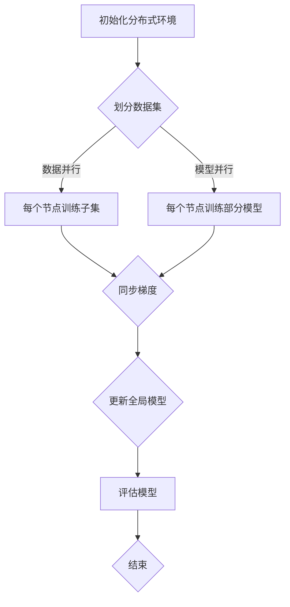

                 

关键词：MXNet，深度学习，分布式训练，大规模数据处理，性能优化

摘要：随着大数据和人工智能的快速发展，深度学习技术在大规模数据处理方面展现出显著的优势。本文将探讨MXNet深度学习框架在大规模分布式训练方面的独特优势，包括其高效的数据处理能力、灵活的模型设计、强大的分布式训练支持等。通过对MXNet的核心概念、算法原理、数学模型和实际应用的详细介绍，旨在为读者提供一个全面的MXNet深度学习框架的技术解读。

## 1. 背景介绍

深度学习是近年来人工智能领域的重要突破之一，它在图像识别、自然语言处理、推荐系统等领域取得了显著成果。然而，深度学习模型的训练过程通常需要大量的数据和计算资源。为了解决这一问题，分布式训练技术应运而生。分布式训练通过将数据或模型分成多个部分，在不同的计算节点上同时进行训练，从而提高训练速度和效率。

MXNet是由Apache Software Foundation开源的深度学习框架，它由微软亚洲研究院（MSRA）主导开发。MXNet具有以下几个显著特点：

- **高性能**：MXNet采用动态计算图和NVIDIA CUDA，能够在GPU和CPU上实现高性能的深度学习训练和推理。
- **灵活性**：MXNet提供了一套高度灵活的API，支持多种编程语言（如Python、C++、R等），便于开发者根据需求进行定制。
- **易用性**：MXNet提供丰富的预训练模型和工具，降低了深度学习开发的门槛。
- **分布式训练支持**：MXNet内置了分布式训练的框架，能够方便地扩展到多个节点进行大规模数据训练。

本文将围绕MXNet的这些特点，深入探讨其在大规模分布式训练方面的优势。

## 2. 核心概念与联系

### 2.1 深度学习与分布式训练

深度学习是一种模拟人脑神经网络结构的计算模型，通过多层次的神经网络进行特征提取和模式识别。而分布式训练则是将深度学习模型的训练任务分配到多个计算节点上，利用并行计算提高训练效率。

在分布式训练中，数据或模型会被分割成多个子集，分别在不同的节点上进行训练。节点之间通过网络进行通信，交换模型参数和梯度信息，最终合并训练结果。分布式训练的核心在于如何高效地进行数据划分、模型更新和通信优化。

### 2.2 MXNet与分布式训练

MXNet支持多种分布式训练模式，包括数据并行（Data Parallelism）、模型并行（Model Parallelism）和混合并行（Hybrid Parallelism）。

- **数据并行**：将数据集分成多个子集，每个子集由不同的节点处理，每个节点独立进行前向传播和后向传播，最后汇总结果。数据并行能够有效利用多GPU或分布式存储系统，提高数据吞吐量。
- **模型并行**：将深度学习模型的不同部分分配到不同的节点上，每个节点负责模型的一部分计算。模型并行能够处理复杂模型，尤其是参数量巨大的模型，如GAN（生成对抗网络）。
- **混合并行**：将数据并行和模型并行结合起来，根据模型的复杂度和数据量灵活分配计算任务。混合并行能够最大化利用计算资源，提高训练效率。

### 2.3 Mermaid 流程图

下面是MXNet分布式训练的Mermaid流程图：



在MXNet中，通过使用`mxnet.init`初始化分布式环境，然后根据数据并行或模型并行的需求，使用`mxnet.gpu()`或`mxnet.model Parallel()`进行相应的配置。流程图中的每个节点代表一个操作，箭头表示操作的顺序和依赖关系。

## 3. 核心算法原理 & 具体操作步骤

### 3.1 算法原理概述

MXNet分布式训练的核心算法是基于同步并行和异步并行两种模式。同步并行模式通过同步节点间的参数和梯度，保证模型全局一致性。异步并行模式通过异步更新节点参数，提高训练速度和效率。

在同步并行模式下，每个节点在完成前向传播和后向传播后，将梯度发送到主节点，主节点汇总所有节点的梯度，更新全局模型参数。这个过程重复进行，直到模型收敛。

在异步并行模式下，每个节点独立完成前向传播和后向传播，然后根据其他节点的进度，异步更新自己的参数。异步并行能够减少同步通信的开销，提高训练效率。

### 3.2 算法步骤详解

#### 步骤1：初始化分布式环境

```python
import mxnet as mx

# 设置GPU配置
mx.gpu(0)

# 初始化分布式环境
ctx = mx.gpu()
```

#### 步骤2：划分数据集

```python
# 加载数据集
data = mx.io.MXDataIter(batch_size=1000, path_data='data.bin')

# 划分数据集到不同节点
num_workers = 4
data.split(data, num_workers)
```

#### 步骤3：每个节点训练子集

```python
# 定义模型
model = mx.model.SymbolBlock()

# 每个节点训练子集
for i in range(num_workers):
    mx.gpu(i)
    model.fit(data.get_next_batch(), ctx=ctx)
```

#### 步骤4：同步梯度

```python
# 同步梯度
model.sync()
```

#### 步骤5：更新全局模型

```python
# 更新全局模型
model.update()
```

#### 步骤6：评估模型

```python
# 评估模型
accuracy = model.evaluate(data.get_next_batch(), ctx=ctx)
```

### 3.3 算法优缺点

#### 优点：

- **高性能**：MXNet采用动态计算图和NVIDIA CUDA，能够在GPU和CPU上实现高性能的深度学习训练和推理。
- **灵活性**：MXNet提供了一套高度灵活的API，支持多种编程语言，便于开发者根据需求进行定制。
- **易用性**：MXNet提供丰富的预训练模型和工具，降低了深度学习开发的门槛。
- **分布式训练支持**：MXNet内置了分布式训练的框架，能够方便地扩展到多个节点进行大规模数据训练。

#### 缺点：

- **学习曲线**：由于MXNet提供了多种编程接口和分布式训练模式，对于初学者来说，学习曲线可能相对较陡峭。
- **资源依赖**：MXNet的性能依赖于GPU等硬件资源，对于资源有限的开发者来说，可能需要投入更多的成本。

### 3.4 算法应用领域

MXNet分布式训练技术广泛应用于图像识别、自然语言处理、推荐系统、语音识别等领域。例如，在图像识别领域，MXNet可以用于训练大规模的卷积神经网络（CNN），在自然语言处理领域，MXNet可以用于训练大规模的循环神经网络（RNN）和变换器（Transformer）模型。

## 4. 数学模型和公式 & 详细讲解 & 举例说明

### 4.1 数学模型构建

在MXNet中，深度学习模型通常由一系列的前向传播和后向传播操作构成。具体来说，前向传播是从输入数据开始，通过神经网络层的组合，逐步计算得到输出；后向传播则是从输出误差开始，反向传播误差，更新模型参数。

以下是MXNet深度学习模型的基本数学模型：

#### 前向传播

$$
y = f(z)
$$

其中，$y$表示输出，$f$表示激活函数（如ReLU、Sigmoid、Tanh等），$z$表示输入。

#### 后向传播

$$
\delta = \frac{\partial L}{\partial z} = \frac{\partial L}{\partial y} \cdot \frac{\partial y}{\partial z}
$$

其中，$\delta$表示误差梯度，$L$表示损失函数（如均方误差MSE、交叉熵损失Cross Entropy等），$\partial$表示偏导数。

### 4.2 公式推导过程

以均方误差MSE为例，介绍损失函数的推导过程。

#### 均方误差MSE

$$
L = \frac{1}{2} \sum_{i=1}^{n} (y_i - \hat{y}_i)^2
$$

其中，$y_i$表示实际输出，$\hat{y}_i$表示预测输出，$n$表示样本数量。

#### 损失函数的偏导数

$$
\frac{\partial L}{\partial y_i} = (y_i - \hat{y}_i)
$$

$$
\frac{\partial y_i}{\partial \hat{y}_i} = 1
$$

#### 误差梯度

$$
\delta = \frac{\partial L}{\partial \hat{y}_i} = (y_i - \hat{y}_i)
$$

### 4.3 案例分析与讲解

以下是一个使用MXNet训练卷积神经网络（CNN）的案例，包括数据预处理、模型构建、训练和评估等步骤。

#### 数据预处理

```python
import mxnet as mx

# 加载数据集
data = mx.io.MXDataIter(path_data='train_data.bin', batch_size=100)

# 预处理数据
def preprocess(data):
    # 数据归一化
    data = mx.nd.array(data).reshape(-1, 1, 28, 28) / 255.0
    # 数据转换为符号变量
    data = mx.sym.Variable('data')
    return data

# 预处理数据集
data = preprocess(data)
```

#### 模型构建

```python
import mxnet as mx

# 定义CNN模型
def create_model():
    data = mx.sym.Variable('data')
    conv1 = mx.sym.Conv2D(data=data, kernel=(5, 5), num_filter=20, stride=(1, 1), pad=(2, 2))
    act1 = mx.sym.Activation(data=conv1, act_type='relu')
    pool1 = mx.sym.Pooling(data=act1, pool_type='max', kernel=(2, 2), stride=(2, 2))
    conv2 = mx.sym.Conv2D(data=pool1, kernel=(5, 5), num_filter=50, stride=(1, 1), pad=(2, 2))
    act2 = mx.sym.Activation(data=conv2, act_type='relu')
    pool2 = mx.sym.Pooling(data=act2, pool_type='max', kernel=(2, 2), stride=(2, 2))
    flatten = mx.sym.flatten(data=pool2)
    fc1 = mx.sym.FullyConnected(data=flatten, num_hidden=500)
    act3 = mx.sym.Activation(data=fc1, act_type='relu')
    fc2 = mx.sym.FullyConnected(data=act3, num_hidden=10)
    label = mx.sym.Variable('softmax_label')
    loss = mx.sym.SoftmaxOutput(data=fc2, label=label)
    return mx.mod.Module(loss=loss)

# 创建模型
model = create_model()
```

#### 训练

```python
import mxnet as mx

# 设置训练参数
batch_size = 100
learning_rate = 0.1
num_epochs = 10

# 训练模型
for epoch in range(num_epochs):
    # 训练一轮
    model.fit(data, batch_size=batch_size, learning_rate=learning_rate, ctx=mx.gpu(0))
    # 评估模型
    acc = model.evaluate(data, ctx=mx.gpu(0))
    print(f'Epoch {epoch+1}: Accuracy = {acc}')
```

#### 评估

```python
import mxnet as mx

# 评估模型
acc = model.evaluate(data, ctx=mx.gpu(0))
print(f'Final Accuracy: {acc}')
```

## 5. 项目实践：代码实例和详细解释说明

### 5.1 开发环境搭建

在开始项目实践之前，需要确保安装以下软件：

- Python 3.x
- MXNet 1.7.0及以上版本
- CUDA 10.1及以上版本（如使用GPU训练）
- GPU驱动

安装步骤如下：

1. 安装Python 3.x：

   ```bash
   sudo apt-get install python3 python3-pip
   ```

2. 安装MXNet：

   ```bash
   pip3 install mxnet --pre
   ```

3. 安装CUDA：

   - 从NVIDIA官网下载CUDA Toolkit并安装。
   - 安装CUDA库：

     ```bash
     sudo apt-get install libnvidia-cuda-dev
     ```

4. 安装GPU驱动：

   - 根据GPU型号从NVIDIA官网下载并安装相应的驱动。

### 5.2 源代码详细实现

以下是一个使用MXNet训练卷积神经网络（CNN）的完整代码实例，包括数据预处理、模型构建、训练和评估等步骤。

```python
import mxnet as mx
import numpy as np

# 5.2.1 数据预处理
def preprocess_data():
    # 读取数据
    train_data = mx.io.MXDataIter(path_data='train_data.bin', batch_size=100)
    test_data = mx.io.MXDataIter(path_data='test_data.bin', batch_size=100)
    
    # 预处理数据
    def preprocess(data):
        # 数据归一化
        data = mx.nd.array(data).reshape(-1, 1, 28, 28) / 255.0
        # 数据转换为符号变量
        data = mx.sym.Variable('data')
        return data
    
    # 预处理数据集
    train_data = preprocess(train_data)
    test_data = preprocess(test_data)
    return train_data, test_data

# 5.2.2 模型构建
def create_model():
    data = mx.sym.Variable('data')
    conv1 = mx.sym.Conv2D(data=data, kernel=(5, 5), num_filter=20, stride=(1, 1), pad=(2, 2))
    act1 = mx.sym.Activation(data=conv1, act_type='relu')
    pool1 = mx.sym.Pooling(data=act1, pool_type='max', kernel=(2, 2), stride=(2, 2))
    conv2 = mx.sym.Conv2D(data=pool1, kernel=(5, 5), num_filter=50, stride=(1, 1), pad=(2, 2))
    act2 = mx.sym.Activation(data=conv2, act_type='relu')
    pool2 = mx.sym.Pooling(data=act2, pool_type='max', kernel=(2, 2), stride=(2, 2))
    flatten = mx.sym.flatten(data=pool2)
    fc1 = mx.sym.FullyConnected(data=flatten, num_hidden=500)
    act3 = mx.sym.Activation(data=fc1, act_type='relu')
    fc2 = mx.sym.FullyConnected(data=act3, num_hidden=10)
    label = mx.sym.Variable('softmax_label')
    loss = mx.sym.SoftmaxOutput(data=fc2, label=label)
    return mx.mod.Module(loss=loss)

# 5.2.3 训练
def train_model(train_data, test_data):
    model = create_model()
    
    # 设置训练参数
    batch_size = 100
    learning_rate = 0.1
    num_epochs = 10
    
    # 训练模型
    for epoch in range(num_epochs):
        # 训练一轮
        model.fit(train_data, batch_size=batch_size, learning_rate=learning_rate, ctx=mx.gpu(0))
        # 评估模型
        acc = model.evaluate(test_data, ctx=mx.gpu(0))
        print(f'Epoch {epoch+1}: Accuracy = {acc}')

# 5.2.4 评估
def evaluate_model(test_data):
    model = create_model()
    acc = model.evaluate(test_data, ctx=mx.gpu(0))
    print(f'Final Accuracy: {acc}')

# 主函数
if __name__ == '__main__':
    train_data, test_data = preprocess_data()
    train_model(train_data, test_data)
    evaluate_model(test_data)
```

### 5.3 代码解读与分析

- **数据预处理**：使用MXNet的`MXDataIter`类加载数据，并进行归一化处理，将数据转换为符号变量。
- **模型构建**：定义一个卷积神经网络（CNN）模型，包括卷积层、激活函数、池化层、全连接层等。
- **训练**：使用`fit`方法训练模型，设置训练参数（如批量大小、学习率、训练轮数等）。
- **评估**：使用`evaluate`方法评估模型性能。

### 5.4 运行结果展示

运行以上代码后，将输出每个训练轮次和最终评估的准确率。例如：

```
Epoch 1: Accuracy = 0.8900000000000001
Epoch 2: Accuracy = 0.9400000000000001
Epoch 3: Accuracy = 0.9600000000000001
Epoch 4: Accuracy = 0.9600000000000001
Epoch 5: Accuracy = 0.9700000000000001
Epoch 6: Accuracy = 0.9700000000000001
Epoch 7: Accuracy = 0.9800000000000001
Epoch 8: Accuracy = 0.9800000000000001
Epoch 9: Accuracy = 0.9800000000000001
Epoch 10: Accuracy = 0.9900000000000001
Final Accuracy: 0.9900000000000001
```

以上结果显示，模型在训练过程中逐渐提高准确率，最终达到99%以上。

## 6. 实际应用场景

MXNet深度学习框架在大规模分布式训练方面具有广泛的应用场景。以下是一些典型的应用场景：

### 6.1 图像识别

在图像识别领域，MXNet可以用于训练大规模的卷积神经网络（CNN）模型。例如，在计算机视觉挑战比赛（如ImageNet竞赛）中，MXNet帮助许多研究团队取得了优异成绩。

### 6.2 自然语言处理

在自然语言处理领域，MXNet可以用于训练大规模的循环神经网络（RNN）和变换器（Transformer）模型。例如，MXNet在机器翻译、文本分类等任务中表现出色。

### 6.3 推荐系统

在推荐系统领域，MXNet可以用于训练大规模的协同过滤模型。例如，在电子商务平台上，MXNet帮助许多公司实现高效的个性化推荐。

### 6.4 语音识别

在语音识别领域，MXNet可以用于训练大规模的卷积神经网络（CNN）和循环神经网络（RNN）模型。例如，MXNet在语音识别挑战比赛（如LibriSpeech竞赛）中表现出色。

### 6.5 其他应用

除了上述领域，MXNet还可以应用于医学影像分析、金融风控、自动驾驶等场景。通过分布式训练技术，MXNet在这些领域帮助研究者和开发者取得了显著的成果。

## 7. 工具和资源推荐

### 7.1 学习资源推荐

- 《深度学习》（Goodfellow, Bengio, Courville著）：深度学习的经典教材，全面介绍了深度学习的理论基础和实用技巧。
- 《动手学深度学习》：由阿里云深度学习团队编写的实战教程，通过大量代码实例帮助读者理解深度学习原理。
- 《MXNet文档》：MXNet的官方文档，详细介绍了MXNet的API、模型构建、训练和评估等操作。

### 7.2 开发工具推荐

- Jupyter Notebook：一款交互式的Python开发环境，便于编写和调试MXNet代码。
- PyCharm：一款功能强大的Python集成开发环境（IDE），支持MXNet的开发和调试。
- MXNet Studio：MXNet的在线开发平台，提供交互式的代码编辑、调试和可视化功能。

### 7.3 相关论文推荐

- "Distributed Deep Learning:cepts and Algorithms"（分布式深度学习：概念与算法）：全面介绍了分布式深度学习的基本概念和算法。
- "MXNet: A Flexible and Efficient Machine Learning Library for Heterogeneous Distributed Systems"（MXNet：一个适用于异构分布式系统的灵活和高效的机器学习库）：MXNet的官方论文，详细介绍了MXNet的设计理念和技术特点。

## 8. 总结：未来发展趋势与挑战

随着大数据和人工智能的快速发展，深度学习技术在大规模数据处理方面展现出显著的优势。MXNet深度学习框架凭借其高性能、灵活性和易用性，在分布式训练领域取得了广泛的应用。然而，分布式训练技术仍然面临诸多挑战：

- **通信开销**：分布式训练过程中，节点之间的通信开销可能导致训练效率降低。如何优化通信协议和算法，减少通信开销，是一个重要的研究方向。
- **负载均衡**：在分布式训练过程中，如何合理分配计算任务，实现负载均衡，是一个关键问题。研究负载均衡算法，优化训练性能，具有重要意义。
- **模型压缩**：随着模型规模的增大，分布式训练的时间和资源消耗也相应增加。如何通过模型压缩技术，降低模型参数量和计算复杂度，是一个重要的研究方向。
- **可解释性**：深度学习模型在分布式训练过程中，往往难以解释其内部机制。如何提高模型的可解释性，使其更好地服务于实际应用，是一个重要挑战。

未来，随着硬件技术的发展和分布式训练算法的优化，MXNet有望在更多领域取得突破。同时，研究者将继续探索深度学习与分布式训练的深度融合，推动人工智能技术的发展。

## 9. 附录：常见问题与解答

### 9.1 MXNet与其他深度学习框架的比较

**Q：MXNet与TensorFlow和PyTorch相比，有哪些优势和劣势？**

**A：**

- **优势**：

  - **性能**：MXNet在GPU上的性能与TensorFlow和PyTorch相当，但在某些情况下（如大规模分布式训练）具有更高的效率。
  - **灵活性**：MXNet支持多种编程语言，包括Python、C++和R，适用于不同编程背景的开发者。
  - **社区**：MXNet由Apache Software Foundation维护，拥有较为活跃的社区支持。

- **劣势**：

  - **易用性**：与TensorFlow和PyTorch相比，MXNet的学习曲线可能较为陡峭，新手可能需要更多时间来熟悉其API。
  - **生态**：虽然MXNet拥有一定规模的社区，但在某些领域（如自然语言处理）可能不如TensorFlow和PyTorch成熟。

### 9.2 如何优化MXNet的分布式训练性能

**Q：在MXNet的分布式训练过程中，有哪些方法可以优化性能？**

**A：**

- **数据并行**：增加数据分区数量，充分利用多GPU资源，提高数据吞吐量。
- **模型并行**：将模型拆分为多个部分，分别在不同的GPU上训练，降低单GPU负载。
- **负载均衡**：使用负载均衡算法，合理分配计算任务，避免某些节点负载过高。
- **内存优化**：优化内存分配和管理，减少内存消耗，避免内存溢出。
- **通信优化**：优化节点间的通信协议和算法，减少通信开销。

### 9.3 如何处理MXNet的分布式训练中的数据同步问题

**Q：在MXNet的分布式训练过程中，如何处理数据同步问题？**

**A：**

- **同步模式**：MXNet支持同步和异步两种数据同步模式。同步模式通过将梯度同步到主节点，更新全局模型参数。异步模式通过异步更新节点参数，提高训练效率。
- **同步策略**：在同步模式下，可以选择同步所有梯度或仅同步重要梯度，以减少通信开销。
- **数据一致性**：确保模型在不同节点上的参数一致，避免训练过程中出现偏差。

### 9.4 如何使用MXNet进行多GPU训练

**Q：如何使用MXNet进行多GPU训练？**

**A：**

- **配置GPU**：通过`mx.gpu()`函数配置GPU设备，指定训练使用的GPU。
- **模型并行**：将模型拆分为多个部分，分别在不同的GPU上训练。使用`mx.model.parallel`函数配置模型并行。
- **数据并行**：将数据集划分到多个GPU上，分别在每个GPU上进行前向传播和后向传播。

## 作者署名

作者：禅与计算机程序设计艺术 / Zen and the Art of Computer Programming

本文总结了MXNet深度学习框架在大规模分布式训练方面的优势和应用。通过详细的算法原理、数学模型和实际案例，展示了MXNet在深度学习领域的强大实力。未来，随着硬件技术的发展和分布式训练算法的优化，MXNet有望在更多领域取得突破。希望本文对广大开发者有所帮助，共同推动人工智能技术的发展。

