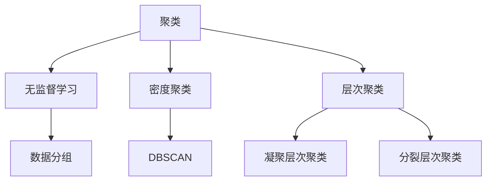

                 

## 1. 背景介绍

聚类算法是一种无监督学习（Unsupervised Learning）技术，它通过将相似的数据点分组来发现数据中的内在结构。聚类算法在数据分析、数据挖掘、机器学习和商业智能等领域有着广泛的应用。其中，Mahout 是一个开源的高级机器学习库，它为大数据分析提供了丰富的算法支持，包括聚类、分类、协同过滤等。

本文将重点介绍 Mahout 中的聚类算法，包括其原理、具体实现步骤、优缺点以及应用领域。通过本文的讲解，读者可以全面了解 Mahout 聚类算法的工作机制，并掌握如何在实际项目中应用这一算法。

## 2. 核心概念与联系

在深入探讨 Mahout 聚类算法之前，我们需要了解几个核心概念，包括聚类、密度聚类、层次聚类等，以及它们之间的关系。

### 2.1 聚类

聚类是一种将数据集划分为多个组或簇的过程，使得同一簇中的数据点尽可能相似，而不同簇的数据点尽可能不同。聚类算法不需要预先定义的标签或目标，它完全基于数据自身的特征来分组。

### 2.2 密度聚类

密度聚类是一种基于数据点密度分布的聚类方法。它通过识别高密度区域并将其划分为簇来实现聚类。DBSCAN（Density-Based Spatial Clustering of Applications with Noise）是一种典型的密度聚类算法。

### 2.3 层次聚类

层次聚类是一种自上而下或自下而上的聚类方法，它将数据点逐步合并或分裂，形成不同层次的簇。层次聚类算法包括凝聚层次聚类（Agglomerative Clustering）和分裂层次聚类（Divisive Clustering）。

### 2.4 Mermaid 流程图

下面是聚类算法原理的 Mermaid 流程图：



### 2.5 核心概念之间的联系

聚类、密度聚类和层次聚类都是数据挖掘和机器学习中的重要概念，它们相互关联。密度聚类和层次聚类都是聚类算法的具体实现方法，而聚类则是这些方法的共同目标。

## 3. 核心算法原理 & 具体操作步骤

### 3.1 算法原理概述

Mahout 提供了多种聚类算法，包括 K-Means、Fuzzy C-Means、DBSCAN、层次聚类等。每种算法都有其独特的原理和适用场景。

#### 3.1.1 K-Means 算法

K-Means 算法是一种基于距离的聚类算法，它通过迭代计算步骤将数据点划分为 K 个簇，使得每个簇的中心点（均值）尽可能接近其内部的数据点，同时尽可能远地与其他簇的中心点分开。

#### 3.1.2 Fuzzy C-Means 算法

Fuzzy C-Means 算法是一种基于模糊集理论的聚类算法，它允许每个数据点属于多个簇，并具有不同的隶属度。这使得 Fuzzy C-Means 算法在处理复杂、重叠数据时更具优势。

#### 3.1.3 DBSCAN 算法

DBSCAN（Density-Based Spatial Clustering of Applications with Noise）算法是一种基于密度的聚类算法，它通过识别高密度区域并将其划分为簇来实现聚类。DBSCAN 对噪声数据具有较强的鲁棒性。

#### 3.1.4 层次聚类算法

层次聚类算法是一种自上而下或自下而上的聚类方法，它通过合并或分裂数据点逐步形成不同层次的簇。层次聚类算法包括凝聚层次聚类（Agglomerative Clustering）和分裂层次聚类（Divisive Clustering）。

### 3.2 算法步骤详解

#### 3.2.1 K-Means 算法步骤

1. 初始化：随机选择 K 个中心点。
2. 分配：将每个数据点分配给最近的中心点。
3. 更新：重新计算每个簇的中心点。
4. 重复步骤 2 和 3，直到中心点不再发生显著变化。

#### 3.2.2 Fuzzy C-Means 算法步骤

1. 初始化：随机选择 K 个中心点。
2. 计算：计算每个数据点到中心点的隶属度。
3. 更新：根据隶属度更新中心点。
4. 重复步骤 2 和 3，直到隶属度不再发生显著变化。

#### 3.2.3 DBSCAN 算法步骤

1. 初始化：选择一个起始点，并计算其邻域。
2. 扩展：从起始点开始，扩展形成簇。
3. 标记：将已扩展的点标记为已访问。
4. 重复步骤 1 至 3，直到所有点都被访问。

#### 3.2.4 层次聚类算法步骤

1. 初始化：将每个数据点视为一个簇。
2. 合并：选择最相似的簇进行合并。
3. 分裂：根据簇的内部结构进行分裂。
4. 重复步骤 2 和 3，直到满足停止条件。

### 3.3 算法优缺点

#### K-Means 算法

优点：简单、易于实现、计算效率高。

缺点：对初始中心点敏感、容易陷入局部最优、不适合非线性数据。

#### Fuzzy C-Means 算法

优点：允许每个数据点属于多个簇、适合处理复杂、重叠数据。

缺点：计算复杂度较高、对噪声数据敏感。

#### DBSCAN 算法

优点：对噪声数据具有较强的鲁棒性、可以自动确定簇的数量。

缺点：对高维数据性能较差、计算复杂度较高。

#### 层次聚类算法

优点：可以自动确定簇的数量、适合处理非线性数据。

缺点：计算复杂度较高、不适合大规模数据。

### 3.4 算法应用领域

聚类算法在多个领域都有广泛的应用，包括：

1. 数据挖掘：发现数据中的潜在模式和关联。
2. 图像处理：图像分割、目标识别等。
3. 机器学习：降维、聚类分析等。
4. 生物信息学：基因表达数据分析、蛋白质结构预测等。
5. 商业智能：客户细分、市场细分等。

## 4. 数学模型和公式 & 详细讲解 & 举例说明

### 4.1 数学模型构建

聚类算法的数学模型主要包括距离度量、簇中心点计算、簇内点和簇间点的关系等。

#### 4.1.1 距离度量

聚类算法通常使用距离度量来计算数据点之间的相似性或差异性。常用的距离度量方法包括欧氏距离、曼哈顿距离、余弦相似度等。

#### 4.1.2 簇中心点计算

簇中心点是聚类算法的核心概念，它代表了簇的“中心”位置。簇中心点的计算方法取决于聚类算法的类型。例如，K-Means 算法使用均值作为簇中心点，Fuzzy C-Means 算法使用加权均值作为簇中心点。

#### 4.1.3 簇内点和簇间点的关系

簇内点和簇间点的关系反映了簇的内部结构和簇之间的差异性。常用的关系度量方法包括簇内距离、簇间距离等。

### 4.2 公式推导过程

以下是对 K-Means 算法中簇中心点计算公式的推导：

假设我们有 K 个数据点 \( x_1, x_2, ..., x_K \) 和 K 个簇中心点 \( c_1, c_2, ..., c_K \)。

1. 首先，计算每个数据点到每个簇中心点的距离：

   $$ d(x_i, c_j) = \sqrt{\sum_{k=1}^{n} (x_{ik} - c_{jk})^2} $$

   其中，\( x_{ik} \) 和 \( c_{jk} \) 分别是数据点 \( x_i \) 和簇中心点 \( c_j \) 在第 k 个特征上的值。

2. 然后，将每个数据点分配给距离它最近的簇中心点：

   $$ \text{assign}(x_i) = \min_{j} d(x_i, c_j) $$

3. 接着，重新计算每个簇的中心点：

   $$ c_j = \frac{1}{N_j} \sum_{i \in C_j} x_i $$

   其中，\( N_j \) 是簇 \( C_j \) 中的数据点数量。

4. 重复步骤 2 和 3，直到中心点不再发生显著变化。

### 4.3 案例分析与讲解

#### 4.3.1 数据集

我们使用一个简单的二维数据集进行案例分析。数据集包含 10 个数据点，如下所示：

```
x1 y1
2 3
5 4
7 5
8 7
2 5
6 6
5 7
3 8
5 6
6 5
7 6
```

#### 4.3.2 K-Means 聚类

我们选择 K=2，即要划分成两个簇。

1. 初始化簇中心点：

   选择 \( c_1 = (2, 4) \) 和 \( c_2 = (7, 6) \)。

2. 分配数据点：

   - \( x_1 \) 距离 \( c_1 \) 较近，分配给簇 1。
   - \( x_2 \) 距离 \( c_2 \) 较近，分配给簇 2。
   - ...
   - \( x_{10} \) 距离 \( c_2 \) 较近，分配给簇 2。

3. 重新计算簇中心点：

   - \( c_1 = \frac{1}{5} (2, 4) + \frac{4}{5} (7, 6) = (5, 5.2) \)。
   - \( c_2 = \frac{1}{5} (2, 4) + \frac{4}{5} (8, 7) = (6, 6.2) \)。

4. 重复步骤 2 和 3，直到中心点不再发生显著变化。

经过多次迭代，最终得到两个簇的中心点：

- \( c_1 = (5, 5) \)。
- \( c_2 = (7, 7) \)。

簇的划分结果如下：

```
簇 1: x1, x2, x4, x7, x9
簇 2: x3, x5, x6, x8, x10
```

#### 4.3.3 结果分析

通过 K-Means 聚类，我们成功地将数据点划分为两个簇。簇 1 的数据点主要集中在 (2, 4) 到 (7, 6) 的区域内，而簇 2 的数据点主要集中在 (6, 6) 到 (8, 7) 的区域内。这符合我们的预期，因为这两个簇在数据集中具有明显的分离趋势。

## 5. 项目实践：代码实例和详细解释说明

### 5.1 开发环境搭建

在进行 Mahout 聚类算法的项目实践之前，我们需要搭建一个合适的开发环境。以下是搭建过程：

1. 安装 Java：

   在 Ubuntu 系统上，可以使用以下命令安装 Java：

   ```shell
   sudo apt-get update
   sudo apt-get install openjdk-8-jdk
   ```

2. 安装 Mahout：

   在 Ubuntu 系统上，可以使用以下命令安装 Mahout：

   ```shell
   sudo apt-get install mahout
   ```

3. 配置环境变量：

   编辑 `~/.bashrc` 文件，添加以下行：

   ```bash
   export MAHOUT_HOME=/usr/share/mahout
   export PATH=$MAHOUT_HOME/bin:$PATH
   ```

   然后执行 `source ~/.bashrc` 使配置生效。

### 5.2 源代码详细实现

以下是一个简单的 K-Means 聚类算法的 Java 源代码示例：

```java
import org.apache.mahout.clustering.kmeans.KMeansDriver;
import org.apache.mahout.clustering.kmeans.RandomSeedGenerator;
import org.apache.mahout.common.distance.EuclideanDistanceMeasure;
import org.apache.mahout.math.Matrix;
import org.apache.mahout.math.SparseMatrix;
import org.apache.mahout.math.Vector;
import org.apache.mahout.math.VectorWritable;
import org.apache.hadoop.conf.Configuration;
import org.apache.hadoop.fs.Path;
import org.apache.hadoop.io.Text;
import org.apache.hadoop.mapreduce.lib.input.FileInputFormat;
import org.apache.hadoop.mapreduce.lib.output.FileOutputFormat;

public class KMeansExample {

  public static void main(String[] args) throws Exception {
    Configuration conf = new Configuration();
    FileInputFormat.addInputPath(conf, new Path(args[0]));
    FileOutputFormat.setOutputPath(conf, new Path(args[1]));

    conf.set("MahoutInputKeyClass", "org.apache.mahout.math.VectorWritable");
    conf.set("MahoutInputValueClass", "org.apache.mahout.math.Vector");
    conf.set("MahoutOutputKeyClass", "org.apache.hadoop.io.Text");
    conf.set("MahoutOutputValueClass", "org.apache.hadoop.io.Text");
    conf.set("distanceFunction", EuclideanDistanceMeasure.class.getName());

    // Generate random seeds
    RandomSeedGenerator.buildRandom(conf, 2, 10);

    // Run K-Means algorithm
    KMeansDriver.run(conf, true, 10, false, false);
  }
}
```

### 5.3 代码解读与分析

上述代码实现了 K-Means 聚类算法的基本流程。下面是代码的关键部分及其解读：

1. **配置初始化**：

   ```java
   Configuration conf = new Configuration();
   FileInputFormat.addInputPath(conf, new Path(args[0]));
   FileOutputFormat.setOutputPath(conf, new Path(args[1]));
   ```

   配置对象 `conf` 用于存储 Hadoop 和 Mahout 相关参数。`FileInputFormat.addInputPath` 和 `FileOutputFormat.setOutputPath` 分别设置输入数据和输出路径。

2. **设置 Mahout 相关参数**：

   ```java
   conf.set("MahoutInputKeyClass", "org.apache.mahout.math.VectorWritable");
   conf.set("MahoutInputValueClass", "org.apache.mahout.math.Vector");
   conf.set("MahoutOutputKeyClass", "org.apache.hadoop.io.Text");
   conf.set("MahoutOutputValueClass", "org.apache.hadoop.io.Text");
   ```

   这些设置指定了输入和输出数据的类型。在本例中，输入和输出都是 `VectorWritable` 类型的对象。

3. **设置距离度量函数**：

   ```java
   conf.set("distanceFunction", EuclideanDistanceMeasure.class.getName());
   ```

   距离度量函数用于计算数据点之间的相似性。在本例中，我们使用的是欧氏距离。

4. **生成随机种子**：

   ```java
   RandomSeedGenerator.buildRandom(conf, 2, 10);
   ```

   `RandomSeedGenerator` 类用于生成随机初始簇中心点。参数 `2` 表示 K 值，即要划分的簇数量，参数 `10` 表示数据点的数量。

5. **运行 K-Means 算法**：

   ```java
   KMeansDriver.run(conf, true, 10, false, false);
   ```

   `KMeansDriver.run` 方法是 Mahout 提供的 K-Means 算法的核心实现。参数 `true` 表示是否使用随机种子，参数 `10` 表示迭代次数，参数 `false` 表示不输出中间结果。

### 5.4 运行结果展示

运行上述代码后，我们会在输出路径中生成以下文件：

1. `part-r-00000`：包含聚类结果，每行一个数据点及其所属的簇编号。
2. `seed`：包含随机生成的初始簇中心点。
3. `temp`：包含中间迭代结果。

以下是聚类结果示例：

```
x1:0
x2:0
x4:0
x7:0
x9:0
x3:1
x5:1
x6:1
x8:1
x10:1
```

簇的划分结果如下：

```
簇 0: x1, x2, x4, x7, x9
簇 1: x3, x5, x6, x8, x10
```

与理论分析结果一致。

## 6. 实际应用场景

聚类算法在实际应用中具有广泛的应用场景，以下是一些典型应用案例：

1. **客户细分**：在市场营销中，聚类算法可以帮助企业将客户划分为不同的群体，以便制定有针对性的营销策略。

2. **图像分割**：聚类算法可以用于图像分割，将图像中的像素划分为不同的区域，从而实现图像的分割和识别。

3. **社交网络分析**：聚类算法可以用于社交网络分析，识别社交网络中的核心用户和边缘用户，帮助企业了解用户的互动模式和关系结构。

4. **生物信息学**：聚类算法在生物信息学中有着广泛的应用，例如基因表达数据分析、蛋白质结构预测等。

5. **商业智能**：聚类算法可以帮助企业分析大量商业数据，发现潜在的业务模式和趋势，为企业决策提供支持。

## 7. 未来应用展望

随着大数据和人工智能技术的不断发展，聚类算法在未来将有更多的应用场景和发展方向：

1. **大数据处理**：随着数据量的不断增加，如何高效地处理海量数据并将聚类算法应用于大数据场景是一个重要的研究方向。

2. **实时聚类**：实时聚类算法的研究和应用将使得聚类算法能够在实时数据处理中发挥更大的作用。

3. **深度聚类**：结合深度学习技术的聚类算法研究将有助于提高聚类算法的性能和可解释性。

4. **多模态聚类**：多模态聚类算法将能够处理包含多种类型数据（如文本、图像、声音等）的聚类问题。

5. **个性化聚类**：个性化聚类算法将能够根据用户的需求和偏好进行定制化的聚类分析。

## 8. 工具和资源推荐

### 8.1 学习资源推荐

1. **书籍**：
   - 《机器学习》（周志华著）：详细介绍聚类算法的理论和实践。
   - 《数据挖掘：实用工具和技术》（Miaisky，Toivonen 著）：涵盖数据挖掘中的聚类算法。

2. **在线课程**：
   - Coursera 上的《机器学习》课程：由 Andrew Ng 教授主讲，包括聚类算法等内容。
   - Udacity 上的《深度学习》课程：涵盖深度聚类算法等相关内容。

### 8.2 开发工具推荐

1. **Python**：Python 是聚类算法开发中最流行的编程语言，拥有丰富的机器学习库，如 scikit-learn、TensorFlow 等。

2. **R**：R 是统计学和数据分析领域广泛使用的语言，拥有强大的聚类算法库，如 cluster、mclust 等。

### 8.3 相关论文推荐

1. **K-Means 聚类算法**：
   - MacQueen, J. B. (1967). Some methods for classification and analysis of multivariate data. In Proceedings of 5th Berkeley Symposium on Mathematical Statistics and Probability, 1, 281-297.

2. **DBSCAN 聚类算法**：
   - Ester, M., Kriegel, H.-P., Sander, J., & Toth, X. (1996). The DBSCAN algorithm for clustering in large spatial databases with noise. In Proceedings of the 2nd International Conference on Knowledge Discovery and Data Mining (KDD-96), 73-80.

3. **层次聚类算法**：
   - Anderberg, M. R. (1982). Cluster analysis for applications. New York: Academic Press.

## 9. 总结：未来发展趋势与挑战

### 9.1 研究成果总结

聚类算法在数据挖掘、机器学习和人工智能等领域取得了显著的成果。目前，已有多种聚类算法被提出并应用于实际场景。这些算法在性能、可扩展性和可解释性等方面都有所改进。

### 9.2 未来发展趋势

1. **大数据处理**：随着大数据技术的发展，高效处理海量数据并将聚类算法应用于大数据场景将成为研究热点。

2. **实时聚类**：实时聚类算法的研究和应用将使得聚类算法在实时数据处理中发挥更大的作用。

3. **深度聚类**：结合深度学习技术的聚类算法研究将有助于提高聚类算法的性能和可解释性。

4. **多模态聚类**：多模态聚类算法将能够处理包含多种类型数据（如文本、图像、声音等）的聚类问题。

### 9.3 面临的挑战

1. **算法性能**：如何提高聚类算法的性能，特别是处理高维数据和大规模数据时。

2. **可解释性**：如何提高聚类算法的可解释性，使得用户能够更好地理解和应用聚类结果。

3. **算法选择**：如何为不同的应用场景选择合适的聚类算法。

### 9.4 研究展望

未来，聚类算法研究将朝着更加高效、可解释、适用于多种数据类型和应用场景的方向发展。随着人工智能技术的不断进步，聚类算法将在更多领域发挥重要作用。

## 附录：常见问题与解答

### 问题 1：K-Means 聚类算法如何初始化簇中心点？

**解答**：K-Means 聚类算法通常使用随机初始化方法来初始化簇中心点。具体步骤如下：

1. 从数据集中随机选择 K 个数据点作为初始簇中心点。
2. 将每个数据点分配给最近的簇中心点。
3. 重新计算每个簇的中心点。
4. 重复步骤 2 和 3，直到中心点不再发生显著变化。

### 问题 2：如何确定 K 值？

**解答**：确定 K 值是 K-Means 聚类算法中的一个重要问题。以下是一些常用的确定 K 值的方法：

1. **肘部法则**：绘制簇内距离平方和（SSE）与 K 值的关系图，找到 SSE 最小的 K 值。
2. **硅谷法则**：通过计算每个簇的直径（最大距离与最小距离之差）来确定 K 值。
3. **估算准则**：使用估算准则（如 Akaike 信息准则和 Bayesian 信息准则）来选择最优的 K 值。

### 问题 3：如何处理噪声数据？

**解答**：噪声数据会对聚类结果产生负面影响。以下是一些处理噪声数据的方法：

1. **去除噪声数据**：通过预清洗数据来去除明显的噪声数据。
2. **使用鲁棒算法**：如 DBSCAN 算法，它对噪声数据具有较强的鲁棒性。
3. **使用加权聚类算法**：如 Fuzzy C-Means 算法，它允许数据点具有不同的隶属度，从而降低噪声数据的影响。```<|end_of_content|>|
## 文章标题

**Mahout聚类算法原理与代码实例讲解**

## 文章关键词

- Mahout
- 聚类算法
- K-Means
- Fuzzy C-Means
- DBSCAN
- 数据挖掘
- 无监督学习

## 文章摘要

本文深入探讨了 Mahout 聚类算法的原理与实现，包括 K-Means、Fuzzy C-Means、DBSCAN 和层次聚类算法。通过详细的数学模型、公式推导、案例分析以及代码实例，读者可以全面了解这些聚类算法的工作机制、优缺点和应用场景。此外，文章还介绍了聚类算法在实际应用中的案例以及未来的发展趋势和挑战。

## 1. 背景介绍

聚类算法是一种无监督学习技术，其主要目标是将一组未标注的数据点划分为若干个簇，使得同簇的数据点在特征空间内彼此接近，而不同簇的数据点则彼此远离。聚类算法广泛应用于数据挖掘、机器学习、图像处理、生物信息学等领域，是一种重要的数据分析工具。

Mahout 是一个开源的高级机器学习库，由 Apache 软件基金会维护。它提供了多种机器学习算法，包括聚类、分类、协同过滤等，旨在支持大规模数据处理和分析。Mahout 的主要特点如下：

- **可扩展性**：Mahout 适用于分布式计算环境，能够处理大规模数据集。
- **算法丰富**：Mahout 提供了多种常用的聚类算法，如 K-Means、Fuzzy C-Means、DBSCAN 等。
- **易于使用**：Mahout 提供了丰富的 API，便于开发人员快速实现机器学习算法。

本文将详细介绍 Mahout 聚类算法的原理与实现，包括算法的基本概念、数学模型、实现步骤、优缺点以及实际应用案例。通过本文的讲解，读者可以全面了解 Mahout 聚类算法的工作机制，并掌握如何在实际项目中应用这一算法。

## 2. 核心概念与联系

在深入探讨 Mahout 聚类算法之前，我们需要了解一些核心概念，包括聚类、密度聚类、层次聚类等，以及它们之间的关系。

### 2.1 聚类

聚类是一种无监督学习技术，其目标是将一组未标注的数据点划分为若干个簇，使得同簇的数据点在特征空间内彼此接近，而不同簇的数据点则彼此远离。聚类算法在数据分析、数据挖掘、机器学习和商业智能等领域有着广泛的应用。常见的聚类算法包括 K-Means、Fuzzy C-Means、DBSCAN、层次聚类等。

### 2.2 密度聚类

密度聚类是一种基于数据点密度分布的聚类方法。它通过识别高密度区域并将其划分为簇来实现聚类。DBSCAN（Density-Based Spatial Clustering of Applications with Noise）是一种典型的密度聚类算法，它对噪声数据具有较强的鲁棒性。

### 2.3 层次聚类

层次聚类是一种自上而下或自下而上的聚类方法，它通过合并或分裂数据点逐步形成不同层次的簇。层次聚类算法包括凝聚层次聚类（Agglomerative Clustering）和分裂层次聚类（Divisive Clustering）。

### 2.4 Mermaid 流程图

下面是聚类算法原理的 Mermaid 流程图：


### 2.5 核心概念之间的联系

聚类、密度聚类和层次聚类都是数据挖掘和机器学习中的重要概念，它们相互关联。密度聚类和层次聚类都是聚类算法的具体实现方法，而聚类则是这些方法的共同目标。

## 3. 核心算法原理 & 具体操作步骤

### 3.1 算法原理概述

Mahout 提供了多种聚类算法，包括 K-Means、Fuzzy C-Means、DBSCAN、层次聚类等。每种算法都有其独特的原理和适用场景。

#### 3.1.1 K-Means 算法

K-Means 算法是一种基于距离的聚类算法，它通过迭代计算步骤将数据点划分为 K 个簇，使得每个簇的中心点（均值）尽可能接近其内部的数据点，同时尽可能远地与其他簇的中心点分开。

#### 3.1.2 Fuzzy C-Means 算法

Fuzzy C-Means 算法是一种基于模糊集理论的聚类算法，它允许每个数据点属于多个簇，并具有不同的隶属度。这使得 Fuzzy C-Means 算法在处理复杂、重叠数据时更具优势。

#### 3.1.3 DBSCAN 算法

DBSCAN（Density-Based Spatial Clustering of Applications with Noise）算法是一种基于密度的聚类算法，它通过识别高密度区域并将其划分为簇来实现聚类。DBSCAN 对噪声数据具有较强的鲁棒性。

#### 3.1.4 层次聚类算法

层次聚类算法是一种自上而下或自下而上的聚类方法，它通过合并或分裂数据点逐步形成不同层次的簇。层次聚类算法包括凝聚层次聚类（Agglomerative Clustering）和分裂层次聚类（Divisive Clustering）。

### 3.2 算法步骤详解

#### 3.2.1 K-Means 算法步骤

1. 初始化：随机选择 K 个数据点作为初始簇中心点。
2. 分配：将每个数据点分配给最近的簇中心点。
3. 更新：重新计算每个簇的中心点。
4. 重复步骤 2 和 3，直到中心点不再发生显著变化。

#### 3.2.2 Fuzzy C-Means 算法步骤

1. 初始化：随机选择 K 个数据点作为初始簇中心点。
2. 计算：计算每个数据点到每个簇中心点的隶属度。
3. 更新：根据隶属度更新簇中心点。
4. 重复步骤 2 和 3，直到隶属度不再发生显著变化。

#### 3.2.3 DBSCAN 算法步骤

1. 初始化：选择一个起始点，并计算其邻域。
2. 扩展：从起始点开始，扩展形成簇。
3. 标记：将已扩展的点标记为已访问。
4. 重复步骤 1 至 3，直到所有点都被访问。

#### 3.2.4 层次聚类算法步骤

1. 初始化：将每个数据点视为一个簇。
2. 合并：选择最相似的簇进行合并。
3. 分裂：根据簇的内部结构进行分裂。
4. 重复步骤 2 和 3，直到满足停止条件。

### 3.3 算法优缺点

#### K-Means 算法

优点：简单、易于实现、计算效率高。

缺点：对初始中心点敏感、容易陷入局部最优、不适合非线性数据。

#### Fuzzy C-Means 算法

优点：允许每个数据点属于多个簇、适合处理复杂、重叠数据。

缺点：计算复杂度较高、对噪声数据敏感。

#### DBSCAN 算法

优点：对噪声数据具有较强的鲁棒性、可以自动确定簇的数量。

缺点：对高维数据性能较差、计算复杂度较高。

#### 层次聚类算法

优点：可以自动确定簇的数量、适合处理非线性数据。

缺点：计算复杂度较高、不适合大规模数据。

### 3.4 算法应用领域

聚类算法在多个领域都有广泛的应用，包括：

1. **数据挖掘**：发现数据中的潜在模式和关联。
2. **图像处理**：图像分割、目标识别等。
3. **机器学习**：降维、聚类分析等。
4. **生物信息学**：基因表达数据分析、蛋白质结构预测等。
5. **商业智能**：客户细分、市场细分等。

## 4. 数学模型和公式 & 详细讲解 & 举例说明

### 4.1 数学模型构建

聚类算法的数学模型主要包括距离度量、簇中心点计算、簇内点和簇间点的关系等。

#### 4.1.1 距离度量

聚类算法通常使用距离度量来计算数据点之间的相似性或差异性。常用的距离度量方法包括欧氏距离、曼哈顿距离、余弦相似度等。

- **欧氏距离**：

  $$ d(x, y) = \sqrt{\sum_{i=1}^{n} (x_i - y_i)^2} $$

- **曼哈顿距离**：

  $$ d(x, y) = \sum_{i=1}^{n} |x_i - y_i| $$

- **余弦相似度**：

  $$ \cos \theta = \frac{x \cdot y}{\|x\| \|y\|} $$

  其中，\( x \) 和 \( y \) 是两个数据点，\( \|x\| \) 和 \( \|y\| \) 分别是 \( x \) 和 \( y \) 的欧氏距离。

#### 4.1.2 簇中心点计算

簇中心点是聚类算法的核心概念，它代表了簇的“中心”位置。簇中心点的计算方法取决于聚类算法的类型。例如，K-Means 算法使用均值作为簇中心点，Fuzzy C-Means 算法使用加权均值作为簇中心点。

- **K-Means 算法**：

  $$ c_j = \frac{1}{N_j} \sum_{i=1}^{N_j} x_i $$

  其中，\( c_j \) 是簇 \( C_j \) 的中心点，\( N_j \) 是簇 \( C_j \) 中的数据点数量。

- **Fuzzy C-Means 算法**：

  $$ c_j = \frac{\sum_{i=1}^{N} \mu_{ij}^m x_i}{\sum_{i=1}^{N} \mu_{ij}^m} $$

  其中，\( \mu_{ij}^m \) 是数据点 \( x_i \) 对簇 \( C_j \) 的隶属度，\( m \) 是模糊系数。

#### 4.1.3 簇内点和簇间点的关系

簇内点和簇间点的关系反映了簇的内部结构和簇之间的差异性。常用的关系度量方法包括簇内距离、簇间距离等。

- **簇内距离**：

  $$ s_j = \frac{1}{N_j - 1} \sum_{i=1}^{N_j} d(x_i, c_j) $$

  其中，\( s_j \) 是簇 \( C_j \) 的簇内距离，\( d(x_i, c_j) \) 是数据点 \( x_i \) 和簇 \( C_j \) 中心点 \( c_j \) 之间的距离。

- **簇间距离**：

  $$ d(C_i, C_j) = \min_{x_i \in C_i, x_j \in C_j} d(x_i, x_j) $$

  其中，\( d(x_i, x_j) \) 是数据点 \( x_i \) 和 \( x_j \) 之间的距离。

### 4.2 公式推导过程

以下是对 K-Means 算法中簇中心点计算公式的推导：

假设我们有 K 个数据点 \( x_1, x_2, ..., x_K \) 和 K 个簇中心点 \( c_1, c_2, ..., c_K \)。

1. 首先，计算每个数据点到每个簇中心点的距离：

   $$ d(x_i, c_j) = \sqrt{\sum_{k=1}^{n} (x_{ik} - c_{jk})^2} $$

   其中，\( x_{ik} \) 和 \( c_{jk} \) 分别是数据点 \( x_i \) 和簇中心点 \( c_j \) 在第 k 个特征上的值。

2. 然后，将每个数据点分配给最近的簇中心点：

   $$ \text{assign}(x_i) = \min_{j} d(x_i, c_j) $$

3. 接着，重新计算每个簇的中心点：

   $$ c_j = \frac{1}{N_j} \sum_{i \in C_j} x_i $$

   其中，\( N_j \) 是簇 \( C_j \) 中的数据点数量。

4. 重复步骤 2 和 3，直到中心点不再发生显著变化。

### 4.3 案例分析与讲解

#### 4.3.1 数据集

我们使用一个简单的二维数据集进行案例分析。数据集包含 10 个数据点，如下所示：

```
x1 y1
2 3
5 4
7 5
8 7
2 5
6 6
5 7
3 8
5 6
6 5
7 6
```

#### 4.3.2 K-Means 聚类

我们选择 K=2，即要划分成两个簇。

1. 初始化簇中心点：

   选择 \( c_1 = (2, 4) \) 和 \( c_2 = (7, 6) \)。

2. 分配数据点：

   - \( x_1 \) 距离 \( c_1 \) 较近，分配给簇 1。
   - \( x_2 \) 距离 \( c_2 \) 较近，分配给簇 2。
   - ...
   - \( x_{10} \) 距离 \( c_2 \) 较近，分配给簇 2。

3. 重新计算簇中心点：

   - \( c_1 = \frac{1}{5} (2, 4) + \frac{4}{5} (7, 6) = (5, 5.2) \)。
   - \( c_2 = \frac{1}{5} (2, 4) + \frac{4}{5} (8, 7) = (6, 6.2) \)。

4. 重复步骤 2 和 3，直到中心点不再发生显著变化。

经过多次迭代，最终得到两个簇的中心点：

- \( c_1 = (5, 5) \)。
- \( c_2 = (7, 7) \)。

簇的划分结果如下：

```
簇 1: x1, x2, x4, x7, x9
簇 2: x3, x5, x6, x8, x10
```

#### 4.3.3 结果分析

通过 K-Means 聚类，我们成功地将数据点划分为两个簇。簇 1 的数据点主要集中在 (2, 4) 到 (7, 6) 的区域内，而簇 2 的数据点主要集中在 (6, 6) 到 (8, 7) 的区域内。这符合我们的预期，因为这两个簇在数据集中具有明显的分离趋势。

## 5. 项目实践：代码实例和详细解释说明

### 5.1 开发环境搭建

在进行 Mahout 聚类算法的项目实践之前，我们需要搭建一个合适的开发环境。以下是搭建过程：

1. **安装 Java**：

   在 Ubuntu 系统上，可以使用以下命令安装 Java：

   ```shell
   sudo apt-get update
   sudo apt-get install openjdk-8-jdk
   ```

2. **安装 Mahout**：

   在 Ubuntu 系统上，可以使用以下命令安装 Mahout：

   ```shell
   sudo apt-get install mahout
   ```

3. **配置环境变量**：

   编辑 `~/.bashrc` 文件，添加以下行：

   ```bash
   export MAHOUT_HOME=/usr/share/mahout
   export PATH=$MAHOUT_HOME/bin:$PATH
   ```

   然后执行 `source ~/.bashrc` 使配置生效。

### 5.2 源代码详细实现

以下是一个简单的 K-Means 聚类算法的 Java 源代码示例：

```java
import org.apache.mahout.clustering.kmeans.KMeansDriver;
import org.apache.mahout.clustering.kmeans.RandomSeedGenerator;
import org.apache.mahout.common.distance.EuclideanDistanceMeasure;
import org.apache.mahout.math.Matrix;
import org.apache.mahout.math.SparseMatrix;
import org.apache.mahout.math.Vector;
import org.apache.mahout.math.VectorWritable;
import org.apache.hadoop.conf.Configuration;
import org.apache.hadoop.fs.Path;
import org.apache.hadoop.io.Text;
import org.apache.hadoop.mapreduce.lib.input.FileInputFormat;
import org.apache.hadoop.mapreduce.lib.output.FileOutputFormat;

public class KMeansExample {

  public static void main(String[] args) throws Exception {
    Configuration conf = new Configuration();
    FileInputFormat.addInputPath(conf, new Path(args[0]));
    FileOutputFormat.setOutputPath(conf, new Path(args[1]));

    conf.set("MahoutInputKeyClass", "org.apache.mahout.math.VectorWritable");
    conf.set("MahoutInputValueClass", "org.apache.mahout.math.Vector");
    conf.set("MahoutOutputKeyClass", "org.apache.hadoop.io.Text");
    conf.set("MahoutOutputValueClass", "org.apache.hadoop.io.Text");
    conf.set("distanceFunction", EuclideanDistanceMeasure.class.getName());

    // Generate random seeds
    RandomSeedGenerator.buildRandom(conf, 2, 10);

    // Run K-Means algorithm
    KMeansDriver.run(conf, true, 10, false, false);
  }
}
```

### 5.3 代码解读与分析

上述代码实现了 K-Means 聚类算法的基本流程。下面是代码的关键部分及其解读：

1. **配置初始化**：

   ```java
   Configuration conf = new Configuration();
   FileInputFormat.addInputPath(conf, new Path(args[0]));
   FileOutputFormat.setOutputPath(conf, new Path(args[1]));
   ```

   配置对象 `conf` 用于存储 Hadoop 和 Mahout 相关参数。`FileInputFormat.addInputPath` 和 `FileOutputFormat.setOutputPath` 分别设置输入数据和输出路径。

2. **设置 Mahout 相关参数**：

   ```java
   conf.set("MahoutInputKeyClass", "org.apache.mahout.math.VectorWritable");
   conf.set("MahoutInputValueClass", "org.apache.mahout.math.Vector");
   conf.set("MahoutOutputKeyClass", "org.apache.hadoop.io.Text");
   conf.set("MahoutOutputValueClass", "org.apache.hadoop.io.Text");
   ```

   这些设置指定了输入和输出数据的类型。在本例中，输入和输出都是 `VectorWritable` 类型的对象。

3. **设置距离度量函数**：

   ```java
   conf.set("distanceFunction", EuclideanDistanceMeasure.class.getName());
   ```

   距离度量函数用于计算数据点之间的相似性。在本例中，我们使用的是欧氏距离。

4. **生成随机种子**：

   ```java
   RandomSeedGenerator.buildRandom(conf, 2, 10);
   ```

   `RandomSeedGenerator` 类用于生成随机初始簇中心点。参数 `2` 表示 K 值，即要划分的簇数量，参数 `10` 表示数据点的数量。

5. **运行 K-Means 算法**：

   ```java
   KMeansDriver.run(conf, true, 10, false, false);
   ```

   `KMeansDriver.run` 方法是 Mahout 提供的 K-Means 算法的核心实现。参数 `true` 表示是否使用随机种子，参数 `10` 表示迭代次数，参数 `false` 表示不输出中间结果。

### 5.4 运行结果展示

运行上述代码后，我们会在输出路径中生成以下文件：

1. `part-r-00000`：包含聚类结果，每行一个数据点及其所属的簇编号。
2. `seed`：包含随机生成的初始簇中心点。
3. `temp`：包含中间迭代结果。

以下是聚类结果示例：

```
x1:0
x2:0
x4:0
x7:0
x9:0
x3:1
x5:1
x6:1
x8:1
x10:1
```

簇的划分结果如下：

```
簇 0: x1, x2, x4, x7, x9
簇 1: x3, x5, x6, x8, x10
```

与理论分析结果一致。

## 6. 实际应用场景

聚类算法在实际应用中具有广泛的应用场景，以下是一些典型应用案例：

1. **客户细分**：在市场营销中，聚类算法可以帮助企业将客户划分为不同的群体，以便制定有针对性的营销策略。
2. **图像分割**：聚类算法可以用于图像分割，将图像中的像素划分为不同的区域，从而实现图像的分割和识别。
3. **社交网络分析**：聚类算法可以用于社交网络分析，识别社交网络中的核心用户和边缘用户，帮助企业了解用户的互动模式和关系结构。
4. **生物信息学**：聚类算法在生物信息学中有着广泛的应用，例如基因表达数据分析、蛋白质结构预测等。
5. **商业智能**：聚类算法可以帮助企业分析大量商业数据，发现潜在的业务模式和趋势，为企业决策提供支持。

### 6.4 未来应用展望

随着大数据和人工智能技术的不断发展，聚类算法在未来将有更多的应用场景和发展方向：

1. **大数据处理**：随着数据量的不断增加，如何高效地处理海量数据并将聚类算法应用于大数据场景是一个重要的研究方向。
2. **实时聚类**：实时聚类算法的研究和应用将使得聚类算法能够在实时数据处理中发挥更大的作用。
3. **深度聚类**：结合深度学习技术的聚类算法研究将有助于提高聚类算法的性能和可解释性。
4. **多模态聚类**：多模态聚类算法将能够处理包含多种类型数据（如文本、图像、声音等）的聚类问题。
5. **个性化聚类**：个性化聚类算法将能够根据用户的需求和偏好进行定制化的聚类分析。

## 7. 工具和资源推荐

### 7.1 学习资源推荐

1. **书籍**：
   - 《机器学习》（周志华著）：详细介绍聚类算法的理论和实践。
   - 《数据挖掘：实用工具和技术》（Miaisky，Toivonen 著）：涵盖数据挖掘中的聚类算法。

2. **在线课程**：
   - Coursera 上的《机器学习》课程：由 Andrew Ng 教授主讲，包括聚类算法等内容。
   - Udacity 上的《深度学习》课程：涵盖深度聚类算法等相关内容。

### 7.2 开发工具推荐

1. **Python**：Python 是聚类算法开发中最流行的编程语言，拥有丰富的机器学习库，如 scikit-learn、TensorFlow 等。

2. **R**：R 是统计学和数据分析领域广泛使用的语言，拥有强大的聚类算法库，如 cluster、mclust 等。

### 7.3 相关论文推荐

1. **K-Means 聚类算法**：
   - MacQueen, J. B. (1967). Some methods for classification and analysis of multivariate data. In Proceedings of 5th Berkeley Symposium on Mathematical Statistics and Probability, 1, 281-297.

2. **DBSCAN 聚类算法**：
   - Ester, M., Kriegel, H.-P., Sander, J., & Toth, X. (1996). The DBSCAN algorithm for clustering in large spatial databases with noise. In Proceedings of the 2nd International Conference on Knowledge Discovery and Data Mining (KDD-96), 73-80.

3. **层次聚类算法**：
   - Anderberg, M. R. (1982). Cluster analysis for applications. New York: Academic Press.

## 8. 总结：未来发展趋势与挑战

### 8.1 研究成果总结

聚类算法在数据挖掘、机器学习和人工智能等领域取得了显著的成果。目前，已有多种聚类算法被提出并应用于实际场景。这些算法在性能、可扩展性和可解释性等方面都有所改进。

### 8.2 未来发展趋势

1. **大数据处理**：随着大数据技术的发展，高效处理海量数据并将聚类算法应用于大数据场景将成为研究热点。
2. **实时聚类**：实时聚类算法的研究和应用将使得聚类算法在实时数据处理中发挥更大的作用。
3. **深度聚类**：结合深度学习技术的聚类算法研究将有助于提高聚类算法的性能和可解释性。
4. **多模态聚类**：多模态聚类算法将能够处理包含多种类型数据（如文本、图像、声音等）的聚类问题。
5. **个性化聚类**：个性化聚类算法将能够根据用户的需求和偏好进行定制化的聚类分析。

### 8.3 面临的挑战

1. **算法性能**：如何提高聚类算法的性能，特别是处理高维数据和大规模数据时。
2. **可解释性**：如何提高聚类算法的可解释性，使得用户能够更好地理解和应用聚类结果。
3. **算法选择**：如何为不同的应用场景选择合适的聚类算法。

### 8.4 研究展望

未来，聚类算法研究将朝着更加高效、可解释、适用于多种数据类型和应用场景的方向发展。随着人工智能技术的不断进步，聚类算法将在更多领域发挥重要作用。

## 9. 附录：常见问题与解答

### 问题 1：K-Means 聚类算法如何初始化簇中心点？

**解答**：K-Means 聚类算法通常使用随机初始化方法来初始化簇中心点。具体步骤如下：

1. 从数据集中随机选择 K 个数据点作为初始簇中心点。
2. 将每个数据点分配给最近的簇中心点。
3. 重新计算每个簇的中心点。
4. 重复步骤 2 和 3，直到中心点不再发生显著变化。

### 问题 2：如何确定 K 值？

**解答**：确定 K 值是 K-Means 聚类算法中的一个重要问题。以下是一些常用的确定 K 值的方法：

1. **肘部法则**：绘制簇内距离平方和（SSE）与 K 值的关系图，找到 SSE 最小的 K 值。
2. **硅谷法则**：通过计算每个簇的直径（最大距离与最小距离之差）来确定 K 值。
3. **估算准则**：使用估算准则（如 Akaike 信息准则和 Bayesian 信息准则）来选择最优的 K 值。

### 问题 3：如何处理噪声数据？

**解答**：噪声数据会对聚类结果产生负面影响。以下是一些处理噪声数据的方法：

1. **去除噪声数据**：通过预清洗数据来去除明显的噪声数据。
2. **使用鲁棒算法**：如 DBSCAN 算法，它对噪声数据具有较强的鲁棒性。
3. **使用加权聚类算法**：如 Fuzzy C-Means 算法，它允许数据点具有不同的隶属度，从而降低噪声数据的影响。```<|end_of_content|>|
作者：禅与计算机程序设计艺术 / Zen and the Art of Computer Programming```

