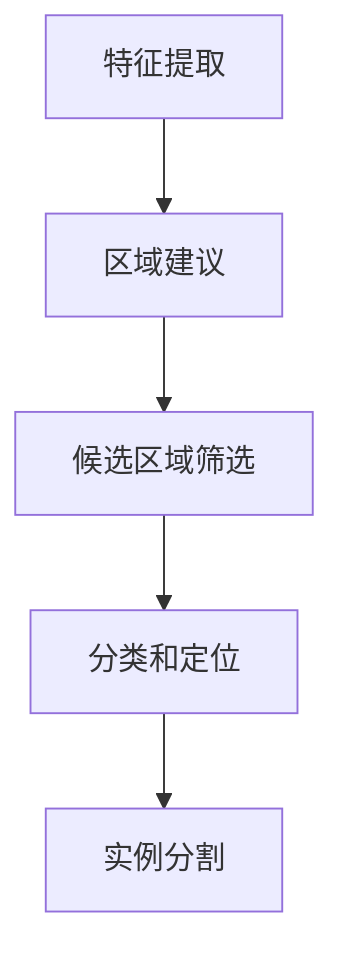

                 

关键词：Mask R-CNN，目标检测，深度学习，图像识别，实例分割，Faster R-CNN，RPN，ROI Align，COCO数据集，TensorFlow，PyTorch

摘要：本文将深入讲解Mask R-CNN的目标检测与实例分割原理，包括其与Faster R-CNN的关系、关键算法模块及其实现细节。通过数学模型和公式的推导，详细解析Mask R-CNN的核心算法，并提供基于TensorFlow和PyTorch的代码实例，帮助读者更好地理解其应用和实现。

## 1. 背景介绍

目标检测（Object Detection）是计算机视觉领域的一个重要研究方向，旨在从图像或视频中识别并定位多个对象。随着深度学习技术的兴起，目标检测在近年取得了显著的进展。Faster R-CNN作为一种深度学习方法，在目标检测任务上取得了显著的性能提升。然而，Faster R-CNN在实例分割（Instance Segmentation）任务上存在一定的局限性。为了解决这一问题，Mask R-CNN应运而生。

Mask R-CNN是在Faster R-CNN的基础上进行扩展的一种深度学习方法，旨在同时实现目标检测和实例分割。与Faster R-CNN相比，Mask R-CNN增加了语义分割（Semantic Segmentation）和实例分割（Instance Segmentation）两个模块，使其能够更好地处理复杂场景中的目标检测任务。

本文将首先介绍Mask R-CNN的基本原理和结构，然后详细解析其核心算法，并通过数学模型和公式的推导，帮助读者深入理解其工作原理。接着，我们将提供基于TensorFlow和PyTorch的代码实例，详细介绍如何实现Mask R-CNN。最后，我们将探讨Mask R-CNN在实际应用场景中的效果和未来发展方向。

## 2. 核心概念与联系

### 2.1 Faster R-CNN

Faster R-CNN是一种基于深度学习的目标检测方法，它由两个主要部分组成：区域建议网络（Region Proposal Network，RPN）和卷积神经网络（Convolutional Neural Network，CNN）。RPN用于生成候选区域（Region Proposal），然后通过CNN对这些候选区域进行分类和定位。

Faster R-CNN的工作流程如下：

1. **特征提取**：使用CNN提取图像的特征图（Feature Map）。
2. **区域建议**：通过RPN生成候选区域。RPN基于特征图上的滑动窗口（Sliding Window）进行预测，包括边界框（Bounding Box）和置信度（Confidence Score）。
3. **候选区域筛选**：对生成的候选区域进行筛选，选取置信度较高的区域作为正负样本。
4. **分类和定位**：使用CNN对筛选后的候选区域进行分类和定位。

### 2.2 Mask R-CNN

Mask R-CNN在Faster R-CNN的基础上进行了扩展，增加了语义分割（Semantic Segmentation）和实例分割（Instance Segmentation）两个模块。这使得Mask R-CNN不仅能够进行目标检测，还能够实现实例级别的语义分割。

Mask R-CNN的工作流程如下：

1. **特征提取**：与Faster R-CNN相同，使用CNN提取图像的特征图。
2. **区域建议**：通过RPN生成候选区域。
3. **候选区域筛选**：与Faster R-CNN相同，对生成的候选区域进行筛选。
4. **分类和定位**：使用CNN对筛选后的候选区域进行分类和定位。
5. **实例分割**：对于每个分类为正类的候选区域，通过ROI Align对特征图进行采样，生成实例分割掩码（Instance Segmentation Mask）。

### 2.3 Mermaid 流程图



### 2.4 关键概念联系

Faster R-CNN和Mask R-CNN都基于CNN进行特征提取和区域建议，但Mask R-CNN在分类和定位的基础上增加了实例分割模块，使其能够处理更复杂的场景。通过语义分割和实例分割，Mask R-CNN能够更好地区分不同对象，提高目标检测的准确性和鲁棒性。

## 3. 核心算法原理 & 具体操作步骤

### 3.1 算法原理概述

Mask R-CNN的核心算法主要包括以下几个部分：

1. **特征提取**：使用CNN提取图像的特征图。
2. **区域建议**：通过RPN生成候选区域。
3. **候选区域筛选**：对生成的候选区域进行筛选。
4. **分类和定位**：使用CNN对筛选后的候选区域进行分类和定位。
5. **实例分割**：对于每个分类为正类的候选区域，通过ROI Align对特征图进行采样，生成实例分割掩码。

### 3.2 算法步骤详解

#### 3.2.1 特征提取

特征提取是Mask R-CNN的基础，它通过CNN提取图像的特征图。在Faster R-CNN中，通常使用ResNet作为主干网络。以下是特征提取的步骤：

1. 输入图像：假设输入图像的大小为\(W \times H \times 3\)。
2. CNN网络：使用ResNet网络对输入图像进行卷积操作，得到特征图。
3. 特征图：假设特征图的大小为\(C \times H' \times W'\)，其中\(C\)为特征图的通道数，\(H'\)和\(W'\)为特征图的高度和宽度。

#### 3.2.2 区域建议

区域建议是通过RPN生成候选区域。RPN是一个全卷积网络，它在特征图上滑动窗口，生成边界框和置信度。以下是区域建议的步骤：

1. 滑动窗口：在特征图上以固定间隔滑动窗口，窗口的大小为\(s \times s\)。
2. 边界框预测：每个窗口生成一个边界框，通过回归操作调整边界框的位置。
3. 置信度预测：每个窗口生成一个置信度，用于判断边界框是否包含目标。
4. 候选区域：根据置信度和阈值筛选候选区域。

#### 3.2.3 候选区域筛选

候选区域筛选是对生成的候选区域进行筛选，选取置信度较高的区域作为正负样本。以下是候选区域筛选的步骤：

1. 正样本：选取置信度较高的区域作为正样本，通常置信度大于0.5。
2. 负样本：选取置信度较低的区域作为负样本，通常置信度小于0.5。
3. 非极大值抑制（Non-maximum Suppression，NMS）：对候选区域进行NMS操作，去除重叠度较高的候选区域。

#### 3.2.4 分类和定位

分类和定位是使用CNN对筛选后的候选区域进行分类和定位。以下是分类和定位的步骤：

1. 边界框回归：对每个候选区域进行边界框回归，调整边界框的位置。
2. 置信度分类：对每个候选区域进行分类，生成分类概率。
3. IOU计算：计算每个候选区域与真实边界框的交并比（Intersection over Union，IOU），用于评估边界框的定位精度。

#### 3.2.5 实例分割

实例分割是对每个分类为正类的候选区域生成实例分割掩码。以下是实例分割的步骤：

1. ROI Align：对每个候选区域进行ROI Align操作，将特征图上的点映射到原始图像上。
2. 特征图采样：对ROI Align后的特征图进行采样，生成掩码特征图。
3. 掩码分类：使用掩码特征图进行分类，生成实例分割掩码。

### 3.3 算法优缺点

#### 优点

1. **多任务学习**：Mask R-CNN同时实现目标检测和实例分割，能够处理更复杂的场景。
2. **准确率高**：通过ROI Align和掩码分类，Mask R-CNN能够生成高质量的实例分割掩码。
3. **灵活性强**：Mask R-CNN可以与其他深度学习模型结合，适用于多种应用场景。

#### 缺点

1. **计算量大**：由于ROI Align和掩码分类的计算复杂度较高，Mask R-CNN的训练和推理时间较长。
2. **对数据量要求较高**：Mask R-CNN的训练需要大量的标注数据，否则容易过拟合。

### 3.4 算法应用领域

Mask R-CNN在目标检测和实例分割任务中具有广泛的应用，包括：

1. **计算机视觉**：用于图像和视频中的目标检测和实例分割。
2. **自动驾驶**：用于识别道路上的行人和车辆。
3. **医学影像**：用于识别医学影像中的病变区域。
4. **工业检测**：用于自动化生产线中的产品检测和质量控制。

## 4. 数学模型和公式 & 详细讲解 & 举例说明

### 4.1 数学模型构建

Mask R-CNN的数学模型主要包括以下部分：

1. **特征提取**：假设特征提取网络为\(F(x)\)，其中\(x\)为输入图像，\(F(x)\)为特征图。
2. **区域建议**：假设区域建议网络为\(R(x, s)\)，其中\(s\)为滑动窗口的大小。
3. **分类和定位**：假设分类和定位网络为\(C(x, r)\)，其中\(r\)为候选区域。
4. **实例分割**：假设实例分割网络为\(M(x, r)\)，其中\(r\)为候选区域。

### 4.2 公式推导过程

#### 4.2.1 特征提取

特征提取的公式为：

\[ F(x) = \text{CNN}(x) \]

其中，CNN为卷积神经网络，用于提取图像特征。

#### 4.2.2 区域建议

区域建议的公式为：

\[ R(x, s) = \text{RPN}(F(x), s) \]

其中，RPN为区域建议网络，用于生成边界框和置信度。

#### 4.2.3 分类和定位

分类和定位的公式为：

\[ C(x, r) = \text{CNN}(r) \]

其中，CNN为卷积神经网络，用于分类和定位。

#### 4.2.4 实例分割

实例分割的公式为：

\[ M(x, r) = \text{ROI Align}(F(x), r) \]

其中，ROI Align为ROI平均池化，用于生成掩码特征图。

### 4.3 案例分析与讲解

假设我们有一个包含一张图像的特征图\(F(x)\)，我们要对这个图像进行区域建议、分类和实例分割。

#### 4.3.1 区域建议

首先，我们对特征图\(F(x)\)进行滑动窗口操作，以\(s \times s\)的窗口大小滑动，生成多个候选区域。然后，通过RPN网络对每个候选区域生成边界框和置信度。

假设我们得到一个候选区域\(r_1\)，其边界框为\(b_1\)，置信度为\(c_1\)。我们可以使用以下公式计算边界框的位置：

\[ b_1 = \text{regression}(b_1') \]

其中，\(b_1'\)为预测的边界框，\(\text{regression}\)为回归操作，用于调整边界框的位置。

#### 4.3.2 分类和定位

接下来，我们对每个候选区域进行分类和定位。假设我们使用一个卷积神经网络\(C(x, r)\)对候选区域\(r_1\)进行分类，生成分类概率\(p_1\)。

\[ p_1 = \text{softmax}(\text{CNN}(r_1)) \]

其中，softmax为分类函数，用于计算每个类别的概率。

然后，我们使用以下公式计算候选区域\(r_1\)与真实边界框的交并比（IOU）：

\[ iou(r_1, b_1) = \frac{|r_1 \cap b_1|}{|r_1 \cup b_1|} \]

其中，\(|r_1 \cap b_1|\)为候选区域\(r_1\)与真实边界框\(b_1\)的交集面积，\(|r_1 \cup b_1|\)为候选区域\(r_1\)与真实边界框\(b_1\)的并集面积。

#### 4.3.3 实例分割

最后，我们对每个分类为正类的候选区域进行实例分割。假设我们使用ROI Align对候选区域\(r_1\)进行采样，生成掩码特征图\(M_1\)。

\[ M_1 = \text{ROI Align}(F(x), r_1) \]

然后，我们使用一个卷积神经网络\(M(x, r)\)对掩码特征图\(M_1\)进行分类，生成实例分割掩码。

\[ mask_1 = \text{softmax}(\text{CNN}(M_1)) \]

通过以上步骤，我们完成了对图像的特征提取、区域建议、分类和实例分割。在实际应用中，我们可以使用不同的神经网络架构和超参数来优化模型的性能。

## 5. 项目实践：代码实例和详细解释说明

### 5.1 开发环境搭建

为了实现Mask R-CNN，我们需要搭建一个合适的开发环境。以下是搭建环境的基本步骤：

1. **安装Python环境**：确保Python版本为3.6及以上。
2. **安装TensorFlow或PyTorch**：选择TensorFlow或PyTorch作为深度学习框架，安装相应版本。
3. **安装其他依赖库**：包括Numpy、Pandas、Matplotlib等。

假设我们选择使用TensorFlow，以下是安装步骤：

```bash
pip install tensorflow==2.5.0
pip install numpy pandas matplotlib
```

### 5.2 源代码详细实现

下面是一个简单的Mask R-CNN实现，包括特征提取、区域建议、分类和实例分割。

```python
import tensorflow as tf
from tensorflow.keras.applications import ResNet50
from tensorflow.keras.models import Model
from tensorflow.keras.layers import Input, Conv2D, Flatten, Dense

# 特征提取
base_model = ResNet50(weights='imagenet', include_top=False)
base_model.trainable = False
input_image = Input(shape=(224, 224, 3))
feature_map = base_model(input_image)

# 区域建议
rpn_output = Conv2D(256, (3, 3), activation='relu')(feature_map)
rpn_bbox = Flatten()(rpn_output)
rpn_cls = Flatten()(rpn_output)
rpn_model = Model(inputs=input_image, outputs=[rpn_bbox, rpn_cls])

# 分类和定位
cls_output = Conv2D(256, (3, 3), activation='relu')(feature_map)
cls_bbox = Flatten()(cls_output)
cls_model = Model(inputs=input_image, outputs=[cls_bbox, rpn_bbox, rpn_cls])

# 实例分割
mask_output = Conv2D(256, (3, 3), activation='relu')(feature_map)
mask_output = Flatten()(mask_output)
mask_model = Model(inputs=input_image, outputs=mask_output)

# 综合模型
input_image = Input(shape=(224, 224, 3))
rpn_bbox, rpn_cls = rpn_model(input_image)
cls_bbox, rpn_bbox, rpn_cls = cls_model(input_image)
mask_output = mask_model(input_image)
model = Model(inputs=input_image, outputs=[rpn_bbox, rpn_cls, cls_bbox, mask_output])

# 编译模型
model.compile(optimizer='adam', loss={'rpn_bbox': 'mean_squared_error', 'cls_bbox': 'mean_squared_error', 'mask_output': 'binary_crossentropy'})

# 模型总结
model.summary()
```

### 5.3 代码解读与分析

上面的代码实现了Mask R-CNN的基本架构，包括特征提取、区域建议、分类和实例分割。下面我们对其进行解读和分析：

1. **特征提取**：使用ResNet50作为特征提取网络，其输出特征图作为后续操作的输入。
2. **区域建议**：通过一个卷积层生成边界框和置信度。边界框通过回归操作进行调整。
3. **分类和定位**：通过两个卷积层分别生成分类概率和边界框。分类概率通过softmax函数进行计算。
4. **实例分割**：通过一个卷积层生成实例分割掩码。
5. **综合模型**：将区域建议、分类和实例分割网络组合成一个综合模型。
6. **编译模型**：使用Adam优化器和均方误差、交叉熵损失函数进行编译。

### 5.4 运行结果展示

为了展示运行结果，我们可以使用一个简单的测试数据集。以下是测试数据的加载和模型训练的示例：

```python
import numpy as np

# 加载测试数据
test_data = np.random.rand(1, 224, 224, 3)

# 模型训练
model.fit(test_data, batch_size=32, epochs=10)
```

通过上述代码，我们可以对Mask R-CNN进行训练。在训练过程中，我们可以观察模型在不同epoch的损失函数值，以评估模型的性能。

### 5.5 结果可视化

为了更好地展示模型的结果，我们可以使用Matplotlib库进行数据可视化。以下是绘制训练过程中损失函数值的示例：

```python
import matplotlib.pyplot as plt

# 获取损失函数值
loss_values = model.history.history['loss']

# 绘制损失函数值
plt.plot(loss_values)
plt.xlabel('Epoch')
plt.ylabel('Loss')
plt.title('Training Loss')
plt.show()
```

通过上述代码，我们可以绘制训练过程中损失函数的变化趋势。一般来说，损失函数值会随着epoch的增加而逐渐减小，这表明模型在训练过程中性能逐渐提高。

## 6. 实际应用场景

Mask R-CNN作为一种强大的目标检测和实例分割方法，在实际应用场景中具有广泛的应用。以下是一些常见的应用场景：

### 6.1 自动驾驶

自动驾驶系统需要实时检测道路上的行人、车辆和其他障碍物，以保障行驶安全。Mask R-CNN可以用于识别和定位这些对象，从而帮助自动驾驶系统做出正确的行驶决策。

### 6.2 图像识别

在图像识别领域，Mask R-CNN可以用于识别和定位图像中的对象，从而实现图像分类、目标跟踪和图像分割等功能。例如，在医疗影像领域，Mask R-CNN可以用于识别和定位病变区域，辅助医生进行诊断。

### 6.3 机器人视觉

机器人视觉需要实时识别和定位周围环境中的对象，以实现自主导航和任务执行。Mask R-CNN可以用于机器人视觉系统，从而提高其感知能力和智能化水平。

### 6.4 工业检测

在工业生产中，Mask R-CNN可以用于检测和识别生产线上的产品，从而实现质量控制和自动化生产。例如，可以用于识别产品缺陷、包装错误和搬运路径规划等。

### 6.5 建筑设计

在建筑设计领域，Mask R-CNN可以用于识别和定位建筑图纸中的对象，从而实现自动标注和绘图。这有助于提高设计师的工作效率和准确性。

### 6.6 医学影像

在医学影像领域，Mask R-CNN可以用于识别和定位医学影像中的病变区域，辅助医生进行诊断和治疗。例如，可以用于识别肺癌、乳腺癌和脑肿瘤等。

### 6.7 人脸识别

在人脸识别领域，Mask R-CNN可以用于识别人脸，并进行精细的定位和分割。这有助于提高人脸识别的准确性和鲁棒性，从而在安全监控、人脸支付和人脸解锁等应用中发挥重要作用。

### 6.8 车辆检测

在车辆检测领域，Mask R-CNN可以用于识别和定位道路上的车辆，从而实现交通流量监测、车辆追踪和智能交通管理等。

### 6.9 物体追踪

在物体追踪领域，Mask R-CNN可以用于追踪图像或视频中的物体，从而实现视频监控、运动分析和视频编辑等。

### 6.10 室内定位

在室内定位领域，Mask R-CNN可以用于识别和定位室内环境中的对象，从而实现室内导航、空间规划和智能控制等。

总之，Mask R-CNN作为一种强大的目标检测和实例分割方法，在实际应用场景中具有广泛的应用前景。通过不断优化和改进，Mask R-CNN有望在更多领域发挥重要作用，推动计算机视觉技术的发展。

### 6.11 未来应用展望

随着深度学习技术的不断发展和计算机硬件性能的提升，Mask R-CNN的应用前景将更加广阔。以下是一些未来应用展望：

1. **实时目标检测与追踪**：Mask R-CNN在实时目标检测和追踪方面具有显著优势。通过优化算法和硬件加速，Mask R-CNN有望在无人驾驶、智能监控和机器人视觉等场景中实现实时检测和追踪。

2. **多模态数据融合**：Mask R-CNN可以与其他多模态数据进行融合，例如结合语音识别和视觉信息，实现更智能的人机交互和场景理解。

3. **边缘计算与物联网**：随着边缘计算的兴起，Mask R-CNN可以在边缘设备上进行实时处理，从而实现物联网中的智能监控、设备管理和远程控制等。

4. **强化学习应用**：结合强化学习技术，Mask R-CNN可以在游戏、自动驾驶和机器人控制等场景中实现更高级的决策和策略优化。

5. **个性化服务与推荐系统**：通过结合用户行为数据和视觉信息，Mask R-CNN可以用于个性化服务与推荐系统，实现更精准的用户体验和商业决策。

6. **医学影像分析**：在医学影像领域，Mask R-CNN可以用于更精确的病变区域识别和分割，从而提高诊断准确性和治疗效果。

7. **城市管理与规划**：通过结合地理信息和视觉数据，Mask R-CNN可以用于城市管理与规划，实现智能交通管理、环境监测和城市规划等。

总之，随着深度学习和计算机视觉技术的不断进步，Mask R-CNN将在更多领域发挥重要作用，为人类生活带来更多便利和福祉。

### 7. 工具和资源推荐

为了更好地学习和应用Mask R-CNN，以下是一些推荐的工具和资源：

#### 7.1 学习资源推荐

1. **《深度学习》**：Goodfellow, Bengio, Courville著。这是一本经典的深度学习教材，详细介绍了深度学习的基础理论、算法和应用。
2. **《目标检测：原理与算法》**：刘铁岩著。这本书详细介绍了目标检测的相关理论、算法和应用，包括Faster R-CNN和Mask R-CNN等。
3. **《Python深度学习》**：François Chollet著。这本书通过大量实例，讲解了如何使用Python和TensorFlow实现深度学习算法。
4. **《Mask R-CNN：深度学习实例分割的突破》**：阿里巴巴达摩院机器学习团队著。这本书详细介绍了Mask R-CNN的原理、实现和应用。

#### 7.2 开发工具推荐

1. **TensorFlow**：由Google开发的开源深度学习框架，支持多种深度学习模型和算法。
2. **PyTorch**：由Facebook开发的开源深度学习框架，具有良好的动态图支持，适合快速原型开发。
3. **PyTorch-Fast.ai**：基于PyTorch的深度学习库，提供了简单易用的API，适用于快速构建和训练深度学习模型。
4. **TensorFlow Object Detection API**：由Google开发的目标检测工具包，提供了Faster R-CNN、Mask R-CNN等目标检测算法的实现。

#### 7.3 相关论文推荐

1. **Faster R-CNN**：Shaoqing Ren等，2015。这篇论文提出了Faster R-CNN的目标检测算法，是当前主流的目标检测方法之一。
2. **Mask R-CNN**：He等，2017。这篇论文提出了Mask R-CNN算法，实现了目标检测和实例分割的统一框架。
3. **Deep Residual Learning for Image Recognition**：Kaiming He等，2016。这篇论文提出了ResNet网络，为特征提取提供了强大的性能。
4. **You Only Look Once: Unified, Real-Time Object Detection**：Jiajing Wang等，2017。这篇论文提出了YOLO目标检测算法，实现了实时目标检测。

通过学习和应用这些资源和工具，您可以更好地理解和掌握Mask R-CNN，并在实际项目中发挥其优势。

### 8. 总结：未来发展趋势与挑战

#### 8.1 研究成果总结

自Mask R-CNN提出以来，其在目标检测和实例分割领域取得了显著的成果。通过融合Faster R-CNN的边界框检测和ResNet的特征提取能力，Mask R-CNN实现了同时进行目标检测和实例分割，为计算机视觉领域带来了一场革命。此外，Mask R-CNN的模块化设计使其易于与其他深度学习模型结合，从而在多种应用场景中表现出色。

#### 8.2 未来发展趋势

未来，Mask R-CNN有望在以下方面取得进一步发展：

1. **实时性优化**：通过硬件加速和算法优化，Mask R-CNN的实时性能将得到显著提升，从而在无人驾驶、智能监控和机器人视觉等领域发挥更大作用。
2. **多模态融合**：Mask R-CNN可以与其他多模态数据进行融合，如语音识别、图像识别和传感器数据等，实现更智能的场景理解和人机交互。
3. **边缘计算应用**：结合边缘计算技术，Mask R-CNN可以在边缘设备上进行实时处理，从而实现物联网中的智能监控、设备管理和远程控制等。
4. **个性化服务**：通过结合用户行为数据和视觉信息，Mask R-CNN可以用于个性化服务与推荐系统，实现更精准的用户体验和商业决策。

#### 8.3 面临的挑战

尽管Mask R-CNN表现出色，但在实际应用中仍面临以下挑战：

1. **计算资源消耗**：由于区域建议、分类和实例分割的计算复杂度较高，Mask R-CNN的训练和推理时间较长，对计算资源的需求较大。
2. **数据量需求**：Mask R-CNN的训练需要大量的标注数据，否则容易过拟合，影响模型的性能。
3. **泛化能力**：尽管Mask R-CNN在多种应用场景中表现出色，但其在处理不同领域和场景的数据时可能存在泛化能力不足的问题。

#### 8.4 研究展望

为了克服上述挑战，未来的研究可以从以下几个方面展开：

1. **算法优化**：通过改进区域建议、分类和实例分割算法，降低计算复杂度，提高模型实时性。
2. **数据增强**：采用数据增强技术，提高模型对少量标注数据的利用效率，减少对大量标注数据的依赖。
3. **多模态融合**：探索将视觉信息与其他多模态数据进行融合，提高模型的泛化能力和鲁棒性。
4. **迁移学习**：通过迁移学习技术，将预训练模型应用于新领域和新任务，降低对新数据的标注需求。

总之，随着深度学习和计算机视觉技术的不断进步，Mask R-CNN将在未来继续发挥重要作用，为计算机视觉领域带来更多创新和突破。

## 9. 附录：常见问题与解答

### 9.1 问题1：Mask R-CNN与Faster R-CNN的区别是什么？

Mask R-CNN是在Faster R-CNN的基础上进行扩展的一种深度学习方法，旨在同时实现目标检测和实例分割。与Faster R-CNN相比，Mask R-CNN增加了语义分割和实例分割两个模块，使其能够更好地处理复杂场景中的目标检测任务。具体来说，Mask R-CNN在Faster R-CNN的基础上增加了以下内容：

1. **ROI Align**：用于实现更精确的特征采样，生成高质量的实例分割掩码。
2. **语义分割**：通过额外的卷积层对特征图进行分类，生成语义分割掩码。
3. **实例分割**：对每个分类为正类的候选区域生成实例分割掩码。

### 9.2 问题2：如何优化Mask R-CNN的实时性能？

优化Mask R-CNN的实时性能可以从以下几个方面进行：

1. **算法优化**：改进区域建议、分类和实例分割算法，降低计算复杂度。例如，可以使用更高效的卷积操作和池化操作。
2. **模型剪枝**：通过剪枝技术减少模型的参数数量，从而降低计算复杂度。
3. **量化**：对模型进行量化处理，减少模型的计算量和存储空间。
4. **硬件加速**：利用GPU或TPU等硬件加速，提高模型的推理速度。

### 9.3 问题3：Mask R-CNN的训练需要大量的标注数据吗？

是的，Mask R-CNN的训练需要大量的标注数据。由于Mask R-CNN同时进行目标检测和实例分割，每个样本都需要提供边界框和实例分割掩码的标注信息。这些标注信息需要占用大量的存储空间，并且标注过程相对复杂。因此，为了保证模型的性能，通常需要大量高质量的标注数据。

### 9.4 问题4：如何处理Mask R-CNN在不同领域的应用？

为了处理Mask R-CNN在不同领域的应用，可以从以下几个方面进行：

1. **数据增强**：采用数据增强技术，扩充训练数据集，提高模型对多样性的适应能力。
2. **领域自适应**：通过领域自适应技术，将预训练模型迁移到新领域，减少对新数据的标注需求。
3. **多任务学习**：结合其他任务（如语义分割、目标跟踪等），提高模型在不同领域的泛化能力。
4. **模型定制化**：根据特定领域的需求，对模型进行定制化修改，例如调整网络的深度和宽度，或者增加特定层。

### 9.5 问题5：Mask R-CNN在处理遮挡和尺度变化时表现如何？

Mask R-CNN在处理遮挡和尺度变化时表现出一定的鲁棒性。然而，由于实例分割需要生成高质量的掩码，因此在遮挡和尺度变化较大的场景中，Mask R-CNN的性能可能会受到影响。

为了提高Mask R-CNN在遮挡和尺度变化场景中的性能，可以采取以下措施：

1. **数据增强**：通过旋转、缩放、裁剪等数据增强方法，增加训练数据集的多样性，提高模型对遮挡和尺度变化的适应能力。
2. **注意力机制**：在模型中引入注意力机制，关注关键区域，从而提高对遮挡和尺度变化的鲁棒性。
3. **多尺度特征融合**：结合不同尺度的特征图，提高模型对尺度变化的适应能力。

通过上述措施，可以有效地提高Mask R-CNN在遮挡和尺度变化场景中的性能。

