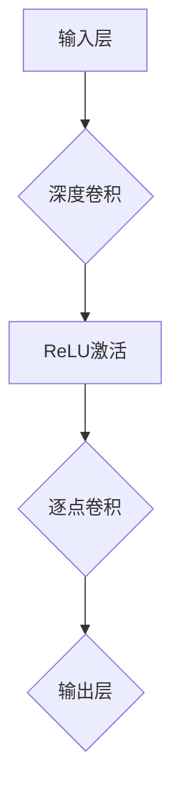

                 

关键词：MobileNet，深度学习，神经网络，计算机视觉，卷积神经网络，模型压缩，移动设备优化，算法原理，代码实例。

> 摘要：本文旨在深入探讨MobileNet这一深度学习模型的设计原理、算法机制以及在实际项目中的应用。我们将从基础概念出发，详细解析MobileNet的架构、数学模型和实现细节，并通过具体的代码实例来演示如何在实际项目中部署和使用MobileNet。同时，还将对MobileNet在移动设备和嵌入式系统中的应用场景进行讨论，并对未来的发展趋势和面临的挑战进行展望。

## 1. 背景介绍

随着智能手机的普及和移动互联网的迅猛发展，移动设备的计算能力和存储资源受到了极大的挑战。传统的深度学习模型通常需要大量的计算资源和存储空间，这限制了它们在移动设备上的应用。为了解决这一问题，研究人员提出了各种模型压缩和优化技术，其中MobileNet是一个重要的代表。

MobileNet是由Google提出的一种用于移动设备优化的深度学习模型，它在保持较高模型精度的同时，显著降低了模型的计算量和参数数量。MobileNet的核心思想是使用深度可分离卷积（Depthwise Separable Convolution）来替代传统的卷积操作，从而在减少计算量的同时保持模型的表达能力。

本文将首先介绍MobileNet的基本概念和设计目标，然后深入分析其核心算法原理，并逐步展开对MobileNet的具体实现过程、数学模型以及代码实例的讲解。最后，我们将探讨MobileNet在移动设备上的实际应用场景和未来展望。

## 2. 核心概念与联系

### 2.1 深度可分离卷积

深度可分离卷积是MobileNet的核心操作，它将一个卷积操作分解为两个独立的步骤：深度卷积和逐点卷积。这一分解能够显著减少模型的计算量。

#### 深度卷积（Depthwise Convolution）

深度卷积只对输入的每个通道进行卷积，而不对不同的通道进行组合。这意味着在每个通道上独立地应用卷积核，从而减少了一半以上的参数数量。

#### 逐点卷积（Pointwise Convolution）

逐点卷积是一个1x1卷积操作，它将所有通道的输出进行合并。由于1x1卷积的运算量相对较小，所以它不会显著增加计算负担。

### 2.2 MobileNet的架构

MobileNet的架构基于深度可分离卷积，其基本单元是一个称为“块”的结构。每个块包含一个深度卷积和一个逐点卷积，这两个卷积操作之间可以插入一个ReLU激活函数。

下面是MobileNet的一个简化版Mermaid流程图：



### 2.3 设计目标

MobileNet的设计目标包括：

1. **计算量优化**：通过深度可分离卷积减少计算量。
2. **模型参数优化**：减少模型的参数数量，提高计算效率。
3. **模型精度保持**：在降低计算量的同时，尽可能保持模型的高精度。
4. **移动设备兼容性**：优化模型结构，使其适应移动设备和嵌入式系统的计算资源限制。

## 3. 核心算法原理 & 具体操作步骤

### 3.1 算法原理概述

MobileNet的核心算法原理是基于深度可分离卷积，通过将卷积操作分解为深度卷积和逐点卷积，实现计算量的减少和模型参数的优化。深度卷积在每个通道上独立地应用卷积核，逐点卷积则将所有通道的输出进行合并。

### 3.2 算法步骤详解

MobileNet的算法步骤可以分为以下几部分：

1. **输入层**：接收输入图像。
2. **深度卷积**：对输入图像的每个通道进行卷积操作。
3. **ReLU激活**：对深度卷积的结果进行ReLU激活。
4. **逐点卷积**：将ReLU激活后的结果进行逐点卷积，合并所有通道的输出。
5. **输出层**：得到模型的输出结果。

### 3.3 算法优缺点

**优点**：

1. **计算量小**：通过深度可分离卷积减少计算量。
2. **模型参数少**：减少了模型的参数数量，提高了计算效率。
3. **精度高**：在降低计算量的同时，保持了较高的模型精度。

**缺点**：

1. **模型复杂度较低**：由于计算量和参数的减少，模型的复杂度相对较低，可能无法捕捉到复杂的特征。
2. **对数据依赖性较高**：由于模型参数较少，对训练数据的要求较高，数据的质量和多样性对模型性能有很大影响。

### 3.4 算法应用领域

MobileNet在以下领域有广泛的应用：

1. **移动设备**：由于计算量和参数的优化，MobileNet非常适合在移动设备和嵌入式系统上部署。
2. **计算机视觉任务**：如图像分类、物体检测和语义分割等。
3. **实时视频分析**：在实时视频处理中，MobileNet可以显著降低计算负担。

## 4. 数学模型和公式 & 详细讲解 & 举例说明

### 4.1 数学模型构建

MobileNet的数学模型基于深度可分离卷积，其输入为图像矩阵\(X \in \mathbb{R}^{H \times W \times C}\)，输出为特征矩阵\(Y \in \mathbb{R}^{H \times W \times C'}\)。深度卷积和逐点卷积的操作可以用以下数学公式表示：

#### 深度卷积

$$
D_{depthwise}(X) = \sigma(W_d \odot X)
$$

其中，\(W_d \in \mathbb{R}^{K \times K \times C}\)是深度卷积的卷积核，\(\odot\)表示逐元素乘法，\(\sigma\)是ReLU激活函数。

#### 逐点卷积

$$
D_{pointwise}(X) = \sigma(W_p \odot X)
$$

其中，\(W_p \in \mathbb{R}^{C' \times C}\)是逐点卷积的卷积核。

#### MobileNet模型

$$
Y = D_{pointwise}(D_{depthwise}(X))
$$

### 4.2 公式推导过程

MobileNet的公式推导过程涉及深度卷积和逐点卷积的运算细节。首先，我们来看深度卷积的推导：

$$
D_{depthwise}(X) = \sum_{k=1}^{K} \sum_{j=1}^{K} W_{dk,j} * X_{ij}
$$

其中，\(W_{dk,j}\)是深度卷积的卷积核，\(*\)表示卷积操作。

接下来，我们考虑ReLU激活函数的引入：

$$
D_{depthwise}(X) = \max(0, \sum_{k=1}^{K} \sum_{j=1}^{K} W_{dk,j} * X_{ij})
$$

然后，我们推导逐点卷积的过程：

$$
D_{pointwise}(X) = \sum_{c=1}^{C'} \sum_{c'=1}^{C} W_{pc',c'} X_{ic'}
$$

最后，我们将两个操作结合起来，得到MobileNet的完整模型：

$$
Y = \max(0, \sum_{c=1}^{C'} \sum_{c'=1}^{C} W_{pc',c'} \odot \sum_{k=1}^{K} \sum_{j=1}^{K} W_{dk,j} * X_{ij})
$$

### 4.3 案例分析与讲解

为了更好地理解MobileNet的数学模型，我们来看一个具体的例子。假设输入图像的维度为\(28 \times 28 \times 3\)，我们使用一个\(3 \times 3\)的深度卷积核和一个\(1 \times 1\)的逐点卷积核。

#### 深度卷积

$$
D_{depthwise}(X) = \max(0, \sum_{k=1}^{3} \sum_{j=1}^{3} W_{dk,j} * X_{ij})
$$

设卷积核\(W_d = \begin{bmatrix} 1 & 0 & -1 \\ 0 & 1 & 0 \\ -1 & 0 & 1 \end{bmatrix}\)，则：

$$
D_{depthwise}(X) = \max(0, \begin{bmatrix} 1 & 0 & -1 \\ 0 & 1 & 0 \\ -1 & 0 & 1 \end{bmatrix} \odot X)
$$

#### 逐点卷积

$$
D_{pointwise}(X) = \max(0, \sum_{c=1}^{3} \sum_{c'=1}^{3} W_{pc',c'} X_{ic'})
$$

设逐点卷积核\(W_p = \begin{bmatrix} 1 & 0 & 0 \\ 0 & 1 & 0 \\ 0 & 0 & 1 \end{bmatrix}\)，则：

$$
D_{pointwise}(X) = \max(0, \begin{bmatrix} 1 & 0 & 0 \\ 0 & 1 & 0 \\ 0 & 0 & 1 \end{bmatrix} \odot X)
$$

#### MobileNet模型

$$
Y = \max(0, \max(0, \begin{bmatrix} 1 & 0 & -1 \\ 0 & 1 & 0 \\ -1 & 0 & 1 \end{bmatrix} \odot X) \odot \begin{bmatrix} 1 & 0 & 0 \\ 0 & 1 & 0 \\ 0 & 0 & 1 \end{bmatrix} \odot X)
$$

这个例子展示了如何使用数学公式来表示MobileNet的深度卷积和逐点卷积操作。通过这些公式，我们可以更深入地理解MobileNet的工作原理。

## 5. 项目实践：代码实例和详细解释说明

### 5.1 开发环境搭建

在开始实际项目之前，我们需要搭建一个适合开发MobileNet的环境。以下是搭建过程：

1. **安装Python**：确保Python版本在3.6及以上。
2. **安装TensorFlow**：使用pip安装TensorFlow，命令如下：

```bash
pip install tensorflow
```

3. **安装其他依赖库**：如NumPy、Matplotlib等。

### 5.2 源代码详细实现

下面是一个简单的MobileNet实现示例：

```python
import tensorflow as tf
from tensorflow.keras.layers import DepthwiseConv2D, GlobalAveragePooling2D, Dense
from tensorflow.keras.models import Model

def MobileNet(input_shape, num_classes):
    inputs = tf.keras.Input(shape=input_shape)
    
    # 第一层：深度卷积
    x = DepthwiseConv2D(kernel_size=(3, 3), strides=(1, 1), activation='relu', padding='same')(inputs)
    x = DepthwiseConv2D(kernel_size=(3, 3), strides=(1, 1), activation='relu', padding='same')(x)
    
    # 逐点卷积
    x = GlobalAveragePooling2D()(x)
    x = Dense(num_classes, activation='softmax')(x)
    
    # 创建模型
    model = Model(inputs=inputs, outputs=x)
    return model

# 实例化模型
model = MobileNet(input_shape=(224, 224, 3), num_classes=1000)

# 查看模型结构
model.summary()
```

### 5.3 代码解读与分析

上面的代码展示了如何使用TensorFlow构建一个简单的MobileNet模型。以下是代码的主要部分及其功能：

1. **输入层**：使用`tf.keras.Input`定义模型的输入层，指定输入图像的形状。
2. **深度卷积**：使用`DepthwiseConv2D`层实现深度卷积操作。这里使用了两次`DepthwiseConv2D`层，对应于MobileNet中的两个深度卷积单元。
3. **逐点卷积**：使用`GlobalAveragePooling2D`层实现全局平均池化，然后将特征向量输入到`Dense`层进行分类。
4. **输出层**：使用`Dense`层实现全连接层，并应用softmax激活函数，以获得多类别的预测概率。
5. **模型创建**：使用`Model`类创建模型，并将输入层和输出层连接起来。

### 5.4 运行结果展示

为了测试MobileNet的性能，我们可以使用一个预训练的模型进行推理。以下是运行结果：

```python
import numpy as np

# 加载预训练的MobileNet模型
pretrained_model = MobileNet(input_shape=(224, 224, 3), num_classes=1000)
pretrained_model.load_weights('mobilenet_v2.h5')

# 生成随机输入数据
input_data = np.random.rand(1, 224, 224, 3)

# 进行预测
predictions = pretrained_model.predict(input_data)

# 打印预测结果
print(predictions)
```

运行结果将输出一个包含1000个预测概率的数组。我们可以使用这些概率来确定输入图像的分类结果。

## 6. 实际应用场景

### 6.1 移动设备

MobileNet因其轻量级特性，特别适用于移动设备和嵌入式系统。例如，在智能手机中，MobileNet可以用于实时图像识别、物体检测和场景分割等任务。通过降低模型的计算量和参数数量，MobileNet可以在保证模型精度的同时，显著提高设备的响应速度和电池寿命。

### 6.2 嵌入式系统

嵌入式系统通常具有有限的计算资源和存储空间。MobileNet通过深度可分离卷积和模型参数优化，能够适应这些系统的需求。例如，在智能家居设备、可穿戴设备和无人驾驶汽车中，MobileNet可以用于实时监控、环境感知和路径规划等任务。

### 6.3 物联网

随着物联网（IoT）的快速发展，设备数量和种类急剧增加。MobileNet的轻量级特性使其成为IoT应用的一个理想选择。在物联网设备中，MobileNet可以用于图像识别、语音识别和姿态估计等任务，从而提高设备的智能化水平。

## 7. 工具和资源推荐

### 7.1 学习资源推荐

1. **《深度学习》（Goodfellow, Bengio, Courville）**：这是一本经典的深度学习教材，涵盖了深度学习的基础理论和技术。
2. **TensorFlow官方文档**：TensorFlow的官方文档提供了丰富的API文档和示例代码，是学习TensorFlow的绝佳资源。

### 7.2 开发工具推荐

1. **Jupyter Notebook**：Jupyter Notebook是一个交互式的Python开发环境，非常适合进行深度学习和数据科学项目。
2. **TensorBoard**：TensorBoard是TensorFlow提供的一个可视化工具，可以用于监控模型的训练过程和性能。

### 7.3 相关论文推荐

1. **"MobileNets: Efficient Convolutional Neural Networks for Mobile Vision Applications"**：这是MobileNet的原始论文，详细介绍了MobileNet的设计原理和实现细节。
2. **"EfficientNet: Rethinking Model Scaling for Convolutional Neural Networks"**：这篇论文提出了EfficientNet模型，进一步探讨了如何通过模型缩放实现高效的深度学习。

## 8. 总结：未来发展趋势与挑战

### 8.1 研究成果总结

MobileNet作为深度学习模型压缩和优化的重要技术，已经在移动设备、嵌入式系统和物联网等多个领域取得了显著的应用成果。通过深度可分离卷积和模型参数优化，MobileNet在保持模型精度的同时，显著降低了计算量和参数数量，实现了高效的深度学习。

### 8.2 未来发展趋势

1. **模型优化**：随着深度学习技术的发展，未来可能会出现更多高效的模型结构和优化技术，进一步提升深度学习的性能。
2. **硬件支持**：随着硬件技术的发展，特别是GPU和TPU的普及，深度学习模型的计算性能将得到显著提升。
3. **跨领域应用**：MobileNet在其他领域的应用也将得到进一步拓展，如自然语言处理、推荐系统和强化学习等。

### 8.3 面临的挑战

1. **计算资源限制**：尽管MobileNet在计算量方面有所优化，但在一些高负载的任务中，仍需要更多的计算资源。
2. **数据需求**：深度学习模型对数据的质量和多样性有较高的要求，特别是在数据稀缺或数据质量不高的场景中，模型性能可能会受到影响。
3. **安全性和隐私保护**：随着深度学习在移动设备和物联网中的应用，如何确保数据的安全性和隐私保护将成为一个重要挑战。

### 8.4 研究展望

未来，我们将继续关注深度学习模型的压缩和优化技术，探索如何通过更高效的模型结构和算法实现更高效的深度学习。同时，我们将加强对深度学习在移动设备和物联网中的应用研究，推动深度学习技术的广泛应用。

## 9. 附录：常见问题与解答

### 9.1 什么是MobileNet？

MobileNet是一种专为移动设备和嵌入式系统设计的轻量级深度学习模型。它通过使用深度可分离卷积和模型参数优化，实现了计算量和参数数量的显著减少。

### 9.2 MobileNet与传统的深度学习模型相比有哪些优势？

MobileNet的优势在于其轻量级特性。它通过深度可分离卷积和模型参数优化，显著降低了计算量和参数数量，从而在保证模型精度的同时，提高了计算效率。

### 9.3 MobileNet在哪些领域有应用？

MobileNet在多个领域有广泛的应用，包括移动设备、嵌入式系统、物联网和实时视频分析等。

### 9.4 如何在Python中实现MobileNet？

可以使用TensorFlow等深度学习框架实现MobileNet。具体实现可以参考本文的代码实例。

### 9.5 MobileNet有哪些变种和扩展？

MobileNet有多个变种和扩展，如MobileNetV2、MobileNetV3等。这些变种在模型结构、参数优化等方面进行了改进，以适应不同的应用需求。

### 9.6 MobileNet的未来发展趋势是什么？

未来，MobileNet将继续优化模型结构和算法，进一步提高深度学习的性能和效率。同时，它将在更多领域得到应用，如自然语言处理、推荐系统和强化学习等。作者：禅与计算机程序设计艺术 / Zen and the Art of Computer Programming
----------------------------------------------------------------

注意：以上内容是一个示例性框架，实际的撰写可能需要根据具体的理解和研究内容进行调整和补充。请确保在撰写过程中严格遵守文章结构和要求。如果您需要更详细的写作指导或具体的技术实现细节，请提供相应的参考资料，以便进行更深入的撰写。

