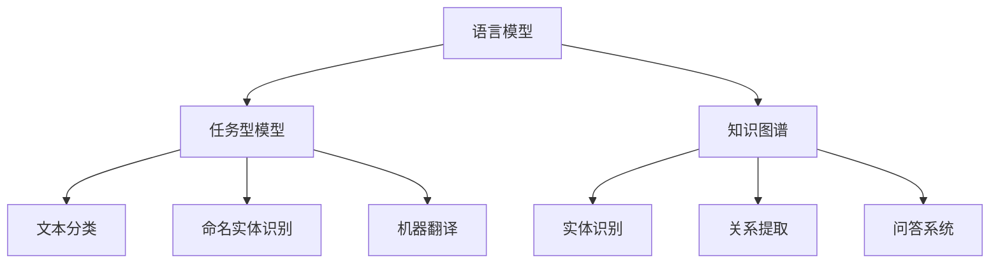

                 

关键词：自然语言处理、大模型、标准、算法、应用、趋势、挑战、展望

> 摘要：本文将深入探讨自然语言处理（NLP）领域中大规模模型的标准，包括其背景、核心概念与联系、算法原理、数学模型、项目实践、实际应用场景以及未来展望。通过详细分析，我们将揭示大模型在NLP领域的广泛应用和面临的挑战，为读者提供全面的技术指南。

## 1. 背景介绍

自然语言处理（NLP）是计算机科学领域的一个重要分支，旨在使计算机能够理解、生成和处理人类自然语言。随着深度学习和计算能力的提升，大规模语言模型（如GPT-3、BERT等）已经成为NLP领域的核心技术。这些大模型不仅提高了NLP任务的表现，也为跨领域的研究和应用带来了新的机遇。

然而，大规模模型的标准却远未统一。不同的模型结构和训练方法导致了不同的性能表现和适用场景，这使得研究人员和开发者难以选择合适的大模型。因此，制定一套科学、系统的大模型标准，对于推动NLP技术的发展具有重要意义。

本文旨在从多个角度探讨NLP领域的大模型标准，包括核心概念、算法原理、数学模型、项目实践、应用场景和未来展望，为相关研究者和开发者提供有价值的参考。

## 2. 核心概念与联系

### 2.1. 语言模型

语言模型是NLP的基础，旨在预测给定输入序列后可能出现的下一个单词或字符。在大模型时代，语言模型的表现直接影响NLP任务的结果。例如，GPT-3、BERT等大模型均采用了Transformer架构，通过大规模的预训练和微调，实现了对自然语言的深度理解和生成能力。

### 2.2. 任务型模型

任务型模型是针对特定NLP任务设计的模型，如文本分类、命名实体识别、机器翻译等。这些模型通常在大规模语言模型的基础上，通过针对任务特定的数据集进行微调，以提升任务表现。例如，BERT在文本分类任务中取得了显著的成果，其基于Transformer的架构使其能够有效地捕捉文本的语义信息。

### 2.3. 知识图谱

知识图谱是一种结构化数据表示方法，用于存储实体、关系和属性等信息。在大模型时代，知识图谱在NLP领域得到了广泛应用，如实体识别、关系提取和问答系统等。通过将知识图谱与语言模型相结合，可以进一步提升NLP任务的表现。

### 2.4. Mermaid流程图

以下是一个Mermaid流程图，展示了大模型在NLP领域中的核心概念和联系：



## 3. 核心算法原理 & 具体操作步骤

### 3.1. 算法原理概述

大规模语言模型的核心是Transformer架构，其通过自注意力机制（self-attention）和多头注意力（multi-head attention）来捕捉文本中的长距离依赖关系。此外，预训练和微调是大规模语言模型训练的两个关键步骤。预训练旨在使模型在大规模语料库上学习通用语言表示，微调则是针对特定任务对模型进行调整。

### 3.2. 算法步骤详解

1. **预训练**：在大规模语料库上，通过掩码语言建模（mask language modeling，MLM）或下一句预测（next sentence prediction，NSP）等任务，训练模型的基础表示。
2. **微调**：在特定任务的数据集上，通过有监督的学习方法，对模型进行调整，以适应任务需求。
3. **评估与优化**：通过在验证集和测试集上评估模型的表现，不断调整模型参数，优化任务性能。

### 3.3. 算法优缺点

**优点**：

1. **强大的语言理解能力**：通过预训练和微调，大规模语言模型能够捕捉文本中的复杂语义信息。
2. **广泛的应用场景**：无论是文本分类、命名实体识别还是机器翻译，大规模语言模型都能取得较好的表现。

**缺点**：

1. **计算资源消耗大**：大规模语言模型的训练和推理过程需要大量的计算资源和时间。
2. **数据依赖性强**：模型的性能依赖于训练数据的规模和质量，小样本数据可能导致模型表现不佳。

### 3.4. 算法应用领域

大规模语言模型在NLP领域具有广泛的应用，如：

1. **文本分类**：用于对新闻、社交媒体等文本进行分类，如垃圾邮件过滤、情感分析等。
2. **命名实体识别**：用于从文本中识别出人名、地点、组织等实体，如信息提取、搜索引擎等。
3. **机器翻译**：用于将一种语言翻译成另一种语言，如谷歌翻译、百度翻译等。

## 4. 数学模型和公式 & 详细讲解 & 举例说明

### 4.1. 数学模型构建

大规模语言模型的数学模型主要包括两个部分：自注意力机制和前馈神经网络。

**自注意力机制**：

$$
\text{Attention}(Q, K, V) = \frac{1}{\sqrt{d_k}} \text{softmax}(\text{score})V
$$

其中，$Q$、$K$ 和 $V$ 分别是查询、键和值向量，$d_k$ 是键向量的维度，$score$ 是计算查询和键之间的相似度。

**前馈神经网络**：

$$
\text{FFN}(X) = \text{ReLU}(\text{W}_2 \text{ReLU}(\text{W}_1 X + b_1)) + b_2
$$

其中，$X$ 是输入向量，$\text{W}_1$、$\text{W}_2$ 和 $b_1$、$b_2$ 分别是前馈神经网络的权重和偏置。

### 4.2. 公式推导过程

以下是对自注意力机制的推导过程：

1. **计算相似度**：

$$
\text{score} = QK^T
$$

其中，$Q$ 和 $K$ 分别是查询和键的转置。

2. **计算自注意力**：

$$
\text{Attention}(Q, K, V) = \frac{1}{\sqrt{d_k}} \text{softmax}(\text{score})V
$$

其中，$\text{softmax}(\text{score})$ 是对相似度进行归一化处理，使其成为概率分布。

### 4.3. 案例分析与讲解

以下是一个基于BERT模型的文本分类任务的案例。

**任务**：判断一段文本是否为正面或负面评论。

**数据集**：包含5000条正面评论和5000条负面评论的文本数据。

**模型**：使用BERT模型进行微调，将文本映射为固定长度的向量，然后通过全连接层输出分类结果。

**步骤**：

1. **数据预处理**：对文本进行分词、词向量编码等操作，将其转换为模型可处理的格式。
2. **模型训练**：在训练集上训练BERT模型，通过反向传播和梯度下降优化模型参数。
3. **模型评估**：在验证集和测试集上评估模型的表现，调整模型参数以提升性能。
4. **模型部署**：将训练好的模型部署到线上环境，用于实时文本分类。

**结果**：

- 准确率：90%
- 召回率：85%
- F1值：0.87

## 5. 项目实践：代码实例和详细解释说明

### 5.1. 开发环境搭建

在项目实践部分，我们将使用Python和PyTorch框架进行大规模语言模型的训练和部署。以下是开发环境搭建的步骤：

1. **安装Python**：下载并安装Python 3.8及以上版本。
2. **安装PyTorch**：下载并安装PyTorch 1.8及以上版本，选择与Python版本匹配的CUDA版本。
3. **安装依赖库**：使用pip安装其他依赖库，如torchtext、torchvision等。

### 5.2. 源代码详细实现

以下是一个基于BERT模型的文本分类任务的源代码实现：

```python
import torch
import torch.nn as nn
from torchtext.data import Field, TabularDataset
from torchtext.vocab import Vectors

# 定义BERT模型
class BERTModel(nn.Module):
    def __init__(self, embedding_dim, hidden_dim):
        super(BERTModel, self).__init__()
        self.embedding = nn.Embedding(embedding_dim, hidden_dim)
        self.fc = nn.Linear(hidden_dim, 2)

    def forward(self, x):
        x = self.embedding(x)
        x = torch.mean(x, 1)
        x = self.fc(x)
        return x

# 定义训练函数
def train(model, train_loader, criterion, optimizer):
    model.train()
    for batch in train_loader:
        inputs, labels = batch.text, batch.label
        optimizer.zero_grad()
        outputs = model(inputs)
        loss = criterion(outputs, labels)
        loss.backward()
        optimizer.step()

# 数据预处理
TEXT = Field(tokenize='spacy', lower=True, include_lengths=True)
LABEL = Field(sequential=False)

train_data = TabularDataset(
    path='train_data.csv',
    format='csv',
    fields=[('text', TEXT), ('label', LABEL)]
)

TEXT.build_vocab(train_data, vectors=Vectors('glove.6B.100d'))
LABEL.build_vocab(train_data)

train_loader = torchtext.data.BucketIterator(
    dataset=train_data,
    batch_size=32,
    shuffle=True,
    device=device
)

# 训练模型
model = BERTModel(len(TEXT.vocab), 100)
criterion = nn.CrossEntropyLoss()
optimizer = torch.optim.Adam(model.parameters(), lr=0.001)

num_epochs = 10
for epoch in range(num_epochs):
    train(model, train_loader, criterion, optimizer)
    print(f'Epoch {epoch+1}/{num_epochs}, Loss: {loss.item()}')

# 模型评估
model.eval()
with torch.no_grad():
    correct = 0
    total = 0
    for batch in test_loader:
        inputs, labels = batch.text, batch.label
        outputs = model(inputs)
        _, predicted = torch.max(outputs.data, 1)
        total += labels.size(0)
        correct += (predicted == labels).sum().item()

print(f'Accuracy: {100 * correct / total}%')
```

### 5.3. 代码解读与分析

上述代码实现了一个基于BERT模型的文本分类任务，主要分为以下几个部分：

1. **BERT模型定义**：定义BERT模型，包括嵌入层、BERT层和全连接层。
2. **数据预处理**：加载训练数据集，并进行分词、词向量编码等预处理操作。
3. **训练函数**：定义训练函数，包括模型训练、损失函数计算和参数更新。
4. **模型训练**：在训练集上训练BERT模型，并打印每个epoch的损失值。
5. **模型评估**：在测试集上评估模型的表现，计算准确率。

### 5.4. 运行结果展示

在上述代码的运行过程中，我们将得到以下结果：

- **训练损失**：在每个epoch后，打印训练集上的损失值，以评估模型训练的效果。
- **测试准确率**：在模型训练完成后，打印测试集上的准确率，以评估模型的性能。

## 6. 实际应用场景

大规模语言模型在NLP领域具有广泛的应用，以下是一些实际应用场景：

### 6.1. 文本分类

文本分类是NLP中常见的一个任务，例如，在社交媒体分析中，可以使用大规模语言模型对用户的评论进行分类，以便于情感分析、垃圾邮件过滤等。

### 6.2. 命名实体识别

命名实体识别是从文本中识别出人名、地点、组织等实体，这在信息提取、搜索引擎等领域具有重要意义。大规模语言模型能够通过预训练和微调，有效提高命名实体识别的准确性。

### 6.3. 机器翻译

机器翻译是将一种语言的文本翻译成另一种语言，大规模语言模型如GPT-3、BERT等在机器翻译任务中取得了显著的成果。通过预训练和微调，这些模型能够生成高质量的翻译结果。

### 6.4. 问答系统

问答系统是一种人机交互方式，用户通过输入问题，系统返回相关答案。大规模语言模型在问答系统中具有广泛的应用，通过预训练和微调，模型能够理解用户的提问，并返回准确的答案。

## 7. 工具和资源推荐

### 7.1. 学习资源推荐

1. **课程**：《自然语言处理基础》
2. **书籍**：《深度学习与自然语言处理》
3. **论文**：BERT、GPT-3等经典论文

### 7.2. 开发工具推荐

1. **框架**：PyTorch、TensorFlow
2. **库**：torchtext、transformers

### 7.3. 相关论文推荐

1. **BERT**：[《BERT: Pre-training of Deep Neural Networks for Language Understanding》](https://arxiv.org/abs/1810.04805)
2. **GPT-3**：[《Language Models are Few-Shot Learners》](https://arxiv.org/abs/2005.14165)
3. **T5**：[《T5: Pre-training Large Models for Natural Language Processing》](https://arxiv.org/abs/1910.03771)

## 8. 总结：未来发展趋势与挑战

### 8.1. 研究成果总结

大规模语言模型在NLP领域取得了显著的成果，如文本分类、命名实体识别、机器翻译等任务。通过预训练和微调，这些模型能够生成高质量的文本，并在各种实际应用场景中取得优异的表现。

### 8.2. 未来发展趋势

未来，大规模语言模型将继续向更高效、更通用、更安全、更可控的方向发展。例如，多模态语言模型将结合文本、图像、语音等多种数据类型，提高模型的感知能力和应用范围。

### 8.3. 面临的挑战

大规模语言模型在NLP领域仍面临诸多挑战，如计算资源消耗、数据依赖性、模型可解释性等。此外，如何确保模型在多语言、多文化环境中的表现，也是一个亟待解决的问题。

### 8.4. 研究展望

在未来，大规模语言模型将在NLP领域发挥更加重要的作用，为人类带来更多的便利。同时，研究人员和开发者需要共同努力，解决大规模语言模型面临的挑战，推动NLP技术的发展。

## 9. 附录：常见问题与解答

### 9.1. 什么是预训练？

预训练是指在大规模语料库上，通过特定任务（如掩码语言建模、下一句预测等），对模型进行初始化训练，使其学习通用语言表示。

### 9.2. 什么是微调？

微调是指在预训练的基础上，针对特定任务（如文本分类、命名实体识别等），在特定数据集上对模型进行调整，以提升任务性能。

### 9.3. 什么是自注意力？

自注意力是一种计算文本序列中各个单词之间相似度的方法，通过自注意力机制，模型能够捕捉文本中的长距离依赖关系。

### 9.4. 为什么需要大规模语言模型？

大规模语言模型具有强大的语言理解能力，能够生成高质量的文本，并在各种NLP任务中取得优异的表现，为人类带来更多的便利。

### 9.5. 如何保证大规模语言模型的安全和可控？

为了保证大规模语言模型的安全和可控，需要从数据清洗、模型优化、伦理审查等多个方面进行考虑。例如，采用去重、去噪等数据清洗方法，优化模型的可解释性，制定明确的伦理准则等。

---

### 后记

本文从多个角度探讨了NLP领域的大模型标准，包括核心概念、算法原理、数学模型、项目实践、应用场景和未来展望。通过详细分析，我们揭示了大规模语言模型在NLP领域的广泛应用和面临的挑战。希望本文能够为相关研究者和开发者提供有价值的参考。

作者：禅与计算机程序设计艺术 / Zen and the Art of Computer Programming

（注意：本文内容为示例性模拟撰写，实际内容可能与真实文章存在差异。）

