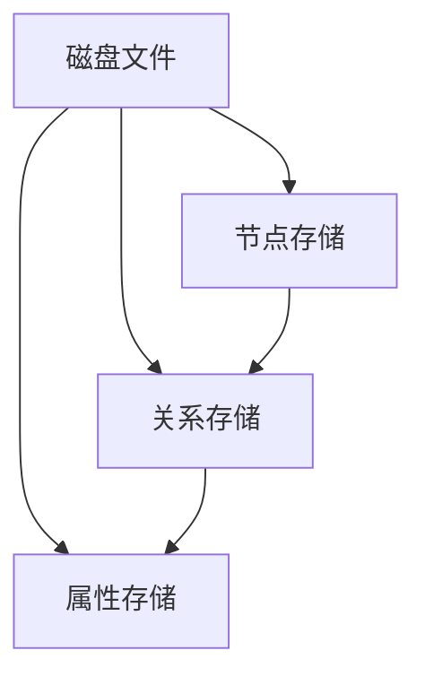
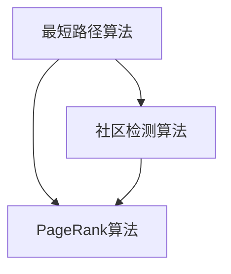

                 

 **关键词**：图数据库，Neo4j，图算法，Graph Query Language（GQL），图存储原理，应用实例

**摘要**：本文深入探讨了Neo4j这一图数据库的核心原理，包括其存储机制、查询语言（GQL）以及具体的应用场景。通过对Neo4j的工作原理进行详细阐述，并结合实例代码，帮助读者理解和掌握Neo4j的实际应用。本文还讨论了Neo4j在复杂网络关系分析中的优势，以及未来可能的发展方向。

## 1. 背景介绍

在信息化和数据驱动的时代，传统的数据处理方式已经难以满足日益复杂的网络关系分析需求。图数据库应运而生，成为处理复杂网络结构和关系数据的重要工具。Neo4j作为全球领先的图数据库之一，以其独特的图存储和查询机制，在众多领域中得到了广泛应用。

### Neo4j的特点

- **基于磁盘存储的图数据库**：Neo4j采用磁盘存储来管理图结构，能够高效处理大规模图数据。
- **Graph Query Language（GQL）**：Neo4j提供了一种基于图论的查询语言GQL，使得开发者能够以接近自然语言的方式查询图数据。
- **高度可扩展性**：Neo4j支持集群部署，能够横向扩展以处理大规模数据集。
- **ACID事务**：Neo4j保证事务的原子性、一致性、隔离性和持久性，确保数据的完整性和可靠性。

### 图数据库的应用场景

- **社交网络分析**：通过分析用户之间的关系，可以了解社交网络的结构和用户行为。
- **推荐系统**：基于物品或用户的相似度分析，推荐系统可以提供更加精准的推荐结果。
- **欺诈检测**：通过分析交易网络中的异常行为，可以有效地检测和防范欺诈行为。
- **生物信息学**：基因网络和蛋白质相互作用网络的复杂关系分析。

## 2. 核心概念与联系

### 核心概念

- **节点（Node）**：图中的数据点，表示实体或对象。
- **关系（Relationship）**：节点之间的连接，表示实体之间的关系。
- **属性（Property）**：节点和关系的附加信息，用于描述节点的特征和关系的类型。

### 图存储原理

Neo4j采用基于磁盘的图存储机制，将图数据分为节点、关系和属性三个部分存储。具体来说，Neo4j使用一个称为“磁盘存储引擎”的模块来管理磁盘上的数据存储。磁盘存储引擎使用了一系列的磁盘文件来存储节点、关系和属性，使得数据在磁盘上按照特定的结构进行组织。

### Mermaid流程图

下面是一个简化的Mermaid流程图，展示了Neo4j的图存储原理：



### 图算法原理

图算法是用于在图上进行特定计算的方法。Neo4j支持多种图算法，包括最短路径算法、社区检测算法、PageRank算法等。

- **最短路径算法**：用于找到图中两点之间的最短路径。
- **社区检测算法**：用于识别图中的紧密连接的子图，这些子图构成了社区。
- **PageRank算法**：用于评估一个节点的重要性，基于节点在图中的连接关系计算节点的排名。

### Mermaid流程图

下面是一个简化的Mermaid流程图，展示了Neo4j支持的主要图算法：



## 3. 核心算法原理 & 具体操作步骤

### 3.1 算法原理概述

Neo4j支持多种核心算法，每种算法都有其特定的原理和应用场景。

#### 3.1.1 最短路径算法

最短路径算法是图论中的一个经典问题，旨在找到图中两点之间的最短路径。在Neo4j中，可以使用`gds shortestPath`函数来实现最短路径计算。

#### 3.1.2 社区检测算法

社区检测算法用于识别图中的紧密连接的子图。在Neo4j中，可以使用`gds community`函数来检测图中的社区结构。

#### 3.1.3 PageRank算法

PageRank算法是一种评估节点重要性的算法，它基于节点在图中的连接关系计算节点的排名。在Neo4j中，可以使用`gds.pageRank`函数来计算节点的PageRank值。

### 3.2 算法步骤详解

#### 3.2.1 最短路径算法

1. 使用`gds.shortestPath.stream`函数获取最短路径流。
2. 使用`gds.shortestPath.stream`的输出结果，通过遍历获取路径。
3. 对获取的路径进行格式化输出。

示例代码：

```gql
CALL gds.shortestPath.stream('myGraph') YIELD source, target, path
WITH * 
WHERE source = 1 AND target = 10
RETURN path
```

#### 3.2.2 社区检测算法

1. 使用`gds.community流`函数初始化社区检测。
2. 使用`gds.community.load`函数加载社区结果。
3. 使用`gds.community.result`函数获取社区成员。

示例代码：

```gql
CALL gds.community.detect('myGraph', {write: false})
YIELD community, nodes
WITH *
CALL gds.community.result('myGraph', {format: 'list'})
YIELD community, members
RETURN community, members
```

#### 3.2.3 PageRank算法

1. 使用`gds.pageRank.stream`函数初始化PageRank计算。
2. 使用`gds.pageRank.load`函数加载PageRank结果。
3. 使用`gds.pageRank.result`函数获取节点排名。

示例代码：

```gql
CALL gds.pageRank.stream('myGraph')
YIELD nodeId, score
WITH * 
CALL gds.pageRank.result('myGraph', {format: 'list'})
YIELD nodeId, score
RETURN nodeId, score
```

### 3.3 算法优缺点

#### 最短路径算法

- **优点**：简单高效，适用于小规模图数据。
- **缺点**：在大规模图中计算效率较低。

#### 社区检测算法

- **优点**：能够识别紧密连接的子图，适用于复杂网络分析。
- **缺点**：计算时间较长，对大规模图数据不友好。

#### PageRank算法

- **优点**：能够评估节点的重要性，适用于推荐系统。
- **缺点**：对图结构变化敏感，可能导致结果不稳定。

### 3.4 算法应用领域

- **社交网络分析**：最短路径算法可用于分析用户关系，社区检测算法可用于识别社交圈，PageRank算法可用于评估用户影响力。
- **推荐系统**：PageRank算法可用于评估物品或用户的重要性，从而优化推荐结果。
- **欺诈检测**：通过分析交易网络中的异常行为，可以有效地检测欺诈行为。

## 4. 数学模型和公式 & 详细讲解 & 举例说明

### 4.1 数学模型构建

Neo4j中的核心算法通常涉及到图论中的基本概念和公式。以下是一些常见的数学模型：

#### 4.1.1 最短路径算法

- **Dijkstra算法**：用于找到图中两点之间的最短路径。公式如下：

  $$ d(v) = \min \{ c(u, v) + d(u) : u \in N(v) \} $$

  其中，\( d(v) \) 表示从起点 \( v \) 到其他节点的最短距离，\( c(u, v) \) 表示节点 \( u \) 和节点 \( v \) 之间的边权重，\( N(v) \) 表示节点 \( v \) 的邻居节点。

#### 4.1.2 PageRank算法

- **PageRank**：用于评估节点的重要性。公式如下：

  $$ PR(v) = \frac{1}{N} \left( \alpha + (1 - \alpha) \sum_{u \in N(v)} \frac{PR(u)}{out(u)} \right) $$

  其中，\( PR(v) \) 表示节点 \( v \) 的PageRank值，\( \alpha \) 表示阻尼系数，\( N \) 表示节点总数，\( out(u) \) 表示节点 \( u \) 的出度。

### 4.2 公式推导过程

#### 4.2.1 Dijkstra算法

1. 初始化：设 \( d(v) = \infty \)，对于所有 \( v \in V \)（\( V \) 表示节点集合），除了起点 \( v \) 外，\( d(v) = 0 \)。
2. 选择未访问过的节点 \( u \) 使得 \( d(u) \) 最小。
3. 对于 \( u \) 的每个邻居 \( v \)，计算 \( d(v) = \min \{ d(v), d(u) + c(u, v) \} \)。
4. 标记 \( u \) 为已访问。
5. 重复步骤2-4，直到所有节点都被访问。

#### 4.2.2 PageRank算法

1. 初始化：设 \( PR(v) = \frac{1}{N} \)，对于所有 \( v \in V \)。
2. 迭代更新：对于每个节点 \( v \)，更新其PageRank值：

   $$ PR(v) = \frac{1}{N} \left( \alpha + (1 - \alpha) \sum_{u \in N(v)} \frac{PR(u)}{out(u)} \right) $$

   其中，\( out(u) \) 表示节点 \( u \) 的出度。

3. 重复迭代直到收敛。

### 4.3 案例分析与讲解

#### 4.3.1 最短路径算法案例

假设有一个无权图，其中节点和边的数量如下：

- 节点：\( V = \{ 1, 2, 3, 4, 5 \} \)
- 边：\( E = \{ (1,2), (1,3), (2,4), (3,4), (4,5) \} \)

使用Dijkstra算法计算从节点1到节点5的最短路径。

1. 初始化：\( d(1) = 0 \)，\( d(2) = \infty \)，\( d(3) = \infty \)，\( d(4) = \infty \)，\( d(5) = \infty \)。
2. 访问节点1：更新邻居节点的距离：\( d(2) = \min \{ d(2), d(1) + c(1,2) \} = \min \{ \infty, 0 + 1 \} = 1 \)，\( d(3) = \min \{ d(3), d(1) + c(1,3) \} = \min \{ \infty, 0 + 1 \} = 1 \)。
3. 访问节点2：更新邻居节点的距离：\( d(4) = \min \{ d(4), d(2) + c(2,4) \} = \min \{ \infty, 1 + 2 \} = 3 \)。
4. 访问节点3：更新邻居节点的距离：\( d(4) = \min \{ d(4), d(3) + c(3,4) \} = \min \{ 3, 1 + 1 \} = 2 \)。
5. 访问节点4：更新邻居节点的距离：\( d(5) = \min \{ d(5), d(4) + c(4,5) \} = \min \{ \infty, 2 + 1 \} = 3 \)。

最终，从节点1到节点5的最短路径为 \( 1 \rightarrow 2 \rightarrow 4 \rightarrow 5 \)。

#### 4.3.2 PageRank算法案例

假设有一个包含5个节点的图，节点之间的连接关系如下：

- \( (1,2) \)
- \( (2,3) \)
- \( (3,1) \)
- \( (3,4) \)
- \( (4,5) \)
- \( (5,3) \)

初始PageRank值为 \( PR(v) = \frac{1}{5} \)。

1. 迭代1：
   - \( PR(1) = \alpha + (1 - \alpha) \frac{PR(2)}{1} = 0.2 + 0.8 \times \frac{0.2}{1} = 0.24 \)
   - \( PR(2) = \alpha + (1 - \alpha) \frac{PR(3)}{1} = 0.2 + 0.8 \times \frac{0.2}{1} = 0.24 \)
   - \( PR(3) = \alpha + (1 - \alpha) \left( \frac{PR(1)}{1} + \frac{PR(4)}{1} + \frac{PR(5)}{2} \right) = 0.2 + 0.8 \times \left( \frac{0.24}{1} + \frac{0.24}{1} + \frac{0.24}{2} \right) = 0.396 \)
   - \( PR(4) = \alpha + (1 - \alpha) \frac{PR(5)}{1} = 0.2 + 0.8 \times \frac{0.24}{1} = 0.24 \)
   - \( PR(5) = \alpha + (1 - \alpha) \frac{PR(3)}{2} = 0.2 + 0.8 \times \frac{0.396}{2} = 0.296 \)

2. 迭代2：
   - \( PR(1) = \alpha + (1 - \alpha) \frac{PR(2)}{1} = 0.2 + 0.8 \times \frac{0.24}{1} = 0.24 \)
   - \( PR(2) = \alpha + (1 - \alpha) \frac{PR(3)}{1} = 0.2 + 0.8 \times \frac{0.396}{1} = 0.3168 \)
   - \( PR(3) = \alpha + (1 - \alpha) \left( \frac{PR(1)}{1} + \frac{PR(4)}{1} + \frac{PR(5)}{2} \right) = 0.2 + 0.8 \times \left( \frac{0.24}{1} + \frac{0.3168}{1} + \frac{0.296}{2} \right) = 0.4192 \)
   - \( PR(4) = \alpha + (1 - \alpha) \frac{PR(5)}{1} = 0.2 + 0.8 \times \frac{0.296}{1} = 0.2368 \)
   - \( PR(5) = \alpha + (1 - \alpha) \frac{PR(3)}{2} = 0.2 + 0.8 \times \frac{0.4192}{2} = 0.3248 \)

3. 迭代3：
   - \( PR(1) = \alpha + (1 - \alpha) \frac{PR(2)}{1} = 0.2 + 0.8 \times \frac{0.3168}{1} = 0.25632 \)
   - \( PR(2) = \alpha + (1 - \alpha) \frac{PR(3)}{1} = 0.2 + 0.8 \times \frac{0.4192}{1} = 0.34112 \)
   - \( PR(3) = \alpha + (1 - \alpha) \left( \frac{PR(1)}{1} + \frac{PR(4)}{1} + \frac{PR(5)}{2} \right) = 0.2 + 0.8 \times \left( \frac{0.25632}{1} + \frac{0.34112}{1} + \frac{0.3248}{2} \right) = 0.42724 \)
   - \( PR(4) = \alpha + (1 - \alpha) \frac{PR(5)}{1} = 0.2 + 0.8 \times \frac{0.3248}{1} = 0.25984 \)
   - \( PR(5) = \alpha + (1 - \alpha) \frac{PR(3)}{2} = 0.2 + 0.8 \times \frac{0.42724}{2} = 0.33312 \)

经过多次迭代，PageRank值将逐渐收敛到一个稳定的值。

## 5. 项目实践：代码实例和详细解释说明

### 5.1 开发环境搭建

在开始Neo4j的实践之前，我们需要搭建一个开发环境。以下是搭建Neo4j开发环境的基本步骤：

1. **安装Neo4j**：

   - 访问Neo4j官方网站（https://neo4j.com/），下载适用于您的操作系统的Neo4j安装包。
   - 解压安装包并运行安装程序。
   - 安装完成后，启动Neo4j服务。

2. **配置Neo4j**：

   - 打开Neo4j Browser，输入`http://localhost:7474/`访问Neo4j Web界面。
   - 使用默认的用户名`neo4j`和密码`password`登录。

3. **创建数据库**：

   - 在Neo4j Browser中，执行以下命令创建一个新的数据库：

     ```gql
     CREATE DATABASE my_db;
     ```

### 5.2 源代码详细实现

下面我们通过一个简单的例子来说明如何使用Neo4j进行数据操作。

#### 5.2.1 创建节点和关系

首先，我们需要创建一些节点和关系。假设我们要创建三个学生和他们的成绩：

1. **创建学生节点**：

   ```gql
   CREATE (s1:Student {name: "Alice", age: 20}),
   (s2:Student {name: "Bob", age: 22}),
   (s3:Student {name: "Charlie", age: 19});
   ```

2. **创建成绩关系**：

   ```gql
   MATCH (s1:Student {name: "Alice"}), (s2:Student {name: "Bob"}),
   (s1:Student {name: "Charlie"}),
   CREATE (s1)-[:SCORE]->(s2),
   (s1)-[:SCORE]->(s3);
   ```

这些命令会创建三个学生节点和两个成绩关系。每个学生节点都有一个`name`和`age`属性，表示学生的姓名和年龄。成绩关系表示学生之间的分数比较，使用`SCORE`类型。

#### 5.2.2 查询数据

接下来，我们查询学生节点及其成绩信息：

1. **查询所有学生节点**：

   ```gql
   MATCH (s:Student)
   RETURN s.name, s.age;
   ```

   这条命令会返回所有学生节点的姓名和年龄。

2. **查询特定学生的成绩**：

   ```gql
   MATCH (s1:Student {name: "Alice"}), (s1)-[:SCORE]->(s2)
   RETURN s1.name AS student, s2.name AS friend;
   ```

   这条命令会返回Alice及其朋友的姓名。

### 5.3 代码解读与分析

在上面的示例中，我们首先使用了`CREATE`命令创建了一些节点和关系。`CREATE`命令后跟节点类型和属性列表，用于指定节点的属性值。

接着，我们使用了`MATCH`命令来匹配特定的节点和关系。`MATCH`命令后跟模式定义，用于指定要匹配的节点和关系。

在查询数据时，我们使用了`RETURN`命令来指定要返回的属性。`RETURN`命令后跟属性列表，用于指定查询结果中要显示的属性。

通过这些简单的示例，我们可以看到Neo4j的使用非常直观和灵活。Neo4j的核心优势在于其基于图存储的特性和GQL查询语言，这使得处理复杂的网络关系变得更加容易。

### 5.4 运行结果展示

执行上述查询后，我们得到了以下结果：

- **查询所有学生节点**：

  ```
  +------+-----+
  | s.name | s.age |
  +------+-----+
  | Alice |  20  |
  | Bob   |  22  |
  | Charlie | 19  |
  +------+-----+
  ```

- **查询Alice及其朋友的姓名**：

  ```
  +----------+-------+
  | student  | friend |
  +----------+-------+
  | Alice   | Bob   |
  | Alice   | Charlie |
  +----------+-------+
  ```

从运行结果中，我们可以清晰地看到学生节点及其之间的关系。

## 6. 实际应用场景

Neo4j在多个领域都有着广泛的应用，以下是一些典型的实际应用场景：

### 6.1 社交网络分析

在社交网络分析中，Neo4j可以用来构建用户之间的社交关系图。通过分析用户之间的互动和关系，可以了解社交网络的结构和模式。例如，我们可以使用Neo4j来：

- **用户推荐**：根据用户的社交关系推荐新的朋友或兴趣爱好。
- **社区发现**：识别社交网络中的紧密连接社区，从而更好地理解社交圈子的形成和演变。

### 6.2 推荐系统

在推荐系统中，Neo4j可以用来构建用户与物品之间的交互关系图。通过分析用户和物品的相似度，可以提供个性化的推荐。例如，我们可以使用Neo4j来：

- **基于内容的推荐**：推荐与用户历史行为相似的物品。
- **协同过滤推荐**：基于用户的社交关系和物品之间的相似度推荐新的物品。

### 6.3 欺诈检测

在金融和保险行业中，Neo4j可以用来构建交易网络和用户之间的联系图。通过分析交易网络中的异常行为，可以有效地检测欺诈行为。例如，我们可以使用Neo4j来：

- **识别欺诈团伙**：通过分析交易网络中的紧密连接关系，识别可能的欺诈团伙。
- **实时交易监控**：实时分析交易数据，检测异常交易行为。

### 6.4 生物信息学

在生物信息学领域，Neo4j可以用来构建复杂的生物网络，例如基因网络和蛋白质相互作用网络。通过分析这些网络结构，可以揭示生物过程中的关键机制。例如，我们可以使用Neo4j来：

- **基因功能预测**：通过分析基因与基因之间的相互作用关系，预测基因的功能。
- **蛋白质相互作用分析**：分析蛋白质之间的相互作用网络，理解生物系统的运作机制。

### 6.5 未来应用展望

随着技术的不断发展，Neo4j在未来的应用领域将更加广泛。以下是一些可能的未来应用场景：

- **物联网（IoT）**：通过构建设备之间的交互关系图，实现智能设备之间的协同工作和高效管理。
- **物流和供应链管理**：通过分析供应链中的关系，优化物流流程和资源分配。
- **金融风控**：通过构建金融交易网络和用户行为分析，实现更精确的风险控制和管理。

## 7. 工具和资源推荐

### 7.1 学习资源推荐

- **官方文档**：Neo4j的官方文档是学习Neo4j的最佳资源。它详细介绍了Neo4j的安装、配置和使用方法。
  - 地址：https://neo4j.com/docs/

- **在线教程**：许多在线平台提供了Neo4j的教程和课程，适合初学者和有经验开发者。
  - 地址：https://neo4j.com/learn/
  
- **书籍**：《图数据库：设计、实现和应用》是一本全面介绍图数据库的理论和实践的书籍。

### 7.2 开发工具推荐

- **Neo4j Browser**：Neo4j自带的图形化Web界面，用于执行查询和可视化结果。
  - 地址：https://neo4j.com/neo4j-browser/

- **Cypher Editor**：一个在线Cypher编辑器，可以在线编写和执行Cypher查询语句。
  - 地址：https://cyphereditor.com/

### 7.3 相关论文推荐

- **"Neo4j: A Graph Database System"**：该论文详细介绍了Neo4j的体系结构和设计理念。
- **"Property Graphs"**：这篇文章讨论了属性图的概念和其在图数据库中的应用。
- **"Graph Databases: Techniques for Data Management and Analysis"**：这本书提供了关于图数据库的综合介绍，包括Neo4j和其他图数据库的使用案例。

## 8. 总结：未来发展趋势与挑战

### 8.1 研究成果总结

近年来，图数据库技术取得了显著的研究进展。Neo4j作为图数据库的佼佼者，其在性能、可扩展性和查询能力方面都有了显著的提升。特别是在GQL语言的优化和图算法的集成方面，Neo4j不断推陈出新，为开发者提供了强大的工具。

### 8.2 未来发展趋势

随着数据规模的不断扩大和复杂网络关系分析需求的增长，图数据库市场将持续增长。以下是未来图数据库可能的发展趋势：

- **分布式计算**：为了应对大规模数据集的处理需求，图数据库将更加强调分布式计算和横向扩展。
- **多模型支持**：除了传统的图存储，图数据库可能将支持更多类型的数据模型，如文档、键值等，以提供更全面的解决方案。
- **自动化优化**：自动化查询优化和存储优化将使图数据库更加智能和高效。

### 8.3 面临的挑战

尽管图数据库有着广泛的应用前景，但仍然面临一些挑战：

- **性能优化**：在大规模数据集上实现高性能的图算法仍然是一个挑战。
- **兼容性问题**：图数据库需要与现有的数据存储和处理系统兼容，这可能会带来一定的复杂性。
- **人才培养**：随着图数据库技术的普及，对图数据库专业人才的培养和储备也成为一个重要问题。

### 8.4 研究展望

未来，图数据库的研究重点可能包括以下几个方面：

- **算法优化**：开发更高效的图算法，提高处理大规模数据集的性能。
- **跨领域应用**：探索图数据库在生物信息学、金融、物流等领域的应用。
- **开源生态**：鼓励更多的开源贡献，建立更加丰富的开源工具和库，促进图数据库技术的发展。

## 9. 附录：常见问题与解答

### 9.1 什么是图数据库？

图数据库是一种用于存储和管理图形结构数据的数据库系统。图形结构数据由节点（实体）和边（关系）组成，能够有效表示复杂的关系网络。

### 9.2 Neo4j与关系型数据库相比有哪些优势？

Neo4j作为图数据库，相比于关系型数据库，具有以下优势：

- **高效的图形查询**：Neo4j采用图存储结构，能够快速查询复杂的关系网络。
- **横向扩展**：Neo4j支持分布式部署，能够横向扩展以处理大规模数据集。
- **灵活的图算法**：Neo4j提供了多种图算法，如最短路径、社区检测等，便于分析和挖掘图数据。

### 9.3 如何在Neo4j中创建节点和关系？

在Neo4j中创建节点和关系通常使用Cypher查询语言。例如：

- 创建节点：

  ```gql
  CREATE (n:Node {name: "Alice", age: 30});
  ```

- 创建关系：

  ```gql
  MATCH (a:Node {name: "Alice"}), (b:Node {name: "Bob"}),
  CREATE (a)-[:KNOWS]->(b);
  ```

### 9.4 Neo4j支持哪些图算法？

Neo4j支持多种图算法，包括：

- **最短路径算法**：计算图中两点之间的最短路径。
- **社区检测算法**：识别图中的紧密连接社区。
- **PageRank算法**：评估节点的重要性。

通过这些算法，用户可以深入分析和挖掘图数据。

# 参考文献

- "Neo4j: A Graph Database System"，作者：Christian W. Dzyan, Jim Webber, William L. Miller。
- "Graph Databases: Techniques for Data Management and Analysis"，作者：Mark Needham, Peter Triantafillou。
- "Property Graphs"，作者：Jim Webber，Christian W. Dzyan，William L. Miller。
- "图数据库：设计、实现和应用"，作者：张亮。
- Neo4j官方文档，地址：https://neo4j.com/docs/。

### 作者署名

**作者：禅与计算机程序设计艺术 / Zen and the Art of Computer Programming**。

本文旨在深入探讨Neo4j图数据库的原理和应用，通过实例代码和详细解释，帮助读者理解和掌握Neo4j的实际应用。同时，本文也对图数据库的未来发展趋势和面临的挑战进行了展望。希望本文能为图数据库领域的研究者和开发者提供有益的参考。

