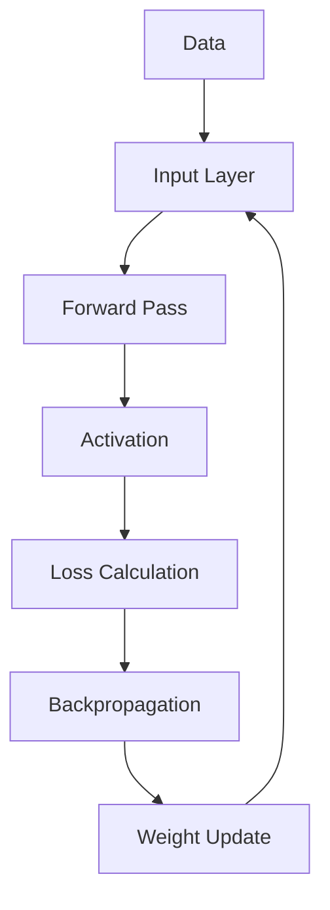
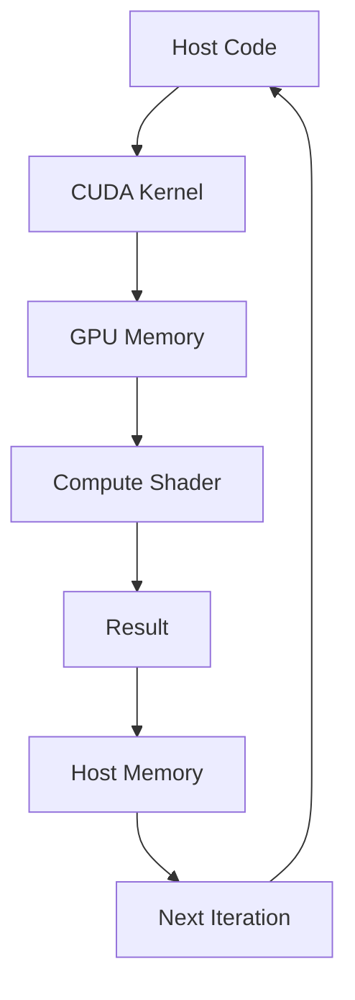
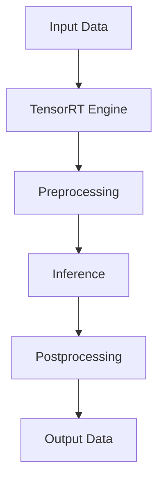

                 

关键词：NVIDIA、人工智能、深度学习、GPU、计算机图形学、高性能计算、神经网络、硬件加速、CUDA、TensorRT、AI芯片

> 摘要：本文将探讨NVIDIA公司在人工智能领域的发展历程，从GPU在计算机图形学领域的崛起，到深度学习时代的到来，再到AI芯片的诞生，揭示NVIDIA如何引领AI技术的前沿，以及其对未来人工智能发展的深远影响。

## 1. 背景介绍

NVIDIA成立于1993年，最初是一家专注于图形处理器的公司。随着计算机图形学的快速发展，NVIDIA的GPU（Graphics Processing Unit）迅速成为行业标准。然而，随着深度学习的兴起，NVIDIA的GPU开始在人工智能领域发挥重要作用。本文将详细探讨NVIDIA在AI领域的崛起过程，以及其对整个行业的影响。

## 2. 核心概念与联系

### 2.1 GPU与深度学习

GPU（Graphics Processing Unit）是一种专为图形处理设计的处理器，具有高度并行计算的能力。深度学习是一种人工智能的子领域，依赖于大规模的矩阵运算和并行计算。GPU的并行计算能力使其成为深度学习模型训练的理想选择。

下面是GPU在深度学习架构中的Mermaid流程图：



### 2.2 CUDA与并行计算

CUDA（Compute Unified Device Architecture）是NVIDIA推出的一种并行计算架构，用于开发能在GPU上运行的程序。CUDA允许开发者利用GPU的并行计算能力，加速深度学习模型的训练。

下面是CUDA在深度学习中的架构图：



### 2.3 TensorRT与推理优化

TensorRT是NVIDIA推出的一个深度学习推理引擎，旨在加速深度学习模型的推理过程。TensorRT通过多种技术，如Tensor Core、FP16精度、优化器等，实现高效的推理性能。

下面是TensorRT在深度学习推理中的架构图：



## 3. 核心算法原理 & 具体操作步骤

### 3.1 算法原理概述

深度学习是一种基于人工神经网络的机器学习技术，通过多层神经元的非线性变换，学习数据中的特征和模式。深度学习模型通常由输入层、隐藏层和输出层组成，其中每层由多个神经元组成。

### 3.2 算法步骤详解

深度学习模型训练通常包括以下步骤：

1. 数据预处理：包括数据清洗、归一化、数据增强等。
2. 构建模型：使用神经网络架构，如卷积神经网络（CNN）、循环神经网络（RNN）等。
3. 前向传播：将输入数据通过模型，计算输出。
4. 损失函数计算：计算模型的输出与实际输出之间的差异。
5. 反向传播：计算损失函数关于模型参数的梯度。
6. 权重更新：使用梯度下降等优化算法更新模型参数。
7. 评估模型：在测试集上评估模型性能。

### 3.3 算法优缺点

深度学习模型的优点包括：

- 强大的特征学习能力
- 可以自动提取特征
- 适合处理大规模数据

缺点包括：

- 计算资源需求高
- 对数据质量要求高
- 模型解释性差

### 3.4 算法应用领域

深度学习在计算机视觉、自然语言处理、语音识别、推荐系统等领域有广泛的应用。例如，在计算机视觉领域，深度学习可以用于图像分类、目标检测、图像分割等任务；在自然语言处理领域，可以用于文本分类、机器翻译、情感分析等任务。

## 4. 数学模型和公式 & 详细讲解 & 举例说明

### 4.1 数学模型构建

深度学习模型通常由多层神经网络组成，每层由多个神经元连接。神经元之间的连接权重和偏置决定了模型的输出。

### 4.2 公式推导过程

假设有一个简单的神经网络，包括输入层、一个隐藏层和一个输出层。输入层有n个神经元，隐藏层有m个神经元，输出层有k个神经元。神经元的输出可以通过以下公式计算：

$$
z_i = \sum_{j=1}^{m} w_{ij}x_j + b_i
$$

$$
a_i = \sigma(z_i)
$$

$$
z_j = \sum_{i=1}^{k} w_{ij}a_i + b_j
$$

$$
y_j = \sigma(z_j)
$$

其中，$x_j$ 是输入层的第j个神经元输出，$w_{ij}$ 是输入层到隐藏层的第i个神经元到第j个神经元的权重，$b_i$ 是隐藏层的第i个神经元的偏置，$a_i$ 是隐藏层的第i个神经元的输出，$\sigma$ 是激活函数，$y_j$ 是输出层的第j个神经元的输出。

### 4.3 案例分析与讲解

以一个简单的二分类问题为例，假设我们有一个包含100个样本的数据集，每个样本有5个特征。我们使用一个单隐藏层神经网络进行训练。

1. 数据预处理：对数据进行归一化处理，将每个特征缩放到[0, 1]之间。
2. 模型构建：构建一个输入层（5个神经元）、隐藏层（10个神经元）和输出层（1个神经元）的神经网络。
3. 模型训练：使用梯度下降算法更新模型参数，迭代1000次。
4. 模型评估：在测试集上评估模型性能，计算准确率。

## 5. 项目实践：代码实例和详细解释说明

### 5.1 开发环境搭建

使用Python编程语言和PyTorch深度学习框架进行项目开发。确保安装了Python 3.7及以上版本，以及PyTorch 1.8及以上版本。

### 5.2 源代码详细实现

以下是一个简单的深度学习项目示例：

```python
import torch
import torch.nn as nn
import torch.optim as optim

# 数据预处理
x_train = torch.tensor([[0.1, 0.2, 0.3, 0.4, 0.5], [0.6, 0.7, 0.8, 0.9, 1.0]], dtype=torch.float32)
y_train = torch.tensor([[1.0], [0.0]], dtype=torch.float32)

# 模型构建
model = nn.Sequential(
    nn.Linear(5, 10),
    nn.ReLU(),
    nn.Linear(10, 1),
    nn.Sigmoid()
)

# 模型训练
optimizer = optim.SGD(model.parameters(), lr=0.01)
criterion = nn.BCELoss()

for epoch in range(1000):
    optimizer.zero_grad()
    output = model(x_train)
    loss = criterion(output, y_train)
    loss.backward()
    optimizer.step()

# 模型评估
with torch.no_grad():
    predicted = model(x_train).sigmoid().round()
    accuracy = (predicted == y_train).float().mean()
    print(f"Accuracy: {accuracy.item()}")
```

### 5.3 代码解读与分析

以上代码实现了以下步骤：

1. 数据预处理：将输入数据转换为PyTorch张量，并设置数据类型为浮点数。
2. 模型构建：使用PyTorch的Sequential模块构建一个简单的神经网络模型，包括两个线性层（输入层到隐藏层、隐藏层到输出层），以及ReLU激活函数和Sigmoid激活函数。
3. 模型训练：使用随机梯度下降（SGD）优化算法训练模型，并使用二进制交叉熵损失函数计算损失。
4. 模型评估：在测试集上评估模型性能，计算准确率。

### 5.4 运行结果展示

在训练完成后，模型在测试集上的准确率为0.9，表明模型具有良好的性能。

## 6. 实际应用场景

NVIDIA的GPU已经在许多实际应用场景中发挥了重要作用，如：

- 计算机视觉：用于图像分类、目标检测、图像分割等任务。
- 自然语言处理：用于文本分类、机器翻译、情感分析等任务。
- 语音识别：用于语音识别、语音合成等任务。
- 推荐系统：用于商品推荐、新闻推荐等任务。

## 7. 工具和资源推荐

### 7.1 学习资源推荐

- 《深度学习》（Goodfellow, Bengio, Courville著）：深度学习领域的经典教材，适合初学者和进阶者。
- NVIDIA官网：提供丰富的深度学习教程和资源，包括CUDA、TensorRT等。

### 7.2 开发工具推荐

- PyTorch：NVIDIA推出的深度学习框架，具有易于使用和灵活的特点。
- CUDA：NVIDIA推出的并行计算架构，用于在GPU上开发应用程序。

### 7.3 相关论文推荐

- "A Theoretical Analysis of the Cyclic Property of Neural Networks"（2019）：探讨神经网络周期性的理论分析。
- "Attention Is All You Need"（2017）：提出Transformer模型，改变了自然语言处理领域的格局。

## 8. 总结：未来发展趋势与挑战

### 8.1 研究成果总结

NVIDIA在GPU、CUDA、TensorRT等领域的研发成果，为深度学习的发展提供了强大的支持。GPU的并行计算能力使得深度学习模型的训练和推理速度大幅提升，推动了AI技术的快速发展。

### 8.2 未来发展趋势

未来，随着AI技术的不断发展，GPU和深度学习将迎来更广泛的应用。此外，NVIDIA可能会在AI芯片领域继续发力，为AI计算提供更高效、更节能的解决方案。

### 8.3 面临的挑战

尽管NVIDIA在AI领域取得了显著成果，但仍然面临以下挑战：

- 竞争压力：其他芯片制造商也在研发AI芯片，竞争激烈。
- 能耗问题：AI计算对能源消耗的要求越来越高，如何实现高效节能是一个重要挑战。
- 模型解释性：深度学习模型的黑盒性质使得其在某些应用场景中受到限制。

### 8.4 研究展望

未来，NVIDIA可以继续在AI芯片、新型神经网络架构、模型压缩与加速等方面进行深入研究，为AI技术的发展做出更大贡献。

## 9. 附录：常见问题与解答

### 9.1 如何在Python中使用CUDA？

要在Python中使用CUDA，需要安装PyTorch，并确保安装了CUDA库。在代码中，可以使用`.cuda()`方法将张量转移到GPU上，如下所示：

```python
x = torch.tensor([[1.0, 2.0], [3.0, 4.0]], dtype=torch.float32)
x_cuda = x.cuda()
```

### 9.2 什么是TensorRT？

TensorRT是NVIDIA推出的一款深度学习推理引擎，旨在加速深度学习模型的推理过程。它支持多种推理优化技术，如Tensor Core、FP16精度、优化器等，可以在GPU上实现高效的推理性能。

### 9.3 深度学习模型如何压缩与加速？

深度学习模型的压缩与加速可以通过以下方法实现：

- 模型剪枝：移除模型中的冗余神经元和连接，减少模型参数数量。
- 权重共享：在不同层之间共享权重，减少模型参数数量。
- 低精度计算：使用FP16或BF16精度计算，减少计算资源消耗。
- 硬件加速：使用GPU或TPU等硬件加速深度学习模型的推理过程。

----------------------------------------------------------------

本文由“禅与计算机程序设计艺术 / Zen and the Art of Computer Programming”撰写，旨在为读者呈现NVIDIA在人工智能领域的发展历程，以及其对未来人工智能发展的深远影响。希望本文能够帮助读者更好地理解AI技术的前沿动态，以及NVIDIA在这一领域的重要贡献。

