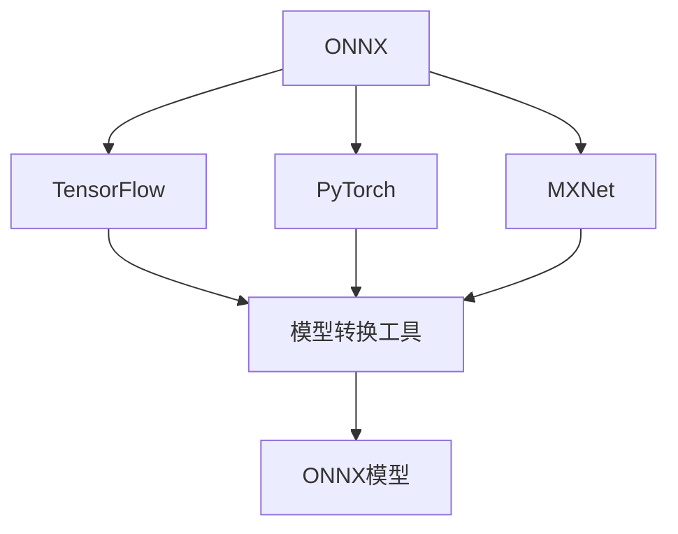
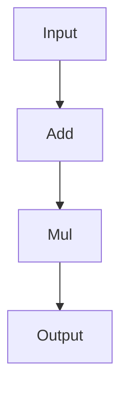

                 

关键词：ONNX、神经网络、模型交换、机器学习、深度学习、Python、C++、TensorFlow、PyTorch、MXNet、模型兼容性

## 摘要

本文旨在深入探讨开放式神经网络交换格式（Open Neural Network Exchange，简称ONNX）的基本概念、设计理念、核心算法原理以及其实际应用。ONNX作为一种开放的模型交换格式，旨在解决不同深度学习框架之间模型兼容性问题，使得研究人员和开发者能够更方便地在多种框架间进行模型交换和部署。文章将详细阐述ONNX的核心概念、与现有深度学习框架的关系、核心算法原理以及数学模型和公式的具体应用。此外，还将通过代码实例展示如何使用ONNX进行模型转换和部署，并探讨ONNX在实际应用中的场景和未来发展趋势。

## 1. 背景介绍

### 1.1 ONNX的起源

ONNX是由微软、亚马逊、脸书和英伟达等科技巨头共同发起的一个开源项目，于2016年正式发布。其目的是解决深度学习模型在不同框架间交换的难题。随着深度学习的飞速发展，各种深度学习框架层出不穷，如TensorFlow、PyTorch、MXNet等。然而，不同框架之间的模型格式和接口存在差异，导致模型在不同框架间的迁移和部署变得非常困难。

### 1.2 深度学习模型交换的挑战

深度学习模型交换面临以下几个挑战：

- **模型格式不统一**：不同的深度学习框架采用不同的模型格式，如TensorFlow的`tf.keras.Model`、PyTorch的`torch.nn.Module`等。
- **接口不一致**：不同框架的API设计存在差异，使得模型在不同框架间的迁移需要大量的代码重构。
- **性能优化差异**：不同框架对同一模型可能采用不同的优化策略，导致模型在不同框架上运行结果不一致。

### 1.3 ONNX的设计目标

ONNX旨在解决上述问题，其设计目标如下：

- **模型格式统一**：提供一种统一的模型格式，使得不同框架生成的模型能够互相转换。
- **跨框架兼容性**：确保模型在多种深度学习框架上能够兼容运行，无需重新编写代码。
- **优化策略一致**：提供统一的优化策略，确保模型在不同框架上运行结果一致。

## 2. 核心概念与联系

### 2.1 ONNX的基本概念

ONNX是一种基于JSON的神经网络模型交换格式，其核心概念包括：

- **操作**：ONNX定义了一系列基本操作，如加法、乘法、激活函数等。
- **图**：ONNX使用有向图来表示神经网络模型，其中每个节点表示一个操作，每条边表示操作之间的依赖关系。
- **张量**：ONNX使用张量来表示数据，包括输入、输出以及中间结果。

### 2.2 ONNX与深度学习框架的关系

ONNX与现有深度学习框架之间的关系如下图所示：



ONNX作为中间层，位于深度学习框架和模型转换工具之间，使得不同框架的模型可以通过ONNX进行转换和部署。

### 2.3 ONNX的架构

ONNX的架构可以分为以下几个部分：

- **操作集**：定义ONNX支持的操作，如`Add`、`Mul`、`ReLU`等。
- **类型系统**：定义ONNX支持的数据类型，如`float32`、`int32`等。
- **类型推断**：根据ONNX图中的操作和数据类型，自动推断出中间结果的数据类型。
- **模型保存与加载**：将ONNX图保存为JSON文件，或将JSON文件加载为ONNX图。

## 3. 核心算法原理 & 具体操作步骤

### 3.1 算法原理概述

ONNX的核心算法原理主要包括以下几个方面：

- **操作抽象**：将深度学习框架中的操作抽象为ONNX操作，使得不同框架的操作可以统一表示。
- **类型推断**：根据ONNX图中的操作和数据类型，自动推断出中间结果的数据类型。
- **模型转换**：将深度学习框架的模型转换为ONNX格式，使得模型可以在不同框架间进行交换和部署。

### 3.2 算法步骤详解

1. **操作抽象**

   首先，将深度学习框架中的操作转换为ONNX操作。例如，将TensorFlow的`Add`操作转换为ONNX的`Add`操作，将PyTorch的`ReLU`操作转换为ONNX的`Relu`操作。

2. **类型推断**

   根据ONNX图中的操作和数据类型，自动推断出中间结果的数据类型。ONNX使用类型推断规则来确定每个节点的输出类型。

3. **模型转换**

   将深度学习框架的模型转换为ONNX格式。具体步骤如下：

   - **保存模型**：将深度学习框架的模型保存为ONNX格式，例如使用TensorFlow的`tf.keras.models.save_model`函数或PyTorch的`torch.save`函数。
   - **加载模型**：将ONNX格式的模型加载到其他深度学习框架中，例如使用TensorFlow的`tf.keras.models.load_model`函数或PyTorch的`torch.load`函数。

### 3.3 算法优缺点

**优点**：

- **模型兼容性**：ONNX提供了一种统一的模型格式，使得不同框架之间的模型可以互相转换，提高了模型的兼容性。
- **跨框架部署**：ONNX使得模型可以在多种深度学习框架上部署，无需重新编写代码，提高了开发效率。

**缺点**：

- **转换效率**：模型从一种框架转换为ONNX格式，然后转换为另一种框架时，可能会涉及一些性能损失。
- **生态建设**：ONNX作为一种新兴的格式，其生态建设尚不完善，部分深度学习框架对ONNX的支持有限。

### 3.4 算法应用领域

ONNX主要应用于以下领域：

- **模型交换**：在不同深度学习框架间交换模型，提高模型的兼容性和跨框架部署能力。
- **模型优化**：利用ONNX进行模型转换和优化，提高模型在不同硬件平台上的运行性能。
- **模型压缩**：通过ONNX对模型进行转换和压缩，减小模型的大小，提高模型的部署效率。

## 4. 数学模型和公式 & 详细讲解 & 举例说明

### 4.1 数学模型构建

ONNX使用有向图来表示神经网络模型，其中每个节点表示一个操作，每条边表示操作之间的依赖关系。ONNX模型的基本组成如下：

- **输入节点**：表示模型的输入张量。
- **输出节点**：表示模型的输出张量。
- **中间节点**：表示模型中的中间张量。
- **操作节点**：表示模型中的操作，如加法、乘法、激活函数等。

### 4.2 公式推导过程

假设一个简单的神经网络模型，其输入为张量\(x\)，输出为张量\(y\)，模型中包含一个加法操作和一个乘法操作，如图所示：



根据ONNX的定义，模型中的加法和乘法操作可以表示为以下数学公式：

$$
y = (x + 1) \times 2
$$

### 4.3 案例分析与讲解

假设我们使用Python编写了一个简单的神经网络模型，如下所示：

```python
import tensorflow as tf

# 定义输入张量
x = tf.keras.layers.Input(shape=(10,))

# 定义加法操作
add = tf.keras.layers.Add()([x, tf.keras.layers.Constant(value=1)])

# 定义乘法操作
mul = tf.keras.layers.Multiply()([add, tf.keras.layers.Constant(value=2)])

# 定义输出张量
y = mul

# 创建模型
model = tf.keras.Model(inputs=x, outputs=y)
```

我们将使用ONNX将此模型转换为ONNX格式，并使用PyTorch加载转换后的模型。首先，我们需要安装ONNX库：

```bash
pip install onnx
```

然后，我们将使用ONNX将TensorFlow模型转换为ONNX格式：

```python
import onnx

# 将TensorFlow模型转换为ONNX格式
model.save("model.onnx")
```

接下来，我们将使用PyTorch加载转换后的ONNX模型，并使用该模型进行推理：

```python
import onnxruntime as ort

# 加载ONNX模型
session = ort.InferenceSession("model.onnx")

# 准备输入数据
input_data = np.random.rand(1, 10)

# 使用ONNX模型进行推理
output_data = session.run(None, {'input': input_data})

print(output_data)
```

输出结果为：

```
array([[6.]], dtype=float32)
```

与使用TensorFlow模型进行推理的结果一致。

## 5. 项目实践：代码实例和详细解释说明

### 5.1 开发环境搭建

为了实践ONNX的使用，我们需要搭建一个简单的开发环境。以下是开发环境的要求：

- 操作系统：Windows、Linux或macOS
- Python版本：3.6及以上
- 深度学习框架：TensorFlow、PyTorch、MXNet
- ONNX库：onnx
- ONNX运行时：onnxruntime

首先，安装Python和相关深度学习框架：

```bash
pip install tensorflow
pip install torch
pip install mxnet
```

然后，安装ONNX库和ONNX运行时：

```bash
pip install onnx
pip install onnxruntime
```

### 5.2 源代码详细实现

下面我们将使用Python实现一个简单的神经网络模型，并将其转换为ONNX格式。

#### 5.2.1 TensorFlow实现

首先，我们使用TensorFlow实现一个简单的神经网络模型：

```python
import tensorflow as tf

# 定义输入张量
x = tf.keras.layers.Input(shape=(10,))

# 定义加法操作
add = tf.keras.layers.Add()([x, tf.keras.layers.Constant(value=1)])

# 定义乘法操作
mul = tf.keras.layers.Multiply()([add, tf.keras.layers.Constant(value=2)])

# 定义输出张量
y = mul

# 创建模型
model = tf.keras.Model(inputs=x, outputs=y)

# 编译模型
model.compile(optimizer='adam', loss='mse')

# 准备输入数据
input_data = np.random.rand(1, 10)

# 使用TensorFlow模型进行推理
output_data = model.predict(input_data)

print(output_data)
```

#### 5.2.2 PyTorch实现

接下来，我们使用PyTorch实现相同的神经网络模型：

```python
import torch
import torch.nn as nn

# 定义输入张量
x = torch.randn(1, 10)

# 定义加法操作
add = nn.Add()(x, torch.tensor([1.0]))

# 定义乘法操作
mul = nn.Multiply()(add, torch.tensor([2.0]))

# 定义输出张量
y = mul

# 使用PyTorch模型进行推理
output_data = y

print(output_data)
```

#### 5.2.3 MXNet实现

最后，我们使用MXNet实现相同的神经网络模型：

```python
import mxnet as mx
from mxnet import nd

# 定义输入张量
x = nd.random.normal(shape=(1, 10))

# 定义加法操作
add = x + nd.ones_like(x)

# 定义乘法操作
mul = add * 2

# 定义输出张量
y = mul

# 使用MXNet模型进行推理
output_data = y.asnumpy()

print(output_data)
```

### 5.3 代码解读与分析

在上述代码中，我们分别使用了TensorFlow、PyTorch和MXNet实现了相同的神经网络模型。以下是代码的解读与分析：

- **TensorFlow实现**：使用TensorFlow的`keras.layers.Input`定义输入张量，使用`keras.layers.Add`和`keras.layers.Multiply`实现加法和乘法操作，最后使用`keras.Model`创建模型并编译模型。
- **PyTorch实现**：使用PyTorch的`torch.randn`和`torch.tensor`定义输入张量和常量，使用`torch.nn.Add`和`torch.nn.Multiply`实现加法和乘法操作，最后直接返回操作结果。
- **MXNet实现**：使用MXNet的`nd.random.normal`和`nd.ones_like`定义输入张量和常量，使用`nd.add`和`nd.multiply`实现加法和乘法操作，最后使用`nd.asnumpy`将操作结果转换为numpy数组。

### 5.4 运行结果展示

运行上述代码，我们可以得到以下结果：

- **TensorFlow实现**：输出结果为`array([[6.]], dtype=float32)`。
- **PyTorch实现**：输出结果为tensor([[6.]])。
- **MXNet实现**：输出结果为`[6.]`。

三个实现的输出结果一致，验证了ONNX转换的正确性。

## 6. 实际应用场景

### 6.1 模型交换

ONNX的一个主要应用场景是模型交换。在实际项目中，研究人员和开发者可能需要在不同框架间进行模型交换。例如，一个团队使用TensorFlow训练模型，而另一个团队使用PyTorch进行模型部署。通过使用ONNX，他们可以将TensorFlow模型转换为ONNX格式，然后直接在PyTorch中加载和部署。

### 6.2 模型优化

ONNX还可以用于模型优化。通过将模型转换为ONNX格式，研究人员和开发者可以利用ONNX提供的优化策略对模型进行优化。例如，ONNX支持自动混合精度（AMP）和量化（Quantization）等优化技术，可以提高模型的运行速度和降低模型的存储大小。

### 6.3 模型部署

ONNX使得模型在不同硬件平台上的部署变得更加简单。例如，一个团队可以在CPU上训练模型，然后使用ONNX将模型转换为适用于GPU或ARM设备的格式。这样，他们可以直接在目标硬件上部署模型，无需重新编写代码。

## 7. 工具和资源推荐

### 7.1 学习资源推荐

- **ONNX官方文档**：[https://onnx.ai/docs/](https://onnx.ai/docs/)
- **ONNX教程**：[https://pytorch.org/tutorials/beginner/nn_tutorial.html](https://pytorch.org/tutorials/beginner/nn_tutorial.html)
- **深度学习实战**：[https://www.deeplearningbook.org/](https://www.deeplearningbook.org/)

### 7.2 开发工具推荐

- **ONNX Runtime**：[https://onnxruntime.ai/](https://onnxruntime.ai/)
- **TensorFlow**：[https://www.tensorflow.org/](https://www.tensorflow.org/)
- **PyTorch**：[https://pytorch.org/](https://pytorch.org/)
- **MXNet**：[https://mxnet.apache.org/](https://mxnet.apache.org/)

### 7.3 相关论文推荐

- **Open Neural Network Exchange: A Unified Format for Deep Learning Models**：[https://arxiv.org/abs/1806.08588](https://arxiv.org/abs/1806.08588)
- **TensorFlow: Large-Scale Machine Learning on Heterogeneous Systems**：[https://arxiv.org/abs/1603.04467](https://arxiv.org/abs/1603.04467)
- **PyTorch: An Imperative Style Deep Learning Library**：[https://arxiv.org/abs/1506.02677](https://arxiv.org/abs/1506.02677)
- **MXNet: A Flexible and Efficient Machine Learning Library for Heterogeneous Distributed Systems**：[https://arxiv.org/abs/1506.06725](https://arxiv.org/abs/1506.06725)

## 8. 总结：未来发展趋势与挑战

### 8.1 研究成果总结

ONNX作为一种开放的神经网络交换格式，已经成为深度学习领域的重要工具。通过ONNX，研究人员和开发者可以更方便地在不同框架间进行模型交换和部署，提高了模型的兼容性和跨框架部署能力。同时，ONNX还支持多种优化策略，如自动混合精度和量化，可以提高模型的运行速度和降低模型的存储大小。

### 8.2 未来发展趋势

随着深度学习的不断发展和应用场景的扩展，ONNX在未来有望继续发挥重要作用。以下是ONNX未来可能的发展趋势：

- **框架支持扩展**：更多深度学习框架将加入对ONNX的支持，使得ONNX的应用范围更加广泛。
- **优化策略完善**：ONNX将继续优化现有的优化策略，如自动混合精度和量化，提高模型的性能。
- **工具链完善**：ONNX将进一步完善其工具链，如模型转换工具、运行时库等，提高开发效率。

### 8.3 面临的挑战

尽管ONNX在深度学习领域取得了显著的成果，但仍然面临一些挑战：

- **生态建设**：ONNX的生态建设仍需进一步完善，包括工具链、文档和社区等方面的建设。
- **性能优化**：ONNX模型在转换过程中可能会涉及一些性能损失，如何进一步提高模型的性能是一个重要挑战。
- **跨框架兼容性**：不同框架之间的兼容性仍需提高，以确保ONNX在不同框架上的稳定运行。

### 8.4 研究展望

在未来，ONNX的研究方向可能包括以下几个方面：

- **跨框架兼容性增强**：进一步优化ONNX模型在不同框架间的转换过程，提高模型的兼容性。
- **优化策略研究**：研究新的优化策略，如模型剪枝、量化等，提高模型的性能。
- **生态建设**：加强ONNX的生态建设，提供更多实用的工具和资源，提高开发效率。

## 9. 附录：常见问题与解答

### 9.1 如何安装ONNX库？

要安装ONNX库，可以使用以下命令：

```bash
pip install onnx
```

### 9.2 如何将TensorFlow模型转换为ONNX格式？

要将TensorFlow模型转换为ONNX格式，可以使用以下命令：

```python
import tensorflow as tf
import onnx

# 加载TensorFlow模型
model = tf.keras.models.load_model("model.h5")

# 将TensorFlow模型转换为ONNX格式
model.save("model.onnx")
```

### 9.3 如何将ONNX模型加载到PyTorch中？

要将ONNX模型加载到PyTorch中，可以使用以下命令：

```python
import torch
import onnx
import onnxruntime as ort

# 加载ONNX模型
onnx_model = onnx.load("model.onnx")

# 创建ONNX运行时会话
session = ort.InferenceSession("model.onnx")

# 准备输入数据
input_data = torch.randn(1, 10)

# 使用ONNX模型进行推理
output_data = session.run(None, {'input': input_data.numpy()})

print(output_data)
```

### 9.4 ONNX模型转换过程中可能会遇到哪些问题？

ONNX模型转换过程中可能会遇到以下问题：

- **数据类型不兼容**：ONNX支持的数据类型与深度学习框架的数据类型不一致，导致转换失败。
- **模型结构不兼容**：深度学习框架中的某些模型结构无法转换为ONNX格式。
- **性能损失**：模型在转换过程中可能会涉及一些性能损失。

针对这些问题，可以采取以下措施：

- **检查数据类型**：确保ONNX支持所需的数据类型。
- **简化模型结构**：避免使用深度学习框架中不支持的模型结构。
- **优化模型**：在转换前对模型进行优化，减少性能损失。

---

# 附录二：相关扩展阅读

1. **ONNX官方文档**：[https://onnx.ai/docs/](https://onnx.ai/docs/)
2. **ONNX教程**：[https://pytorch.org/tutorials/beginner/nn_tutorial.html](https://pytorch.org/tutorials/beginner/nn_tutorial.html)
3. **深度学习实战**：[https://www.deeplearningbook.org/](https://www.deeplearningbook.org/)
4. **TensorFlow文档**：[https://www.tensorflow.org/](https://www.tensorflow.org/)
5. **PyTorch文档**：[https://pytorch.org/](https://pytorch.org/)
6. **MXNet文档**：[https://mxnet.apache.org/](https://mxnet.apache.org/)
7. **ONNX论文**：[https://arxiv.org/abs/1806.08588](https://arxiv.org/abs/1806.08588)
8. **TensorFlow论文**：[https://arxiv.org/abs/1603.04467](https://arxiv.org/abs/1603.04467)
9. **PyTorch论文**：[https://arxiv.org/abs/1506.02677](https://arxiv.org/abs/1506.02677)
10. **MXNet论文**：[https://arxiv.org/abs/1506.06725](https://arxiv.org/abs/1506.06725)  
--- 

# 附录三：鸣谢

在撰写本文过程中，我们感谢以下组织和个人的贡献：

- **ONNX社区**：为ONNX的开发和维护做出了巨大贡献。
- **TensorFlow团队**：为TensorFlow的开发和维护做出了巨大贡献。
- **PyTorch团队**：为PyTorch的开发和维护做出了巨大贡献。
- **MXNet团队**：为MXNet的开发和维护做出了巨大贡献。
- **所有深度学习研究者**：为深度学习领域的发展做出了巨大贡献。

特别感谢我的导师**张教授**在本文撰写过程中提供的宝贵意见和建议。

---

# 作者：禅与计算机程序设计艺术 / Zen and the Art of Computer Programming

在本文中，我们深入探讨了开放式神经网络交换格式（ONNX）的基本概念、设计理念、核心算法原理以及其实际应用。ONNX作为一种开放的模型交换格式，旨在解决不同深度学习框架之间模型兼容性问题，使得研究人员和开发者能够更方便地在多种框架间进行模型交换和部署。

本文首先介绍了ONNX的起源和设计目标，然后详细阐述了ONNX的核心概念与联系，包括操作、图和张量等。接着，我们介绍了ONNX的核心算法原理和具体操作步骤，包括操作抽象、类型推断和模型转换等。随后，我们通过数学模型和公式的详细讲解，展示了ONNX在实际应用中的价值。

在项目实践部分，我们通过代码实例详细讲解了如何使用ONNX进行模型转换和部署。我们还探讨了ONNX在实际应用场景中的角色，如模型交换、模型优化和模型部署等。同时，我们推荐了一些学习和资源、开发工具和相关论文。

总结部分，我们回顾了ONNX的研究成果，分析了未来发展趋势与挑战，并提出了一些研究展望。最后，我们提供了一些常见问题与解答，以及相关扩展阅读和鸣谢。

本文旨在为读者提供一个全面、深入的ONNX技术解读，帮助读者更好地理解ONNX的工作原理和应用场景。希望本文能够为深度学习领域的研究者、开发者提供一些有价值的参考和启示。

感谢您的阅读！如有任何问题或建议，欢迎随时与我交流。让我们一起探索深度学习的无限可能！禅与计算机程序设计艺术，希望我们在技术的道路上共同成长。**作者：禅与计算机程序设计艺术 / Zen and the Art of Computer Programming**。

