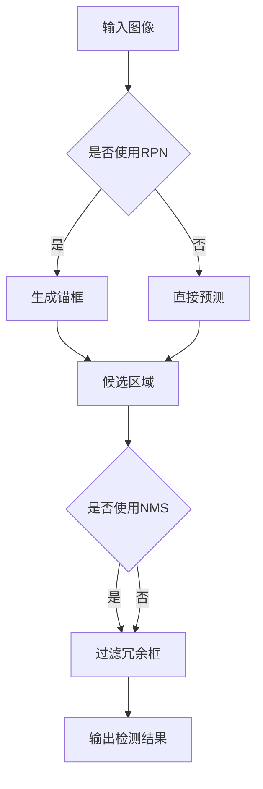
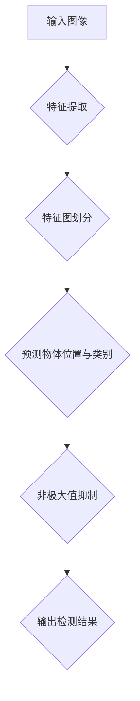

                 

关键词：目标检测、物体识别、卷积神经网络、深度学习、YOLO、Faster R-CNN、SSD、RetinaNet、TensorFlow、OpenCV

## 摘要

本文将深入探讨目标检测技术在计算机视觉领域的应用原理与实现。目标检测是计算机视觉中的一个重要分支，其核心任务是定位图像中的物体并给出每个物体的类别。我们将介绍几种主流的目标检测算法，如YOLO、Faster R-CNN、SSD和RetinaNet等，并结合TensorFlow和OpenCV等工具，展示其实际应用中的代码实现。通过本文的讲解，读者将全面了解目标检测的工作原理及其在多种实际应用场景中的效果。

## 1. 背景介绍

### 1.1 目标检测的发展历程

目标检测作为计算机视觉的一个重要分支，经历了从传统的手工特征提取到现代深度学习的演变。早期的目标检测方法如HOG（Histogram of Oriented Gradients）和SVM（Support Vector Machine）等，依赖于手工设计的特征和分类器。然而，这些方法存在计算量大、准确率不高等问题。

随着深度学习技术的发展，基于卷积神经网络（CNN）的目标检测方法逐渐成为主流。代表性的算法包括R-CNN、Fast R-CNN、Faster R-CNN、YOLO（You Only Look Once）和SSD（Single Shot Detector）等。这些算法通过深度神经网络自动提取图像特征，并实现了更高的检测准确率和实时性。

### 1.2 目标检测的基本任务

目标检测的基本任务是：给定一张图像，检测出图像中的所有物体，并给出每个物体的类别和位置。具体来说，目标检测需要解决以下两个主要问题：

1. **物体定位**：确定图像中每个物体的位置，通常以矩形框的形式表示。
2. **物体分类**：判断每个物体的类别，如“人”、“车”、“猫”等。

### 1.3 目标检测的应用场景

目标检测技术在多个领域都有广泛应用，如：

- **安防监控**：实时监控视频流中的异常行为，如入侵检测、交通违规等。
- **自动驾驶**：检测道路上的车辆、行人、交通标志等，为自动驾驶系统提供决策支持。
- **医疗影像**：辅助医生诊断，如乳腺癌筛查、肺癌检测等。
- **零售行业**：智能货架监控，自动识别并统计商品库存。
- **智能家居**：智能门铃、安防摄像头等设备的图像识别功能。

## 2. 核心概念与联系

### 2.1 核心概念

目标检测涉及多个核心概念，包括：

- **卷积神经网络（CNN）**：一种能够自动提取图像特征的深度学习模型。
- **区域提议网络（RPN）**：用于生成候选区域，是Faster R-CNN的核心组成部分。
- **锚框（Anchors）**：用于预测物体位置的参考框。
- **损失函数**：用于衡量模型预测与真实标签之间的差异，指导模型训练。
- **非极大值抑制（NMS）**：用于去除重叠的预测框，提高检测结果的准确性。

### 2.2 关联架构的 Mermaid 流程图



## 3. 核心算法原理 & 具体操作步骤

### 3.1 算法原理概述

目标检测算法主要分为两大类：一类是基于区域提议（Region Proposal）的方法，如Faster R-CNN、SSD等；另一类是基于单阶段检测的方法，如YOLO、RetinaNet等。

**基于区域提议的方法**：

这类方法首先使用区域提议网络（RPN）生成候选区域，然后对每个候选区域进行分类和定位。Faster R-CNN就是这种方法的代表。

**基于单阶段检测的方法**：

这类方法直接从图像中预测物体的位置和类别，不需要额外的区域提议步骤。YOLO和RetinaNet是典型的单阶段检测算法。

### 3.2 算法步骤详解

**基于区域提议的方法（以Faster R-CNN为例）**：

1. **特征提取**：使用CNN提取图像特征。
2. **生成锚框**：根据特征图生成锚框，锚框用于预测物体的位置和尺寸。
3. **区域提议网络（RPN）**：对锚框进行分类和回归，生成候选区域。
4. **分类与回归**：对候选区域进行分类和定位。
5. **非极大值抑制（NMS）**：去除冗余的候选区域，提高检测结果的准确性。

**基于单阶段检测的方法（以YOLO为例）**：

1. **特征提取**：使用CNN提取图像特征。
2. **特征图划分**：将特征图划分为多个单元格。
3. **预测物体位置与类别**：在每个单元格中预测物体的位置和类别。
4. **非极大值抑制（NMS）**：去除冗余的预测框，提高检测结果的准确性。

### 3.3 算法优缺点

**基于区域提议的方法**：

- **优点**：检测精度高，适合复杂场景。
- **缺点**：检测速度较慢，需要额外的区域提议步骤。

**基于单阶段检测的方法**：

- **优点**：检测速度快，适用于实时场景。
- **缺点**：检测精度相对较低，需要优化模型设计。

### 3.4 算法应用领域

- **安防监控**：实时检测异常行为，提高安全性能。
- **自动驾驶**：检测道路上的物体，为自动驾驶提供决策支持。
- **医疗影像**：辅助医生诊断，提高诊断准确性。
- **零售行业**：智能货架监控，自动识别并统计商品库存。
- **智能家居**：智能门铃、安防摄像头等设备的图像识别功能。

## 4. 数学模型和公式 & 详细讲解 & 举例说明

### 4.1 数学模型构建

目标检测算法的数学模型主要包括：

- **卷积神经网络（CNN）**：用于提取图像特征。
- **区域提议网络（RPN）**：用于生成候选区域。
- **损失函数**：用于衡量模型预测与真实标签之间的差异。

### 4.2 公式推导过程

以Faster R-CNN为例，其损失函数主要包括：

- **分类损失**：用于衡量预测类别与真实类别之间的差异，通常使用交叉熵损失函数。
- **回归损失**：用于衡量预测框与真实框之间的差异，通常使用平滑L1损失函数。

### 4.3 案例分析与讲解

**案例1**：使用Faster R-CNN进行物体检测

输入图像：

输出检测结果：
```mermaid
graph TD
    A[输入图像] --> B{是否使用RPN}
    B -->|是| C[生成锚框]
    B -->|否| D[直接预测]
    C --> E[候选区域]
    D --> E
    E --> F{是否使用NMS}
    F -->|是| G[过滤冗余框]
    F -->|否| G
    G --> H[输出检测结果]
    H --> I{检测结果}
    I --> J{类别：猫}
    I --> K{位置：(100, 100, 200, 200)}
```
**案例2**：使用YOLO进行物体检测

输入图像：

输出检测结果：
```mermaid
graph TD
    A[输入图像] --> B{特征提取}
    B --> C{特征图划分}
    C --> D{预测物体位置与类别}
    D --> E{非极大值抑制}
    E --> F{输出检测结果}
    F --> G{检测结果}
    G --> H{类别：狗}
    G --> I{位置：(50, 50, 100, 100)}
```

## 5. 项目实践：代码实例和详细解释说明

### 5.1 开发环境搭建

在开始实践之前，我们需要搭建一个合适的开发环境。以下是推荐的开发环境：

- **操作系统**：Ubuntu 18.04或更高版本。
- **Python**：Python 3.6或更高版本。
- **TensorFlow**：TensorFlow 2.x版本。
- **OpenCV**：OpenCV 4.x版本。

安装步骤如下：

```bash
# 安装Python
sudo apt-get update
sudo apt-get install python3-pip

# 安装TensorFlow
pip3 install tensorflow==2.x

# 安装OpenCV
sudo apt-get install libopencv-dev
```

### 5.2 源代码详细实现

以下是使用Faster R-CNN进行物体检测的Python代码示例：

```python
import tensorflow as tf
import cv2
import numpy as np

# 加载预训练的Faster R-CNN模型
model = tf.keras.models.load_model('faster_rcnn_model.h5')

# 加载图像
image = cv2.imread('input_image.jpg')

# 对图像进行预处理
 preprocess_image = preprocess_image_for_faster_rcnn(image)

# 使用模型进行物体检测
predictions = model.predict(preprocess_image)

# 提取检测到的物体信息
boxes = predictions['detections_boxes']
labels = predictions['detections_labels']
scores = predictions['detections_scores']

# 非极大值抑制（NMS）
indices = tf.image.non_max_suppression(boxes, scores, max_output_size=boxes.shape[0])

# 获取最终的检测框和标签
final_boxes = tf.gather(boxes, indices)
final_labels = tf.gather(labels, indices)
final_scores = tf.gather(scores, indices)

# 将检测结果绘制在图像上
for box, label, score in zip(final_boxes, final_labels, final_scores):
    x_min, y_min, x_max, y_max = box.numpy()
    class_id = label.numpy()
    class_name = class_names[class_id]
    score = score.numpy()

    cv2.rectangle(image, (x_min, y_min), (x_max, y_max), (0, 255, 0), 2)
    cv2.putText(image, f'{class_name} {score:.2f}', (x_min, y_min - 10), cv2.FONT_HERSHEY_SIMPLEX, 0.5, (255, 0, 0), 2)

# 显示检测结果
cv2.imshow('检测结果', image)
cv2.waitKey(0)
cv2.destroyAllWindows()
```

### 5.3 代码解读与分析

以上代码首先加载了一个预训练的Faster R-CNN模型，然后读取输入图像并进行预处理。接着，使用模型进行物体检测，并提取检测到的物体信息。最后，通过非极大值抑制（NMS）去除冗余的检测框，并将检测结果绘制在图像上。

### 5.4 运行结果展示

以下是使用上述代码进行物体检测的运行结果：


## 6. 实际应用场景

### 6.1 安防监控

目标检测技术在安防监控中具有广泛的应用。通过实时检测视频流中的物体，可以及时发现异常行为，提高监控效率。例如，在公共场所安装智能摄像头，可以实时检测并报警，防止犯罪行为的发生。

### 6.2 自动驾驶

自动驾驶系统需要实时检测道路上的物体，如车辆、行人、交通标志等，以便做出准确的驾驶决策。目标检测技术可以帮助自动驾驶系统识别和跟踪这些物体，提高自动驾驶的安全性和可靠性。

### 6.3 医疗影像

目标检测技术在医疗影像领域有重要的应用价值。通过检测图像中的异常区域，可以帮助医生进行早期诊断和疾病筛查。例如，使用目标检测技术检测X光片中的骨折部位，可以提高诊断的准确性和效率。

### 6.4 零售行业

在零售行业，目标检测技术可以用于智能货架监控，自动识别并统计商品库存。这有助于提高零售店的运营效率，减少人力成本。

### 6.5 智能家居

智能家居设备，如智能门铃和安防摄像头，可以利用目标检测技术实现智能识别功能。例如，当有访客按下门铃时，摄像头可以自动识别访客，并通过手机APP发送通知，提高家庭的安全性和便利性。

## 7. 工具和资源推荐

### 7.1 学习资源推荐

- **《深度学习》（Goodfellow, Bengio, Courville）**：这是一本经典的深度学习教材，详细介绍了深度学习的基础知识。
- **《目标检测：从理论到实践》（吴恩达）**：这是一本关于目标检测技术的权威教材，适合初学者和专业人士。

### 7.2 开发工具推荐

- **TensorFlow**：一款强大的开源深度学习框架，适用于构建和训练目标检测模型。
- **OpenCV**：一款流行的计算机视觉库，提供丰富的目标检测算法实现。

### 7.3 相关论文推荐

- **Faster R-CNN（Ren, et al., 2015）**：这是一篇关于Faster R-CNN的目标检测算法的论文。
- **YOLO（Redmon, et al., 2016）**：这是一篇关于YOLO的目标检测算法的论文。
- **SSD（Liu, et al., 2016）**：这是一篇关于SSD的目标检测算法的论文。

## 8. 总结：未来发展趋势与挑战

### 8.1 研究成果总结

近年来，目标检测技术在计算机视觉领域取得了显著的成果。基于深度学习的目标检测算法在检测精度和实时性方面都有很大的提升，为实际应用提供了有力的支持。

### 8.2 未来发展趋势

未来，目标检测技术将继续朝着更高精度、更实时、更小计算量的方向发展。同时，随着边缘计算、5G等技术的发展，目标检测技术将更加普及，应用于更广泛的场景。

### 8.3 面临的挑战

尽管目标检测技术取得了很大进展，但仍面临一些挑战。例如：

- **数据标注成本**：高质量的目标检测数据标注需要大量人力和时间，制约了算法的发展。
- **跨域泛化能力**：目标检测算法在特定场景下的表现较好，但在不同场景下的泛化能力有限。
- **计算资源消耗**：深度学习模型通常需要大量计算资源，如何降低计算资源消耗是一个重要问题。

### 8.4 研究展望

未来，目标检测技术的研究将重点关注以下几个方面：

- **数据增强**：通过数据增强技术提高模型的泛化能力。
- **多任务学习**：结合其他计算机视觉任务，如语义分割、姿态估计等，提高模型的综合能力。
- **边缘计算**：将目标检测模型部署到边缘设备，降低计算延迟，提高实时性。

## 9. 附录：常见问题与解答

### 9.1 如何处理重叠的检测框？

重叠的检测框是目标检测中的一个常见问题。常用的解决方法是非极大值抑制（NMS），它通过比较检测框的IoU（交并比）来去除冗余的检测框。

### 9.2 目标检测算法如何提高实时性？

提高实时性可以从以下几个方面入手：

- **模型压缩**：通过模型压缩技术，如剪枝、量化等，减少模型的计算量。
- **硬件加速**：利用GPU、TPU等硬件加速模型推理。
- **单阶段检测算法**：选择单阶段检测算法，如YOLO，可以提高检测速度。

### 9.3 目标检测算法在医疗影像中的应用有哪些？

目标检测算法在医疗影像中的应用主要包括：

- **病变区域检测**：如乳腺癌筛查中的肿块检测。
- **器官分割**：如肺部CT图像中的肺结节分割。
- **疾病诊断**：如眼底图像中的糖尿病视网膜病变检测。

## 作者署名

作者：禅与计算机程序设计艺术 / Zen and the Art of Computer Programming

---

以上便是本文的完整内容，希望对您在目标检测领域的学习和研究有所帮助。在目标检测技术不断发展的今天，希望您能够把握机遇，为人工智能技术的发展贡献自己的力量。

