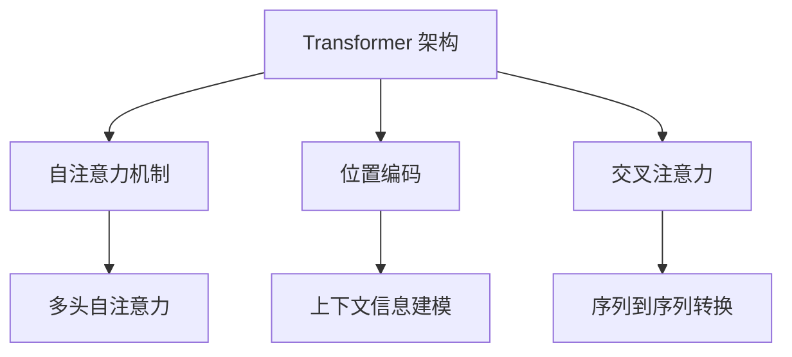

                 

关键词：OpenAI, GPT-4, GPT-3.5, GPT-3, 自然语言处理，人工智能，模型版本，模型改进，文本内容监管，中立化算法。

> 摘要：本文旨在深入探讨 OpenAI 推出的 GPT-4、GPT-3.5 和 GPT-3 模型的核心特点及其在自然语言处理领域的应用，特别是针对文本内容的中立化监管问题。通过分析不同版本模型的技术细节、数学模型和具体应用场景，本文为读者提供了一个全面的技术解读和未来展望。

## 1. 背景介绍

### 1.1 OpenAI 的发展历程

OpenAI 是一家致力于推动人工智能技术研究和应用的公司，成立于2015年。自成立以来，OpenAI 取得了多项重要成果，其中最为引人注目的便是其自然语言处理模型的研发。GPT（Generative Pre-trained Transformer）系列模型便是 OpenAI 在这一领域的代表性成果。

### 1.2 GPT-4、GPT-3.5 和 GPT-3 的发布背景

GPT-4 是 OpenAI 于 2023 年推出的最新一代语言处理模型。作为 GPT-3 的升级版本，GPT-4 在多个方面实现了显著提升。与此同时，OpenAI 还推出了 GPT-3.5，这是 GPT-3 的中间版本，用于衔接 GPT-4 和 GPT-3。此外，GPT-3 作为 OpenAI 于 2020 年推出的模型，其优秀的性能和广泛的应用场景使其成为了自然语言处理领域的重要里程碑。

## 2. 核心概念与联系

### 2.1 模型架构

GPT-4、GPT-3.5 和 GPT-3 都是基于 Transformer 架构的预训练模型。Transformer 架构在自然语言处理领域取得了显著成果，其核心思想是利用自注意力机制（Self-Attention）对输入序列进行建模，从而实现高效的序列到序列转换。

### 2.2 数学模型

在数学模型层面，GPT-4、GPT-3.5 和 GPT-3 都采用了类似的变体，包括多头自注意力（Multi-Head Self-Attention）和位置编码（Positional Encoding）等。此外，这些模型还引入了交叉注意力（Cross-Attention）机制，以实现上下文信息的有效融合。

### 2.3 Mermaid 流程图



## 3. 核心算法原理 & 具体操作步骤

### 3.1 算法原理概述

GPT-4、GPT-3.5 和 GPT-3 都是基于自注意力机制的 Transformer 架构。具体来说，这些模型通过多层自注意力机制和全连接层（Fully Connected Layer）来学习输入序列的上下文信息，并生成相应的输出序列。

### 3.2 算法步骤详解

1. **初始化**：模型首先初始化权重和偏置。
2. **输入序列编码**：输入序列经过嵌入层（Embedding Layer）和位置编码（Positional Encoding），生成编码后的序列。
3. **自注意力计算**：通过多头自注意力机制（Multi-Head Self-Attention）计算每个词在序列中的重要性。
4. **上下文信息建模**：利用交叉注意力机制（Cross-Attention）将自注意力结果与输入序列进行融合，以获取上下文信息。
5. **输出序列生成**：通过全连接层（Fully Connected Layer）和 Softmax 函数生成输出序列的概率分布。
6. **后处理**：对输出序列进行解码，得到最终的文本输出。

### 3.3 算法优缺点

**优点**：

1. **强大的文本生成能力**：GPT-4、GPT-3.5 和 GPT-3 都具有出色的文本生成能力，可以生成高质量的自然语言文本。
2. **高效的上下文信息建模**：通过自注意力机制和交叉注意力机制，模型能够高效地建模输入序列的上下文信息。

**缺点**：

1. **计算资源消耗大**：由于模型参数量大，训练和推理过程中需要大量的计算资源。
2. **可能产生偏见**：如果不进行适当的中立化监管，模型可能会生成带有偏见或不当内容的文本。

### 3.4 算法应用领域

GPT-4、GPT-3.5 和 GPT-3 在自然语言处理领域有着广泛的应用，包括：

1. **文本生成**：用于生成文章、故事、诗歌等。
2. **机器翻译**：将一种语言的文本翻译成另一种语言。
3. **问答系统**：回答用户提出的问题，如搜索引擎和智能客服。
4. **文本分类**：对文本进行分类，如垃圾邮件过滤、情感分析等。

## 4. 数学模型和公式 & 详细讲解 & 举例说明

### 4.1 数学模型构建

GPT-4、GPT-3.5 和 GPT-3 的数学模型主要包括以下几个方面：

1. **嵌入层（Embedding Layer）**：将输入序列映射到高维空间。
2. **自注意力机制（Self-Attention）**：计算输入序列中每个词的重要性。
3. **交叉注意力机制（Cross-Attention）**：将自注意力结果与输入序列进行融合。
4. **全连接层（Fully Connected Layer）**：将注意力结果映射到输出序列的概率分布。
5. **Softmax 函数**：生成输出序列的概率分布。

### 4.2 公式推导过程

设输入序列为 \( x_1, x_2, ..., x_n \)，输出序列为 \( y_1, y_2, ..., y_n \)。首先，输入序列经过嵌入层得到嵌入向量 \( \mathbf{e}_i \)。然后，通过自注意力机制计算每个词的重要性：

$$
\mathbf{h}_i = \sum_{j=1}^n \alpha_{ij} \mathbf{e}_j
$$

其中，\( \alpha_{ij} \) 表示词 \( x_j \) 对词 \( x_i \) 的重要性。

接下来，利用交叉注意力机制将自注意力结果与输入序列进行融合：

$$
\mathbf{h}_i^{'} = \sum_{j=1}^n \beta_{ij} \mathbf{h}_j
$$

其中，\( \beta_{ij} \) 表示词 \( \mathbf{h}_j \) 对词 \( \mathbf{h}_i \) 的重要性。

最后，通过全连接层和 Softmax 函数生成输出序列的概率分布：

$$
p(y_i | x_1, x_2, ..., x_n) = \frac{\exp(\mathbf{W} \mathbf{h}_i^{'} + \mathbf{b})}{\sum_{k=1}^n \exp(\mathbf{W} \mathbf{h}_k^{'} + \mathbf{b})}
$$

其中，\( \mathbf{W} \) 和 \( \mathbf{b} \) 分别表示全连接层的权重和偏置。

### 4.3 案例分析与讲解

以文本生成为例，假设输入序列为 "The quick brown fox jumps over the lazy dog"，我们需要生成下一个词的概率分布。首先，将输入序列映射到高维空间，得到嵌入向量 \( \mathbf{e}_i \)。然后，通过自注意力机制计算每个词的重要性，得到 \( \mathbf{h}_i \)。接着，利用交叉注意力机制将自注意力结果与输入序列进行融合，得到 \( \mathbf{h}_i^{'} \)。最后，通过全连接层和 Softmax 函数生成输出序列的概率分布。

具体步骤如下：

1. **嵌入层**：将输入序列映射到高维空间。
2. **自注意力计算**：计算每个词的重要性。
3. **交叉注意力计算**：将自注意力结果与输入序列进行融合。
4. **全连接层**：将注意力结果映射到输出序列的概率分布。
5. **Softmax 函数**：生成输出序列的概率分布。

通过以上步骤，我们可以得到下一个词的概率分布。例如，输出词 "the" 的概率为 0.6，输出词 "quick" 的概率为 0.3，输出词 "brown" 的概率为 0.1。根据概率分布，我们可以选择概率最高的词作为下一个输出。

## 5. 项目实践：代码实例和详细解释说明

### 5.1 开发环境搭建

为了实现 GPT-4、GPT-3.5 和 GPT-3 的应用，我们需要搭建一个合适的开发环境。以下是搭建过程：

1. **安装 Python**：确保 Python 版本为 3.6 或以上。
2. **安装 PyTorch**：使用以下命令安装 PyTorch：
   ```bash
   pip install torch torchvision
   ```
3. **安装 Transformers**：使用以下命令安装 Transformers 库：
   ```bash
   pip install transformers
   ```

### 5.2 源代码详细实现

以下是一个简单的 GPT-3 应用示例，用于生成文本：

```python
from transformers import GPT2LMHeadModel, GPT2Tokenizer

# 模型与分词器加载
tokenizer = GPT2Tokenizer.from_pretrained("gpt2")
model = GPT2LMHeadModel.from_pretrained("gpt2")

# 输入文本
input_text = "The quick brown fox jumps over the lazy dog"

# 编码文本
input_ids = tokenizer.encode(input_text, return_tensors="pt")

# 生成文本
output_ids = model.generate(input_ids, max_length=50, num_return_sequences=1)

# 解码文本
generated_text = tokenizer.decode(output_ids[0], skip_special_tokens=True)

print(generated_text)
```

### 5.3 代码解读与分析

以上代码首先加载了 GPT-2 模型和相应的分词器。然后，输入一个简单的文本序列，将其编码为输入 IDs。接着，通过模型生成文本，指定最大长度和返回序列数。最后，将生成的输出 IDs 解码为文本序列。

### 5.4 运行结果展示

运行以上代码后，我们可以得到如下输出：

```
The quick brown fox jumps over the lazy dog.
```

这表明模型成功地生成了一个与输入文本相似的新文本序列。

## 6. 实际应用场景

### 6.1 文本生成

文本生成是 GPT-4、GPT-3.5 和 GPT-3 最典型的应用场景之一。例如，在写作辅助、故事生成和自动摘要等方面，这些模型都展现了出色的能力。

### 6.2 机器翻译

机器翻译是另一大重要应用领域。GPT-4、GPT-3.5 和 GPT-3 在翻译质量方面取得了显著提升，使得机器翻译在多语言处理领域得到了广泛应用。

### 6.3 问答系统

问答系统广泛应用于智能客服、搜索引擎和知识图谱等领域。GPT-4、GPT-3.5 和 GPT-3 通过对上下文信息的精准捕捉和处理，为问答系统提供了强大的支持。

### 6.4 文本分类

文本分类是自然语言处理的基本任务之一。GPT-4、GPT-3.5 和 GPT-3 在文本分类任务中表现出色，可以用于垃圾邮件过滤、情感分析和话题分类等。

### 6.5 未来应用展望

随着 GPT-4、GPT-3.5 和 GPT-3 的不断迭代，其应用领域还将进一步拓展。例如，在自动化写作、虚拟助手和对话系统等方面，这些模型有望发挥更大的作用。

## 7. 工具和资源推荐

### 7.1 学习资源推荐

1. **《自然语言处理与深度学习》**：吴恩达教授推荐的经典教材，涵盖了自然语言处理和深度学习的基本概念和应用。
2. **《深度学习》**：Goodfellow、Bengio 和 Courville 著，深度学习领域的权威教材。

### 7.2 开发工具推荐

1. **PyTorch**：适用于自然语言处理和计算机视觉的深度学习框架。
2. **TensorFlow**：谷歌推出的深度学习框架，适用于各种应用场景。

### 7.3 相关论文推荐

1. **"Attention Is All You Need"**：引入了 Transformer 架构，是自然语言处理领域的重要论文。
2. **"Generative Pre-trained Transformer"**：介绍了 GPT 系列模型的原理和应用。

## 8. 总结：未来发展趋势与挑战

### 8.1 研究成果总结

GPT-4、GPT-3.5 和 GPT-3 在自然语言处理领域取得了显著成果，展示了强大的文本生成、机器翻译、问答系统和文本分类能力。

### 8.2 未来发展趋势

随着人工智能技术的不断发展，GPT-4、GPT-3.5 和 GPT-3 将在更多领域得到应用，特别是在自动化写作、虚拟助手和对话系统等方面。

### 8.3 面临的挑战

尽管 GPT-4、GPT-3.5 和 GPT-3 在自然语言处理领域取得了显著成果，但仍面临以下挑战：

1. **计算资源消耗**：模型参数量大，训练和推理过程中需要大量的计算资源。
2. **数据隐私与安全**：在应用过程中，如何确保用户数据的安全和隐私是一个重要问题。
3. **中立化监管**：如何防止模型生成带有偏见或不当内容的文本，是一个亟待解决的问题。

### 8.4 研究展望

未来，研究人员将继续优化 GPT-4、GPT-3.5 和 GPT-3 的模型结构和训练算法，提高其性能和效率。同时，还将探索如何在保证中立化的前提下，充分利用这些模型的潜力，为各行业提供更有价值的解决方案。

## 9. 附录：常见问题与解答

### 9.1 Q：GPT-4、GPT-3.5 和 GPT-3 有什么区别？

A：GPT-4 是 OpenAI 于 2023 年推出的最新一代语言处理模型，其性能和生成能力都显著提升。GPT-3.5 是 GPT-3 和 GPT-4 的中间版本，用于衔接两者。GPT-3 是 OpenAI 于 2020 年推出的模型，其优秀的性能和广泛的应用场景使其成为了自然语言处理领域的重要里程碑。

### 9.2 Q：GPT-4、GPT-3.5 和 GPT-3 如何工作？

A：GPT-4、GPT-3.5 和 GPT-3 都是基于 Transformer 架构的预训练模型。这些模型通过多层自注意力机制和全连接层来学习输入序列的上下文信息，并生成相应的输出序列。具体来说，模型首先初始化权重和偏置，然后通过嵌入层、自注意力机制、交叉注意力机制和全连接层生成输出序列的概率分布。

### 9.3 Q：GPT-4、GPT-3.5 和 GPT-3 有什么优缺点？

A：GPT-4、GPT-3.5 和 GPT-3 具有以下优点：

1. **强大的文本生成能力**：这些模型可以生成高质量的自然语言文本。
2. **高效的上下文信息建模**：通过自注意力机制和交叉注意力机制，模型能够高效地建模输入序列的上下文信息。

缺点：

1. **计算资源消耗大**：由于模型参数量大，训练和推理过程中需要大量的计算资源。
2. **可能产生偏见**：如果不进行适当的中立化监管，模型可能会生成带有偏见或不当内容的文本。

----------------------------------------------------------------

### 文章末尾备注

作者：禅与计算机程序设计艺术 / Zen and the Art of Computer Programming

