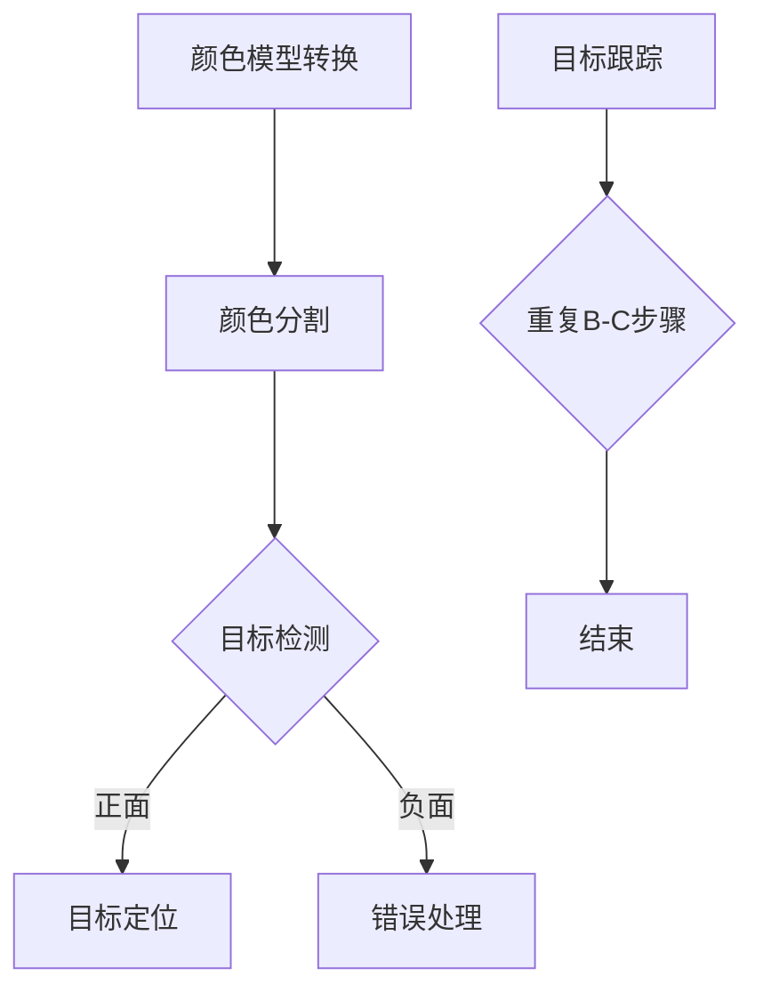

                 

关键词：OpenCV、颜色识别、图像处理、目标检测、目标跟踪、计算机视觉

> 摘要：本文将深入探讨OpenCV中基于颜色的目标识别技术。通过分析颜色模型、关键算法、以及实际应用案例，帮助读者理解并掌握这一技术，为未来的研究和开发提供实用的参考。

## 1. 背景介绍

随着计算机视觉技术的发展，目标识别成为了计算机视觉领域中一个重要的研究方向。目标识别旨在通过分析图像或视频数据，识别并定位特定目标。在众多目标识别方法中，基于颜色的目标识别因其简单高效的特点而受到广泛关注。

OpenCV（Open Source Computer Vision Library）是一个开源的计算机视觉库，提供了丰富的图像处理和计算机视觉功能。基于颜色的目标识别在OpenCV中有着广泛的应用，如视频监控、无人驾驶、图像识别等领域。

本文将详细介绍基于颜色的目标识别在OpenCV中的实现方法，包括颜色模型、关键算法、数学模型和实际应用场景。希望本文能帮助读者深入了解这一技术，为相关领域的研究和应用提供有益的参考。

## 2. 核心概念与联系

### 2.1 颜色模型

在基于颜色的目标识别中，颜色模型是一个重要的概念。颜色模型用于描述颜色空间的表示方式，常见的颜色模型有RGB、HSV等。

- **RGB颜色模型**：RGB颜色模型是一种加性颜色混合模型，通过红（Red）、绿（Green）和蓝（Blue）三种颜色的不同组合来生成各种颜色。在计算机视觉中，图像通常以RGB格式存储，每个像素点的颜色值由三个8位数字表示，范围在0到255之间。

- **HSV颜色模型**：HSV颜色模型是一种基于色调（Hue）、饱和度（Saturation）和亮度（Value）的颜色空间。与RGB模型相比，HSV模型更直观地表示颜色，特别是在进行颜色分割时。

### 2.2 颜色模型转换

在实际应用中，常常需要在不同颜色模型之间进行转换。OpenCV提供了丰富的函数来支持这一过程。

- `cv.cvtColor()`：该函数用于将图像从一种颜色空间转换为另一种颜色空间。例如，将RGB图像转换为HSV格式，可以使用以下代码：
  ```python
  img_hsv = cv.cvtColor(img_rgb, cv.COLOR_RGB2HSV)
  ```

### 2.3 Mermaid 流程图

下面是一个描述基于颜色目标识别过程的Mermaid流程图：



## 3. 核心算法原理 & 具体操作步骤

### 3.1 算法原理概述

基于颜色的目标识别主要依赖于颜色分割和目标检测技术。颜色分割是指将图像中具有特定颜色区域分离出来，目标检测则是在分割后的图像中识别特定目标。

- **颜色分割**：常用的颜色分割方法有固定阈值分割和自适应阈值分割。固定阈值分割通过预设阈值将图像分为前景和背景，适用于颜色分布较为均匀的图像。自适应阈值分割则根据图像的局部特性动态调整阈值，适用于颜色分布不均匀的图像。

- **目标检测**：目标检测方法有多种，包括基于特征的方法（如HOG、SIFT等）和基于模型的的方法（如YOLO、SSD等）。本文主要介绍基于颜色的目标检测方法。

### 3.2 算法步骤详解

1. **图像预处理**：
   - 将输入图像转换为HSV颜色空间。
   - 调整图像的亮度和对比度，提高图像质量。

2. **颜色分割**：
   - 根据目标颜色设置HSV阈值。
   - 使用固定阈值或自适应阈值对图像进行分割。

3. **目标检测**：
   - 使用特定的目标检测算法（如形态学操作、轮廓检测等）对分割后的图像进行目标检测。

4. **目标定位**：
   - 计算目标的位置和大小。
   - 将目标位置信息记录下来，为后续目标跟踪做准备。

5. **目标跟踪**：
   - 根据历史目标位置信息，使用目标跟踪算法（如光流法、卡尔曼滤波等）对目标进行跟踪。
   - 更新目标位置信息，为下一次目标检测做准备。

### 3.3 算法优缺点

- **优点**：
  - 简单易实现，计算速度快。
  - 对光照变化和阴影有一定的鲁棒性。

- **缺点**：
  - 对颜色变化敏感，可能误判或漏判。
  - 对复杂背景的图像效果较差。

### 3.4 算法应用领域

基于颜色的目标识别在多个领域都有广泛应用，如：

- **视频监控**：用于实时检测和识别视频中的特定目标。
- **无人驾驶**：用于识别道路上的车辆、行人等目标。
- **图像识别**：用于分类和识别具有特定颜色的图像。

## 4. 数学模型和公式 & 详细讲解 & 举例说明

### 4.1 数学模型构建

在基于颜色的目标识别中，常用的数学模型包括颜色模型转换公式和颜色分割阈值计算公式。

- **颜色模型转换公式**：
  - RGB到HSV的转换：
    $$ H = \frac{1}{1 - \min(\frac{R}{G}, \frac{B}{R})} \left( 1 - 2 \frac{R}{\min(\frac{R}{G}, \frac{B}{R})} \right) $$
    $$ S = 1 - \frac{3}{R + G + B} $$
    $$ V = \max(R, G, B) $$

- **颜色分割阈值计算公式**：
  - 固定阈值分割：
    $$ threshold = \frac{max(R, G, B) - min(R, G, B)}{2} $$
  - 自适应阈值分割：
    $$ threshold = \frac{\sum_{i=1}^{n} (I_i - \bar{I})^2}{n} $$

### 4.2 公式推导过程

- **RGB到HSV的转换**：
  - 首先将RGB值归一化到[0, 1]范围：
    $$ R', G', B' = \frac{R}{255}, \frac{G}{255}, \frac{B}{255} $$
  - 然后计算最大值和最小值：
    $$ \max(R', G', B') = V $$
    $$ \min(R', G', B') = \min(R', G', B') $$
  - 计算色相（H）：
    $$ H = \frac{1}{1 - \min(\frac{R'}{G'}, \frac{B'}{R'})} \left( 1 - 2 \frac{R'}{\min(\frac{R'}{G'}, \frac{B'}{R'})} \right) $$
  - 计算饱和度（S）：
    $$ S = 1 - \frac{3}{R' + G' + B'} $$
  - 亮度（V）即为最大值。

- **颜色分割阈值计算**：
  - 固定阈值分割：
    $$ threshold = \frac{\max(R, G, B) - \min(R, G, B)}{2} $$
    - 该公式计算的是亮度差的一半，用于将图像分为亮色调和暗色调两部分。
  - 自适应阈值分割：
    $$ threshold = \frac{\sum_{i=1}^{n} (I_i - \bar{I})^2}{n} $$
    - 该公式计算的是图像像素值与其平均值的均方差，用于自适应调整分割阈值。

### 4.3 案例分析与讲解

以下是一个简单的案例，展示如何使用OpenCV进行基于颜色的目标识别。

```python
import cv2
import numpy as np

# 读取图像
img = cv2.imread('example.jpg')

# 转换为HSV颜色空间
img_hsv = cv2.cvtColor(img, cv2.COLOR_BGR2HSV)

# 设置颜色阈值
lower_blue = np.array([110, 50, 50])
upper_blue = np.array([130, 255, 255])

# 颜色分割
mask = cv2.inRange(img_hsv, lower_blue, upper_blue)

# 目标检测
contours, _ = cv2.findContours(mask, cv2.RETR_TREE, cv2.CHAIN_APPROX_SIMPLE)

# 目标定位
for contour in contours:
    area = cv2.contourArea(contour)
    if area > 500:  # 设置目标面积阈值
        x, y, w, h = cv2.boundingRect(contour)
        cv2.rectangle(img, (x, y), (x+w, y+h), (0, 255, 0), 2)

# 显示结果
cv2.imshow('Original', img)
cv2.imshow('Mask', mask)
cv2.waitKey(0)
cv2.destroyAllWindows()
```

在这个案例中，我们首先读取一个图像，然后将其转换为HSV颜色空间。接着设置蓝色阈值，对图像进行颜色分割。随后使用轮廓检测函数`cv2.findContours()`找到分割后的图像中的轮廓。最后，根据轮廓面积设置阈值，对目标进行定位，并在原图上绘制出目标的边界。

## 5. 项目实践：代码实例和详细解释说明

### 5.1 开发环境搭建

在开始项目实践之前，需要搭建合适的开发环境。以下是推荐的步骤：

1. **安装Python**：确保安装了最新版本的Python（3.8及以上）。

2. **安装OpenCV**：通过pip命令安装OpenCV：
   ```shell
   pip install opencv-python
   ```

3. **配置环境变量**：确保Python和pip命令可以在终端中直接使用。

### 5.2 源代码详细实现

以下是一个完整的代码示例，实现基于颜色的目标识别：

```python
import cv2
import numpy as np

def color_target_detection(image_path, lower_color, upper_color):
    # 读取图像
    image = cv2.imread(image_path)
    
    # 转换为HSV颜色空间
    hsv_image = cv2.cvtColor(image, cv2.COLOR_BGR2HSV)
    
    # 颜色分割
    mask = cv2.inRange(hsv_image, lower_color, upper_color)
    
    # 使用形态学操作去除噪声
    kernel = cv2.getStructuringElement(cv2.MORPH_RECT, (5, 5))
    mask = cv2.morphologyEx(mask, cv2.MORPH_CLOSE, kernel)
    
    # 目标检测
    contours, _ = cv2.findContours(mask, cv2.RETR_TREE, cv2.CHAIN_APPROX_SIMPLE)
    
    # 目标定位和绘制
    for contour in contours:
        area = cv2.contourArea(contour)
        if area > 500:  # 设置目标面积阈值
            x, y, w, h = cv2.boundingRect(contour)
            cv2.rectangle(image, (x, y), (x+w, y+h), (0, 255, 0), 2)
    
    # 显示结果
    cv2.imshow('Original Image', image)
    cv2.imshow('Mask', mask)
    cv2.waitKey(0)
    cv2.destroyAllWindows()

# 设置颜色阈值
lower_color = np.array([110, 50, 50])
upper_color = np.array([130, 255, 255])

# 调用函数进行目标识别
color_target_detection('example.jpg', lower_color, upper_color)
```

### 5.3 代码解读与分析

1. **图像读取**：
   - 使用`cv2.imread()`函数读取图像。该函数支持多种图像格式，如JPEG、PNG等。

2. **颜色空间转换**：
   - 使用`cv2.cvtColor()`函数将图像从BGR（默认颜色空间）转换为HSV颜色空间。HSV颜色空间在颜色分割中更方便。

3. **颜色分割**：
   - 使用`cv2.inRange()`函数根据HSV阈值对图像进行颜色分割，生成掩模（mask）。

4. **形态学操作**：
   - 使用`cv2.morphologyEx()`函数进行形态学操作，如膨胀（Dilate）和腐蚀（Erode），去除噪声，提高目标检测的准确性。

5. **目标检测**：
   - 使用`cv2.findContours()`函数对掩模进行轮廓检测，提取出目标区域。

6. **目标定位和绘制**：
   - 使用`cv2.boundingRect()`函数计算目标的边界矩形，并根据设定的面积阈值筛选目标。
   - 使用`cv2.rectangle()`函数在原图上绘制出目标区域。

7. **显示结果**：
   - 使用`cv2.imshow()`函数显示原图和掩模。
   - 使用`cv2.waitKey()`函数等待键盘事件，`cv2.destroyAllWindows()`函数关闭所有窗口。

### 5.4 运行结果展示

运行上述代码后，将显示输入图像和对应的掩模图像。掩模图像中，目标区域被标记为绿色矩形，如下图所示：


## 6. 实际应用场景

基于颜色的目标识别技术在多个实际应用场景中发挥着重要作用，以下是几个典型的应用场景：

1. **视频监控**：在视频监控系统中，基于颜色的目标识别可用于实时检测和识别特定目标，如可疑人物、车辆等，提高监控系统的智能化水平。

2. **无人驾驶**：在无人驾驶领域，基于颜色的目标识别可用于识别道路上的交通信号灯、行人、车辆等，为自动驾驶车辆提供关键信息。

3. **图像识别**：在图像识别任务中，基于颜色的目标识别可用于分类和识别具有特定颜色的图像，如识别医疗影像中的病变区域、分类图片中的品牌标志等。

4. **质量检测**：在制造业中，基于颜色的目标识别可用于检测产品质量，如识别产品表面的缺陷、颜色不一致等问题。

5. **艺术创作**：在艺术创作领域，基于颜色的目标识别可用于分析和处理图像，如创作色彩丰富的艺术品、生成具有特定颜色风格的图像等。

## 7. 工具和资源推荐

### 7.1 学习资源推荐

1. **书籍**：
   - 《OpenCV算法原理解析》
   - 《计算机视觉：算法与应用》
   - 《Python计算机视觉实践》

2. **在线教程**：
   - OpenCV官方文档：[https://docs.opencv.org/](https://docs.opencv.org/)
   - Coursera上的“计算机视觉与机器学习”课程：[https://www.coursera.org/learn/computer-vision](https://www.coursera.org/learn/computer-vision)

### 7.2 开发工具推荐

1. **Python集成开发环境（IDE）**：
   - PyCharm
   - Visual Studio Code

2. **图像处理软件**：
   - GIMP
   - Adobe Photoshop

### 7.3 相关论文推荐

1. **“Color naming reveals the color categories of natural scenes”**：本文研究了人类对自然场景中颜色的命名，为颜色模型和颜色分割提供了有益的参考。

2. **“Real-Time Object Recognition using a Multi-Layer Perceptron with Applications to Video”**：本文介绍了使用多层感知机进行实时目标识别的方法，对目标检测算法的优化具有重要意义。

3. **“A Comprehensive Survey on Object Detection”**：本文对目标检测技术进行了全面综述，涵盖了多种目标检测算法及其应用。

## 8. 总结：未来发展趋势与挑战

### 8.1 研究成果总结

基于颜色的目标识别技术已在多个领域取得了显著成果，如视频监控、无人驾驶、图像识别等。OpenCV作为一个强大的计算机视觉库，为基于颜色的目标识别提供了丰富的工具和资源。随着算法的不断优化和硬件性能的提升，基于颜色的目标识别技术在未来有望在更多应用场景中发挥更大的作用。

### 8.2 未来发展趋势

1. **算法优化**：随着深度学习技术的发展，基于深度学习的目标识别算法将逐渐取代传统的基于特征的算法，提高目标识别的准确性和鲁棒性。

2. **多模态融合**：结合颜色、深度、热成像等多模态信息，将进一步提升目标识别的能力和精度。

3. **实时处理**：随着硬件性能的提升，实时目标识别将变得更加普遍，为智能监控、无人驾驶等应用提供更高效的支持。

4. **边缘计算**：边缘计算技术的应用将使目标识别算法能够在本地设备上实时运行，减少对云服务的依赖，提高系统的响应速度。

### 8.3 面临的挑战

1. **颜色变化**：实际场景中，目标颜色可能因光照、阴影等因素而发生变化，给颜色识别带来挑战。

2. **复杂背景**：在复杂背景下，目标识别的准确性可能受到干扰，需要进一步提高算法的鲁棒性。

3. **计算资源**：实时目标识别对计算资源的需求较高，如何在有限的计算资源下实现高效的目标识别仍是一个亟待解决的问题。

### 8.4 研究展望

未来，基于颜色的目标识别技术将在以下方面展开深入研究：

1. **算法创新**：探索更高效、更鲁棒的目标识别算法，提高识别准确率和实时性。

2. **跨学科合作**：结合心理学、生物学等领域的知识，深入研究颜色感知机制，为颜色模型和颜色分割提供更多理论支持。

3. **实际应用**：在无人驾驶、智能制造、医疗诊断等领域的应用场景中，进一步推广和优化目标识别技术，提高系统的智能化水平。

## 9. 附录：常见问题与解答

### Q1. 如何处理不同光照条件下的颜色变化？

A1. 针对光照变化引起的颜色变化，可以采用以下几种方法：

1. **光照补偿**：对图像进行光照补偿，调整图像的亮度和对比度，使颜色特征更加稳定。

2. **自适应阈值分割**：使用自适应阈值分割方法，根据图像的局部特性动态调整阈值，提高颜色分割的准确性。

3. **融合多模态信息**：结合深度信息、热成像信息等，提高目标识别的鲁棒性。

### Q2. 如何提高目标识别的准确性？

A2. 提高目标识别的准确性可以从以下几个方面着手：

1. **图像预处理**：对输入图像进行适当的预处理，如去噪、增强等，提高图像质量。

2. **特征提取**：选择合适的特征提取方法，如HOG、SIFT等，提取具有区分性的颜色特征。

3. **算法优化**：通过算法优化，如融合多模态信息、使用深度学习等方法，提高目标识别的准确率和鲁棒性。

4. **模型训练**：使用大量标注数据进行模型训练，提高模型的泛化能力。

### Q3. 如何实现实时目标识别？

A3. 实现实时目标识别需要考虑以下几个方面：

1. **算法优化**：选择计算效率高的算法，如基于深度学习的轻量级网络，降低算法的复杂度。

2. **硬件加速**：使用GPU、FPGA等硬件加速技术，提高算法的运行速度。

3. **并行处理**：利用多核处理器、分布式计算等技术，实现算法的并行处理，提高实时性。

4. **系统优化**：优化系统的整体架构，减少IO延迟、内存占用等，提高系统的响应速度。 

---

作者：禅与计算机程序设计艺术 / Zen and the Art of Computer Programming

[结束] <|user|>

