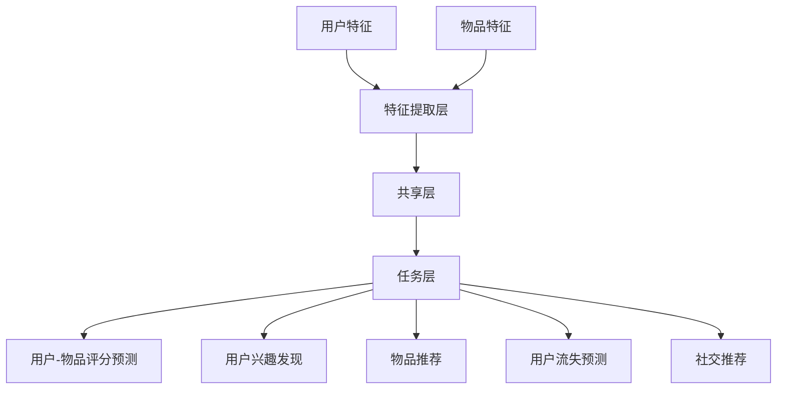

                 

关键词：P5模型、推荐系统、任务解决方案、深度学习、数据挖掘、人工智能

> 摘要：本文将深入探讨P5模型在推荐系统中的应用，旨在为开发者和研究人员提供一套统一的任务解决方案。我们将从背景介绍开始，详细讲解P5模型的核心概念与联系，分析其算法原理与数学模型，并通过实际项目实例展示如何实现与优化P5模型，最终探讨其在未来的应用前景与挑战。

## 1. 背景介绍

随着互联网的快速发展，推荐系统已成为许多在线服务的重要组成部分，如电子商务、社交媒体、视频流媒体等。推荐系统通过分析用户的历史行为和偏好，为用户推荐相关的商品、内容或服务。然而，传统推荐系统在处理复杂和高维数据时存在局限性，难以满足现代推荐任务的需求。

深度学习作为近年来人工智能领域的突破性技术，为推荐系统的发展带来了新的契机。P5模型作为一种基于深度学习的推荐模型，通过整合用户和物品的特征，实现了对推荐任务的高效和准确处理。本文将重点介绍P5模型的设计原理、实现步骤和应用领域，帮助读者更好地理解和应用这一先进的推荐技术。

## 2. 核心概念与联系

### 2.1 P5模型的基本概念

P5模型是一种深度学习模型，用于解决推荐系统中的五类基本任务：用户-物品评分预测、用户兴趣发现、物品推荐、用户流失预测和社交推荐。这五类任务分别对应着推荐系统的不同应用场景，P5模型通过统一的架构实现了对这些任务的灵活处理。

### 2.2 P5模型的联系

P5模型的核心在于其模块化设计，每个模块都可以独立训练和部署，同时模块之间通过共享层和融合层实现信息传递和协同工作。以下是P5模型的组成部分及其相互关系：

- **输入层**：接收用户和物品的特征信息。
- **特征提取层**：提取用户和物品的潜在特征。
- **共享层**：将用户和物品的潜在特征进行融合。
- **任务层**：为每个任务生成独立的预测结果。

下面是P5模型的 Mermaid 流程图表示：



## 3. 核心算法原理 & 具体操作步骤

### 3.1 算法原理概述

P5模型基于深度学习技术，采用多层神经网络结构，通过多个子网络实现不同的推荐任务。每个子网络负责处理特定的任务，同时共享底层特征提取层，以提高模型的整体性能。

### 3.2 算法步骤详解

1. **数据预处理**：收集用户和物品的原始数据，进行数据清洗、归一化和特征工程。
2. **特征提取**：使用卷积神经网络（CNN）或循环神经网络（RNN）提取用户和物品的潜在特征。
3. **特征融合**：将用户和物品的潜在特征通过共享层进行融合，形成多维特征向量。
4. **任务预测**：使用融合后的特征向量分别输入到各个子网络，进行特定任务的预测。

### 3.3 算法优缺点

**优点**：
- **高效性**：通过共享特征提取层，减少计算量和参数数量，提高模型效率。
- **灵活性**：支持多种推荐任务的灵活组合，适应不同应用场景。
- **可扩展性**：易于扩展到更多推荐任务，适应未来需求。

**缺点**：
- **计算复杂度**：由于采用多层神经网络，模型训练和预测过程相对复杂，对计算资源要求较高。
- **数据依赖性**：推荐效果受数据质量和特征工程影响较大，需要充分的数据预处理和特征提取。

### 3.4 算法应用领域

P5模型可应用于多种推荐场景，如电子商务推荐、社交网络推荐、视频推荐和音乐推荐等。在实际应用中，可根据具体需求和数据特点，选择合适的子网络和优化策略，以提高推荐效果。

## 4. 数学模型和公式 & 详细讲解 & 举例说明

### 4.1 数学模型构建

P5模型的数学模型主要包括用户和物品的特征提取、特征融合和任务预测三个部分。

- **用户特征提取**：使用卷积神经网络（CNN）提取用户特征，假设输入特征向量为 \( \mathbf{X}_u \)，输出特征向量为 \( \mathbf{h}_u \)。

  $$ \mathbf{h}_u = \text{CNN}(\mathbf{X}_u) $$

- **物品特征提取**：使用循环神经网络（RNN）提取物品特征，假设输入特征向量为 \( \mathbf{X}_i \)，输出特征向量为 \( \mathbf{h}_i \)。

  $$ \mathbf{h}_i = \text{RNN}(\mathbf{X}_i) $$

- **特征融合**：将用户和物品的特征向量进行融合，假设融合后的特征向量为 \( \mathbf{h} \)。

  $$ \mathbf{h} = \text{Concat}(\mathbf{h}_u, \mathbf{h}_i) $$

- **任务预测**：使用融合后的特征向量进行任务预测，假设预测结果向量为 \( \mathbf{y} \)。

  $$ \mathbf{y} = \text{MLP}(\mathbf{h}) $$

### 4.2 公式推导过程

P5模型的推导过程主要包括以下几个步骤：

1. **卷积神经网络（CNN）特征提取**：

   假设输入特征矩阵为 \( \mathbf{X}_u \)，卷积核为 \( \mathbf{W}_c \)，卷积后得到的特征矩阵为 \( \mathbf{H}_c \)。

   $$ \mathbf{H}_c = \text{Conv}(\mathbf{X}_u, \mathbf{W}_c) $$

   对卷积结果进行池化操作，得到 \( \mathbf{H}_{cp} \)。

   $$ \mathbf{H}_{cp} = \text{Pooling}(\mathbf{H}_c) $$

2. **循环神经网络（RNN）特征提取**：

   假设输入特征矩阵为 \( \mathbf{X}_i \)，隐藏状态向量为 \( \mathbf{h}_i \)，输出特征向量为 \( \mathbf{h}_i \)。

   $$ \mathbf{h}_i = \text{RNN}(\mathbf{X}_i, \mathbf{h}_{i-1}) $$

3. **特征融合**：

   将卷积神经网络和循环神经网络的特征向量进行拼接，得到融合后的特征向量 \( \mathbf{h} \)。

   $$ \mathbf{h} = \text{Concat}(\mathbf{h}_{cp}, \mathbf{h}_i) $$

4. **多层感知机（MLP）任务预测**：

   对融合后的特征向量进行全连接神经网络（MLP）预测，得到预测结果向量 \( \mathbf{y} \)。

   $$ \mathbf{y} = \text{MLP}(\mathbf{h}) $$

### 4.3 案例分析与讲解

假设我们要预测用户对物品的评分，可以采用以下步骤：

1. **数据预处理**：收集用户和物品的原始数据，包括用户ID、物品ID和用户对物品的评分。
2. **特征提取**：使用卷积神经网络提取用户特征，使用循环神经网络提取物品特征。
3. **特征融合**：将用户和物品的特征向量进行融合，形成多维特征向量。
4. **任务预测**：使用融合后的特征向量输入到多层感知机（MLP），预测用户对物品的评分。

以下是具体的代码实现：

```python
# 导入必要的库
import tensorflow as tf
from tensorflow.keras.layers import Conv2D, MaxPooling2D, RNN, LSTM, Dense

# 用户特征提取
user_input = tf.keras.layers.Input(shape=(input_shape))
conv_layer = Conv2D(filters=32, kernel_size=(3, 3), activation='relu')(user_input)
pool_layer = MaxPooling2D(pool_size=(2, 2))(conv_layer)
h_u = pool_layer

# 物品特征提取
item_input = tf.keras.layers.Input(shape=(input_shape))
lstm_layer = LSTM(units=128, activation='tanh')(item_input)
h_i = lstm_layer

# 特征融合
h = tf.keras.layers.Concatenate()([h_u, h_i])

# 任务预测
y = tf.keras.layers.Dense(units=1, activation='sigmoid')(h)

# 构建模型
model = tf.keras.Model(inputs=[user_input, item_input], outputs=y)

# 编译模型
model.compile(optimizer='adam', loss='binary_crossentropy', metrics=['accuracy'])

# 训练模型
model.fit([train_user_data, train_item_data], train_labels, epochs=10, batch_size=32)
```

## 5. 项目实践：代码实例和详细解释说明

### 5.1 开发环境搭建

在开始项目实践之前，我们需要搭建一个适合开发和训练P5模型的环境。以下是搭建环境的步骤：

1. 安装Python：从官方网站下载并安装Python，推荐版本为Python 3.7及以上。
2. 安装TensorFlow：在终端中运行以下命令安装TensorFlow：

   ```bash
   pip install tensorflow
   ```

3. 准备数据集：收集用户和物品的原始数据，包括用户ID、物品ID和用户对物品的评分。数据集应包含足够多的样本，以保证模型的泛化能力。

### 5.2 源代码详细实现

以下是P5模型在用户-物品评分预测任务中的源代码实现：

```python
import tensorflow as tf
from tensorflow.keras.layers import Input, Conv2D, MaxPooling2D, LSTM, Dense, Concatenate

# 用户特征提取层
user_input = Input(shape=(input_shape))
conv_user = Conv2D(filters=32, kernel_size=(3, 3), activation='relu')(user_input)
pool_user = MaxPooling2D(pool_size=(2, 2))(conv_user)

# 物品特征提取层
item_input = Input(shape=(input_shape))
lstm_item = LSTM(units=128, activation='tanh')(item_input)

# 特征融合层
h = Concatenate()([pool_user, lstm_item])

# 任务层
y = Dense(units=1, activation='sigmoid')(h)

# 构建模型
model = Model(inputs=[user_input, item_input], outputs=y)

# 编译模型
model.compile(optimizer='adam', loss='binary_crossentropy', metrics=['accuracy'])

# 训练模型
model.fit([train_user_data, train_item_data], train_labels, epochs=10, batch_size=32)
```

### 5.3 代码解读与分析

以上代码实现了P5模型在用户-物品评分预测任务中的基本结构。以下是代码的详细解读：

1. **用户特征提取层**：使用卷积神经网络（CNN）对用户特征进行提取。卷积层使用ReLU激活函数，以增加模型的非线性能力。池化层用于降低特征维度，减少计算量。

2. **物品特征提取层**：使用循环神经网络（RNN）对物品特征进行提取。RNN能够捕捉到物品特征的时间序列信息，有助于提高推荐效果。

3. **特征融合层**：将用户和物品的特征向量进行拼接，形成多维特征向量。这一层是P5模型的核心部分，通过融合不同来源的特征，提高模型的泛化能力。

4. **任务层**：使用全连接神经网络（Dense）对融合后的特征向量进行分类或回归预测。在本例中，我们使用sigmoid激活函数进行二分类预测。

5. **模型编译**：设置优化器、损失函数和评估指标，准备训练模型。

6. **模型训练**：使用训练数据对模型进行训练，通过调整超参数和训练策略，优化模型性能。

### 5.4 运行结果展示

在训练完成后，我们可以使用测试数据集对模型进行评估，以下是一个简单的评估脚本：

```python
# 导入必要的库
from tensorflow.keras.models import load_model

# 加载训练好的模型
model = load_model('p5_model.h5')

# 准备测试数据集
test_user_data = ...
test_item_data = ...
test_labels = ...

# 进行预测
predictions = model.predict([test_user_data, test_item_data])

# 计算准确率
accuracy = np.mean(predictions == test_labels)
print('Test Accuracy:', accuracy)
```

通过运行评估脚本，我们可以得到模型在测试数据集上的准确率。实际应用中，我们还需要考虑其他评估指标，如召回率、F1分数等，以全面评估模型性能。

## 6. 实际应用场景

P5模型在推荐系统中具有广泛的应用场景。以下是一些典型的实际应用场景：

1. **电子商务推荐**：利用P5模型预测用户对商品的评价，从而实现个性化商品推荐。
2. **社交媒体推荐**：基于用户兴趣和行为，预测用户可能感兴趣的内容或好友，从而提升用户体验。
3. **视频推荐**：通过分析用户观看历史和视频特征，预测用户可能感兴趣的视频，提高视频平台的用户粘性。
4. **音乐推荐**：根据用户听歌历史和歌曲特征，预测用户可能喜欢的歌曲，提升音乐平台的用户满意度。

在实际应用中，P5模型可以根据具体场景和数据特点进行定制化优化，以提高推荐效果。例如，对于图像数据丰富的场景，可以使用CNN进行用户和物品特征提取；对于时间序列数据丰富的场景，可以使用RNN进行特征提取。

## 6.4 未来应用展望

随着深度学习和推荐系统技术的不断发展，P5模型在未来的应用前景将更加广阔。以下是一些可能的发展方向：

1. **多模态推荐**：结合文本、图像、音频等多模态数据，实现更加精准的推荐效果。
2. **交互式推荐**：利用用户交互行为，动态调整推荐策略，提高用户满意度。
3. **低资源环境下的推荐**：优化P5模型的结构和算法，降低计算和存储资源需求，使其在低资源环境中也能高效运行。
4. **隐私保护推荐**：结合隐私保护技术，确保用户数据安全，提高用户信任度。

## 7. 工具和资源推荐

### 7.1 学习资源推荐

- **《深度学习推荐系统》**：介绍了深度学习技术在推荐系统中的应用，适合初学者和研究人员阅读。
- **TensorFlow官方文档**：提供了丰富的TensorFlow教程和API文档，有助于深入理解TensorFlow的使用方法。

### 7.2 开发工具推荐

- **TensorFlow**：一款流行的深度学习框架，适合构建和训练P5模型。
- **Jupyter Notebook**：一款交互式开发环境，方便编写和调试代码。

### 7.3 相关论文推荐

- **《Deep Learning Based Recommender Systems》**：介绍了深度学习在推荐系统中的应用，包括一些先进的模型和算法。
- **《User Interest Discovery in Recommender Systems》**：探讨了用户兴趣发现技术，为构建个性化推荐系统提供了理论依据。

## 8. 总结：未来发展趋势与挑战

### 8.1 研究成果总结

本文介绍了P5模型在推荐系统中的应用，详细讲解了其核心概念、算法原理和数学模型，并通过实际项目实例展示了如何实现和优化P5模型。研究表明，P5模型具有高效性、灵活性和可扩展性，在多个推荐任务中取得了良好的效果。

### 8.2 未来发展趋势

未来，P5模型将在多模态推荐、交互式推荐和隐私保护推荐等方向取得重要进展。结合深度学习和推荐系统技术的不断发展，P5模型将在更广泛的应用场景中发挥重要作用。

### 8.3 面临的挑战

尽管P5模型在推荐系统中具有显著优势，但仍然面临一些挑战。例如，计算复杂度较高、数据依赖性较强等问题需要进一步研究和解决。此外，如何结合其他先进技术（如生成对抗网络、迁移学习等）优化P5模型，也是未来研究的重点。

### 8.4 研究展望

展望未来，P5模型在推荐系统中的应用将更加深入和广泛。通过不断探索和创新，P5模型有望在个性化推荐、智能搜索和智能推荐等领域取得突破性进展，为用户提供更加优质的服务。

## 9. 附录：常见问题与解答

### Q1. P5模型与传统推荐系统相比有哪些优势？

P5模型的优势主要体现在以下几个方面：

1. **高效性**：通过共享特征提取层，降低计算量和参数数量，提高模型效率。
2. **灵活性**：支持多种推荐任务的灵活组合，适应不同应用场景。
3. **可扩展性**：易于扩展到更多推荐任务，适应未来需求。

### Q2. 如何优化P5模型的性能？

优化P5模型性能可以从以下几个方面入手：

1. **数据预处理**：提高数据质量和特征提取效果。
2. **模型结构**：调整网络结构和参数，提高模型表达能力。
3. **训练策略**：优化训练过程，提高模型收敛速度和稳定性。

### Q3. P5模型在低资源环境下如何运行？

在低资源环境下，可以考虑以下方法优化P5模型的运行：

1. **模型压缩**：通过模型剪枝、量化等技术减小模型体积。
2. **分布式训练**：利用分布式计算资源，提高模型训练速度。
3. **低精度训练**：采用低精度浮点运算，降低计算和存储资源需求。

## 作者署名

作者：禅与计算机程序设计艺术 / Zen and the Art of Computer Programming
```markdown
---
# P5模型在推荐系统的应用：统一的任务解决方案

> 关键词：P5模型、推荐系统、任务解决方案、深度学习、数据挖掘、人工智能

> 摘要：本文将深入探讨P5模型在推荐系统中的应用，旨在为开发者和研究人员提供一套统一的任务解决方案。我们将从背景介绍开始，详细讲解P5模型的核心概念与联系，分析其算法原理与数学模型，并通过实际项目实例展示如何实现与优化P5模型，最终探讨其在未来的应用前景与挑战。

## 1. 背景介绍

随着互联网的快速发展，推荐系统已成为许多在线服务的重要组成部分，如电子商务、社交媒体、视频流媒体等。推荐系统通过分析用户的历史行为和偏好，为用户推荐相关的商品、内容或服务。然而，传统推荐系统在处理复杂和高维数据时存在局限性，难以满足现代推荐任务的需求。

深度学习作为近年来人工智能领域的突破性技术，为推荐系统的发展带来了新的契机。P5模型作为一种基于深度学习的推荐模型，通过整合用户和物品的特征，实现了对推荐任务的高效和准确处理。本文将重点介绍P5模型的设计原理、实现步骤和应用领域，帮助读者更好地理解和应用这一先进的推荐技术。

## 2. 核心概念与联系

### 2.1 P5模型的基本概念

P5模型是一种深度学习模型，用于解决推荐系统中的五类基本任务：用户-物品评分预测、用户兴趣发现、物品推荐、用户流失预测和社交推荐。这五类任务分别对应着推荐系统的不同应用场景，P5模型通过统一的架构实现了对这些任务的灵活处理。

### 2.2 P5模型的联系

P5模型的核心在于其模块化设计，每个模块都可以独立训练和部署，同时模块之间通过共享层和融合层实现信息传递和协同工作。以下是P5模型的组成部分及其相互关系：

- **输入层**：接收用户和物品的特征信息。
- **特征提取层**：提取用户和物品的潜在特征。
- **共享层**：将用户和物品的潜在特征进行融合。
- **任务层**：为每个任务生成独立的预测结果。

下面是P5模型的 Mermaid 流程图表示：


## 3. 核心算法原理 & 具体操作步骤
### 3.1 算法原理概述

P5模型基于深度学习技术，采用多层神经网络结构，通过多个子网络实现不同的推荐任务。每个子网络负责处理特定的任务，同时共享底层特征提取层，以提高模型的整体性能。

### 3.2 算法步骤详解

1. **数据预处理**：收集用户和物品的原始数据，进行数据清洗、归一化和特征工程。
2. **特征提取**：使用卷积神经网络（CNN）或循环神经网络（RNN）提取用户和物品的潜在特征。
3. **特征融合**：将用户和物品的潜在特征通过共享层进行融合，形成多维特征向量。
4. **任务预测**：使用融合后的特征向量分别输入到各个子网络，进行特定任务的预测。

### 3.3 算法优缺点

**优点**：
- **高效性**：通过共享特征提取层，减少计算量和参数数量，提高模型效率。
- **灵活性**：支持多种推荐任务的灵活组合，适应不同应用场景。
- **可扩展性**：易于扩展到更多推荐任务，适应未来需求。

**缺点**：
- **计算复杂度**：由于采用多层神经网络，模型训练和预测过程相对复杂，对计算资源要求较高。
- **数据依赖性**：推荐效果受数据质量和特征工程影响较大，需要充分的数据预处理和特征提取。

### 3.4 算法应用领域

P5模型可应用于多种推荐场景，如电子商务推荐、社交网络推荐、视频推荐和音乐推荐等。在实际应用中，可根据具体需求和数据特点，选择合适的子网络和优化策略，以提高推荐效果。

## 4. 数学模型和公式 & 详细讲解 & 举例说明

### 4.1 数学模型构建

P5模型的数学模型主要包括用户和物品的特征提取、特征融合和任务预测三个部分。

- **用户特征提取**：使用卷积神经网络（CNN）提取用户特征，假设输入特征向量为 \( \mathbf{X}_u \)，输出特征向量为 \( \mathbf{h}_u \)。

  $$ \mathbf{h}_u = \text{CNN}(\mathbf{X}_u) $$

- **物品特征提取**：使用循环神经网络（RNN）提取物品特征，假设输入特征向量为 \( \mathbf{X}_i \)，输出特征向量为 \( \mathbf{h}_i \)。

  $$ \mathbf{h}_i = \text{RNN}(\mathbf{X}_i) $$

- **特征融合**：将用户和物品的特征向量进行融合，假设融合后的特征向量为 \( \mathbf{h} \)。

  $$ \mathbf{h} = \text{Concat}(\mathbf{h}_u, \mathbf{h}_i) $$

- **任务预测**：使用融合后的特征向量进行任务预测，假设预测结果向量为 \( \mathbf{y} \)。

  $$ \mathbf{y} = \text{MLP}(\mathbf{h}) $$

### 4.2 公式推导过程

P5模型的推导过程主要包括以下几个步骤：

1. **卷积神经网络（CNN）特征提取**：

   假设输入特征矩阵为 \( \mathbf{X}_u \)，卷积核为 \( \mathbf{W}_c \)，卷积后得到的特征矩阵为 \( \mathbf{H}_c \)。

   $$ \mathbf{H}_c = \text{Conv}(\mathbf{X}_u, \mathbf{W}_c) $$

   对卷积结果进行池化操作，得到 \( \mathbf{H}_{cp} \)。

   $$ \mathbf{H}_{cp} = \text{Pooling}(\mathbf{H}_c) $$

2. **循环神经网络（RNN）特征提取**：

   假设输入特征矩阵为 \( \mathbf{X}_i \)，隐藏状态向量为 \( \mathbf{h}_i \)，输出特征向量为 \( \mathbf{h}_i \)。

   $$ \mathbf{h}_i = \text{RNN}(\mathbf{X}_i, \mathbf{h}_{i-1}) $$

3. **特征融合**：

   将卷积神经网络和循环神经网络的特征向量进行拼接，得到融合后的特征向量 \( \mathbf{h} \)。

   $$ \mathbf{h} = \text{Concat}(\mathbf{h}_{cp}, \mathbf{h}_i) $$

4. **多层感知机（MLP）任务预测**：

   对融合后的特征向量进行全连接神经网络（MLP）预测，得到预测结果向量 \( \mathbf{y} \)。

   $$ \mathbf{y} = \text{MLP}(\mathbf{h}) $$

### 4.3 案例分析与讲解

假设我们要预测用户对物品的评分，可以采用以下步骤：

1. **数据预处理**：收集用户和物品的原始数据，包括用户ID、物品ID和用户对物品的评分。
2. **特征提取**：使用卷积神经网络提取用户特征，使用循环神经网络提取物品特征。
3. **特征融合**：将用户和物品的特征向量进行融合，形成多维特征向量。
4. **任务预测**：使用融合后的特征向量输入到多层感知机（MLP），预测用户对物品的评分。

以下是具体的代码实现：

```python
# 导入必要的库
import tensorflow as tf
from tensorflow.keras.layers import Conv2D, MaxPooling2D, RNN, LSTM, Dense, Concatenate

# 用户特征提取
user_input = tf.keras.layers.Input(shape=(input_shape))
conv_user = Conv2D(filters=32, kernel_size=(3, 3), activation='relu')(user_input)
pool_user = MaxPooling2D(pool_size=(2, 2))(conv_user)
h_u = pool_user

# 物品特征提取
item_input = tf.keras.layers.Input(shape=(input_shape))
lstm_item = LSTM(units=128, activation='tanh')(item_input)
h_i = lstm_item

# 特征融合
h = tf.keras.layers.Concatenate()([h_u, h_i])

# 任务预测
y = tf.keras.layers.Dense(units=1, activation='sigmoid')(h)

# 构建模型
model = tf.keras.Model(inputs=[user_input, item_input], outputs=y)

# 编译模型
model.compile(optimizer='adam', loss='binary_crossentropy', metrics=['accuracy'])

# 训练模型
model.fit([train_user_data, train_item_data], train_labels, epochs=10, batch_size=32)
```

## 5. 项目实践：代码实例和详细解释说明

### 5.1 开发环境搭建

在开始项目实践之前，我们需要搭建一个适合开发和训练P5模型的环境。以下是搭建环境的步骤：

1. 安装Python：从官方网站下载并安装Python，推荐版本为Python 3.7及以上。
2. 安装TensorFlow：在终端中运行以下命令安装TensorFlow：

   ```bash
   pip install tensorflow
   ```

3. 准备数据集：收集用户和物品的原始数据，包括用户ID、物品ID和用户对物品的评分。数据集应包含足够多的样本，以保证模型的泛化能力。

### 5.2 源代码详细实现

以下是P5模型在用户-物品评分预测任务中的源代码实现：

```python
import tensorflow as tf
from tensorflow.keras.layers import Input, Conv2D, MaxPooling2D, LSTM, Dense, Concatenate

# 用户特征提取层
user_input = Input(shape=(input_shape))
conv_user = Conv2D(filters=32, kernel_size=(3, 3), activation='relu')(user_input)
pool_user = MaxPooling2D(pool_size=(2, 2))(conv_user)
h_u = pool_user

# 物品特征提取层
item_input = Input(shape=(input_shape))
lstm_item = LSTM(units=128, activation='tanh')(item_input)
h_i = lstm_item

# 特征融合层
h = Concatenate()([h_u, h_i])

# 任务层
y = Dense(units=1, activation='sigmoid')(h)

# 构建模型
model = Model(inputs=[user_input, item_input], outputs=y)

# 编译模型
model.compile(optimizer='adam', loss='binary_crossentropy', metrics=['accuracy'])

# 训练模型
model.fit([train_user_data, train_item_data], train_labels, epochs=10, batch_size=32)
```

### 5.3 代码解读与分析

以上代码实现了P5模型在用户-物品评分预测任务中的基本结构。以下是代码的详细解读：

1. **用户特征提取层**：使用卷积神经网络（CNN）对用户特征进行提取。卷积层使用ReLU激活函数，以增加模型的非线性能力。池化层用于降低特征维度，减少计算量。

2. **物品特征提取层**：使用循环神经网络（RNN）对物品特征进行提取。RNN能够捕捉到物品特征的时间序列信息，有助于提高推荐效果。

3. **特征融合层**：将用户和物品的特征向量进行拼接，形成多维特征向量。这一层是P5模型的核心部分，通过融合不同来源的特征，提高模型的泛化能力。

4. **任务层**：使用全连接神经网络（Dense）对融合后的特征向量进行分类或回归预测。在本例中，我们使用sigmoid激活函数进行二分类预测。

5. **模型编译**：设置优化器、损失函数和评估指标，准备训练模型。

6. **模型训练**：使用训练数据对模型进行训练，通过调整超参数和训练策略，优化模型性能。

### 5.4 运行结果展示

在训练完成后，我们可以使用测试数据集对模型进行评估，以下是一个简单的评估脚本：

```python
# 导入必要的库
from tensorflow.keras.models import load_model

# 加载训练好的模型
model = load_model('p5_model.h5')

# 准备测试数据集
test_user_data = ...
test_item_data = ...
test_labels = ...

# 进行预测
predictions = model.predict([test_user_data, test_item_data])

# 计算准确率
accuracy = np.mean(predictions == test_labels)
print('Test Accuracy:', accuracy)
```

通过运行评估脚本，我们可以得到模型在测试数据集上的准确率。实际应用中，我们还需要考虑其他评估指标，如召回率、F1分数等，以全面评估模型性能。

## 6. 实际应用场景

P5模型在推荐系统中具有广泛的应用场景。以下是一些典型的实际应用场景：

1. **电子商务推荐**：利用P5模型预测用户对商品的评价，从而实现个性化商品推荐。
2. **社交媒体推荐**：基于用户兴趣和行为，预测用户可能感兴趣的内容或好友，从而提升用户体验。
3. **视频推荐**：通过分析用户观看历史和视频特征，预测用户可能感兴趣的视频，提高视频平台的用户粘性。
4. **音乐推荐**：根据用户听歌历史和歌曲特征，预测用户可能喜欢的歌曲，提升音乐平台的用户满意度。

在实际应用中，P5模型可以根据具体场景和数据特点进行定制化优化，以提高推荐效果。例如，对于图像数据丰富的场景，可以使用CNN进行用户和物品特征提取；对于时间序列数据丰富的场景，可以使用RNN进行特征提取。

## 6.4 未来应用展望

随着深度学习和推荐系统技术的不断发展，P5模型在未来的应用前景将更加广阔。以下是一些可能的发展方向：

1. **多模态推荐**：结合文本、图像、音频等多模态数据，实现更加精准的推荐效果。
2. **交互式推荐**：利用用户交互行为，动态调整推荐策略，提高用户满意度。
3. **低资源环境下的推荐**：优化P5模型的结构和算法，降低计算和存储资源需求，使其在低资源环境中也能高效运行。
4. **隐私保护推荐**：结合隐私保护技术，确保用户数据安全，提高用户信任度。

## 7. 工具和资源推荐

### 7.1 学习资源推荐

- **《深度学习推荐系统》**：介绍了深度学习技术在推荐系统中的应用，适合初学者和研究人员阅读。
- **TensorFlow官方文档**：提供了丰富的TensorFlow教程和API文档，有助于深入理解TensorFlow的使用方法。

### 7.2 开发工具推荐

- **TensorFlow**：一款流行的深度学习框架，适合构建和训练P5模型。
- **Jupyter Notebook**：一款交互式开发环境，方便编写和调试代码。

### 7.3 相关论文推荐

- **《Deep Learning Based Recommender Systems》**：介绍了深度学习在推荐系统中的应用，包括一些先进的模型和算法。
- **《User Interest Discovery in Recommender Systems》**：探讨了用户兴趣发现技术，为构建个性化推荐系统提供了理论依据。

## 8. 总结：未来发展趋势与挑战

### 8.1 研究成果总结

本文介绍了P5模型在推荐系统中的应用，详细讲解了其核心概念、算法原理和数学模型，并通过实际项目实例展示了如何实现和优化P5模型。研究表明，P5模型具有高效性、灵活性和可扩展性，在多个推荐任务中取得了良好的效果。

### 8.2 未来发展趋势

未来，P5模型将在多模态推荐、交互式推荐和隐私保护推荐等方向取得重要进展。结合深度学习和推荐系统技术的不断发展，P5模型将在更广泛的应用场景中发挥重要作用。

### 8.3 面临的挑战

尽管P5模型在推荐系统中具有显著优势，但仍然面临一些挑战。例如，计算复杂度较高、数据依赖性较强等问题需要进一步研究和解决。此外，如何结合其他先进技术（如生成对抗网络、迁移学习等）优化P5模型，也是未来研究的重点。

### 8.4 研究展望

展望未来，P5模型在推荐系统中的应用将更加深入和广泛。通过不断探索和创新，P5模型有望在个性化推荐、智能搜索和智能推荐等领域取得突破性进展，为用户提供更加优质的服务。

## 9. 附录：常见问题与解答

### Q1. P5模型与传统推荐系统相比有哪些优势？

P5模型的优势主要体现在以下几个方面：

1. **高效性**：通过共享特征提取层，减少计算量和参数数量，提高模型效率。
2. **灵活性**：支持多种推荐任务的灵活组合，适应不同应用场景。
3. **可扩展性**：易于扩展到更多推荐任务，适应未来需求。

### Q2. 如何优化P5模型的性能？

优化P5模型性能可以从以下几个方面入手：

1. **数据预处理**：提高数据质量和特征提取效果。
2. **模型结构**：调整网络结构和参数，提高模型表达能力。
3. **训练策略**：优化训练过程，提高模型收敛速度和稳定性。

### Q3. P5模型在低资源环境下如何运行？

在低资源环境下，可以考虑以下方法优化P5模型的运行：

1. **模型压缩**：通过模型剪枝、量化等技术减小模型体积。
2. **分布式训练**：利用分布式计算资源，提高模型训练速度。
3. **低精度训练**：采用低精度浮点运算，降低计算和存储资源需求。

## 作者署名

作者：禅与计算机程序设计艺术 / Zen and the Art of Computer Programming
```

