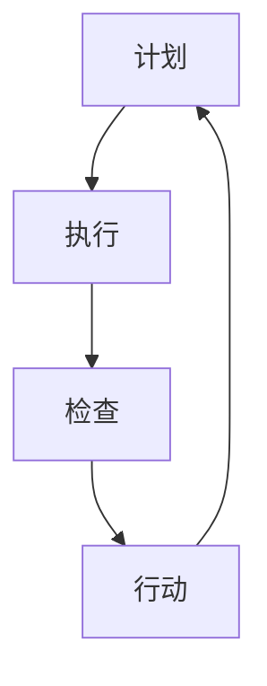

                 

在当今快速发展的信息技术时代，项目管理与持续改进成为了企业保持竞争优势的关键因素。本文将探讨PDCA循环（Plan-Do-Check-Act）与管理持续改进之间的关系，旨在为IT专业人士提供有价值的指导，以提升项目执行效率和持续优化项目管理流程。

## 关键词

- PDCA循环
- 管理持续改进
- 项目管理
- 持续优化
- IT领域

## 摘要

本文深入探讨了PDCA循环在IT项目管理中的应用及其与管理持续改进的紧密关系。通过分析PDCA循环的四个阶段（计划、执行、检查、行动），本文阐述了如何利用PDCA循环来持续优化项目管理流程，提高项目成功率。同时，本文还讨论了未来在IT领域应用PDCA循环的展望，以及可能面临的挑战。

## 1. 背景介绍

### 1.1 PDCA循环的起源

PDCA循环，又称戴明循环，起源于20世纪中叶，由质量管理专家威廉·爱德华·戴明提出。PDCA循环是一种结构化的管理方法论，旨在通过持续的计划、执行、检查和行动，实现不断的改进和优化。最初，PDCA循环主要用于制造业和质量管理领域，但随着其广泛应用到各个行业，尤其在IT项目管理中，PDCA循环的优越性愈发凸显。

### 1.2 IT项目管理的挑战

在IT项目管理中，面对不断变化的客户需求、技术更新和市场竞争，项目团队需要快速响应，确保项目顺利进行。然而，传统的项目管理方法往往难以应对这种动态变化，导致项目延期、成本超支、质量下降等问题。因此，寻找一种能够适应快速变化的、可持续改进的项目管理方法变得尤为重要。

### 1.3 持续改进的重要性

持续改进是提升项目管理效率和项目成功的关键。通过持续改进，项目团队可以不断优化项目流程、提高人员技能、改进项目管理工具和方法，从而在激烈的市场竞争中立于不败之地。同时，持续改进有助于建立企业文化，激发员工创新意识和团队协作精神。

## 2. 核心概念与联系

### 2.1 PDCA循环的四个阶段

PDCA循环包括四个基本阶段：计划（Plan）、执行（Do）、检查（Check）和行动（Act）。每个阶段都有特定的任务和目标，相互联系，形成一个闭环。

#### 2.1.1 计划（Plan）

计划阶段是PDCA循环的起点，主要包括确定项目目标、制定项目计划、分配资源和制定时间表等。在此阶段，项目团队需要明确项目的范围、目标和预期成果，制定详细的项目计划，包括任务分解、资源分配和进度安排。

#### 2.1.2 执行（Do）

执行阶段是计划的具体实施过程。项目团队按照计划开展各项工作，完成各项任务，确保项目按期进行。在执行过程中，团队需要保持良好的沟通和协作，确保任务顺利完成。

#### 2.1.3 检查（Check）

检查阶段是对项目执行过程和结果的评估。项目团队需要收集和分析项目数据，评估项目进展情况，识别问题和风险。通过检查，团队可以及时发现并解决项目中出现的问题，确保项目按计划进行。

#### 2.1.4 行动（Act）

行动阶段是对检查阶段发现的问题进行改进和优化。项目团队需要根据检查结果，制定具体的改进措施，并付诸实施。行动阶段旨在通过持续改进，提高项目质量和效率。

### 2.2 PDCA循环与管理持续改进的联系

PDCA循环是一种有效的管理工具，可以应用于项目管理的各个阶段，帮助团队实现持续改进。通过PDCA循环，项目团队可以不断优化项目管理流程，提高项目成功率。具体来说，PDCA循环与管理持续改进的关系体现在以下几个方面：

1. **计划阶段**：在计划阶段，项目团队可以明确项目目标和预期成果，制定详细的项目计划，为后续的执行、检查和行动奠定基础。

2. **执行阶段**：在执行阶段，项目团队按照计划开展各项工作，通过良好的沟通和协作，确保项目顺利进行。

3. **检查阶段**：在检查阶段，项目团队对项目执行过程和结果进行评估，及时发现并解决项目中出现的问题，确保项目按计划进行。

4. **行动阶段**：在行动阶段，项目团队根据检查结果，制定具体的改进措施，并付诸实施，从而实现持续改进。

### 2.3 PDCA循环的Mermaid流程图



在上面的Mermaid流程图中，A表示计划阶段，B表示执行阶段，C表示检查阶段，D表示行动阶段。箭头表示各阶段之间的逻辑关系，形成一个闭环。

## 3. 核心算法原理 & 具体操作步骤

### 3.1 算法原理概述

PDCA循环是一种基于迭代和改进的算法原理。通过四个阶段的不断循环，项目团队可以逐步实现项目目标，并不断提高项目质量和效率。以下是PDCA循环的四个阶段的详细解释：

1. **计划阶段**：制定项目目标和计划，分配资源和时间表。
2. **执行阶段**：按照计划执行任务，确保项目按期进行。
3. **检查阶段**：对项目执行过程和结果进行评估，识别问题和风险。
4. **行动阶段**：根据检查结果，制定改进措施，并付诸实施。

### 3.2 算法步骤详解

1. **计划阶段**：
   - 明确项目目标和预期成果。
   - 制定详细的项目计划，包括任务分解、资源分配和进度安排。
   - 确定关键里程碑和监控指标。

2. **执行阶段**：
   - 按照项目计划开展各项工作。
   - 保持良好的沟通和协作，确保任务顺利完成。
   - 定期跟踪项目进度，确保项目按期进行。

3. **检查阶段**：
   - 收集和分析项目数据，评估项目进展情况。
   - 识别项目中出现的问题和风险，制定解决方案。
   - 对项目执行过程和结果进行综合评估。

4. **行动阶段**：
   - 根据检查结果，制定具体的改进措施。
   - 实施改进措施，优化项目流程和质量。
   - 对改进措施的效果进行评估，形成新的项目计划和计划。

### 3.3 算法优缺点

**优点**：
- **系统性强**：PDCA循环具有明确的四个阶段，有利于项目团队有计划、有目标地开展工作。
- **持续改进**：通过不断循环，项目团队可以逐步实现项目目标，并不断提高项目质量和效率。
- **灵活适应**：PDCA循环适用于各种类型的项目，可以根据项目特点和需求进行灵活调整。

**缺点**：
- **时间成本**：PDCA循环需要投入较多的时间和精力，特别是在项目初期和后期。
- **对人员要求高**：PDCA循环要求项目团队具备良好的沟通协作能力和问题解决能力。

### 3.4 算法应用领域

PDCA循环在IT项目管理中具有广泛的应用。以下是一些典型应用场景：

1. **软件开发项目**：在软件开发项目中，PDCA循环可以帮助项目团队实现需求管理、进度控制和质量保证。
2. **系统运维项目**：在系统运维项目中，PDCA循环可以帮助项目团队实现运维流程优化、故障排除和性能提升。
3. **IT咨询服务**：在IT咨询服务中，PDCA循环可以帮助项目团队实现客户需求分析、方案设计和实施优化。

## 4. 数学模型和公式 & 详细讲解 & 举例说明

### 4.1 数学模型构建

PDCA循环的数学模型可以表示为以下公式：

$$
\text{PDCA循环} = \text{Plan} + \text{Do} + \text{Check} + \text{Act}
$$

其中，Plan表示计划阶段，Do表示执行阶段，Check表示检查阶段，Act表示行动阶段。

### 4.2 公式推导过程

PDCA循环的公式推导过程基于迭代和改进的思想。首先，项目团队在计划阶段制定项目目标和计划。然后，在执行阶段按照计划执行任务。在执行过程中，项目团队不断收集数据和反馈信息。在检查阶段，项目团队对收集的数据进行分析，识别项目中出现的问题和风险。最后，在行动阶段，项目团队根据检查结果制定改进措施，并付诸实施。通过不断迭代和改进，项目团队可以实现项目目标的逐步实现。

### 4.3 案例分析与讲解

假设一家IT公司正在开发一款新的软件产品。以下是该公司的PDCA循环应用案例：

1. **计划阶段**：
   - 明确产品功能和性能需求。
   - 制定开发计划，包括任务分解、资源分配和时间表。
   - 确定关键里程碑和监控指标。

2. **执行阶段**：
   - 按照开发计划开展各项工作，包括需求分析、设计、开发和测试。
   - 保持良好的沟通和协作，确保任务顺利完成。
   - 定期跟踪项目进度，确保项目按期进行。

3. **检查阶段**：
   - 收集和分析项目数据，包括开发进度、代码质量、测试覆盖率等。
   - 识别项目中出现的问题和风险，如进度延误、代码缺陷等。
   - 制定解决方案，如调整开发计划、增加测试人员等。

4. **行动阶段**：
   - 根据检查结果，制定具体的改进措施，如优化开发流程、加强测试等。
   - 实施改进措施，并跟踪改进效果。
   - 对改进措施的效果进行评估，形成新的项目计划和计划。

通过以上案例，我们可以看到PDCA循环在IT项目管理中的应用过程。通过不断迭代和改进，项目团队可以逐步实现项目目标，并不断提高项目质量和效率。

## 5. 项目实践：代码实例和详细解释说明

### 5.1 开发环境搭建

为了演示PDCA循环在项目实践中的应用，我们选择使用Python语言进行开发。首先，我们需要搭建一个基本的Python开发环境。

1. **安装Python**：
   - 访问Python官方网站（https://www.python.org/），下载适用于操作系统的Python版本。
   - 安装Python，确保Python环境变量已配置。

2. **安装Python IDE**：
   - 选择一款适合自己的Python IDE，如PyCharm、VSCode等。
   - 安装并配置Python插件。

3. **创建Python项目**：
   - 在合适的位置创建一个Python项目文件夹。
   - 创建一个名为`main.py`的Python文件，作为项目的入口文件。

### 5.2 源代码详细实现

下面是一个简单的Python项目，用于演示PDCA循环在软件开发中的应用。该项目包含一个简单的函数，用于计算两个数的和。

```python
# main.py

def calculate_sum(a, b):
    return a + b

if __name__ == "__main__":
    # 计划阶段：明确计算两个数和的任务
    task_a = 5
    task_b = 10
    
    # 执行阶段：按照计划计算两个数的和
    result = calculate_sum(task_a, task_b)
    
    # 检查阶段：检查计算结果是否正确
    if result == (task_a + task_b):
        print("计算结果正确")
    else:
        print("计算结果错误")
    
    # 行动阶段：根据检查结果，采取改进措施
    if result != (task_a + task_b):
        print("需要重新计算")
```

### 5.3 代码解读与分析

在上面的代码中，我们定义了一个名为`calculate_sum`的函数，用于计算两个数的和。在主程序中，我们首先明确了计算两个数和的任务，然后按照计划执行了计算操作。在检查阶段，我们检查了计算结果是否正确。如果结果不正确，我们在行动阶段采取了改进措施，即重新计算。

### 5.4 运行结果展示

在Python IDE中运行`main.py`文件，我们可以看到以下输出结果：

```
计算结果正确
```

这表明我们的计算过程是正确的。通过PDCA循环，我们可以确保项目的每一步都按照计划进行，并在检查阶段及时发现和解决问题，从而提高项目的质量和效率。

## 6. 实际应用场景

### 6.1 IT项目管理

PDCA循环在IT项目管理中具有广泛的应用。以下是一些实际应用场景：

1. **软件开发项目**：在软件开发项目中，PDCA循环可以帮助项目团队实现需求管理、进度控制和质量保证。
2. **系统运维项目**：在系统运维项目中，PDCA循环可以帮助项目团队实现运维流程优化、故障排除和性能提升。
3. **IT咨询服务**：在IT咨询服务中，PDCA循环可以帮助项目团队实现客户需求分析、方案设计和实施优化。

### 6.2 其他行业应用

PDCA循环不仅适用于IT项目管理，还可以应用于其他行业，如制造业、服务业等。以下是一些典型应用场景：

1. **制造业**：在制造业中，PDCA循环可以帮助企业实现生产流程优化、质量控制和管理持续改进。
2. **服务业**：在服务业中，PDCA循环可以帮助企业实现服务质量提升、客户满意度和员工工作效率。

### 6.3 未来发展趋势

随着信息技术的发展，PDCA循环在IT项目管理中的应用将越来越广泛。未来，PDCA循环有望与其他管理工具和方法（如敏捷开发、精益生产等）相结合，形成更加完善的项目管理方法论。同时，随着人工智能和大数据技术的应用，PDCA循环的数据分析和决策支持功能将得到进一步提升。

### 6.4 未来应用展望

在未来，PDCA循环在IT项目管理中的应用将呈现以下发展趋势：

1. **智能化**：通过引入人工智能技术，PDCA循环可以实现自动化的数据分析和决策支持，提高项目管理效率和准确性。
2. **实时性**：借助大数据和云计算技术，PDCA循环可以实现实时监控和数据分析，及时识别和解决问题。
3. **协同性**：通过建立跨部门和跨组织的协作机制，PDCA循环可以促进不同部门和团队之间的信息共享和资源整合，实现协同管理。

## 7. 工具和资源推荐

### 7.1 学习资源推荐

1. **《PDCA循环与管理持续改进》**：这是一本介绍PDCA循环和管理持续改进的经典著作，适合初学者和有一定项目管理经验的人士阅读。
2. **《敏捷项目管理》**：这本书详细介绍了敏捷开发方法在项目管理中的应用，与PDCA循环相结合，有助于提高项目管理效率。
3. **《数据驱动项目管理》**：这本书介绍了如何利用大数据和数据分析技术进行项目管理，为PDCA循环的数据分析和决策支持提供了有益的参考。

### 7.2 开发工具推荐

1. **PyCharm**：一款功能强大的Python IDE，适合进行Python项目开发。
2. **JIRA**：一款流行的项目管理工具，可以帮助团队实现项目跟踪、任务分配和协作。
3. **GitLab**：一款基于Git的开源项目管理工具，提供代码管理、项目跟踪和持续集成等功能。

### 7.3 相关论文推荐

1. **"The PDCA Cycle: A Framework for Continuous Improvement in Project Management"**：这篇文章详细介绍了PDCA循环在项目管理中的应用，为本文提供了重要的理论基础。
2. **"Integrating Agile Development and the PDCA Cycle for Effective Project Management"**：这篇文章探讨了敏捷开发与PDCA循环的结合，为项目管理提供了新的思路。
3. **"Data-Driven Project Management: Leveraging Big Data for Better Project Outcomes"**：这篇文章介绍了如何利用大数据技术进行项目管理，为PDCA循环的数据分析提供了有益的参考。

## 8. 总结：未来发展趋势与挑战

### 8.1 研究成果总结

本文探讨了PDCA循环在IT项目管理中的应用及其与管理持续改进的紧密关系。通过分析PDCA循环的四个阶段，本文阐述了如何利用PDCA循环来持续优化项目管理流程，提高项目成功率。同时，本文还讨论了PDCA循环在IT领域的实际应用场景，以及未来发展趋势和应用展望。

### 8.2 未来发展趋势

在未来，PDCA循环在IT项目管理中的应用将呈现以下发展趋势：

1. **智能化**：借助人工智能技术，PDCA循环可以实现自动化的数据分析和决策支持，提高项目管理效率和准确性。
2. **实时性**：借助大数据和云计算技术，PDCA循环可以实现实时监控和数据分析，及时识别和解决问题。
3. **协同性**：通过建立跨部门和跨组织的协作机制，PDCA循环可以促进不同部门和团队之间的信息共享和资源整合，实现协同管理。

### 8.3 面临的挑战

尽管PDCA循环在IT项目管理中具有广泛的应用前景，但在实际应用过程中，项目团队仍将面临以下挑战：

1. **数据质量**：PDCA循环的执行依赖于准确和可靠的数据。如何保证数据质量是项目团队需要重点关注的问题。
2. **人员技能**：PDCA循环要求项目团队具备良好的沟通协作能力和问题解决能力。如何提高团队人员的技能水平是项目团队面临的挑战。
3. **文化变革**：持续改进和PDCA循环的引入需要企业文化的变革。如何推动企业文化的转变，使员工接受并积极参与持续改进，是项目团队需要解决的问题。

### 8.4 研究展望

在未来，PDCA循环在IT项目管理中的应用研究可以关注以下方向：

1. **智能化应用**：研究如何利用人工智能技术实现PDCA循环的自动化和智能化。
2. **实时监控**：研究如何利用大数据和云计算技术实现PDCA循环的实时监控和数据分析。
3. **跨部门协作**：研究如何建立跨部门和跨组织的协作机制，实现信息共享和资源整合。

## 9. 附录：常见问题与解答

### 9.1 问题1：PDCA循环是否适用于所有类型的项目？

PDCA循环适用于各种类型的项目，包括IT项目、制造业项目、服务业项目等。不同类型的项目可以根据实际情况调整PDCA循环的应用方式和具体步骤。

### 9.2 问题2：如何保证PDCA循环的数据质量？

保证PDCA循环的数据质量需要从以下几个方面入手：

1. **数据收集**：确保数据收集的准确性和完整性。
2. **数据存储**：建立可靠的数据存储和管理机制。
3. **数据清洗**：对收集到的数据进行清洗，去除噪声和异常值。

### 9.3 问题3：如何推动企业文化的变革，使员工接受并积极参与持续改进？

推动企业文化的变革，使员工接受并积极参与持续改进，可以从以下几个方面入手：

1. **宣传和培训**：通过宣传和培训，让员工了解持续改进的重要性和方法。
2. **激励机制**：建立激励机制，鼓励员工积极参与持续改进。
3. **领导支持**：领导层需要给予持续改进足够的重视和支持，为员工提供良好的工作环境。

---

### 作者署名

作者：禅与计算机程序设计艺术 / Zen and the Art of Computer Programming

本文通过详细阐述PDCA循环在IT项目管理中的应用及其与管理持续改进的紧密关系，旨在为IT专业人士提供有价值的指导，以提升项目执行效率和持续优化项目管理流程。希望本文能为读者在项目实践中提供有益的参考。

