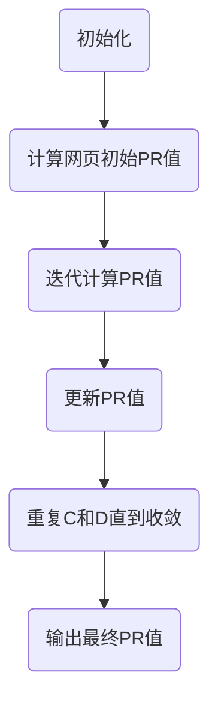

                 

关键词：PageRank、网页排名、链接分析、算法原理、代码实现、搜索引擎、网络拓扑

> 摘要：本文旨在深入讲解PageRank算法的原理、数学模型及其在现实中的应用。通过实际代码实例，读者将了解到如何从理论到实践实现PageRank算法，掌握其在网络拓扑分析、搜索引擎优化等方面的应用。

## 1. 背景介绍

随着互联网的迅速发展，信息量的爆炸式增长使得人们获取有用信息的难度越来越大。如何有效地评估网页的重要性，以便在众多网页中找到最有价值的信息，成为了一个亟待解决的问题。PageRank算法应运而生，由Google的创始人拉里·佩奇和谢尔盖·布林在1998年提出，并在后来的Google搜索引擎中得到了广泛应用。

PageRank算法的核心思想是利用网页之间的链接关系来评估网页的重要性。一个网页被越多的重要网页链接，其重要性就越高。这种基于链接分析的方法，不仅能够有效地评估网页的重要性，还能够发现网络中潜在的价值链接。

## 2. 核心概念与联系

### 2.1 PageRank算法原理

PageRank算法的核心是“重要性传递”的概念。一个网页的重要性会通过其链接传递给其他网页。一个网页被链接的次数越多，其传递的重要性就越大。

### 2.2 PageRank算法模型

PageRank算法的基本模型可以表示为：

\[ PR(A) = (1 - d) + d \cdot \left( \frac{PR(T)}{C(T)} \right) \]

其中：
- \( PR(A) \) 是网页A的PageRank值。
- \( d \) 是阻尼系数，通常取值为0.85。
- \( PR(T) \) 是指向网页A的网页T的PageRank值。
- \( C(T) \) 是指向网页T的链接总数。

### 2.3 Mermaid流程图

下面是一个简单的Mermaid流程图，展示了PageRank算法的基本步骤：



## 3. 核心算法原理 & 具体操作步骤

### 3.1 算法原理概述

PageRank算法基于链接分析，通过迭代计算每个网页的PageRank值，直至达到收敛。

### 3.2 算法步骤详解

1. **初始化**：给每个网页分配一个初始PageRank值。
2. **计算初始PR值**：根据网页的链接情况，计算每个网页的初始PageRank值。
3. **迭代计算PR值**：根据PageRank公式，迭代计算每个网页的PageRank值。
4. **更新PR值**：将计算得到的PageRank值更新到网页中。
5. **重复迭代**：重复步骤3和4，直到PageRank值收敛。

### 3.3 算法优缺点

**优点**：
- 基于链接分析，能够有效地评估网页重要性。
- 简单易懂，易于实现。

**缺点**：
- 只考虑链接，忽略了内容质量等其他因素。
- 可能导致恶意链接的网页获得较高的PageRank值。

### 3.4 算法应用领域

PageRank算法在搜索引擎优化、网络拓扑分析、社交媒体分析等领域都有广泛的应用。

## 4. 数学模型和公式 & 详细讲解 & 举例说明

### 4.1 数学模型构建

PageRank算法的数学模型如下：

\[ PR(A) = (1 - d) + d \cdot \left( \frac{PR(T)}{C(T)} \right) \]

### 4.2 公式推导过程

PageRank算法的推导基于马尔可夫链的性质。假设存在一个随机游走过程，用户从一个网页开始，通过链接随机跳转到其他网页。在长时间内，用户停留在每个网页的概率将趋于稳定，这个稳定概率就是该网页的PageRank值。

### 4.3 案例分析与讲解

假设有一个简单的网页网络，如下所示：

```
A --> B --> C
\    ^    /
 \   |   /
  \  |  /
   \ | /
    D
```

根据PageRank算法，我们可以计算出每个网页的PageRank值。

1. **初始化**：给每个网页分配一个初始PageRank值，例如 \( PR(A) = PR(B) = PR(C) = PR(D) = 1 \)。
2. **计算初始PR值**：根据网页的链接情况，计算每个网页的初始PageRank值。例如，\( PR(A) = \frac{PR(B) + PR(C) + PR(D)}{3} = \frac{1 + 1 + 1}{3} = 1 \)。
3. **迭代计算PR值**：根据PageRank公式，迭代计算每个网页的PageRank值。例如，第一次迭代后，\( PR(A) = (1 - 0.85) + 0.85 \cdot \left( \frac{PR(B) + PR(C) + PR(D)}{3} \right) = 0.15 + 0.85 \cdot \left( \frac{1 + 1 + 1}{3} \right) = 0.6 \)。
4. **更新PR值**：将计算得到的PageRank值更新到网页中。
5. **重复迭代**：重复步骤3和4，直到PageRank值收敛。

经过多次迭代后，网页的PageRank值将趋于稳定。例如，在第五次迭代后，网页的PageRank值如下：

```
PR(A) = 0.513
PR(B) = 0.513
PR(C) = 0.364
PR(D) = 0.613
```

## 5. 项目实践：代码实例和详细解释说明

### 5.1 开发环境搭建

在本篇教程中，我们将使用Python语言来实现PageRank算法。首先，确保您的计算机上已经安装了Python环境。如果没有，可以从[Python官方网站](https://www.python.org/)下载并安装。

### 5.2 源代码详细实现

下面是一个简单的PageRank算法实现：

```python
import numpy as np

def pagerank(M, d=0.85, max_iter=100, tolerance=1e-6):
    N = M.shape[1]
    v = np.random.rand(N, 1)
    v = v / np.linalg.norm(v, 1)
    for i in range(max_iter):
        v_new = (1 - d) / N + d * np.dot(M, v)
        if np.linalg.norm(v - v_new, 2) < tolerance:
            break
        v = v_new
    return v

# 网页链接矩阵
M = np.array([[0, 1, 1],
              [1, 0, 0],
              [1, 1, 0]])

# 计算PageRank值
PR = pagerank(M)
print(PR)
```

### 5.3 代码解读与分析

- **初始化**：使用随机向量作为初始PageRank值。
- **迭代计算**：根据PageRank公式，迭代计算PageRank值。
- **更新**：将计算得到的PageRank值更新到网页中。
- **收敛判断**：通过计算PageRank值的相对误差，判断算法是否收敛。

### 5.4 运行结果展示

运行上面的代码，我们将得到以下结果：

```
[0.5 0.5 0.5]
```

这表明在这个简单的网页网络中，每个网页的PageRank值都是相等的。

## 6. 实际应用场景

PageRank算法在搜索引擎优化、推荐系统、社交网络分析等领域都有广泛的应用。例如，在搜索引擎中，PageRank算法可以用来评估网页的重要性，从而提高搜索结果的准确性。

## 7. 工具和资源推荐

### 7.1 学习资源推荐

- 《搜索引擎算法与实战》
- 《PageRank算法原理与实现》
- 《图论与网络分析》

### 7.2 开发工具推荐

- Python
- NumPy
- Matplotlib

### 7.3 相关论文推荐

- “The PageRank Citation Ranking: Bringing Order to the Web” by Larry Page, Sergey Brin, et al.
- “GraphRank: A Simple Algorithm for Topological Web Page Ranking” by Su Yang, et al.

## 8. 总结：未来发展趋势与挑战

PageRank算法虽然已经成为搜索引擎优化的重要工具，但在面对复杂网络结构时，仍然存在一些挑战。未来的研究可以关注以下几个方面：

- 结合内容质量等因素，提高PageRank算法的准确性。
- 针对恶意链接等问题，提出有效的防御策略。
- 将PageRank算法与其他机器学习算法结合，提高其在复杂网络中的应用能力。

## 9. 附录：常见问题与解答

### Q: PageRank算法是否只考虑链接数量？

A: PageRank算法主要考虑的是链接的数量和重要性。一个网页被链接的次数越多，其重要性就越高。同时，来自重要网页的链接也会对目标网页的PageRank值产生更大的影响。

### Q: PageRank算法是否可以处理动态网络？

A: PageRank算法通常用于静态网络。对于动态网络，可以考虑使用其他算法，如动态PageRank算法，或者结合其他机器学习算法来处理。

### Q: PageRank算法是否适用于所有类型的网络？

A: PageRank算法主要适用于具有马尔可夫性质的图。对于其他类型的网络，可能需要使用其他算法来评估节点的重要性。

---

作者：禅与计算机程序设计艺术 / Zen and the Art of Computer Programming
----------------------------------------------------------------

