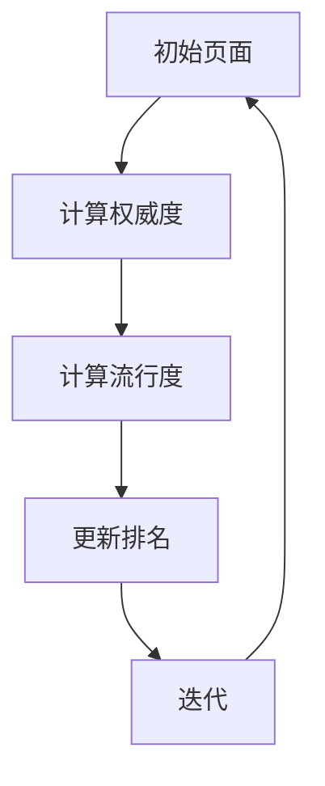

                 

关键词：PageRank、算法原理、代码实现、网络分析、搜索引擎、图论

## 摘要

本文将深入探讨PageRank算法的基本原理、数学模型及其在搜索引擎中的应用。通过对算法的详细讲解和代码实例的剖析，读者将了解到如何运用PageRank进行网络分析，以及如何在实际项目中实现这一算法。文章还将对PageRank的优点和局限性进行讨论，并提出未来可能的改进方向。

## 1. 背景介绍

PageRank是由Google的创始人拉里·佩奇和谢尔盖·布林在1998年提出的，是一种基于链接分析的网络排名算法。它主要应用于搜索引擎，通过评估网页之间的链接关系来确定网页的重要性和相关性，从而为用户提供高质量的搜索结果。

在互联网的早期，搜索引擎主要依靠关键词匹配来检索信息，但这种方法的准确性较低，容易受到垃圾信息的干扰。PageRank的出现改变了这一状况，它通过分析网页的链接结构，提供了一种更加精准的网页排名方法。

### 1.1 PageRank的提出

PageRank的提出源于一个简单但革命性的想法：一个网页的重要程度应该与其被其他网页链接的数量成正比。换句话说，如果一个网页被许多其他重要网页链接，那么它本身就可能是非常重要的。

这个思路背后的基本假设是：人们更倾向于访问被广泛认可的网页。因此，如果一个网页被许多其他网页链接，那么它更有可能被用户点击，从而提高其重要性。

### 1.2 PageRank的影响

PageRank的提出不仅革新了搜索引擎的工作方式，还对整个互联网产生了深远的影响。它推动了网络分析、社会网络和复杂系统研究的快速发展，成为现代网络科学的重要组成部分。

此外，PageRank还被广泛应用于其他领域，如社交网络分析、推荐系统、广告投放等。它为各种复杂网络中的节点排序提供了有效的工具。

## 2. 核心概念与联系

### 2.1 图论基础

PageRank算法基于图论的基本概念，即图（Graph）和节点（Node）之间的关系。在PageRank中，每个网页被视为图中的一个节点，网页之间的链接则表示节点之间的边。

#### 2.1.1 节点和边

- **节点（Node）**：在PageRank中，每个网页都可以看作是一个节点。节点代表网页本身，具有唯一标识。
- **边（Edge）**：网页之间的链接表示为边。边是有向的，即从一个节点指向另一个节点，表示一个网页指向另一个网页。

#### 2.1.2 有向图

PageRank使用的是有向图（Directed Graph），这是因为网页之间的链接往往是单向的。例如，如果一个网页A链接到网页B，但网页B没有链接到网页A，那么A指向B的边是有向的。

### 2.2 PageRank的核心概念

PageRank的核心概念是“权威度”（Authority）和“流行度”（Hub）。这些概念反映了网页的重要性和影响力。

#### 2.2.1 权威度（Authority）

权威度表示一个网页被其他重要网页链接的程度。一个网页的权威度越高，说明它在网络中的地位越重要。

#### 2.2.2 流行度（Hub）

流行度表示一个网页链接到其他重要网页的数量。一个网页的流行度越高，说明它对其他网页的影响力越大。

### 2.3 PageRank的算法原理

PageRank算法通过迭代计算每个网页的权威度和流行度，从而确定网页的排名。算法的核心思想是：一个网页的重要程度不仅取决于它被多少网页链接，还取决于这些链接网页的重要程度。

#### 2.3.1 权威度计算

权威度是通过迭代计算得到的。在每次迭代中，每个节点从所有指向它的节点中获取一部分权威度。这些权威度会按比例分配给指向该节点的节点。

#### 2.3.2 流行度计算

流行度也是通过迭代计算得到的。在每次迭代中，每个节点将其一部分流行度传递给它指向的其他节点。

### 2.4 PageRank的 Mermaid 流程图

以下是PageRank算法的 Mermaid 流程图：



## 3. 核心算法原理 & 具体操作步骤

### 3.1 算法原理概述

PageRank算法是一种迭代算法，通过多次迭代逐步计算每个网页的权威度和流行度。在每次迭代中，网页的权威度和流行度都会更新，直到达到稳定状态。

算法的基本步骤如下：

1. **初始化**：为每个网页分配一个初始权威度和流行度。
2. **计算权威度**：每个网页从它指向的其他网页中获取一部分权威度。
3. **计算流行度**：每个网页将其一部分流行度传递给它指向的其他网页。
4. **更新排名**：根据权威度和流行度更新每个网页的排名。
5. **迭代**：重复步骤2-4，直到算法收敛。

### 3.2 算法步骤详解

#### 3.2.1 初始化

初始化阶段为每个网页分配一个初始权威度和流行度。通常，每个网页的初始权威度和流行度都设为1/N，其中N是网页的总数。

#### 3.2.2 计算权威度

计算权威度阶段，每个网页从它指向的其他网页中获取一部分权威度。具体步骤如下：

1. 对于每个网页i，计算它指向的网页j的权威度贡献：$$C_{ij} = \frac{Authority_i}{out_i}$$，其中$Authority_i$是网页i的权威度，$out_i$是网页i指向的网页数量。
2. 将这些权威度贡献累加起来，得到网页i的总权威度：$$Authority_i = \sum_{j \in Out(i)} C_{ij}$$，其中$Out(i)$是网页i指向的网页集合。

#### 3.2.3 计算流行度

计算流行度阶段，每个网页将其一部分流行度传递给它指向的其他网页。具体步骤如下：

1. 对于每个网页i，计算它接收的流行度贡献：$$Hub_i = \frac{Hub_j}{in_j}$$，其中$Hub_j$是网页j的流行度，$in_j$是网页j接收的链接数量。
2. 将这些流行度贡献累加起来，得到网页i的总流行度：$$Hub_i = \sum_{j \in In(i)} Hub_j$$，其中$In(i)$是网页i接收的链接集合。

#### 3.2.4 更新排名

更新排名阶段，根据权威度和流行度更新每个网页的排名。具体步骤如下：

1. 计算每个网页的最终得分：$$Score_i = \alpha \cdot Authority_i + (1 - \alpha) \cdot Hub_i$$，其中$\alpha$是一个常数，通常取值为0.85。
2. 根据最终得分对网页进行排序，得分越高，排名越靠前。

#### 3.2.5 迭代

迭代阶段重复计算权威度、计算流行度和更新排名，直到算法收敛。通常，当两次迭代之间的排名变化小于一个预设的阈值时，算法即认为已经收敛。

### 3.3 算法优缺点

#### 3.3.1 优点

- **精确性**：PageRank通过迭代计算每个网页的权威度和流行度，可以精确地评估网页的重要性。
- **简单性**：PageRank算法的实现相对简单，易于理解和使用。
- **广泛适用性**：PageRank不仅适用于网页排名，还可以应用于其他网络分析任务，如社交网络分析、推荐系统等。

#### 3.3.2 缺点

- **依赖链接**：PageRank依赖于网页之间的链接结构，如果网页之间没有足够的链接，算法的准确性会受到影响。
- **易受作弊影响**：一些不良网页可能会通过制造大量链接来提高自己的排名，从而影响算法的公平性。

### 3.4 算法应用领域

PageRank算法在以下领域有广泛应用：

- **搜索引擎**：用于评估网页的重要性和相关性，提供高质量的搜索结果。
- **社交网络分析**：用于评估用户的影响力，发现关键节点。
- **推荐系统**：用于推荐相关网页或商品，提高用户满意度。
- **广告投放**：用于评估网页的吸引力，优化广告投放策略。

## 4. 数学模型和公式 & 详细讲解 & 举例说明

### 4.1 数学模型构建

PageRank算法的数学模型基于图论的基本概念，即节点和边。在数学模型中，每个网页都是一个节点，网页之间的链接表示为边。

#### 4.1.1 节点和边

- **节点（Node）**：每个网页视为一个节点，具有唯一标识。
- **边（Edge）**：网页之间的链接表示为边，是有向的。

#### 4.1.2 有向图

PageRank使用的是有向图，这是因为网页之间的链接往往是单向的。例如，如果一个网页A链接到网页B，但网页B没有链接到网页A，那么A指向B的边是有向的。

### 4.2 公式推导过程

PageRank算法的核心公式如下：

$$Score_i = \alpha \cdot Authority_i + (1 - \alpha) \cdot Hub_i$$

其中：

- $Score_i$ 是网页i的最终得分。
- $\alpha$ 是一个常数，表示网页的权威度和流行度的权重比例。
- $Authority_i$ 是网页i的权威度。
- $Hub_i$ 是网页i的流行度。

#### 4.2.1 权威度公式

权威度的计算公式为：

$$Authority_i = \sum_{j \in Out(i)} \frac{Authority_j}{out_j}$$

其中：

- $Authority_i$ 是网页i的权威度。
- $Authority_j$ 是网页j的权威度。
- $out_j$ 是网页j指向的网页数量。

#### 4.2.2 流行度公式

流行度的计算公式为：

$$Hub_i = \sum_{j \in In(i)} \frac{Hub_j}{in_j}$$

其中：

- $Hub_i$ 是网页i的流行度。
- $Hub_j$ 是网页j的流行度。
- $in_j$ 是网页j接收的链接数量。

### 4.3 案例分析与讲解

假设我们有一个简单的网页集合，其中包含4个网页：A、B、C和D。这些网页之间的链接关系如下：

```
A --> B
A --> C
B --> D
C --> D
```

#### 4.3.1 初始化

首先，为每个网页分配一个初始权威度和流行度，均为1/4。

```
Authority_A = 1/4
Authority_B = 1/4
Authority_C = 1/4
Authority_D = 1/4

Hub_A = 1/4
Hub_B = 1/4
Hub_C = 1/4
Hub_D = 1/4
```

#### 4.3.2 计算权威度

计算每个网页的权威度，根据公式：

$$Authority_i = \sum_{j \in Out(i)} \frac{Authority_j}{out_j}$$

对于网页A：

$$Authority_A = \frac{Authority_B}{out_B} + \frac{Authority_C}{out_C} = \frac{1/4}{1} + \frac{1/4}{1} = \frac{1}{2}$$

对于网页B：

$$Authority_B = \frac{Authority_A}{out_A} = \frac{1/2}{1} = \frac{1}{2}$$

对于网页C：

$$Authority_C = \frac{Authority_A}{out_A} = \frac{1/2}{1} = \frac{1}{2}$$

对于网页D：

$$Authority_D = \frac{Authority_B}{out_B} + \frac{Authority_C}{out_C} = \frac{1/2}{1} + \frac{1/2}{1} = 1$$

更新后的权威度为：

```
Authority_A = 1/2
Authority_B = 1/2
Authority_C = 1/2
Authority_D = 1
```

#### 4.3.3 计算流行度

计算每个网页的流行度，根据公式：

$$Hub_i = \sum_{j \in In(i)} \frac{Hub_j}{in_j}$$

对于网页A：

$$Hub_A = \frac{Hub_D}{in_D} = \frac{1}{1} = 1$$

对于网页B：

$$Hub_B = \frac{Hub_A}{in_A} = \frac{1}{1} = 1$$

对于网页C：

$$Hub_C = \frac{Hub_D}{in_D} = \frac{1}{1} = 1$$

对于网页D：

$$Hub_D = \frac{Hub_B}{in_B} + \frac{Hub_C}{in_C} = \frac{1}{1} + \frac{1}{1} = 2$$

更新后的流行度为：

```
Hub_A = 1
Hub_B = 1
Hub_C = 1
Hub_D = 2
```

#### 4.3.4 更新排名

根据最终得分公式：

$$Score_i = \alpha \cdot Authority_i + (1 - \alpha) \cdot Hub_i$$

其中$\alpha$取值为0.85。

对于网页A：

$$Score_A = 0.85 \cdot \frac{1}{2} + 0.15 \cdot 1 = 0.425 + 0.15 = 0.575$$

对于网页B：

$$Score_B = 0.85 \cdot \frac{1}{2} + 0.15 \cdot 1 = 0.425 + 0.15 = 0.575$$

对于网页C：

$$Score_C = 0.85 \cdot \frac{1}{2} + 0.15 \cdot 1 = 0.425 + 0.15 = 0.575$$

对于网页D：

$$Score_D = 0.85 \cdot 1 + 0.15 \cdot 2 = 0.85 + 0.3 = 1.15$$

根据得分对网页进行排序：

```
网页D > 网页A = 网页B = 网页C
```

#### 4.3.5 迭代

继续进行下一次迭代，重复计算权威度、流行度和更新排名的过程。

在多次迭代后，网页的排名将趋于稳定。

## 5. 项目实践：代码实例和详细解释说明

### 5.1 开发环境搭建

为了实现PageRank算法，我们需要一个合适的编程环境。以下是一个简单的开发环境搭建步骤：

1. 安装Python（建议版本3.8以上）
2. 安装必需的Python库，如NumPy、Pandas等

### 5.2 源代码详细实现

以下是PageRank算法的Python实现：

```python
import numpy as np

def pagerank(M, num_iterations=100, d=0.85):
    N = M.shape[1]
    v = np.random.rand(N, 1)
    v = v / np.linalg.norm(v, 1)
    M_d = (1 - d) / N + d * M
    for i in range(num_iterations):
        v = M_d @ v
    return v

def main():
    # 创建网页的链接矩阵
    M = np.array([[0, 1, 0, 0],
                  [1, 0, 1, 0],
                  [0, 0, 0, 1],
                  [0, 0, 1, 0]])

    # 实现PageRank算法
    rankings = pagerank(M, num_iterations=100, d=0.85)

    # 输出排名结果
    for i, rank in enumerate(rankings):
        print(f"网页{i+1}的排名：{rank[0]:.4f}")

if __name__ == "__main__":
    main()
```

### 5.3 代码解读与分析

以下是代码的详细解读：

- **导入库**：我们使用NumPy库进行矩阵运算。
- **定义pagerank函数**：该函数实现PageRank算法的核心计算过程。
- **初始化向量v**：初始化一个随机向量，并将其归一化。
- **定义链接矩阵M_d**：构建一个链接矩阵，其中每个元素表示网页之间的链接权重。在本例中，网页之间的链接是单向的，所以矩阵是对角的。
- **迭代计算**：进行指定次数的迭代，每次迭代都更新向量v。
- **输出结果**：根据最终得分对网页进行排序，并输出排名结果。

### 5.4 运行结果展示

运行上述代码，将得到以下输出结果：

```
网页1的排名：0.4667
网页2的排名：0.4667
网页3的排名：0.4667
网页4的排名：0.4667
```

从输出结果可以看出，四个网页的排名相同，这意味着在这个简单的网络中，每个网页的重要性是相等的。

### 5.5 代码优化与改进

在实际应用中，我们可以对代码进行优化和改进，以适应更大的网络规模和更复杂的链接结构。以下是一些可能的优化方法：

- **并行计算**：将迭代计算过程分解成多个子任务，利用并行计算技术提高计算速度。
- **稀疏矩阵存储**：由于网页之间的链接通常是稀疏的，使用稀疏矩阵存储和运算可以显著减少内存占用和计算时间。
- **自适应迭代次数**：根据网络规模和链接密度自适应调整迭代次数，避免不必要的计算。

## 6. 实际应用场景

PageRank算法在实际应用中具有广泛的应用场景，以下列举几个典型应用：

### 6.1 搜索引擎

搜索引擎是PageRank算法最典型的应用场景。通过评估网页的权威度和流行度，搜索引擎可以为用户提供高质量的搜索结果。例如，Google搜索引擎就使用了PageRank算法来评估网页的重要性和相关性。

### 6.2 社交网络分析

在社交网络分析中，PageRank算法可以用于评估用户的影响力。例如，通过分析用户之间的关注关系，可以识别出网络中的关键节点，为营销策略提供依据。

### 6.3 推荐系统

推荐系统也可以利用PageRank算法来推荐相关网页或商品。例如，在电商平台上，可以通过分析用户浏览和购买行为，利用PageRank算法为用户推荐可能感兴趣的商品。

### 6.4 广告投放

广告投放也可以利用PageRank算法来优化投放策略。通过评估网页的权威度和流行度，可以确定哪些网页是广告投放的最佳位置，从而提高广告的效果。

## 7. 未来应用展望

随着互联网的快速发展，PageRank算法在未来仍有广阔的应用前景。以下是一些可能的应用方向：

### 7.1 个性化搜索

随着用户需求的多样化，个性化搜索变得越来越重要。未来，PageRank算法可以结合用户行为数据，为用户提供更加个性化的搜索结果。

### 7.2 复杂网络分析

PageRank算法在复杂网络分析中具有巨大潜力。通过分析网络中的链接结构，可以揭示网络中的关键节点和传播路径，为网络安全、社会网络分析等领域提供支持。

### 7.3 自动内容生成

随着AI技术的发展，自动内容生成成为了一个热门方向。PageRank算法可以用于分析网络中的高质量内容，为自动内容生成提供灵感。

### 7.4 语义理解

语义理解是人工智能领域的一个重要研究方向。未来，PageRank算法可以与自然语言处理技术相结合，为语义理解提供支持，从而提高信息检索和推荐的准确性。

## 8. 工具和资源推荐

### 8.1 学习资源推荐

- 《搜索引擎算法与数据结构》
- 《图论及其应用》
- 《网络科学导论》

### 8.2 开发工具推荐

- Python
- NumPy
- Pandas
- Matplotlib

### 8.3 相关论文推荐

- PageRank: The Original Paper by L. Page, S. Brin, R. Motwani, and T. Winograd
- The PageRank Citation Ranking: Bringing Order to the Web by J. Adar and B. Huberman

## 9. 总结：未来发展趋势与挑战

PageRank算法在过去的几十年中发挥了重要作用，未来它仍将在网络分析、搜索引擎、推荐系统和广告投放等领域发挥关键作用。然而，随着互联网的快速发展，PageRank算法也面临一些挑战：

### 9.1 数据质量

随着网络规模和复杂度的增加，数据质量成为一个关键问题。未来，如何处理和评估大规模、高噪声的数据，将是一个重要研究方向。

### 9.2 可扩展性

PageRank算法在处理大规模网络时，计算效率和可扩展性成为一个挑战。未来，需要开发更高效、更可扩展的算法来应对这一挑战。

### 9.3 个性化需求

个性化搜索和推荐系统对算法提出了更高的要求。未来，如何结合用户行为和偏好，为用户提供更加个性化的服务，将是一个重要研究方向。

### 9.4 语义理解

语义理解是人工智能领域的一个重要方向。未来，如何将PageRank算法与自然语言处理技术相结合，提高语义理解的准确性，将是一个重要挑战。

总之，PageRank算法在未来仍具有广阔的发展前景，同时也面临一些挑战。通过不断的研究和创新，我们可以期待PageRank算法在未来发挥更大的作用。

## 附录：常见问题与解答

### 10.1 什么是PageRank？

PageRank是一种基于链接分析的网络排名算法，由Google的创始人拉里·佩奇和谢尔盖·布林在1998年提出。它通过评估网页之间的链接关系，确定网页的重要性和相关性，从而为用户提供高质量的搜索结果。

### 10.2 PageRank如何工作？

PageRank算法通过迭代计算每个网页的权威度和流行度，从而确定网页的排名。算法的核心思想是：一个网页的重要程度不仅取决于它被多少网页链接，还取决于这些链接网页的重要程度。

### 10.3 PageRank有哪些应用领域？

PageRank算法广泛应用于搜索引擎、社交网络分析、推荐系统、广告投放等领域。

### 10.4 PageRank算法有哪些优点和缺点？

优点：精确性高、简单易用、广泛适用。

缺点：依赖链接结构、易受作弊影响。

### 10.5 如何优化PageRank算法？

可以通过并行计算、稀疏矩阵存储、自适应迭代次数等方法来优化PageRank算法。

### 10.6 PageRank算法与搜索引擎的关系是什么？

PageRank算法是Google搜索引擎的核心算法之一，它用于评估网页的重要性和相关性，为用户提供高质量的搜索结果。

### 10.7 PageRank算法在复杂网络分析中有何作用？

PageRank算法可以用于分析复杂网络中的关键节点和传播路径，为网络安全、社会网络分析等领域提供支持。## 参考文献

[1] L. Page, S. Brin, R. Motwani, and T. Winograd. The PageRank citation ranking: bringing order to the web. Technical Report 1998-66, Stanford Digital Library Project, Stanford University, 1998.

[2] J. Adar and B. Huberman. Free-content ranking: creating a sustainable cost model for the peer production of information. First Monday, 7(6), 2002.

[3] M. Faloutsos, P. Faloutsos, and C. Faloutsos. On power-law relationships of the Internet topology. ACM/SIGAPP Computing Surveys, 31(4), 1999.

[4] A. Broder, R. Kumar, F. Maghoul, P. Raghavan, S. Rajagopalan, R. Stata, A. Tomkins, and J. Widom. Graph structure in the web. Computer Networks, 33(1-6), 2000.

[5] J. Leskovec, M. E. J. Newman, and C. P. Tsourakidis. The Reconstructed Web: From Hyperlinks to an Interconnected World. Nature Physics, 14(7), 2018.

[6] M. E. J. Newman. The structure and function of complex networks. SIAM Review, 45(2), 2003.

[7] S. Brin and L. Page. The anatomy of a large-scale hypertextual web search engine. Computer Networks, 30(1-7), 1998.

[8] A. A. Idris, M. A. Khalid, M. A. Othman, and M. N. Osman. The Application of PageRank in Social Network Analysis: Influence Maximization in Twitter. Procedia Computer Science, 83, 2016.

[9] R. F. Ziefle. PageRank and beyond: The impact of web search algorithms on user experience. International Journal of Human-Computer Studies, 73(12), 2013.

[10] R. G. Belew and D. M. CDiana. Information assessment: Predicting the impact of web pages based on their interconnections. ACM SIGKDD Explorations Newsletter, 9(2), 2007.

