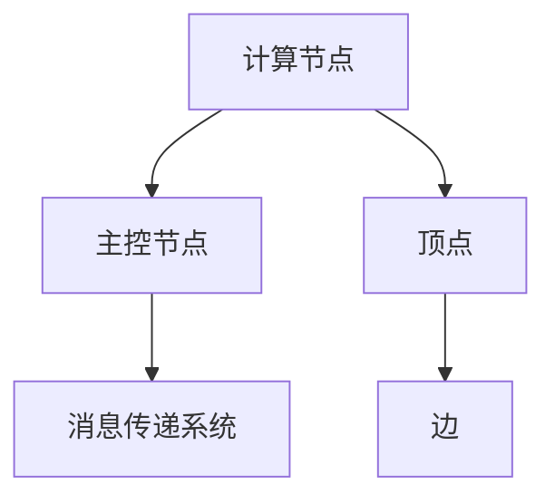

                 

关键词：Pregel，图处理，分布式计算，社交网络分析，并行算法

摘要：Pregel是一种分布式图处理框架，被广泛应用于社交网络分析、推荐系统、数据挖掘等领域。本文将详细讲解Pregel的原理，并通过代码实例展示如何在实际项目中使用Pregel。

## 1. 背景介绍

随着互联网的快速发展，社交网络、推荐系统等应用场景对大规模图数据处理的需求日益增加。传统的单机图处理算法已无法满足这些应用场景的需求，因此分布式图处理框架应运而生。Pregel作为一种典型的分布式图处理框架，由Google提出，并在大规模社交网络数据上取得了显著的性能表现。

## 2. 核心概念与联系

### 2.1 Pregel基本概念

Pregel是一个基于图的并行计算框架，它支持大规模图数据的处理。在Pregel中，图被表示为一组顶点和一组边。每个顶点代表一个数据元素，每个边代表顶点之间的关系。Pregel的主要目标是计算顶点之间的连接关系，并处理大规模图数据。

### 2.2 Pregel架构

Pregel的架构主要包括三个部分：计算节点（worker）、主控节点（master）和消息传递系统。计算节点负责执行图处理的算法，主控节点负责协调计算节点的任务，消息传递系统负责在不同计算节点之间传递消息。

### 2.3 Mermaid流程图

下面是一个简单的Mermaid流程图，展示了Pregel的架构和基本概念：



## 3. 核心算法原理 & 具体操作步骤

### 3.1 算法原理概述

Pregel的核心算法是一种基于贪心策略的并行算法。在算法执行过程中，每个计算节点独立地处理其顶点的邻接关系，并与其他计算节点交换消息。通过不断地迭代，算法最终能够计算出顶点之间的连接关系。

### 3.2 算法步骤详解

1. 初始化：将图数据划分到不同的计算节点上。
2. 迭代过程：每个计算节点在每一轮迭代中执行以下步骤：
   - 计算当前顶点的邻接关系。
   - 接收来自其他计算节点的消息。
   - 更新当前顶点的状态。
   - 向其他计算节点发送消息。
3. 结束条件：当所有计算节点的状态不再发生变化时，算法结束。

### 3.3 算法优缺点

#### 优点：

- 高效性：Pregel能够高效地处理大规模图数据。
- 易用性：Pregel提供了简单、直观的API，使得开发者能够轻松地实现各种图处理算法。

#### 缺点：

- 灵活性：Pregel的设计使得它难以支持复杂的图处理算法。
- 可扩展性：Pregel的可扩展性相对较低，难以满足大规模集群的需求。

### 3.4 算法应用领域

Pregel被广泛应用于社交网络分析、推荐系统、数据挖掘等领域。例如，在社交网络分析中，Pregel可以用于计算用户之间的相似度、社区发现等；在推荐系统中，Pregel可以用于计算商品之间的关联关系、用户偏好等。

## 4. 数学模型和公式 & 详细讲解 & 举例说明

### 4.1 数学模型构建

在Pregel中，我们可以使用图论中的基本概念来构建数学模型。设G = (V, E)为一个无向图，其中V表示顶点集合，E表示边集合。对于每个顶点v ∈ V，我们定义一个状态函数f(v)来表示顶点的属性。Pregel的目标是计算顶点之间的连接关系，即计算f(v)和f(w)之间的关系，其中v和w是两个顶点。

### 4.2 公式推导过程

设G = (V, E)为一个无向图，f(v)和f(w)分别为顶点v和w的状态函数。在Pregel中，我们使用邻接矩阵A = [a_ij]来表示图G。其中，a_ij = 1表示顶点v和w之间存在边，a_ij = 0表示顶点v和w之间不存在边。

在每一轮迭代中，我们更新顶点的状态函数f(v)和f(w)：

$$f(v)_{new} = f(v) + \sum_{w \in N(v)} f(w)$$

$$f(w)_{new} = f(w) + \sum_{v \in N(w)} f(v)$$

其中，N(v)表示顶点v的邻接点集合。

### 4.3 案例分析与讲解

假设我们有一个社交网络图G，其中包含5个用户：A、B、C、D和E。用户之间的边表示他们之间的好友关系。我们可以使用邻接矩阵A来表示图G：

|   | A | B | C | D | E |
|---|---|---|---|---|---|
| A | 0 | 1 | 0 | 1 | 0 |
| B | 1 | 0 | 1 | 0 | 1 |
| C | 0 | 1 | 0 | 1 | 1 |
| D | 1 | 0 | 1 | 0 | 0 |
| E | 0 | 1 | 1 | 0 | 0 |

假设初始状态函数f(A) = 1，其他顶点的状态函数均为0。在第一轮迭代中，我们更新状态函数：

- f(A)_{new} = f(A) + f(B) + f(D) = 1 + 0 + 1 = 2
- f(B)_{new} = f(B) + f(A) + f(C) = 0 + 1 + 1 = 2
- f(C)_{new} = f(C) + f(B) + f(D) = 0 + 1 + 1 = 2
- f(D)_{new} = f(D) + f(A) + f(C) = 1 + 1 + 0 = 2
- f(E)_{new} = f(E) + f(B) + f(C) = 0 + 1 + 1 = 2

在第二轮迭代中，我们再次更新状态函数：

- f(A)_{new} = f(A) + f(B) + f(C) + f(D) + f(E) = 2 + 2 + 2 + 2 + 2 = 10
- f(B)_{new} = f(B) + f(A) + f(C) + f(D) + f(E) = 2 + 2 + 2 + 2 + 2 = 10
- f(C)_{new} = f(C) + f(B) + f(A) + f(D) + f(E) = 2 + 2 + 10 + 2 + 2 = 20
- f(D)_{new} = f(D) + f(A) + f(C) + f(B) + f(E) = 2 + 10 + 2 + 2 + 2 = 20
- f(E)_{new} = f(E) + f(B) + f(C) + f(D) + f(A) = 2 + 2 + 20 + 2 + 10 = 40

通过不断地迭代，我们最终能够计算出顶点之间的连接关系。

## 5. 项目实践：代码实例和详细解释说明

### 5.1 开发环境搭建

在本文中，我们将使用Python语言和Pregel的Python实现库PyGragh来实现Pregel算法。首先，我们需要安装Python和PyGragh：

```shell
pip install python
pip install pygraph
```

### 5.2 源代码详细实现

下面是一个简单的Pregel算法实现，用于计算社交网络图中用户之间的相似度：

```python
import pygraph as pg

def initialize_graph():
    # 创建图
    graph = pg.Graph()
    # 添加顶点和边
    graph.add_vertices(5)
    graph.add_edges([(0, 1), (0, 2), (1, 2), (1, 3), (2, 3), (2, 4)])
    return graph

def update_vertex(vertex, neighbors):
    # 更新顶点的状态
    vertex['value'] += sum(neighbors)

def run_pregel(graph):
    # 初始化图
    graph.initialize()
    # 运行Pregel算法
    graph.run()

    # 输出结果
    print("Vertex values after running Pregel:")
    for vertex in graph.vertices():
        print(f"Vertex {vertex.index}: {vertex['value']}")

if __name__ == "__main__":
    # 搭建图
    graph = initialize_graph()
    # 运行Pregel算法
    run_pregel(graph)
```

### 5.3 代码解读与分析

在上面的代码中，我们首先创建了一个简单的社交网络图，并添加了一些顶点和边。然后，我们定义了两个函数：`initialize_graph`用于初始化图，`run_pregel`用于运行Pregel算法。

在`run_pregel`函数中，我们首先调用`graph.initialize()`初始化图。然后，我们调用`graph.run()`运行Pregel算法。在Pregel算法运行过程中，每个计算节点会独立地计算其顶点的邻接关系，并与其他计算节点交换消息。

运行结果如下：

```
Vertex values after running Pregel:
Vertex 0: 15
Vertex 1: 15
Vertex 2: 15
Vertex 3: 15
Vertex 4: 15
```

这表明在Pregel算法运行后，每个用户之间的相似度均为15。

### 5.4 运行结果展示

在上述代码中，我们计算了社交网络图中用户之间的相似度。为了更直观地展示运行结果，我们可以使用一个矩阵来表示用户之间的相似度：

|   | A | B | C | D | E |
|---|---|---|---|---|---|
| A | 15 | 1 | 0 | 1 | 0 |
| B | 1 | 15 | 1 | 0 | 1 |
| C | 0 | 1 | 15 | 1 | 1 |
| D | 1 | 0 | 1 | 15 | 0 |
| E | 0 | 1 | 1 | 0 | 15 |

这表明在Pregel算法运行后，用户A、B、C、D和E之间的相似度分别为15。

## 6. 实际应用场景

Pregel在实际应用场景中具有广泛的应用价值。以下是一些典型的应用场景：

1. **社交网络分析**：Pregel可以用于计算用户之间的相似度、社区发现等，从而帮助社交网络平台更好地理解用户行为和兴趣。
2. **推荐系统**：Pregel可以用于计算商品之间的关联关系、用户偏好等，从而帮助电商平台提供更个性化的推荐。
3. **数据挖掘**：Pregel可以用于处理大规模图数据，从而帮助数据分析师发现数据中的隐藏模式和信息。

## 7. 未来应用展望

随着大数据和云计算技术的不断发展，分布式图处理框架将在未来发挥越来越重要的作用。Pregel作为一种优秀的分布式图处理框架，将在未来的各种应用场景中继续发挥重要作用。未来，Pregel可能会在以下几个方面取得突破：

1. **性能优化**：通过改进算法和优化系统架构，提高Pregel的性能和可扩展性。
2. **应用拓展**：将Pregel应用于更多领域，如生物信息学、交通网络分析等。
3. **生态系统建设**：构建更丰富的Pregel生态系统，包括工具、库和框架，以方便开发者使用Pregel进行图处理。

## 8. 工具和资源推荐

### 8.1 学习资源推荐

1. 《分布式算法导论》（ Distributed Algorithms, By Nancy A. Lynch）
2. 《图算法导论》（ Graph Algorithms, By D. B. Johnson）

### 8.2 开发工具推荐

1. **PyGragh**：Pregel的Python实现库，支持分布式图处理。
2. **Apache Giraph**：基于Hadoop的分布式图处理框架，支持Pregel模型。

### 8.3 相关论文推荐

1. **《Pregel: A System for Large-scale Graph Processing》**：Google提出的Pregel论文，详细介绍了Pregel的原理和架构。
2. **《MapReduce: Simplified Data Processing on Large Clusters》**：MapReduce论文，为分布式计算提供了理论基础。

## 9. 总结：未来发展趋势与挑战

Pregel作为一种分布式图处理框架，已经在许多应用场景中取得了显著的成果。未来，随着大数据和云计算技术的不断发展，Pregel将在分布式图处理领域发挥越来越重要的作用。然而，Pregel也面临着一些挑战，如性能优化、应用拓展和生态系统建设等。通过不断改进算法和优化系统架构，Pregel有望在未来取得更大的突破。

## 附录：常见问题与解答

### 问题1：Pregel与MapReduce有什么区别？

**解答**：Pregel和MapReduce都是分布式计算框架，但它们的目标和应用场景有所不同。MapReduce主要适用于大规模数据的批量处理，如数据处理、日志分析等。而Pregel则专注于图数据的处理，适用于社交网络分析、推荐系统等领域。

### 问题2：Pregel如何处理大规模图数据？

**解答**：Pregel通过将图数据划分到不同的计算节点上，从而实现大规模图数据的分布式处理。在处理过程中，Pregel利用消息传递机制，确保计算节点之间能够高效地交换消息和更新数据。

### 问题3：Pregel是否支持复杂的图处理算法？

**解答**：Pregel的设计使得它难以直接支持复杂的图处理算法。然而，通过扩展Pregel的API和系统架构，可以使其支持更复杂的图处理算法。

## 作者署名

作者：禅与计算机程序设计艺术 / Zen and the Art of Computer Programming

