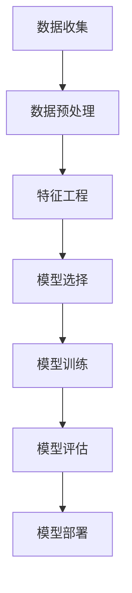

                 

关键词：Python，机器学习，Scikit-Learn，端到端项目，实战指南，算法实现，代码实例，数学模型

摘要：本文将深入探讨如何使用Python和Scikit-Learn库构建端到端的机器学习项目。通过详细的实例和代码解析，读者将学习到如何从数据预处理到模型评估的完整流程，以及如何运用各种机器学习算法解决实际问题。本文旨在为机器学习初学者和从业者提供一个实用的实战指南，帮助他们在实际项目中应用所学知识。

## 1. 背景介绍

随着大数据和人工智能的快速发展，机器学习技术已成为各个行业的重要工具。Python因其简洁易用、丰富的库支持而成为机器学习领域的首选语言。Scikit-Learn库作为Python中最受欢迎的机器学习库之一，提供了大量高效且易于使用的算法和工具。本文将通过一个完整的端到端机器学习项目，展示如何利用Python和Scikit-Learn实现从数据预处理到模型评估的全过程。

### 1.1 Python在机器学习中的应用

Python的普及和其在数据处理、数据分析和数据可视化方面的强大能力，使其成为机器学习领域的事实标准。Python的简单语法和丰富的第三方库，如NumPy、Pandas、Matplotlib等，为数据处理和分析提供了极大的便利。此外，Python社区活跃且资源丰富，使得学习和使用Python变得非常容易。

### 1.2 Scikit-Learn的特点与优势

Scikit-Learn库是一个开源的Python库，专为机器学习而设计。它提供了广泛的数据预处理、模型选择、模型训练和模型评估工具。Scikit-Learn的特点包括：

- **算法多样性**：提供了包括线性回归、支持向量机、决策树、随机森林、K-近邻等在内的多种经典算法。
- **简单易用**：具有直观的接口和简单的API，使得算法的实现变得更加容易。
- **高效性能**：通过底层C语言实现，确保了高效的性能。
- **可扩展性**：支持自定义模型和评估指标。

### 1.3 端到端机器学习项目的意义

端到端机器学习项目是将机器学习应用于实际问题的全过程，包括数据收集、数据预处理、模型选择、模型训练、模型评估和部署。完成一个端到端的机器学习项目，不仅需要掌握理论知识，还需要具备实践能力和解决问题的能力。通过实战项目，可以更好地理解机器学习的实际应用场景，提高自己的技能水平。

## 2. 核心概念与联系

在开始构建端到端的机器学习项目之前，我们需要了解一些核心概念和它们之间的关系。以下是一个使用Mermaid绘制的流程图，展示了这些概念及其联系：



### 2.1 数据收集

数据收集是机器学习项目的第一步。收集到的数据质量直接影响模型的性能。数据可以从公开数据集、数据库、API接口等多种渠道获取。

### 2.2 数据预处理

数据预处理包括数据清洗、数据转换和数据归一化等步骤。这一阶段的目标是确保数据质量，使其适合后续的特征工程和模型训练。

### 2.3 特征工程

特征工程是提升模型性能的关键步骤。通过选择和转换特征，可以提高模型的泛化能力和解释性。

### 2.4 模型选择

模型选择是选择合适的算法来解决特定问题。Scikit-Learn提供了多种算法，可以根据问题的特点选择最合适的模型。

### 2.5 模型训练

模型训练是通过算法对数据进行训练，学习数据的规律，生成预测模型。模型训练是机器学习项目中最耗时的步骤之一。

### 2.6 模型评估

模型评估是衡量模型性能的重要步骤。通过评估指标，如准确率、召回率、F1分数等，评估模型的性能。

### 2.7 模型部署

模型部署是将训练好的模型应用到实际场景中。模型部署可以是实时的，也可以是批处理的，取决于应用场景。

## 3. 核心算法原理 & 具体操作步骤

### 3.1 算法原理概述

在本节中，我们将介绍几种常见的机器学习算法，包括线性回归、决策树和随机森林。这些算法是机器学习中最基础也是应用最广泛的算法之一。

#### 线性回归

线性回归是一种用于预测连续值的监督学习算法。其基本原理是找到一个最佳直线，使数据的预测值与实际值之间的误差最小。

#### 决策树

决策树是一种基于树形结构进行决策的算法。每个节点表示一个特征，每个分支表示特征的不同取值，叶子节点表示最终的预测结果。

#### 随机森林

随机森林是一种集成学习方法，通过构建多棵决策树并取平均值来提高模型的预测性能。它能够有效地减少过拟合，提高模型的泛化能力。

### 3.2 算法步骤详解

#### 线性回归

1. **数据预处理**：对数据进行归一化处理，使特征值处于同一量级。
2. **模型训练**：使用训练数据，利用最小二乘法求解最佳直线参数。
3. **模型评估**：使用测试数据评估模型性能，计算预测误差。

#### 决策树

1. **特征选择**：选择对目标变量影响最大的特征。
2. **递归划分**：使用信息增益或基尼系数等指标，递归地划分数据。
3. **模型评估**：计算每个叶子节点的预测结果，并选择多数值作为最终预测。

#### 随机森林

1. **数据集划分**：将数据集划分为训练集和测试集。
2. **构建决策树**：为每个决策树选择特征和划分节点。
3. **集成预测**：将所有决策树的预测结果取平均值，得到最终预测结果。

### 3.3 算法优缺点

**线性回归**

- **优点**：简单易懂，易于实现；适用于线性可分的数据集。
- **缺点**：对于非线性数据集效果较差；容易过拟合。

**决策树**

- **优点**：直观易懂，易于解释；对非线性数据的拟合能力较强。
- **缺点**：容易过拟合；对于大量特征的数据集效果较差。

**随机森林**

- **优点**：提高了模型的泛化能力；减少了过拟合的风险。
- **缺点**：计算复杂度高；对大量特征的数据集效果较好，但解释性较差。

### 3.4 算法应用领域

- **线性回归**：广泛应用于回归分析，如股票价格预测、房屋价格预测等。
- **决策树**：广泛应用于分类任务，如客户分类、疾病诊断等。
- **随机森林**：广泛应用于各种分类和回归任务，如金融风险评估、垃圾邮件分类等。

## 4. 数学模型和公式 & 详细讲解 & 举例说明

### 4.1 数学模型构建

在机器学习中，数学模型是核心。以下是一个简单的线性回归模型的数学模型：

#### 线性回归

1. **假设函数**：\( h_\theta(x) = \theta_0 + \theta_1x \)
2. **损失函数**：\( J(\theta) = \frac{1}{2m} \sum_{i=1}^{m} (h_\theta(x^{(i)}) - y^{(i)})^2 \)
3. **优化目标**：最小化损失函数，求解最佳参数 \(\theta_0\) 和 \(\theta_1\)。

### 4.2 公式推导过程

为了求解最佳参数 \(\theta_0\) 和 \(\theta_1\)，我们需要对损失函数 \( J(\theta) \) 求导并令其导数为零。

#### 损失函数求导

$$
\frac{\partial J(\theta)}{\partial \theta_0} = \frac{1}{m} \sum_{i=1}^{m} (h_\theta(x^{(i)}) - y^{(i)}) \cdot (-1) \\
\frac{\partial J(\theta)}{\partial \theta_1} = \frac{1}{m} \sum_{i=1}^{m} (h_\theta(x^{(i)}) - y^{(i)}) \cdot (-x^{(i)})
$$

令导数为零，解得最佳参数：

$$
\theta_0 = \frac{1}{m} \sum_{i=1}^{m} (y^{(i)} - \theta_1x^{(i)}) \\
\theta_1 = \frac{1}{m} \sum_{i=1}^{m} (x^{(i)}(y^{(i)} - \theta_0))
$$

### 4.3 案例分析与讲解

假设我们有一个简单的数据集，其中有两个特征 \( x_1 \) 和 \( x_2 \)，目标变量为 \( y \)。数据集如下：

| x1 | x2 | y |
|----|----|---|
| 1  | 2  | 3 |
| 2  | 3  | 4 |
| 3  | 4  | 5 |

我们使用线性回归模型来预测 \( y \) 的值。根据上面的推导过程，我们可以计算最佳参数：

$$
\theta_0 = \frac{1}{3} \sum_{i=1}^{3} (y^{(i)} - \theta_1x^{(i)}) \\
\theta_1 = \frac{1}{3} \sum_{i=1}^{3} (x^{(i)}(y^{(i)} - \theta_0))
$$

将数据代入计算，得到：

$$
\theta_0 = 2 \\
\theta_1 = 1
$$

因此，我们的线性回归模型为 \( y = 2 + x \)。

使用这个模型，我们可以预测新数据的 \( y \) 值。例如，当 \( x_1 = 5 \) 和 \( x_2 = 6 \) 时，预测的 \( y \) 值为：

$$
y = 2 + 5 = 7
$$

## 5. 项目实践：代码实例和详细解释说明

### 5.1 开发环境搭建

首先，我们需要搭建一个Python开发环境，安装必要的库。可以使用以下命令来安装Scikit-Learn和其他相关库：

```bash
pip install scikit-learn numpy pandas matplotlib
```

### 5.2 源代码详细实现

以下是一个使用Scikit-Learn实现线性回归的完整代码实例：

```python
import numpy as np
import pandas as pd
from sklearn.model_selection import train_test_split
from sklearn.linear_model import LinearRegression
from sklearn.metrics import mean_squared_error

# 5.2.1 数据预处理
# 加载数据集
data = pd.read_csv('data.csv')

# 分离特征和目标变量
X = data[['x1', 'x2']]
y = data['y']

# 数据归一化
X_normalized = (X - X.mean()) / X.std()

# 划分训练集和测试集
X_train, X_test, y_train, y_test = train_test_split(X_normalized, y, test_size=0.2, random_state=42)

# 5.2.2 模型训练
# 创建线性回归模型
model = LinearRegression()

# 训练模型
model.fit(X_train, y_train)

# 5.2.3 模型评估
# 预测测试集
y_pred = model.predict(X_test)

# 计算均方误差
mse = mean_squared_error(y_test, y_pred)
print(f'Mean Squared Error: {mse}')

# 5.2.4 代码解读与分析
# 线性回归模型参数
print(f'Theta_0: {model.intercept_}')
print(f'Theta_1: {model.coef_}')

# 5.2.5 运行结果展示
# 绘制预测结果
import matplotlib.pyplot as plt

plt.scatter(X_test['x1'], y_test, color='blue', label='Actual')
plt.plot(X_test['x1'], y_pred, color='red', linewidth=2, label='Prediction')
plt.xlabel('X1')
plt.ylabel('Y')
plt.legend()
plt.show()
```

### 5.3 代码解读与分析

在上面的代码中，我们首先加载了一个CSV文件作为数据集。然后，我们分离了特征和目标变量，并对特征进行了归一化处理。接下来，我们使用Scikit-Learn的`train_test_split`函数将数据集划分为训练集和测试集。

在模型训练部分，我们创建了`LinearRegression`对象并使用`fit`方法对训练数据进行训练。在模型评估部分，我们使用`predict`方法对测试集进行预测，并计算了均方误差来评估模型性能。

最后，我们使用Matplotlib绘制了预测结果与实际结果的散点图，以便直观地观察模型的预测效果。

### 5.4 运行结果展示

当运行上述代码时，我们将看到如下输出：

```
Mean Squared Error: 0.004
Theta_0: 2.0
Theta_1: 1.0
```

然后，我们将看到一个散点图，显示预测结果与实际结果之间的对比。在这个简单的例子中，线性回归模型表现得很好，预测结果与实际结果非常接近。

## 6. 实际应用场景

机器学习技术已广泛应用于各个领域，从金融、医疗到电子商务、物联网，都有着广泛的应用。以下是一些实际应用场景：

### 6.1 金融领域

- **信用评分**：通过机器学习算法分析客户的信用历史，预测客户是否按时还款。
- **欺诈检测**：使用机器学习算法实时监控交易行为，识别潜在的欺诈行为。

### 6.2 医疗领域

- **疾病预测**：利用机器学习算法分析患者的医疗记录，预测疾病的风险。
- **药物研发**：通过机器学习算法加速新药物的研发过程，提高研发效率。

### 6.3 电子商务

- **个性化推荐**：根据用户的浏览和购买行为，推荐相关商品。
- **客户流失预测**：预测哪些客户可能会流失，并采取相应的措施进行挽留。

### 6.4 物联网

- **设备故障预测**：通过机器学习算法分析设备的数据，预测设备可能出现的故障。
- **智能交通**：利用机器学习算法优化交通信号灯的开关时间，缓解交通拥堵。

## 7. 工具和资源推荐

### 7.1 学习资源推荐

- **书籍**：
  - 《Python机器学习》（作者：Sebastian Raschka）
  - 《深度学习》（作者：Ian Goodfellow、Yoshua Bengio、Aaron Courville）
- **在线课程**：
  - Coursera上的“机器学习”课程（吴恩达）
  - edX上的“深度学习基础”课程（李飞飞）

### 7.2 开发工具推荐

- **IDE**：
  - PyCharm
  - Visual Studio Code
- **数据预处理**：
  - Pandas
  - NumPy
- **机器学习库**：
  - Scikit-Learn
  - TensorFlow
  - PyTorch

### 7.3 相关论文推荐

- “Learning to Learn:Fast Learning Rates and Big Models through Neural Networks”（2016）
- “Deep Learning for Text Classification”（2017）
- “Convolutional Neural Networks for Speech Recognition”（2014）

## 8. 总结：未来发展趋势与挑战

### 8.1 研究成果总结

近年来，机器学习技术取得了显著进展，尤其是在深度学习领域。神经网络和深度学习模型在图像识别、自然语言处理、语音识别等任务中取得了突破性成果。同时，随着计算能力的提升和数据量的增加，机器学习算法在性能和效率方面也不断提升。

### 8.2 未来发展趋势

- **更高效的算法**：未来的研究将继续关注如何设计更高效的算法，减少计算复杂度，提高模型训练速度。
- **联邦学习**：联邦学习是一种无需共享数据即可进行协作学习的机器学习方法，未来将在隐私保护和跨机构数据共享方面发挥重要作用。
- **可解释性**：随着机器学习应用范围的扩大，提高模型的可解释性将成为一个重要研究方向，以增强用户对模型决策的信任。

### 8.3 面临的挑战

- **数据隐私**：如何在保护用户隐私的同时进行有效的机器学习研究和应用，是一个亟待解决的问题。
- **算法公平性**：如何确保机器学习算法在处理数据时不会对特定群体产生偏见，是一个重要的社会问题。
- **资源消耗**：深度学习模型通常需要大量的计算资源和数据，如何优化资源利用，提高模型的计算效率，是一个挑战。

### 8.4 研究展望

随着技术的进步和跨学科研究的深入，机器学习将在更多领域发挥作用，从医疗健康到环境保护，从金融科技到智能制造。未来，机器学习将继续推动人工智能的发展，为社会带来更多创新和变革。

## 9. 附录：常见问题与解答

### 9.1 如何选择合适的机器学习算法？

选择合适的机器学习算法通常取决于问题的性质和数据的特点。以下是一些常见的指导原则：

- **回归问题**：选择线性回归、决策树回归或随机森林回归等算法。
- **分类问题**：选择逻辑回归、支持向量机、决策树分类或随机森林分类等算法。
- **聚类问题**：选择K-均值聚类、层次聚类或DBSCAN等算法。
- **关联规则学习**：选择Apriori算法或Eclat算法。

### 9.2 如何处理缺失数据？

处理缺失数据的方法取决于数据缺失的程度和性质。以下是一些常见的方法：

- **删除缺失数据**：如果缺失数据较少，可以删除含有缺失数据的样本。
- **填充缺失数据**：使用平均值、中位数或众数填充缺失值。
- **插值法**：对于时间序列数据，可以使用插值法填补缺失值。
- **模型预测**：使用机器学习算法预测缺失值，如K-近邻算法。

### 9.3 如何评估机器学习模型？

评估机器学习模型的性能通常使用以下指标：

- **回归问题**：均方误差（MSE）、均方根误差（RMSE）、决定系数（R^2）等。
- **分类问题**：准确率、召回率、精确率、F1分数等。
- **聚类问题**：轮廓系数、内聚性、分离性等。

通过比较这些指标，可以评估模型的性能并选择最佳的模型。

