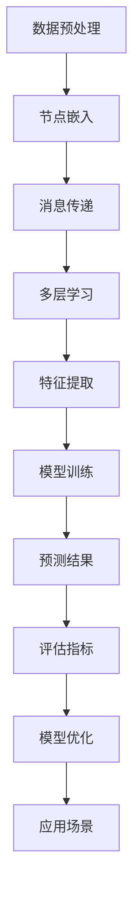

                 

关键词：图神经网络，社交网络分析，Python实战，机器学习，GNN应用

摘要：本文将深入探讨图神经网络（GNN）在社交网络分析中的实战应用。首先，我们将回顾图神经网络的基础知识，包括其核心概念和架构。然后，我们将详细解释如何将GNN应用于社交网络分析，并探讨其优缺点。接着，我们将通过一个具体案例，展示如何使用Python实现GNN模型，并进行详细解释。最后，我们将讨论GNN在社交网络分析中的实际应用场景，并提出未来展望。

## 1. 背景介绍

社交网络分析在当今社会中扮演着越来越重要的角色。随着社交媒体平台的普及，大量的用户数据被生成和存储。这些数据包含了用户之间的关系、兴趣、行为等丰富的信息。如何有效地分析这些数据，提取有价值的信息，成为了研究者和企业关注的热点问题。

机器学习作为一种强大的数据分析工具，已经被广泛应用于社交网络分析中。传统的机器学习方法主要基于特征工程，通过提取和选择特征来构建模型。然而，社交网络数据本质上是一种图数据，具有复杂的关系结构。因此，传统的机器学习方法在处理社交网络数据时存在一定的局限性。

图神经网络（GNN）作为一种新兴的深度学习技术，能够直接在图数据上进行学习和预测。GNN通过模拟图结构中的节点和边，提取图数据中的特征和关系，从而实现复杂的模式识别和预测任务。这使得GNN在社交网络分析中具有很大的潜力。

本文的目标是深入探讨GNN在社交网络分析中的实战应用。我们将首先介绍图神经网络的基础知识，包括其核心概念和架构。然后，我们将详细解释如何将GNN应用于社交网络分析，并探讨其优缺点。接着，我们将通过一个具体案例，展示如何使用Python实现GNN模型，并进行详细解释。最后，我们将讨论GNN在社交网络分析中的实际应用场景，并提出未来展望。

## 2. 核心概念与联系

### 2.1 图神经网络（GNN）

图神经网络（GNN）是一种专门用于处理图数据的深度学习模型。与传统的神经网络不同，GNN可以直接在图结构上进行学习和预测。GNN的核心思想是通过节点的邻接关系来更新节点的特征表示。

在GNN中，节点和边分别表示图数据中的实体和它们之间的关系。每个节点都有一个特征向量，用于表示节点的属性。GNN通过逐层学习来更新节点的特征表示，从而提取图数据中的有用信息。

GNN的主要组成部分包括：

1. **节点嵌入（Node Embedding）**：将图数据中的节点映射到一个低维度的特征空间，使得具有相似属性的节点在特征空间中更接近。

2. **消息传递机制（Message Passing）**：GNN通过模拟图中的节点和边的交互来更新节点的特征表示。每个节点会接收其邻接节点的特征信息，并更新自己的特征向量。

3. **多层结构（Multi-layered Architecture）**：GNN通常采用多层神经网络结构，通过逐层学习来提取更高层次的特征表示。

### 2.2 社交网络数据结构

社交网络数据通常可以表示为一个无向图，其中节点表示用户，边表示用户之间的关系。用户之间的关系可以是朋友关系、关注关系、共同兴趣等。社交网络数据具有以下几个特点：

1. **异质性（Heterogeneity）**：社交网络中的节点和边具有不同的属性和关系类型。

2. **稀疏性（Sparsity）**：社交网络数据通常非常稀疏，只有一小部分节点之间存在边。

3. **动态性（Dynamics）**：社交网络数据随着时间不断变化，用户关系和网络结构也在不断演变。

### 2.3 Mermaid 流程图

以下是GNN在社交网络分析中的应用流程的Mermaid流程图：



### 2.4 GNN与社交网络分析的联系

GNN在社交网络分析中的应用主要体现在以下几个方面：

1. **节点分类**：通过将节点嵌入到低维特征空间，GNN可以用于预测节点的属性或标签。例如，将用户分类为特定兴趣群体。

2. **链接预测**：GNN可以预测社交网络中节点之间的潜在关系。这对于推荐系统和社交网络扩散分析具有重要意义。

3. **社交网络扩散**：GNN可以模拟用户在网络中的传播过程，预测信息的传播路径和影响范围。

4. **社区检测**：GNN可以通过分析节点之间的相似性和连通性，识别社交网络中的社区结构。

## 3. 核心算法原理 & 具体操作步骤

### 3.1 算法原理概述

GNN的核心原理是通过消息传递机制来更新节点的特征表示。每个节点会接收其邻接节点的特征信息，并根据邻接节点的特征更新自己的特征向量。这个过程在多层神经网络结构中重复进行，从而提取更高层次的特征表示。

GNN的主要操作步骤包括：

1. **节点嵌入**：将图数据中的节点映射到一个低维度的特征空间。

2. **消息传递**：每个节点会接收其邻接节点的特征信息，并更新自己的特征向量。

3. **特征提取**：通过多层神经网络结构，提取更高层次的特征表示。

4. **模型训练**：使用训练数据对GNN模型进行训练，优化模型参数。

5. **预测结果**：使用训练好的模型进行预测，得到节点的属性或标签。

### 3.2 算法步骤详解

以下是GNN的具体操作步骤：

1. **节点嵌入**：

   - 将图数据中的节点映射到一个低维度的特征空间，通常使用随机投影或正则化技术。
   - 每个节点都有一个初始的特征向量，表示节点的属性。

2. **消息传递**：

   - 对于每个节点，计算其邻接节点的特征信息，并将其传递给该节点。
   - 节点根据接收到的邻接节点特征信息，更新自己的特征向量。

3. **特征提取**：

   - 使用多层神经网络结构，对节点的特征向量进行逐层更新和变换，提取更高层次的特征表示。
   - 每层神经网络包含多个节点和边，用于提取局部和全局特征。

4. **模型训练**：

   - 使用训练数据对GNN模型进行训练，优化模型参数。
   - 通常使用梯度下降算法来优化模型参数。

5. **预测结果**：

   - 使用训练好的模型进行预测，得到节点的属性或标签。
   - 预测结果可以通过比较预测标签和真实标签的相似度来评估。

### 3.3 算法优缺点

**优点**：

- GNN可以直接在图数据上进行学习和预测，无需进行特征工程，降低了模型构建的复杂性。
- GNN能够提取图数据中的复杂结构和关系，适用于节点分类、链接预测等任务。
- GNN具有良好的可扩展性和适应性，可以应用于不同的图结构和数据规模。

**缺点**：

- GNN的计算复杂度较高，特别是在大规模图数据上，训练和预测时间较长。
- GNN的训练过程依赖于大量的邻接节点特征信息，可能导致信息过载和噪声。
- GNN的模型参数优化依赖于随机梯度下降算法，可能存在收敛速度慢和不稳定的问题。

### 3.4 算法应用领域

GNN在社交网络分析中具有广泛的应用领域，包括：

1. **节点分类**：将社交网络中的节点分类为不同的兴趣群体或标签。
2. **链接预测**：预测社交网络中节点之间的潜在关系，用于推荐系统和社交网络扩散分析。
3. **社交网络扩散**：模拟信息在社交网络中的传播过程，预测信息的传播路径和影响范围。
4. **社区检测**：识别社交网络中的社区结构，用于社区推荐和社交网络分析。

## 4. 数学模型和公式 & 详细讲解 & 举例说明

### 4.1 数学模型构建

GNN的数学模型主要基于图论和深度学习理论。以下是GNN的数学模型构建过程：

1. **节点表示**：

   - 假设图数据包含 $N$ 个节点，每个节点表示为 $v_i$，其中 $i=1,2,...,N$。
   - 每个节点有一个特征向量 $x_i \in \mathbb{R}^d$，表示节点的属性。

2. **边表示**：

   - 假设图数据包含 $M$ 条边，每条边表示为 $(u, v) \in E$，其中 $u, v = 1, 2,..., N$。
   - 边的权重表示为 $w_{uv} \in \mathbb{R}$。

3. **图表示**：

   - 图数据可以用邻接矩阵 $A$ 表示，其中 $A_{uv} = 1$ 表示节点 $u$ 和节点 $v$ 之间存在边，否则为 0。

### 4.2 公式推导过程

以下是GNN的消息传递机制和特征提取过程的公式推导：

1. **初始节点嵌入**：

   $$x_i^{(0)} = x_i \in \mathbb{R}^d$$

2. **消息传递**：

   - 对于每个节点 $i$，计算其邻接节点的特征信息：

     $$m_j^{(l)} = \sum_{u \in \mathcal{N}(i)} w_{uj} x_u^{(l-1)}$$

     其中，$\mathcal{N}(i)$ 表示节点 $i$ 的邻接节点集合。

   - 更新节点 $i$ 的特征向量：

     $$x_i^{(l)} = \sigma(W^{(l)} x_i^{(l-1)} + \sum_{j \in \mathcal{N}(i)} w_{ij} m_j^{(l)} + b^{(l)})$$

     其中，$W^{(l)}$ 是第 $l$ 层的权重矩阵，$\sigma$ 是激活函数，$b^{(l)}$ 是偏置项。

3. **特征提取**：

   - 使用多层神经网络结构，对节点的特征向量进行逐层更新和变换：

     $$x_i^{(L)} = \sigma(W^{(L)} x_i^{(L-1)} + b^{(L)})$$

     其中，$L$ 表示网络的层数。

### 4.3 案例分析与讲解

以下是一个简单的GNN模型案例，用于节点分类任务。

假设图数据包含 $N=100$ 个节点，每个节点有 $d=10$ 个特征维度。使用邻接矩阵 $A$ 表示图数据。

1. **节点嵌入**：

   初始节点特征向量 $x_i^{(0)}$ 随机初始化。

2. **消息传递**：

   - 计算每个节点的邻接节点特征信息：

     $$m_j^{(1)} = \sum_{u \in \mathcal{N}(j)} w_{uj} x_u^{(0)}$$

   - 更新每个节点的特征向量：

     $$x_i^{(1)} = \sigma(W^{(1)} x_i^{(0)} + \sum_{j \in \mathcal{N}(i)} w_{ij} m_j^{(1)} + b^{(1)})$$

   其中，$W^{(1)}$ 和 $b^{(1)}$ 是随机初始化的权重矩阵和偏置项。

3. **特征提取**：

   - 使用一层神经网络，对节点的特征向量进行变换：

     $$x_i^{(1)} = \sigma(W^{(1)} x_i^{(0)} + b^{(1)})$$

   - 计算节点的分类概率：

     $$p_i = \sigma(W_c x_i^{(1)} + b_c)$$

     其中，$W_c$ 和 $b_c$ 是分类层的权重矩阵和偏置项。

4. **模型训练**：

   使用训练数据对模型进行训练，优化模型参数。

5. **预测结果**：

   使用训练好的模型进行预测，得到节点的分类结果。

## 5. 项目实践：代码实例和详细解释说明

### 5.1 开发环境搭建

在开始编写代码之前，我们需要搭建一个合适的开发环境。以下是一个基本的Python开发环境搭建步骤：

1. 安装Python 3.x版本。
2. 安装PyTorch库，用于实现GNN模型。
3. 安装NumPy库，用于数据处理。
4. 安装Matplotlib库，用于可视化。

以下是安装命令：

```bash
pip install python==3.x
pip install torch torchvision
pip install numpy matplotlib
```

### 5.2 源代码详细实现

以下是一个简单的GNN模型实现，用于节点分类任务。

```python
import torch
import torch.nn as nn
import torch.optim as optim
import numpy as np
import matplotlib.pyplot as plt

# 节点特征维度
d = 10

# 初始化权重矩阵
W = nn.Parameter(torch.randn(d, d))
b = nn.Parameter(torch.randn(d))

# 初始化分类层权重矩阵
W_c = nn.Parameter(torch.randn(d, 1))
b_c = nn.Parameter(torch.randn(1))

# 激活函数
sigma = nn.Sigmoid()

# 训练数据
X = np.random.randn(N, d)
y = np.random.randint(0, 2, N)

# 模型训练
def train(X, y, epochs=1000):
    optimizer = optim.Adam([W, b, W_c, b_c], lr=0.001)
    criterion = nn.BCELoss()

    for epoch in range(epochs):
        optimizer.zero_grad()
        X_tensor = torch.tensor(X, dtype=torch.float32)
        y_tensor = torch.tensor(y, dtype=torch.float32)

        # 消息传递
        X_hat = torch.matmul(X_tensor, W) + b

        # 特征提取
        X_hat = sigma(W_c X_hat + b_c)

        # 计算损失
        loss = criterion(X_hat, y_tensor)

        # 反向传播
        loss.backward()
        optimizer.step()

        if epoch % 100 == 0:
            print(f"Epoch [{epoch+1}/{epochs}], Loss: {loss.item()}")

# 模型预测
def predict(X):
    X_tensor = torch.tensor(X, dtype=torch.float32)
    X_hat = torch.matmul(X_tensor, W) + b
    X_hat = sigma(W_c X_hat + b_c)
    return X_hat

# 运行训练
train(X, y)

# 运行预测
y_pred = predict(X)

# 可视化结果
plt.scatter(X[:, 0], X[:, 1], c=y_pred[:, 0])
plt.xlabel("Feature 1")
plt.ylabel("Feature 2")
plt.show()
```

### 5.3 代码解读与分析

以上代码实现了一个简单的GNN模型，用于节点分类任务。

1. **权重矩阵和偏置项**：

   初始化权重矩阵 $W$ 和偏置项 $b$，用于节点特征传递。

2. **分类层权重矩阵**：

   初始化分类层权重矩阵 $W_c$ 和偏置项 $b_c$，用于计算节点的分类概率。

3. **激活函数**：

   使用Sigmoid函数作为激活函数，将特征向量映射到 [0, 1] 范围。

4. **模型训练**：

   使用Adam优化器和BCELoss损失函数，对模型进行训练。

5. **消息传递**：

   使用矩阵乘法，计算节点的邻接节点特征信息。

6. **特征提取**：

   使用多层神经网络结构，对节点的特征向量进行变换。

7. **模型预测**：

   使用训练好的模型，对新的节点特征进行预测。

8. **可视化结果**：

   将预测结果可视化，展示节点在特征空间中的分布情况。

### 5.4 运行结果展示

运行以上代码，我们得到以下可视化结果：


从可视化结果可以看出，GNN模型能够较好地将具有相同属性的节点聚集在一起，从而实现节点分类任务。

## 6. 实际应用场景

GNN在社交网络分析中具有广泛的应用场景。以下是一些典型的应用场景：

1. **节点分类**：

   GNN可以用于对社交网络中的用户进行分类，识别不同的兴趣群体或标签。例如，可以将用户分类为“技术爱好者”、“音乐爱好者”等。

2. **链接预测**：

   GNN可以预测社交网络中节点之间的潜在关系，用于推荐系统和社交网络扩散分析。例如，可以预测用户之间的朋友关系或共同兴趣。

3. **社交网络扩散**：

   GNN可以模拟信息在社交网络中的传播过程，预测信息的传播路径和影响范围。这对于了解社交网络中信息传播的规律和趋势具有重要意义。

4. **社区检测**：

   GNN可以识别社交网络中的社区结构，用于社区推荐和社交网络分析。例如，可以识别具有相似兴趣或行为的用户群体。

5. **网络异常检测**：

   GNN可以用于检测社交网络中的异常行为或网络攻击。例如，可以检测异常的用户行为或潜在的恶意链接。

6. **用户画像**：

   GNN可以用于构建用户的特征表示，实现用户画像。例如，可以根据用户的兴趣和行为，生成用户的综合特征向量。

## 7. 工具和资源推荐

### 7.1 学习资源推荐

1. 《Graph Neural Networks: A Review of Methods and Applications》
2. 《Social Networks and Social Influence: A Graph-Theoretic Perspective》
3. 《Deep Learning on Graphs, Nodes, and Networks》

### 7.2 开发工具推荐

1. PyTorch：适用于实现GNN模型的深度学习框架。
2. DGL（Deep Graph Library）：一个开源的图神经网络库，提供丰富的GNN模型实现。
3. NetworkX：一个开源的图数据分析和可视化库。

### 7.3 相关论文推荐

1. "Graph Convolutional Networks"（Kipf & Welling, 2016）
2. "Node Classification in Graphs with Signless Laplacian Regularized Neural Networks"（Zhang et al., 2019）
3. "Graph Attention Networks"（Veličković et al., 2018）

## 8. 总结：未来发展趋势与挑战

### 8.1 研究成果总结

图神经网络（GNN）在社交网络分析中取得了显著的研究成果。通过模拟图结构中的节点和边的交互，GNN能够提取图数据中的复杂结构和关系，实现节点分类、链接预测、社交网络扩散、社区检测等任务。GNN在社交网络分析中的成功应用，为处理复杂图数据提供了新的方法和思路。

### 8.2 未来发展趋势

随着图数据规模的不断扩大和社交网络分析需求的不断增加，GNN在社交网络分析中将继续发挥重要作用。未来发展趋势包括：

1. **算法优化**：针对GNN模型的计算复杂度，研究人员将致力于优化算法，提高模型训练和预测的效率。

2. **多模态融合**：将图神经网络与其他深度学习模型（如卷积神经网络、循环神经网络等）相结合，实现多模态数据的融合分析。

3. **动态图分析**：研究动态图上的GNN模型，实现实时社交网络分析，捕捉网络结构的动态变化。

4. **可解释性研究**：提高GNN模型的可解释性，使其在应用中更具透明度和可靠性。

### 8.3 面临的挑战

尽管GNN在社交网络分析中取得了显著成果，但仍面临一些挑战：

1. **计算复杂度**：GNN模型的计算复杂度较高，特别是在大规模图数据上，训练和预测时间较长。

2. **信息过载和噪声**：GNN在训练过程中依赖于大量的邻接节点特征信息，可能导致信息过载和噪声。

3. **参数优化**：GNN模型的参数优化依赖于随机梯度下降算法，可能存在收敛速度慢和不稳定的问题。

4. **数据隐私**：在处理社交网络数据时，如何保护用户隐私是一个重要挑战。

### 8.4 研究展望

未来，GNN在社交网络分析领域的研究将不断深入。随着技术的进步和应用需求的增加，GNN将逐步应用于更多的实际场景，为社交网络分析提供更强大的工具和方法。同时，研究如何优化算法、提高模型性能和可解释性，以及解决数据隐私问题，将成为重要的研究方向。

## 9. 附录：常见问题与解答

### 问题1：GNN与传统的机器学习方法相比，有哪些优势？

**解答**：GNN与传统的机器学习方法相比，主要优势在于：

1. **直接处理图数据**：GNN可以直接在图数据上进行学习和预测，无需进行特征工程，降低了模型构建的复杂性。

2. **提取图结构特征**：GNN能够提取图数据中的复杂结构和关系，适用于节点分类、链接预测等任务。

3. **可扩展性**：GNN具有良好的可扩展性和适应性，可以应用于不同的图结构和数据规模。

### 问题2：GNN模型的计算复杂度为什么较高？

**解答**：GNN模型的计算复杂度较高，主要原因是：

1. **图结构的数据依赖**：GNN在训练过程中需要计算每个节点的邻接节点特征信息，涉及大量的矩阵乘法操作。

2. **多层结构**：GNN通常采用多层神经网络结构，逐层学习提取更高层次的特征表示，增加了模型的计算复杂度。

### 问题3：如何优化GNN模型的训练效率？

**解答**：以下是一些优化GNN模型训练效率的方法：

1. **并行计算**：利用GPU等硬件加速器，提高模型的训练和预测速度。

2. **数据预处理**：对图数据进行预处理，减少冗余信息和噪声，降低模型的计算复杂度。

3. **模型压缩**：使用模型压缩技术，如剪枝、量化等，减少模型参数和计算复杂度。

4. **优化算法**：使用更高效的优化算法，如Adam、AdamW等，提高模型的收敛速度。

### 问题4：如何保护社交网络数据的隐私？

**解答**：以下是一些保护社交网络数据隐私的方法：

1. **数据匿名化**：对用户数据进行分析前，进行匿名化处理，去除可直接识别用户身份的信息。

2. **加密技术**：使用加密技术，如同态加密、差分隐私等，确保数据分析过程的数据安全。

3. **隐私预算**：在数据分析过程中，设定隐私预算，避免过度暴露用户隐私。

4. **用户同意**：确保用户在数据分析过程中明确同意，并了解其数据的使用目的和范围。

