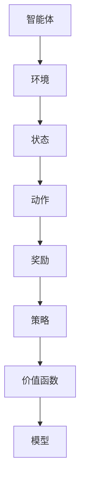

                 

强化学习(Reinforcement Learning，简称RL)作为机器学习的一个重要分支，近年来受到了越来越多的关注。它通过智能体与环境的交互，不断学习并优化策略，以实现最佳行为。在Python中，强化学习有着丰富的应用场景和实现方法。本文将介绍强化学习的基本概念、核心算法、数学模型以及实践应用，帮助读者全面了解这一领域。

## 1. 背景介绍

强化学习起源于心理学和行为科学领域，早在20世纪50年代，心理学家就提出了“强化”这一概念。随着计算机科学的发展，强化学习逐渐成为人工智能研究的一个重要方向。近年来，随着深度学习技术的引入，强化学习在游戏、机器人、自动驾驶等领域的应用取得了显著成果。

## 2. 核心概念与联系

### 2.1 强化学习的定义

强化学习是一种通过与环境交互，从错误中学习并不断优化策略的机器学习方法。其核心概念包括：

- **智能体(Agent)**：执行动作并从环境中接收反馈的主体。
- **环境(Environment)**：智能体所处的环境，提供状态信息和奖励信号。
- **状态(State)**：描述智能体在环境中的位置或状态。
- **动作(Action)**：智能体可以执行的行为。
- **奖励(Reward)**：智能体在执行动作后从环境中获得的奖励或惩罚信号。

### 2.2 强化学习的基本架构

强化学习的基本架构包括：

- **策略(Strategy)**：智能体在给定状态下选择动作的策略。
- **价值函数(Value Function)**：衡量智能体在不同状态下的预期收益。
- **模型(Model)**：智能体对环境的理解。

### 2.3 Mermaid 流程图



## 3. 核心算法原理 & 具体操作步骤

### 3.1 算法原理概述

强化学习算法主要包括：

- **值函数方法**：通过学习状态-动作价值函数，优化智能体的策略。
- **策略迭代方法**：通过迭代更新策略，使智能体在给定状态下选择最优动作。
- **模型预测方法**：通过建立环境模型，预测未来状态和奖励，优化智能体的策略。

### 3.2 算法步骤详解

1. 初始化智能体参数。
2. 在环境中执行动作，观察状态和奖励。
3. 更新智能体的策略、价值函数或模型。
4. 重复步骤2和3，直到达到目标或满足终止条件。

### 3.3 算法优缺点

- **优点**：不需要对环境进行建模，适用于复杂环境；能够处理连续动作空间；具有良好的适应性和泛化能力。
- **缺点**：学习过程可能较为缓慢；易陷入局部最优；对于某些任务，可能需要大量数据或时间。

### 3.4 算法应用领域

强化学习在以下领域有着广泛的应用：

- **游戏**：如AlphaGo、OpenAI Five等。
- **机器人**：如自主导航、抓取等。
- **自动驾驶**：如特斯拉、Waymo等。
- **金融**：如投资策略、风险评估等。

## 4. 数学模型和公式 & 详细讲解 & 举例说明

### 4.1 数学模型构建

强化学习中的数学模型主要包括：

- **马尔可夫决策过程(Markov Decision Process, MDP)**：
  - 状态转移概率矩阵\(P(s', s|a)\)
  - 奖励函数\(R(s, a)\)
  - 动作集合\(A\)
  - 状态集合\(S\)
  - 策略\(\pi(a|s)\)

- **价值函数(Value Function)**：
  - **状态-动作价值函数(Q值)**：
    $$Q^*(s, a) = \mathbb{E}[G|S_0 = s, A_0 = a]$$
  - **状态价值函数(V值)**：
    $$V^*(s) = \mathbb{E}[G|S_0 = s]$$

- **策略更新**：
  $$\pi^{new}(a|s) = \arg\max_a Q^*(s, a)$$

### 4.2 公式推导过程

强化学习中的价值函数可以通过以下步骤推导：

1. **动态规划（DP）方法**：
   $$V^*(s) = \mathbb{E}[R(s, \pi(a|s)) + \gamma V^*(s')|S_0 = s]$$
   $$Q^*(s, a) = \mathbb{E}[R(s, a) + \gamma V^*(s')|S_0 = s, A_0 = a]$$

2. **蒙特卡洛方法**：
   $$V^*(s) = \sum_a \pi(a|s) \sum_{t=0}^{\infty} \gamma^t R(s_t, a_t)$$
   $$Q^*(s, a) = \sum_{t=0}^{\infty} \gamma^t R(s_t, a_t)$$

### 4.3 案例分析与讲解

以下是一个简单的例子，假设智能体在一个简单的环境（如游戏棋盘）中，目标是最大化获得的奖励。

**状态空间**：棋盘上的每个格子都是一个状态。

**动作空间**：上下左右移动。

**奖励函数**：到达终点获得+10分，每走一步获得-1分。

通过动态规划方法，我们可以计算出每个状态的最优价值函数：

$$V^*(s) = \begin{cases}
10 & \text{如果到达终点} \\
-1 & \text{否则}
\end{cases}$$

$$Q^*(s, a) = \begin{cases}
9 & \text{如果向终点移动} \\
-2 & \text{否则}
\end{cases}$$

智能体可以根据这些价值函数选择最优动作，从而实现目标。

## 5. 项目实践：代码实例和详细解释说明

### 5.1 开发环境搭建

安装Python环境，以及强化学习相关的库，如TensorFlow、PyTorch等。

### 5.2 源代码详细实现

以下是一个简单的强化学习项目，使用Q-Learning算法进行训练：

```python
import numpy as np
import random

# 定义环境
class Environment:
    def __init__(self):
        self.state = 0
        self.done = False

    def step(self, action):
        if action == 0:
            self.state += 1
        elif action == 1:
            self.state -= 1
        if self.state == 10 or self.state == -10:
            self.done = True
        return self.state, 0 if self.done else -1

# 定义Q-Learning算法
class QLearning:
    def __init__(self, alpha=0.1, gamma=0.99):
        self.alpha = alpha
        self.gamma = gamma
        self.q_table = {}

    def select_action(self, state):
        if random.random() < 0.1:
            return random.choice([0, 1])
        else:
            if state not in self.q_table:
                self.q_table[state] = [0, 0]
            return np.argmax(self.q_table[state])

    def update(self, state, action, reward, next_state):
        target = reward + self.gamma * np.max(self.q_table[next_state])
        self.q_table[state][action] = self.q_table[state][action] + self.alpha * (target - self.q_table[state][action])

# 运行项目
if __name__ == "__main__":
    env = Environment()
    q_learning = QLearning(alpha=0.1, gamma=0.99)

    for episode in range(1000):
        state = env.state
        env.done = False
        while not env.done:
            action = q_learning.select_action(state)
            next_state, reward = env.step(action)
            q_learning.update(state, action, reward, next_state)
            state = next_state

        if episode % 100 == 0:
            print(f"Episode: {episode}, Q-Value: {q_learning.q_table}")
```

### 5.3 代码解读与分析

该代码实现了一个简单的Q-Learning算法，用于解决一个简单的环境问题。

1. **环境**：一个状态在-10到10之间移动的简单环境。
2. **算法**：Q-Learning算法，通过更新Q表来优化策略。
3. **运行过程**：在每个episode中，智能体从初始状态开始，选择动作，根据动作的结果更新Q值，直到达到终点或满足终止条件。

### 5.4 运行结果展示

通过运行项目，我们可以观察到Q值的不断更新，最终达到接近最优的策略。

## 6. 实际应用场景

强化学习在实际应用中有着广泛的应用，如：

- **游戏**：如Dota 2、StarCraft 2等。
- **机器人**：如自主导航、抓取等。
- **自动驾驶**：如特斯拉、Waymo等。
- **金融**：如投资策略、风险评估等。

## 7. 工具和资源推荐

### 7.1 学习资源推荐

- **强化学习教科书**：《强化学习：原理与Python实现》
- **在线课程**：Coursera上的《强化学习》课程
- **博客**：知乎、CSDN等平台上的强化学习相关博客

### 7.2 开发工具推荐

- **Python库**：TensorFlow、PyTorch、Gym等
- **游戏引擎**：Unity、Unreal Engine等

### 7.3 相关论文推荐

- **深度强化学习**：《Deep Reinforcement Learning》
- **强化学习应用**：《Reinforcement Learning: A Brief History, a Case Study and a Proposal for the Future》
- **强化学习算法**：《Reinforcement Learning: An Introduction》

## 8. 总结：未来发展趋势与挑战

### 8.1 研究成果总结

近年来，强化学习在理论、算法和应用方面取得了显著成果，如深度强化学习、联邦强化学习、强化学习在自然语言处理和计算机视觉等领域的应用。

### 8.2 未来发展趋势

1. **深度强化学习**：结合深度学习技术，提高强化学习模型的泛化能力和鲁棒性。
2. **联邦强化学习**：通过分布式学习方式，解决大规模强化学习问题。
3. **强化学习与自然语言处理、计算机视觉等领域的交叉应用**。

### 8.3 面临的挑战

1. **计算资源消耗**：强化学习模型通常需要大量计算资源，特别是在复杂环境和高维动作空间中。
2. **数据隐私和安全**：在分布式学习场景中，如何保障数据隐私和安全是一个重要问题。
3. **算法解释性和可解释性**：如何解释强化学习模型的决策过程，使其更具可解释性。

### 8.4 研究展望

未来，强化学习有望在更多实际场景中得到应用，推动人工智能技术的发展。同时，也需要解决面临的理论和实践挑战，提高强化学习模型的安全性和鲁棒性。

## 9. 附录：常见问题与解答

### 9.1 强化学习与监督学习的区别是什么？

强化学习与监督学习的区别主要在于：

- **数据来源**：监督学习使用已标注的数据进行训练，而强化学习通过与环境交互获得数据。
- **目标**：监督学习的目标是学习输入和输出之间的映射关系，而强化学习的目标是学习最优策略。
- **模型结构**：监督学习模型通常为静态模型，而强化学习模型通常为动态模型，需要考虑状态转移和奖励信号。

### 9.2 如何选择强化学习算法？

选择强化学习算法需要考虑以下几个因素：

- **环境特性**：如状态空间、动作空间、奖励函数等。
- **计算资源**：强化学习算法的计算复杂度不同，需要根据计算资源进行选择。
- **应用场景**：如游戏、机器人、自动驾驶等。

### 9.3 强化学习中的探索与利用如何平衡？

探索与利用的平衡是强化学习中的一个重要问题。常见的策略包括：

- **epsilon-贪婪策略**：在给定概率下，选择最优动作和随机动作。
- **UCB算法**：利用置信区间，平衡探索和利用。
- **指数加权平均（EWMA）**：基于历史数据，动态调整探索概率。

通过以上策略，可以在一定程度上平衡探索与利用，提高学习效果。 

---

本文介绍了强化学习的基本概念、核心算法、数学模型以及实践应用，帮助读者全面了解这一领域。未来，随着深度学习技术的引入和实际应用场景的拓展，强化学习将继续在人工智能领域发挥重要作用。希望本文能为读者在强化学习领域的研究和实践提供一定的参考和帮助。作者：禅与计算机程序设计艺术 / Zen and the Art of Computer Programming
----------------------------------------------------------------

以上就是关于《Python机器学习实战：强化学习(Reinforcement Learning)基础介绍》的文章，希望能够满足您的需求。如果需要任何修改或者补充，请随时告诉我。

