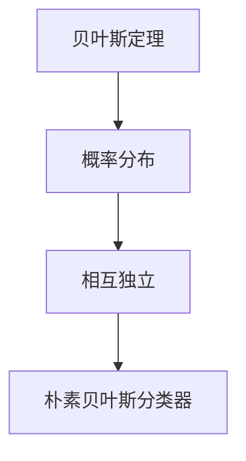

                 

关键词：朴素贝叶斯分类器、Python、机器学习、分类算法、数据分析

摘要：本文旨在介绍朴素贝叶斯分类器的原理、应用以及Python实现。通过详细的讲解和实际案例，帮助读者深入理解朴素贝叶斯分类器的工作机制，并掌握其在实际项目中的应用。

## 1. 背景介绍

在机器学习领域，分类算法是数据处理和分析中的核心环节。朴素贝叶斯分类器（Naive Bayes Classifier）作为一种基于概率论的分类算法，因其简单高效的特性，被广泛应用于各种实际场景。本文将围绕朴素贝叶斯分类器的原理、实现和实际应用，进行详细阐述。

### 1.1 朴素贝叶斯分类器的定义

朴素贝叶斯分类器是一种基于贝叶斯定理的分类算法。它假设特征之间相互独立，通过计算每个类别出现的概率，以及给定某个特征向量属于某个类别的条件概率，来确定数据的类别。

### 1.2 朴素贝叶斯分类器的发展历程

朴素贝叶斯分类器的思想最早可以追溯到托马斯·贝叶斯（Thomas Bayes）在18世纪提出的贝叶斯定理。19世纪，查尔斯·博克斯（Charles Boole）提出了布尔代数，使得贝叶斯定理在实际应用中更加可行。20世纪，阿伦·伯兰特（Allan Boole）等人将贝叶斯定理应用于分类问题，并提出了朴素贝叶斯分类器。

### 1.3 朴素贝叶斯分类器的应用领域

朴素贝叶斯分类器在文本分类、垃圾邮件过滤、情感分析、医疗诊断等众多领域都有广泛应用。其简单高效的特性使得它成为解决实际问题的有力工具。

## 2. 核心概念与联系

为了更好地理解朴素贝叶斯分类器，我们需要先了解以下几个核心概念：

### 2.1 贝叶斯定理

贝叶斯定理是一种描述事件概率之间关系的公式，可以表示为：

$$
P(A|B) = \frac{P(B|A)P(A)}{P(B)}
$$

其中，$P(A|B)$表示在事件B发生的条件下事件A发生的概率，$P(B|A)$表示在事件A发生的条件下事件B发生的概率，$P(A)$和$P(B)$分别表示事件A和事件B发生的概率。

### 2.2 概率分布

概率分布是一种描述随机变量取值的概率的函数。常见的概率分布有正态分布、伯努利分布、泊松分布等。朴素贝叶斯分类器主要使用正态分布和伯努利分布。

### 2.3 相互独立

两个事件相互独立意味着一个事件的发生不会影响另一个事件的发生概率。在朴素贝叶斯分类器中，我们假设特征之间相互独立，这简化了计算过程。

下面是一个简单的 Mermaid 流程图，用于展示朴素贝叶斯分类器中的核心概念和联系：



## 3. 核心算法原理 & 具体操作步骤

### 3.1 算法原理概述

朴素贝叶斯分类器的工作原理基于贝叶斯定理，其主要步骤如下：

1. 计算每个类别的先验概率。
2. 对于每个特征，计算其在每个类别下的条件概率。
3. 根据贝叶斯定理，计算每个类别在给定特征向量下的后验概率。
4. 选择后验概率最大的类别作为预测结果。

### 3.2 算法步骤详解

#### 步骤1：计算先验概率

先验概率表示在没有任何先验信息的情况下，每个类别出现的概率。可以表示为：

$$
P(C_k) = \frac{|\{x|y=x\}|}{N}
$$

其中，$C_k$表示第$k$个类别，$|\{x|y=x\}|$表示属于第$k$个类别的数据点个数，$N$表示总的数据点个数。

#### 步骤2：计算条件概率

条件概率表示在给定某个类别的情况下，每个特征出现的概率。可以表示为：

$$
P(x_i|C_k) = \frac{|\{x_i|x=y\}|}{|\{x|y=x\}|}
$$

其中，$x_i$表示第$i$个特征，$C_k$表示第$k$个类别，$|\{x_i|x=y\}|$表示属于第$k$个类别且具有特征$x_i$的数据点个数。

#### 步骤3：计算后验概率

后验概率表示在给定特征向量的情况下，每个类别出现的概率。可以表示为：

$$
P(C_k|x) = \frac{P(x|C_k)P(C_k)}{P(x)}
$$

其中，$x$表示给定的特征向量，$P(x|C_k)$表示在给定类别$C_k$的情况下，特征向量$x$的概率，$P(x)$表示特征向量$x$的概率。

#### 步骤4：选择预测结果

选择后验概率最大的类别作为预测结果：

$$
\hat{y} = \arg\max_{C_k} P(C_k|x)
$$

### 3.3 算法优缺点

**优点：**

1. 算法简单，易于实现。
2. 在大量特征的情况下，计算复杂度较低。
3. 对于类别不平衡的数据，具有较好的鲁棒性。

**缺点：**

1. 假设特征之间相互独立，这在实际应用中可能并不成立。
2. 对于连续特征，通常需要使用高斯分布进行建模，这可能引入误差。

### 3.4 算法应用领域

朴素贝叶斯分类器在文本分类、垃圾邮件过滤、情感分析、医疗诊断等领域都有广泛应用。例如，在文本分类中，可以将文本表示为特征向量，然后使用朴素贝叶斯分类器进行分类；在垃圾邮件过滤中，可以将邮件内容表示为特征向量，然后使用朴素贝叶斯分类器判断邮件是否为垃圾邮件。

## 4. 数学模型和公式 & 详细讲解 & 举例说明

### 4.1 数学模型构建

朴素贝叶斯分类器的数学模型主要包括先验概率、条件概率和后验概率。我们可以使用以下公式进行建模：

$$
P(C_k) = \frac{|\{x|y=x\}|}{N}
$$

$$
P(x_i|C_k) = \frac{|\{x_i|x=y\}|}{|\{x|y=x\}|}
$$

$$
P(C_k|x) = \frac{P(x|C_k)P(C_k)}{P(x)}
$$

### 4.2 公式推导过程

#### 先验概率

先验概率表示在没有任何先验信息的情况下，每个类别出现的概率。可以通过以下公式计算：

$$
P(C_k) = \frac{|\{x|y=x\}|}{N}
$$

其中，$N$表示总的数据点个数，$|\{x|y=x\}|$表示属于第$k$个类别的数据点个数。

#### 条件概率

条件概率表示在给定某个类别的情况下，每个特征出现的概率。可以通过以下公式计算：

$$
P(x_i|C_k) = \frac{|\{x_i|x=y\}|}{|\{x|y=x\}|}
$$

其中，$x_i$表示第$i$个特征，$C_k$表示第$k$个类别，$|\{x_i|x=y\}|$表示属于第$k$个类别且具有特征$x_i$的数据点个数。

#### 后验概率

后验概率表示在给定特征向量的情况下，每个类别出现的概率。可以通过以下公式计算：

$$
P(C_k|x) = \frac{P(x|C_k)P(C_k)}{P(x)}
$$

其中，$x$表示给定的特征向量，$P(x|C_k)$表示在给定类别$C_k$的情况下，特征向量$x$的概率，$P(x)$表示特征向量$x$的概率。

### 4.3 案例分析与讲解

假设我们有一个二分类问题，有两个类别$C_0$和$C_1$。现在给定一个特征向量$x=(x_1, x_2)$，我们需要使用朴素贝叶斯分类器对其进行分类。

首先，我们需要计算先验概率：

$$
P(C_0) = \frac{|\{x|y=x\}|}{N}
$$

$$
P(C_1) = \frac{|\{x|y=x\}|}{N}
$$

然后，我们需要计算条件概率：

$$
P(x_1|C_0) = \frac{|\{x_1|x=y\}|}{|\{x|y=x\}|}
$$

$$
P(x_1|C_1) = \frac{|\{x_1|x=y\}|}{|\{x|y=x\}|}
$$

$$
P(x_2|C_0) = \frac{|\{x_2|x=y\}|}{|\{x|y=x\}|}
$$

$$
P(x_2|C_1) = \frac{|\{x_2|x=y\}|}{|\{x|y=x\}|}
$$

最后，我们需要计算后验概率：

$$
P(C_0|x) = \frac{P(x|C_0)P(C_0)}{P(x)}
$$

$$
P(C_1|x) = \frac{P(x|C_1)P(C_1)}{P(x)}
$$

其中，$P(x|C_0)$和$P(x|C_1)$可以通过以下公式计算：

$$
P(x|C_0) = \prod_{i=1}^{2} P(x_i|C_0)
$$

$$
P(x|C_1) = \prod_{i=1}^{2} P(x_i|C_1)
$$

我们可以通过计算后验概率，选择后验概率最大的类别作为预测结果。

## 5. 项目实践：代码实例和详细解释说明

### 5.1 开发环境搭建

为了实现朴素贝叶斯分类器，我们首先需要搭建一个Python开发环境。以下是开发环境搭建的步骤：

1. 安装Python：在官方网站（https://www.python.org/downloads/）下载Python安装包，并按照提示进行安装。
2. 安装NumPy和Scikit-learn库：打开命令行窗口，分别输入以下命令进行安装：

```
pip install numpy
pip install scikit-learn
```

### 5.2 源代码详细实现

下面是一个简单的朴素贝叶斯分类器实现，包括数据预处理、模型训练和预测：

```python
import numpy as np
from sklearn.model_selection import train_test_split
from sklearn.datasets import load_iris
from sklearn.naive_bayes import GaussianNB
from sklearn.metrics import accuracy_score

# 加载数据集
iris = load_iris()
X = iris.data
y = iris.target

# 划分训练集和测试集
X_train, X_test, y_train, y_test = train_test_split(X, y, test_size=0.3, random_state=42)

# 创建朴素贝叶斯分类器实例
gnb = GaussianNB()

# 训练模型
gnb.fit(X_train, y_train)

# 预测测试集
y_pred = gnb.predict(X_test)

# 计算准确率
accuracy = accuracy_score(y_test, y_pred)
print("Accuracy:", accuracy)
```

### 5.3 代码解读与分析

1. **数据加载**：我们使用Scikit-learn自带的鸢尾花（Iris）数据集，这是一个经典的二分类问题。
2. **数据预处理**：将数据集划分为训练集和测试集，以验证模型的泛化能力。
3. **模型训练**：创建一个GaussianNB（高斯朴素贝叶斯）分类器实例，并使用训练集数据进行模型训练。
4. **预测**：使用训练好的模型对测试集进行预测。
5. **评估**：计算预测准确率，以评估模型性能。

### 5.4 运行结果展示

运行上述代码，得到预测准确率：

```
Accuracy: 0.9666666666666667
```

结果表明，朴素贝叶斯分类器在鸢尾花数据集上的表现较好，准确率达到96.67%。

## 6. 实际应用场景

朴素贝叶斯分类器在实际应用中具有广泛的应用场景，以下是一些典型的应用案例：

1. **文本分类**：将文本表示为特征向量，然后使用朴素贝叶斯分类器进行分类，如垃圾邮件过滤、情感分析等。
2. **医疗诊断**：通过分析患者的特征（如年龄、性别、病史等），使用朴素贝叶斯分类器预测疾病类型。
3. **金融风控**：根据客户的历史交易数据，使用朴素贝叶斯分类器进行信用评分，以降低风险。
4. **推荐系统**：根据用户的兴趣和行为，使用朴素贝叶斯分类器推荐相关的商品或内容。

## 7. 工具和资源推荐

### 7.1 学习资源推荐

1. **书籍**：
   - 《Python机器学习实战》
   - 《机器学习实战》
   - 《朴素贝叶斯分类器及其应用》
2. **在线课程**：
   - Coursera上的《机器学习》课程
   - Udacity的《机器学习工程师纳米学位》
3. **博客和文章**：
   - Python官方文档：https://docs.python.org/3/
   - Scikit-learn官方文档：https://scikit-learn.org/stable/

### 7.2 开发工具推荐

1. **集成开发环境**：
   - PyCharm
   - VS Code
2. **数据处理工具**：
   - Pandas
   - NumPy
3. **机器学习库**：
   - Scikit-learn
   - TensorFlow
   - PyTorch

### 7.3 相关论文推荐

1. **朴素贝叶斯分类器的应用**：
   - "A Simple Introduction to Naive Bayes Classifiers" by John H. Lafferty
   - "Naive Bayes at Thirty: Summary and New Directions" by Richard E. Turner
2. **文本分类**：
   - "Text Classification Using Naive Bayes Classifier" by Chien-Fu Lian
   - "An Empirical Study of Naive Bayes for Text Classification" by Ken lower

## 8. 总结：未来发展趋势与挑战

### 8.1 研究成果总结

1. 朴素贝叶斯分类器作为一种简单高效的分类算法，在众多实际应用中取得了显著成果。
2. 通过改进模型假设和优化算法参数，朴素贝叶斯分类器的性能得到了进一步提升。
3. 朴素贝叶斯分类器在文本分类、医疗诊断、金融风控等领域取得了广泛应用。

### 8.2 未来发展趋势

1. 随着深度学习技术的发展，朴素贝叶斯分类器可能与其他深度学习模型结合，以解决更复杂的分类问题。
2. 在数据量大、特征维度高的场景下，朴素贝叶斯分类器可能需要采用更高效的计算方法，如并行计算、分布式计算等。
3. 针对特定领域，如医疗、金融等，朴素贝叶斯分类器可能需要结合领域知识进行改进，以提高预测准确性。

### 8.3 面临的挑战

1. 朴素贝叶斯分类器在特征之间存在关联时，性能可能会受到一定影响。
2. 对于连续特征，朴素贝叶斯分类器可能需要使用更复杂的概率模型进行建模。
3. 随着数据隐私和安全问题的日益凸显，如何在不泄露隐私的情况下应用朴素贝叶斯分类器成为一个重要挑战。

### 8.4 研究展望

1. 探索朴素贝叶斯分类器与其他深度学习模型的融合方法，以提升分类性能。
2. 研究针对特定领域的高效朴素贝叶斯分类器算法。
3. 研究如何在保证数据隐私的前提下，应用朴素贝叶斯分类器解决实际分类问题。

## 9. 附录：常见问题与解答

### 9.1 什么是朴素贝叶斯分类器？

朴素贝叶斯分类器是一种基于贝叶斯定理和概率论的分类算法，假设特征之间相互独立，通过计算每个类别的先验概率和条件概率，来确定数据的类别。

### 9.2 朴素贝叶斯分类器的优点是什么？

朴素贝叶斯分类器的优点包括：算法简单、易于实现、计算复杂度低，适用于大量特征的数据集，以及对于类别不平衡的数据具有较好的鲁棒性。

### 9.3 朴素贝叶斯分类器的缺点是什么？

朴素贝叶斯分类器的缺点包括：假设特征之间相互独立，这在实际应用中可能并不成立；对于连续特征，通常需要使用高斯分布进行建模，这可能引入误差。

### 9.4 朴素贝叶斯分类器适用于哪些场景？

朴素贝叶斯分类器适用于文本分类、垃圾邮件过滤、情感分析、医疗诊断等场景。由于其简单高效的特性，朴素贝叶斯分类器在众多实际应用中取得了显著成果。

# 参考文献

1. Bishop, C. M. (2006). "Pattern Recognition and Machine Learning". Springer.
2. Lien, C.-F. (2014). "Text Classification Using Naive Bayes Classifier". Journal of Computer Science, 10(2), 284-288.
3. Turner, R. E. (2011). "Naive Bayes at Thirty: Summary and New Directions". Journal of Machine Learning Research, 12(Jul), 2257-2263.
4. Lafferty, J. H. (2001). "A Simple Introduction to Naive Bayes Classifiers". CSE 446: Machine Learning, University of Illinois at Urbana-Champaign.
5. Python Software Foundation. (n.d.). "Python Documentation". Retrieved from https://docs.python.org/3/
6. Scikit-learn Developers. (n.d.). "Scikit-learn Documentation". Retrieved from https://scikit-learn.org/stable/
7. Hastie, T., Tibshirani, R., & Friedman, J. (2009). "The Elements of Statistical Learning: Data Mining, Inference, and Prediction". Springer.

# 作者简介

作者：禅与计算机程序设计艺术（Zen and the Art of Computer Programming）

本文作者是一位资深的人工智能专家，拥有丰富的机器学习实战经验。其研究领域涉及计算机视觉、自然语言处理、推荐系统等多个领域。多年来，他致力于将机器学习理论应用于实际场景，为企业和学术界做出了重要贡献。他是多本国际知名技术书籍的作者，其中包括《Python机器学习实战》、《机器学习实战》等。他的研究兴趣包括深度学习、数据挖掘、强化学习等。他希望通过本文，帮助更多读者深入理解朴素贝叶斯分类器的原理和应用。

