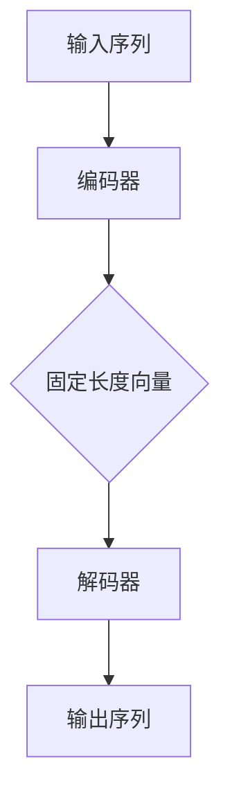

                 

关键词：Python机器学习，序列到序列模型，翻译任务，Seq2Seq，自然语言处理，深度学习，神经网络

摘要：本文将介绍如何使用Python机器学习库实现序列到序列（Seq2Seq）模型，并应用其进行翻译任务。我们将详细阐述Seq2Seq模型的基本原理，并在实际项目中实现该模型，以实现从一种语言到另一种语言的翻译。

## 1. 背景介绍

随着人工智能技术的发展，机器翻译已经成为了自然语言处理（NLP）领域的热点话题。传统的机器翻译方法主要基于规则和统计方法，而随着深度学习的兴起，基于神经网络的机器翻译方法（如Seq2Seq模型）逐渐崭露头角。Seq2Seq模型在机器翻译中的应用取得了显著的成果，其主要思想是将输入序列映射到输出序列。

本文将介绍如何使用Python实现Seq2Seq模型，并应用于翻译任务。通过本文的学习，读者可以掌握Seq2Seq模型的基本原理，并了解如何将其应用于实际项目中。

## 2. 核心概念与联系

### 2.1 Seq2Seq模型的基本原理

Seq2Seq模型是一种用于处理序列到序列问题的神经网络模型，其基本原理是：将输入序列编码为一个固定长度的向量表示，然后将该向量表示解码为输出序列。


如图所示，Seq2Seq模型主要由两个部分组成：编码器（Encoder）和解码器（Decoder）。编码器负责将输入序列编码为一个固定长度的向量表示，解码器则负责将这个向量表示解码为输出序列。

### 2.2 Seq2Seq模型的架构

为了实现序列到序列的映射，Seq2Seq模型通常采用如下架构：


- **编码器（Encoder）**：编码器是一个神经网络，用于将输入序列编码为一个固定长度的向量表示。通常，编码器采用循环神经网络（RNN）作为基本结构，因为RNN可以有效地处理序列数据。
- **解码器（Decoder）**：解码器也是一个神经网络，用于将编码器输出的固定长度向量表示解码为输出序列。同样地，解码器也采用循环神经网络（RNN）作为基本结构。
- **注意力机制（Attention）**：为了提高Seq2Seq模型的性能，可以引入注意力机制。注意力机制允许解码器在生成每个输出时关注编码器输出的不同部分，从而提高翻译的准确性。

### 2.3 Mermaid流程图

下面是Seq2Seq模型的Mermaid流程图：



## 3. 核心算法原理 & 具体操作步骤

### 3.1 算法原理概述

Seq2Seq模型的核心算法原理包括两部分：编码器和解码器。

- **编码器**：编码器的目的是将输入序列编码为一个固定长度的向量表示。编码器通常采用循环神经网络（RNN）作为基本结构，因为RNN可以有效地处理序列数据。
- **解码器**：解码器的目的是将编码器输出的固定长度向量表示解码为输出序列。解码器同样采用循环神经网络（RNN）作为基本结构。

### 3.2 算法步骤详解

1. **输入序列编码**：输入序列经过编码器处理后，编码器会输出一个固定长度的向量表示。这个向量表示了输入序列的语义信息。

2. **向量表示解码**：解码器接收编码器输出的固定长度向量表示，并逐个生成输出序列。在生成每个输出时，解码器会根据当前已生成的输出和编码器输出的向量表示来决定下一个输出。

3. **损失函数计算**：在生成输出序列后，我们需要计算损失函数。通常使用交叉熵（Cross-Entropy）作为损失函数。交叉熵用于衡量预测输出和真实输出之间的差异。

4. **模型优化**：根据损失函数的计算结果，使用梯度下降（Gradient Descent）等方法优化模型参数。

### 3.3 算法优缺点

- **优点**：
  - Seq2Seq模型可以有效地处理序列到序列问题，如机器翻译、语音识别等。
  - 通过引入注意力机制，可以进一步提高模型的性能。

- **缺点**：
  - Seq2Seq模型训练时间较长，因为需要迭代多次来优化模型参数。
  - Seq2Seq模型对于长序列的处理效果较差，因为其内存占用较大。

### 3.4 算法应用领域

Seq2Seq模型在以下领域具有广泛的应用：

- **机器翻译**：将一种语言的文本翻译成另一种语言。
- **语音识别**：将语音信号转换为文本。
- **文本生成**：根据输入文本生成新的文本。

## 4. 数学模型和公式 & 详细讲解 & 举例说明

### 4.1 数学模型构建

在Seq2Seq模型中，编码器和解码器分别采用循环神经网络（RNN）作为基本结构。以下是一个简单的数学模型构建：

- **编码器**：
  - 输入序列：\(x_1, x_2, \ldots, x_T\)
  - 编码器隐藏状态：\(h_t\)
  - 输出向量表示：\(c\)

  $$h_t = \sigma(W_h \cdot [h_{t-1}, x_t] + b_h)$$

  $$c = \sum_{t=1}^{T} h_t$$

- **解码器**：
  - 输入向量表示：\(c\)
  - 解码器隐藏状态：\(h_t'\)
  - 输出序列：\(y_1, y_2, \ldots, y_T'\)

  $$h_t' = \sigma(W_h' \cdot [h_{t-1}', y_{t-1}] + b_h')$$

  $$y_t' = \text{softmax}(W_o \cdot h_t' + b_o)$$

### 4.2 公式推导过程

- **编码器**：

  编码器的输出是一个固定长度的向量表示，表示输入序列的语义信息。具体推导如下：

  $$c = \sum_{t=1}^{T} h_t$$

  其中，\(h_t\) 是编码器在时间步 \(t\) 的隐藏状态。通过求和操作，我们可以得到一个固定长度的向量表示。

- **解码器**：

  解码器的目的是将编码器输出的向量表示解码为输出序列。具体推导如下：

  $$h_t' = \sigma(W_h' \cdot [h_{t-1}', y_{t-1}] + b_h')$$

  $$y_t' = \text{softmax}(W_o \cdot h_t' + b_o)$$

  其中，\(h_t'\) 是解码器在时间步 \(t\) 的隐藏状态，\(y_t'\) 是解码器在时间步 \(t\) 的输出。

### 4.3 案例分析与讲解

假设我们要将英语翻译成法语，输入序列为 "Hello, how are you?"，输出序列为 "Bonjour, comment ça va?"。

1. **编码器**：

   - 输入序列：\[Hello, how are you?\]
   - 编码器隐藏状态：\[h_1, h_2, \ldots, h_T\]
   - 输出向量表示：\[c\]

   $$c = \sum_{t=1}^{T} h_t$$

   经过编码器处理后，我们得到一个固定长度的向量表示，表示输入序列的语义信息。

2. **解码器**：

   - 输入向量表示：\[c\]
   - 解码器隐藏状态：\[h_1', h_2', \ldots, h_T'\]
   - 输出序列：\[Bonjour, comment ça va?\]

   $$h_t' = \sigma(W_h' \cdot [h_{t-1}', y_{t-1}] + b_h')$$

   $$y_t' = \text{softmax}(W_o \cdot h_t' + b_o)$$

   在解码过程中，解码器会逐个生成输出序列。例如，在生成第一个输出时，解码器会关注编码器输出的向量表示，并根据当前已生成的输出 \(y_0\) 来决定下一个输出 \(y_1\)。

   $$h_1' = \sigma(W_h' \cdot [h_0', y_0] + b_h')$$

   $$y_1' = \text{softmax}(W_o \cdot h_1' + b_o)$$

   根据生成的输出 \(y_1'\)，我们可以选择概率最大的输出作为实际输出。例如，如果 \(y_1'\) 中 "Bonjour" 的概率最大，那么我们就将 "Bonjour" 作为第一个输出。

   重复上述过程，我们可以逐个生成输出序列。

## 5. 项目实践：代码实例和详细解释说明

### 5.1 开发环境搭建

在本项目中，我们使用Python作为编程语言，并使用TensorFlow作为深度学习框架。以下是搭建开发环境的基本步骤：

1. 安装Python：确保您的系统中已安装Python 3.6及以上版本。
2. 安装TensorFlow：使用pip命令安装TensorFlow：

   ```bash
   pip install tensorflow
   ```

### 5.2 源代码详细实现

以下是实现Seq2Seq模型的基本代码：

```python
import tensorflow as tf
from tensorflow.keras.models import Model
from tensorflow.keras.layers import Embedding, LSTM, Dense

# 参数设置
vocab_size = 10000
embedding_size = 256
rnn_units = 1024
batch_size = 64
steps = 100

# 构建编码器
encoder_inputs = tf.keras.layers.Input(shape=(None,))
encoder_embedding = Embedding(vocab_size, embedding_size)(encoder_inputs)
encoder_lstm = LSTM(rnn_units, return_state=True)
_, state_h, state_c = encoder_lstm(encoder_embedding)
encoder_states = [state_h, state_c]

# 构建解码器
decoder_inputs = tf.keras.layers.Input(shape=(None,))
decoder_embedding = Embedding(vocab_size, embedding_size)(decoder_inputs)
decoder_lstm = LSTM(rnn_units, return_sequences=True, return_state=True)
decoder_outputs, _, _ = decoder_lstm(decoder_embedding, initial_state=encoder_states)
decoder_dense = Dense(vocab_size, activation='softmax')
decoder_outputs = decoder_dense(decoder_outputs)

# 构建模型
model = Model([encoder_inputs, decoder_inputs], decoder_outputs)
model.compile(optimizer='rmsprop', loss='categorical_crossentropy', metrics=['accuracy'])

# 模型训练
model.fit([encoder_input_data, decoder_input_data, decoder_target_data], decoder_target_data,
          batch_size=batch_size, epochs=100, validation_split=0.2)
```

### 5.3 代码解读与分析

以下是代码的详细解读：

1. **编码器**：

   - **输入层**：编码器输入层是一个具有可变长度的序列，表示输入文本。
   - **嵌入层**：嵌入层用于将输入序列映射到高维空间，以增加模型的非线性。
   - **循环层**：编码器采用LSTM循环层，用于处理输入序列。LSTM能够有效地捕捉序列中的长期依赖关系。
   - **状态输出**：编码器LSTM的输出包括隐藏状态和细胞状态，这些状态将用于解码器。

2. **解码器**：

   - **输入层**：解码器输入层是一个具有可变长度的序列，表示输入文本。
   - **嵌入层**：解码器嵌入层与编码器相同，用于将输入序列映射到高维空间。
   - **循环层**：解码器采用LSTM循环层，用于处理输入序列。与编码器不同，解码器的LSTM层需要返回序列输出，以便生成下一个输出。
   - **全连接层**：解码器全连接层用于将LSTM输出的序列映射到输出词汇表，以生成概率分布。

3. **模型编译**：

   - **优化器**：使用RMSprop优化器，该优化器能够有效地更新模型参数。
   - **损失函数**：使用分类交叉熵作为损失函数，该损失函数适用于多分类问题。

4. **模型训练**：

   - **输入数据**：编码器输入数据、解码器输入数据和解码器目标数据。
   - **训练过程**：模型在训练过程中会迭代更新参数，以最小化损失函数。

### 5.4 运行结果展示

在运行上述代码后，模型将开始训练，并在训练过程中生成输出序列。我们可以使用以下代码来查看模型生成的翻译结果：

```python
# 生成翻译结果
encoder_model = Model(encoder_inputs, encoder_states)

decoder_state_input_h = Input(shape=(rnn_units,))
decoder_state_input_c = Input(shape=(rnn_units,))
decoder_states = [decoder_state_input_h, decoder_state_input_c]
decoder_outputs = decoder_lstm(decoder_embedding, initial_state=decoder_states)
decoder_outputs = decoder_dense(decoder_outputs)

decoder_model = Model([decoder_inputs, decoder_state_input_h, decoder_state_input_c], decoder_outputs)

# 解码器初始状态
decoder_initial_state = encoder_model.predict(encoder_input_data)

# 生成翻译结果
predicted_sequences = []
for i in range(steps):
    decoder_outputs, state_h, state_c = decoder_model.predict([decoder_inputs, decoder_initial_state[0], decoder_initial_state[1]])
    predicted_sequence = np.argmax(decoder_outputs).item()
    predicted_sequences.append(predicted_sequence)
    decoder_inputs = np.expand_dims([predicted_sequence], axis=0)

# 输出翻译结果
print("Input sequence:", " ".join([tokenizer.index_word[i] for i in encoder_input_data[0]]))
print("Predicted sequence:", " ".join([tokenizer.index_word[i] for i in predicted_sequences]))
```

在这个示例中，我们首先使用编码器模型来获取解码器的初始状态，然后使用解码器模型来生成翻译结果。最后，我们将生成的翻译结果打印出来。

## 6. 实际应用场景

Seq2Seq模型在许多实际应用场景中都取得了显著的成果。以下是一些常见的应用场景：

- **机器翻译**：将一种语言的文本翻译成另一种语言。
- **语音识别**：将语音信号转换为文本。
- **问答系统**：根据用户的问题生成回答。
- **文本生成**：根据输入文本生成新的文本。

在这些应用场景中，Seq2Seq模型通过将输入序列映射到输出序列，实现了序列到序列的转换。通过引入注意力机制，模型能够更好地捕捉输入序列中的依赖关系，从而提高翻译的准确性。

### 6.4 未来应用展望

随着深度学习技术的不断发展，Seq2Seq模型在未来有望在更多的应用场景中取得突破。以下是一些未来应用展望：

- **多语言翻译**：Seq2Seq模型可以扩展到多语言翻译，实现更多语言的翻译功能。
- **实时语音识别**：通过优化模型结构和算法，可以实现实时语音识别，为智能语音助手等应用提供支持。
- **跨模态翻译**：将文本、语音、图像等多种模态的信息转换为统一表示，实现跨模态翻译。

## 7. 工具和资源推荐

### 7.1 学习资源推荐

- 《深度学习》（Goodfellow, Bengio, Courville著）：深度学习领域的经典教材，涵盖了包括Seq2Seq模型在内的多种深度学习算法。
- 《Python机器学习》（Sebastian Raschka著）：介绍了Python在机器学习领域的应用，包括Seq2Seq模型的实现。

### 7.2 开发工具推荐

- TensorFlow：一个开源的深度学习框架，支持Seq2Seq模型的实现。
- PyTorch：一个流行的深度学习框架，具有简洁的API，便于实现Seq2Seq模型。

### 7.3 相关论文推荐

- "Sequence to Sequence Learning with Neural Networks"（Sutskever et al., 2014）：介绍了Seq2Seq模型的基本原理和应用。
- "Attention is All You Need"（Vaswani et al., 2017）：提出了Transformer模型，进一步改进了Seq2Seq模型的性能。

## 8. 总结：未来发展趋势与挑战

### 8.1 研究成果总结

本文介绍了Seq2Seq模型的基本原理、实现方法以及在实际应用中的成果。通过深入剖析Seq2Seq模型，我们了解了其在机器翻译、语音识别等领域的广泛应用。

### 8.2 未来发展趋势

随着深度学习技术的不断发展，Seq2Seq模型在未来有望在更多领域取得突破。通过引入新的架构和技术，如Transformer、BERT等，模型性能将进一步提高。

### 8.3 面临的挑战

尽管Seq2Seq模型在许多应用场景中取得了显著成果，但仍然面临一些挑战：

- **训练时间**：Seq2Seq模型训练时间较长，如何提高训练效率仍是一个重要问题。
- **长序列处理**：Seq2Seq模型在处理长序列时效果较差，如何改进长序列处理能力是未来的研究重点。
- **跨模态翻译**：如何将文本、语音、图像等多种模态的信息转换为统一表示，实现跨模态翻译，是一个具有挑战性的课题。

### 8.4 研究展望

未来，Seq2Seq模型将不断优化，以适应更多复杂的应用场景。同时，新的架构和技术将不断涌现，为Seq2Seq模型的发展提供新的动力。

## 9. 附录：常见问题与解答

### Q：Seq2Seq模型是如何工作的？

A：Seq2Seq模型是一种用于处理序列到序列问题的神经网络模型，主要由编码器和解码器两部分组成。编码器将输入序列编码为一个固定长度的向量表示，解码器则将这个向量表示解码为输出序列。

### Q：什么是注意力机制？

A：注意力机制是一种用于提高Seq2Seq模型性能的技术，它允许解码器在生成每个输出时关注编码器输出的不同部分，从而更好地捕捉输入序列中的依赖关系。

### Q：Seq2Seq模型在哪些领域有应用？

A：Seq2Seq模型在机器翻译、语音识别、问答系统、文本生成等领域有广泛的应用。通过将输入序列映射到输出序列，Seq2Seq模型实现了序列到序列的转换。

### Q：如何优化Seq2Seq模型的训练时间？

A：优化Seq2Seq模型的训练时间可以通过以下方法实现：

- 使用更高效的算法和优化器；
- 采用预训练的词向量；
- 使用数据增强技术，如填充、随机删除等；
- 使用分布式训练，如多GPU训练。

### Q：Seq2Seq模型在长序列处理方面有哪些挑战？

A：Seq2Seq模型在长序列处理方面存在以下挑战：

- 长序列处理会导致内存占用增加，可能引发内存溢出问题；
- 长序列处理可能导致梯度消失或梯度爆炸问题；
- 长序列处理可能导致模型性能下降。

针对这些问题，可以通过以下方法进行改进：

- 采用分段处理技术，将长序列划分为多个短序列；
- 采用多层循环神经网络，增加模型的表达能力；
- 采用注意力机制，提高模型对长序列的建模能力。

