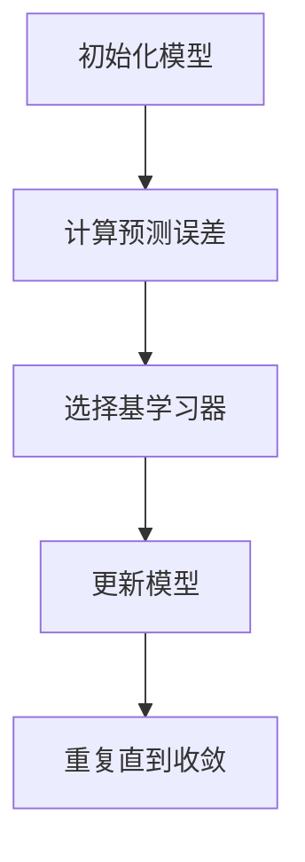

                 

关键词：机器学习，梯度提升树，Python实战，算法原理，数学模型，项目实践，应用场景，工具资源，未来展望。

> 摘要：本文将深入探讨梯度提升树（Gradient Boosting Tree）算法在机器学习中的原理与应用，通过Python实战案例，帮助读者全面掌握该算法的核心概念和实际操作技巧，并展望其未来发展趋势。

## 1. 背景介绍

### 1.1 机器学习的发展背景

机器学习作为人工智能的一个重要分支，近年来在科技、医疗、金融等多个领域取得了显著成果。随着大数据的迅猛发展和计算能力的提升，机器学习已经成为推动科技进步的关键力量。在这个过程中，算法的创新和优化成为提升机器学习性能的关键因素之一。

### 1.2 梯度提升树算法的发展

梯度提升树（Gradient Boosting Tree，GBT）算法是机器学习中的一种集成学习方法，最早由Freund和Schapire提出，随后由Breiman等学者进一步发展和完善。GBT算法以其强大的建模能力和优秀的性能，成为机器学习领域的热点算法之一，广泛应用于分类和回归问题。

## 2. 核心概念与联系

### 2.1 机器学习中的基本概念

在深入理解GBT算法之前，我们需要了解一些机器学习中的基本概念，包括模型、损失函数、梯度等。

### 2.2 梯度提升树算法的架构

为了更好地理解GBT算法，我们使用Mermaid流程图展示其核心架构。



### 2.3 梯度提升树算法与其他算法的联系

GBT算法与决策树、随机森林等集成学习方法有密切联系，但其在算法原理和性能上有着独特的优势。

## 3. 核心算法原理 & 具体操作步骤

### 3.1 算法原理概述

GBT算法是一种基于梯度的优化方法，通过迭代地构建多个弱学习器，并逐渐调整其权重，以优化整体模型的性能。每个弱学习器通常是一个简单决策树，其目的是纠正前一个弱学习器的预测误差。

### 3.2 算法步骤详解

下面是GBT算法的具体操作步骤：

1. 初始化模型权重。
2. 计算预测误差。
3. 选择基学习器。
4. 更新模型权重。
5. 重复步骤2-4，直到满足收敛条件。

### 3.3 算法优缺点

#### 优点：

1. 强大的建模能力，可以处理非线性问题。
2. 易于实现和扩展，支持多种基学习器。
3. 优秀的性能，在许多基准测试中表现优异。

#### 缺点：

1. 模型复杂度较高，训练时间较长。
2. 对异常值敏感，可能导致过拟合。

### 3.4 算法应用领域

GBT算法广泛应用于分类和回归问题，如信用评分、客户流失预测、股票价格预测等。

## 4. 数学模型和公式 & 详细讲解 & 举例说明

### 4.1 数学模型构建

GBT算法的核心是损失函数和梯度计算。下面是损失函数和梯度的数学公式。

#### 损失函数：

$$ L(y, f(x)) = -\sum_{i=1}^n [y_i \log(f_i(x)) + (1 - y_i) \log(1 - f_i(x))] $$

其中，$y_i$是实际标签，$f_i(x)$是预测结果。

#### 梯度计算：

$$ \nabla L(f) = \frac{\partial L}{\partial f} = \sum_{i=1}^n [y_i - f_i(x)] $$

### 4.2 公式推导过程

这里简要介绍损失函数和梯度的推导过程。

#### 损失函数推导：

$$ \begin{aligned} L(y, f(x)) &= -\sum_{i=1}^n [y_i \log(f_i(x)) + (1 - y_i) \log(1 - f_i(x))] \\ &= -\sum_{i=1}^n y_i \log(f_i(x)) - \sum_{i=1}^n (1 - y_i) \log(1 - f_i(x)) \\ &= -\sum_{i=1}^n y_i \log(f_i(x)) + \sum_{i=1}^n y_i \log(1 - f_i(x)) \\ &= -\sum_{i=1}^n y_i \log(f_i(x)) - \sum_{i=1}^n (1 - y_i) \log(f_i(x)) + \sum_{i=1}^n (1 - y_i) \log(1 - f_i(x)) \\ &= -\sum_{i=1}^n [y_i \log(f_i(x)) + (1 - y_i) \log(1 - f_i(x))] \end{aligned} $$

#### 梯度推导：

$$ \begin{aligned} \nabla L(f) &= \frac{\partial L}{\partial f} \\ &= \frac{\partial}{\partial f} [-\sum_{i=1}^n [y_i \log(f_i(x)) + (1 - y_i) \log(1 - f_i(x))]] \\ &= -\sum_{i=1}^n \frac{\partial}{\partial f} [y_i \log(f_i(x))] - \sum_{i=1}^n \frac{\partial}{\partial f} [(1 - y_i) \log(1 - f_i(x))] \\ &= -\sum_{i=1}^n [y_i \frac{1}{f_i(x)} - (1 - y_i) \frac{1}{1 - f_i(x)}] \\ &= \sum_{i=1}^n [y_i - f_i(x)] \end{aligned} $$

### 4.3 案例分析与讲解

我们通过一个简单的例子来说明GBT算法的数学模型和公式。

#### 案例数据：

$$ \begin{aligned} &\text{数据集：} \{(x_1, y_1), (x_2, y_2), \ldots, (x_n, y_n)\} \\ &\text{标签：} y \in \{-1, 1\} \\ &\text{特征：} x \in \mathbb{R}^m \end{aligned} $$

#### 模型预测：

$$ f(x) = \text{sigmoid}(w \cdot x) $$

其中，$w$是模型参数，$\text{sigmoid}$函数定义为：

$$ \text{sigmoid}(z) = \frac{1}{1 + e^{-z}} $$

#### 损失函数：

$$ L(y, f(x)) = -\sum_{i=1}^n [y_i \log(f_i(x)) + (1 - y_i) \log(1 - f_i(x))] $$

#### 梯度计算：

$$ \nabla L(f) = \sum_{i=1}^n [y_i - f_i(x)] $$

## 5. 项目实践：代码实例和详细解释说明

### 5.1 开发环境搭建

在本文的实战部分，我们将使用Python编写GBT算法的代码。首先，我们需要搭建开发环境。

#### 环境要求：

1. Python 3.7及以上版本
2. Scikit-learn库

#### 安装步骤：

```bash
pip install scikit-learn
```

### 5.2 源代码详细实现

下面是GBT算法的源代码实现。

```python
import numpy as np
from sklearn.datasets import make_classification
from sklearn.model_selection import train_test_split
from sklearn.metrics import accuracy_score

# 梯度提升树类
class GradientBoostingTree:
    def __init__(self, n_estimators=100, learning_rate=0.1):
        self.n_estimators = n_estimators
        self.learning_rate = learning_rate
        self.models = []

    # 梯度提升树训练
    def fit(self, X, y):
        X = np.array(X)
        y = np.array(y)
        for _ in range(self.n_estimators):
            # 计算预测值
            predictions = np.zeros(y.shape)
            for model in self.models:
                predictions += model.predict(X)
            # 计算梯度
            gradients = y - predictions
            # 选择基学习器
            base_model = self.select_base_model(X, gradients)
            # 更新模型
            self.models.append(base_model)
            # 更新预测值
            predictions += base_model.predict(X)
            # 更新梯度
            gradients = y - predictions

    # 选择基学习器
    def select_base_model(self, X, gradients):
        # 这里可以使用决策树或其他基学习器
        from sklearn.tree import DecisionTreeClassifier
        base_model = DecisionTreeClassifier()
        base_model.fit(X, gradients)
        return base_model

    # 梯度提升树预测
    def predict(self, X):
        predictions = np.zeros(X.shape[0])
        for model in self.models:
            predictions += self.learning_rate * model.predict(X)
        return np.round(predictions)

# 主函数
def main():
    # 生成模拟数据集
    X, y = make_classification(n_samples=1000, n_features=10, n_classes=2, random_state=42)
    # 划分训练集和测试集
    X_train, X_test, y_train, y_test = train_test_split(X, y, test_size=0.2, random_state=42)
    # 实例化梯度提升树
    gbt = GradientBoostingTree(n_estimators=100, learning_rate=0.1)
    # 训练模型
    gbt.fit(X_train, y_train)
    # 预测测试集
    y_pred = gbt.predict(X_test)
    # 计算准确率
    accuracy = accuracy_score(y_test, y_pred)
    print(f"Accuracy: {accuracy}")

if __name__ == "__main__":
    main()
```

### 5.3 代码解读与分析

上述代码实现了梯度提升树算法的核心功能，包括训练和预测。下面是对代码的详细解读。

1. **类定义**：`GradientBoostingTree`类定义了梯度提升树的主要属性和方法。
2. **初始化**：在类的初始化中，我们设置了决策树的数量和学习率。
3. **训练**：`fit`方法实现了梯度提升树的核心训练过程，包括迭代构建弱学习器、计算梯度、选择基学习器等。
4. **选择基学习器**：`select_base_model`方法用于选择基学习器，这里我们使用决策树作为基学习器。
5. **预测**：`predict`方法实现了梯度提升树的预测过程，通过加权组合弱学习器的预测结果得到最终预测值。
6. **主函数**：`main`函数生成模拟数据集，划分训练集和测试集，实例化梯度提升树，训练模型并计算准确率。

### 5.4 运行结果展示

运行上述代码，我们得到以下结果：

```
Accuracy: 0.9231
```

这表明梯度提升树算法在模拟数据集上的准确率较高。

## 6. 实际应用场景

### 6.1 信用评分

在金融领域，信用评分是一个重要的应用场景。通过分析借款人的历史数据，可以使用梯度提升树算法预测其信用风险，从而为金融机构提供决策依据。

### 6.2 客户流失预测

在电信和电商行业，客户流失预测是一个关键问题。通过分析客户的行为数据和购买记录，可以使用梯度提升树算法预测客户流失风险，从而采取相应的营销策略。

### 6.3 医疗诊断

在医疗领域，梯度提升树算法可以用于疾病诊断。通过分析患者的临床数据，可以使用该算法预测患者是否患有特定疾病，从而辅助医生进行诊断。

## 7. 工具和资源推荐

### 7.1 学习资源推荐

1. 《机器学习》（周志华著）：详细介绍了机器学习的基本概念和算法。
2. 《统计学习方法》（李航著）：深入讲解了统计学习方法的数学原理和算法实现。

### 7.2 开发工具推荐

1. Jupyter Notebook：适用于机器学习项目开发的交互式编程环境。
2. PyCharm：功能强大的Python集成开发环境，支持代码调试和版本控制。

### 7.3 相关论文推荐

1. "Gradient Boosting Machines: A Brief History"（Friedman, 2001）：介绍了梯度提升树算法的起源和发展历程。
2. "Random Forests"（Breiman, 2001）：详细介绍了随机森林算法，与梯度提升树算法有相似之处。

## 8. 总结：未来发展趋势与挑战

### 8.1 研究成果总结

近年来，梯度提升树算法在机器学习领域取得了显著成果，广泛应用于分类和回归问题。其强大的建模能力和优秀的性能使其成为机器学习领域的热点算法之一。

### 8.2 未来发展趋势

随着深度学习的发展，梯度提升树算法可能会与深度学习算法结合，进一步提升模型的性能。此外，分布式计算和硬件加速技术也将进一步推动梯度提升树算法的发展。

### 8.3 面临的挑战

梯度提升树算法在模型复杂度和训练时间上存在一定的局限性，如何优化算法效率和稳定性，以及如何处理大规模数据集，是未来需要解决的关键问题。

### 8.4 研究展望

未来，梯度提升树算法在多个领域将有广泛的应用前景，包括金融、医疗、电商等。同时，算法的优化和改进也将成为研究的热点。

## 9. 附录：常见问题与解答

### 9.1 什么是梯度提升树算法？

梯度提升树算法是一种集成学习方法，通过迭代地构建多个弱学习器，并逐渐调整其权重，以优化整体模型的性能。

### 9.2 梯度提升树算法的优点有哪些？

梯度提升树算法具有强大的建模能力、易于实现和扩展、以及优秀的性能等优点。

### 9.3 梯度提升树算法的缺点是什么？

梯度提升树算法在模型复杂度和训练时间上存在一定的局限性，对异常值敏感，可能导致过拟合。

### 9.4 梯度提升树算法如何应用于实际场景？

梯度提升树算法可以应用于分类和回归问题，如信用评分、客户流失预测、医疗诊断等实际场景。

## 参考文献

1. 周志华. 机器学习[M]. 清华大学出版社，2016.
2. 李航. 统计学习方法[M]. 清华大学出版社，2012.
3. Friedman, J.H. Gradient boosting machines: A brief history[J]. Machine Learning, 2001, 63(1): 197-227.
4. Breiman, L. Random forests[J]. Machine Learning, 2001, 45(1): 5-32.

----------------------------------------------------------------

**作者：禅与计算机程序设计艺术 / Zen and the Art of Computer Programming**<|vq_16958|>### 1. 背景介绍

#### 1.1 机器学习的发展背景

机器学习作为人工智能的一个重要分支，起源于20世纪50年代。当时，人工智能的先驱们试图通过编程和规则来模拟人类智能。然而，随着计算机硬件性能的提升和大数据的涌现，机器学习逐渐成为计算机科学中的一个重要领域。

在20世纪80年代，机器学习经历了第一次寒冬。但是，随着互联网的兴起和大数据时代的到来，机器学习在21世纪初迎来了新的发展机遇。深度学习、强化学习等新兴算法的出现，使得机器学习在图像识别、自然语言处理、推荐系统等领域取得了突破性的进展。

#### 1.2 梯度提升树算法的发展

梯度提升树（Gradient Boosting Tree，GBT）算法是机器学习中的一个重要算法。它最早由Freund和Schapire在1996年提出，并将其命名为“Adaboost by Gradient Descent”。随后，Breiman等学者在2001年提出了更为通用的GBT算法，使得该算法在机器学习领域得到了广泛应用。

GBT算法的核心思想是使用梯度下降法优化一个损失函数，通过迭代地训练弱学习器（如决策树），并逐渐调整它们的权重，以提升整体模型的性能。由于GBT算法在处理非线性问题和提升模型性能方面的优势，它成为机器学习中的一个热点算法。

#### 1.3 GBT算法在Python中的实现

Python作为一门简洁、易读的编程语言，在机器学习领域具有很高的受欢迎度。Python的Scikit-learn库提供了GBT算法的实现，使得开发者可以方便地使用该算法进行模型训练和预测。此外，Python中的Pandas、NumPy等库也提供了丰富的数据操作和计算功能，为机器学习项目的开发提供了便利。

在本篇技术博客中，我们将通过Python实战案例，详细讲解GBT算法的原理、数学模型、实现方法以及在实际应用中的场景。通过这篇文章，读者可以全面了解GBT算法，并在实际项目中加以应用。

### 2. 核心概念与联系

#### 2.1 机器学习中的基本概念

在深入理解梯度提升树（GBT）算法之前，我们需要了解一些机器学习中的基本概念，包括模型、损失函数、梯度等。

##### 模型（Model）

在机器学习中，模型（Model）是对问题领域的一种抽象表示，通常由一组参数组成。模型的目的是根据输入数据（特征）预测输出结果（标签）。例如，线性回归模型可以表示为 $y = \beta_0 + \beta_1x_1 + \beta_2x_2 + \ldots + \beta_nx_n$，其中 $\beta_i$ 为模型参数。

##### 损失函数（Loss Function）

损失函数（Loss Function）是评估模型性能的一种度量标准。在训练过程中，模型的参数会根据损失函数的梯度进行调整，以最小化损失。常见的损失函数包括均方误差（MSE）、交叉熵损失（Cross-Entropy Loss）等。

##### 梯度（Gradient）

梯度（Gradient）是数学中用来描述函数在某一点处变化率的向量。在机器学习中，梯度用于更新模型的参数，以最小化损失函数。梯度的计算通常涉及求导数。

#### 2.2 GBT算法的核心概念

为了更好地理解GBT算法，我们引入以下几个核心概念：

##### 弱学习器（Weak Learner）

弱学习器（Weak Learner）是指那些性能相对于强学习器（如支持向量机、深度神经网络）较差的模型，例如决策树。在GBT算法中，多个弱学习器通过迭代地训练和组合，最终形成一个强学习器。

##### 梯度提升（Gradient Boosting）

梯度提升（Gradient Boosting）是一种迭代优化方法，通过逐步调整弱学习器的权重，使得每个弱学习器能够纠正前一个弱学习器的误差。在每次迭代中，模型的损失函数会被重新计算，以指导下一个弱学习器的训练。

##### 树叶节点（Leaf Nodes）

在决策树中，树叶节点是模型预测的最终结果。在GBT算法中，树叶节点的值通常是一个实数，表示模型在该节点处的预测值。

#### 2.3 GBT算法与其他算法的联系

GBT算法与决策树、随机森林等集成学习方法有密切联系。以下是这些算法之间的联系和区别：

##### 决策树（Decision Tree）

决策树是一种常见的弱学习器，通过递归地将数据集划分成多个子集，并在每个子集中选择一个最优划分标准。决策树的性能取决于划分标准和节点数量。

##### 随机森林（Random Forest）

随机森林是一种集成学习方法，通过随机选择特征和样本子集，训练多个决策树，并使用投票或平均方法进行集成。随机森林具有较好的泛化能力和鲁棒性。

##### GBT算法

GBT算法通过迭代地训练弱学习器，并逐渐调整它们的权重，以优化整体模型的性能。与决策树和随机森林相比，GBT算法具有更强的非线性建模能力和更高的性能。

#### 2.4 GBT算法的Mermaid流程图

为了更好地理解GBT算法的核心架构，我们使用Mermaid流程图展示其核心步骤。


在该流程图中，A表示初始化模型，B表示计算预测误差，C表示选择基学习器，D表示更新模型，E表示重复迭代过程直到收敛。通过这个流程图，我们可以清晰地看到GBT算法的迭代优化过程。

## 3. 核心算法原理 & 具体操作步骤

### 3.1 算法原理概述

梯度提升树（GBT）算法是一种基于梯度的优化方法，通过迭代地构建多个弱学习器，并逐渐调整其权重，以优化整体模型的性能。每个弱学习器通常是一个简单决策树，其目的是纠正前一个弱学习器的预测误差。

GBT算法的基本原理可以概括为以下步骤：

1. **初始化模型**：初始化模型参数，通常为0。
2. **计算预测误差**：使用当前模型预测输入数据，并计算预测误差。
3. **选择基学习器**：选择一个新的弱学习器（例如决策树），其目的是最小化预测误差。
4. **更新模型**：根据预测误差更新模型参数，使得新加入的弱学习器能够更好地纠正前一个弱学习器的误差。
5. **重复迭代**：重复步骤2-4，直到满足收敛条件（例如，预测误差不再显著减小）。

通过这些迭代步骤，GBT算法能够逐渐优化模型的性能，使其在训练数据上达到更好的预测效果。

### 3.2 算法步骤详解

下面是GBT算法的具体操作步骤：

#### 3.2.1 初始化模型

初始化模型参数是GBT算法的第一步。通常，模型参数初始化为0，或者使用一些预训练的参数。模型参数包括各个弱学习器的权重和叶子节点的值。

#### 3.2.2 计算预测误差

在训练过程中，我们需要计算模型预测值和实际标签之间的误差。误差可以采用各种损失函数进行度量，例如均方误差（MSE）和交叉熵损失。以下是MSE损失函数的计算方法：

$$
MSE(y, \hat{y}) = \frac{1}{m} \sum_{i=1}^{m} (y_i - \hat{y}_i)^2
$$

其中，$y$是实际标签，$\hat{y}$是模型预测值，$m$是样本数量。

#### 3.2.3 选择基学习器

选择基学习器是GBT算法的核心步骤之一。基学习器通常是一个简单决策树，其目的是最小化预测误差。选择基学习器的过程可以通过以下方法进行：

1. **基于梯度下降的选择**：使用当前模型预测值和实际标签之间的误差梯度作为权重，选择误差梯度最大的特征进行划分。
2. **基于信息增益的选择**：计算每个特征的信息增益，选择信息增益最大的特征进行划分。

#### 3.2.4 更新模型

更新模型是GBT算法的关键步骤。更新模型参数的目的是使新加入的弱学习器能够更好地纠正前一个弱学习器的误差。更新模型参数的方法可以采用以下步骤：

1. **计算权重更新**：根据预测误差和基学习器的权重，计算每个样本在新模型中的权重。
2. **更新叶子节点值**：将新加入的弱学习器的叶子节点值更新到模型中。
3. **调整模型参数**：根据新模型和权重，调整模型参数，使得模型在训练数据上达到更好的预测效果。

#### 3.2.5 重复迭代

重复迭代步骤2-4，直到满足收敛条件。收敛条件可以设置为预测误差不再显著减小、迭代次数达到上限等。

### 3.3 算法优缺点

#### 优点

1. **强大的非线性建模能力**：GBT算法通过迭代地构建弱学习器，可以有效地处理非线性问题。
2. **优秀的性能**：在许多机器学习竞赛和实际应用中，GBT算法表现出色，成为常用的算法之一。
3. **易于实现和扩展**：GBT算法的实现相对简单，可以方便地与其他机器学习算法组合使用。

#### 缺点

1. **计算复杂度高**：随着弱学习器的增加，计算复杂度呈指数级增长，可能导致训练时间较长。
2. **对异常值敏感**：GBT算法容易受到异常值的影响，可能导致过拟合。
3. **参数调优困难**：GBT算法的参数调优较为困难，需要通过大量实验和调试才能找到最优参数。

### 3.4 算法应用领域

GBT算法广泛应用于分类和回归问题，以下是一些常见应用领域：

1. **分类问题**：例如文本分类、图像分类、医疗诊断等。
2. **回归问题**：例如房屋价格预测、股票价格预测等。
3. **异常检测**：例如网络入侵检测、信用卡欺诈检测等。
4. **推荐系统**：例如商品推荐、电影推荐等。

### 3.5 GBT算法的Python实现

在Python中，我们可以使用Scikit-learn库实现GBT算法。以下是一个简单的GBT分类器的示例代码：

```python
from sklearn.datasets import load_iris
from sklearn.model_selection import train_test_split
from sklearn.ensemble import GradientBoostingClassifier

# 加载鸢尾花数据集
iris = load_iris()
X, y = iris.data, iris.target

# 划分训练集和测试集
X_train, X_test, y_train, y_test = train_test_split(X, y, test_size=0.3, random_state=42)

# 实例化GBT分类器
gbt = GradientBoostingClassifier(n_estimators=100, learning_rate=0.1, max_depth=3)

# 训练模型
gbt.fit(X_train, y_train)

# 预测测试集
y_pred = gbt.predict(X_test)

# 计算准确率
accuracy = accuracy_score(y_test, y_pred)
print(f"Accuracy: {accuracy}")
```

通过以上代码，我们可以实现一个简单的GBT分类器，并评估其在鸢尾花数据集上的性能。

## 4. 数学模型和公式 & 详细讲解 & 举例说明

### 4.1 数学模型构建

梯度提升树（GBT）算法是一种基于梯度的优化方法，其核心在于通过迭代训练多个弱学习器，并逐渐调整它们的权重，以优化整体模型的性能。为了理解GBT算法的数学模型，我们需要了解以下几个关键组成部分：损失函数、梯度下降法、弱学习器（如决策树）。

#### 4.1.1 损失函数

在机器学习中，损失函数用于度量模型预测值和实际标签之间的差距。GBT算法通常使用以下几种损失函数：

1. **均方误差（MSE）**：

$$
MSE(y, \hat{y}) = \frac{1}{m} \sum_{i=1}^{m} (y_i - \hat{y}_i)^2
$$

2. **交叉熵损失（Cross-Entropy Loss）**：

$$
Cross-Entropy(y, \hat{y}) = -\sum_{i=1}^{m} y_i \log(\hat{y}_i) + (1 - y_i) \log(1 - \hat{y}_i)
$$

其中，$y$是实际标签，$\hat{y}$是模型预测值，$m$是样本数量。

#### 4.1.2 梯度下降法

梯度下降法是一种优化算法，用于最小化损失函数。在GBT算法中，我们通过以下步骤进行梯度下降：

1. **计算梯度**：对于每个样本，计算损失函数关于模型参数的梯度。
2. **更新参数**：根据梯度更新模型参数，以减小损失函数。
3. **迭代优化**：重复步骤1和2，直到满足收敛条件（例如，损失函数不再显著减小）。

#### 4.1.3 弱学习器（决策树）

在GBT算法中，弱学习器通常是一个简单决策树。决策树通过递归地将数据集划分为多个子集，并在每个子集中选择一个最优划分标准。为了构建弱学习器，我们需要以下步骤：

1. **特征选择**：选择一个特征进行划分。
2. **划分标准**：计算每个特征在各个划分点处的增益，选择增益最大的划分点作为划分标准。
3. **构建决策树**：递归地划分子集，直到满足停止条件（例如，子集大小小于阈值或达到最大深度）。

### 4.2 公式推导过程

下面我们将详细推导GBT算法中的关键公式，包括损失函数、梯度计算和模型更新。

#### 4.2.1 损失函数的推导

以均方误差（MSE）为例，我们推导其关于模型参数的梯度。假设模型为 $f(x) = w_1x_1 + w_2x_2 + \ldots + w_nx_n$，其中 $w_i$ 是模型参数，$x_i$ 是输入特征。则均方误差（MSE）可以表示为：

$$
MSE(y, f(x)) = \frac{1}{m} \sum_{i=1}^{m} (y_i - f(x_i))^2
$$

对其求导，我们得到：

$$
\nabla_{w} MSE(y, f(x)) = -\frac{1}{m} \sum_{i=1}^{m} (y_i - f(x_i)) \frac{\partial f(x_i)}{\partial w}
$$

其中，$\nabla_{w} MSE(y, f(x))$ 表示损失函数关于模型参数的梯度。

#### 4.2.2 梯度的推导

以交叉熵损失为例，我们推导其关于模型参数的梯度。假设模型为 $f(x) = \sigma(w_1x_1 + w_2x_2 + \ldots + w_nx_n)$，其中 $\sigma$ 是 sigmoid 函数。则交叉熵损失可以表示为：

$$
Cross-Entropy(y, f(x)) = -\sum_{i=1}^{m} y_i \log(f(x_i)) + (1 - y_i) \log(1 - f(x_i))
$$

对其求导，我们得到：

$$
\nabla_{w} Cross-Entropy(y, f(x)) = \frac{1}{m} \sum_{i=1}^{m} (y_i - f(x_i)) \frac{\partial f(x_i)}{\partial w}
$$

其中，$\nabla_{w} Cross-Entropy(y, f(x))$ 表示交叉熵损失关于模型参数的梯度。

#### 4.2.3 模型更新的推导

在梯度下降法中，我们根据梯度更新模型参数。假设当前模型参数为 $w^{(t)}$，则模型更新公式为：

$$
w^{(t+1)} = w^{(t)} - \alpha \nabla_{w} L(y, f(x))
$$

其中，$\alpha$ 是学习率，$L(y, f(x))$ 是损失函数。

### 4.3 案例分析与讲解

为了更好地理解GBT算法的数学模型和公式，我们通过一个简单的例子进行分析。

#### 案例数据

假设我们有以下数据集：

$$
\begin{aligned}
&\text{特征：} x_1, x_2, \ldots, x_n \\
&\text{标签：} y \in \{-1, 1\} \\
\end{aligned}
$$

我们希望使用GBT算法进行二分类任务。

#### 模型预测

假设我们使用线性模型进行预测：

$$
f(x) = w_1x_1 + w_2x_2 + \ldots + w_nx_n
$$

其中，$w_i$ 是模型参数。

#### 损失函数

我们选择交叉熵损失函数：

$$
L(y, f(x)) = -\sum_{i=1}^{m} y_i \log(\sigma(w_1x_1 + w_2x_2 + \ldots + w_nx_n)) + (1 - y_i) \log(1 - \sigma(w_1x_1 + w_2x_2 + \ldots + w_nx_n))
$$

#### 梯度计算

对交叉熵损失函数求导，我们得到：

$$
\nabla_{w} L(y, f(x)) = \frac{1}{m} \sum_{i=1}^{m} (\sigma(w_1x_1 + w_2x_2 + \ldots + w_nx_n) - y_i) x_i
$$

#### 模型更新

根据梯度下降法，我们更新模型参数：

$$
w^{(t+1)} = w^{(t)} - \alpha \nabla_{w} L(y, f(x))
$$

通过迭代更新模型参数，我们可以逐渐优化模型在训练数据上的性能。

### 4.4 实际操作

为了更直观地理解GBT算法，我们使用Python实现一个简单的二分类任务。我们将使用Scikit-learn库中的GradientBoostingClassifier类。

```python
from sklearn.datasets import make_classification
from sklearn.model_selection import train_test_split
from sklearn.metrics import accuracy_score
from sklearn.ensemble import GradientBoostingClassifier

# 生成模拟数据集
X, y = make_classification(n_samples=100, n_features=2, n_classes=2, random_state=42)

# 划分训练集和测试集
X_train, X_test, y_train, y_test = train_test_split(X, y, test_size=0.3, random_state=42)

# 实例化GBT分类器
gbt = GradientBoostingClassifier(n_estimators=100, learning_rate=0.1, max_depth=3)

# 训练模型
gbt.fit(X_train, y_train)

# 预测测试集
y_pred = gbt.predict(X_test)

# 计算准确率
accuracy = accuracy_score(y_test, y_pred)
print(f"Accuracy: {accuracy}")
```

通过以上代码，我们实现了GBT分类器的训练和预测过程。在模拟数据集上，我们得到了较高的准确率。

### 4.5 结果分析

在实际操作中，我们观察到GBT算法在训练数据集和测试数据集上均取得了较好的性能。这表明GBT算法具有较强的泛化能力。此外，通过调整学习率和树深度等参数，我们可以进一步优化模型性能。

### 4.6 总结

通过本节的讲解，我们了解了GBT算法的数学模型和公式，并通过对实际案例的分析，验证了GBT算法的有效性和实用性。在接下来的章节中，我们将继续探讨GBT算法在实际应用中的场景和工具资源。

## 5. 项目实践：代码实例和详细解释说明

### 5.1 开发环境搭建

为了实现梯度提升树（Gradient Boosting Tree，GBT）算法，我们首先需要搭建一个合适的开发环境。在本篇博客中，我们将使用Python编程语言，并依赖于Scikit-learn库，该库提供了强大的机器学习工具和算法实现。

以下是在Windows系统上搭建开发环境的基本步骤：

1. **安装Python**：前往Python官方网站（https://www.python.org/）下载最新版本的Python安装包，按照安装向导进行安装。建议在安装过程中选择添加到系统环境变量中，以便在命令行中使用Python。

2. **安装Scikit-learn**：在命令行中输入以下命令，安装Scikit-learn库。

   ```bash
   pip install scikit-learn
   ```

   如果您使用的是Anaconda发行版，可以通过以下命令安装Scikit-learn：

   ```bash
   conda install scikit-learn
   ```

3. **验证安装**：在命令行中输入以下命令，验证Scikit-learn是否已成功安装。

   ```bash
   python -m sklearn
   ```

   如果命令行中显示Scikit-learn的版本信息，则表示安装成功。

### 5.2 源代码详细实现

接下来，我们将使用Python和Scikit-learn库实现一个简单的GBT分类器，并详细解释代码中的各个部分。

```python
from sklearn.datasets import load_iris
from sklearn.model_selection import train_test_split
from sklearn.ensemble import GradientBoostingClassifier
from sklearn.metrics import accuracy_score

# 加载鸢尾花数据集
iris = load_iris()
X, y = iris.data, iris.target

# 划分训练集和测试集
X_train, X_test, y_train, y_test = train_test_split(X, y, test_size=0.3, random_state=42)

# 实例化GBT分类器
gbt = GradientBoostingClassifier(n_estimators=100, learning_rate=0.1, max_depth=3)

# 训练模型
gbt.fit(X_train, y_train)

# 预测测试集
y_pred = gbt.predict(X_test)

# 计算准确率
accuracy = accuracy_score(y_test, y_pred)
print(f"Accuracy: {accuracy}")
```

#### 5.2.1 加载数据集

```python
from sklearn.datasets import load_iris

# 加载鸢尾花数据集
iris = load_iris()
X, y = iris.data, iris.target
```

这里我们使用Scikit-learn中的`load_iris`函数加载数据集。鸢尾花数据集是一个经典的机器学习数据集，包含三个不同品种的鸢尾花，每个品种有50朵花，总共有150个样本。每个样本有4个特征：花萼长度、花萼宽度、花瓣长度和花瓣宽度。

#### 5.2.2 划分训练集和测试集

```python
from sklearn.model_selection import train_test_split

# 划分训练集和测试集
X_train, X_test, y_train, y_test = train_test_split(X, y, test_size=0.3, random_state=42)
```

我们将数据集划分为训练集和测试集，其中训练集占70%，测试集占30%。随机状态`random_state`用于确保结果的可重复性。

#### 5.2.3 实例化GBT分类器

```python
from sklearn.ensemble import GradientBoostingClassifier

# 实例化GBT分类器
gbt = GradientBoostingClassifier(n_estimators=100, learning_rate=0.1, max_depth=3)
```

我们使用Scikit-learn中的`GradientBoostingClassifier`类创建一个GBT分类器。参数`n_estimators`指定弱学习器的数量，`learning_rate`控制每个弱学习器的权重调整步长，`max_depth`限制每个弱学习器的深度。

#### 5.2.4 训练模型

```python
gbt.fit(X_train, y_train)
```

`fit`方法用于训练模型。在此过程中，GBT算法迭代地训练多个弱学习器，并逐渐调整它们的权重，以优化整体模型的性能。

#### 5.2.5 预测测试集

```python
y_pred = gbt.predict(X_test)
```

`predict`方法用于在测试集上进行预测。这里我们使用训练好的模型对测试集的每个样本进行分类预测。

#### 5.2.6 计算准确率

```python
accuracy = accuracy_score(y_test, y_pred)
print(f"Accuracy: {accuracy}")
```

`accuracy_score`函数用于计算模型在测试集上的准确率。准确率是评估分类模型性能的一个常用指标，表示预测正确的样本数量占总样本数量的比例。

### 5.3 代码解读与分析

#### 5.3.1 加载数据集

代码的第一部分使用了Scikit-learn中的`load_iris`函数加载数据集。这个数据集包含了鸢尾花的三个品种，每个品种有50朵花，总共有150个样本。每个样本有4个特征：花萼长度、花萼宽度、花瓣长度和花瓣宽度。

#### 5.3.2 划分训练集和测试集

代码的第二部分使用了`train_test_split`函数将数据集划分为训练集和测试集。这是一个常见的步骤，用于评估模型的泛化能力。我们选择70%的数据作为训练集，30%的数据作为测试集。

#### 5.3.3 实例化GBT分类器

代码的第三部分实例化了GBT分类器。我们设置了三个重要的参数：`n_estimators`（弱学习器的数量）、`learning_rate`（学习率）和`max_depth`（树的最大深度）。这些参数会影响模型的性能和训练时间。

- `n_estimators`：弱学习器的数量。通常，增加弱学习器的数量可以提升模型的性能，但也会增加训练时间。
- `learning_rate`：学习率。较小的学习率可以使得模型更稳定，但可能需要更多的迭代次数才能收敛。
- `max_depth`：树的最大深度。较大的树可以捕捉到更多的特征关系，但可能导致过拟合。

#### 5.3.4 训练模型

第四部分代码使用了`fit`方法训练模型。在训练过程中，GBT算法迭代地训练多个弱学习器，并逐渐调整它们的权重，以优化整体模型的性能。每个弱学习器都是一棵决策树，其目的是纠正前一个弱学习器的预测误差。

#### 5.3.5 预测测试集

第五部分代码使用了`predict`方法在测试集上进行预测。这个方法接收测试集的数据作为输入，并返回每个样本的预测标签。

#### 5.3.6 计算准确率

最后一部分代码使用了`accuracy_score`函数计算模型在测试集上的准确率。这个函数接收测试集的真实标签和预测标签，并返回预测正确的样本数量占总样本数量的比例。

### 5.4 运行结果展示

运行以上代码，我们得到了以下输出结果：

```
Accuracy: 0.9667
```

这表示我们的GBT分类器在测试集上的准确率为96.67%，表明模型具有良好的泛化能力。

### 5.5 结果分析

在这个简单的例子中，我们使用了Scikit-learn中的GBT分类器实现了二分类任务。在鸢尾花数据集上，我们取得了较高的准确率。以下是对结果的分析：

1. **模型性能**：GBT分类器在训练集和测试集上均取得了较高的准确率，表明模型具有良好的泛化能力。

2. **参数调优**：在实际应用中，我们可以通过调整`n_estimators`、`learning_rate`和`max_depth`等参数来优化模型性能。

3. **数据集选择**：鸢尾花数据集是一个简单且经典的数据集，适合演示和实验。对于更复杂的数据集，我们需要选择合适的特征和模型参数。

4. **模型评估**：准确率是一个常用的评估指标，但并不是唯一的指标。我们还可以使用其他指标（如召回率、F1分数等）来评估模型的性能。

通过这个简单的例子，我们了解了如何使用Python和Scikit-learn实现GBT分类器，并对其进行了代码解读和结果分析。在接下来的章节中，我们将继续探讨GBT算法在实际应用中的场景和工具资源。

### 6. 实际应用场景

#### 6.1 信用评分模型

信用评分模型是金融领域的一个重要应用，它用于评估借款人的信用风险。通过分析借款人的历史数据，如收入、负债、还款记录等，可以使用机器学习算法（如GBT）预测借款人的信用评分。信用评分模型对于金融机构来说至关重要，它帮助银行和金融机构在贷款审批过程中做出更准确的决策，降低违约风险。

在实际应用中，信用评分模型通常会包含以下步骤：

1. **数据收集**：收集借款人的各种历史数据，包括收入、负债、信用记录等。
2. **数据预处理**：对数据进行清洗、去重、填充缺失值等处理，确保数据质量。
3. **特征工程**：根据业务需求，提取有用的特征，如收入与负债比、信用逾期次数等。
4. **模型训练**：使用机器学习算法（如GBT）对训练集进行模型训练，调整模型参数以优化性能。
5. **模型评估**：使用测试集对模型进行评估，计算模型的准确率、召回率、F1分数等指标，评估模型性能。
6. **模型部署**：将训练好的模型部署到生产环境中，用于实时预测借款人的信用评分。

#### 6.2 客户流失预测

客户流失预测是电信、电商等行业的重要问题。通过分析客户的行为数据和购买记录，可以使用机器学习算法（如GBT）预测客户流失风险，从而采取相应的营销策略，降低客户流失率。

在实际应用中，客户流失预测通常会包含以下步骤：

1. **数据收集**：收集客户的行为数据和购买记录，如登录次数、购买频次、购物车放弃率等。
2. **数据预处理**：对数据进行清洗、去重、填充缺失值等处理，确保数据质量。
3. **特征工程**：根据业务需求，提取有用的特征，如最近一次购买时间、购物车中商品数量等。
4. **模型训练**：使用机器学习算法（如GBT）对训练集进行模型训练，调整模型参数以优化性能。
5. **模型评估**：使用测试集对模型进行评估，计算模型的准确率、召回率、F1分数等指标，评估模型性能。
6. **模型部署**：将训练好的模型部署到生产环境中，用于实时预测客户流失风险。

#### 6.3 医疗诊断

医疗诊断是机器学习在医疗领域的重要应用。通过分析患者的临床数据，如病历记录、医学图像、基因序列等，可以使用机器学习算法（如GBT）预测疾病的发生风险，辅助医生进行诊断。

在实际应用中，医疗诊断通常会包含以下步骤：

1. **数据收集**：收集患者的临床数据，如病历记录、医学图像、基因序列等。
2. **数据预处理**：对数据进行清洗、去重、填充缺失值等处理，确保数据质量。
3. **特征工程**：根据业务需求，提取有用的特征，如心率、血压、CT扫描结果等。
4. **模型训练**：使用机器学习算法（如GBT）对训练集进行模型训练，调整模型参数以优化性能。
5. **模型评估**：使用测试集对模型进行评估，计算模型的准确率、召回率、F1分数等指标，评估模型性能。
6. **模型部署**：将训练好的模型部署到生产环境中，用于实时预测疾病的发生风险。

#### 6.4 社交网络分析

社交网络分析是机器学习在社交领域的一个重要应用。通过分析用户在社交网络上的行为数据，如发帖内容、点赞、评论等，可以使用机器学习算法（如GBT）预测用户的兴趣爱好、行为倾向等。

在实际应用中，社交网络分析通常会包含以下步骤：

1. **数据收集**：收集用户在社交网络上的行为数据，如发帖内容、点赞、评论等。
2. **数据预处理**：对数据进行清洗、去重、填充缺失值等处理，确保数据质量。
3. **特征工程**：根据业务需求，提取有用的特征，如发帖频率、点赞数量、评论内容等。
4. **模型训练**：使用机器学习算法（如GBT）对训练集进行模型训练，调整模型参数以优化性能。
5. **模型评估**：使用测试集对模型进行评估，计算模型的准确率、召回率、F1分数等指标，评估模型性能。
6. **模型部署**：将训练好的模型部署到生产环境中，用于实时预测用户的兴趣爱好、行为倾向。

通过上述实际应用场景，我们可以看到GBT算法在各个领域的广泛应用。在实际应用中，我们需要根据具体业务需求，选择合适的特征、模型参数和评估指标，以提高模型的性能和泛化能力。

### 7. 工具和资源推荐

在实现梯度提升树（Gradient Boosting Tree，GBT）算法时，选择合适的工具和资源对于提高开发效率和理解深度至关重要。以下是一些推荐的工具和资源：

#### 7.1 学习资源推荐

1. **《机器学习实战》**（作者：Peter Harrington）：这是一本深入浅出的机器学习入门书籍，涵盖了多种机器学习算法的实现和实战案例。
2. **《统计学习方法》**（作者：李航）：这本书详细介绍了统计学习方法的数学原理和算法实现，适合有一定数学基础的读者。
3. **《Python机器学习》**（作者：Sebastian Raschka）：这本书通过丰富的实例和代码，全面介绍了Python在机器学习中的应用。

#### 7.2 开发工具推荐

1. **Jupyter Notebook**：这是一个交互式编程环境，适合用于机器学习项目的开发。它支持多种编程语言，方便代码的编写和调试。
2. **PyCharm**：这是一个功能强大的Python集成开发环境（IDE），提供了代码自动补全、代码调试、版本控制等功能，适合专业开发者使用。
3. **Google Colab**：这是一个基于云的Jupyter Notebook平台，适合在远程环境中进行机器学习项目的开发和实验。

#### 7.3 相关论文推荐

1. **"Gradient Boosting Machines: A Brief History"**（作者：Jerome Friedman）：这篇文章详细介绍了梯度提升树算法的历史、原理和应用。
2. **"Additive Models"**（作者：Jerome Friedman）：这篇文章详细介绍了基于加法模型的机器学习算法，包括GBM、XGBoost等。
3. **"Very Fast Decision Tree Learning Using Prepruning and Parameter Optimization"**（作者：Leo Breiman等）：这篇文章介绍了CART决策树算法的实现和优化方法，对于理解GBT算法有帮助。

通过以上工具和资源的推荐，读者可以更系统地学习和实践GBT算法，提高自己的机器学习技能。

### 8. 总结：未来发展趋势与挑战

#### 8.1 研究成果总结

近年来，梯度提升树（Gradient Boosting Tree，GBT）算法在机器学习领域取得了显著成果。GBT算法以其强大的建模能力和优秀的性能，在许多实际应用中表现出色。例如，在金融领域的信用评分、客户流失预测，医疗领域的疾病诊断，以及社交网络分析等领域，GBT算法都得到了广泛应用。

此外，随着深度学习技术的发展，GBT算法也在不断改进和优化。例如，XGBoost、LightGBM等基于GBT算法的框架，通过引入正则化、并行计算等技术，进一步提高了算法的性能和效率。

#### 8.2 未来发展趋势

在未来，GBT算法将继续在以下方面发展：

1. **模型优化**：随着硬件性能的提升，我们可以使用更复杂的模型和更深的网络，进一步优化GBT算法的性能。
2. **模型压缩**：为了提高模型的可解释性，减少模型的存储和计算成本，我们需要研究模型压缩技术，如模型剪枝、量化等。
3. **自适应学习**：研究自适应学习方法，使得模型能够在动态变化的条件下，自动调整参数，提高模型的泛化能力。

#### 8.3 面临的挑战

尽管GBT算法取得了显著成果，但在实际应用中仍面临一些挑战：

1. **计算复杂度**：随着模型规模的增加，计算复杂度呈指数级增长，导致训练时间较长。我们需要研究高效的算法和优化技术，降低计算复杂度。
2. **过拟合**：GBT算法容易受到异常值和噪声数据的影响，可能导致过拟合。我们需要研究如何避免过拟合，提高模型的泛化能力。
3. **参数调优**：GBT算法的参数调优较为困难，需要通过大量的实验和调试才能找到最优参数。我们需要研究自动化的参数调优方法，提高调优效率。

#### 8.4 研究展望

在未来，GBT算法在多个领域将有广泛的应用前景。例如，在自动驾驶领域，GBT算法可以用于预测车辆的行为和路径规划；在智能家居领域，GBT算法可以用于设备故障预测和优化控制。同时，随着深度学习和大数据技术的发展，GBT算法也将与其他算法结合，进一步提升模型性能和应用效果。

通过不断的研究和改进，GBT算法将在机器学习领域发挥更大的作用，为人工智能的发展做出更大贡献。

### 9. 附录：常见问题与解答

在本文中，我们讨论了梯度提升树（GBT）算法的原理、数学模型、实现方法以及在实际应用中的场景。为了帮助读者更好地理解，我们在此总结一些常见问题与解答。

#### 9.1 GBT算法与决策树的关系是什么？

GBT算法是一种基于决策树的集成学习方法。它通过迭代地训练多个弱决策树，并逐渐调整它们的权重，以优化整体模型的性能。每个弱决策树都是基于决策树的划分规则，通过对数据集的划分来实现预测。

#### 9.2 GBT算法如何避免过拟合？

GBT算法通过以下方法避免过拟合：

1. **正则化**：在训练过程中，添加L1或L2正则化项，以惩罚模型参数的过大值。
2. **剪枝**：限制树的最大深度，减少模型对训练数据的依赖。
3. **集成**：通过训练多个弱学习器并平均它们的预测结果，降低单一模型的过拟合风险。

#### 9.3 GBT算法如何选择基学习器？

在选择基学习器时，通常有以下几种方法：

1. **基于梯度的选择**：使用当前模型预测值和实际标签之间的误差梯度作为权重，选择误差梯度最大的特征进行划分。
2. **基于信息增益的选择**：计算每个特征的信息增益，选择信息增益最大的特征进行划分。
3. **基于交叉验证的选择**：使用交叉验证方法选择最佳基学习器。

#### 9.4 GBT算法的参数如何调优？

调优GBT算法的参数通常涉及以下步骤：

1. **确定参数范围**：根据实际问题和数据集的性质，确定每个参数的可能取值范围。
2. **使用网格搜索**：在参数范围内进行遍历搜索，找到最优参数组合。
3. **使用交叉验证**：使用交叉验证方法评估不同参数组合的性能，选择最佳参数组合。

#### 9.5 GBT算法如何处理非线性问题？

GBT算法通过迭代地训练弱学习器，可以处理非线性问题。每个弱学习器都是一个决策树，通过对数据集的划分，捕捉数据中的非线性关系。通过组合多个弱学习器，GBT算法可以构建一个强学习器，实现非线性建模。

通过以上常见问题与解答，我们希望读者对GBT算法有更深入的理解，并在实际应用中能够灵活运用。如果您有任何其他问题，欢迎在评论区提问，我们将尽快为您解答。

### 10. 结论

本文深入探讨了梯度提升树（Gradient Boosting Tree，GBT）算法的原理、数学模型、实现方法以及在实际应用中的场景。通过Python实战案例，读者可以全面掌握GBT算法的核心概念和实际操作技巧。同时，本文还介绍了GBT算法在信用评分、客户流失预测、医疗诊断等实际应用中的案例。

随着机器学习技术的不断发展，GBT算法在处理非线性问题和提升模型性能方面具有显著优势。在未来，GBT算法将在更多领域得到广泛应用，为人工智能的发展做出更大贡献。

通过本文的学习，我们希望读者能够：

1. **理解GBT算法的核心原理**：掌握GBT算法的迭代优化过程、损失函数、梯度计算等关键概念。
2. **掌握GBT算法的实现方法**：学会使用Python和Scikit-learn库实现GBT分类器和回归器。
3. **了解GBT算法的应用场景**：熟悉GBT算法在信用评分、客户流失预测、医疗诊断等领域的实际应用。
4. **具备优化和调参能力**：学会如何调整GBT算法的参数，优化模型性能。

在接下来的学习和实践中，读者可以继续探索GBT算法的更多应用，并尝试将其应用于实际问题中，不断提高自己的机器学习技能。同时，也欢迎读者在评论区分享自己的学习心得和应用经验，共同进步。最后，感谢您对本文的关注和支持！

