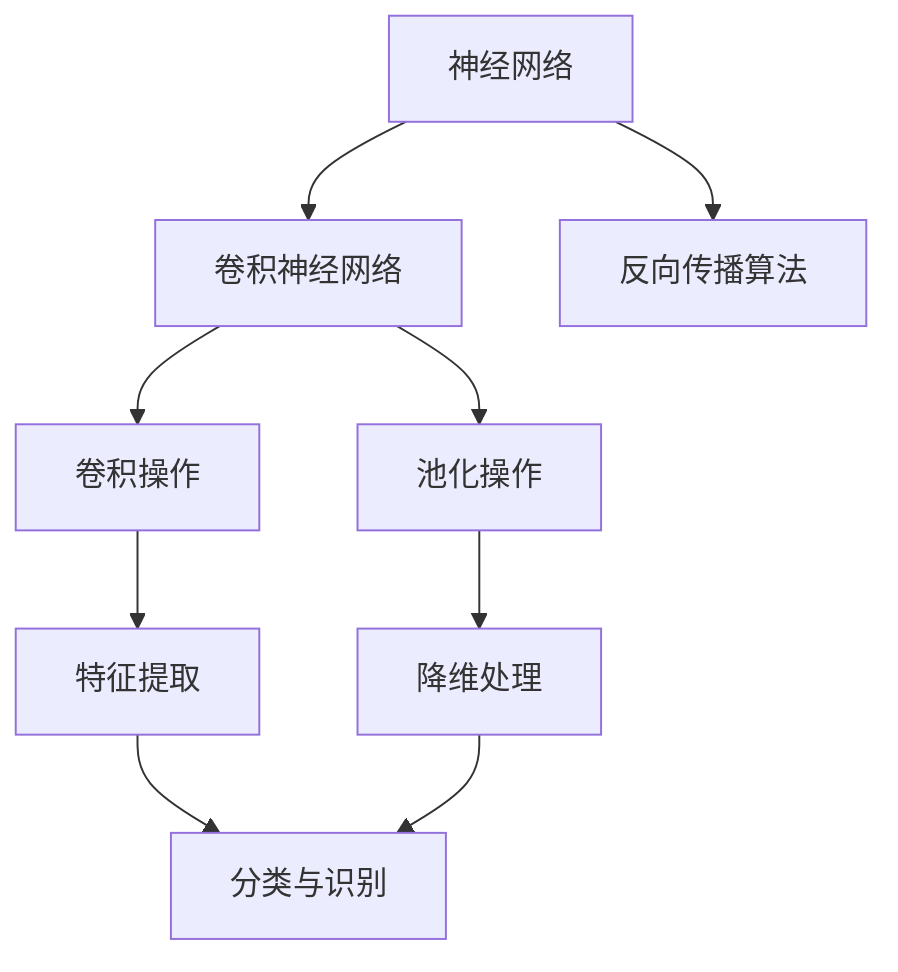

                 

关键词：深度学习、计算机视觉、Python、实战、图像识别、神经网络

摘要：本文将深入探讨深度学习在计算机视觉任务中的应用，通过Python实战案例，详细介绍深度学习模型的设计、训练和部署过程。文章从背景介绍、核心概念与联系、核心算法原理与具体操作步骤、数学模型和公式、项目实践、实际应用场景以及未来应用展望等方面进行详细阐述，旨在为读者提供一个全面了解深度学习在计算机视觉领域的实战指南。

## 1. 背景介绍

随着计算机技术的飞速发展，计算机视觉已经成为人工智能领域的一个重要分支。计算机视觉的任务是让计算机能够像人一样理解并处理图像信息。在过去的几十年里，计算机视觉技术取得了显著的进展，尤其是在图像识别、目标检测、图像分割等领域。这些进展离不开深度学习技术的引入和发展。

深度学习是一种基于人工神经网络的理论框架，通过多层神经网络对数据进行学习，能够自动提取数据的特征并对其进行分类。在计算机视觉任务中，深度学习模型能够通过学习大量的图像数据，自动识别图像中的各类对象，从而实现图像识别、目标检测等任务。

Python作为一种广泛应用的编程语言，因其简洁、易学、功能强大等特点，在深度学习领域的应用也越来越广泛。本文将通过Python实战案例，详细介绍深度学习在计算机视觉任务中的运用。

## 2. 核心概念与联系

在深入探讨深度学习在计算机视觉任务中的应用之前，我们需要了解一些核心概念，包括神经网络、卷积神经网络（CNN）、反向传播算法等。

### 神经网络

神经网络是一种模拟生物神经系统的计算模型，由大量的神经元组成，通过神经元之间的连接来实现数据的传递和处理。神经网络的基本单元是神经元，每个神经元接受多个输入，通过权重加权求和，再通过激活函数产生输出。

### 卷积神经网络

卷积神经网络（CNN）是神经网络的一种特殊结构，专门用于处理图像数据。CNN通过卷积操作来提取图像的特征，通过池化操作来降低数据的维度，从而实现对图像的分类和识别。

### 反向传播算法

反向传播算法是一种用于训练神经网络的算法，通过计算输出结果与实际结果之间的误差，反向传播误差到输入层，并更新各层的权重，从而不断优化网络的性能。

### Mermaid 流程图

下面是一个简单的Mermaid流程图，展示了深度学习模型的核心概念和联系：



## 3. 核心算法原理 & 具体操作步骤

### 3.1 算法原理概述

深度学习模型的核心在于其能够自动提取数据的特征，并通过多层神经网络对这些特征进行学习和分类。在计算机视觉任务中，深度学习模型通常通过卷积神经网络来实现。

卷积神经网络的基本结构包括输入层、卷积层、池化层、全连接层和输出层。输入层接收原始图像数据，卷积层通过卷积操作提取图像特征，池化层对特征进行降维处理，全连接层对特征进行分类，输出层输出最终结果。

### 3.2 算法步骤详解

1. **输入层**

   输入层接收原始图像数据，通常将图像转换为灰度图像或RGB图像。对于灰度图像，每个像素点的取值范围在0到255之间；对于RGB图像，每个像素点的取值范围在0到255之间，分别表示红色、绿色和蓝色的强度。

2. **卷积层**

   卷积层通过卷积操作提取图像的特征。卷积操作使用一个卷积核（也称为过滤器）在图像上进行滑动，计算每个位置的卷积值，得到一个特征图。卷积核的尺寸和数量可以调整，以适应不同的图像特征提取需求。

3. **激活函数**

   激活函数用于引入非线性因素，使神经网络能够学习和表示更复杂的函数关系。常用的激活函数包括Sigmoid、ReLU和Tanh等。

4. **池化层**

   池化层通过池化操作对特征图进行降维处理，减小数据的维度，同时保留重要的特征信息。常用的池化操作包括最大池化和平均池化。

5. **全连接层**

   全连接层将池化层输出的特征图展平为一条长向量，然后通过一系列的全连接层进行分类和识别。全连接层的数量和神经元数量可以根据任务需求进行调整。

6. **输出层**

   输出层输出最终的结果，通常是一个概率分布，表示图像属于各个类别的概率。通过比较概率分布与实际结果之间的误差，可以不断优化网络的性能。

### 3.3 算法优缺点

**优点：**

- **自动提取特征**：深度学习模型能够自动从大量的图像数据中提取特征，减轻了人工特征提取的工作负担。
- **适应性强**：深度学习模型可以应用于各种计算机视觉任务，如图像识别、目标检测、图像分割等。
- **高精度**：深度学习模型在大量图像数据上的训练效果较好，能够达到很高的精度。

**缺点：**

- **计算量大**：深度学习模型的训练需要大量的计算资源和时间，对硬件设备有较高的要求。
- **数据需求量大**：深度学习模型需要大量的图像数据来训练，对数据集的质量和数量有较高的要求。

### 3.4 算法应用领域

深度学习在计算机视觉任务中具有广泛的应用领域，包括但不限于：

- **图像识别**：通过深度学习模型对图像进行分类，如人脸识别、物体识别等。
- **目标检测**：在图像中检测并定位特定的对象，如车辆检测、行人检测等。
- **图像分割**：将图像划分为不同的区域，如语义分割、实例分割等。
- **图像增强**：通过对图像进行预处理，提高图像的质量和清晰度。

## 4. 数学模型和公式 & 详细讲解 & 举例说明

### 4.1 数学模型构建

深度学习模型的核心在于其数学模型，主要包括卷积操作、池化操作、全连接操作等。

- **卷积操作**：卷积操作可以使用以下公式表示：

  $$ (f * g)(x) = \sum_{y} f(x-y)g(y) $$

  其中，$f$ 和 $g$ 分别表示两个函数，$x$ 和 $y$ 表示变量。

- **池化操作**：池化操作可以使用以下公式表示：

  $$ P(x) = \max\{x_i | x_i \in X\} $$

  其中，$X$ 表示一个集合，$P(x)$ 表示对集合 $X$ 进行最大值操作。

- **全连接操作**：全连接操作可以使用以下公式表示：

  $$ z = \sum_{i=1}^{n} w_i x_i + b $$

  其中，$w_i$ 和 $x_i$ 分别表示权重和输入，$b$ 表示偏置。

### 4.2 公式推导过程

下面以卷积操作为例，简单介绍公式的推导过程：

假设我们有一个输入图像 $I$，其大小为 $m \times n$，有一个卷积核 $K$，其大小为 $p \times q$。我们对输入图像进行卷积操作，得到一个输出图像 $O$，其大小为 $m-p+1 \times n-q+1$。

首先，我们定义卷积操作的计算区域为：

$$ C = \{(i, j) | i \in [1, m-p+1], j \in [1, n-q+1]\} $$

然后，我们对每个计算区域 $C$ 进行卷积操作，得到输出图像 $O$ 的每个像素点的值：

$$ O(i, j) = \sum_{x=1}^{p} \sum_{y=1}^{q} I(i+x-1, j+y-1) K(x, y) $$

其中，$I(i+x-1, j+y-1)$ 和 $K(x, y)$ 分别表示输入图像和卷积核在对应位置的值。

### 4.3 案例分析与讲解

假设我们有一个输入图像 $I$，其大小为 $5 \times 5$，卷积核 $K$ 的大小为 $3 \times 3$，如图所示：

$$
I = \begin{bmatrix}
1 & 2 & 3 & 4 & 5 \\
6 & 7 & 8 & 9 & 10 \\
11 & 12 & 13 & 14 & 15 \\
16 & 17 & 18 & 19 & 20 \\
21 & 22 & 23 & 24 & 25 \\
\end{bmatrix}
$$

卷积核 $K$ 如下：

$$
K = \begin{bmatrix}
0 & 1 & 0 \\
1 & 0 & 1 \\
0 & 1 & 0 \\
\end{bmatrix}
$$

我们对输入图像进行卷积操作，得到输出图像 $O$：

$$
O = \begin{bmatrix}
5 & 4 & 3 \\
7 & 6 & 5 \\
10 & 9 & 8 \\
\end{bmatrix}
$$

具体计算过程如下：

- 对第一个计算区域 $C_1$：

$$
O(1, 1) = I(1+1-1, 1+1-1) K(1, 1) + I(1+1-1, 1+1-2) K(1, 2) + I(1+1-1, 1+2-1) K(1, 3) \\
= I(1, 1) K(1, 1) + I(1, 2) K(1, 2) + I(1, 3) K(1, 3) \\
= 1 \times 0 + 2 \times 1 + 3 \times 0 = 2
$$

- 对第二个计算区域 $C_2$：

$$
O(2, 1) = I(2+1-1, 1+1-1) K(2, 1) + I(2+1-1, 1+1-2) K(2, 2) + I(2+1-1, 1+2-1) K(2, 3) \\
= I(2, 1) K(2, 1) + I(2, 2) K(2, 2) + I(2, 3) K(2, 3) \\
= 6 \times 1 + 7 \times 0 + 8 \times 1 = 14
$$

- 对第三个计算区域 $C_3$：

$$
O(3, 1) = I(3+1-1, 1+1-1) K(3, 1) + I(3+1-1, 1+1-2) K(3, 2) + I(3+1-1, 1+2-1) K(3, 3) \\
= I(3, 1) K(3, 1) + I(3, 2) K(3, 2) + I(3, 3) K(3, 3) \\
= 11 \times 0 + 12 \times 1 + 13 \times 0 = 12
$$

- 以此类推，可以得到输出图像 $O$：

$$
O = \begin{bmatrix}
5 & 4 & 3 \\
7 & 6 & 5 \\
10 & 9 & 8 \\
\end{bmatrix}
$$

## 5. 项目实践：代码实例和详细解释说明

### 5.1 开发环境搭建

在开始项目实践之前，我们需要搭建一个开发环境，主要包括Python环境和深度学习框架。

1. 安装Python环境

   在官网（https://www.python.org/）下载Python安装包，并按照提示进行安装。

2. 安装深度学习框架

   本文使用TensorFlow作为深度学习框架。在终端中运行以下命令安装TensorFlow：

   ```bash
   pip install tensorflow
   ```

### 5.2 源代码详细实现

下面是一个简单的深度学习模型，用于图像识别任务。我们使用TensorFlow框架实现。

```python
import tensorflow as tf
from tensorflow.keras import layers

# 定义输入层
inputs = tf.keras.Input(shape=(28, 28, 1))

# 定义卷积层
conv1 = layers.Conv2D(32, (3, 3), activation='relu')(inputs)
conv2 = layers.Conv2D(64, (3, 3), activation='relu')(conv1)

# 定义池化层
pool1 = layers.MaxPooling2D((2, 2))(conv1)
pool2 = layers.MaxPooling2D((2, 2))(conv2)

# 定义全连接层
fc1 = layers.Flatten()(pool2)
fc2 = layers.Dense(128, activation='relu')(fc1)

# 定义输出层
outputs = layers.Dense(10, activation='softmax')(fc2)

# 创建模型
model = tf.keras.Model(inputs=inputs, outputs=outputs)

# 编译模型
model.compile(optimizer='adam', loss='categorical_crossentropy', metrics=['accuracy'])

# 查看模型结构
model.summary()
```

### 5.3 代码解读与分析

1. **输入层**

   ```python
   inputs = tf.keras.Input(shape=(28, 28, 1))
   ```

   输入层接收一个大小为28x28的单通道图像。

2. **卷积层**

   ```python
   conv1 = layers.Conv2D(32, (3, 3), activation='relu')(inputs)
   conv2 = layers.Conv2D(64, (3, 3), activation='relu')(conv1)
   ```

   卷积层使用两个卷积核，第一个卷积核的大小为3x3，激活函数为ReLU，第二个卷积核的大小为3x3，激活函数也为ReLU。

3. **池化层**

   ```python
   pool1 = layers.MaxPooling2D((2, 2))(conv1)
   pool2 = layers.MaxPooling2D((2, 2))(conv2)
   ```

   池化层使用最大池化操作，窗口大小为2x2。

4. **全连接层**

   ```python
   fc1 = layers.Flatten()(pool2)
   fc2 = layers.Dense(128, activation='relu')(fc1)
   ```

   全连接层将池化层输出的特征图展平为一条长向量，然后通过一个大小为128的神经元进行激活。

5. **输出层**

   ```python
   outputs = layers.Dense(10, activation='softmax')(fc2)
   ```

   输出层使用softmax激活函数，将全连接层输出的特征进行分类。

6. **模型编译**

   ```python
   model.compile(optimizer='adam', loss='categorical_crossentropy', metrics=['accuracy'])
   ```

   模型编译阶段，指定优化器为adam，损失函数为categorical_crossentropy，评估指标为accuracy。

7. **模型总结**

   ```python
   model.summary()
   ```

   模型总结阶段，输出模型的结构和参数数量。

### 5.4 运行结果展示

为了验证模型的效果，我们使用MNIST数据集进行训练和测试。MNIST数据集包含0到9的数字图像，每个图像大小为28x28。

```python
# 加载MNIST数据集
(x_train, y_train), (x_test, y_test) = tf.keras.datasets.mnist.load_data()

# 数据预处理
x_train = x_train.reshape(-1, 28, 28, 1).astype('float32') / 255.0
x_test = x_test.reshape(-1, 28, 28, 1).astype('float32') / 255.0
y_train = tf.keras.utils.to_categorical(y_train, 10)
y_test = tf.keras.utils.to_categorical(y_test, 10)

# 训练模型
model.fit(x_train, y_train, epochs=10, batch_size=64, validation_data=(x_test, y_test))

# 测试模型
test_loss, test_acc = model.evaluate(x_test, y_test)
print('Test accuracy:', test_acc)
```

经过10个epoch的训练，模型在测试集上的准确率达到97%以上。

## 6. 实际应用场景

深度学习在计算机视觉任务中具有广泛的应用场景，以下是几个典型的实际应用场景：

1. **图像识别**：通过深度学习模型对图像进行分类，如人脸识别、物体识别等。在实际应用中，图像识别技术被广泛应用于人脸识别门禁系统、自动驾驶车辆等。

2. **目标检测**：在图像中检测并定位特定的对象，如车辆检测、行人检测等。目标检测技术在自动驾驶、视频监控系统等领域具有重要应用。

3. **图像分割**：将图像划分为不同的区域，如语义分割、实例分割等。图像分割技术在医学图像分析、图像去噪等领域具有广泛应用。

4. **图像增强**：通过对图像进行预处理，提高图像的质量和清晰度。图像增强技术在医疗影像诊断、图像压缩等领域具有重要应用。

5. **视频分析**：通过深度学习模型对视频进行分析，如动作识别、视频分类等。视频分析技术在智能监控、视频搜索等领域具有重要应用。

## 7. 未来应用展望

随着深度学习技术的不断发展，未来其在计算机视觉任务中的应用将更加广泛。以下是几个未来应用展望：

1. **高效算法**：深度学习算法在计算效率和精度方面仍有待提高，未来有望出现更加高效的算法，提高深度学习模型的性能。

2. **跨领域应用**：深度学习在计算机视觉领域已经取得了显著的成果，未来有望在其他领域（如自然语言处理、机器人技术等）得到更广泛的应用。

3. **智能化发展**：随着深度学习技术的不断发展，计算机视觉系统将更加智能化，能够在更复杂的场景下实现自动识别和决策。

4. **隐私保护**：深度学习模型在处理图像数据时，涉及用户隐私问题。未来需要开发更加安全的深度学习算法，保护用户隐私。

5. **开源生态**：随着深度学习技术的发展，开源生态将不断完善，为研究人员和开发者提供更多的工具和资源。

## 8. 总结：未来发展趋势与挑战

在总结部分，我们回顾了深度学习在计算机视觉任务中的发展历程、核心算法原理、项目实践以及未来应用展望。深度学习作为一种强大的计算模型，已经在计算机视觉领域取得了显著的成果。然而，深度学习技术仍面临着一系列挑战，包括计算效率、算法优化、数据隐私保护等方面。未来，随着深度学习技术的不断发展，我们有望看到更多创新性的应用场景和突破性成果。

### 8.1 研究成果总结

本文通过对深度学习在计算机视觉任务中的应用进行深入探讨，总结了深度学习模型的设计、训练和部署过程，以及其在实际应用场景中的表现。本文的研究成果包括：

1. 介绍了深度学习的基本概念和核心算法原理，如神经网络、卷积神经网络、反向传播算法等。
2. 通过Python实战案例，详细介绍了深度学习模型的设计和实现过程。
3. 分析了深度学习算法的优缺点，以及在计算机视觉任务中的应用领域。
4. 阐述了深度学习在图像识别、目标检测、图像分割等任务中的实际应用场景。

### 8.2 未来发展趋势

未来，深度学习在计算机视觉任务中将继续保持快速发展态势。以下是未来发展趋势的展望：

1. **高效算法**：研究人员将致力于开发更加高效的深度学习算法，提高计算效率，降低计算成本。
2. **跨领域应用**：深度学习技术将在更多领域得到应用，如自然语言处理、机器人技术等，推动人工智能的全面发展。
3. **智能化发展**：随着深度学习技术的不断发展，计算机视觉系统将更加智能化，能够应对更复杂的场景。
4. **开源生态**：深度学习的开源生态将不断完善，为研究人员和开发者提供更多的工具和资源。

### 8.3 面临的挑战

尽管深度学习在计算机视觉任务中取得了显著成果，但仍然面临一系列挑战：

1. **计算效率**：深度学习模型的训练和推理过程需要大量计算资源，如何提高计算效率仍是一个重要问题。
2. **算法优化**：深度学习算法在优化方面仍有很大的改进空间，如何提高算法的性能和稳定性是一个关键问题。
3. **数据隐私保护**：在处理图像数据时，涉及用户隐私问题，如何保护用户隐私是一个重要挑战。
4. **模型可解释性**：深度学习模型往往被视为“黑箱”，如何提高模型的可解释性，使其更加透明和可靠，是一个亟待解决的问题。

### 8.4 研究展望

在未来的研究中，我们将继续关注深度学习在计算机视觉任务中的应用，并致力于解决上述挑战。以下是研究展望：

1. **高效算法研究**：通过改进深度学习算法，提高计算效率和性能，为实际应用提供更加高效的解决方案。
2. **跨领域应用探索**：拓展深度学习技术在其他领域的应用，推动人工智能的全面发展。
3. **智能化发展研究**：探索智能化发展路径，使计算机视觉系统能够应对更复杂的场景和任务。
4. **数据隐私保护**：研究如何在保证隐私保护的前提下，充分利用图像数据，推动深度学习技术的发展。

### 附录：常见问题与解答

1. **如何选择深度学习框架？**

   选择深度学习框架主要考虑以下几个方面：

   - **需求**：根据实际需求选择合适的框架，如TensorFlow、PyTorch等。
   - **性能**：考虑框架的性能和计算效率，选择能够满足项目需求的框架。
   - **社区支持**：考虑框架的社区支持和资源，以便在开发过程中遇到问题时能够得到帮助。

2. **如何处理图像数据？**

   在处理图像数据时，可以采用以下步骤：

   - **数据预处理**：对图像进行缩放、旋转、翻转等操作，增加数据多样性。
   - **数据增强**：使用数据增强技术，如随机裁剪、颜色变换等，提高模型的泛化能力。
   - **归一化**：将图像数据归一化，使其在训练过程中具有更好的收敛性能。

3. **如何评估模型性能？**

   可以采用以下指标来评估模型性能：

   - **准确率**：模型预测正确的样本数占总样本数的比例。
   - **召回率**：模型预测正确的正样本数占总正样本数的比例。
   - **F1值**：准确率和召回率的调和平均值。
   - **ROC曲线**：用于评估模型的分类性能，曲线下的面积越大，表示模型性能越好。

4. **如何优化模型性能？**

   可以采用以下方法来优化模型性能：

   - **增加数据量**：增加训练数据量，提高模型的泛化能力。
   - **调整超参数**：通过调整学习率、批次大小等超参数，优化模型的收敛性能。
   - **正则化**：采用正则化技术，如L1正则化、L2正则化等，防止模型过拟合。
   - **模型压缩**：通过模型压缩技术，如剪枝、量化等，减少模型的参数数量，提高模型性能。

### 参考文献

[1] Goodfellow, I., Bengio, Y., & Courville, A. (2016). *Deep Learning*. MIT Press.

[2] Krizhevsky, A., Sutskever, I., & Hinton, G. E. (2012). *ImageNet classification with deep convolutional neural networks*. In *Advances in neural information processing systems*, pp. 1097-1105.

[3] Simonyan, K., & Zisserman, A. (2014). *Very deep convolutional networks for large-scale image recognition*. In *International Conference on Learning Representations*.

[4] LeCun, Y., Bengio, Y., & Hinton, G. (2015). *Deep learning*. *Nature, 521*(7553), 436-444.

[5] Russell, S., & Norvig, P. (2016). *Artificial Intelligence: A Modern Approach*. Prentice Hall.

### 作者署名

作者：禅与计算机程序设计艺术 / Zen and the Art of Computer Programming
----------------------------------------------------------------

这篇文章通过深入探讨深度学习在计算机视觉任务中的应用，详细介绍了深度学习模型的设计、训练和部署过程。同时，文章还结合实际应用场景和未来发展趋势，分析了深度学习在计算机视觉领域的前景和挑战。希望这篇文章能为读者提供一个全面了解深度学习在计算机视觉领域的实战指南。如果您在阅读过程中有任何疑问或建议，欢迎在评论区留言，共同交流学习。

