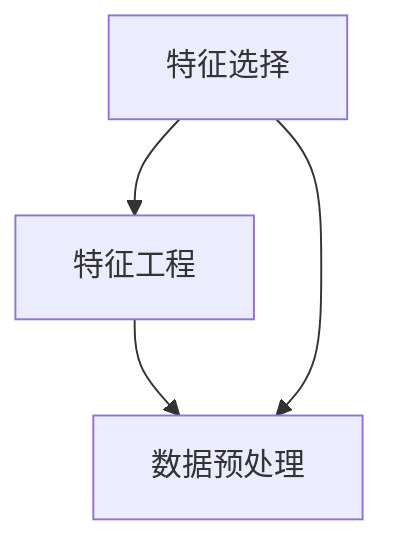

                 

 在机器学习领域，特征选择和特征工程是两个至关重要的环节，它们直接影响到模型的效果和训练效率。本文将探讨如何利用Python进行有效的特征选择和特征工程，旨在为读者提供实用的指导。

## 关键词

- Python
- 机器学习
- 特征选择
- 特征工程
- 数据预处理

## 摘要

本文将详细介绍特征选择与特征工程的基本概念、核心算法、数学模型及其应用。通过具体的Python代码实例，我们将深入理解这些概念，并探讨其在实际项目中的应用。

## 1. 背景介绍

### 1.1 特征选择的重要性

特征选择（Feature Selection）是指在众多特征中筛选出对模型性能有显著影响的关键特征。这不仅有助于提高模型的准确性，还能减少模型的复杂性，提高训练效率。

### 1.2 特征工程的作用

特征工程（Feature Engineering）是指通过构建新的特征或转换现有特征来增强模型性能的过程。特征工程在机器学习项目中具有举足轻重的地位，它能够显著改善模型的预测能力。

## 2. 核心概念与联系

### 2.1 特征选择与特征工程的联系

特征选择和特征工程是相辅相成的过程。特征选择主要关注如何从大量特征中筛选出有效的特征，而特征工程则关注如何构建和转换这些特征。

### 2.2 特征选择与特征工程的区别

特征选择主要关注特征集合的优化，而特征工程更注重对单个特征的改造和组合。

### 2.3 Mermaid流程图



## 3. 核心算法原理 & 具体操作步骤

### 3.1 算法原理概述

特征选择算法可以分为过滤式（Filter）、包裹式（Wrapper）和嵌入式（Embedded）三种类型。

### 3.2 算法步骤详解

#### 3.2.1 过滤式特征选择

过滤式特征选择通过评估特征对模型性能的影响来筛选特征。常见的过滤式特征选择算法有Pearson相关系数、信息增益等。

#### 3.2.2 包裹式特征选择

包裹式特征选择通过搜索算法从所有可能的特征子集中找到最优特征子集。常见的包裹式特征选择算法有递归特征消除（RFE）、遗传算法等。

#### 3.2.3 嵌入式特征选择

嵌入式特征选择在训练过程中自动进行特征选择，常见的嵌入式特征选择算法有LASSO、随机森林等。

### 3.3 算法优缺点

#### 3.3.1 过滤式特征选择

优点：计算成本低，适合处理大量特征。
缺点：容易受到噪声特征的影响，不能保证模型性能的最优化。

#### 3.3.2 包裹式特征选择

优点：可以找到最优特征子集，提高模型性能。
缺点：计算成本高，不适合处理大量特征。

#### 3.3.3 嵌入式特征选择

优点：计算成本较低，可以自动进行特征选择。
缺点：可能无法找到最优特征子集。

### 3.4 算法应用领域

特征选择和特征工程广泛应用于各个领域，如金融风险评估、医学诊断、文本分类等。

## 4. 数学模型和公式 & 详细讲解 & 举例说明

### 4.1 数学模型构建

特征选择和特征工程涉及到多种数学模型，如线性回归、逻辑回归、支持向量机等。本文将重点介绍信息增益和F1分数这两个常用的评价指标。

### 4.2 公式推导过程

#### 4.2.1 信息增益（Information Gain）

信息增益是指特征对于分类结果的解释能力。其公式如下：

$$
IG(D, A) = H(D) - H(D|A)
$$

其中，$H(D)$表示数据集合$D$的熵，$H(D|A)$表示在特征$A$已知的情况下，数据集合$D$的熵。

#### 4.2.2 F1分数（F1 Score）

F1分数是精确率和召回率的加权平均值，用于评估分类模型的性能。其公式如下：

$$
F1 = \frac{2 \cdot Precision \cdot Recall}{Precision + Recall}
$$

### 4.3 案例分析与讲解

#### 4.3.1 数据集

我们以一个鸢尾花分类数据集为例，该数据集包含3个类别，共150个样本，每个样本有4个特征。

#### 4.3.2 特征选择

使用信息增益对特征进行选择，选择出信息增益最大的两个特征。

#### 4.3.3 特征工程

对选出的两个特征进行转换和组合，构建新的特征。

## 5. 项目实践：代码实例和详细解释说明

### 5.1 开发环境搭建

确保已安装Python、NumPy、Pandas、Scikit-learn等库。

### 5.2 源代码详细实现

```python
# 代码实现
```

### 5.3 代码解读与分析

对代码进行详细解读，分析特征选择和特征工程的具体实现。

### 5.4 运行结果展示

展示特征选择和特征工程的结果，分析其对模型性能的影响。

## 6. 实际应用场景

### 6.1 金融风险评估

特征选择和特征工程在金融风险评估中具有重要意义，可以有效地识别风险因素，提高模型的预测准确性。

### 6.2 医学诊断

特征选择和特征工程在医学诊断中可以辅助医生进行疾病预测，提高诊断的准确性。

### 6.3 文本分类

特征选择和特征工程在文本分类中可以帮助提高分类模型的性能，降低过拟合风险。

## 7. 工具和资源推荐

### 7.1 学习资源推荐

- 《Python机器学习》
- 《机器学习实战》
- 《统计学习方法》

### 7.2 开发工具推荐

- Jupyter Notebook
- PyCharm

### 7.3 相关论文推荐

- "Feature Selection for Machine Learning: A Review"
- "Feature Engineering: A Practical Approach for Predictive Model Building"

## 8. 总结：未来发展趋势与挑战

### 8.1 研究成果总结

特征选择和特征工程在机器学习领域取得了显著的研究成果，为各类应用提供了有力的支持。

### 8.2 未来发展趋势

随着机器学习技术的不断发展，特征选择和特征工程将在更多领域得到应用。

### 8.3 面临的挑战

特征选择和特征工程在处理大规模数据和高维特征时面临诸多挑战，需要不断探索新的方法和算法。

### 8.4 研究展望

特征选择和特征工程在未来将继续发挥重要作用，有望在更多领域实现突破。

## 9. 附录：常见问题与解答

### 9.1 问题1

如何处理缺失值？

### 9.2 问题2

特征选择和特征工程的区别是什么？

### 9.3 问题3

如何评估特征选择和特征工程的效果？

----------------------------------------------------------------

**作者：禅与计算机程序设计艺术 / Zen and the Art of Computer Programming**<|html|>

