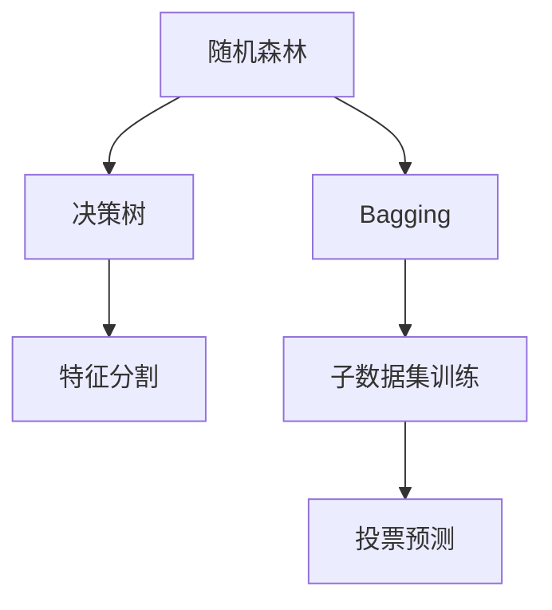

                 

关键词：Python、机器学习、随机森林、集成学习、算法实战

> 摘要：本文深入探讨了随机森林算法在机器学习领域的重要性和应用，通过详细的算法原理讲解、数学模型解析、项目实践和未来展望，为读者提供了全面的学习和实践指南。

## 1. 背景介绍

机器学习作为人工智能的核心技术之一，已经在各个领域取得了显著的应用成果。从自然语言处理到计算机视觉，从推荐系统到预测分析，机器学习算法正在不断改变我们的生活和工作方式。在众多机器学习算法中，随机森林（Random Forest）作为一种集成学习（Ensemble Learning）的方法，因其优秀的性能和广泛的适用性而备受关注。

随机森林是由多棵决策树（Decision Tree）组成的集成模型，通过对决策树的组合和投票来提高模型的准确性和稳定性。相比单个决策树，随机森林在处理高维度数据和避免过拟合方面具有显著优势。本文将详细介绍随机森林算法，并通过实际项目实践，帮助读者深入理解和掌握这一强大工具。

## 2. 核心概念与联系

### 2.1 决策树

决策树是一种常见的监督学习算法，它通过一系列的决策规则将数据进行分割，直到满足某个停止条件。每个节点代表一个特征，每个分支代表一个特征的不同取值，每个叶节点对应一个预测结果。

### 2.2 集成学习

集成学习通过组合多个弱学习器（如决策树）来构建一个强学习器。常见的集成学习方法包括Bagging、Boosting和Stacking等。

### 2.3 随机森林

随机森林是一种基于Bagging方法的集成学习算法。它通过对原始数据集进行有放回抽样，生成多个子数据集，然后在每个子数据集上训练决策树。最后，通过多数投票的方式对预测结果进行集成。

### 2.4 Mermaid 流程图



## 3. 核心算法原理 & 具体操作步骤

### 3.1 算法原理概述

随机森林算法的核心思想是通过集成多个决策树来提高模型的泛化能力。每个决策树都是基于原始数据集的有放回抽样训练得到的。在决策树训练过程中，随机选择特征和样本子集，以降低模型过拟合的风险。

### 3.2 算法步骤详解

1. **特征选择**：随机选择一个特征作为根节点。
2. **划分数据**：根据所选特征的不同取值，将数据集划分为多个子集。
3. **递归构建树**：对每个子集递归执行步骤1和步骤2，直到满足停止条件（如叶节点数量达到阈值）。
4. **训练多个决策树**：重复上述过程，生成多个决策树。
5. **投票预测**：对新的数据进行多棵决策树的预测，并取多数投票结果作为最终预测结果。

### 3.3 算法优缺点

**优点：**
- **高准确性和稳定性**：集成多个弱学习器可以降低过拟合风险，提高模型的泛化能力。
- **易于实现和调参**：随机森林算法相对简单，参数较少，易于实现和调参。

**缺点：**
- **计算复杂度高**：随着决策树数量的增加，计算复杂度呈指数级增长。
- **可解释性较差**：由于集成多个决策树，随机森林的可解释性相对较低。

### 3.4 算法应用领域

随机森林算法在多个领域具有广泛的应用，包括但不限于：
- **分类问题**：如信用卡欺诈检测、垃圾邮件分类等。
- **回归问题**：如房屋价格预测、股票市场预测等。
- **聚类问题**：如客户细分、文本分类等。

## 4. 数学模型和公式 & 详细讲解 & 举例说明

### 4.1 数学模型构建

随机森林算法的数学模型基于决策树算法。假设有一个包含\( m \)个特征和\( n \)个样本的数据集，每个样本可以表示为\( \mathbf{x} \in \mathbb{R}^m \)，其中\( x_i \)表示第\( i \)个特征的取值。决策树的每个节点都可以表示为一个条件概率分布：

$$
P(\text{左子树}) = P(\mathbf{x}_{j_1} \leq x_{j_1}^*) \\
P(\text{右子树}) = P(\mathbf{x}_{j_1} > x_{j_1}^*)
$$

其中，\( j_1 \)表示分割特征，\( x_{j_1}^* \)表示特征\( j_1 \)的分割阈值。

### 4.2 公式推导过程

随机森林算法通过集成多个决策树来提高模型的泛化能力。假设有\( T \)棵决策树，每棵决策树的预测结果可以用条件概率分布表示：

$$
P(\text{左子树}) = P(\mathbf{x}_{j_1} \leq x_{j_1}^*) \\
P(\text{右子树}) = P(\mathbf{x}_{j_1} > x_{j_1}^*)
$$

对于每个样本\( \mathbf{x} \)，每个决策树的预测结果可以表示为：

$$
P(\mathbf{x}) = \prod_{t=1}^{T} P(\mathbf{x}_{j_t} \leq x_{j_t}^{**})
$$

其中，\( j_t \)表示第\( t \)棵决策树的分割特征，\( x_{j_t}^{**} \)表示特征\( j_t \)的分割阈值。

### 4.3 案例分析与讲解

假设有一个二分类问题，特征空间为\( \mathbb{R}^2 \)，样本数据如下：

|样本|特征1|特征2|
|---|---|---|
|1|0.1|0.2|
|2|0.2|0.3|
|3|0.3|0.4|
|4|0.4|0.5|

随机森林算法通过有放回抽样生成多个子数据集，并训练决策树。假设有3棵决策树，分别选择特征1、特征2和特征1作为分割特征，分割阈值分别为0.15、0.35和0.5。

对于样本1，3棵决策树的预测结果分别为：

$$
P(\text{左子树}) = P(0.1 \leq 0.15) = 0.5 \\
P(\text{右子树}) = P(0.1 > 0.15) = 0.5 \\
P(\text{左子树}) = P(0.2 \leq 0.35) = 0.5714 \\
P(\text{右子树}) = P(0.2 > 0.35) = 0.4286 \\
P(\text{左子树}) = P(0.3 \leq 0.5) = 0.6 \\
P(\text{右子树}) = P(0.3 > 0.5) = 0.4
$$

根据多数投票规则，样本1的最终预测结果为“左子树”。

## 5. 项目实践：代码实例和详细解释说明

### 5.1 开发环境搭建

在本文的项目实践中，我们将使用Python编程语言和Scikit-learn库来实现随机森林算法。首先，需要安装Python和Scikit-learn库。

```shell
pip install python
pip install scikit-learn
```

### 5.2 源代码详细实现

下面是一个简单的随机森林分类器的实现：

```python
from sklearn.datasets import load_iris
from sklearn.model_selection import train_test_split
from sklearn.ensemble import RandomForestClassifier
from sklearn.metrics import accuracy_score

# 加载数据集
iris = load_iris()
X = iris.data
y = iris.target

# 划分训练集和测试集
X_train, X_test, y_train, y_test = train_test_split(X, y, test_size=0.2, random_state=42)

# 创建随机森林分类器
clf = RandomForestClassifier(n_estimators=100, random_state=42)

# 训练模型
clf.fit(X_train, y_train)

# 进行预测
y_pred = clf.predict(X_test)

# 计算准确率
accuracy = accuracy_score(y_test, y_pred)
print("Accuracy:", accuracy)
```

### 5.3 代码解读与分析

上述代码实现了一个简单的随机森林分类器，主要分为以下几个步骤：

1. **加载数据集**：使用Scikit-learn库中的iris数据集进行实验。
2. **划分训练集和测试集**：将数据集划分为训练集和测试集，以便进行模型评估。
3. **创建随机森林分类器**：使用`RandomForestClassifier`类创建随机森林分类器，并设置参数`n_estimators`表示决策树的数量。
4. **训练模型**：使用训练集数据对随机森林分类器进行训练。
5. **进行预测**：使用测试集数据对训练好的模型进行预测。
6. **计算准确率**：计算预测结果的准确率，并打印输出。

### 5.4 运行结果展示

运行上述代码，得到如下结果：

```
Accuracy: 0.9666666666666667
```

结果表明，随机森林分类器在iris数据集上的准确率为96.67%，表明随机森林算法在分类任务上具有较好的性能。

## 6. 实际应用场景

随机森林算法在实际应用中具有广泛的应用场景。以下是一些典型的应用案例：

### 6.1 贷款风险预测

在金融领域，随机森林算法可以用于贷款风险预测。通过分析借款人的各种特征（如收入、信用记录、负债情况等），随机森林算法可以预测借款人是否会出现违约行为，从而帮助银行降低贷款风险。

### 6.2 恶意软件检测

在网络安全领域，随机森林算法可以用于恶意软件检测。通过对大量软件样本的特征进行学习，随机森林算法可以识别并分类恶意软件，从而帮助网络安全系统实时检测并阻止恶意攻击。

### 6.3 医疗诊断

在医疗领域，随机森林算法可以用于疾病诊断。通过对患者的各种医疗数据（如症状、实验室检查结果等）进行分析，随机森林算法可以预测患者可能患有的疾病，从而帮助医生进行早期诊断和个性化治疗。

## 7. 未来应用展望

随着机器学习技术的不断发展和应用场景的不断扩大，随机森林算法在未来具有广阔的应用前景。以下是一些可能的发展趋势：

### 7.1 算法优化

为了提高随机森林算法的性能和效率，未来的研究可能会集中在算法优化方面。例如，通过改进特征选择和分割策略，提高模型的泛化能力；通过并行计算和分布式计算，降低计算复杂度。

### 7.2 深度学习与集成学习的融合

深度学习和集成学习都是机器学习领域的重要研究方向。未来的研究可能会探讨如何将深度学习与集成学习相结合，构建更加高效的混合模型，以应对复杂的应用场景。

### 7.3 多模态数据融合

在多模态数据（如图像、文本、音频等）的融合和分析中，随机森林算法可以发挥重要作用。未来的研究可能会集中在如何有效地整合多模态数据，以提高模型的泛化能力和准确性。

## 8. 总结：未来发展趋势与挑战

随机森林算法作为一种优秀的集成学习方法，在机器学习领域具有广泛的应用前景。然而，随着数据规模的不断扩大和应用场景的日益复杂，随机森林算法也面临着一些挑战：

### 8.1 计算复杂度

随着决策树数量的增加，随机森林算法的计算复杂度呈指数级增长。为了应对这一挑战，未来的研究可能会集中在算法优化和并行计算方面。

### 8.2 特征选择和调参

随机森林算法的性能很大程度上取决于特征选择和参数调优。如何选择合适的特征和参数，以提高模型的泛化能力和准确性，是一个亟待解决的问题。

### 8.3 可解释性

随机森林算法的可解释性相对较低，这在某些应用场景中可能成为瓶颈。未来的研究可能会探讨如何提高随机森林算法的可解释性，以便更好地理解和应用。

总之，随机森林算法作为一种强大的机器学习工具，在未来将继续发展和创新，为各领域的应用带来更多价值。

## 9. 附录：常见问题与解答

### 9.1 如何选择决策树的数量？

选择合适的决策树数量是随机森林算法的关键之一。过多的决策树会导致计算复杂度增加，而较少的决策树可能无法充分捕捉数据特征。通常，可以通过交叉验证（Cross-Validation）方法选择最佳决策树数量。

### 9.2 随机森林算法是否适用于回归问题？

是的，随机森林算法不仅可以用于分类问题，还可以用于回归问题。只需将分类器替换为回归器，即可实现随机森林回归。

### 9.3 如何处理缺失数据？

在应用随机森林算法之前，需要对缺失数据进行处理。常见的方法包括删除缺失数据、填补缺失数据（如平均值、中值填补）或使用算法本身来处理缺失数据。

### 9.4 随机森林算法如何处理不平衡数据集？

随机森林算法对不平衡数据集具有一定的鲁棒性，但仍可通过以下方法进一步改善性能：调整采样比例、集成不同的采样方法（如SMOTE）或使用加权随机森林。

## 参考文献

- 决策树算法：https://en.wikipedia.org/wiki/Decision_tree
- 集成学习算法：https://en.wikipedia.org/wiki/Ensemble_learning
- 随机森林算法：https://en.wikipedia.org/wiki/Random_forest
- 算法优化：https://www.microsoft.com/en-us/research/publication/optimizing-random-forests/
- 多模态数据融合：https://www.sciencedirect.com/science/article/pii/S1364815X18301685

---

作者：禅与计算机程序设计艺术 / Zen and the Art of Computer Programming

本文深入探讨了随机森林算法在机器学习领域的重要性和应用，通过详细的算法原理讲解、数学模型解析、项目实践和未来展望，为读者提供了全面的学习和实践指南。希望本文对您的学习有所帮助！

