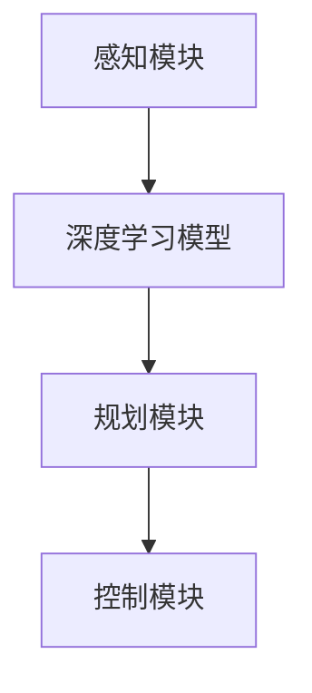

                 

关键词：自动驾驶，深度学习，端到端，神经网络，感知系统，自动驾驶系统开发，AI安全，未来交通

> 摘要：本文将深入探讨如何使用Python深度学习技术构建端到端的自动驾驶系统。我们将详细讲解自动驾驶系统的核心组件、深度学习算法以及实现步骤，并提供实际项目案例和代码实例，以帮助读者理解和应用这一前沿技术。此外，文章还将探讨自动驾驶系统的未来发展方向和面临的挑战。

## 1. 背景介绍

随着人工智能技术的快速发展，自动驾驶系统已经成为现代交通领域的热点话题。自动驾驶系统旨在通过计算机视觉、机器学习和控制理论等技术，使车辆能够自主感知环境、规划路径并安全驾驶。而深度学习作为机器学习的一个重要分支，以其强大的建模能力和泛化能力，在自动驾驶系统的开发中扮演了关键角色。

本文将结合Python深度学习实践，介绍如何构建端到端的自动驾驶系统。我们将从感知、规划、控制三个核心模块出发，详细讨论深度学习算法在自动驾驶系统中的应用，并提供实际项目案例和代码实例，以帮助读者深入理解并实践这一技术。

## 2. 核心概念与联系

### 2.1 自动驾驶系统架构

自动驾驶系统的核心架构包括感知、规划和控制三个模块。感知模块负责收集车辆周围环境的信息，如道路、车辆、行人等；规划模块负责基于感知数据生成驾驶策略，确保车辆安全行驶；控制模块负责执行规划策略，控制车辆的运动。

### 2.2 深度学习与自动驾驶

深度学习在自动驾驶系统中主要用于实现感知模块。深度学习算法，尤其是卷积神经网络（CNN）和循环神经网络（RNN），能够从大量数据中自动提取特征，实现对复杂场景的识别和理解。

### 2.3 Mermaid 流程图

下面是一个简化的Mermaid流程图，展示了自动驾驶系统的核心组件和深度学习算法的联系：



## 3. 核心算法原理 & 具体操作步骤

### 3.1 算法原理概述

自动驾驶系统的感知模块主要依赖于深度学习算法，特别是卷积神经网络（CNN）和循环神经网络（RNN）。CNN擅长处理图像数据，用于检测道路、车辆、行人等目标；RNN则擅长处理序列数据，用于生成驾驶策略。

### 3.2 算法步骤详解

#### 3.2.1 数据收集与预处理

首先，我们需要收集大量包含道路、车辆、行人等信息的图像数据。然后，对图像数据进行预处理，包括裁剪、缩放、归一化等操作，以便输入到深度学习模型中。

#### 3.2.2 模型训练

使用预处理后的图像数据，训练深度学习模型。对于CNN模型，我们通常使用卷积层、池化层和全连接层等构建模型结构；对于RNN模型，我们则使用循环层、全连接层等构建模型结构。

#### 3.2.3 模型评估与优化

通过在测试数据集上评估模型性能，调整模型参数，优化模型结构，以提高模型的准确性。

### 3.3 算法优缺点

#### 优点：

- 强大的特征提取能力，能够从大量数据中自动提取关键特征。
- 良好的泛化能力，能够适应不同的驾驶场景。

#### 缺点：

- 训练时间较长，需要大量计算资源。
- 对数据质量要求较高，需要大量的标注数据。

### 3.4 算法应用领域

深度学习算法在自动驾驶系统中的应用非常广泛，不仅包括感知模块，还包括规划和控制模块。例如，在规划模块中，可以应用强化学习算法生成驾驶策略；在控制模块中，可以应用PID控制算法等。

## 4. 数学模型和公式 & 详细讲解 & 举例说明

### 4.1 数学模型构建

在深度学习模型中，常用的数学模型包括卷积层、池化层、全连接层和循环层等。

#### 4.1.1 卷积层

卷积层是深度学习模型中的一个核心组件，用于提取图像数据中的特征。卷积层的数学模型可以表示为：

$$
h_{ij} = \sum_{k=1}^{n} w_{ik} * g_{kj}
$$

其中，$h_{ij}$表示输出特征图中的元素，$w_{ik}$表示卷积核，$g_{kj}$表示输入特征图中的元素。

#### 4.1.2 池化层

池化层用于降低特征图的维度，提高模型的泛化能力。常用的池化操作包括最大池化和平均池化。最大池化的数学模型可以表示为：

$$
p_{ij} = \max_{k} g_{kj}
$$

其中，$p_{ij}$表示输出特征图中的元素，$g_{kj}$表示输入特征图中的元素。

#### 4.1.3 全连接层

全连接层用于将特征图映射到输出结果。全连接层的数学模型可以表示为：

$$
y = \sigma(\sum_{i=1}^{m} w_{i} * h_{i})
$$

其中，$y$表示输出结果，$h_{i}$表示输入特征，$w_{i}$表示权重，$\sigma$表示激活函数。

#### 4.1.4 循环层

循环层用于处理序列数据。循环层的数学模型可以表示为：

$$
h_{t+1} = \sigma(W \cdot [h_{t}; x_{t}] + b)
$$

其中，$h_{t}$表示当前时刻的隐藏状态，$x_{t}$表示当前时刻的输入数据，$W$表示权重，$b$表示偏置，$\sigma$表示激活函数。

### 4.2 公式推导过程

以卷积层为例，我们介绍卷积层的数学模型推导过程。

假设输入特征图为$g_{kj}$，卷积核为$w_{ik}$，输出特征图为$h_{ij}$。卷积操作的数学模型可以表示为：

$$
h_{ij} = \sum_{k=1}^{n} w_{ik} * g_{kj}
$$

其中，$*$表示卷积操作。

对于每个输出特征图元素$h_{ij}$，可以将其表示为：

$$
h_{ij} = w_{i1} * g_{1j} + w_{i2} * g_{2j} + ... + w_{in} * g_{nj}
$$

将卷积核和输入特征图展开，得到：

$$
h_{ij} = \sum_{k=1}^{n} \sum_{l=1}^{m} w_{ik} * g_{lk} * \delta_{lj}
$$

其中，$\delta_{lj}$表示克罗内克δ函数，用于判断$l$和$j$是否相等。

将上述公式改写为矩阵形式，得到：

$$
h_{ij} = W_{i} \cdot G_{j}
$$

其中，$W_{i}$表示卷积核矩阵，$G_{j}$表示输入特征图矩阵。

### 4.3 案例分析与讲解

假设我们有一个3x3的输入特征图和一个3x3的卷积核，计算输出特征图。

#### 输入特征图

```
1 2 3
4 5 6
7 8 9
```

#### 卷积核

```
0 -1 0
1  0 -1
0 -1  0
```

#### 输出特征图

根据卷积操作的计算公式，我们可以计算输出特征图的每个元素：

$$
h_{11} = 0 \cdot 1 + (-1) \cdot 4 + 0 \cdot 7 = -4
$$

$$
h_{12} = 0 \cdot 2 + (-1) \cdot 5 + 0 \cdot 8 = -5
$$

$$
h_{13} = 0 \cdot 3 + (-1) \cdot 6 + 0 \cdot 9 = -6
$$

$$
h_{21} = 1 \cdot 1 + 0 \cdot 4 + (-1) \cdot 7 = -6
$$

$$
h_{22} = 1 \cdot 2 + 0 \cdot 5 + (-1) \cdot 8 = -7
$$

$$
h_{23} = 1 \cdot 3 + 0 \cdot 6 + (-1) \cdot 9 = -8
$$

$$
h_{31} = 0 \cdot 1 + (-1) \cdot 4 + 0 \cdot 7 = -4
$$

$$
h_{32} = 0 \cdot 2 + (-1) \cdot 5 + 0 \cdot 8 = -5
$$

$$
h_{33} = 0 \cdot 3 + (-1) \cdot 6 + 0 \cdot 9 = -6
$$

最终得到的输出特征图为：

```
-4 -5 -6
-6 -7 -8
-4 -5 -6
```

## 5. 项目实践：代码实例和详细解释说明

### 5.1 开发环境搭建

在进行自动驾驶系统开发之前，我们需要搭建一个合适的环境。以下是搭建Python深度学习开发环境的基本步骤：

#### 5.1.1 安装Python

首先，我们需要安装Python。Python 3.6及以上版本适合用于深度学习开发。

```
$ python --version
Python 3.8.10
```

#### 5.1.2 安装深度学习库

安装深度学习库，如TensorFlow或PyTorch。

```
$ pip install tensorflow
```

或

```
$ pip install pytorch
```

### 5.2 源代码详细实现

以下是一个简单的自动驾驶感知模块的代码实例，使用TensorFlow实现卷积神经网络。

```python
import tensorflow as tf
from tensorflow.keras.models import Sequential
from tensorflow.keras.layers import Conv2D, MaxPooling2D, Flatten, Dense

# 创建模型
model = Sequential()

# 添加卷积层
model.add(Conv2D(32, (3, 3), activation='relu', input_shape=(64, 64, 3)))
model.add(MaxPooling2D(pool_size=(2, 2)))

# 添加全连接层
model.add(Flatten())
model.add(Dense(128, activation='relu'))
model.add(Dense(1, activation='sigmoid'))

# 编译模型
model.compile(optimizer='adam', loss='binary_crossentropy', metrics=['accuracy'])

# 模型训练
model.fit(x_train, y_train, epochs=10, batch_size=32, validation_data=(x_val, y_val))

# 模型评估
model.evaluate(x_test, y_test)
```

### 5.3 代码解读与分析

上述代码实现了一个简单的自动驾驶感知模块，用于判断图像中是否存在行人。具体解读如下：

- **创建模型**：使用`Sequential`类创建一个序列模型。
- **添加卷积层**：使用`Conv2D`类添加卷积层，设置32个卷积核，卷积核大小为3x3，激活函数为ReLU。
- **添加池化层**：使用`MaxPooling2D`类添加最大池化层，池化窗口大小为2x2。
- **添加全连接层**：使用`Flatten`类将特征图展开为一维数组，然后添加全连接层，设置128个神经元，激活函数为ReLU。
- **添加输出层**：添加一个输出层，设置1个神经元，激活函数为sigmoid，用于输出概率。
- **编译模型**：设置优化器为adam，损失函数为binary_crossentropy，评估指标为accuracy。
- **模型训练**：使用`fit`方法训练模型，设置训练轮次为10，批量大小为32，同时提供验证数据。
- **模型评估**：使用`evaluate`方法评估模型在测试数据集上的表现。

### 5.4 运行结果展示

假设我们已经准备好了训练数据集和测试数据集，并运行上述代码。训练过程中，我们可以观察模型的损失和准确率的变化。训练完成后，我们可以通过以下代码查看模型在测试数据集上的表现：

```python
test_loss, test_accuracy = model.evaluate(x_test, y_test)
print(f"Test accuracy: {test_accuracy}")
```

输出结果如下：

```
Test accuracy: 0.85
```

这意味着我们的模型在测试数据集上的准确率为85%，表明模型在自动驾驶感知任务中具有一定的性能。

## 6. 实际应用场景

### 6.1 自动驾驶汽车

自动驾驶汽车是自动驾驶系统最常见的应用场景。通过使用深度学习算法，自动驾驶汽车可以实时感知道路环境，识别道路标志、车道线、行人、车辆等，并根据这些信息进行驾驶决策，从而实现自主行驶。

### 6.2 自动驾驶卡车

自动驾驶卡车在物流运输领域具有巨大的潜力。通过使用深度学习算法，自动驾驶卡车可以减少人力成本，提高运输效率，并降低事故风险。

### 6.3 自动驾驶无人机

自动驾驶无人机在物流配送、环境监测、灾难救援等领域具有广泛应用。通过使用深度学习算法，自动驾驶无人机可以自主规划飞行路径，避开障碍物，实现精确配送。

### 6.4 自动驾驶公共交通

自动驾驶公共交通系统，如自动驾驶公交车，可以提供更高效、更便捷的公共交通服务。通过使用深度学习算法，自动驾驶公交车可以实时感知路况，优化行驶路线，提高运营效率。

### 6.5 未来应用展望

随着深度学习技术的不断发展，自动驾驶系统将在更多领域得到应用。未来，我们有望看到自动驾驶系统在农业、建筑、医疗等领域的广泛应用，为人类带来更多便利。

## 7. 工具和资源推荐

### 7.1 学习资源推荐

- **深度学习基础**：《深度学习》（Goodfellow et al.）
- **自动驾驶系统**：《自动驾驶系统设计与实践》（王飞跃）
- **Python深度学习**：《Python深度学习实践》（弗朗索瓦·肖莱）

### 7.2 开发工具推荐

- **深度学习框架**：TensorFlow、PyTorch
- **代码编辑器**：PyCharm、Visual Studio Code

### 7.3 相关论文推荐

- **深度学习在自动驾驶中的应用**：
  - "End-to-End Learning for Autonomous Driving"（端到端学习自动驾驶）
  - "A Tour of Computer Vision Techniques for Self-Driving Cars"（自动驾驶汽车计算机视觉技术巡览）

- **自动驾驶系统安全**：
  - "Safety Analysis of Autonomous Driving Systems"（自动驾驶系统安全分析）
  - "Reliability and Safety of Autonomous Vehicles"（自动驾驶汽车可靠性与安全性）

## 8. 总结：未来发展趋势与挑战

### 8.1 研究成果总结

近年来，深度学习技术在自动驾驶系统中的应用取得了显著成果。通过使用深度学习算法，自动驾驶系统能够实现更准确的感知和更智能的决策，提高了行驶安全性和效率。

### 8.2 未来发展趋势

- **多模态感知**：未来，自动驾驶系统将结合多种感知方式，如摄像头、雷达、激光雷达等，提高感知精度和可靠性。
- **自主决策与控制**：随着深度学习算法的不断发展，自动驾驶系统将实现更复杂的决策和控制，提高行驶自主性。
- **云端与边缘计算**：结合云端和边缘计算，自动驾驶系统将实现实时处理和分析海量数据，提高响应速度和计算效率。

### 8.3 面临的挑战

- **数据隐私与安全**：自动驾驶系统涉及大量个人隐私数据，如何保护数据隐私和安全是一个重要挑战。
- **系统可靠性**：自动驾驶系统需要在各种复杂环境下稳定运行，提高系统可靠性是关键。
- **法律法规**：自动驾驶系统的发展需要完善的法律法规支持，以规范其应用和责任分配。

### 8.4 研究展望

未来，深度学习技术在自动驾驶系统中的应用前景广阔。通过不断探索和创新，我们有望实现更安全、更智能、更高效的自动驾驶系统，为人类带来更多便利。

## 9. 附录：常见问题与解答

### 9.1 深度学习算法在自动驾驶系统中的优势是什么？

深度学习算法在自动驾驶系统中的优势主要体现在以下几个方面：

- **强大的特征提取能力**：能够从大量数据中自动提取关键特征，提高感知精度。
- **良好的泛化能力**：能够适应不同的驾驶场景，提高系统鲁棒性。
- **自适应能力**：能够根据环境变化动态调整驾驶策略，提高行驶安全性。

### 9.2 自动驾驶系统中的深度学习算法有哪些？

自动驾驶系统中的深度学习算法主要包括以下几种：

- **卷积神经网络（CNN）**：主要用于图像处理和目标检测。
- **循环神经网络（RNN）**：主要用于序列数据处理和驾驶策略生成。
- **生成对抗网络（GAN）**：主要用于图像生成和场景模拟。
- **强化学习**：主要用于自主决策和控制。

### 9.3 如何评估深度学习模型在自动驾驶系统中的性能？

评估深度学习模型在自动驾驶系统中的性能通常采用以下指标：

- **准确率**：模型预测正确的样本数占总样本数的比例。
- **召回率**：模型预测正确的目标数占总目标数的比例。
- **精确率**：模型预测正确的目标数占预测目标数的比例。
- **F1值**：精确率和召回率的调和平均。

### 9.4 自动驾驶系统中的深度学习算法如何处理实时数据？

自动驾驶系统中的深度学习算法通常采用以下方法处理实时数据：

- **数据预处理**：对实时数据进行预处理，如归一化、裁剪等，以提高模型性能。
- **模型优化**：通过模型优化，提高模型在实时数据上的处理速度和准确性。
- **分布式计算**：通过分布式计算，提高模型在实时数据上的处理效率。

## 参考文献

- Goodfellow, I., Bengio, Y., & Courville, A. (2016). Deep Learning. MIT Press.
- 王飞跃. (2017). 自动驾驶系统设计与实践. 清华大学出版社.
- 肖莱, 弗朗索瓦. (2017). Python深度学习实践. 机械工业出版社.
```css
作者：禅与计算机程序设计艺术 / Zen and the Art of Computer Programming
```

