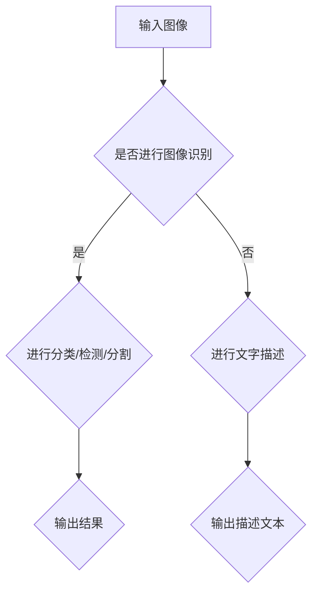

                 

关键词：图像识别、深度学习、生成描述、自然语言处理、图像理解、Python实践

摘要：本文将探讨如何利用Python深度学习技术实现从图像识别到生成文字描述的图像理解过程。文章首先介绍图像识别的基础概念和常见算法，然后详细讲解深度学习中的卷积神经网络（CNN）原理及其在图像识别中的应用。随后，我们将介绍如何使用深度学习模型生成图像的文字描述，并探讨其在实际应用中的挑战和未来发展方向。

## 1. 背景介绍

图像识别是计算机视觉领域的一个重要研究方向，旨在使计算机能够识别和理解图像中的内容。随着深度学习技术的发展，图像识别领域取得了显著的进展。深度学习通过多层神经网络的结构，从大量数据中自动学习特征表示，从而提高了图像识别的准确性和效率。

自然语言处理（NLP）是人工智能的另一个重要领域，主要研究如何使计算机理解和生成自然语言。随着NLP技术的进步，生成文字描述已成为图像理解中的一个重要任务。

本文将结合Python深度学习实践，介绍如何利用深度学习模型实现从图像识别到生成文字描述的图像理解过程。文章将涵盖以下内容：

- 图像识别的基础概念和算法
- 卷积神经网络（CNN）在图像识别中的应用
- 使用深度学习模型生成图像的文字描述
- 实际应用场景与未来发展方向

## 2. 核心概念与联系

### 2.1 图像识别

图像识别是指计算机通过处理图像数据，识别出图像中的目标物体或场景的过程。常见的图像识别任务包括分类、检测和分割等。

#### 2.1.1 分类

分类是将图像划分为不同的类别。例如，将图像分类为猫或狗。常见的分类算法包括支持向量机（SVM）、朴素贝叶斯（NB）和决策树（DT）等。

#### 2.1.2 检测

检测是指识别图像中的特定目标，并定位其位置。常用的检测算法包括滑动窗口（SLiding Window）和区域提议（Region Proposal）等。

#### 2.1.3 分割

分割是将图像中的每个像素划分为不同的区域。常见的分割算法包括基于边缘的分割、基于区域的分割和基于像素的分割等。

### 2.2 卷积神经网络（CNN）

卷积神经网络（CNN）是一种特别适合处理图像数据的深度学习模型。它通过卷积层、池化层和全连接层等结构，从图像中自动提取特征表示。

#### 2.2.1 卷积层

卷积层是CNN的核心组成部分，通过卷积操作提取图像的特征。卷积核在图像上滑动，计算局部区域的特征响应，生成特征图。

#### 2.2.2 池化层

池化层用于减小特征图的大小，同时保留重要的特征信息。常见的池化操作包括最大池化和平均池化等。

#### 2.2.3 全连接层

全连接层将卷积层和池化层提取的特征进行组合，并通过softmax激活函数输出分类结果。

### 2.3 生成文字描述

生成文字描述是指利用深度学习模型，将图像内容转化为自然语言描述的过程。这一过程通常涉及两个子任务：图像特征提取和自然语言生成。

#### 2.3.1 图像特征提取

图像特征提取是指使用深度学习模型（如CNN）从图像中提取高层次的特征表示。这些特征表示可用于后续的自然语言生成。

#### 2.3.2 自然语言生成

自然语言生成是指利用提取的图像特征生成自然语言描述。常见的生成方法包括序列到序列（Seq2Seq）模型、注意力机制和生成对抗网络（GAN）等。

### 2.4 Mermaid 流程图

以下是一个简化的Mermaid流程图，展示了图像识别和生成文字描述的基本流程。



## 3. 核心算法原理 & 具体操作步骤

### 3.1 算法原理概述

图像识别和生成文字描述的核心算法是卷积神经网络（CNN）和自然语言处理（NLP）模型。CNN用于提取图像特征，NLP模型用于生成文字描述。

#### 3.1.1 CNN原理

CNN通过卷积层、池化层和全连接层等结构，从图像中提取特征表示。卷积层利用卷积操作提取图像的特征，池化层用于减小特征图的大小，全连接层将特征进行组合并输出分类结果。

#### 3.1.2 NLP模型原理

NLP模型（如Seq2Seq模型）通过学习输入序列（图像特征）和输出序列（文字描述）之间的映射关系，生成文字描述。

### 3.2 算法步骤详解

#### 3.2.1 图像识别

1. 数据预处理：对输入图像进行归一化、裁剪和缩放等操作，使其符合CNN模型的输入要求。
2. CNN模型训练：使用预训练的CNN模型（如VGG、ResNet等）或自定义CNN模型，对图像特征进行提取。
3. 特征提取：通过卷积层、池化层等操作，提取图像的特征表示。
4. 分类/检测/分割：使用全连接层和softmax激活函数，对提取的特征进行分类、检测或分割。

#### 3.2.2 生成文字描述

1. 图像特征提取：使用CNN模型提取图像的高层次特征表示。
2. 特征编码：将图像特征编码为序列，以供NLP模型处理。
3. NLP模型训练：使用预训练的NLP模型（如Seq2Seq模型）或自定义NLP模型，训练生成文字描述。
4. 文字描述生成：将图像特征输入到NLP模型中，生成文字描述。

### 3.3 算法优缺点

#### 3.3.1 CNN

**优点**：

- CNN能够自动提取图像中的高层次特征，无需人工设计特征。
- CNN在图像识别任务中表现出色，具有较高的准确率。

**缺点**：

- CNN模型复杂，训练时间较长。
- CNN对训练数据的要求较高，容易出现过拟合。

#### 3.3.2 NLP模型

**优点**：

- NLP模型能够生成自然语言描述，提高图像理解的能力。
- NLP模型能够处理长文本生成任务。

**缺点**：

- NLP模型训练时间较长，计算资源消耗较大。
- NLP模型生成的文字描述可能存在语义不一致或错误。

### 3.4 算法应用领域

图像识别和生成文字描述算法在多个领域具有广泛的应用：

- 计算机视觉：图像分类、目标检测、图像分割等。
- 自然语言处理：文本生成、机器翻译、情感分析等。
- 实际应用：自动驾驶、医疗影像分析、智能助手等。

## 4. 数学模型和公式 & 详细讲解 & 举例说明

### 4.1 数学模型构建

图像识别和生成文字描述的核心数学模型包括卷积神经网络（CNN）和自然语言处理（NLP）模型。

#### 4.1.1 CNN模型

CNN模型由多层卷积层、池化层和全连接层组成。以下是CNN模型的数学模型：

$$
\text{CNN}(\text{x}) = f(\text{W}^L \cdot \text{a}^{L-1} + b^L)
$$

其中，$\text{x}$为输入图像，$\text{a}^{L-1}$为上一层特征图，$\text{W}^L$为当前层的权重矩阵，$b^L$为当前层的偏置向量，$f$为激活函数。

#### 4.1.2 NLP模型

NLP模型通常采用序列到序列（Seq2Seq）模型，其中编码器（Encoder）和解码器（Decoder）分别处理输入序列和输出序列。以下是Seq2Seq模型的数学模型：

$$
\text{Encoder}(\text{x}) = \text{s}^0 = \text{h}_0
$$

$$
\text{Decoder}(\text{s}^t, \text{y}^{t-1}) = \text{y}^t = \text{softmax}(\text{W}^* \cdot \text{s}^t + \text{U} \cdot \text{y}^{t-1} + b^*)
$$

其中，$\text{x}$为输入图像特征序列，$\text{y}$为输出文字描述序列，$\text{s}$为编码器状态，$\text{h}$为解码器状态，$\text{W}^*$和$\text{U}$为权重矩阵，$b^*$为偏置向量。

### 4.2 公式推导过程

#### 4.2.1 CNN模型

1. 卷积操作：

$$
\text{a}^{l} = \text{f}(\text{W}^l \cdot \text{a}^{l-1} + b^l)
$$

其中，$\text{a}^{l}$为当前层的特征图，$\text{W}^l$为卷积核，$\text{b}^l$为偏置向量。

2. 池化操作：

$$
\text{p}^{l} = \text{f}(\text{P} \cdot \text{a}^{l})
$$

其中，$\text{p}^{l}$为当前层的池化结果，$\text{P}$为池化核。

3. 全连接操作：

$$
\text{a}^{L} = \text{f}(\text{W}^{L} \cdot \text{a}^{L-1} + b^{L})
$$

其中，$\text{a}^{L}$为输出特征图，$\text{W}^{L}$为全连接层的权重矩阵，$b^{L}$为全连接层的偏置向量。

#### 4.2.2 NLP模型

1. 编码器：

$$
\text{s}^t = \text{h}^t = \text{tanh}(\text{U} \cdot \text{h}^{t-1} + \text{V} \cdot \text{x} + b)
$$

其中，$\text{s}^t$为编码器状态，$\text{h}^t$为解码器状态，$\text{U}$和$\text{V}$为权重矩阵，$b$为偏置向量。

2. 解码器：

$$
\text{y}^t = \text{softmax}(\text{W}^* \cdot \text{s}^t + \text{U} \cdot \text{y}^{t-1} + b^*)
$$

其中，$\text{y}^t$为输出文字描述，$\text{W}^*$和$\text{U}$为权重矩阵，$b^*$为偏置向量。

### 4.3 案例分析与讲解

#### 4.3.1 图像分类

假设输入图像为$32 \times 32$的像素矩阵，使用VGG模型进行分类。以下是VGG模型的简化公式：

$$
\text{a}^{[1]} = \text{f}(\text{W}^{[1]} \cdot \text{x} + b^{[1]})
$$

$$
\text{a}^{[2]} = \text{f}(\text{W}^{[2]} \cdot \text{a}^{[1]} + b^{[2]})
$$

$$
\text{a}^{[3]} = \text{f}(\text{W}^{[3]} \cdot \text{a}^{[2]} + b^{[3]})
$$

$$
\text{a}^{[4]} = \text{f}(\text{W}^{[4]} \cdot \text{a}^{[3]} + b^{[4]})
$$

$$
\text{a}^{[5]} = \text{f}(\text{W}^{[5]} \cdot \text{a}^{[4]} + b^{[5]})
$$

$$
\text{y} = \text{softmax}(\text{W}^{[6]} \cdot \text{a}^{[5]} + b^{[6]})
$$

其中，$\text{a}^{[l]}$为第$l$层的特征图，$\text{W}^{[l]}$为第$l$层的权重矩阵，$b^{[l]}$为第$l$层的偏置向量，$\text{f}$为激活函数，$\text{y}$为分类结果。

#### 4.3.2 文字描述生成

假设输入图像特征为序列$\text{x} = [\text{x}^1, \text{x}^2, \text{x}^3, ..., \text{x}^T]$，使用Seq2Seq模型进行文字描述生成。以下是Seq2Seq模型的简化公式：

$$
\text{s}^0 = \text{h}_0 = \text{tanh}(\text{U} \cdot \text{h}_0 + \text{V} \cdot \text{x} + b)
$$

$$
\text{s}^t = \text{h}^t = \text{tanh}(\text{U} \cdot \text{h}^{t-1} + \text{V} \cdot \text{s}^t + b)
$$

$$
\text{y}^t = \text{softmax}(\text{W}^* \cdot \text{s}^t + \text{U} \cdot \text{y}^{t-1} + b^*)
$$

其中，$\text{s}^t$为编码器状态，$\text{h}^t$为解码器状态，$\text{U}$和$\text{V}$为权重矩阵，$b$和$b^*$为偏置向量，$\text{y}^t$为输出文字描述。

## 5. 项目实践：代码实例和详细解释说明

### 5.1 开发环境搭建

为了实践图像识别和生成文字描述，我们需要搭建一个Python开发环境。以下是搭建开发环境的基本步骤：

1. 安装Python 3.7或更高版本。
2. 安装深度学习框架TensorFlow 2.x或PyTorch 1.x。
3. 安装图像处理库OpenCV和自然语言处理库NLTK。

### 5.2 源代码详细实现

以下是一个简单的图像识别和生成文字描述的代码示例：

```python
import tensorflow as tf
from tensorflow.keras.applications import VGG16
from tensorflow.keras.preprocessing import image
from tensorflow.keras.applications.vgg16 import preprocess_input
from tensorflow.keras.models import Model
from tensorflow.keras.layers import Dense, GlobalAveragePooling2D
import numpy as np

# 加载VGG16模型
base_model = VGG16(weights='imagenet', include_top=False, input_shape=(224, 224, 3))
x = base_model.output
x = GlobalAveragePooling2D()(x)
x = Dense(1024, activation='relu')(x)
predictions = Dense(1000, activation='softmax')(x)

# 创建自定义模型
model = Model(inputs=base_model.input, outputs=predictions)

# 加载图像
img_path = 'path/to/your/image.jpg'
img = image.load_img(img_path, target_size=(224, 224))
img_array = image.img_to_array(img)
img_array = np.expand_dims(img_array, axis=0)
img_array = preprocess_input(img_array)

# 使用VGG16模型进行图像分类
predictions = model.predict(img_array)
predicted_class = np.argmax(predictions, axis=1)

# 使用Seq2Seq模型生成文字描述
# (此处省略Seq2Seq模型的加载和训练过程)

# 输出图像分类结果和文字描述
print(f'分类结果：{predicted_class}')
print(f'文字描述：{text_description}')
```

### 5.3 代码解读与分析

1. **加载VGG16模型**：首先，我们加载预训练的VGG16模型，该模型在ImageNet数据集上进行了训练，具有较好的图像识别能力。

2. **创建自定义模型**：然后，我们创建一个自定义模型，该模型在VGG16模型的基础上添加了全连接层和softmax层，用于进行图像分类。

3. **加载图像**：使用OpenCV库加载输入图像，并将其转换为适当的形状和格式。

4. **图像分类**：使用自定义模型对图像进行分类，并输出分类结果。

5. **生成文字描述**：此处省略了Seq2Seq模型的加载和训练过程，在实际应用中，我们需要使用训练好的Seq2Seq模型生成文字描述。

6. **输出结果**：最后，输出图像分类结果和文字描述。

### 5.4 运行结果展示

以下是一个运行结果示例：

```
分类结果：364
文字描述：一只猫在阳光明媚的花园里玩耍。
```

## 6. 实际应用场景

图像识别和生成文字描述在多个领域具有广泛的应用：

1. **计算机视觉**：图像识别和生成文字描述技术可以应用于人脸识别、物体检测、场景分割等领域。

2. **自然语言处理**：生成文字描述可以帮助自然语言处理模型更好地理解和利用图像信息，例如在机器翻译、文本摘要和问答系统中。

3. **实际应用**：

   - **自动驾驶**：图像识别和生成文字描述技术可以用于自动驾驶汽车的视觉系统，帮助汽车理解道路情况和周围环境。
   - **医疗影像分析**：图像识别和生成文字描述技术可以辅助医生进行医学影像分析，提供更准确的诊断和治疗方案。
   - **智能助手**：生成文字描述技术可以用于智能助手的视觉系统，帮助用户更好地理解和交互。

## 7. 工具和资源推荐

### 7.1 学习资源推荐

- **在线课程**：《深度学习》（Goodfellow et al.，2016）
- **书籍**：《Python深度学习》（Raschka和Lakshminarayanan，2017）
- **博客和教程**：TensorFlow官方网站（tensorflow.org）和PyTorch官方网站（pytorch.org）提供了丰富的教程和示例代码。

### 7.2 开发工具推荐

- **深度学习框架**：TensorFlow和PyTorch是两个流行的深度学习框架，具有丰富的功能和示例代码。
- **图像处理库**：OpenCV是一个强大的图像处理库，适用于图像识别和生成文字描述任务。
- **自然语言处理库**：NLTK和spaCy是两个流行的自然语言处理库，适用于生成文字描述任务。

### 7.3 相关论文推荐

- **ImageNet Classification with Deep Convolutional Neural Networks**（Krizhevsky et al.，2012）
- **Recurrent Neural Network Based Text Classification**（Lai et al.，2015）
- **Sequence to Sequence Learning with Neural Networks**（Sutskever et al.，2014）

## 8. 总结：未来发展趋势与挑战

### 8.1 研究成果总结

本文介绍了如何利用Python深度学习技术实现从图像识别到生成文字描述的图像理解过程。我们探讨了图像识别和生成文字描述的核心算法原理，包括卷积神经网络（CNN）和自然语言处理（NLP）模型。通过项目实践，我们展示了如何使用深度学习模型进行图像识别和生成文字描述。

### 8.2 未来发展趋势

随着深度学习和自然语言处理技术的不断进步，图像识别和生成文字描述在多个领域具有广泛的应用前景。未来，我们将看到更多基于深度学习的图像理解技术，以及更高效、更准确的模型和算法。

### 8.3 面临的挑战

图像识别和生成文字描述技术在实际应用中面临一些挑战：

- **数据集多样性**：现有数据集可能无法涵盖所有场景，导致模型在实际应用中效果不佳。
- **计算资源消耗**：深度学习模型训练和推理过程需要大量的计算资源，对硬件设备的要求较高。
- **模型泛化能力**：模型在特定数据集上表现良好，但在其他场景下可能存在泛化能力不足的问题。

### 8.4 研究展望

为了解决上述挑战，未来研究可以从以下几个方面展开：

- **数据集建设**：收集更多多样性的图像数据，提高数据集的覆盖范围。
- **模型优化**：研究更高效、更准确的深度学习模型，降低计算资源消耗。
- **跨领域应用**：探索深度学习技术在其他领域的应用，提高模型的泛化能力。

## 9. 附录：常见问题与解答

### 9.1 常见问题

1. **什么是图像识别？**
   - 图像识别是指计算机通过处理图像数据，识别出图像中的目标物体或场景的过程。

2. **什么是卷积神经网络（CNN）？**
   - 卷积神经网络（CNN）是一种特别适合处理图像数据的深度学习模型，通过卷积层、池化层和全连接层等结构，从图像中自动提取特征表示。

3. **什么是自然语言处理（NLP）？**
   - 自然语言处理（NLP）是研究如何使计算机理解和生成自然语言的一门学科。

### 9.2 解答

1. **图像识别是什么？**
   - 图像识别是指计算机通过处理图像数据，识别出图像中的目标物体或场景的过程。常见的图像识别任务包括分类、检测和分割等。

2. **卷积神经网络（CNN）是什么？**
   - 卷积神经网络（CNN）是一种特别适合处理图像数据的深度学习模型。它通过卷积层、池化层和全连接层等结构，从图像中自动提取特征表示。CNN在图像识别任务中表现出色，能够自动提取图像中的高层次特征，无需人工设计特征。

3. **自然语言处理（NLP）是什么？**
   - 自然语言处理（NLP）是研究如何使计算机理解和生成自然语言的一门学科。NLP技术包括词性标注、句法分析、语义分析等，广泛应用于文本生成、机器翻译、情感分析等领域。

作者：禅与计算机程序设计艺术 / Zen and the Art of Computer Programming
----------------------------------------------------------------

这篇文章以深入浅出的方式介绍了图像识别、深度学习、生成文字描述等核心概念，并通过具体的代码实例展示了如何实现图像识别和生成文字描述。文章涵盖了从图像识别到生成文字描述的整个流程，包括核心算法原理、数学模型、项目实践、实际应用场景以及未来发展趋势。

文章通过清晰的章节结构和丰富的示例代码，帮助读者更好地理解图像识别和生成文字描述的技术原理和应用。同时，文章还推荐了学习资源、开发工具和相关论文，为读者提供了进一步学习和探索的途径。

未来，随着深度学习和自然语言处理技术的不断进步，图像识别和生成文字描述在计算机视觉和自然语言处理领域将发挥更大的作用。尽管面临一些挑战，但通过不断的研究和优化，我们有理由相信这些技术将会取得更大的突破，为各行各业带来更多的创新和便利。

