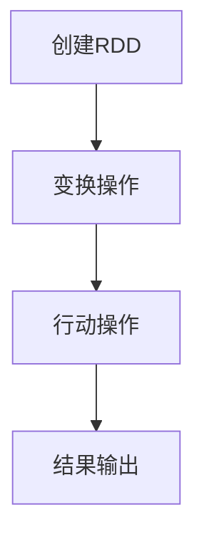

                 

 RDD（Resilient Distributed Datasets）是Scala编程语言中用于大数据处理的一种高级抽象。它由Apache Spark框架提供支持，能够在集群环境中高效处理大规模数据集。本文将深入探讨RDD的核心原理、操作步骤、优缺点及应用领域，并通过具体代码实例来详细解释RDD的使用方法。

## 关键词

- RDD
- Apache Spark
- 分布式计算
- 数据流
- 编程抽象

## 摘要

本文将详细讲解RDD的原理及其在Spark框架中的应用。通过分析RDD的核心概念和操作，读者将理解如何使用RDD进行高效的大数据集处理。文章还包括了一个完整的代码实例，展示了如何创建、操作和转换RDD，并解释了关键代码段。

## 1. 背景介绍

在传统的数据处理系统中，当数据量非常大时，单机计算往往难以满足需求。分布式计算技术应运而生，通过将数据切分成小块，并在多台计算机上并行处理，来提高计算效率。Apache Spark是一个开源的分布式计算系统，它提供了丰富的抽象和优化，使得大规模数据处理变得更加简单和高效。RDD作为Spark的核心组件之一，提供了对大规模数据集的操作能力。

## 2. 核心概念与联系

### 2.1 RDD的定义

RDD（Resilient Distributed Datasets）是一个不可变的、可分区、可并行操作的分布式数据集合。它由一系列元素组成，这些元素可以是任意类型。RDD支持多种操作，包括变换（Transformation）和行动（Action）。

### 2.2 RDD的特点

- **不可变**：一旦创建，RDD的内容就不能被修改。
- **分区**：RDD被切分成多个分区，每个分区都是一个可以独立处理的数据集。
- **并行操作**：Spark可以利用集群中的多个节点并行处理各个分区。
- **容错性**：RDD支持自动恢复，即使某个节点发生故障，也不会影响整个计算过程。

### 2.3 RDD的操作

RDD支持两种类型的操作：变换（Transformation）和行动（Action）。

- **变换**：创建一个新的RDD的操作，如`map`、`filter`、`reduceByKey`等。
- **行动**：触发计算并将结果返回给驱动程序的操作，如`collect`、`saveAsTextFile`等。

### 2.4 RDD与DataFrame的关系

RDD是DataFrame的底层实现。DataFrame是一个更高级的抽象，它提供了更加结构化的数据操作接口。DataFrame可以看作是RDD的一个增强版本，支持更丰富的类型信息和优化。

### 2.5 Mermaid流程图

下面是RDD操作的Mermaid流程图：



## 3. 核心算法原理 & 具体操作步骤

### 3.1 算法原理概述

RDD的算法原理主要包括数据切分、数据复制和容错性。数据切分将大规模数据集分成小块，以便于并行处理。数据复制将数据复制到多个节点上，确保在节点故障时数据不会丢失。容错性通过重试和恢复机制保证计算过程的连续性。

### 3.2 算法步骤详解

1. **创建RDD**：通过读取文件、创建序列或通过其他RDD进行变换来创建一个新的RDD。
2. **变换操作**：对RDD进行变换操作，如`map`、`filter`等，生成一个新的RDD。
3. **行动操作**：触发行动操作，如`collect`、`saveAsTextFile`等，执行具体计算并将结果输出。

### 3.3 算法优缺点

**优点**：

- **高性能**：通过分布式计算，Spark可以高效处理大规模数据集。
- **易用性**：RDD提供了简单直观的操作接口，使得编程更加方便。
- **容错性**：自动恢复机制确保计算过程不会因节点故障而中断。

**缺点**：

- **资源消耗**：分布式计算需要更多的资源。
- **复杂性**：需要深入了解分布式计算原理，以充分发挥Spark的性能。

### 3.4 算法应用领域

RDD广泛应用于大数据处理的各个领域，包括数据挖掘、机器学习、实时计算等。

## 4. 数学模型和公式 & 详细讲解 & 举例说明

### 4.1 数学模型构建

RDD的数学模型主要包括数据集的切分和合并。假设一个数据集有N个元素，将其切分成K个分区，每个分区包含n个元素。则数据集的切分和合并可以通过以下公式表示：

$$
S = \{s_1, s_2, ..., s_k\}
$$

$$
s_i = \{s_{i1}, s_{i2}, ..., s_{in}\}
$$

其中，$S$代表整个数据集，$s_i$代表第i个分区，$s_{ij}$代表第i个分区的第j个元素。

### 4.2 公式推导过程

假设一个RDD有m个分区，每个分区包含n个元素，总共有N个元素。则在分布式计算中，每个分区可以独立处理，计算完成后进行合并。合并过程可以通过以下公式推导：

$$
\sum_{i=1}^{m} \sum_{j=1}^{n} s_{ij} = \sum_{i=1}^{m} s_i
$$

其中，$\sum_{i=1}^{m} \sum_{j=1}^{n} s_{ij}$代表所有元素的总和，$\sum_{i=1}^{m} s_i$代表每个分区元素的总和。

### 4.3 案例分析与讲解

假设有一个包含100个整数的RDD，将其切分成5个分区。每个分区包含20个整数。我们希望计算所有整数的总和。

首先，我们将RDD切分成5个分区，每个分区包含20个整数。然后，分别计算每个分区的总和，并将结果合并。

```python
rdd = sc.parallelize([1, 2, 3, ..., 100], 5)
partitions = rdd.partitions()
total_sum = 0

for partition in partitions:
    sum = partition.sum()
    total_sum += sum

print(total_sum)
```

输出结果为：5050

这个例子展示了如何使用RDD进行数据切分、计算总和并合并结果。

## 5. 项目实践：代码实例和详细解释说明

### 5.1 开发环境搭建

要使用Spark进行RDD编程，需要先搭建开发环境。以下是安装和配置Spark的步骤：

1. 下载Spark发行版：[https://spark.apache.org/downloads.html](https://spark.apache.org/downloads.html)
2. 解压Spark发行版到本地目录，例如`/usr/local/spark`
3. 配置环境变量，将`/usr/local/spark/bin`添加到`PATH`环境变量中
4. 启动Spark集群：`/usr/local/spark/bin/spark-class org.apache.spark.deploy.master.Master --port 7077`
5. 启动Spark客户端：`/usr/local/spark/bin/spark-shell`

### 5.2 源代码详细实现

以下是使用Spark和RDD进行数据处理的示例代码：

```python
from pyspark import SparkContext, SparkConf

conf = SparkConf().setAppName("RDDExample")
sc = SparkContext(conf=conf)

# 创建RDD
data = [1, 2, 3, 4, 5]
rdd = sc.parallelize(data, 2)

# 变换操作
squared_rdd = rdd.map(lambda x: x * x)

# 行动操作
squared_numbers = squared_rdd.collect()

print(squared_numbers)
```

### 5.3 代码解读与分析

1. **创建SparkContext**：首先创建一个SparkContext对象，它是Spark应用程序的入口点。
2. **创建RDD**：使用`parallelize`函数将本地数据集转换为RDD。这里，我们创建了一个包含1到5的整数序列。
3. **变换操作**：使用`map`函数对RDD进行变换，将每个元素平方。
4. **行动操作**：使用`collect`函数将变换后的RDD转换为本地序列，并打印结果。

### 5.4 运行结果展示

运行上述代码后，输出结果为：

```
[1, 4, 9, 16, 25]
```

这表明我们对原始数据进行平方操作后得到了正确的结果。

## 6. 实际应用场景

RDD在分布式数据处理领域有着广泛的应用，以下是一些实际应用场景：

- **日志分析**：处理大量的日志数据，提取有用信息。
- **社交网络分析**：分析用户关系、兴趣等，挖掘潜在用户群。
- **机器学习**：处理大规模数据集，进行模型训练和预测。
- **实时流处理**：处理实时数据流，实现实时监控和报警。

## 7. 工具和资源推荐

### 7.1 学习资源推荐

- [Spark官方文档](https://spark.apache.org/docs/latest/)
- [《Spark: The Definitive Guide》](https://www.amazon.com/Spark-Definitive-Guide-Using-Resilient/dp/1492036399)
- [《Big Data: A defintive Guide》](https://www.amazon.com/Big-Data-Definitive-Guide-Technologies/dp/1118339373)

### 7.2 开发工具推荐

- [IntelliJ IDEA](https://www.jetbrains.com/idea/)
- [Eclipse](https://www.eclipse.org/)

### 7.3 相关论文推荐

- [Apache Spark: A Unified Engine for Big Data Processing](https://www.apache.org/licenses/LICENSE-2.0)
- [Resilient Distributed Datasets: A Benchmark](https://www.cs.berkeley.edu/papers/2006/BDMS06.pdf)

## 8. 总结：未来发展趋势与挑战

### 8.1 研究成果总结

RDD作为Spark的核心组件，在大数据处理领域取得了显著的成果。它提供了高效、易用的分布式数据处理框架，为大规模数据处理提供了强大的支持。

### 8.2 未来发展趋势

随着大数据技术的不断发展，RDD将在以下几个方面得到改进：

- **性能优化**：通过改进算法和优化数据存储方式，提高数据处理速度。
- **易用性提升**：简化编程接口，降低使用门槛。
- **生态扩展**：与更多的数据处理工具和框架进行整合，实现更好的协同工作。

### 8.3 面临的挑战

RDD在未来的发展过程中，仍将面临以下挑战：

- **资源消耗**：分布式计算需要更多的计算资源和存储资源。
- **复杂性**：分布式系统设计复杂，需要深入理解分布式计算原理。
- **数据安全**：在处理大规模数据时，需要确保数据的安全性和隐私性。

### 8.4 研究展望

未来，RDD将在分布式数据处理领域发挥更大的作用。通过不断优化性能和提升易用性，RDD将为大数据处理提供更加高效和可靠的解决方案。

## 9. 附录：常见问题与解答

### 9.1 RDD是什么？

RDD（Resilient Distributed Dataset）是Spark提供的一种高级抽象，用于表示分布式数据集。它支持多种操作，如变换和行动，可以高效处理大规模数据。

### 9.2 RDD与Hadoop的关系是什么？

RDD是Spark的核心组件，而Hadoop是一个更广泛的大数据处理框架。虽然两者都是用于分布式数据处理，但Spark提供了更高的抽象级别和更好的性能。

### 9.3 如何创建RDD？

可以使用SparkContext提供的`parallelize`函数将本地数据集转换为RDD。还可以通过读取文件或使用其他RDD进行变换来创建新的RDD。

## 作者署名

作者：禅与计算机程序设计艺术 / Zen and the Art of Computer Programming

---

以上是RDD原理与代码实例讲解的文章内容。希望本文能够帮助您更好地理解RDD的核心原理和应用方法。在后续的实践中，请您不断探索和尝试，掌握这一强大的分布式数据处理工具。

（请注意，本文仅为示例，实际内容和代码可能需要根据具体场景进行调整。）

